# Android app examples

Native Android phone, tablet, foldable, and wearable interfaces.

Each entry pairs an attributed overview image and a measured panel anatomy with a per-product record: motion evidence, named states, an observed first-success journey, interaction and recovery behavior, accessibility observations, and provenance. Every number below is measured by `verify-reference-evidence.py`, and a record that is missing evidence says so in its own `evidence_gaps`.

**Examples:** 50  
**Images:** 50  
**Structural analyses:** 50  
**Records with no remaining gap:** 0  
**Records with named gaps:** 50 (150 gaps)  
**Motion provenance:** 50 owner-published media  
**Curated:** 2026-08-16  
**Visual source data:** [`sources.json`](sources.json)  
**Record index:** [`references.json`](references.json)  
**Cross-example synthesis:** [`full-reference.md`](full-reference.md)

| # | Reference image | Record | Motion evidence | Category | Interface structure | What to study |
|---:|---|---|---|---|---|---|
| 1 |  | [Google Keep](references/01-google-keep/README.md) · [official product](https://play.google.com/store/apps/details?id=com.google.android.keep) | owner-published media, 3 named gaps | Productivity | mobile-single-column: Single-column mobile hierarchy with top context and a vertically scrolling primary surface. Panels: toolbar/header (top); bottom navigation/action area (bottom); scrolling content or app screen (center). Density: low; confidence: medium. | Study the note-card grid, color and label organization, checklist transformation, and floating action button for rapid capture. |
| 2 |  | [Todoist](references/02-todoist/README.md) · [official product](https://play.google.com/store/apps/details?id=com.todoist) | owner-published media, 3 named gaps | Productivity | mobile-single-column: Single-column mobile hierarchy with top context and a vertically scrolling primary surface. Panels: toolbar/header (top); bottom navigation/action area (bottom); scrolling content or app screen (center). Density: low; confidence: medium. | Study quick task entry with inline dates and priorities, plus swipe actions that expose scheduling and completion controls. |
| 3 | <a href="https://play.google.com/store/apps/details?id=notion.id">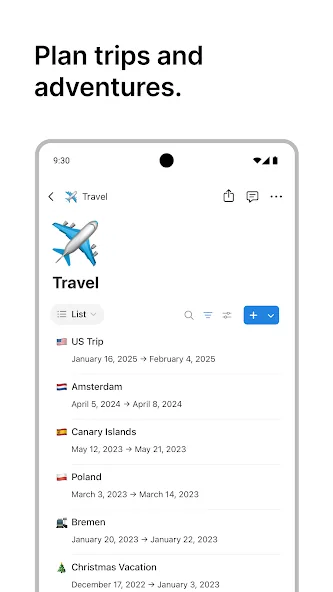</a> | [Notion](references/03-notion/README.md) · [official product](https://play.google.com/store/apps/details?id=notion.id) | owner-published media, 3 named gaps | Productivity | mobile-single-column: Single-column mobile hierarchy with top context and a vertically scrolling primary surface. Panels: toolbar/header (top); bottom navigation/action area (bottom); scrolling content or app screen (center). Density: low; confidence: medium. | Study the mobile block editor, slash-command insertion, nested page navigation, and adaptation of dense workspaces to a narrow screen. |
| 4 |  | [Trello](references/04-trello/README.md) · [official product](https://play.google.com/store/apps/details?id=com.trello) | owner-published media, 3 named gaps | Productivity | mobile-single-column: Single-column mobile hierarchy with top context and a vertically scrolling primary surface. Panels: toolbar/header (top); bottom navigation/action area (bottom); scrolling content or app screen (center). Density: low; confidence: medium. | Study horizontal board navigation and drag-and-drop cards across lists, with card details presented as a focused editing surface. |
| 5 | <a href="https://play.google.com/store/apps/details?id=com.microsoft.office.officehubrow">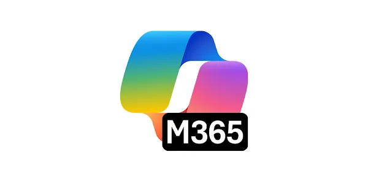</a> | [Microsoft 365 Copilot](references/05-microsoft-365-copilot/README.md) · [official product](https://play.google.com/store/apps/details?id=com.microsoft.office.officehubrow) | owner-published media, 3 named gaps | Productivity | mobile-single-column: Single-column mobile hierarchy with top context and a vertically scrolling primary surface. Panels: toolbar/header (top); bottom navigation/action area (bottom); scrolling content or app screen (center). Density: low; confidence: medium. | Study the unified document hub, prominent create action, file-type switching, and progressive disclosure across multiple productivity tools. |
| 6 | <a href="https://play.google.com/store/apps/details?id=com.google.android.calendar">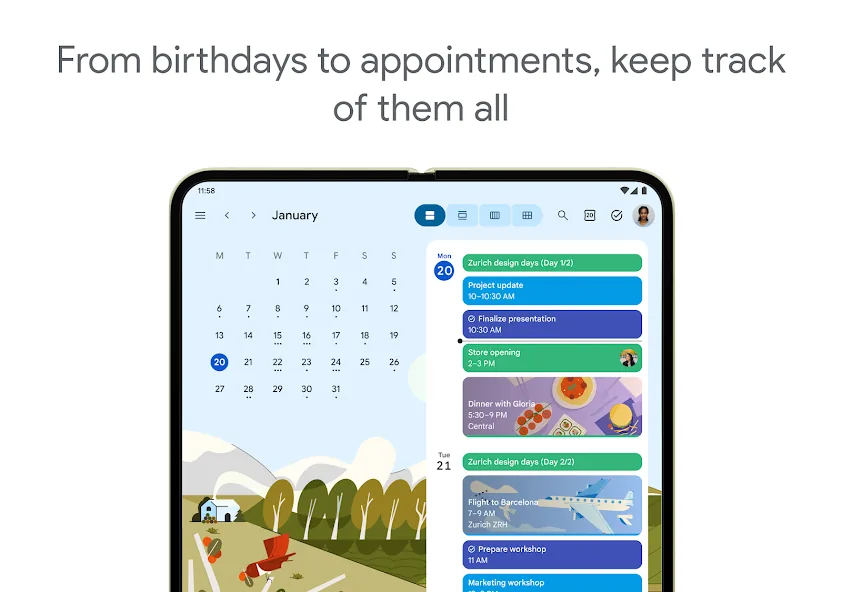</a> | [Google Calendar](references/06-google-calendar/README.md) · [official product](https://play.google.com/store/apps/details?id=com.google.android.calendar) | owner-published media, 3 named gaps | Productivity | mobile-single-column: Single-column mobile hierarchy with top context and a vertically scrolling primary surface. Panels: toolbar/header (top); bottom navigation/action area (bottom); scrolling content or app screen (center). Density: low; confidence: medium. | Study switching among schedule, day, week, and month views, plus event creation through a compact expanding action menu. |
| 7 | <a href="https://play.google.com/store/apps/details?id=com.ticktick.task">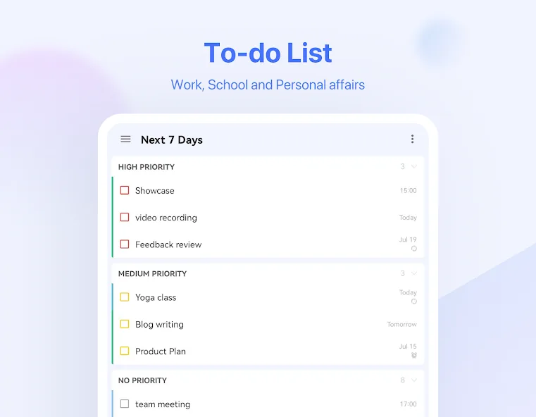</a> | [TickTick](references/07-ticktick/README.md) · [official product](https://play.google.com/store/apps/details?id=com.ticktick.task) | owner-published media, 3 named gaps | Productivity | mobile-single-column: Single-column mobile hierarchy with top context and a vertically scrolling primary surface. Panels: toolbar/header (top); scrolling content or app screen (center). Density: low; confidence: medium. | Study the combined task-and-calendar model, smart-list navigation, date parsing, and habit progress presented beside ordinary to-dos. |
| 8 | <a href="https://play.google.com/store/apps/details?id=com.evernote">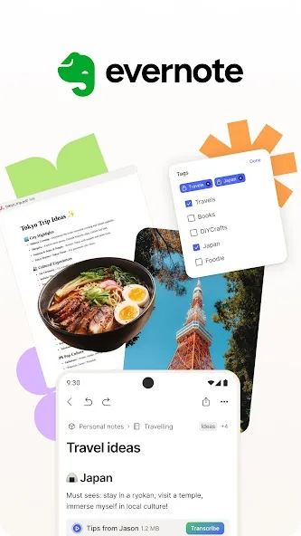</a> | [Evernote](references/08-evernote/README.md) · [official product](https://play.google.com/store/apps/details?id=com.evernote) | owner-published media, 3 named gaps | Productivity | mobile-single-column: Single-column mobile hierarchy with top context and a vertically scrolling primary surface. Panels: toolbar/header (top); bottom navigation/action area (bottom); scrolling content or app screen (center). Density: medium; confidence: medium. | Study notebook and tag navigation, mixed-media note composition, and the creation menu for scans, tasks, text, and attachments. |
| 9 | <a href="https://play.google.com/store/apps/details?id=com.whatsapp">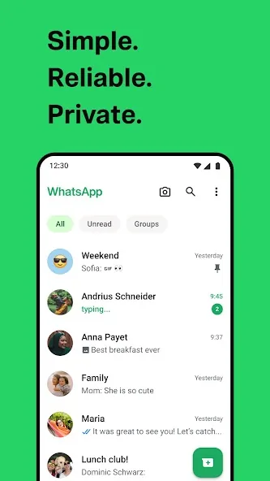</a> | [WhatsApp Messenger](references/09-whatsapp-messenger/README.md) · [official product](https://play.google.com/store/apps/details?id=com.whatsapp) | owner-published media, 3 named gaps | Communication | mobile-single-column: Single-column mobile hierarchy with top context and a vertically scrolling primary surface. Panels: toolbar/header (top); bottom navigation/action area (bottom); scrolling content or app screen (center). Density: low; confidence: medium. | Study the chat list, attachment sheet, voice-message recording gesture, message status indicators, and media-rich conversation layout. |
| 10 | <a href="https://play.google.com/store/apps/details?id=org.thoughtcrime.securesms">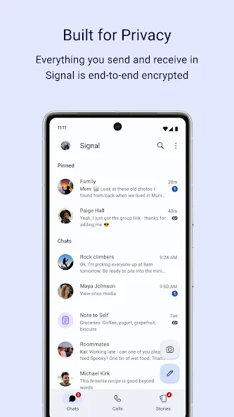</a> | [Signal Private Messenger](references/10-signal-private-messenger/README.md) · [official product](https://play.google.com/store/apps/details?id=org.thoughtcrime.securesms) | owner-published media, 3 named gaps | Communication | mobile-single-column: Single-column mobile hierarchy with top context and a vertically scrolling primary surface. Panels: toolbar/header (top); bottom navigation/action area (bottom); scrolling content or app screen (center). Density: medium; confidence: medium. | Study privacy status communication, disappearing-message controls, secure-call transitions, and restrained metadata in the conversation view. |
| 11 | <a href="https://play.google.com/store/apps/details?id=org.telegram.messenger">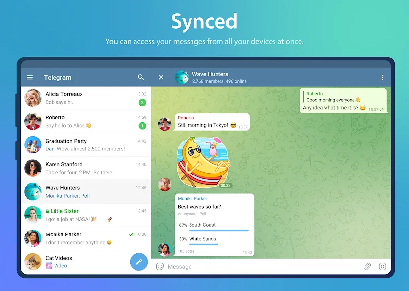</a> | [Telegram](references/11-telegram/README.md) · [official product](https://play.google.com/store/apps/details?id=org.telegram.messenger) | owner-published media, 3 named gaps | Communication | mobile-single-column: Single-column mobile hierarchy with top context and a vertically scrolling primary surface. Panels: toolbar/header (top); bottom navigation/action area (bottom); scrolling content or app screen (center). Density: low; confidence: medium. | Study the navigation drawer, chat folders, pinned conversations, message action menu, and scalable presentation of channels and groups. |
| 12 | <a href="https://play.google.com/store/apps/details?id=com.Slack">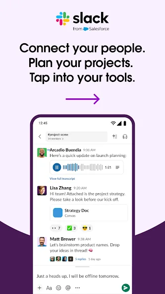</a> | [Slack](references/12-slack/README.md) · [official product](https://play.google.com/store/apps/details?id=com.Slack) | owner-published media, 3 named gaps | Communication | mobile-single-column: Single-column mobile hierarchy with top context and a vertically scrolling primary surface. Panels: toolbar/header (top); scrolling content or app screen (center). Density: medium; confidence: medium. | Study workspace switching, channel and thread hierarchy, mention badges, and the message composer’s integration of files and shortcuts. |
| 13 | <a href="https://play.google.com/store/apps/details?id=com.discord">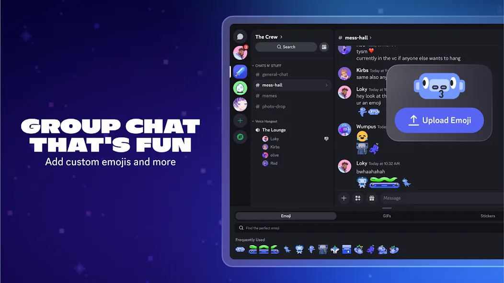</a> | [Discord](references/13-discord/README.md) · [official product](https://play.google.com/store/apps/details?id=com.discord) | owner-published media, 3 named gaps | Communication | mobile-single-column: Single-column mobile hierarchy with top context and a vertically scrolling primary surface. Panels: toolbar/header (top); bottom navigation/action area (bottom); scrolling content or app screen (center). Density: low; confidence: medium. | Study server and channel hierarchy, persistent voice-room state, member presence, and transitions between text, voice, and media contexts. |
| 14 | <a href="https://play.google.com/store/apps/details?id=com.google.android.apps.messaging">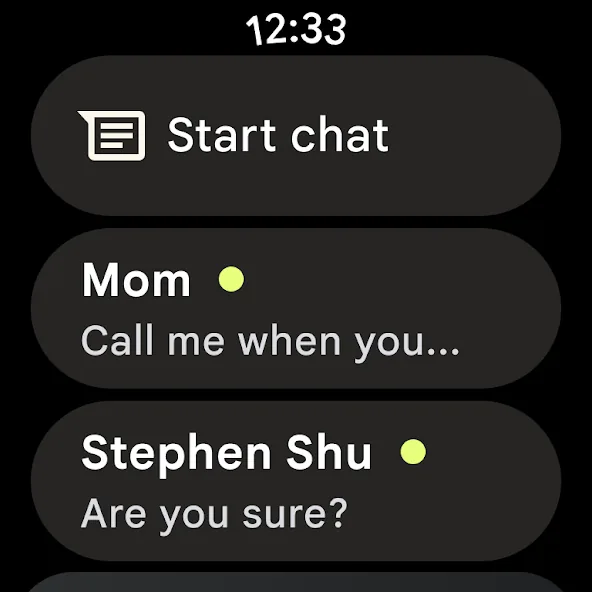</a> | [Google Messages](references/14-google-messages/README.md) · [official product](https://play.google.com/store/apps/details?id=com.google.android.apps.messaging) | owner-published media, 3 named gaps | Communication | mobile-single-column: Single-column mobile hierarchy with top context and a vertically scrolling primary surface. Panels: toolbar/header (top); bottom navigation/action area (bottom); scrolling content or app screen (center). Density: low; confidence: medium. | Study conversation search, RCS delivery state, contact chips, attachment selection, and Material-style message composition and reactions. |
| 15 | <a href="https://play.google.com/store/apps/details?id=us.zoom.videomeetings">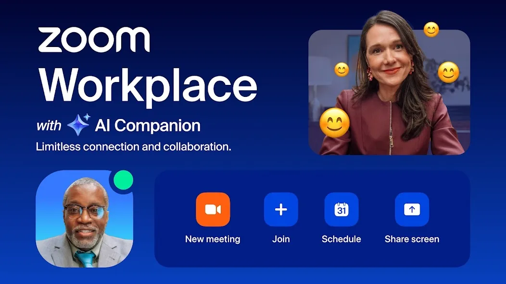</a> | [Zoom Workplace](references/15-zoom-workplace/README.md) · [official product](https://play.google.com/store/apps/details?id=us.zoom.videomeetings) | owner-published media, 3 named gaps | Communication | mobile-single-column: Single-column mobile hierarchy with top context and a vertically scrolling primary surface. Panels: toolbar/header (top); bottom navigation/action area (bottom); scrolling content or app screen (center). Density: low; confidence: medium. | Study pre-join device checks, in-call control visibility, participant management, and bottom-sheet handling of secondary meeting actions. |
| 16 |  | [Google Wallet](references/16-google-wallet/README.md) · [official product](https://play.google.com/store/apps/details?id=com.google.android.apps.walletnfcrel) | owner-published media, 3 named gaps | Finance | mobile-single-column: Single-column mobile hierarchy with top context and a vertically scrolling primary surface. Panels: toolbar/header (top); scrolling content or app screen (center). Density: low; confidence: medium. | Study the stacked card carousel, tap-to-pay readiness cues, pass grouping, and concise transaction details for glanceable use. |
| 17 |  | [PayPal](references/17-paypal/README.md) · [official product](https://play.google.com/store/apps/details?id=com.paypal.android.p2pmobile) | owner-published media, 3 named gaps | Finance | mobile-single-column: Single-column mobile hierarchy with top context and a vertically scrolling primary surface. Panels: toolbar/header (top); bottom navigation/action area (bottom); scrolling content or app screen (center). Density: low; confidence: medium. | Study send-and-request flows, recipient selection, amount entry, confirmation states, and the activity feed’s transaction-status hierarchy. |
| 18 |  | [Wise](references/18-wise/README.md) · [official product](https://play.google.com/store/apps/details?id=com.transferwise.android) | owner-published media, 3 named gaps | Finance | mobile-single-column: Single-column mobile hierarchy with top context and a vertically scrolling primary surface. Panels: toolbar/header (top); bottom navigation/action area (bottom); scrolling content or app screen (center). Density: low; confidence: medium. | Study multi-currency account cards and the transfer quote, which separates amount, fee, exchange rate, and recipient outcome before confirmation. |
| 19 |  | [Revolut](references/19-revolut/README.md) · [official product](https://play.google.com/store/apps/details?id=com.revolut.revolut) | owner-published media, 3 named gaps | Finance | mobile-single-column: Single-column mobile hierarchy with top context and a vertically scrolling primary surface. Panels: toolbar/header (top); bottom navigation/action area (bottom); scrolling content or app screen (center). Density: low; confidence: medium. | Study the modular account dashboard, currency switching, analytics drill-down, and progressive confirmation used for financial actions. |
| 20 | <a href="https://play.google.com/store/apps/details?id=com.Splitwise.SplitwiseMobile">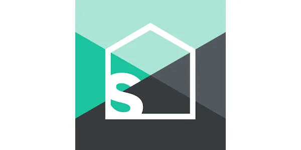</a> | [Splitwise](references/20-splitwise/README.md) · [official product](https://play.google.com/store/apps/details?id=com.Splitwise.SplitwiseMobile) | owner-published media, 3 named gaps | Finance | mobile-single-column: Single-column mobile hierarchy with top context and a vertically scrolling primary surface. Panels: toolbar/header (top); bottom navigation/action area (bottom); scrolling content or app screen (center). Density: low; confidence: medium. | Study group expense entry, payer and participant allocation, running-balance summaries, and the simplified settle-up interaction. |
| 21 |  | [YNAB](references/21-ynab/README.md) · [official product](https://play.google.com/store/apps/details?id=com.youneedabudget.evergreen.app) | owner-published media, 3 named gaps | Finance | mobile-single-column: Single-column mobile hierarchy with top context and a vertically scrolling primary surface. Panels: toolbar/header (top); bottom navigation/action area (bottom); scrolling content or app screen (center). Density: medium; confidence: medium. | Study category-based budget allocation and the relationship among assigned, activity, and available amounts in a compact ledger interface. |
| 22 | <a href="https://play.google.com/store/apps/details?id=com.fitbit.FitbitMobile">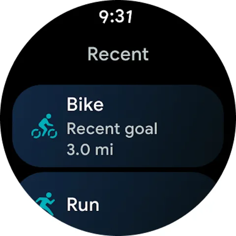</a> | [Fitbit](references/22-fitbit/README.md) · [official product](https://play.google.com/store/apps/details?id=com.fitbit.FitbitMobile) | owner-published media, 3 named gaps | Health and fitness | mobile-single-column: Single-column mobile hierarchy with top context and a vertically scrolling primary surface. Panels: toolbar/header (top); bottom navigation/action area (bottom); scrolling content or app screen (center). Density: low; confidence: medium. | Study the Today dashboard’s metric cards, goal progress, trend drill-down, and prioritization of frequently checked health signals. |
| 23 | <a href="https://play.google.com/store/apps/details?id=com.google.android.apps.fitness">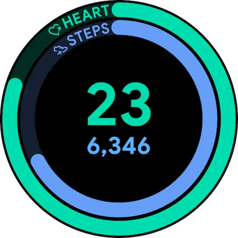</a> | [Google Fit](references/23-google-fit/README.md) · [official product](https://play.google.com/store/apps/details?id=com.google.android.apps.fitness) | owner-published media, 3 named gaps | Health and fitness | mobile-single-column: Single-column mobile hierarchy with top context and a vertically scrolling primary surface. Panels: toolbar/header (top); bottom navigation/action area (bottom); scrolling content or app screen (center). Density: low; confidence: medium. | Study the activity rings, journal timeline, metric detail charts, and visual linkage between daily movement and longer-term goals. |
| 24 | <a href="https://play.google.com/store/apps/details?id=com.strava">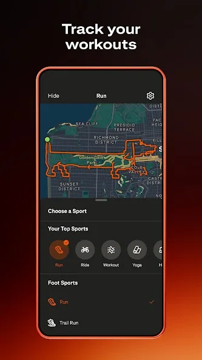</a> | [Strava](references/24-strava/README.md) · [official product](https://play.google.com/store/apps/details?id=com.strava) | owner-published media, 3 named gaps | Health and fitness | mobile-single-column: Single-column mobile hierarchy with top context and a vertically scrolling primary surface. Panels: toolbar/header (top); bottom navigation/action area (bottom); scrolling content or app screen (center). Density: low; confidence: medium. | Study the activity recording screen, map-and-stat hierarchy, segment summaries, and transition from live tracking to a shareable result. |
| 25 | <a href="https://play.google.com/store/apps/details?id=com.myfitnesspal.android">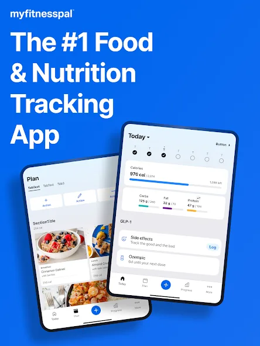</a> | [MyFitnessPal](references/25-myfitnesspal/README.md) · [official product](https://play.google.com/store/apps/details?id=com.myfitnesspal.android) | owner-published media, 3 named gaps | Health and fitness | mobile-single-column: Single-column mobile hierarchy with top context and a vertically scrolling primary surface. Panels: toolbar/header (top); bottom navigation/action area (bottom); scrolling content or app screen (center). Density: low; confidence: medium. | Study the meal-section diary, food search and quantity entry, remaining-calorie calculation, and macro breakdown after logging. |
| 26 | <a href="https://play.google.com/store/apps/details?id=com.medisafe.android.client">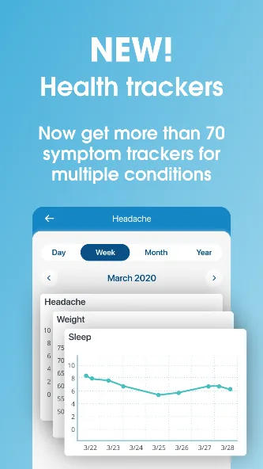</a> | [Medisafe](references/26-medisafe/README.md) · [official product](https://play.google.com/store/apps/details?id=com.medisafe.android.client) | owner-published media, 3 named gaps | Health and fitness | mobile-single-column: Single-column mobile hierarchy with top context and a vertically scrolling primary surface. Panels: toolbar/header (top); bottom navigation/action area (bottom); scrolling content or app screen (center). Density: low; confidence: medium. | Study the pillbox timeline, medication reminder actions, taken-or-skipped states, and adherence history communicated through a calendar. |
| 27 | <a href="https://play.google.com/store/apps/details?id=com.calm.android">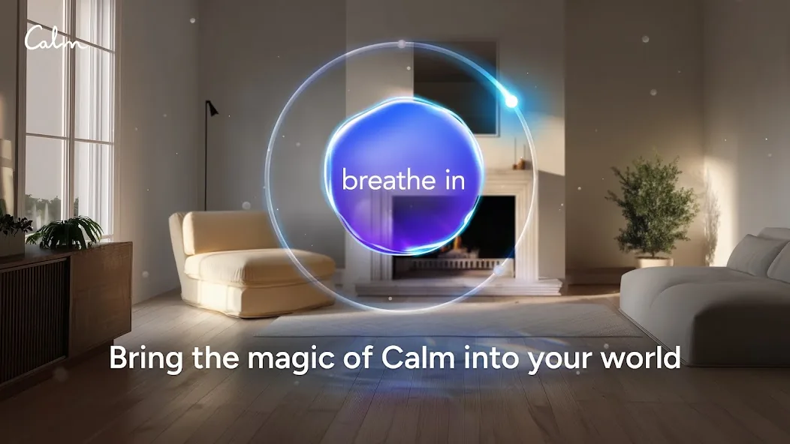</a> | [Calm](references/27-calm/README.md) · [official product](https://play.google.com/store/apps/details?id=com.calm.android) | owner-published media, 3 named gaps | Health and wellness | mobile-single-column: Single-column mobile hierarchy with top context and a vertically scrolling primary surface. Panels: toolbar/header (top); bottom navigation/action area (bottom); scrolling content or app screen (center). Density: low; confidence: medium. | Study content discovery by intent, session-duration choices, the low-distraction audio player, and continuity cues for multi-day programs. |
| 28 | <a href="https://play.google.com/store/apps/details?id=com.adobe.lrmobile">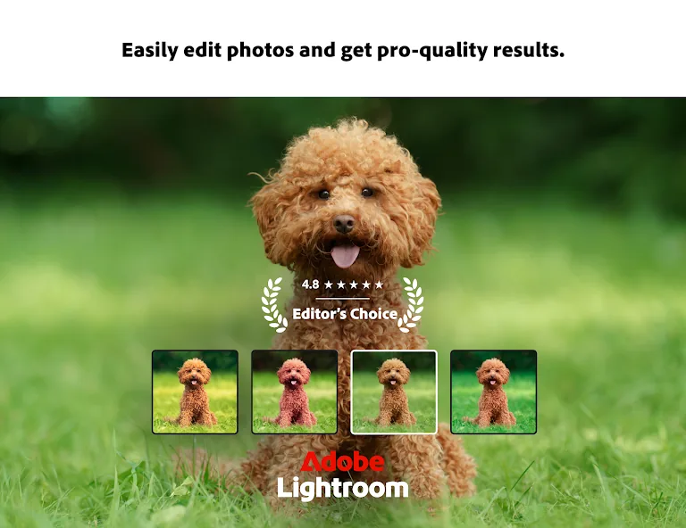</a> | [Adobe Lightroom](references/28-adobe-lightroom/README.md) · [official product](https://play.google.com/store/apps/details?id=com.adobe.lrmobile) | owner-published media, 3 named gaps | Creativity | mobile-single-column: Single-column mobile hierarchy with top context and a vertically scrolling primary surface. Panels: toolbar/header (top); bottom navigation/action area (bottom); scrolling content or app screen (center). Density: low; confidence: medium. | Study the bottom editing tool rail, parameter sliders, selective masks, and press-and-hold comparison between edited and original images. |
| 29 | <a href="https://play.google.com/store/apps/details?id=com.canva.editor">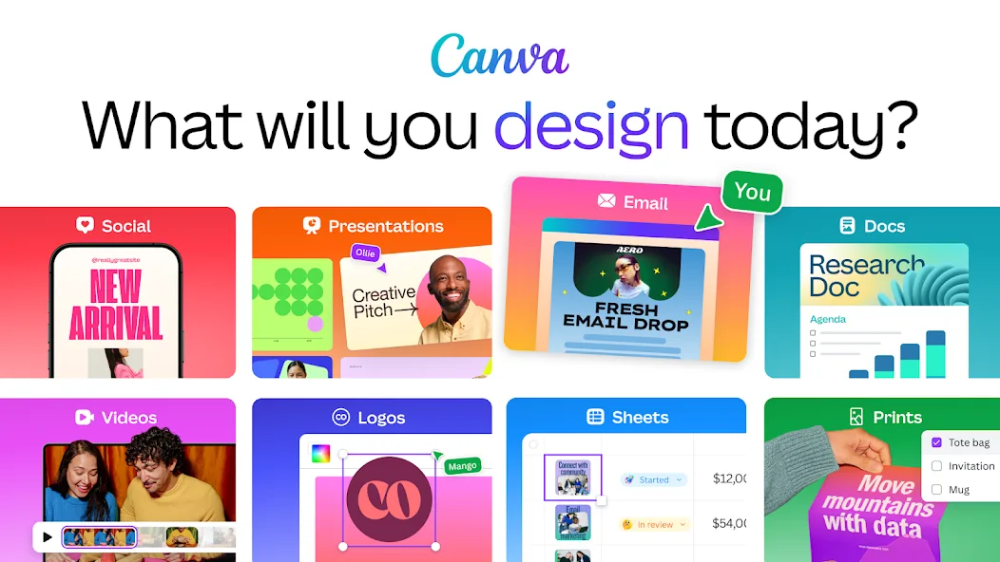</a> | [Canva](references/29-canva/README.md) · [official product](https://play.google.com/store/apps/details?id=com.canva.editor) | owner-published media, 3 named gaps | Creativity | mobile-single-column: Single-column mobile hierarchy with top context and a vertically scrolling primary surface. Panels: toolbar/header (top); scrolling content or app screen (center). Density: low; confidence: medium. | Study template-first discovery, object selection on a touch canvas, contextual editing controls, and layer manipulation on a small screen. |
| 30 | <a href="https://play.google.com/store/apps/details?id=com.adsk.sketchbook">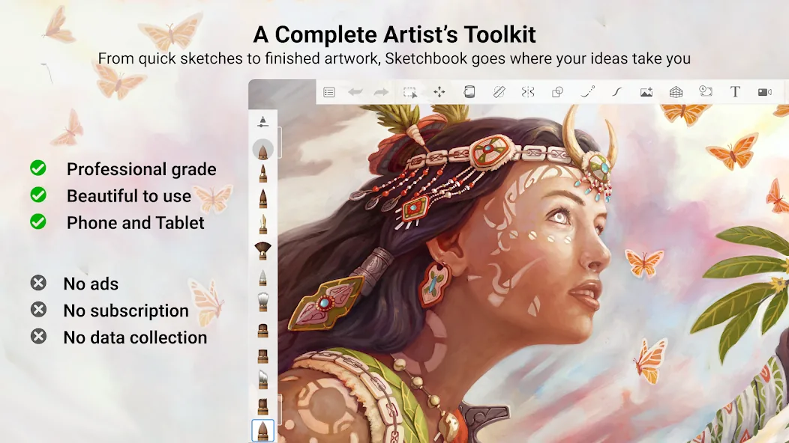</a> | [Sketchbook](references/30-sketchbook/README.md) · [official product](https://play.google.com/store/apps/details?id=com.adsk.sketchbook) | owner-published media, 3 named gaps | Creativity | mobile-single-column: Single-column mobile hierarchy with top context and a vertically scrolling primary surface. Panels: toolbar/header (top); scrolling content or app screen (center). Density: low; confidence: medium. | Study the full-screen canvas, radial tool access, stylus-oriented controls, gesture navigation, and compact layer management. |
| 31 | <a href="https://play.google.com/store/apps/details?id=com.lemon.lvoverseas">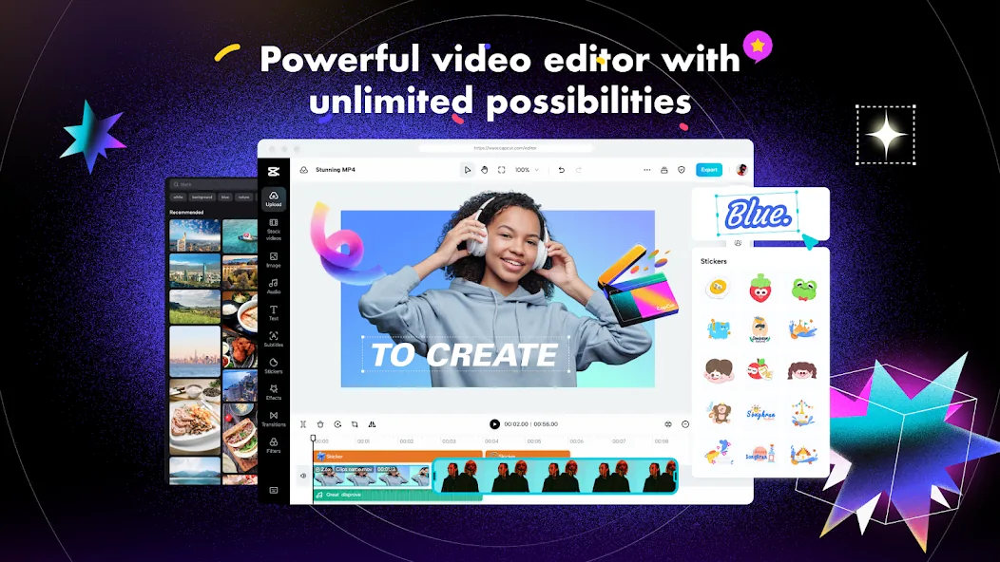</a> | [CapCut](references/31-capcut/README.md) · [official product](https://play.google.com/store/apps/details?id=com.lemon.lvoverseas) | owner-published media, 3 named gaps | Creativity | mobile-single-column: Single-column mobile hierarchy with top context and a vertically scrolling primary surface. Panels: toolbar/header (top); bottom navigation/action area (bottom); scrolling content or app screen (center). Density: medium; confidence: medium. | Study the touch-driven multitrack timeline, clip trimming handles, playhead behavior, and contextual tool sets for selected media. |
| 32 | <a href="https://play.google.com/store/apps/details?id=com.bandlab.bandlab">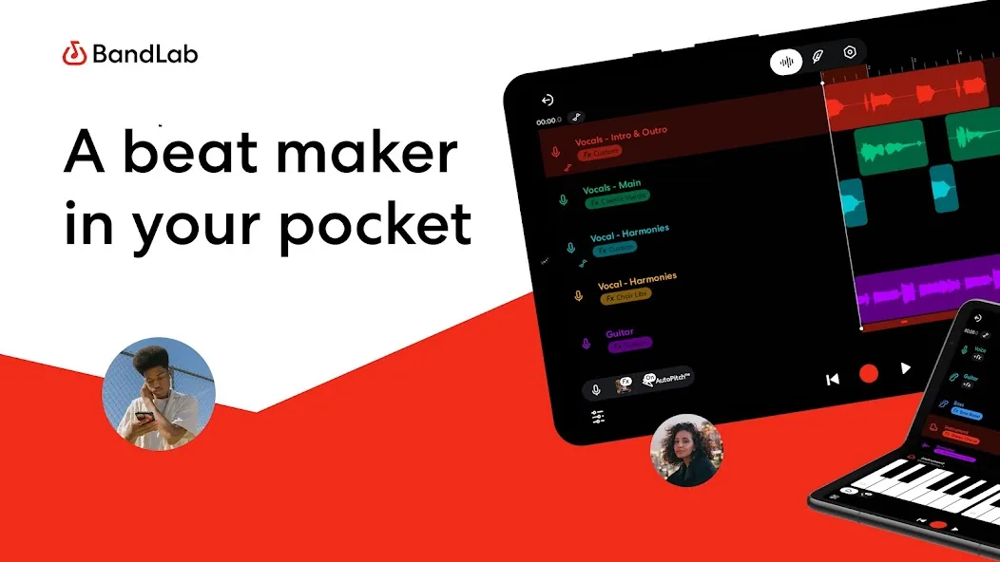</a> | [BandLab](references/32-bandlab/README.md) · [official product](https://play.google.com/store/apps/details?id=com.bandlab.bandlab) | owner-published media, 3 named gaps | Creativity | mobile-single-column: Single-column mobile hierarchy with top context and a vertically scrolling primary surface. Panels: toolbar/header (top); scrolling content or app screen (center). Density: low; confidence: medium. | Study mobile multitrack recording, track-arm and mute states, waveform editing, and the transition between arrangement and mixer views. |
| 33 | <a href="https://play.google.com/store/apps/details?id=com.niksoftware.snapseed">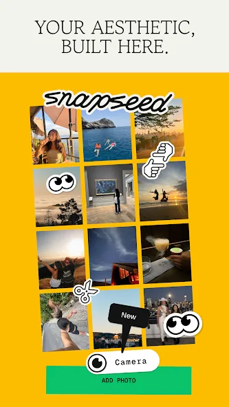</a> | [Snapseed](references/33-snapseed/README.md) · [official product](https://play.google.com/store/apps/details?id=com.niksoftware.snapseed) | owner-published media, 3 named gaps | Creativity | mobile-single-column: Single-column mobile hierarchy with top context and a vertically scrolling primary surface. Panels: toolbar/header (top); bottom navigation/action area (bottom); scrolling content or app screen (center). Density: medium; confidence: medium. | Study vertical tool selection paired with horizontal parameter adjustment, the edit stack, selective controls, and before-and-after gestures. |
| 34 |  | [Files by Google](references/34-files-by-google/README.md) · [official product](https://play.google.com/store/apps/details?id=com.google.android.apps.nbu.files) | owner-published media, 3 named gaps | Utilities | mobile-single-column: Single-column mobile hierarchy with top context and a vertically scrolling primary surface. Panels: toolbar/header (top); bottom navigation/action area (bottom); scrolling content or app screen (center). Density: low; confidence: medium. | Study file browsing by semantic category, storage-cleanup recommendations, selection mode, and the separation of browse, clean, and share tasks. |
| 35 | <a href="https://play.google.com/store/apps/details?id=com.x8bit.bitwarden">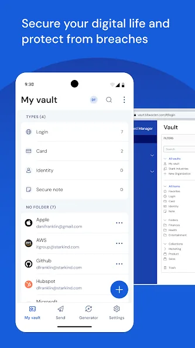</a> | [Bitwarden Password Manager](references/35-bitwarden-password-manager/README.md) · [official product](https://play.google.com/store/apps/details?id=com.x8bit.bitwarden) | owner-published media, 3 named gaps | Utilities | mobile-single-column: Single-column mobile hierarchy with top context and a vertically scrolling primary surface. Panels: toolbar/header (top); bottom navigation/action area (bottom); scrolling content or app screen (center). Density: low; confidence: medium. | Study vault search and type filters, credential detail hierarchy, password generation, and Android autofill handoff between apps. |
| 36 | <a href="https://play.google.com/store/apps/details?id=com.onepassword.android">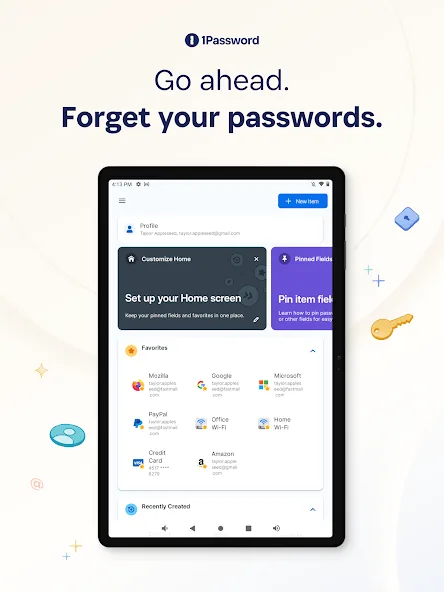</a> | [1Password](references/36-1password/README.md) · [official product](https://play.google.com/store/apps/details?id=com.onepassword.android) | owner-published media, 3 named gaps | Utilities | mobile-single-column: Single-column mobile hierarchy with top context and a vertically scrolling primary surface. Panels: toolbar/header (top); bottom navigation/action area (bottom); scrolling content or app screen (center). Density: low; confidence: medium. | Study collection and vault navigation, item detail structure, favorite and tag organization, and system-integrated autofill prompts. |
| 37 | <a href="https://play.google.com/store/apps/details?id=com.google.android.apps.translate">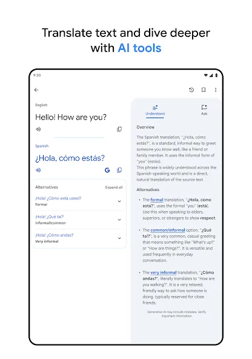</a> | [Google Translate](references/37-google-translate/README.md) · [official product](https://play.google.com/store/apps/details?id=com.google.android.apps.translate) | owner-published media, 3 named gaps | Utilities | mobile-single-column: Single-column mobile hierarchy with top context and a vertically scrolling primary surface. Panels: toolbar/header (top); scrolling content or app screen (center). Density: low; confidence: medium. | Study bidirectional language selection, instant mode switching among text, camera, voice, and conversation, and offline-language status. |
| 38 | <a href="https://play.google.com/store/apps/details?id=com.accuweather.android">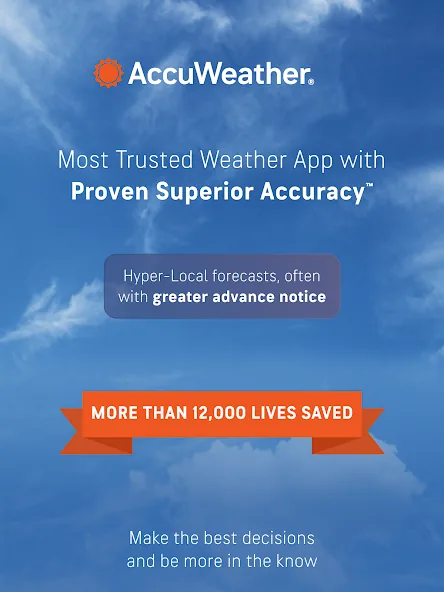</a> | [AccuWeather](references/38-accuweather/README.md) · [official product](https://play.google.com/store/apps/details?id=com.accuweather.android) | owner-published media, 3 named gaps | Utilities | mobile-single-column: Single-column mobile hierarchy with top context and a vertically scrolling primary surface. Panels: toolbar/header (top); bottom navigation/action area (bottom); scrolling content or app screen (center). Density: low; confidence: medium. | Study the hourly forecast timeline, severe-weather prominence, radar layer controls, and progressive detail from current conditions to future days. |
| 39 | <a href="https://play.google.com/store/apps/details?id=com.spotify.music">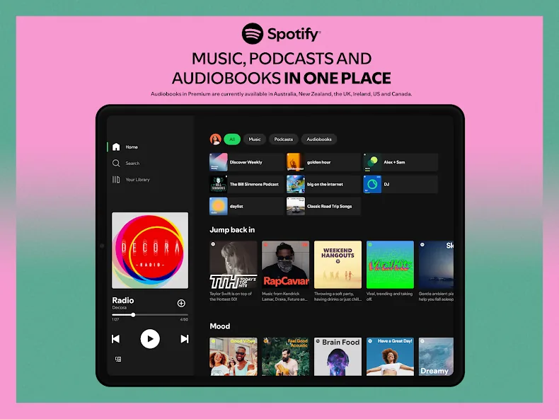</a> | [Spotify](references/39-spotify/README.md) · [official product](https://play.google.com/store/apps/details?id=com.spotify.music) | owner-published media, 3 named gaps | Media | mobile-single-column: Single-column mobile hierarchy with top context and a vertically scrolling primary surface. Panels: toolbar/header (top); bottom navigation/action area (bottom); scrolling content or app screen (center). Density: low; confidence: medium. | Study the persistent mini-player, expansion to Now Playing, queue management, device handoff, and dense personalized content shelves. |
| 40 |  | [YouTube](references/40-youtube/README.md) · [official product](https://play.google.com/store/apps/details?id=com.google.android.youtube) | owner-published media, 3 named gaps | Media | mobile-single-column: Single-column mobile hierarchy with top context and a vertically scrolling primary surface. Panels: toolbar/header (top); scrolling content or app screen (center). Density: low; confidence: medium. | Study player minimization, portrait-to-landscape transitions, expandable descriptions, comment sheets, and continuity while browsing recommendations. |
| 41 | <a href="https://play.google.com/store/apps/details?id=com.google.android.apps.youtube.music">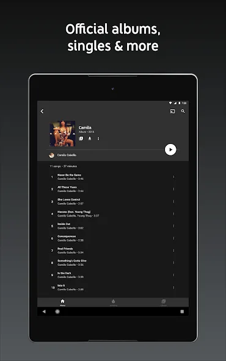</a> | [YouTube Music](references/41-youtube-music/README.md) · [official product](https://play.google.com/store/apps/details?id=com.google.android.apps.youtube.music) | owner-published media, 3 named gaps | Media | mobile-single-column: Single-column mobile hierarchy with top context and a vertically scrolling primary surface. Panels: toolbar/header (top); bottom navigation/action area (bottom); scrolling content or app screen (center). Density: low; confidence: medium. | Study the mini-player-to-full-player transition, swipe navigation, queue and lyrics panels, and audio-versus-video mode switching. |
| 42 | <a href="https://play.google.com/store/apps/details?id=au.com.shiftyjelly.pocketcasts">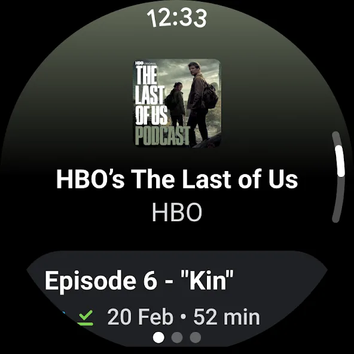</a> | [Pocket Casts](references/42-pocket-casts/README.md) · [official product](https://play.google.com/store/apps/details?id=au.com.shiftyjelly.pocketcasts) | owner-published media, 3 named gaps | Media | mobile-single-column: Single-column mobile hierarchy with top context and a vertically scrolling primary surface. Panels: toolbar/header (top); bottom navigation/action area (bottom); scrolling content or app screen (center). Density: low; confidence: medium. | Study podcast filters, episode state indicators, the Up Next queue, playback-speed controls, and chapter-aware listening navigation. |
| 43 | <a href="https://play.google.com/store/apps/details?id=org.videolan.vlc">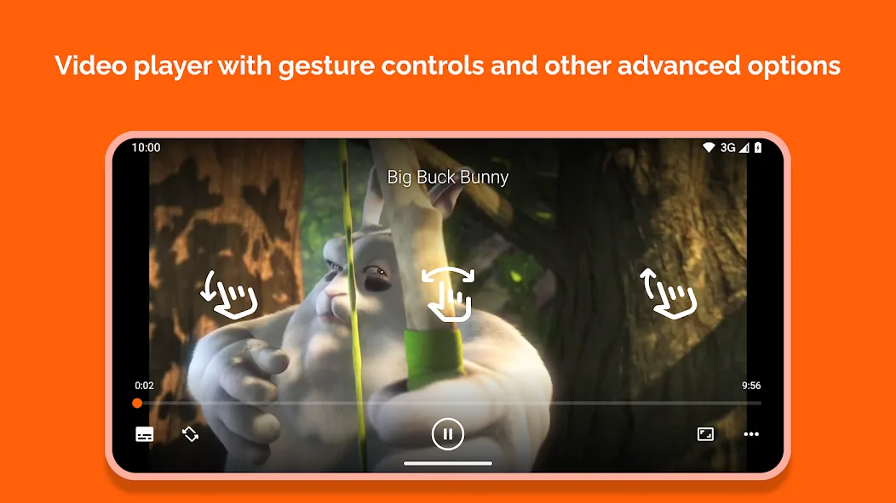</a> | [VLC for Android](references/43-vlc-for-android/README.md) · [official product](https://play.google.com/store/apps/details?id=org.videolan.vlc) | owner-published media, 3 named gaps | Media | mobile-single-column: Single-column mobile hierarchy with top context and a vertically scrolling primary surface. Panels: toolbar/header (top); bottom navigation/action area (bottom); scrolling content or app screen (center). Density: low; confidence: medium. | Study folder-based media browsing, codec-agnostic playback states, subtitle controls, and screen gestures for brightness, volume, and seeking. |
| 44 | <a href="https://play.google.com/store/apps/details?id=com.netflix.mediaclient">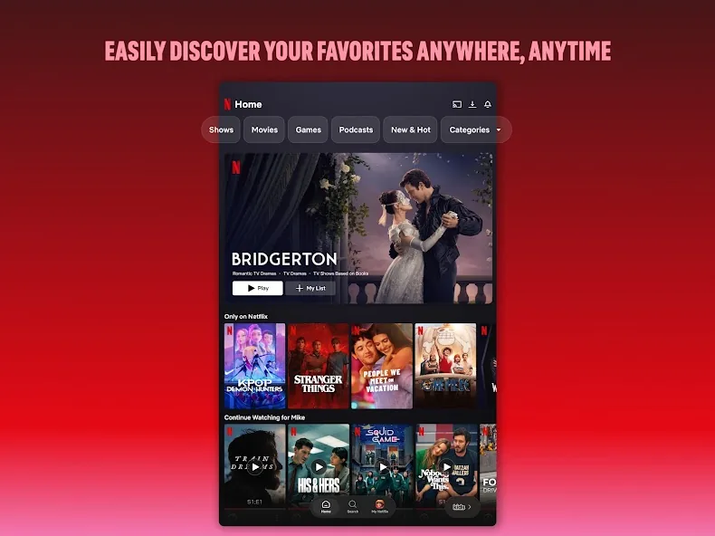</a> | [Netflix](references/44-netflix/README.md) · [official product](https://play.google.com/store/apps/details?id=com.netflix.mediaclient) | owner-published media, 3 named gaps | Media | mobile-single-column: Single-column mobile hierarchy with top context and a vertically scrolling primary surface. Panels: toolbar/header (top); scrolling content or app screen (center). Density: low; confidence: medium. | Study profile selection, horizontally scrolling content shelves, title detail overlays, download-state communication, and episode progression. |
| 45 | <a href="https://play.google.com/store/apps/details?id=com.google.android.apps.maps">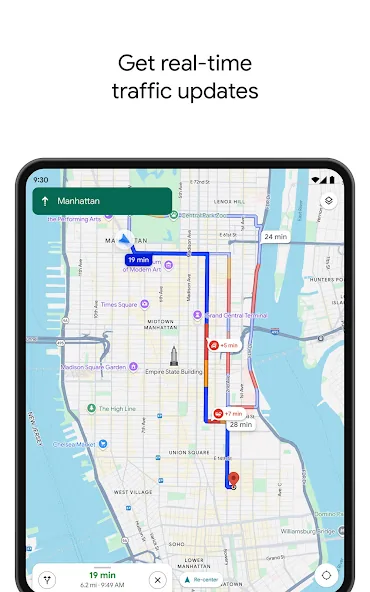</a> | [Google Maps](references/45-google-maps/README.md) · [official product](https://play.google.com/store/apps/details?id=com.google.android.apps.maps) | owner-published media, 3 named gaps | Navigation | mobile-single-column: Single-column mobile hierarchy with top context and a vertically scrolling primary surface. Panels: toolbar/header (top); scrolling content or app screen (center). Density: medium; confidence: medium. | Study map-plus-bottom-sheet composition, place result cards, transport-mode comparison, and turn-by-turn guidance with glanceable maneuver cues. |
| 46 | <a href="https://play.google.com/store/apps/details?id=com.waze">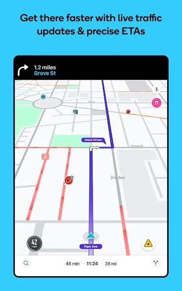</a> | [Waze Navigation & Live Traffic](references/46-waze-navigation-live-traffic/README.md) · [official product](https://play.google.com/store/apps/details?id=com.waze) | owner-published media, 3 named gaps | Navigation | mobile-single-column: Single-column mobile hierarchy with top context and a vertically scrolling primary surface. Panels: toolbar/header (top); scrolling content or app screen (center). Density: low; confidence: medium. | Study driver-focused incident reporting, large touch targets, route alternatives, and the prioritization of immediate hazards during guidance. |
| 47 |  | [Citymapper](references/47-citymapper/README.md) · [official product](https://play.google.com/store/apps/details?id=com.citymapper.app.release) | owner-published media, 3 named gaps | Navigation | mobile-single-column: Single-column mobile hierarchy with top context and a vertically scrolling primary surface. Panels: toolbar/header (top); bottom navigation/action area (bottom); scrolling content or app screen (center). Density: medium; confidence: medium. | Study multimodal route comparison, departure-time emphasis, disruption messaging, and step-by-step transit instructions across transport systems. |
| 48 | <a href="https://play.google.com/store/apps/details?id=de.komoot.android">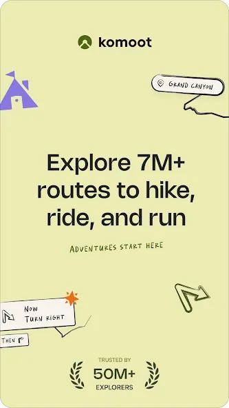</a> | [komoot](references/48-komoot/README.md) · [official product](https://play.google.com/store/apps/details?id=de.komoot.android) | owner-published media, 3 named gaps | Navigation | mobile-single-column: Single-column mobile hierarchy with top context and a vertically scrolling primary surface. Panels: toolbar/header (top); bottom navigation/action area (bottom); scrolling content or app screen (center). Density: low; confidence: medium. | Study route planning by activity type, surface and elevation summaries, waypoint editing, and offline map-state communication. |
| 49 | <a href="https://play.google.com/store/apps/details?id=com.github.android">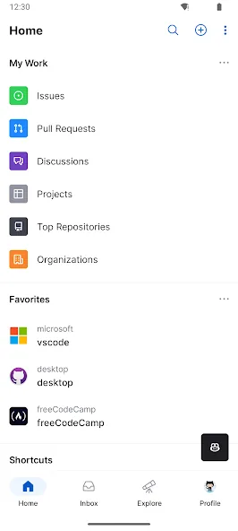</a> | [GitHub](references/49-github/README.md) · [official product](https://play.google.com/store/apps/details?id=com.github.android) | owner-published media, 3 named gaps | Developer tools | mobile-single-column: Single-column mobile hierarchy with top context and a vertically scrolling primary surface. Panels: toolbar/header (top); bottom navigation/action area (bottom); scrolling content or app screen (center). Density: low; confidence: medium. | Study repository and notification navigation, issue and pull-request timelines, code-diff presentation, and compact review actions on mobile. |
| 50 | <a href="https://github.com/termux/termux-app">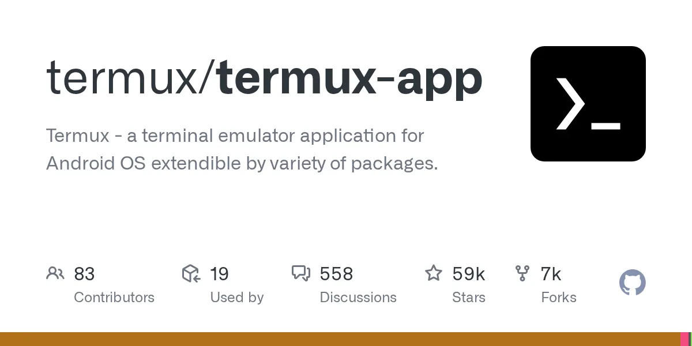</a> | [Termux](references/50-termux/README.md) · [official product](https://github.com/termux/termux-app) | owner-published media, 3 named gaps | Developer tools | mobile-single-column: Single-column mobile hierarchy with top context and a vertically scrolling primary surface. Panels: toolbar/header (top); bottom navigation/action area (bottom); scrolling content or app screen (center). Density: low; confidence: medium. | Study terminal session switching, the extra-keys row, long-press command actions, and integration of desktop-style shell work with Android input. |

Normalized panel bounds, detected separators, image dimensions, source-image URLs, hashes, and analysis confidence are recorded in [`sources.json`](sources.json). Media kinds, measured durations, provenance classes, and per-record gaps are in [`references.json`](references.json).

Attribution and product ownership remain with the linked source.
