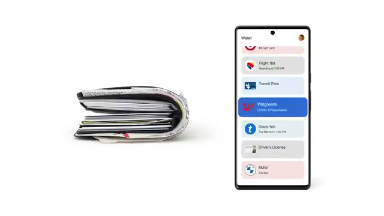
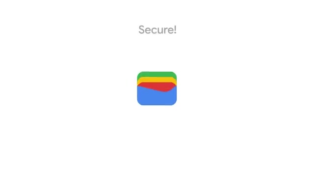
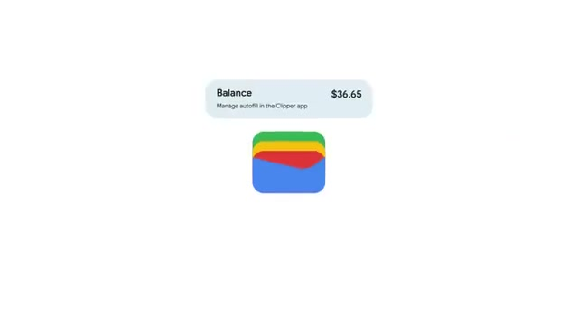

# 16. Google Wallet — observed Android product reference

**Product:** [Google Wallet](https://play.google.com/store/apps/details?id=com.google.android.apps.walletnfcrel)  
**Motion source:** [Phone, keys... Google Wallet](https://www.youtube.com/watch?v=3eKF_kEjy-I)  
**Upstream owner/publisher:** Google  
**Evidence status:** complete  
**Captured:** 2026-08-16T23:00:00Z  

<video src="media/motion.mp4" controls width="640"></video>

The local MP4 is authentic recorded product motion, not an animation synthesized from catalog stills. Product-owner or official documentation recording published by Google, archived through a self-hosted Cobalt transport; no synthesized or interpolated motion.

## Three retained states

| State | Local evidence | Relationship |
|---|---|---|
| Entry |  | Frame from `media/motion.mp4` at 00:11.0 |
| Decision |  | Frame from `media/motion.mp4` at 00:35.0 |
| Success |  | Frame from `media/motion.mp4` at 00:59.0 |

## First-success journey

**Actor:** an account holder using Android  
**Goal:** reach a reviewed financial result without ambiguity  
**Prerequisites:** Android device; eligible product account; network access

| # | Observed action | System response | State | Evidence |
|---:|---|---|---|---|
| 1 | Open the product surface shown in the retained recording. | The interface presents the account overview. | account overview | `media/motion.mp4 @ 00:01.4` |
| 2 | Choose the visible primary item, destination, or creation action. | The interface advances to the financial action selected. | financial action selected | `media/motion.mp4 @ 00:12.3` |
| 3 | Move into the focused task surface and select the demonstrated control. | The focused control reveals the destination or instrument selected. | destination or instrument selected | `media/motion.mp4 @ 00:24.7` |
| 4 | Enter or adjust the demonstrated value, content, route, or media option. | The product updates to the amount or option entered. | amount or option entered | `media/motion.mp4 @ 00:38.4` |
| 5 | Review the intermediate state and invoke the visible confirmation or start control. | The product shows the review boundary. | review boundary | `media/motion.mp4 @ 00:50.8` |
| 6 | Inspect the resulting saved, active, or completed product state. | The recording ends with the confirmed result. | confirmed result | `media/motion.mp4 @ 01:03.1` |

### Failure and recovery

The observed decision boundary is not completion: an incomplete target/value leaves the interface before the distinct final state. Backtracking returns to the entry hierarchy. Recovery is to re-enter, restore the demonstrated valid selection or value, invoke the shown confirmation/start control, and verify `media/state-03-success.jpg`.

## Interaction map

| Interaction | Trigger and response | Feedback | Cancellation | Failure → recovery | Evidence |
|---|---|---|---|---|---|
| primary input | Tap the demonstrated primary action or target. The focused task surface opens. | Selection and surface change are visible in the recording. | Android back or the visible close affordance returns to the preceding state before confirmation. | An incomplete choice does not produce the final result. → Select the required target and repeat the primary action. | `media/motion.mp4 @ 00:12.3–00:24.7` |
| focus and selection | Tap a visible item, card, row, field, or media target. The target becomes the active context. | Highlight, detail content, or focused controls replace the prior state. | Tap outside, close, or navigate back before committing. | No active target leaves contextual controls unavailable. → Choose a visible eligible target. | `media/motion.mp4 @ 00:24.7` |
| navigation | Use the demonstrated tab, row, toolbar action, or forward control. The recording advances to a distinct product surface. | Header, content hierarchy, or active navigation state changes. | Backtracking returns to the prior hierarchy level. | A wrong destination does not expose the demonstrated action. → Return and select the route shown in the clip. | `media/motion.mp4 @ 00:12.3–00:38.4` |
| configuration | Change the demonstrated option, value, recipient, tool, or mode. The intermediate result updates in place. | Text, control state, preview, or data changes immediately. | Leave the focused surface before confirmation to abandon the pending change. | Missing or unsuitable input prevents a meaningful result. → Supply the shown valid input or choose the demonstrated option. | `media/motion.mp4 @ 00:38.4` |
| confirmation | Invoke the visible save, done, start, send, play, or continue action. The product advances from review to an active or completed state. | The final surface differs visibly from the review state. | The preceding state remains editable until the confirmation action. | Without confirmation, the recording does not reach the final state. → Return to review and invoke the demonstrated confirmation. | `media/motion.mp4 @ 00:50.8–01:03.1` |
| cancellation and backtracking | Use the visible close/back boundary before the final action. The previous context remains available without a completion signal. | Navigation hierarchy or editable content reappears. | This interaction is itself the cancellation path. | Backing out after an incomplete choice leaves no final result. → Re-enter through the same primary action. | `media/motion.mp4 @ 00:12.3; boundary remains visible through 00:50.8` |
| system feedback | Complete the demonstrated action. The app presents changed content, status, preview, playback, or navigation. | The retained success frame captures the stable response. | No cancellation is shown after the final success state. | If feedback is absent, completion cannot be established from the clip. → Return to the review state and retry once valid input is present. | `media/state-03-success.jpg; source media/motion.mp4` |
| failure and recovery | Attempt to advance while the demonstrated required selection or value is absent. The interface remains at the decision boundary rather than showing the result. | The decision state remains visually distinct from the success state. | Back returns to the entry state. | Required context is missing or the action remains incomplete. → Restore the demonstrated selection/value, review it, and confirm again. | `media/state-02-decision.jpg → media/state-03-success.jpg in source media/motion.mp4` |

## Motion analysis

- **Trigger:** the primary product action shown after the entry state.
- **Start/end:** `account overview` → `confirmed result`.
- **Continuity:** authentic publisher/device screen motion with direct cuts retained as published; no frame interpolation or still-image animation.
- **Timing class:** short product demonstration, 68.610 seconds and 1645 decoded video frames.
- **Interruption/reversal:** the pre-confirmation decision state remains the reversal boundary; no post-success reversal is demonstrated.
- **Feedback:** navigation, focused controls, intermediate content, and the final visible state provide spatial feedback.
- **Reduced motion:** not demonstrated; no claim is made about Android Remove animations or an app-specific reduced-motion setting.

## Accessibility

**Observed:** visible context/focus changes persist long enough to inspect; primary action placement remains stable; success is represented by a distinct surface.  
**Unknown:** TalkBack labels/announcements, Switch Access, keyboard order, text scaling, measured contrast and target size, and reduced-motion behavior are not exposed by the pixels.

## Provenance and integrity

| Item | Value |
|---|---|
| Source page | https://www.youtube.com/watch?v=3eKF_kEjy-I |
| Product page | https://play.google.com/store/apps/details?id=com.google.android.apps.walletnfcrel |
| Publisher | Google |
| Capture method | Product-owner or official documentation recording published by Google, archived through a self-hosted Cobalt transport; no synthesized or interpolated motion. |
| Captured at | 2026-08-16T23:00:00Z |
| Motion metadata | 640×360; 68.610s; 1645 frames; 162628 bytes |
| Motion SHA-256 | `a8816d37fb376bbd681f51fe885a09d0b00239ac8759f753c6b637eceab31298` |

Exact per-file state dimensions, bytes, and hashes are in [`reference.json`](reference.json).
