# App store listing examples

Apple App Store and Google Play listings with strong product presentation.

Each entry pairs an attributed overview image and a measured panel anatomy with a per-product record: motion evidence, named states, an observed first-success journey, interaction and recovery behavior, accessibility observations, and provenance. Every number below is measured by `verify-reference-evidence.py`, and a record that is missing evidence says so in its own `evidence_gaps`.

**Examples:** 50  
**Images:** 50  
**Structural analyses:** 50  
**Records with no remaining gap:** 0  
**Records with named gaps:** 50 (100 gaps)  
**Motion provenance:** 50 browser driven here, 14 owner-published media  
**Curated:** 2026-08-16  
**Visual source data:** [`sources.json`](sources.json)  
**Record index:** [`references.json`](references.json)  
**Cross-example synthesis:** [`full-reference.md`](full-reference.md)

| # | Reference image | Record | Motion evidence | Category | Interface structure | What to study |
|---:|---|---|---|---|---|---|
| 1 |  | [Duolingo: Language Lessons (Apple App Store)](references/01-duolingo-language-lessons/README.md) · [official product](https://apps.apple.com/us/app/id570060128) | browser driven here, 2 named gaps | Apple App Store — Education | mobile-single-column: Single-column mobile hierarchy with top context and a vertically scrolling primary surface. Panels: toolbar/header (top); bottom navigation/action area (bottom); scrolling content or app screen (center). Density: low; confidence: medium. | Study how the mascot-led icon continues into a benefit-first screenshot sequence, reinforced by ratings, event messaging, and concise update notes. |
| 2 | <a href="https://apps.apple.com/us/app/id897446215">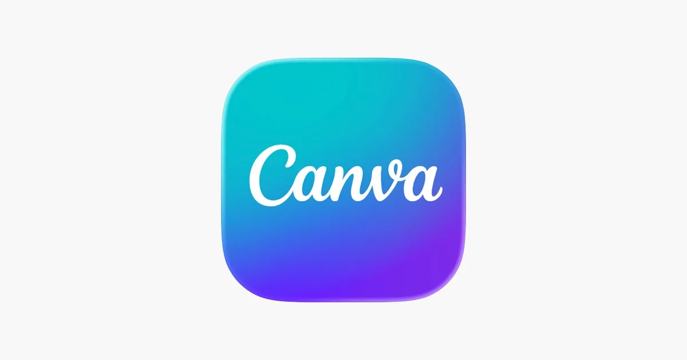</a> | [Canva: Design, Art & AI Editor (Apple App Store)](references/02-canva-design-art-ai-editor/README.md) · [official product](https://apps.apple.com/us/app/id897446215) | browser driven here, owner-published media, 2 named gaps | Apple App Store — Graphics & Design | mobile-single-column: Single-column mobile hierarchy with top context and a vertically scrolling primary surface. Panels: toolbar/header (top); bottom navigation/action area (bottom); scrolling content or app screen (center). Density: low; confidence: medium. | Study the screenshot narrative that moves from broad creation value to specific formats, while preview media maintains continuity with the editor experience. |
| 3 | <a href="https://apps.apple.com/us/app/id1232780281">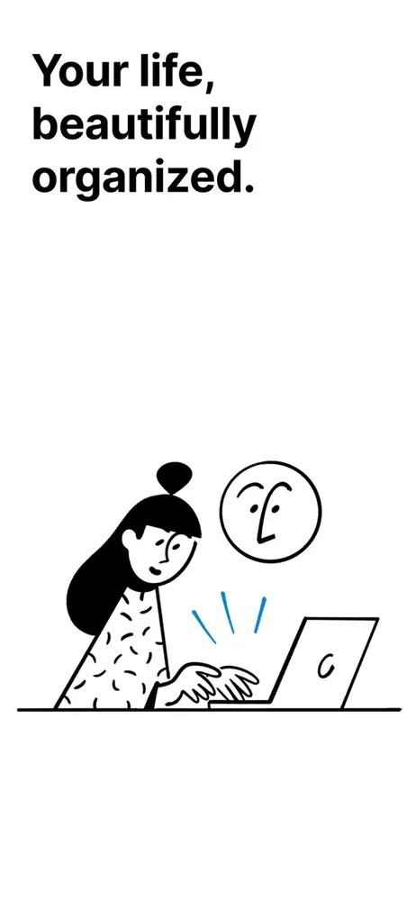</a> | [Notion: Notes, Tasks, AI (Apple App Store)](references/03-notion-notes-tasks-ai/README.md) · [official product](https://apps.apple.com/us/app/id1232780281) | browser driven here, 2 named gaps | Apple App Store — Productivity | mobile-single-column: Single-column mobile hierarchy with top context and a vertically scrolling primary surface. Panels: toolbar/header (top); bottom navigation/action area (bottom); scrolling content or app screen (center). Density: low; confidence: medium. | Study how compact title positioning, interface-led screenshots, and recognizable template use explain a flexible product without requiring a long onboarding story. |
| 4 |  | [Headspace: Meditation & Sleep (Apple App Store)](references/04-headspace-meditation-sleep/README.md) · [official product](https://apps.apple.com/us/app/id493145008) | browser driven here, 2 named gaps | Apple App Store — Health & Fitness | mobile-single-column: Single-column mobile hierarchy with top context and a vertically scrolling primary surface. Panels: toolbar/header (top); scrolling content or app screen (center). Density: low; confidence: medium. | Study the continuity between the friendly icon, illustrated preview frames, benefit-specific screenshot captions, subscription framing, and privacy disclosures. |
| 5 | <a href="https://apps.apple.com/us/app/id571800810">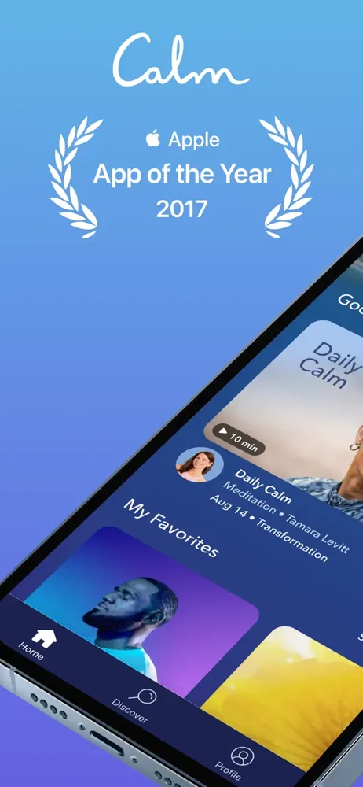</a> | [Calm (Apple App Store)](references/05-calm/README.md) · [official product](https://apps.apple.com/us/app/id571800810) | browser driven here, 2 named gaps | Apple App Store — Health & Fitness | mobile-single-column: Single-column mobile hierarchy with top context and a vertically scrolling primary surface. Panels: toolbar/header (top); bottom navigation/action area (bottom); scrolling content or app screen (center). Density: low; confidence: medium. | Study how a minimal scenic icon expands into an atmospheric screenshot narrative, with recognizable content names and ratings supplying additional social proof. |
| 6 | <a href="https://apps.apple.com/us/app/id426826309">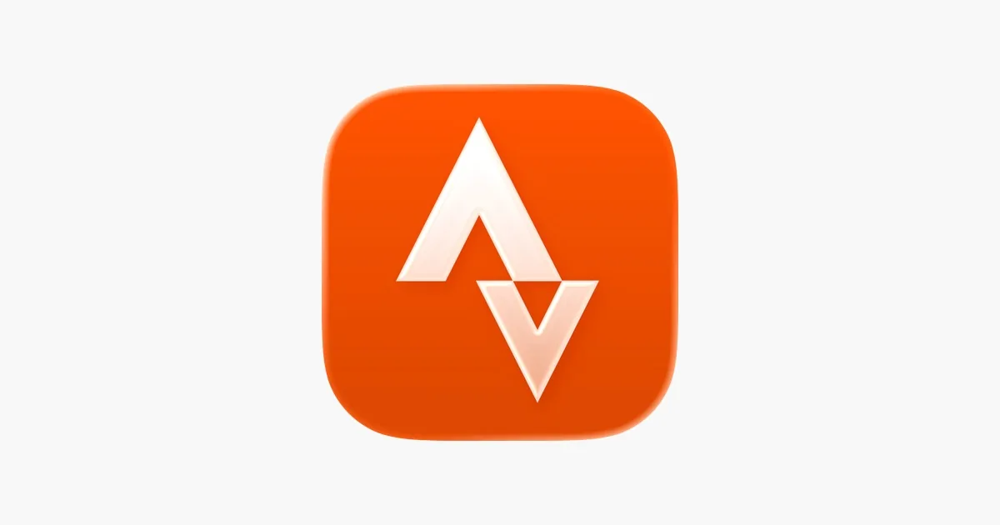</a> | [Strava: Run, Bike, Hike (Apple App Store)](references/06-strava-run-bike-hike/README.md) · [official product](https://apps.apple.com/us/app/id426826309) | browser driven here, owner-published media, 2 named gaps | Apple App Store — Health & Fitness | mobile-single-column: Single-column mobile hierarchy with top context and a vertically scrolling primary surface. Panels: toolbar/header (top); bottom navigation/action area (bottom); scrolling content or app screen (center). Density: low; confidence: medium. | Study how activity tracking, community, routes, and progress are sequenced across screenshots to connect acquisition claims with the core in-app loop. |
| 7 | <a href="https://apps.apple.com/us/app/id401626263">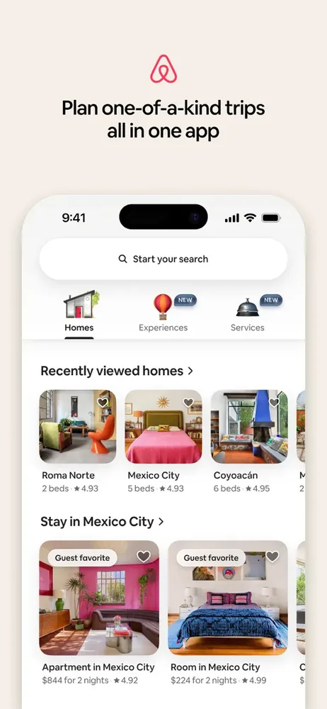</a> | [Airbnb (Apple App Store)](references/07-airbnb/README.md) · [official product](https://apps.apple.com/us/app/id401626263) | browser driven here, 2 named gaps | Apple App Store — Travel | mobile-single-column: Single-column mobile hierarchy with top context and a vertically scrolling primary surface. Panels: toolbar/header (top); bottom navigation/action area (bottom); scrolling content or app screen (center). Density: low; confidence: medium. | Study the use of destination imagery, product-interface crops, familiar brand iconography, review volume, and privacy labels to support a high-consideration conversion. |
| 8 |  | [Uber (Apple App Store)](references/08-uber/README.md) · [official product](https://apps.apple.com/us/app/id368677368) | browser driven here, 2 named gaps | Apple App Store — Travel | mobile-single-column: Single-column mobile hierarchy with top context and a vertically scrolling primary surface. Panels: toolbar/header (top); bottom navigation/action area (bottom); scrolling content or app screen (center). Density: low; confidence: medium. | Study how the listing communicates multiple mobility use cases through a simple screenshot progression while preserving visual continuity with the booking flow. |
| 9 |  | [Spotify: Music and Podcasts (Apple App Store)](references/09-spotify-music-and-podcasts/README.md) · [official product](https://apps.apple.com/us/app/id324684580) | browser driven here, 2 named gaps | Apple App Store — Music | mobile-single-column: Single-column mobile hierarchy with top context and a vertically scrolling primary surface. Panels: toolbar/header (top); bottom navigation/action area (bottom); scrolling content or app screen (center). Density: low; confidence: medium. | Study how recognizable entertainment artwork, concise benefit captions, preview media, rating volume, and frequent release notes combine around an instantly identifiable icon. |
| 10 | <a href="https://apps.apple.com/us/app/id835599320">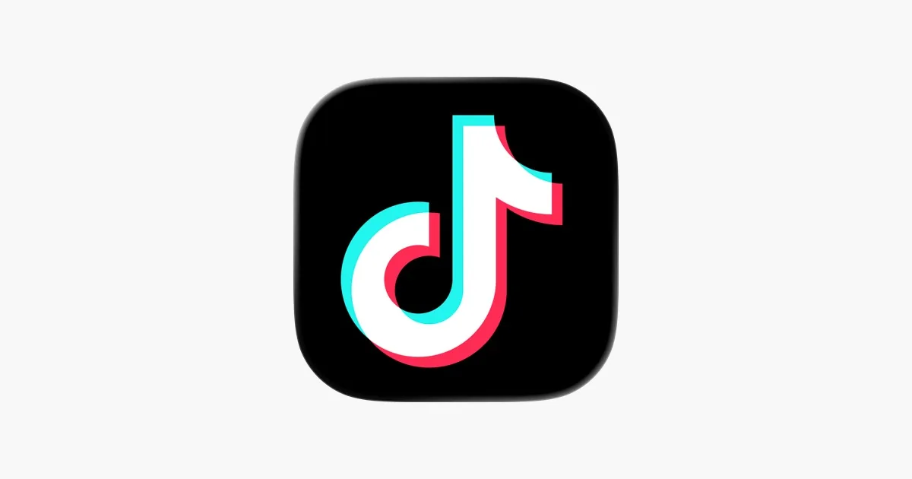</a> | [TikTok (Apple App Store)](references/10-tiktok/README.md) · [official product](https://apps.apple.com/us/app/id835599320) | browser driven here, owner-published media, 2 named gaps | Apple App Store — Entertainment | mobile-single-column: Single-column mobile hierarchy with top context and a vertically scrolling primary surface. Panels: toolbar/header (top); bottom navigation/action area (bottom); scrolling content or app screen (center). Density: low; confidence: medium. | Study how a highly distinctive icon and sparse title lead into creator-focused preview media, social-proof signals, privacy details, and frequently refreshed version notes. |
| 11 |  | [Pinterest (Apple App Store)](references/11-pinterest/README.md) · [official product](https://apps.apple.com/us/app/id429047995) | browser driven here, 2 named gaps | Apple App Store — Lifestyle | mobile-single-column: Single-column mobile hierarchy with top context and a vertically scrolling primary surface. Panels: toolbar/header (top); bottom navigation/action area (bottom); scrolling content or app screen (center). Density: low; confidence: medium. | Study how screenshots organize many discovery categories into a coherent inspiration-to-action story, using interface examples rather than abstract feature claims. |
| 12 |  | [LinkedIn: Network & Job Finder (Apple App Store)](references/12-linkedin-network-job-finder/README.md) · [official product](https://apps.apple.com/us/app/id288429040) | browser driven here, owner-published media, 2 named gaps | Apple App Store — Business | mobile-single-column: Single-column mobile hierarchy with top context and a vertically scrolling primary surface. Panels: toolbar/header (top); bottom navigation/action area (bottom); scrolling content or app screen (center). Density: low; confidence: medium. | Study the acquisition sequence from professional identity to jobs, networking, and learning, with concrete interface views supporting each stated user outcome. |
| 13 | <a href="https://apps.apple.com/us/app/id618783545">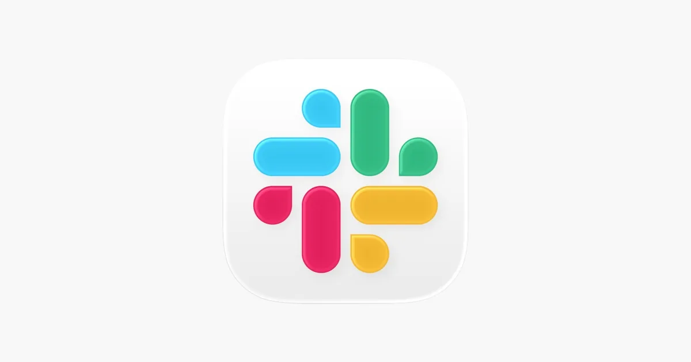</a> | [Slack (Apple App Store)](references/13-slack/README.md) · [official product](https://apps.apple.com/us/app/id618783545) | browser driven here, 2 named gaps | Apple App Store — Business | mobile-single-column: Single-column mobile hierarchy with top context and a vertically scrolling primary surface. Panels: toolbar/header (top); bottom navigation/action area (bottom); scrolling content or app screen (center). Density: low; confidence: medium. | Study how workplace communication features are reduced to legible mobile screenshots, and how update notes can reinforce an ongoing reliability and maintenance story. |
| 14 | <a href="https://apps.apple.com/us/app/id327630330">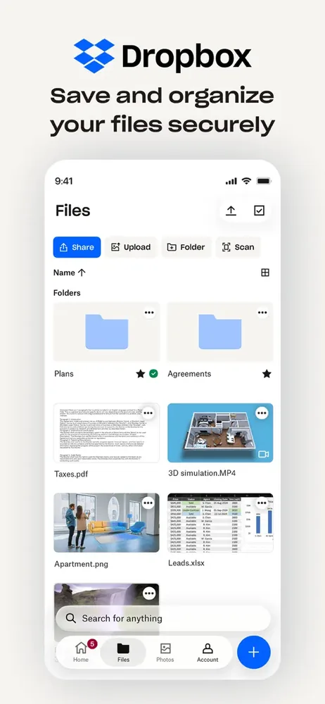</a> | [Dropbox: Cloud Photo Storage (Apple App Store)](references/14-dropbox-cloud-photo-storage/README.md) · [official product](https://apps.apple.com/us/app/id327630330) | browser driven here, owner-published media, 2 named gaps | Apple App Store — Productivity | mobile-single-column: Single-column mobile hierarchy with top context and a vertically scrolling primary surface. Panels: toolbar/header (top); scrolling content or app screen (center). Density: low; confidence: medium. | Study the progression from file access to scanning, sharing, and backup, plus how privacy labels contextualize a product handling sensitive personal content. |
| 15 |  | [Revolut: Send, Spend and Save (Apple App Store)](references/15-revolut-send-spend-and-save/README.md) · [official product](https://apps.apple.com/us/app/id932493382) | browser driven here, 2 named gaps | Apple App Store — Finance | mobile-single-column: Single-column mobile hierarchy with top context and a vertically scrolling primary surface. Panels: toolbar/header (top); bottom navigation/action area (bottom); scrolling content or app screen (center). Density: low; confidence: medium. | Study how a finance super-app prioritizes use cases across screenshot panels while ratings, regulatory wording, privacy disclosures, and release notes reduce uncertainty. |
| 16 | <a href="https://apps.apple.com/us/app/id612261027">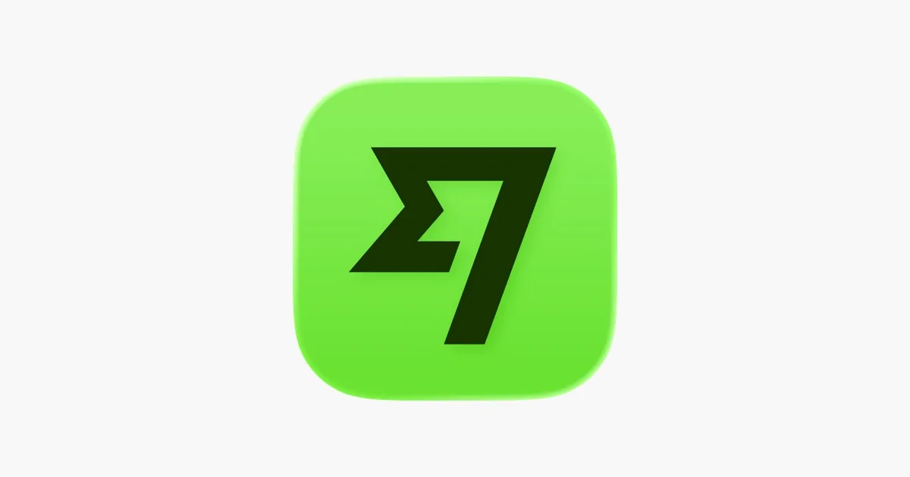</a> | [Wise: International Transfers (Apple App Store)](references/16-wise-international-transfers/README.md) · [official product](https://apps.apple.com/us/app/id612261027) | browser driven here, owner-published media, 2 named gaps | Apple App Store — Finance | mobile-single-column: Single-column mobile hierarchy with top context and a vertically scrolling primary surface. Panels: toolbar/header (top); bottom navigation/action area (bottom); scrolling content or app screen (center). Density: low; confidence: medium. | Study how international money movement is explained with concrete fee, currency, card, and transfer concepts while maintaining continuity into the transaction interface. |
| 17 | <a href="https://apps.apple.com/us/app/id1060683933">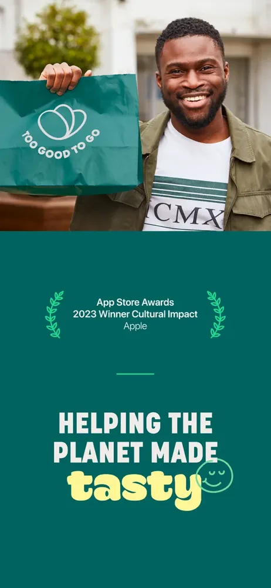</a> | [Too Good To Go: End Food Waste (Apple App Store)](references/17-too-good-to-go-end-food-waste/README.md) · [official product](https://apps.apple.com/us/app/id1060683933) | browser driven here, owner-published media, 2 named gaps | Apple App Store — Food & Drink | mobile-single-column: Single-column mobile hierarchy with top context and a vertically scrolling primary surface. Panels: toolbar/header (top); bottom navigation/action area (bottom); scrolling content or app screen (center). Density: low; confidence: medium. | Study the mission-led title and icon, followed by a screenshot story that turns an abstract sustainability benefit into a clear browse-reserve-collect interaction. |
| 18 | <a href="https://apps.apple.com/us/app/id878783582">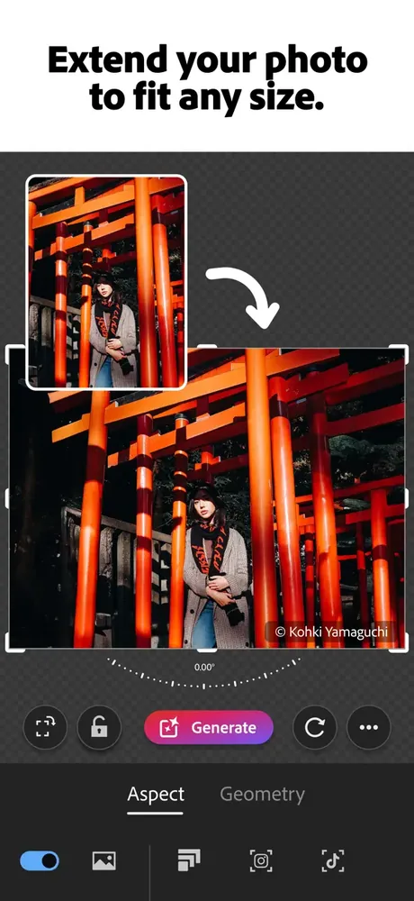</a> | [Adobe Lightroom: Photo Editor (Apple App Store)](references/18-adobe-lightroom-photo-editor/README.md) · [official product](https://apps.apple.com/us/app/id878783582) | browser driven here, owner-published media, 2 named gaps | Apple App Store — Photo & Video | mobile-single-column: Single-column mobile hierarchy with top context and a vertically scrolling primary surface. Panels: toolbar/header (top); scrolling content or app screen (center). Density: medium; confidence: medium. | Study the before-and-after visual demonstrations, tool-specific screenshot sequencing, recognizable Adobe branding, subscription details, and privacy information for creator acquisition. |
| 19 | <a href="https://apps.apple.com/us/app/id587366035">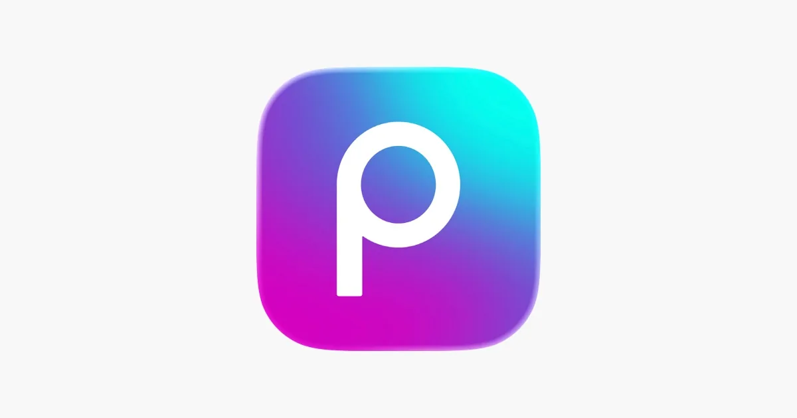</a> | [Picsart AI Photo Editor, Video (Apple App Store)](references/19-picsart-ai-photo-editor-video/README.md) · [official product](https://apps.apple.com/us/app/id587366035) | browser driven here, owner-published media, 2 named gaps | Apple App Store — Photo & Video | mobile-single-column: Single-column mobile hierarchy with top context and a vertically scrolling primary surface. Panels: toolbar/header (top); bottom navigation/action area (bottom); scrolling content or app screen (center). Density: low; confidence: medium. | Study how vivid creative outcomes lead the screenshot set before feature controls appear, linking aspirational acquisition media to concrete editing interactions. |
| 20 |  | [Nike Run Club: Running Coach (Apple App Store)](references/20-nike-run-club-running-coach/README.md) · [official product](https://apps.apple.com/us/app/id387771637) | browser driven here, 2 named gaps | Apple App Store — Health & Fitness | mobile-single-column: Single-column mobile hierarchy with top context and a vertically scrolling primary surface. Panels: toolbar/header (top); bottom navigation/action area (bottom); scrolling content or app screen (center). Density: low; confidence: medium. | Study how brand recognition, guided-run imagery, coaching benefits, progress views, ratings, and privacy disclosures work together for fitness-app conversion. |
| 21 | <a href="https://apps.apple.com/us/app/id405075943">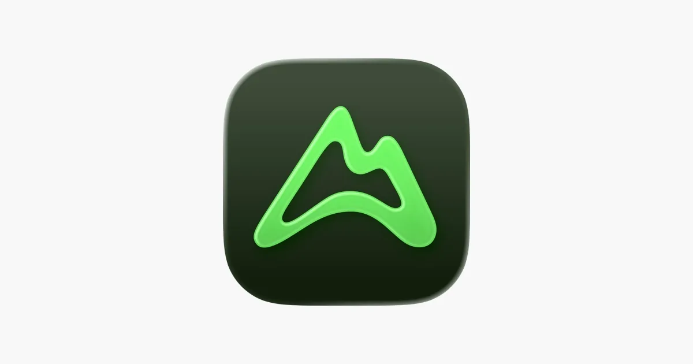</a> | [AllTrails: Hike, Bike & Run (Apple App Store)](references/21-alltrails-hike-bike-run/README.md) · [official product](https://apps.apple.com/us/app/id405075943) | browser driven here, 2 named gaps | Apple App Store — Navigation | mobile-single-column: Single-column mobile hierarchy with top context and a vertically scrolling primary surface. Panels: toolbar/header (top); bottom navigation/action area (bottom); scrolling content or app screen (center). Density: low; confidence: medium. | Study the sequence from trail discovery to maps, navigation, recording, and community evidence, which mirrors the product journey from intent to completed activity. |
| 22 |  | [Flo Period & Pregnancy Tracker (Apple App Store)](references/22-flo-period-pregnancy-tracker/README.md) · [official product](https://apps.apple.com/us/app/id1038369065) | browser driven here, 2 named gaps | Apple App Store — Health & Fitness | mobile-single-column: Single-column mobile hierarchy with top context and a vertically scrolling primary surface. Panels: toolbar/header (top); bottom navigation/action area (bottom); scrolling content or app screen (center). Density: low; confidence: medium. | Study how sensitive health benefits are presented through reassuring visual language, feature-specific screenshots, subscription context, privacy labels, and trust-oriented social proof. |
| 23 | <a href="https://apps.apple.com/us/app/chatgpt/id6448311069">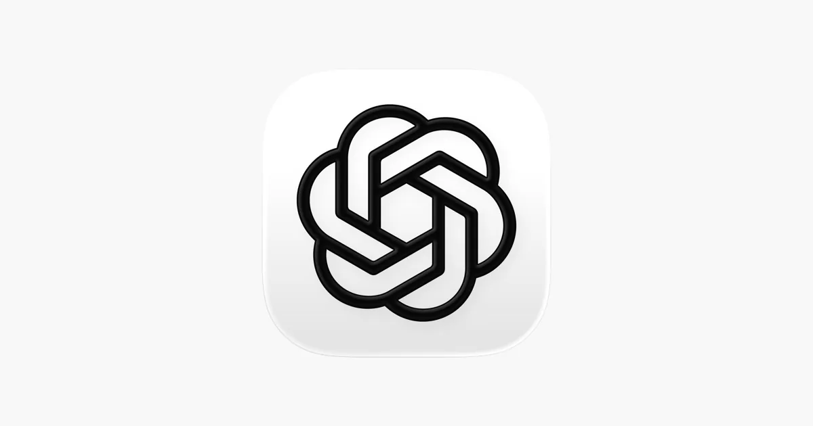</a> | [ChatGPT (Apple App Store)](references/23-chatgpt/README.md) · [official product](https://apps.apple.com/us/app/chatgpt/id6448311069) | browser driven here, 2 named gaps | Apple App Store — Productivity | mobile-single-column: Single-column mobile hierarchy with top context and a vertically scrolling primary surface. Panels: toolbar/header (top); scrolling content or app screen (center). Density: low; confidence: medium. | Study how the screenshot sequence moves from a broad assistant promise to multimodal input, voice, image understanding, and concrete everyday tasks while keeping the core conversation UI visible. |
| 24 | <a href="https://apps.apple.com/us/app/id946099227">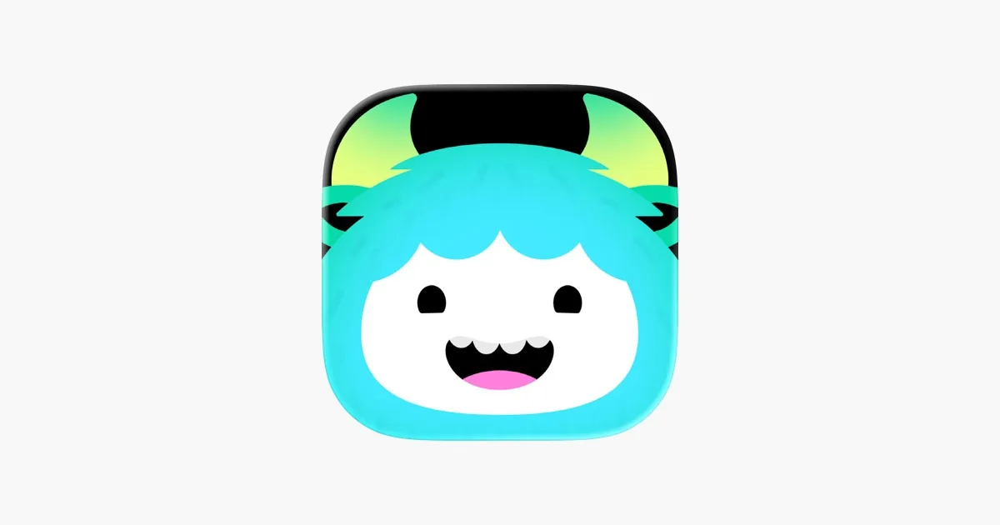</a> | [YAZIO Calorie Counter & Diet (Apple App Store)](references/24-yazio-calorie-counter-diet/README.md) · [official product](https://apps.apple.com/us/app/id946099227) | browser driven here, 2 named gaps | Apple App Store — Health & Fitness | mobile-single-column: Single-column mobile hierarchy with top context and a vertically scrolling primary surface. Panels: toolbar/header (top); bottom navigation/action area (bottom); scrolling content or app screen (center). Density: low; confidence: medium. | Study how goal setting, food logging, progress, and meal guidance are ordered into a behavior-change story, supported by ratings and recurring update notes. |
| 25 | <a href="https://apps.apple.com/us/app/id568839295">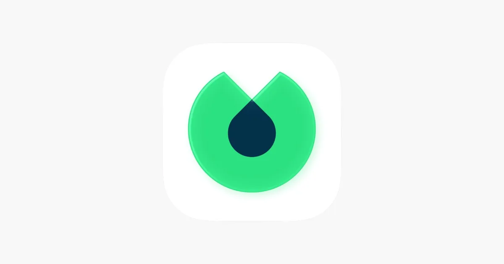</a> | [Blinkist: Big Ideas in 15 Min (Apple App Store)](references/25-blinkist-big-ideas-in-15-min/README.md) · [official product](https://apps.apple.com/us/app/id568839295) | browser driven here, 2 named gaps | Apple App Store — Education | mobile-single-column: Single-column mobile hierarchy with top context and a vertically scrolling primary surface. Panels: toolbar/header (top); scrolling content or app screen (center). Density: low; confidence: medium. | Study how the time-saving proposition is embedded in the title and carried through content previews, listening interfaces, testimonials, and subscription conversion cues. |
| 26 |  | [Google Maps (Google Play)](references/26-google-maps/README.md) · [official product](https://play.google.com/store/apps/details?id=com.google.android.apps.maps) | browser driven here, 2 named gaps | Google Play — Maps & Navigation | mobile-single-column: Single-column mobile hierarchy with top context and a vertically scrolling primary surface. Panels: toolbar/header (top); scrolling content or app screen (center). Density: medium; confidence: medium. | Study how globally familiar iconography, utility-focused screenshots, massive review volume, privacy details, and update information frame a broad product around everyday tasks. |
| 27 |  | [WhatsApp Messenger (Google Play)](references/27-whatsapp-messenger/README.md) · [official product](https://play.google.com/store/apps/details?id=com.whatsapp) | browser driven here, 2 named gaps | Google Play — Communication | mobile-single-column: Single-column mobile hierarchy with top context and a vertically scrolling primary surface. Panels: toolbar/header (top); bottom navigation/action area (bottom); scrolling content or app screen (center). Density: low; confidence: medium. | Study how a recognizable icon and concise title transition into messaging, calling, groups, and privacy claims through a straightforward feature-by-feature screenshot sequence. |
| 28 | <a href="https://play.google.com/store/apps/details?id=com.instagram.android">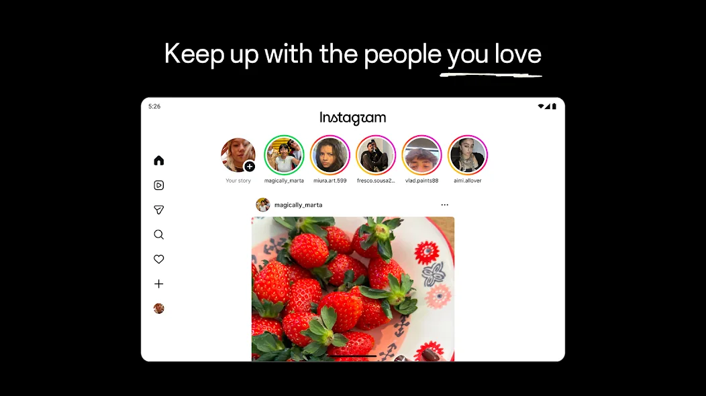</a> | [Instagram (Google Play)](references/28-instagram/README.md) · [official product](https://play.google.com/store/apps/details?id=com.instagram.android) | browser driven here, owner-published media, 2 named gaps | Google Play — Social | mobile-single-column: Single-column mobile hierarchy with top context and a vertically scrolling primary surface. Panels: toolbar/header (top); bottom navigation/action area (bottom); scrolling content or app screen (center). Density: low; confidence: medium. | Study how preview media demonstrates the content experience immediately, while download scale, ratings, data-safety information, and version updates provide surrounding decision context. |
| 29 |  | [Netflix (Google Play)](references/29-netflix/README.md) · [official product](https://play.google.com/store/apps/details?id=com.netflix.mediaclient) | browser driven here, 2 named gaps | Google Play — Entertainment | mobile-single-column: Single-column mobile hierarchy with top context and a vertically scrolling primary surface. Panels: toolbar/header (top); scrolling content or app screen (center). Density: low; confidence: medium. | Study how recognizable show artwork functions as acquisition media, with interface screenshots connecting content desire to browsing, playback, profiles, and downloads. |
| 30 | <a href="https://play.google.com/store/apps/details?id=com.amazon.mShop.android.shopping">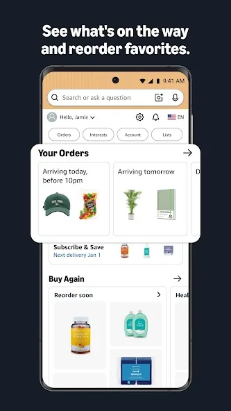</a> | [Amazon Shopping (Google Play)](references/30-amazon-shopping/README.md) · [official product](https://play.google.com/store/apps/details?id=com.amazon.mShop.android.shopping) | browser driven here, owner-published media, 2 named gaps | Google Play — Shopping | mobile-single-column: Single-column mobile hierarchy with top context and a vertically scrolling primary surface. Panels: toolbar/header (top); scrolling content or app screen (center). Density: low; confidence: medium. | Study the conversion continuity between product-discovery screenshots and familiar shopping interactions, supplemented by review scale, data-safety details, and frequent maintenance updates. |
| 31 |  | [Microsoft Teams (Google Play)](references/31-microsoft-teams/README.md) · [official product](https://play.google.com/store/apps/details?id=com.microsoft.teams) | browser driven here, 2 named gaps | Google Play — Business | mobile-single-column: Single-column mobile hierarchy with top context and a vertically scrolling primary surface. Panels: toolbar/header (top); scrolling content or app screen (center). Density: low; confidence: medium. | Study how meetings, chat, channels, and collaboration are separated into discrete screenshot claims while remaining visually tied to the actual mobile interface. |
| 32 | <a href="https://play.google.com/store/apps/details?id=com.todoist">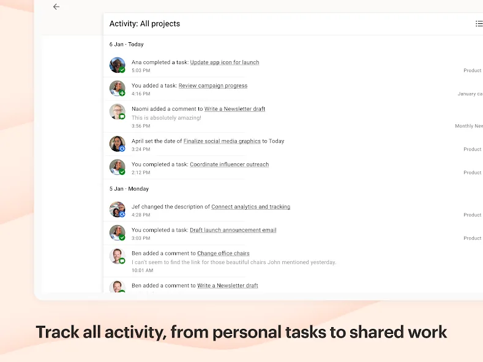</a> | [Todoist: Planner & Calendar (Google Play)](references/32-todoist-planner-calendar/README.md) · [official product](https://play.google.com/store/apps/details?id=com.todoist) | browser driven here, owner-published media, 2 named gaps | Google Play — Productivity | mobile-single-column: Single-column mobile hierarchy with top context and a vertically scrolling primary surface. Panels: toolbar/header (top); bottom navigation/action area (bottom); scrolling content or app screen (center). Density: low; confidence: medium. | Study how a calm icon and interface-first screenshots explain capture, prioritization, planning, and collaboration, with editorial and user-review signals adding social proof. |
| 33 |  | [TickTick: To Do List & Calendar (Google Play)](references/33-ticktick-to-do-list-calendar/README.md) · [official product](https://play.google.com/store/apps/details?id=com.ticktick.task) | browser driven here, 2 named gaps | Google Play — Productivity | mobile-single-column: Single-column mobile hierarchy with top context and a vertically scrolling primary surface. Panels: toolbar/header (top); scrolling content or app screen (center). Density: low; confidence: medium. | Study the information architecture of screenshots spanning tasks, calendar, habits, focus, and collaboration without losing continuity with the app's navigation model. |
| 34 | <a href="https://play.google.com/store/apps/details?id=com.anydo">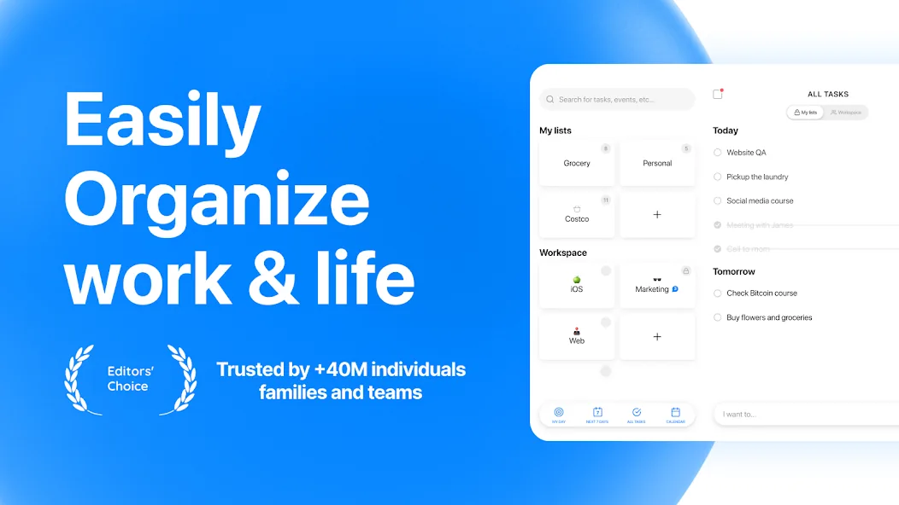</a> | [Any.do: To-do List & Calendar (Google Play)](references/34-any-do-to-do-list-calendar/README.md) · [official product](https://play.google.com/store/apps/details?id=com.anydo) | browser driven here, 2 named gaps | Google Play — Productivity | mobile-single-column: Single-column mobile hierarchy with top context and a vertically scrolling primary surface. Panels: toolbar/header (top); bottom navigation/action area (bottom); scrolling content or app screen (center). Density: low; confidence: medium. | Study how the listing links an outcome-oriented title to daily planning, reminders, lists, and calendar interactions, then supports evaluation with reviews and data-safety details. |
| 35 | <a href="https://play.google.com/store/apps/details?id=com.shazam.android">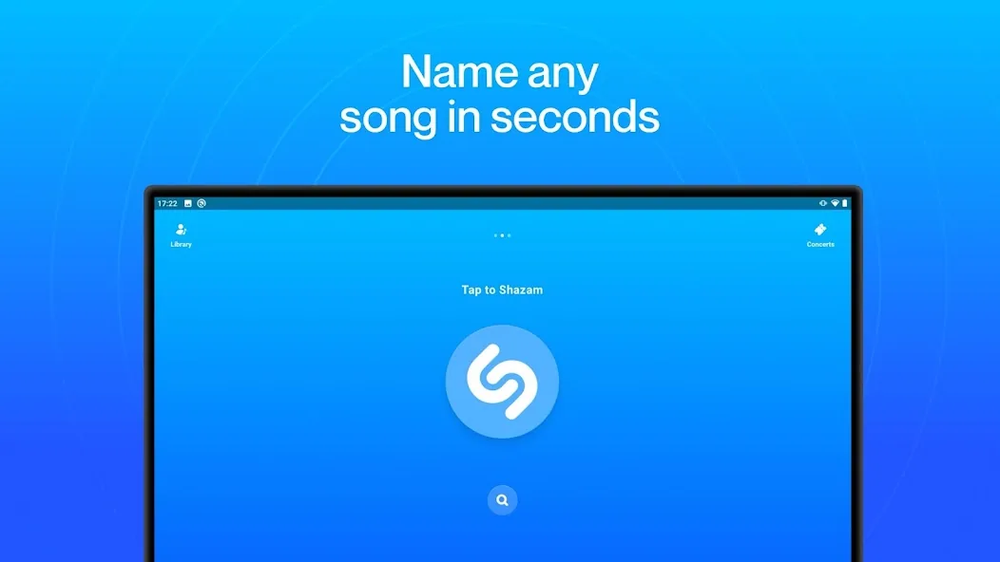</a> | [Shazam: Find Music & Concerts (Google Play)](references/35-shazam-find-music-concerts/README.md) · [official product](https://play.google.com/store/apps/details?id=com.shazam.android) | browser driven here, 2 named gaps | Google Play — Music & Audio | mobile-single-column: Single-column mobile hierarchy with top context and a vertically scrolling primary surface. Panels: toolbar/header (top); scrolling content or app screen (center). Density: low; confidence: medium. | Study how the iconic recognition button anchors both brand and screenshot narrative, followed by discovery, lyrics, concerts, and listening-service continuity. |
| 36 |  | [SoundCloud: Play Music & Songs (Google Play)](references/36-soundcloud-play-music-songs/README.md) · [official product](https://play.google.com/store/apps/details?id=com.soundcloud.android) | browser driven here, 2 named gaps | Google Play — Music & Audio | mobile-single-column: Single-column mobile hierarchy with top context and a vertically scrolling primary surface. Panels: toolbar/header (top); bottom navigation/action area (bottom); scrolling content or app screen (center). Density: low; confidence: medium. | Study how artist and track imagery supplies emotional appeal while interface screenshots clarify discovery, playback, playlists, community activity, and subscription value. |
| 37 |  | [Firefox Fast & Private Browser (Google Play)](references/37-firefox-fast-private-browser/README.md) · [official product](https://play.google.com/store/apps/details?id=org.mozilla.firefox) | browser driven here, 2 named gaps | Google Play — Communication | mobile-single-column: Single-column mobile hierarchy with top context and a vertically scrolling primary surface. Panels: toolbar/header (top); scrolling content or app screen (center). Density: low; confidence: medium. | Study how privacy positioning appears in the title and screenshots, then connects to concrete browser controls, data-safety disclosures, and open-source product credibility. |
| 38 | <a href="https://play.google.com/store/apps/details?id=com.brave.browser">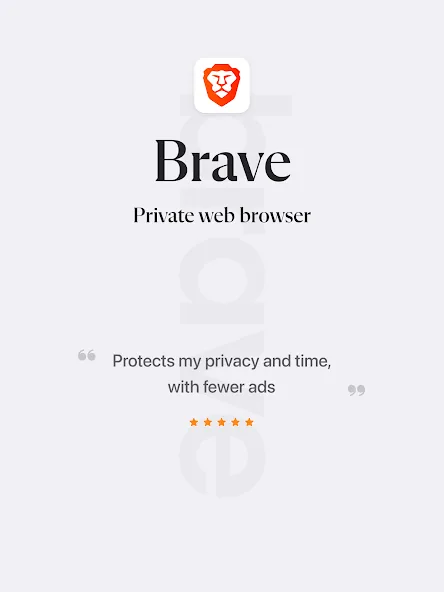</a> | [Brave Private Web Browser, VPN (Google Play)](references/38-brave-private-web-browser-vpn/README.md) · [official product](https://play.google.com/store/apps/details?id=com.brave.browser) | browser driven here, 2 named gaps | Google Play — Communication | mobile-single-column: Single-column mobile hierarchy with top context and a vertically scrolling primary surface. Panels: toolbar/header (top); scrolling content or app screen (center). Density: low; confidence: medium. | Study the acquisition stack of privacy-led naming, shield iconography, feature comparison claims, browser interface evidence, data-safety information, and release notes. |
| 39 | <a href="https://play.google.com/store/apps/details?id=com.booking">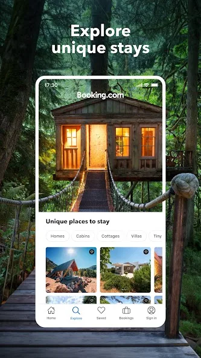</a> | [Booking.com: Hotels and More (Google Play)](references/39-booking-com-hotels-and-more/README.md) · [official product](https://play.google.com/store/apps/details?id=com.booking) | browser driven here, owner-published media, 2 named gaps | Google Play — Travel & Local | mobile-single-column: Single-column mobile hierarchy with top context and a vertically scrolling primary surface. Panels: toolbar/header (top); bottom navigation/action area (bottom); scrolling content or app screen (center). Density: high; confidence: medium. | Study how destination imagery and search-result interfaces build a browse-compare-book narrative, while ratings volume and policy information support a consequential purchase decision. |
| 40 |  | [Tripadvisor: Plan & Book Trips (Google Play)](references/40-tripadvisor-plan-book-trips/README.md) · [official product](https://play.google.com/store/apps/details?id=com.tripadvisor.tripadvisor) | browser driven here, 2 named gaps | Google Play — Travel & Local | mobile-single-column: Single-column mobile hierarchy with top context and a vertically scrolling primary surface. Panels: toolbar/header (top); bottom navigation/action area (bottom); scrolling content or app screen (center). Density: high; confidence: medium. | Study how community reviews become both social proof and a product feature, progressing from inspiration through comparison, itinerary planning, and booking. |
| 41 |  | [Yelp: Food, Delivery & Reviews (Google Play)](references/41-yelp-food-delivery-reviews/README.md) · [official product](https://play.google.com/store/apps/details?id=com.yelp.android) | browser driven here, 2 named gaps | Google Play — Food & Drink | mobile-single-column: Single-column mobile hierarchy with top context and a vertically scrolling primary surface. Panels: toolbar/header (top); bottom navigation/action area (bottom); scrolling content or app screen (center). Density: medium; confidence: medium. | Study how local photography, star ratings, maps, filters, and business details are sequenced to replicate the discovery-to-decision path inside the app. |
| 42 | <a href="https://play.google.com/store/apps/details?id=com.getyourguide.android">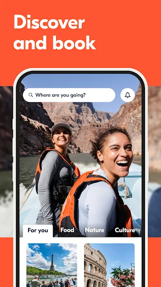</a> | [GetYourGuide: Travel & Tickets (Google Play)](references/42-getyourguide-travel-tickets/README.md) · [official product](https://play.google.com/store/apps/details?id=com.getyourguide.android) | browser driven here, owner-published media, 2 named gaps | Google Play — Travel & Local | mobile-single-column: Single-column mobile hierarchy with top context and a vertically scrolling primary surface. Panels: toolbar/header (top); bottom navigation/action area (bottom); scrolling content or app screen (center). Density: medium; confidence: medium. | Study how experience photography creates desire before screenshots introduce search, availability, reviews, mobile tickets, and booking-management interactions. |
| 43 |  | [Omio: Europe & U.S. Travel (Google Play)](references/43-omio-europe-u-s-travel/README.md) · [official product](https://play.google.com/store/apps/details?id=com.goeuro.rosie) | browser driven here, 2 named gaps | Google Play — Travel & Local | mobile-single-column: Single-column mobile hierarchy with top context and a vertically scrolling primary surface. Panels: toolbar/header (top); bottom navigation/action area (bottom); scrolling content or app screen (center). Density: low; confidence: medium. | Study how multimodal transport comparison is simplified into a search-compare-book-ticket screenshot arc, preserving continuity with the core transaction flow. |
| 44 |  | [Memrise: Speak a New Language (Google Play)](references/44-memrise-speak-a-new-language/README.md) · [official product](https://play.google.com/store/apps/details?id=com.memrise.android.memrisecompanion) | browser driven here, 2 named gaps | Google Play — Education | mobile-single-column: Single-column mobile hierarchy with top context and a vertically scrolling primary surface. Panels: toolbar/header (top); bottom navigation/action area (bottom); scrolling content or app screen (center). Density: low; confidence: medium. | Study how speaking outcomes, native-speaker video, practice modes, and progress are staged across screenshots, with user ratings reinforcing the learning proposition. |
| 45 | <a href="https://play.google.com/store/apps/details?id=com.babbel.mobile.android.en">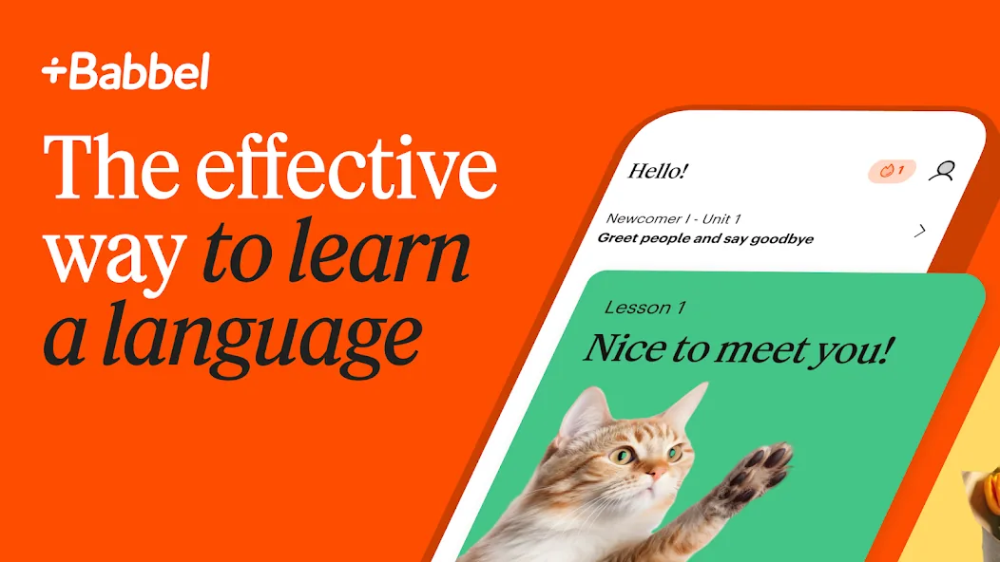</a> | [Babbel: Language Learning (Google Play)](references/45-babbel-language-learning/README.md) · [official product](https://play.google.com/store/apps/details?id=com.babbel.mobile.android.en) | browser driven here, 2 named gaps | Google Play — Education | mobile-single-column: Single-column mobile hierarchy with top context and a vertically scrolling primary surface. Panels: toolbar/header (top); scrolling content or app screen (center). Density: low; confidence: medium. | Study how lesson brevity, practical dialogue, speech practice, and progress are translated into a linear screenshot narrative tied closely to in-app exercises. |
| 46 | <a href="https://play.google.com/store/apps/details?id=org.khanacademy.android">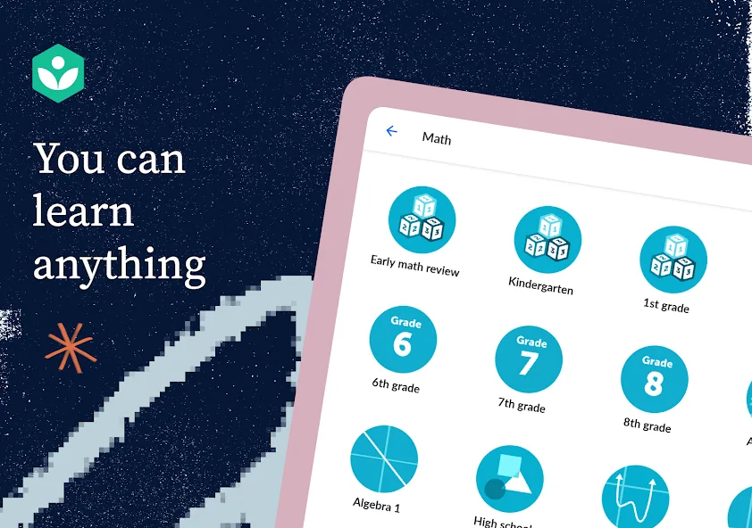</a> | [Khan Academy (Google Play)](references/46-khan-academy/README.md) · [official product](https://play.google.com/store/apps/details?id=org.khanacademy.android) | browser driven here, 2 named gaps | Google Play — Education | mobile-single-column: Single-column mobile hierarchy with top context and a vertically scrolling primary surface. Panels: toolbar/header (top); scrolling content or app screen (center). Density: low; confidence: medium. | Study how subject breadth is organized through interface screenshots, while nonprofit identity, download scale, reviews, and data-safety information establish context for adoption. |
| 47 | <a href="https://play.google.com/store/apps/details?id=com.medium.reader">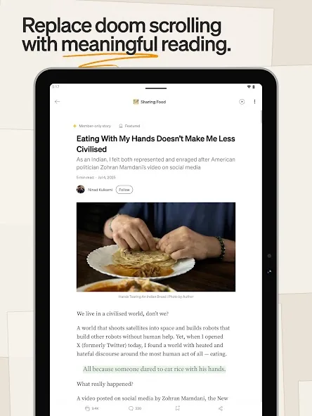</a> | [Medium (Google Play)](references/47-medium/README.md) · [official product](https://play.google.com/store/apps/details?id=com.medium.reader) | browser driven here, 2 named gaps | Google Play — News & Magazines | mobile-single-column: Single-column mobile hierarchy with top context and a vertically scrolling primary surface. Panels: toolbar/header (top); scrolling content or app screen (center). Density: medium; confidence: medium. | Study how article typography and topic discovery are allowed to carry the visual story, connecting acquisition media directly to the reading experience. |
| 48 |  | [Goodreads (Google Play)](references/48-goodreads/README.md) · [official product](https://play.google.com/store/apps/details?id=com.goodreads) | browser driven here, 2 named gaps | Google Play — Books & Reference | mobile-single-column: Single-column mobile hierarchy with top context and a vertically scrolling primary surface. Panels: toolbar/header (top); bottom navigation/action area (bottom); scrolling content or app screen (center). Density: low; confidence: medium. | Study the screenshots' progression from book discovery and ratings to shelves, scanning, reviews, and reading goals, mirroring a repeat engagement loop. |
| 49 |  | [YouTube Music (Google Play)](references/49-youtube-music/README.md) · [official product](https://play.google.com/store/apps/details?id=com.google.android.apps.youtube.music) | browser driven here, 2 named gaps | Google Play — Music & Audio | mobile-single-column: Single-column mobile hierarchy with top context and a vertically scrolling primary surface. Panels: toolbar/header (top); bottom navigation/action area (bottom); scrolling content or app screen (center). Density: low; confidence: medium. | Study how personalized mixes, search, video access, downloads, and background listening are ordered across media, with subscription value linked to recognizable interface states. |
| 50 |  | [Tinder Dating App: Chat & Date (Google Play)](references/50-tinder-dating-app-chat-date/README.md) · [official product](https://play.google.com/store/apps/details?id=com.tinder) | browser driven here, 2 named gaps | Google Play — Dating | mobile-single-column: Single-column mobile hierarchy with top context and a vertically scrolling primary surface. Panels: toolbar/header (top); bottom navigation/action area (bottom); scrolling content or app screen (center). Density: low; confidence: medium. | Study how the card-swipe interaction is made legible in static screenshots, then expanded into matching, chat, trust features, ratings, and data-safety disclosures. |

Normalized panel bounds, detected separators, image dimensions, source-image URLs, hashes, and analysis confidence are recorded in [`sources.json`](sources.json). Media kinds, measured durations, provenance classes, and per-record gaps are in [`references.json`](references.json).

Attribution and product ownership remain with the linked source.
