# CLI examples

Command-line interfaces designed for discoverability, composition, and automation.

Each entry pairs an attributed overview image and a measured panel anatomy with a per-product record: motion evidence, named states, an observed first-success journey, interaction and recovery behavior, accessibility observations, and provenance. Every number below is measured by `verify-reference-evidence.py`, and a record that is missing evidence says so in its own `evidence_gaps`.

**Examples:** 50  
**Images:** 50  
**Structural analyses:** 50  
**Records with no remaining gap:** 0  
**Records with named gaps:** 50 (100 gaps)  
**Motion provenance:** 50 product run here  
**Curated:** 2026-08-16  
**Visual source data:** [`sources.json`](sources.json)  
**Record index:** [`references.json`](references.json)  
**Cross-example synthesis:** [`full-reference.md`](full-reference.md)

| # | Reference image | Record | Motion evidence | Category | Interface structure | What to study |
|---:|---|---|---|---|---|---|
| 1 |  | [Git](references/01-git/README.md) · [official product](https://git-scm.com/docs/git) | product run here, 2 named gaps | Developer tools / version control | split-terminal: Two side-by-side terminal work areas with shared command context. Panels: status/action bar (bottom); primary terminal pane (leading); secondary terminal pane (trailing). Density: medium; confidence: medium. | Study the noun-and-verb subcommand model, pervasive contextual help, stable exit statuses, and plumbing commands designed for composition in scripts. |
| 2 | <a href="https://cli.github.com/manual/">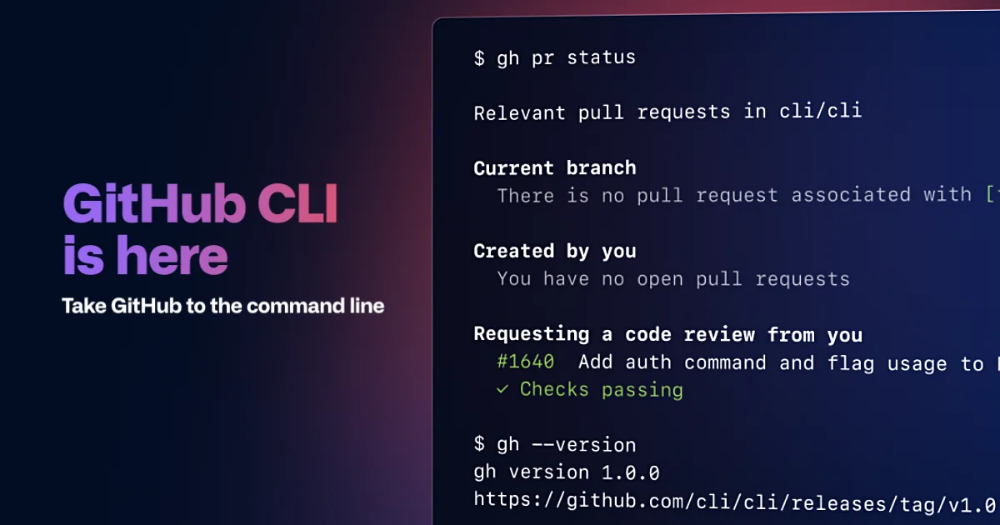</a> | [GitHub CLI (gh)](references/02-github-cli-gh/README.md) · [official product](https://cli.github.com/manual/) | product run here, 2 named gaps | Developer tools / code hosting | split-terminal: Two side-by-side terminal work areas with shared command context. Panels: primary terminal pane (leading); secondary terminal pane (trailing). Density: low; confidence: medium. | Study the consistent repository context inference, interactive-to-flag fallback, and --json, --jq, and --template modes for machine-readable automation. |
| 3 | <a href="https://docs.gitlab.com/cli/">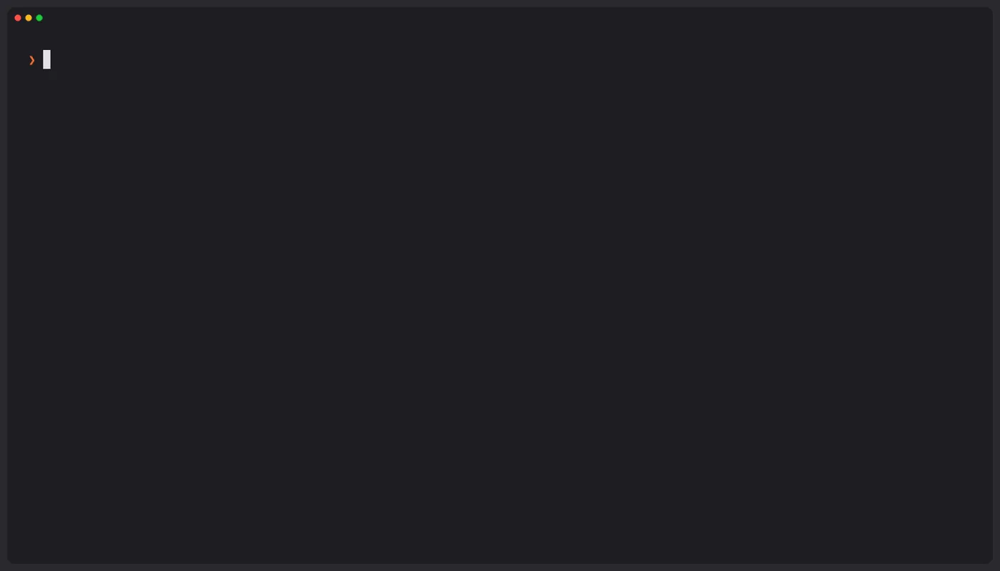</a> | [GitLab CLI (glab)](references/03-gitlab-cli-glab/README.md) · [official product](https://docs.gitlab.com/cli/) | product run here, 2 named gaps | Developer tools / code hosting | command-output: Single command-and-output flow without a stable secondary panel. Panels: toolbar/header (top); command and output flow (center). Density: low; confidence: medium. | Study how commands map onto merge-request and issue workflows while supporting host configuration, environment variables, and noninteractive scripting. |
| 4 | <a href="https://doc.rust-lang.org/cargo/commands/index.html">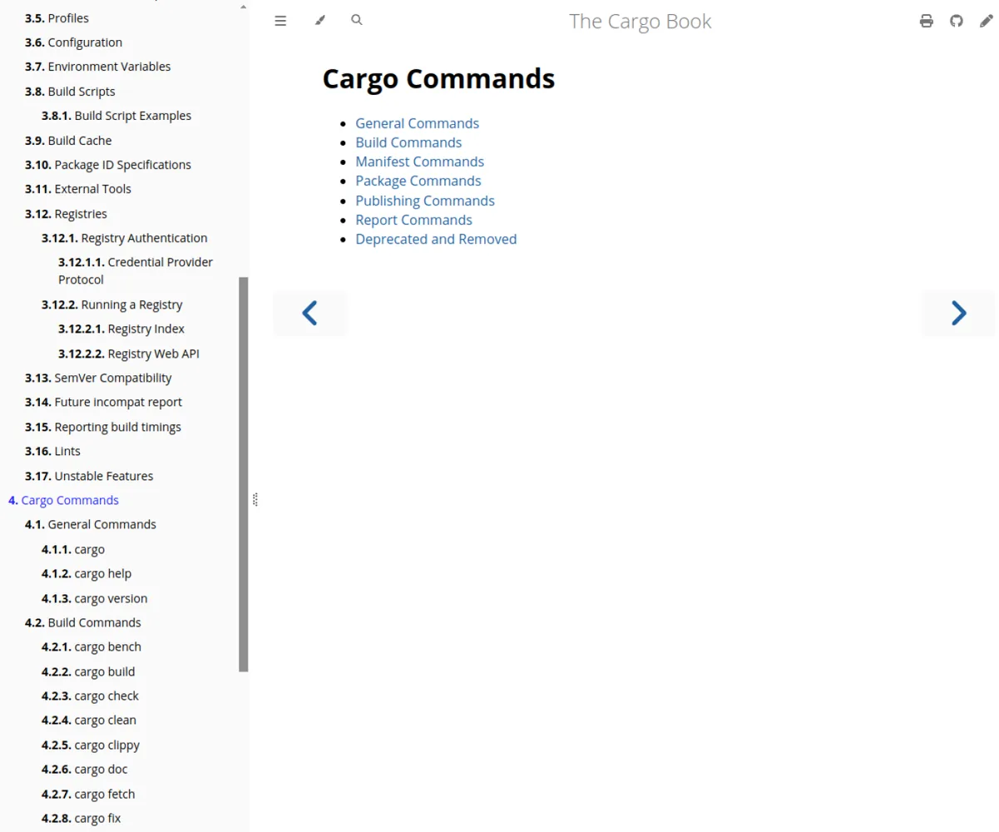</a> | [Cargo](references/04-cargo/README.md) · [official product](https://doc.rust-lang.org/cargo/commands/index.html) | product run here, 2 named gaps | Developer tools / build and package management | stacked-terminal: Two vertically stacked terminal work areas. Panels: toolbar/header (top); primary terminal pane (top); secondary terminal pane (bottom). Density: low; confidence: medium. | Study the uniform command families, feature-selection flags, concise compiler-linked output, and metadata command that exposes workspace state as JSON. |
| 5 | <a href="https://pkg.go.dev/cmd/go">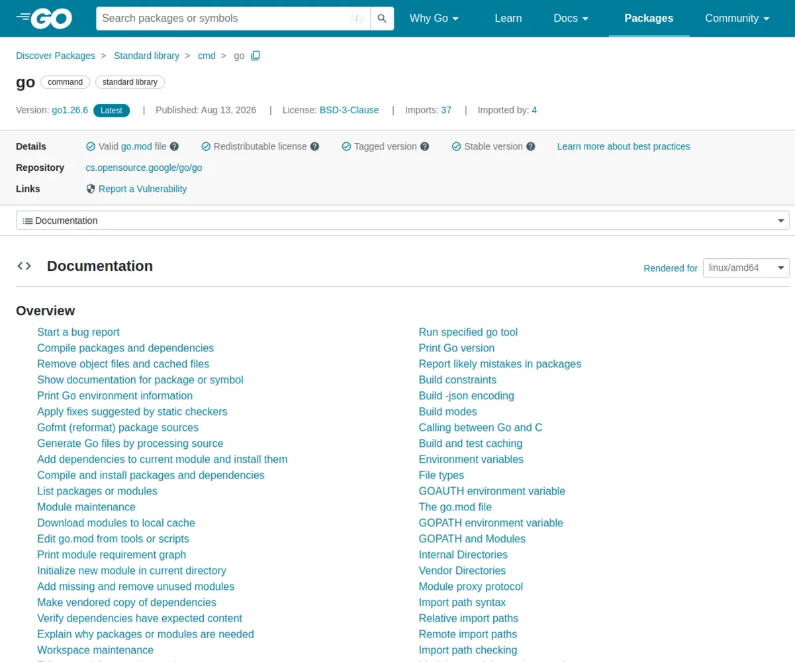</a> | [Go command](references/05-go-command/README.md) · [official product](https://pkg.go.dev/cmd/go) | product run here, 2 named gaps | Developer tools / build and package management | split-terminal: Two side-by-side terminal work areas with shared command context. Panels: primary terminal pane (leading); secondary terminal pane (trailing). Density: low; confidence: medium. | Study the compact verb vocabulary, module-aware configuration, environment inspection through go env, and scriptable listing through templated or JSON output. |
| 6 | <a href="https://docs.astral.sh/uv/reference/cli/">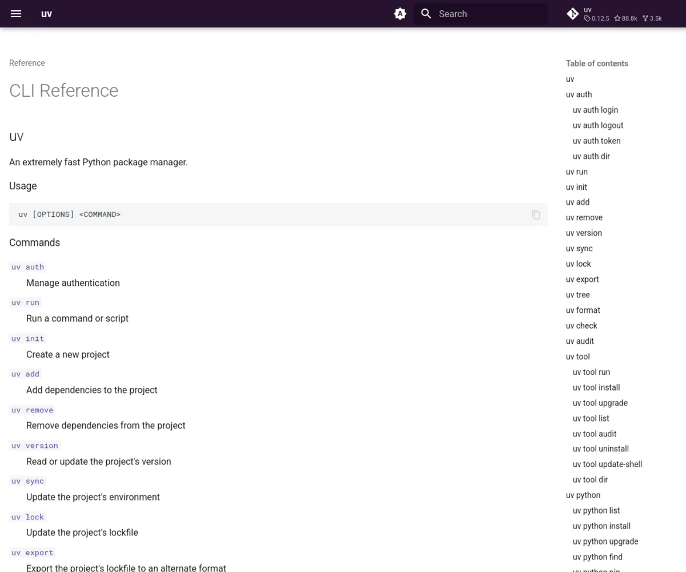</a> | [uv](references/06-uv/README.md) · [official product](https://docs.astral.sh/uv/reference/cli/) | product run here, 2 named gaps | Package management / Python | stacked-terminal: Two vertically stacked terminal work areas. Panels: status/action bar (bottom); primary terminal pane (top); secondary terminal pane (bottom). Density: low; confidence: medium. | Study the coherent command hierarchy spanning tools, projects, Python versions, and pip compatibility, with explicit verbosity, color, cache, and configuration controls. |
| 7 | <a href="https://docs.npmjs.com/cli/">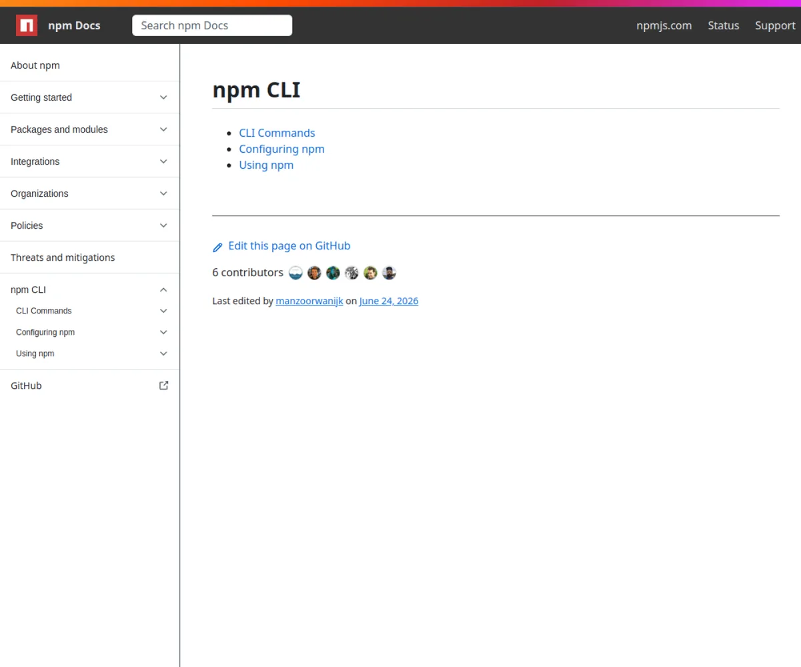</a> | [npm CLI](references/07-npm-cli/README.md) · [official product](https://docs.npmjs.com/cli/) | product run here, 2 named gaps | Package management / JavaScript | split-terminal: Two side-by-side terminal work areas with shared command context. Panels: toolbar/header (top); primary terminal pane (leading); secondary terminal pane (trailing). Density: low; confidence: medium. | Study layered configuration across flags, environment, user files, and project files, plus commands such as npm view that can emit parseable JSON. |
| 8 | <a href="https://pnpm.io/pnpm-cli">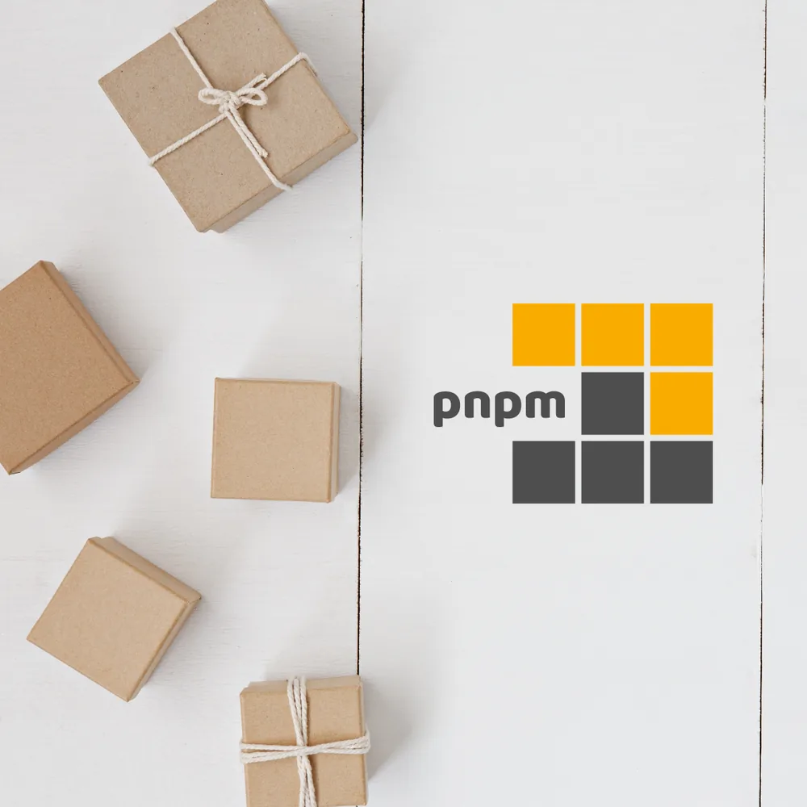</a> | [pnpm](references/08-pnpm/README.md) · [official product](https://pnpm.io/pnpm-cli) | product run here, 2 named gaps | Package management / JavaScript | split-terminal: Two side-by-side terminal work areas with shared command context. Panels: primary terminal pane (leading); secondary terminal pane (trailing). Density: low; confidence: medium. | Study recursive workspace commands, filtering syntax, strict option organization, and reporter choices that separate human-readable progress from automation-oriented output. |
| 9 | <a href="https://pip.pypa.io/en/stable/cli/">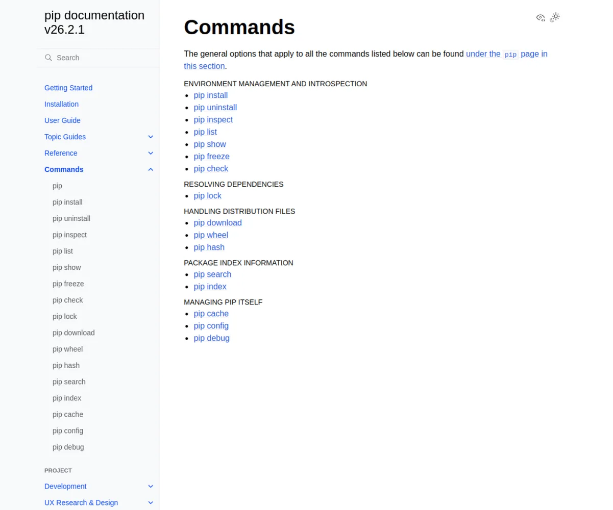</a> | [pip](references/09-pip/README.md) · [official product](https://pip.pypa.io/en/stable/cli/) | product run here, 2 named gaps | Package management / Python | split-terminal: Two side-by-side terminal work areas with shared command context. Panels: toolbar/header (top); primary terminal pane (leading); secondary terminal pane (trailing). Density: low; confidence: medium. | Study standardized global options, requirements-file composition, actionable dependency errors, and inspection commands with JSON report or structured output modes. |
| 10 | <a href="https://docs.brew.sh/Manpage">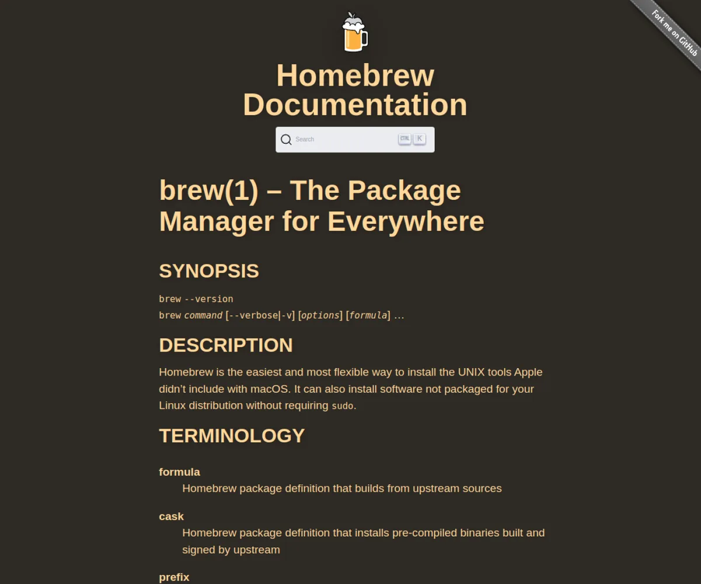</a> | [Homebrew](references/10-homebrew/README.md) · [official product](https://docs.brew.sh/Manpage) | product run here, 2 named gaps | Package management / system | split-terminal: Two side-by-side terminal work areas with shared command context. Panels: status/action bar (bottom); primary terminal pane (leading); secondary terminal pane (trailing). Density: low; confidence: medium. | Study discoverable command aliases, environment diagnostics through doctor and config, shell completion, and JSON output for package metadata and dependency queries. |
| 11 | <a href="https://manpages.debian.org/bookworm/apt/apt.8.en.html">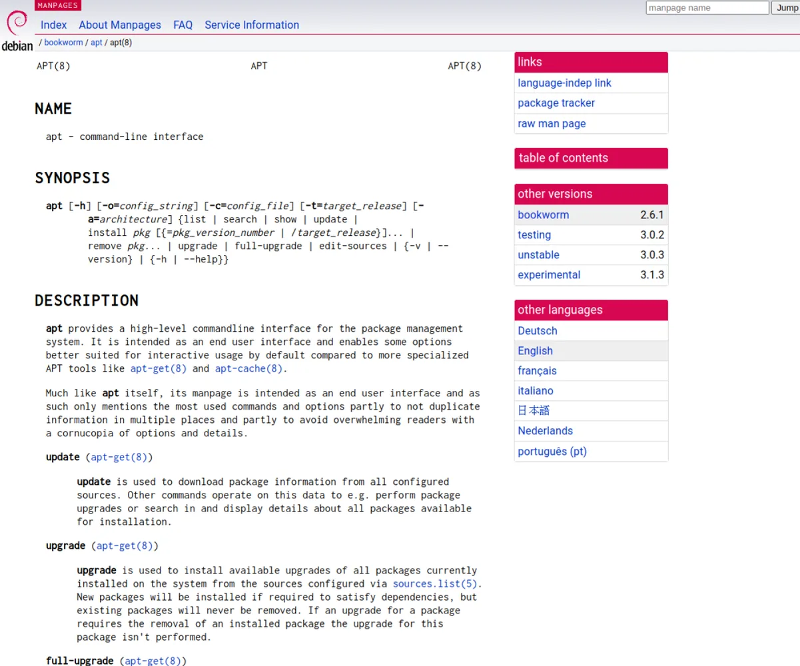</a> | [APT](references/11-apt/README.md) · [official product](https://manpages.debian.org/bookworm/apt/apt.8.en.html) | product run here, 2 named gaps | Package management / system | stacked-terminal: Two vertically stacked terminal work areas. Panels: status/action bar (bottom); primary terminal pane (top); secondary terminal pane (bottom). Density: medium; confidence: medium. | Study the distinction between the human-oriented apt frontend and stable lower-level tools, including clear simulation, assumption, and noninteractive controls. |
| 12 | <a href="https://dnf.readthedocs.io/en/latest/command_ref.html">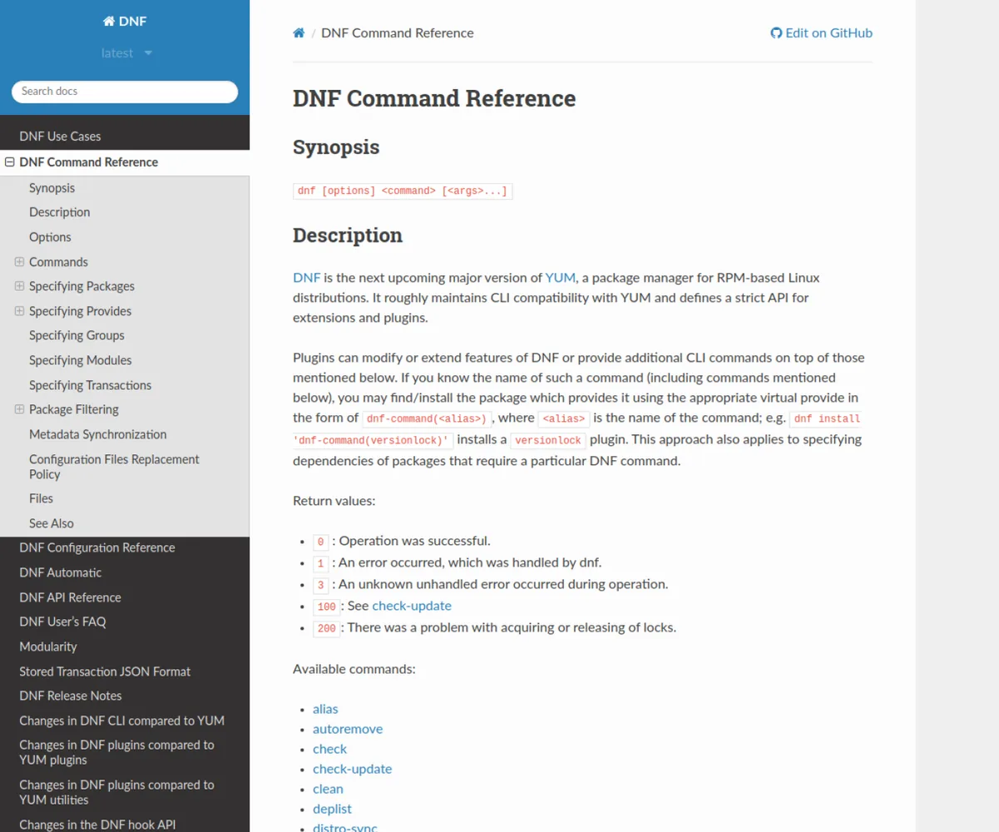</a> | [DNF](references/12-dnf/README.md) · [official product](https://dnf.readthedocs.io/en/latest/command_ref.html) | product run here, 2 named gaps | Package management / system | split-terminal: Two side-by-side terminal work areas with shared command context. Panels: toolbar/header (top); primary terminal pane (leading); secondary terminal pane (trailing). Density: low; confidence: medium. | Study the command-plus-options grammar, transaction previews, repository-scoped configuration, and explicit exit behavior for check-update and automation workflows. |
| 13 | <a href="https://nix.dev/manual/nix/latest/command-ref/new-cli/nix">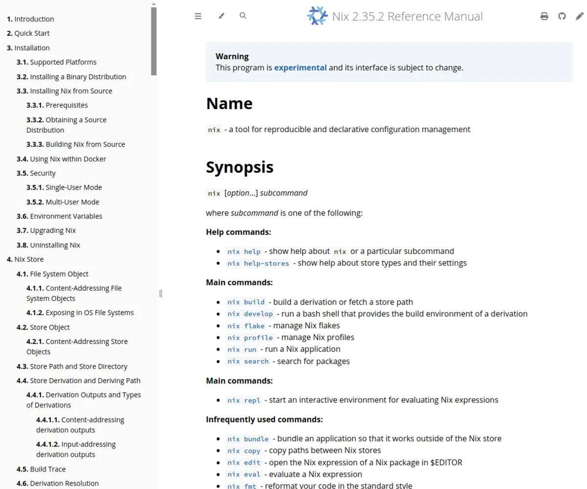</a> | [Nix CLI](references/13-nix-cli/README.md) · [official product](https://nix.dev/manual/nix/latest/command-ref/new-cli/nix) | product run here, 2 named gaps | Package management / reproducible systems | split-terminal: Two side-by-side terminal work areas with shared command context. Panels: status/action bar (bottom); primary terminal pane (leading); secondary terminal pane (trailing). Density: medium; confidence: medium. | Study nested subcommands around stores, flakes, profiles, and derivations, with experimental-feature gating and JSON output for reproducible automation. |
| 14 |  | [Docker CLI](references/14-docker-cli/README.md) · [official product](https://docs.docker.com/reference/cli/docker/) | product run here, 2 named gaps | Infrastructure / containers | split-terminal: Two side-by-side terminal work areas with shared command context. Panels: status/action bar (bottom); primary terminal pane (leading); secondary terminal pane (trailing). Density: low; confidence: medium. | Study object-oriented command groups, context selection, configuration precedence, Go-template formatting, and quiet or JSON-like modes for pipeline use. |
| 15 | <a href="https://docs.podman.io/en/latest/Commands.html">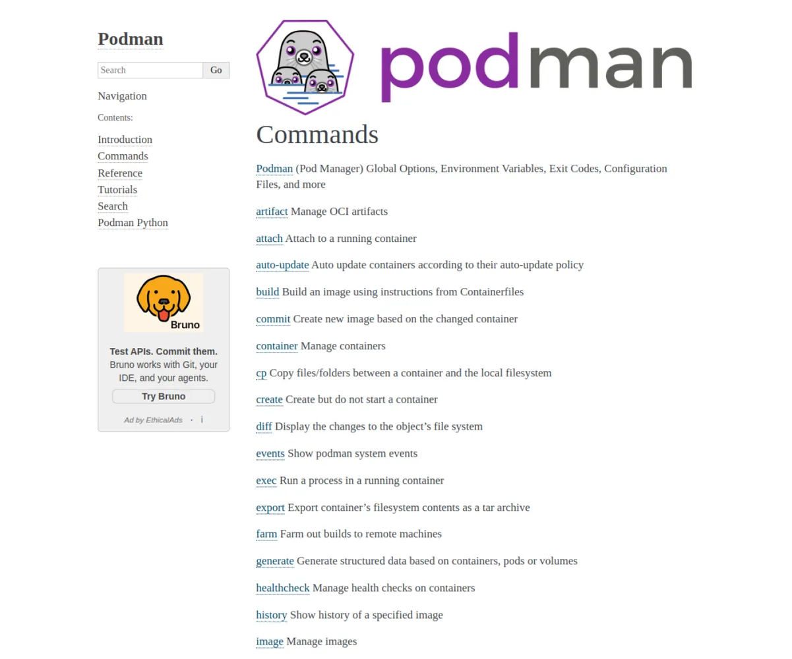</a> | [Podman](references/15-podman/README.md) · [official product](https://docs.podman.io/en/latest/Commands.html) | product run here, 2 named gaps | Infrastructure / containers | split-terminal: Two side-by-side terminal work areas with shared command context. Panels: status/action bar (bottom); primary terminal pane (leading); secondary terminal pane (trailing). Density: low; confidence: medium. | Study Docker-compatible command design alongside rootless operation, remote connections, generated system artifacts, and configurable JSON or template output. |
| 16 | <a href="https://kubernetes.io/docs/reference/generated/kubectl/kubectl-commands">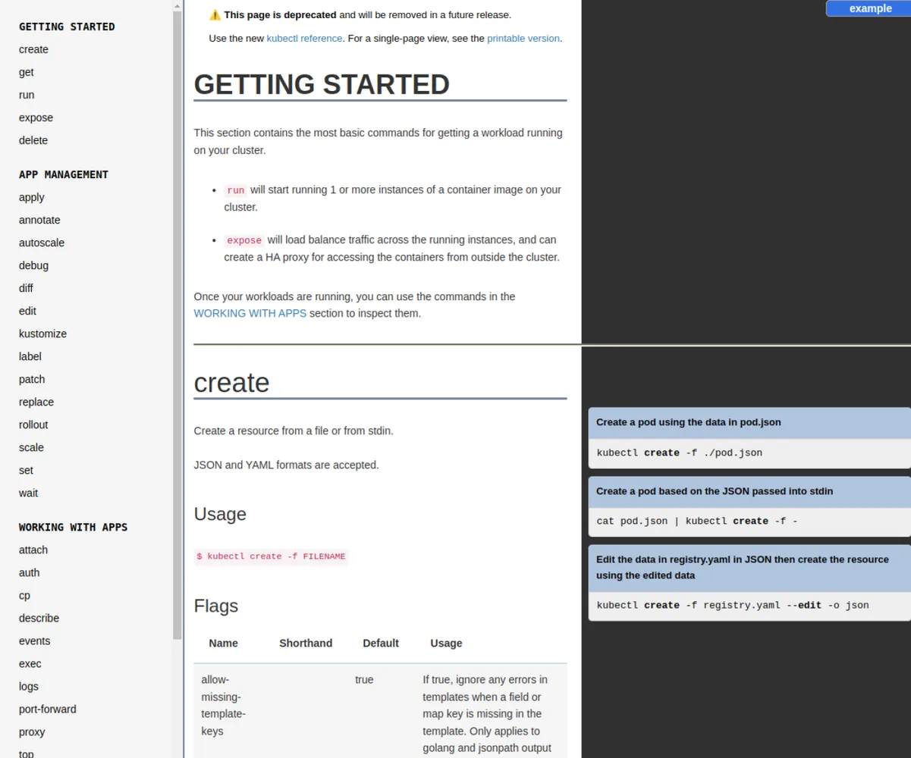</a> | [kubectl](references/16-kubectl/README.md) · [official product](https://kubernetes.io/docs/reference/generated/kubectl/kubectl-commands) | product run here, 2 named gaps | Infrastructure / orchestration | split-terminal: Two side-by-side terminal work areas with shared command context. Panels: toolbar/header (top); primary terminal pane (leading); secondary terminal pane (trailing). Density: low; confidence: medium. | Study resource-oriented verbs, label and field selectors, dry-run behavior, declarative file input, and JSON, YAML, JSONPath, and template output modes. |
| 17 | <a href="https://helm.sh/docs/helm/">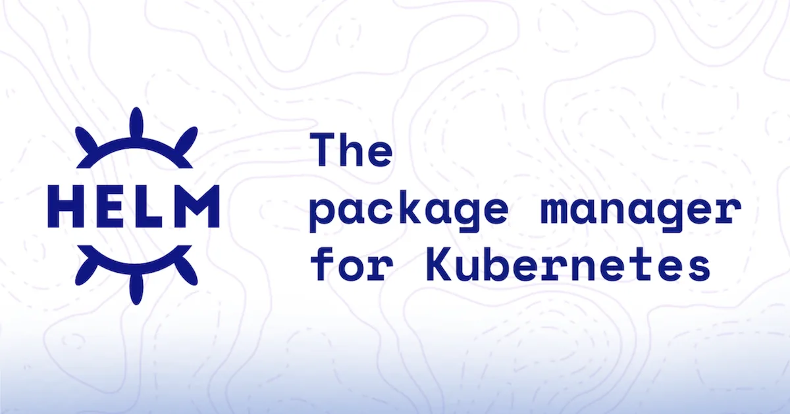</a> | [Helm](references/17-helm/README.md) · [official product](https://helm.sh/docs/helm/) | product run here, 2 named gaps | Infrastructure / orchestration | split-terminal: Two side-by-side terminal work areas with shared command context. Panels: primary terminal pane (leading); secondary terminal pane (trailing). Density: low; confidence: medium. | Study consistent release-oriented subcommands, values-file layering, dry-run and debug feedback, and structured output options on inspection and listing commands. |
| 18 | <a href="https://developer.hashicorp.com/terraform/cli/commands">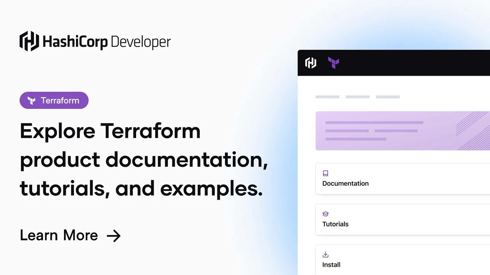</a> | [Terraform CLI](references/18-terraform-cli/README.md) · [official product](https://developer.hashicorp.com/terraform/cli/commands) | product run here, 2 named gaps | Infrastructure / infrastructure as code | split-terminal: Two side-by-side terminal work areas with shared command context. Panels: toolbar/header (top); primary terminal pane (leading); secondary terminal pane (trailing). Density: low; confidence: medium. | Study the plan-then-apply safety model, detailed exit codes, environment-based automation controls, and machine-readable plan conversion through terraform show -json. |
| 19 | <a href="https://opentofu.org/docs/cli/commands/">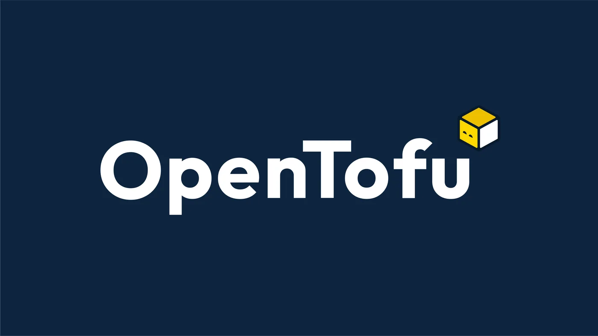</a> | [OpenTofu CLI](references/19-opentofu-cli/README.md) · [official product](https://opentofu.org/docs/cli/commands/) | product run here, 2 named gaps | Infrastructure / infrastructure as code | split-terminal: Two side-by-side terminal work areas with shared command context. Panels: primary terminal pane (leading); secondary terminal pane (trailing). Density: low; confidence: medium. | Study explicit workflow stages, saved-plan handoff, detailed exit codes, workspace configuration, and JSON representations intended for external tooling. |
| 20 | <a href="https://docs.ansible.com/ansible/latest/command_guide/command_line_tools.html">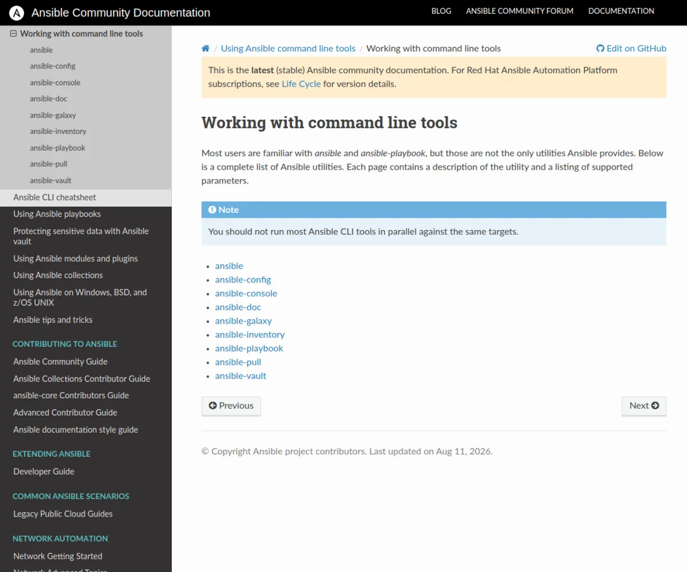</a> | [Ansible command-line tools](references/20-ansible-command-line-tools/README.md) · [official product](https://docs.ansible.com/ansible/latest/command_guide/command_line_tools.html) | product run here, 2 named gaps | Infrastructure / configuration management | split-terminal: Two side-by-side terminal work areas with shared command context. Panels: toolbar/header (top); primary terminal pane (leading); secondary terminal pane (trailing). Density: low; confidence: medium. | Study the separation of ad hoc, playbook, inventory, vault, and documentation commands, plus inventory graph and JSON inspection for automation. |
| 21 | <a href="https://developer.hashicorp.com/packer/docs/commands">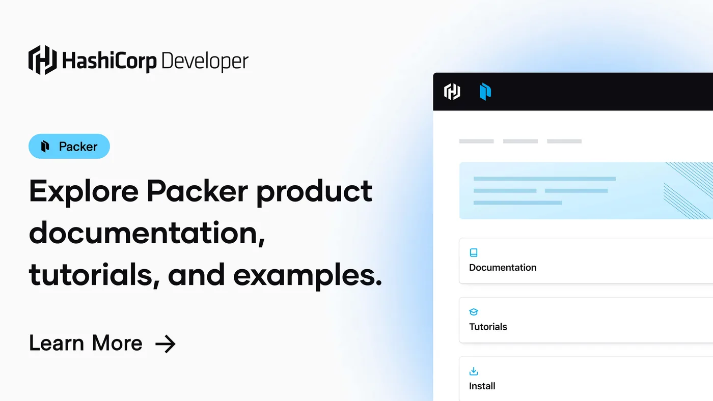</a> | [Packer](references/21-packer/README.md) · [official product](https://developer.hashicorp.com/packer/docs/commands) | product run here, 2 named gaps | Infrastructure / image building | split-terminal: Two side-by-side terminal work areas with shared command context. Panels: toolbar/header (top); primary terminal pane (leading); secondary terminal pane (trailing). Density: low; confidence: medium. | Study predictable init, validate, inspect, build, and fix stages, with machine-readable build output and explicit variable-file configuration. |
| 22 | <a href="https://developer.hashicorp.com/vagrant/docs/cli">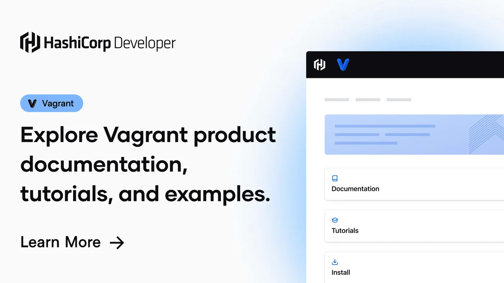</a> | [Vagrant](references/22-vagrant/README.md) · [official product](https://developer.hashicorp.com/vagrant/docs/cli) | product run here, 2 named gaps | Infrastructure / development environments | split-terminal: Two side-by-side terminal work areas with shared command context. Panels: toolbar/header (top); primary terminal pane (leading); secondary terminal pane (trailing). Density: low; confidence: medium. | Study lifecycle verbs shared across providers, machine-readable output for integrations, provider selection, and command-scoped help that exposes operational context. |
| 23 | <a href="https://www.pulumi.com/docs/iac/cli/">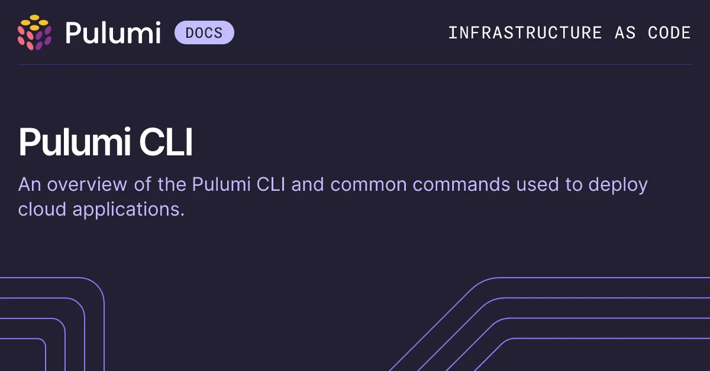</a> | [Pulumi CLI](references/23-pulumi-cli/README.md) · [official product](https://www.pulumi.com/docs/iac/cli/) | product run here, 2 named gaps | Infrastructure / infrastructure as code | stacked-terminal: Two vertically stacked terminal work areas. Panels: toolbar/header (top); status/action bar (bottom); primary terminal pane (top); secondary terminal pane (bottom). Density: low; confidence: medium. | Study stack-centered command design, preview-before-update interaction, configuration and secrets handling, and JSON output for previews, state, and stack metadata. |
| 24 | <a href="https://docs.aws.amazon.com/cli/latest/reference/">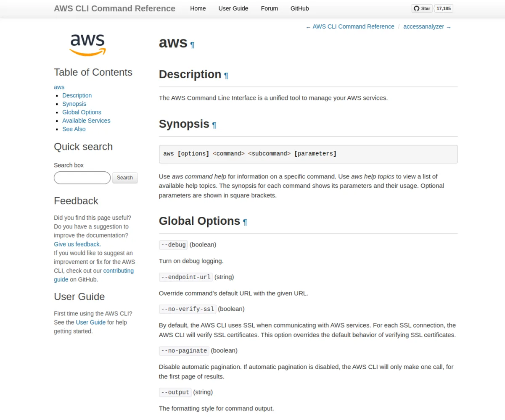</a> | [AWS CLI](references/24-aws-cli/README.md) · [official product](https://docs.aws.amazon.com/cli/latest/reference/) | product run here, 2 named gaps | Infrastructure / cloud platforms | split-terminal: Two side-by-side terminal work areas with shared command context. Panels: status/action bar (bottom); primary terminal pane (leading); secondary terminal pane (trailing). Density: low; confidence: medium. | Study the service-operation hierarchy, profile and region precedence, client-side query expressions, pagination controls, and selectable JSON, YAML, text, or table output. |
| 25 |  | [Google Cloud CLI (gcloud)](references/25-google-cloud-cli-gcloud/README.md) · [official product](https://cloud.google.com/sdk/gcloud/reference) | product run here, 2 named gaps | Infrastructure / cloud platforms | split-terminal: Two side-by-side terminal work areas with shared command context. Panels: toolbar/header (top); status/action bar (bottom); primary terminal pane (leading); secondary terminal pane (trailing). Density: low; confidence: medium. | Study deeply nested command groups, named configurations, topic-based help, projections and filters, and stable JSON, YAML, CSV, or value-only formatting. |
| 26 |  | [Azure CLI](references/26-azure-cli/README.md) · [official product](https://learn.microsoft.com/en-us/cli/azure/reference-index) | product run here, 2 named gaps | Infrastructure / cloud platforms | split-terminal: Two side-by-side terminal work areas with shared command context. Panels: primary terminal pane (leading); secondary terminal pane (trailing). Density: low; confidence: medium. | Study resource-group-oriented command families, JMESPath queries, subscription defaults, and explicit JSON, JSONC, YAML, table, TSV, or none output modes. |
| 27 | <a href="https://github.com/digitalocean/doctl">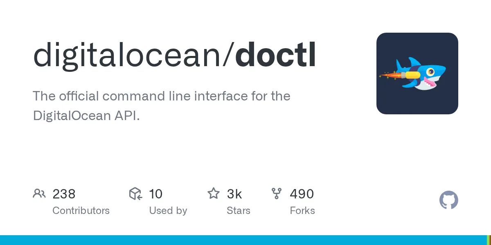</a> | [DigitalOcean CLI (doctl)](references/27-digitalocean-cli-doctl/README.md) · [official product](https://github.com/digitalocean/doctl) | product run here, 2 named gaps | Infrastructure / cloud platforms | split-terminal: Two side-by-side terminal work areas with shared command context. Panels: status/action bar (bottom); primary terminal pane (leading); secondary terminal pane (trailing). Density: low; confidence: medium. | Study resource-centered subcommands, context-based credential configuration, wait behavior for asynchronous actions, and JSON or custom-format output for scripts. |
| 28 | <a href="https://docs.oracle.com/en-us/iaas/Content/API/Concepts/cliconcepts.htm">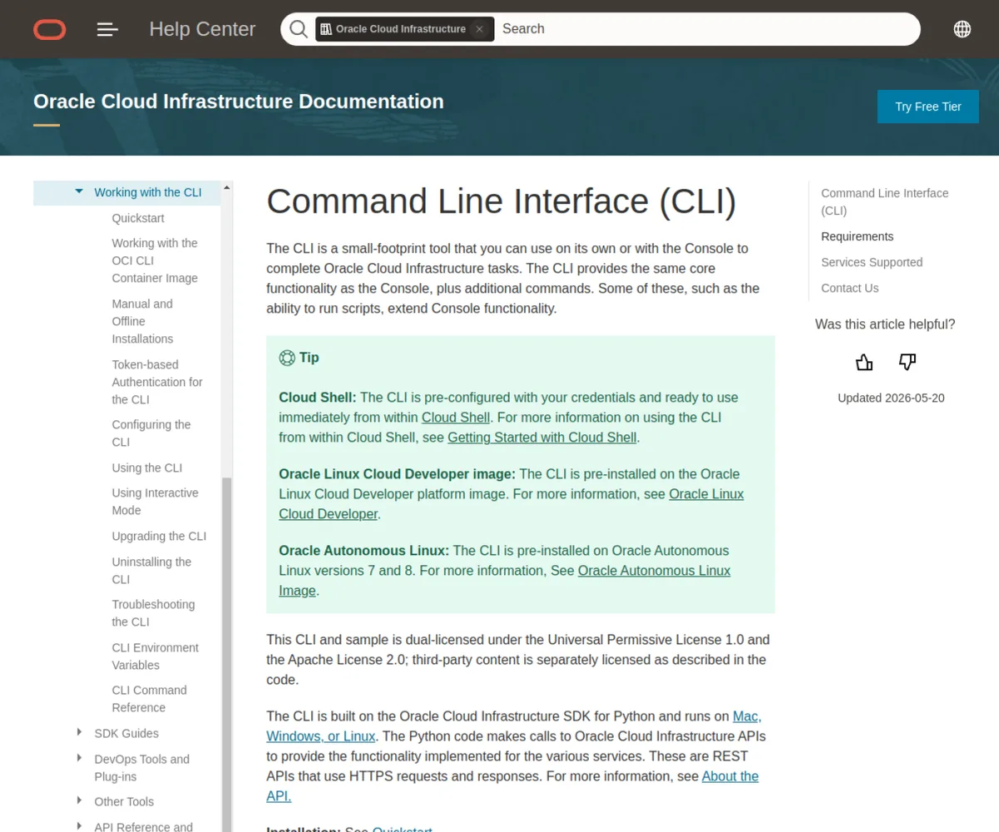</a> | [Oracle Cloud Infrastructure CLI](references/28-oracle-cloud-infrastructure-cli/README.md) · [official product](https://docs.oracle.com/en-us/iaas/Content/API/Concepts/cliconcepts.htm) | product run here, 2 named gaps | Infrastructure / cloud platforms | split-terminal: Two side-by-side terminal work areas with shared command context. Panels: toolbar/header (top); status/action bar (bottom); primary terminal pane (leading); secondary terminal pane (trailing). Density: medium; confidence: medium. | Study generated service and operation hierarchies, profile configuration, JMESPath querying, JSON input templates, and raw JSON output for API-level automation. |
| 29 | <a href="https://curl.se/docs/manpage.html">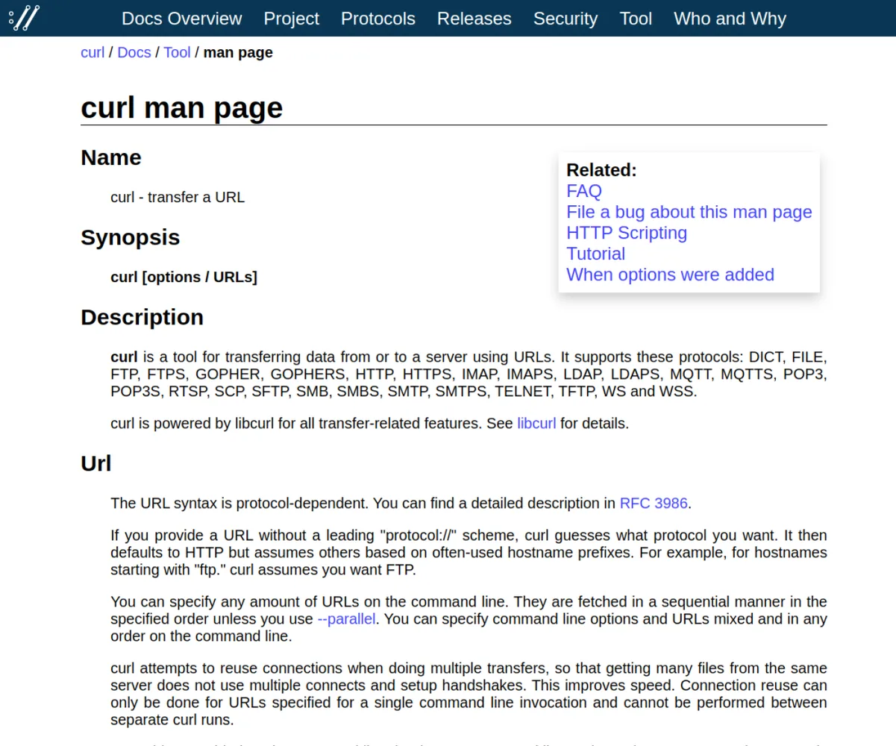</a> | [curl](references/29-curl/README.md) · [official product](https://curl.se/docs/manpage.html) | product run here, 2 named gaps | Networking / data transfer | split-terminal: Two side-by-side terminal work areas with shared command context. Panels: toolbar/header (top); status/action bar (bottom); primary terminal pane (leading); secondary terminal pane (trailing). Density: medium; confidence: medium. | Study orthogonal flags, stdin and stdout composability, precise failure controls, retry policy, and --write-out variables including JSON for transfer telemetry. |
| 30 | <a href="https://github.com/httpie/cli">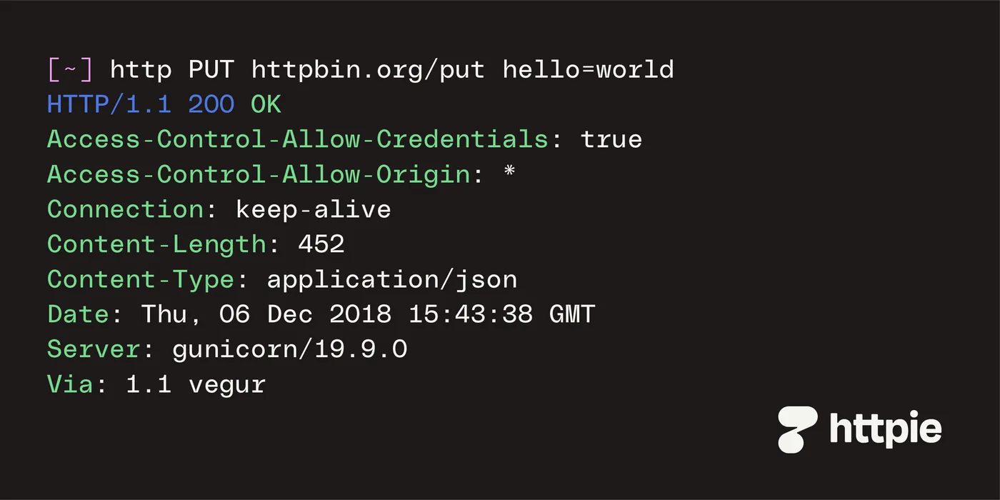</a> | [HTTPie CLI](references/30-httpie-cli/README.md) · [official product](https://github.com/httpie/cli) | product run here, 2 named gaps | Networking / HTTP clients | split-terminal: Two side-by-side terminal work areas with shared command context. Panels: toolbar/header (top); primary terminal pane (leading); secondary terminal pane (trailing). Density: low; confidence: medium. | Study readable request-item syntax for headers and data, session persistence, explicit offline mode, and switches separating pretty interactive output from redirected output. |
| 31 |  | [GNU Wget](references/31-gnu-wget/README.md) · [official product](https://www.gnu.org/software/wget/manual/wget.html) | product run here, 2 named gaps | Networking / data transfer | split-terminal: Two side-by-side terminal work areas with shared command context. Panels: primary terminal pane (leading); secondary terminal pane (trailing). Density: low; confidence: medium. | Study recursive retrieval controls, resume and timestamp semantics, configuration-file layering, background operation, and distinct logging levels for unattended jobs. |
| 32 | <a href="https://nmap.org/book/man.html">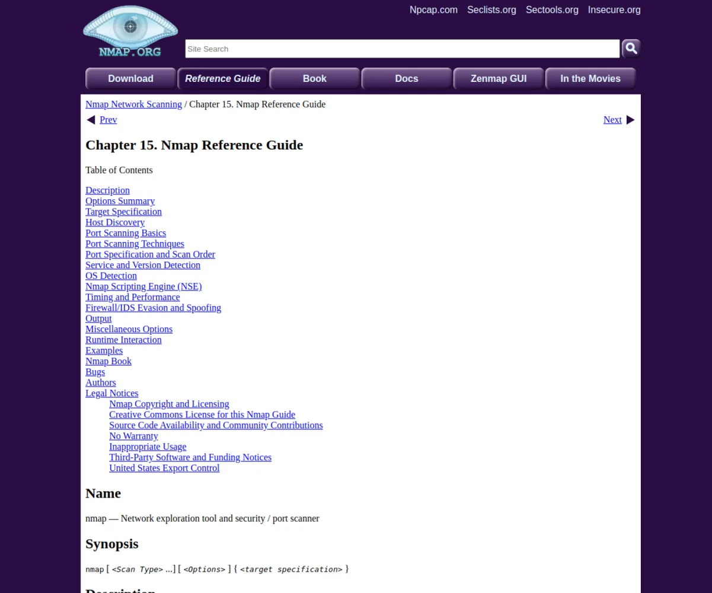</a> | [Nmap](references/32-nmap/README.md) · [official product](https://nmap.org/book/man.html) | product run here, 2 named gaps | Networking / discovery and diagnostics | stacked-terminal: Two vertically stacked terminal work areas. Panels: toolbar/header (top); primary terminal pane (top); secondary terminal pane (bottom). Density: low; confidence: medium. | Study scan-type composition, privilege-aware diagnostics, target and port expression grammars, and normal, XML, grepable, and script-kiddie output separation. |
| 33 | <a href="https://bind9.readthedocs.io/en/latest/manpages.html">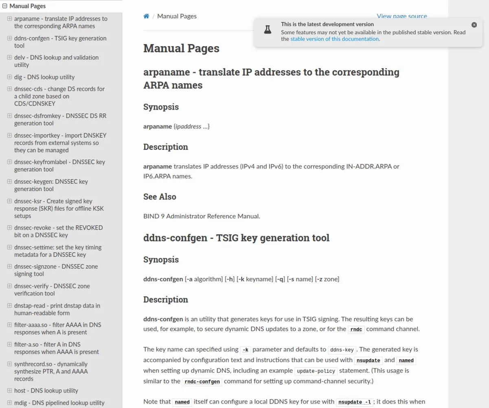</a> | [dig](references/33-dig/README.md) · [official product](https://bind9.readthedocs.io/en/latest/manpages.html) | product run here, 2 named gaps | Networking / DNS diagnostics | split-terminal: Two side-by-side terminal work areas with shared command context. Panels: toolbar/header (top); status/action bar (bottom); primary terminal pane (leading); secondary terminal pane (trailing). Density: medium; confidence: medium. | Study the compact query grammar, per-query plus-options, short-answer mode, and batch-file support for composing repeatable DNS investigations. |
| 34 | <a href="https://github.com/iproute2/iproute2">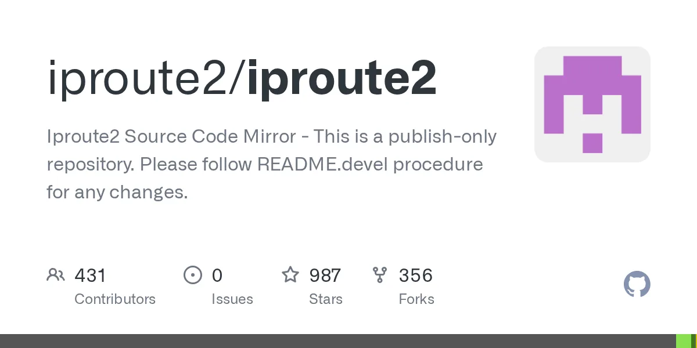</a> | [iproute2](references/34-iproute2/README.md) · [official product](https://github.com/iproute2/iproute2) | product run here, 2 named gaps | Networking / system utilities | split-terminal: Two side-by-side terminal work areas with shared command context. Panels: status/action bar (bottom); primary terminal pane (leading); secondary terminal pane (trailing). Density: low; confidence: medium. | Study the shared object-action grammar across ip link, address, route, and neighbor, with brief, one-line, details, statistics, and JSON output switches. |
| 35 | <a href="https://docs.openssl.org/3.5/man1/">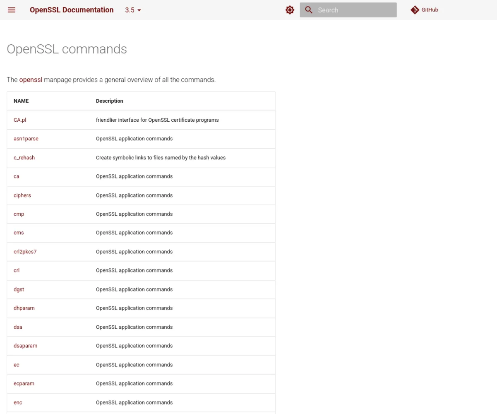</a> | [OpenSSL command-line tools](references/35-openssl-command-line-tools/README.md) · [official product](https://docs.openssl.org/3.5/man1/) | product run here, 2 named gaps | Security / cryptography and TLS | split-terminal: Two side-by-side terminal work areas with shared command context. Panels: toolbar/header (top); status/action bar (bottom); primary terminal pane (leading); secondary terminal pane (trailing). Density: low; confidence: medium. | Study the command family split between certificate, key, protocol, and diagnostic operations, plus explicit input and output formats and verification errors. |
| 36 |  | [age](references/36-age/README.md) · [official product](https://github.com/FiloSottile/age) | product run here, 2 named gaps | Security / file encryption | split-terminal: Two side-by-side terminal work areas with shared command context. Panels: status/action bar (bottom); primary terminal pane (leading); secondary terminal pane (trailing). Density: low; confidence: medium. | Study a deliberately small encrypt/decrypt interface, safe terminal behavior for secrets, composable stdin and stdout operation, and identity-file conventions. |
| 37 | <a href="https://github.com/getsops/sops">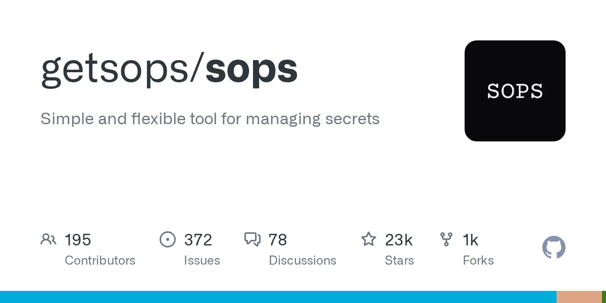</a> | [SOPS](references/37-sops/README.md) · [official product](https://github.com/getsops/sops) | product run here, 2 named gaps | Security / secrets management | split-terminal: Two side-by-side terminal work areas with shared command context. Panels: toolbar/header (top); status/action bar (bottom); primary terminal pane (leading); secondary terminal pane (trailing). Density: low; confidence: medium. | Study editing encrypted structured documents in place, configuration-driven key selection, preserved data formats, and extract or set operations suitable for scripts. |
| 38 | <a href="https://docs.sigstore.dev/cosign/system_config/installation/">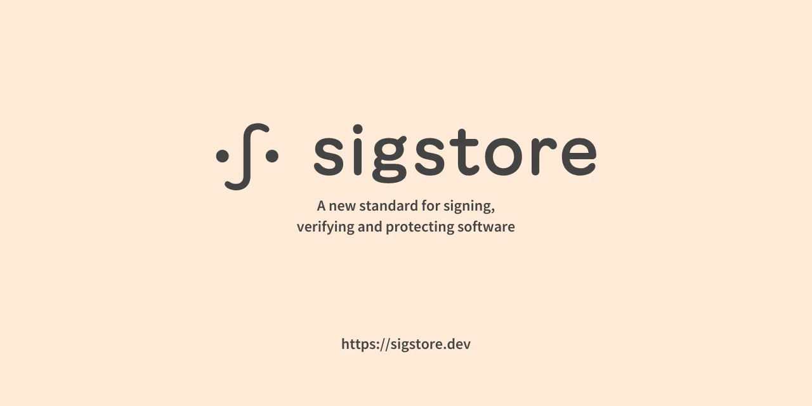</a> | [Cosign](references/38-cosign/README.md) · [official product](https://docs.sigstore.dev/cosign/system_config/installation/) | product run here, 2 named gaps | Security / software supply chain | split-terminal: Two side-by-side terminal work areas with shared command context. Panels: status/action bar (bottom); primary terminal pane (leading); secondary terminal pane (trailing). Density: low; confidence: medium. | Study command separation for signing, verification, attestations, and blobs, with identity constraints and JSON output that exposes verification evidence to automation. |
| 39 | <a href="https://github.com/aquasecurity/trivy">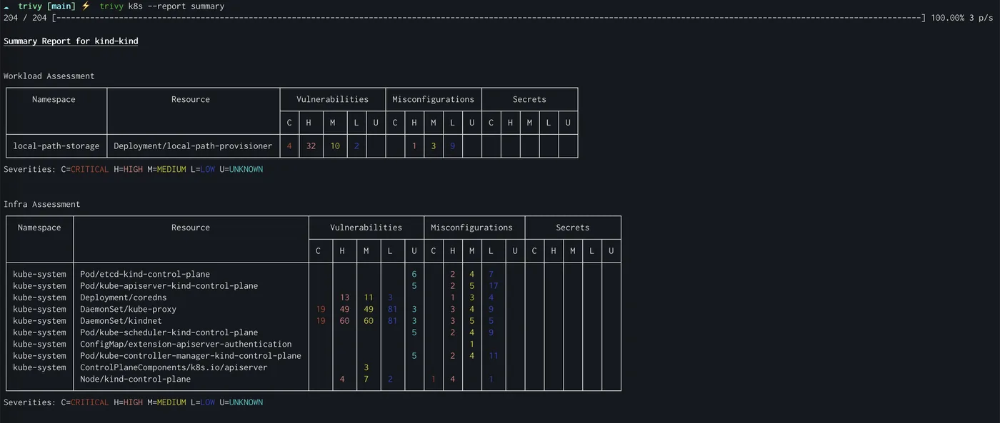</a> | [Trivy](references/39-trivy/README.md) · [official product](https://github.com/aquasecurity/trivy) | product run here, 2 named gaps | Security / vulnerability scanning | split-terminal: Two side-by-side terminal work areas with shared command context. Panels: toolbar/header (top); status/action bar (bottom); primary terminal pane (leading); secondary terminal pane (trailing). Density: low; confidence: medium. | Study target-specific scan subcommands, severity and policy filtering, configuration-file support, meaningful exit-code controls, and JSON, SARIF, template, or table reports. |
| 40 | <a href="https://developer.hashicorp.com/vault/docs/commands">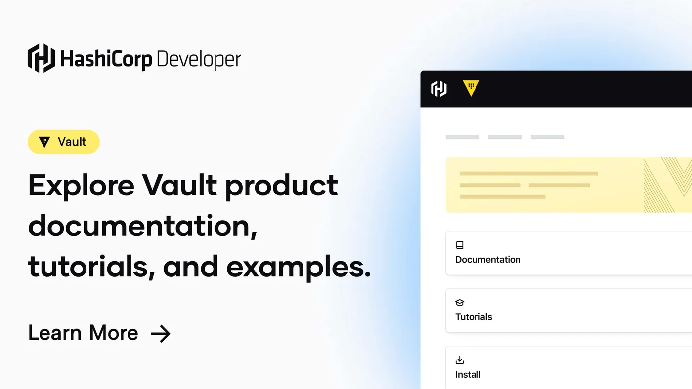</a> | [Vault CLI](references/40-vault-cli/README.md) · [official product](https://developer.hashicorp.com/vault/docs/commands) | product run here, 2 named gaps | Security / secrets management | split-terminal: Two side-by-side terminal work areas with shared command context. Panels: toolbar/header (top); primary terminal pane (leading); secondary terminal pane (trailing). Density: low; confidence: medium. | Study path-oriented read and write commands, field extraction, token and namespace environment configuration, and selectable JSON, YAML, table, or raw output. |
| 41 | <a href="https://jqlang.org/manual/">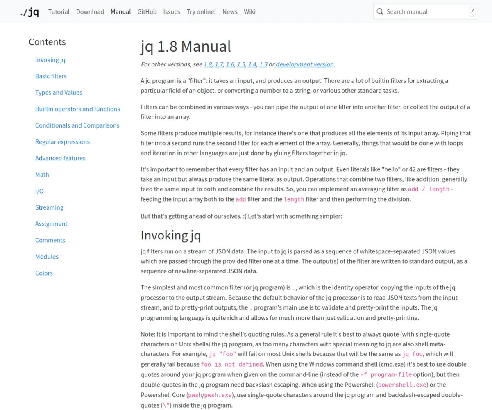</a> | [jq](references/41-jq/README.md) · [official product](https://jqlang.org/manual/) | product run here, 2 named gaps | Data / structured text processing | split-terminal: Two side-by-side terminal work areas with shared command context. Panels: primary terminal pane (leading); secondary terminal pane (trailing). Density: medium; confidence: medium. | Study the filter language as a composable CLI interface, streaming and slurp modes, raw versus JSON output, explicit exit statuses, and argument injection. |
| 42 | <a href="https://github.com/mikefarah/yq">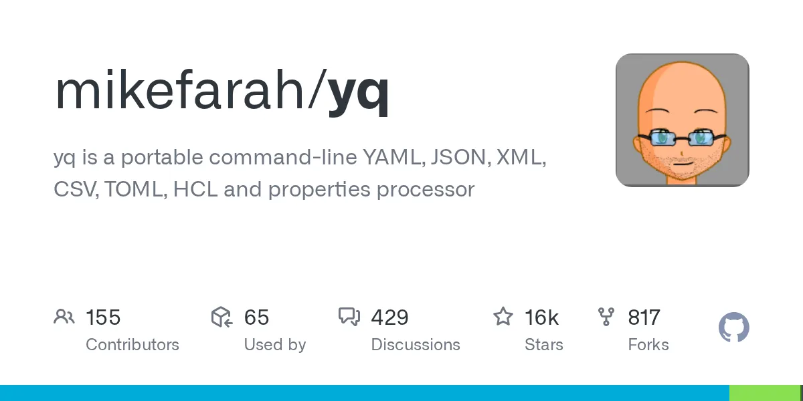</a> | [yq](references/42-yq/README.md) · [official product](https://github.com/mikefarah/yq) | product run here, 2 named gaps | Data / structured text processing | split-terminal: Two side-by-side terminal work areas with shared command context. Panels: status/action bar (bottom); primary terminal pane (leading); secondary terminal pane (trailing). Density: low; confidence: medium. | Study jq-like expressions across YAML and related formats, in-place updates, multi-document evaluation, null-input generation, and selectable serialization formats. |
| 43 | <a href="https://sqlite.org/cli.html">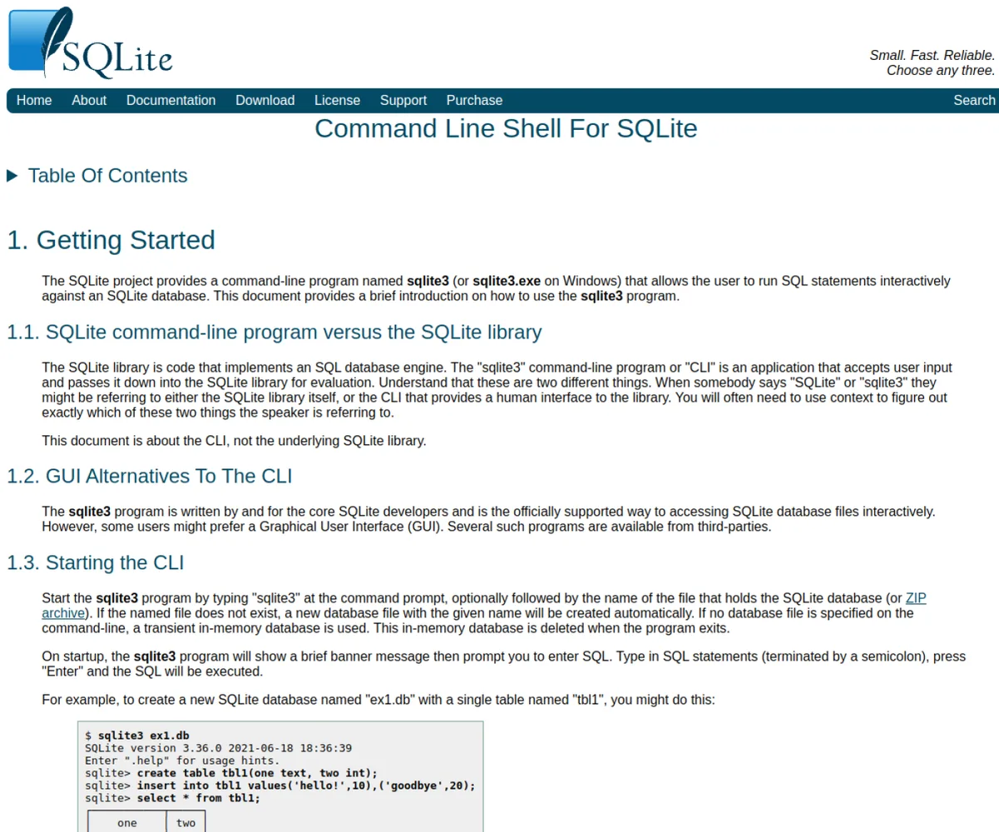</a> | [SQLite command-line shell](references/43-sqlite-command-line-shell/README.md) · [official product](https://sqlite.org/cli.html) | product run here, 2 named gaps | Data / databases | stacked-terminal: Two vertically stacked terminal work areas. Panels: toolbar/header (top); status/action bar (bottom); primary terminal pane (top); secondary terminal pane (bottom). Density: medium; confidence: medium. | Study dot-command separation from SQL, import and export workflows, configurable display modes, safe parameter binding, and JSON, CSV, quote, or line output. |
| 44 | <a href="https://duckdb.org/docs/stable/clients/cli/overview.html">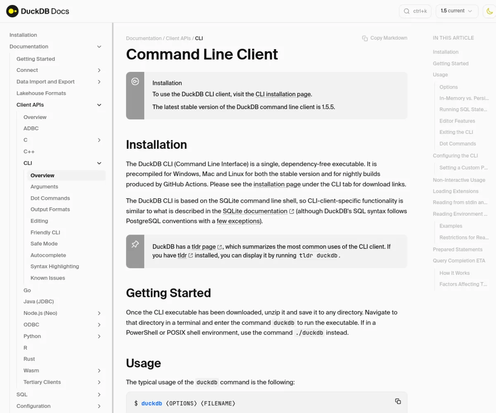</a> | [DuckDB CLI](references/44-duckdb-cli/README.md) · [official product](https://duckdb.org/docs/stable/clients/cli/overview.html) | product run here, 2 named gaps | Data / databases | split-terminal: Two side-by-side terminal work areas with shared command context. Panels: primary terminal pane (leading); secondary terminal pane (trailing). Density: medium; confidence: medium. | Study SQL-first operation with dot commands, direct file querying, piped input, and output modes such as JSON, CSV, Markdown, line, and box tables. |
| 45 |  | [psql](references/45-psql/README.md) · [official product](https://www.postgresql.org/docs/current/app-psql.html) | product run here, 2 named gaps | Data / databases | split-terminal: Two side-by-side terminal work areas with shared command context. Panels: toolbar/header (top); primary terminal pane (leading); secondary terminal pane (trailing). Density: low; confidence: medium. | Study the division between SQL and backslash meta-commands, variable substitution, conditional scripts, transaction-aware error handling, and unaligned or CSV output. |
| 46 | <a href="https://redis.io/docs/latest/develop/tools/cli/">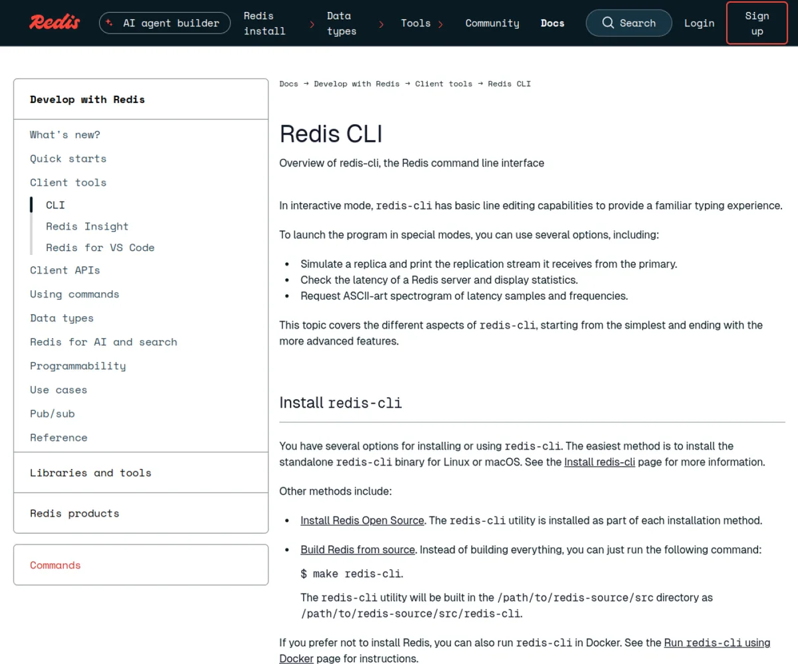</a> | [redis-cli](references/46-redis-cli/README.md) · [official product](https://redis.io/docs/latest/develop/tools/cli/) | product run here, 2 named gaps | Data / databases | split-terminal: Two side-by-side terminal work areas with shared command context. Panels: toolbar/header (top); status/action bar (bottom); primary terminal pane (leading); secondary terminal pane (trailing). Density: medium; confidence: medium. | Study automatic interactive versus piped behavior, raw output for scripts, URI-based connection configuration, scanning helpers, latency diagnostics, and cluster-aware modes. |
| 47 | <a href="https://www.mongodb.com/docs/mongodb-shell/">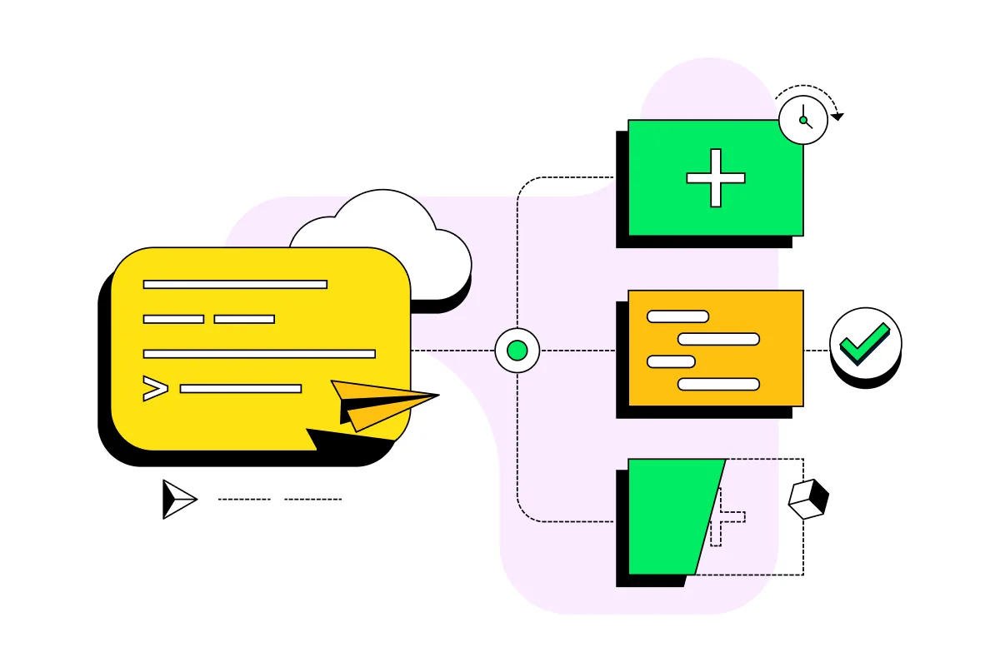</a> | [MongoDB Shell (mongosh)](references/47-mongodb-shell-mongosh/README.md) · [official product](https://www.mongodb.com/docs/mongodb-shell/) | product run here, 2 named gaps | Data / databases | split-terminal: Two side-by-side terminal work areas with shared command context. Panels: toolbar/header (top); primary terminal pane (leading); secondary terminal pane (trailing). Density: low; confidence: medium. | Study JavaScript-based command evaluation, startup configuration, explicit quiet and noninteractive invocation, and EJSON-compatible output for preserving database types. |
| 48 | <a href="https://rclone.org/docs/">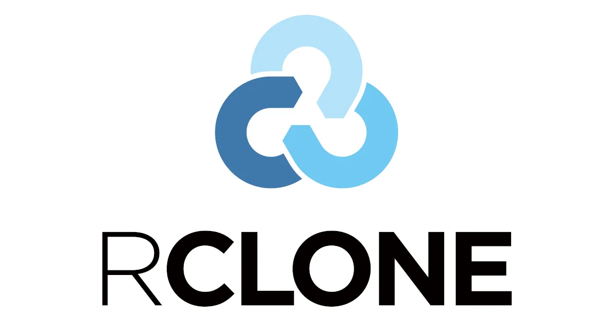</a> | [rclone](references/48-rclone/README.md) · [official product](https://rclone.org/docs/) | product run here, 2 named gaps | System utilities / storage and synchronization | split-terminal: Two side-by-side terminal work areas with shared command context. Panels: status/action bar (bottom); primary terminal pane (leading); secondary terminal pane (trailing). Density: low; confidence: medium. | Study a common command vocabulary across many storage backends, remote-spec syntax, layered configuration, dry runs, filtering, checks, and JSON log output. |
| 49 |  | [rsync](references/49-rsync/README.md) · [official product](https://download.samba.org/pub/rsync/rsync.1) | product run here, 2 named gaps | System utilities / file synchronization | command-output: Single command-and-output flow without a stable secondary panel. Panels: toolbar/header (top); command and output flow (center). Density: low; confidence: medium. | Study source-destination grammar, trailing-slash semantics, dry-run previews, include and exclude filters, partial-transfer recovery, and itemized change output. |
| 50 | <a href="https://www.freedesktop.org/software/systemd/man/latest/systemctl.html">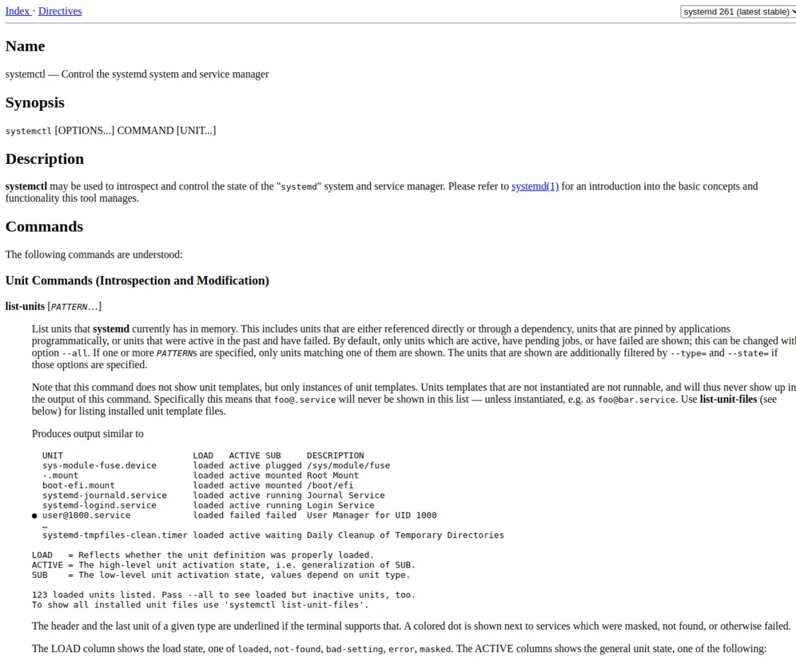</a> | [systemctl](references/50-systemctl/README.md) · [official product](https://www.freedesktop.org/software/systemd/man/latest/systemctl.html) | product run here, 2 named gaps | System utilities / service management | stacked-terminal: Two vertically stacked terminal work areas. Panels: status/action bar (bottom); primary terminal pane (top); secondary terminal pane (bottom). Density: medium; confidence: medium. | Study verb-plus-unit command design, explicit system and user scopes, dependency-aware status reporting, preset and enable distinctions, and script-friendly no-pager modes. |

Normalized panel bounds, detected separators, image dimensions, source-image URLs, hashes, and analysis confidence are recorded in [`sources.json`](sources.json). Media kinds, measured durations, provenance classes, and per-record gaps are in [`references.json`](references.json).

Attribution and product ownership remain with the linked source.
