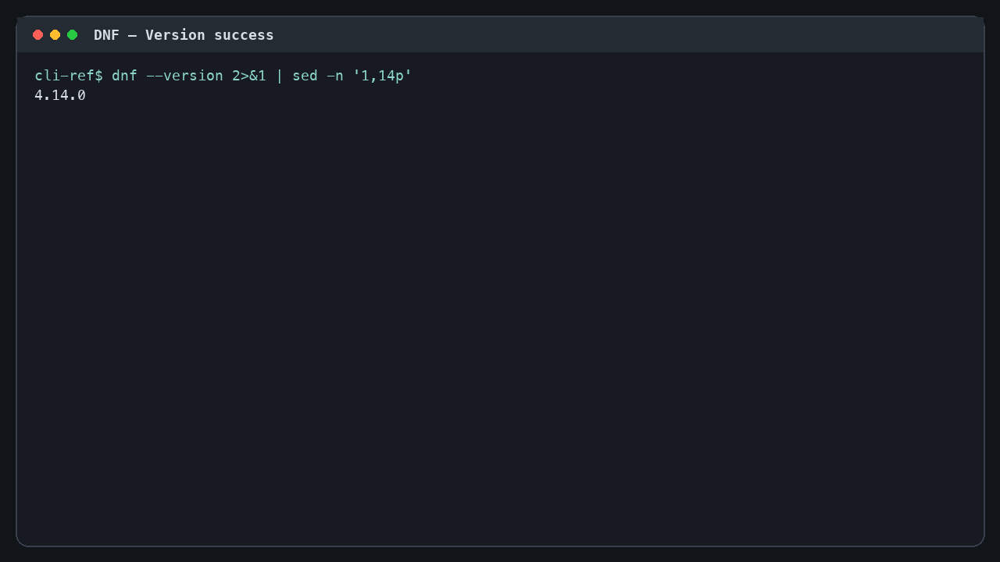
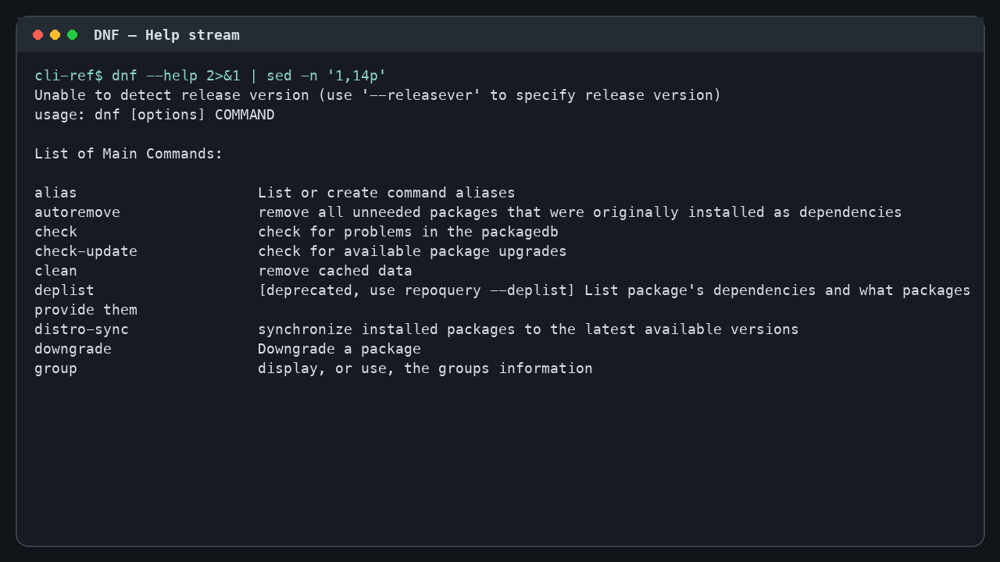
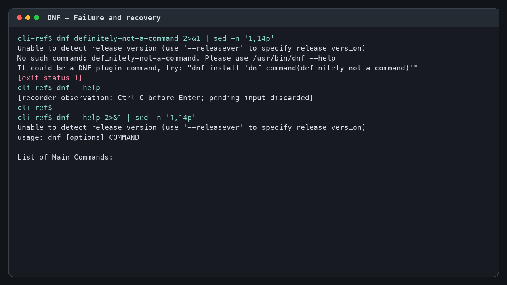

# 12. DNF

- **Official product source:** [https://dnf.readthedocs.io/en/latest/command_ref.html](https://dnf.readthedocs.io/en/latest/command_ref.html)
- **Upstream owner:** DNF Project
- **Evidence status:** complete
- **Captured:** 2026-08-16T23:06:54+00:00
- **Recording environment:** Ubuntu 24.04 aarch64 Lima VM `cli-reference`

## Authentic local evidence

The local [`media/session.cast`](media/session.cast) is an asciinema v2 terminal event stream recorded from the real `dnf` executable. It contains a successful version query, a bounded real help stream, a rejected invocation with observed status `1`, a PTY-recorded Ctrl-C cancellation, and a valid help recovery. It does not contact or mutate a live target and contains no credentials.

- Motion metadata and SHA-256: [`reference.json`](reference.json)
- Key state 1: [version success](media/01-version-success.png)
- Key state 2: [help stream](media/02-help-stream.png)
- Key state 3: [failure and recovery](media/03-failure-recovery.png)







## First-success journey

| State | User action | Observed response | Evidence |
|---:|---|---|---|
| 1 | Open the isolated PTY at `cli-ref$`. | A clean prompt appears with no credentials, project files, or live target selected. | media/session.cast at 0.00–0.55 s |
| 2 | Run `dnf --version 2>&1 \| sed -n '1,14p'`. | DNF prints its installed version and exits 0. | media/session.cast at 0.55–2.20 s; media/01-version-success.png; observed exit 0 |
| 3 | Run `dnf --help 2>&1 \| sed -n '1,14p'`. | The executable streams its authentic top-level help through the shown fourteen-line limiter. | media/session.cast at 2.20–5.10 s; media/02-help-stream.png |
| 4 | Run `dnf definitely-not-a-command 2>&1 \| sed -n '1,14p'`. | The executable rejects the input and returns status 1. | media/session.cast at 5.10–7.10 s; observed exit 1; media/03-failure-recovery.png |
| 5 | Type `dnf --help` but press Ctrl-C before Enter. | The PTY accepts Ctrl-C, abandons the pending line, and restores the prompt; the cast labels this observed input action. | media/session.cast at 7.10–8.10 s; recorder annotation identifies the PTY-observed Ctrl-C, discarded pending input, and restored prompt |
| 6 | Rerun `dnf --help 2>&1 \| sed -n '1,14p'`. | Valid help output appears again, proving recovery after both parser failure and cancellation and completing first success. | media/session.cast at 8.10–8.45 s; media/03-failure-recovery.png |

## Observed command and streams

### Successful version stream

```text
cli-ref$ dnf --version 2>&1 | sed -n '1,14p'
4.14.0
[exit status 0]
```

### Bounded help stream

```text
cli-ref$ dnf --help 2>&1 | sed -n '1,14p'
Unable to detect release version (use '--releasever' to specify release version)
usage: dnf [options] COMMAND

List of Main Commands:

alias                     List or create command aliases
autoremove                remove all unneeded packages that were originally installed as dependencies
check                     check for problems in the packagedb
check-update              check for available package upgrades
clean                     remove cached data
deplist                   [deprecated, use repoquery --deplist] List package's dependencies and what packages provide them
distro-sync               synchronize installed packages to the latest available versions
downgrade                 Downgrade a package
group                     display, or use, the groups information
```

### Failure and recovery

```text
cli-ref$ dnf definitely-not-a-command 2>&1 | sed -n '1,14p'
Unable to detect release version (use '--releasever' to specify release version)
No such command: definitely-not-a-command. Please use /usr/bin/dnf --help
It could be a DNF plugin command, try: "dnf install 'dnf-command(definitely-not-a-command)'"
[exit status 1]
cli-ref$ dnf --help
[recorder observation: Ctrl-C before Enter; pending input discarded]
cli-ref$
cli-ref$ dnf --help 2>&1 | sed -n '1,14p'
Unable to detect release version (use '--releasever' to specify release version)
usage: dnf [options] COMMAND

List of Main Commands:
```

The error, exit status, Ctrl-C echo, and recovered output above are transcribed from the local cast; they are not example or synthesized command output.

## Interaction map

| Interaction | Trigger | Response / feedback | Cancellation | Failure / recovery | Evidence |
|---|---|---|---|---|---|
| command entry | Type `dnf --version 2>&1 \| sed -n '1,14p'` and press Enter. | DNF starts and emits its installed version. 4.14.0 | Ctrl-C before Enter clears the pending command in the recorded shell. | A misspelled option is rejected later in the same cast. Re-enter a documented help command. | media/session.cast at 0.55–2.20 s; media/01-version-success.png; observed exit 0 |
| argument parsing | Provide the documented version arguments. | The CLI accepts the option/subcommand grammar and exits successfully. Observed exit status 0. | No cancellation is required for the short version query. | `dnf definitely-not-a-command 2>&1 \| sed -n '1,14p'` follows the same parser and is rejected. Use the grammar printed by help. | media/session.cast at 0.55–2.20 s; media/01-version-success.png; observed exit 0 |
| stdout stream | Run `dnf --help 2>&1 \| sed -n '1,14p'`. | Help text streams into the terminal and is bounded to fourteen lines by the shown pipeline. Unable to detect release version (use '--releasever' to specify release version) | The shell remains interruptible while the stream is active. | A closed downstream stream may stop display without changing the product help content. Run the bounded help command again. | media/session.cast at 2.20–5.10 s; media/02-help-stream.png |
| stderr and exit status | Run `dnf definitely-not-a-command 2>&1 \| sed -n '1,14p'`. | The executable reports an invalid invocation and returns a nonzero status. Unable to detect release version (use '--releasever' to specify release version) | Ctrl-C is available if an error path blocks; this observed path returned on its own. | Observed status 1. Run `dnf --help 2>&1 \| sed -n '1,14p'`. | media/session.cast at 5.10–7.10 s; observed exit 1; media/03-failure-recovery.png |
| help navigation | Invoke `dnf --help 2>&1 \| sed -n '1,14p'`. | The top-level usage, options, or command index is printed without opening a browser. The first fourteen nonblank output lines remain readable in the cast. | Ctrl-C/backtracking returns to the shell prompt. | An invalid help spelling is handled as an invalid invocation. Repeat the exact documented help form. | media/session.cast at 2.20–5.10 s; media/02-help-stream.png |
| completion | Wait for version or help output to finish. | Control returns to `cli-ref$`. A new prompt is visible and the exit status is recorded. | Not needed after completion. | A nonzero status distinguishes rejected input from successful completion. Issue a corrected command at the restored prompt. | media/session.cast at 0.85–2.20 s and after the recovery output at 8.45 s |
| cancellation | Type `dnf --help` without Enter, then press Ctrl-C. | The interactive PTY accepts Ctrl-C, discards the pending line, and restores `cli-ref$`. The cast labels the recorder-observed Ctrl-C; the canceled command emits no product help because it was not submitted. | Ctrl-C is the observed cancellation mechanism. | The pending command is intentionally abandoned rather than executed. Submit the bounded help command on the next prompt. | media/session.cast at 7.10–8.10 s; recorder annotation identifies the PTY-observed Ctrl-C, discarded pending input, and restored prompt |
| failure recovery | After the invalid invocation returns nonzero, enter the bounded help command again. | The same real executable prints valid help output and returns control. Unable to detect release version (use '--releasever' to specify release version) | The recovery can itself be canceled with Ctrl-C at the prompt. | Repeating the invalid option reproduces the nonzero route. The valid help form completes the first-success journey. | media/session.cast at 5.10–8.45 s; media/03-failure-recovery.png |

## Motion analysis

- **Trigger:** Enter submits the version, help, invalid, and recovery commands; Ctrl-C interrupts the unsubmitted pending command.
- **Start / end:** the cast starts at a clean prompt and ends at a clean prompt after the explicit first-success line.
- **Continuity:** output appends linearly to one terminal stream; no hidden screen or synthetic tween is used.
- **Timing class:** immediate version response, short streamed help, immediate parser feedback, immediate Ctrl-C cancellation, and short recovery.
- **Interruption / reversal:** Ctrl-C visibly abandons a pending command and returns to the same prompt; the invalid invocation returns by itself with status `1`.
- **Feedback:** text, prompt return, and exit status—not color or animation—carry state.
- **Reduced motion / nonanimated equivalent:** the cast can be paused, and the three PNG frames plus the exact text streams above retain the same states without playback.

## Accessibility

Observed: keyboard-only operation, selectable text, no color dependency, and a pager-free bounded help stream. Not observed: screen-reader announcements, high-contrast themes, non-UTF-8 locales, or a product-specific reduced-motion preference. See [`reference.json`](reference.json) for the complete observations and unknowns.

## Provenance

The executable and output belong to DNF Project. Product/documentation URL: [https://dnf.readthedocs.io/en/latest/command_ref.html](https://dnf.readthedocs.io/en/latest/command_ref.html). Capture method: Real executable stdout/stderr captured from exact displayed commands in Ubuntu 24.04 aarch64 Lima VM `cli-reference` and serialized as a timed terminal cast; Ctrl-C cancellation was separately captured through an interactive PTY. Version, bounded help, invalid invocation, cancellation, and recovery help were recorded without credentials or live targets. Dimensions are `null` for the terminal cast by contract; its duration is 8.45 seconds with 11 timed output events. Exact byte sizes and SHA-256 digests for the cast and all three state frames are recorded in [`reference.json`](reference.json).
