# Dashboard and console examples

Operational dashboards, control planes, admin surfaces, and dense data consoles.

Each entry pairs an attributed overview image and a measured panel anatomy with a per-product record: motion evidence, named states, an observed first-success journey, interaction and recovery behavior, accessibility observations, and provenance. Every number below is measured by `verify-reference-evidence.py`, and a record that is missing evidence says so in its own `evidence_gaps`.

**Examples:** 50  
**Images:** 50  
**Structural analyses:** 50  
**Records with no remaining gap:** 0  
**Records with named gaps:** 50 (53 gaps)  
**Motion provenance:** 50 owner-published media  
**Curated:** 2026-08-16  
**Visual source data:** [`sources.json`](sources.json)  
**Record index:** [`references.json`](references.json)  
**Cross-example synthesis:** [`full-reference.md`](full-reference.md)

| # | Reference image | Record | Motion evidence | Category | Interface structure | What to study |
|---:|---|---|---|---|---|---|
| 1 |  | [AWS Management Console](references/01-aws-management-console/README.md) · [official product](https://aws.amazon.com/console/) | owner-published media, 2 named gaps | Cloud control plane | sidebar-content: Leading navigation or collection list beside a dominant content area. Panels: toolbar/header (top); status/action bar (bottom); navigation/list sidebar (leading); data table/list (center). Density: low; confidence: high. | Study the service switcher, region context, resource tables, and confirmation steps used before destructive cloud-resource actions. |
| 2 | <a href="https://portal.azure.com/">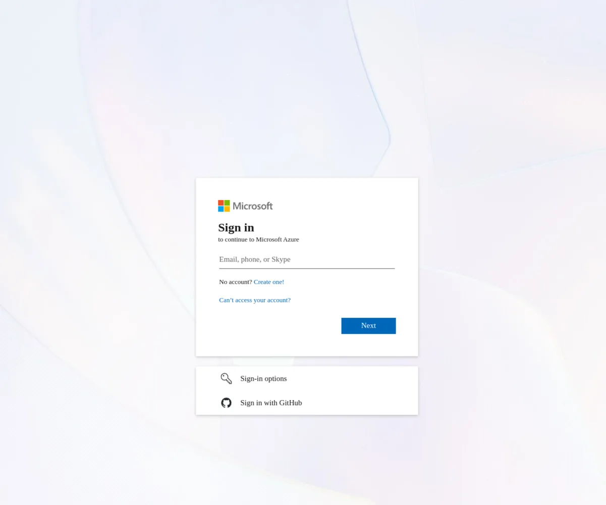</a> | [Microsoft Azure Portal](references/02-microsoft-azure-portal/README.md) · [official product](https://portal.azure.com/) | owner-published media, 2 named gaps | Cloud control plane | sidebar-content-inspector: Leading navigation, central work area, and trailing detail inspector. Panels: toolbar/header (top); status/action bar (bottom); navigation/list sidebar (leading); detail/inspector (trailing); primary canvas/content (center). Density: low; confidence: medium. | Study the blade-based drill-down model, pinned dashboards, global search, notifications, and role-aware resource actions. |
| 3 | <a href="https://cloud.google.com/cloud-console">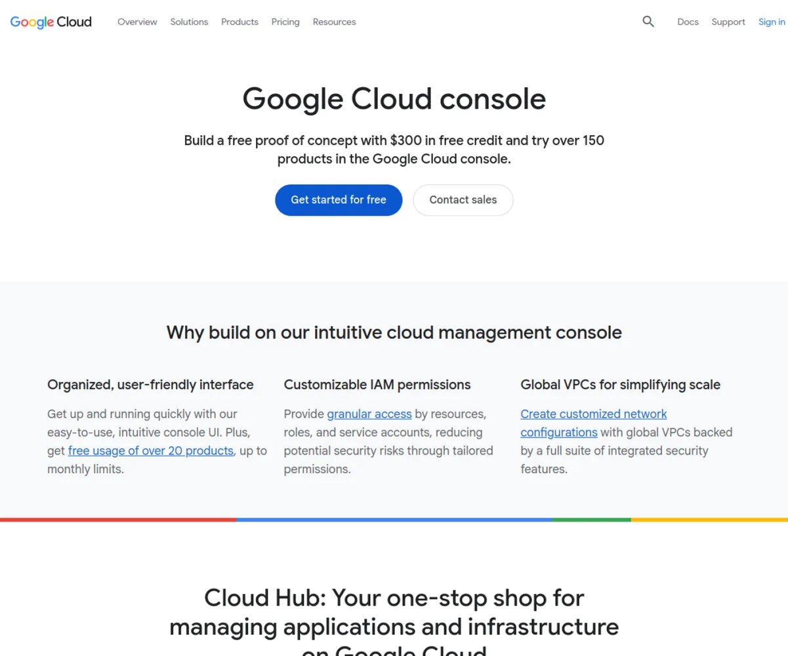</a> | [Google Cloud Console](references/03-google-cloud-console/README.md) · [official product](https://cloud.google.com/cloud-console) | owner-published media, 1 named gaps | Cloud control plane | sidebar-content-inspector: Leading navigation, central work area, and trailing detail inspector. Panels: toolbar/header (top); status/action bar (bottom); navigation/list sidebar (leading); detail/inspector (trailing); data table/list (center). Density: low; confidence: medium. | Study project-scoped navigation, resource health summaries, activity streams, IAM context, and guarded deletion workflows. |
| 4 |  | [Cloudflare Dashboard](references/04-cloudflare-dashboard/README.md) · [official product](https://dash.cloudflare.com/) | owner-published media, 1 named gaps | Network and security control plane | sidebar-content: Leading navigation or collection list beside a dominant content area. Panels: toolbar/header (top); navigation/list sidebar (leading); primary canvas/content (center). Density: low; confidence: medium. | Study zone and account switching, security-event filters, traffic analytics, rule ordering, and high-impact configuration changes. |
| 5 | <a href="https://cloud.digitalocean.com/">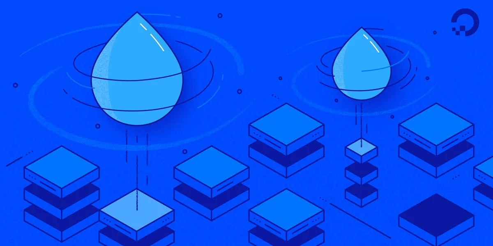</a> | [DigitalOcean Cloud Control Panel](references/05-digitalocean-cloud-control-panel/README.md) · [official product](https://cloud.digitalocean.com/) | owner-published media, 1 named gaps | Cloud control plane | sidebar-content-inspector: Leading navigation, central work area, and trailing detail inspector. Panels: toolbar/header (top); status/action bar (bottom); navigation/list sidebar (leading); detail/inspector (trailing); data table/list (center). Density: low; confidence: medium. | Study resource-list density, project grouping, status presentation, quick creation flows, and explicit confirmations for deletion. |
| 6 | <a href="https://vercel.com/dashboard">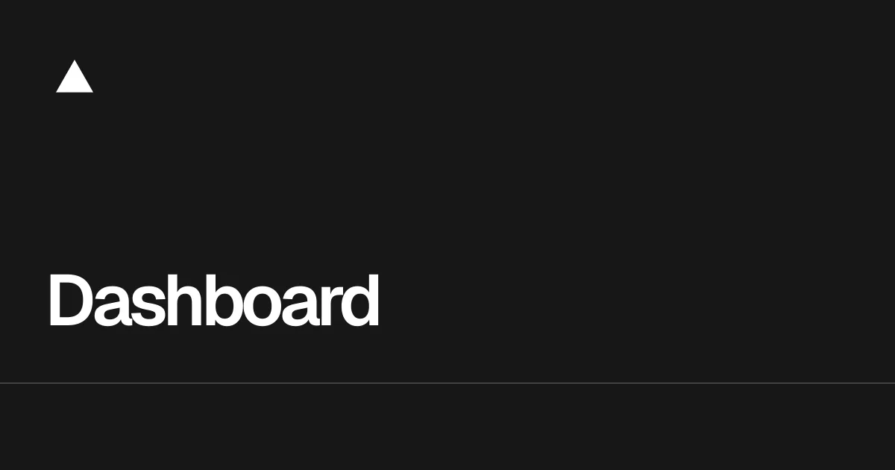</a> | [Vercel Dashboard](references/06-vercel-dashboard/README.md) · [official product](https://vercel.com/dashboard) | owner-published media, 1 named gaps | Deployment control plane | sidebar-content: Leading navigation or collection list beside a dominant content area. Panels: toolbar/header (top); status/action bar (bottom); navigation/list sidebar (leading); data table/list (center). Density: low; confidence: medium. | Study deployment timelines, environment filters, domain status, log drill-down, team scope, and rollback-oriented actions. |
| 7 |  | [Netlify Team Dashboard](references/07-netlify-team-dashboard/README.md) · [official product](https://app.netlify.com/) | owner-published media, 1 named gaps | Deployment control plane | sidebar-content: Leading navigation or collection list beside a dominant content area. Panels: toolbar/header (top); navigation/list sidebar (leading); data table/list (center). Density: low; confidence: high. | Study team-level site tables, member management, usage visibility, billing context, and navigation between operational scopes. |
| 8 | <a href="https://github.com/kubernetes/dashboard">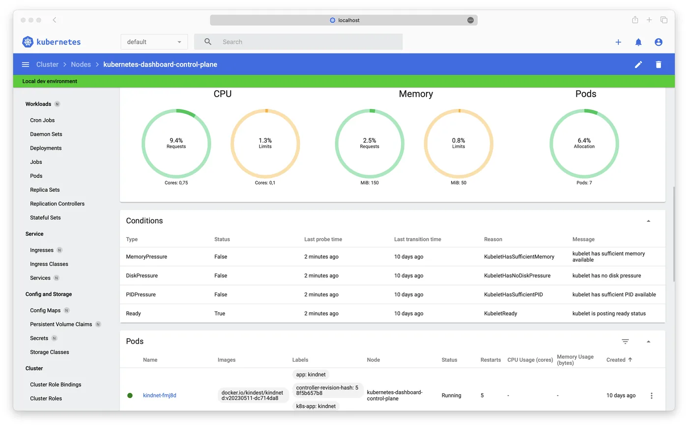</a> | [Kubernetes Dashboard](references/08-kubernetes-dashboard/README.md) · [official product](https://github.com/kubernetes/dashboard) | owner-published media, 1 named gaps | Container orchestration console | sidebar-content-inspector: Leading navigation, central work area, and trailing detail inspector. Panels: toolbar/header (top); navigation/list sidebar (leading); detail/inspector (trailing); data table/list (center). Density: low; confidence: medium. | Study namespace-scoped workload tables, status badges, resource detail views, log access, permissions, and delete confirmations. |
| 9 | <a href="https://www.rancher.com/products/rancher">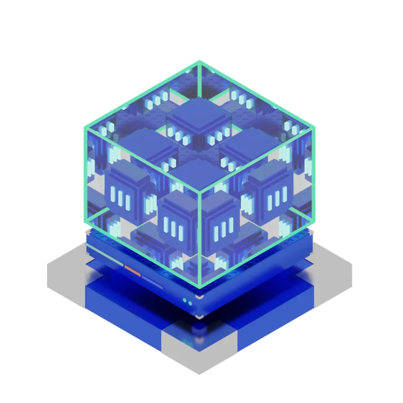</a> | [SUSE Rancher](references/09-suse-rancher/README.md) · [official product](https://www.rancher.com/products/rancher) | owner-published media, 1 named gaps | Container orchestration console | sidebar-content-inspector: Leading navigation, central work area, and trailing detail inspector. Panels: toolbar/header (top); navigation/list sidebar (leading); detail/inspector (trailing); data table/list (center). Density: low; confidence: medium. | Study multi-cluster switching, workload inventory, cluster-health summaries, role-based access, and high-impact lifecycle operations. |
| 10 | <a href="https://www.portainer.io/">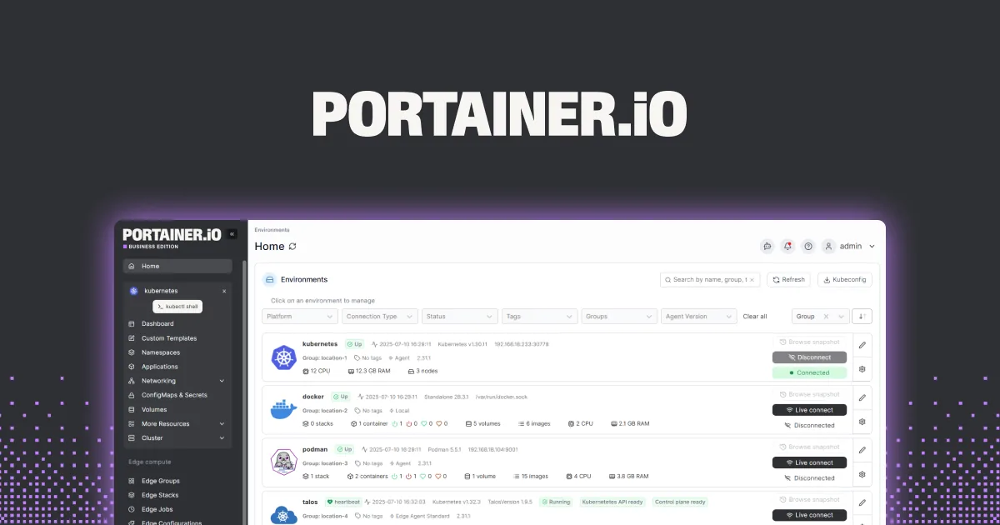</a> | [Portainer](references/10-portainer/README.md) · [official product](https://www.portainer.io/) | owner-published media, 1 named gaps | Container management console | sidebar-content: Leading navigation or collection list beside a dominant content area. Panels: toolbar/header (top); status/action bar (bottom); navigation/list sidebar (leading); data table/list (center). Density: low; confidence: medium. | Study environment switching, container and stack tables, state filters, access controls, and guarded stop or remove actions. |
| 11 | <a href="https://docs.datadoghq.com/dashboards/">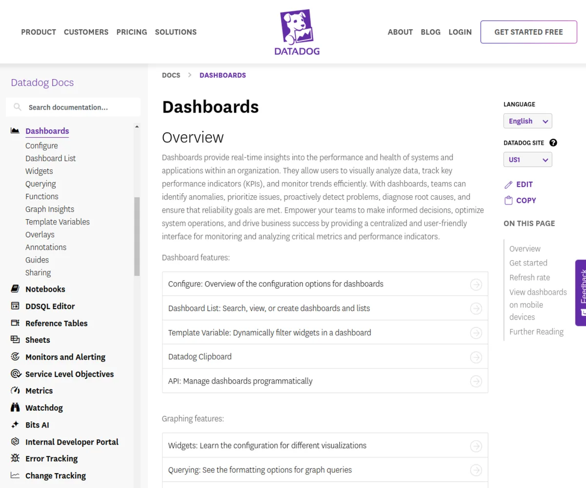</a> | [Datadog Dashboards](references/11-datadog-dashboards/README.md) · [official product](https://docs.datadoghq.com/dashboards/) | owner-published media, 1 named gaps | Observability | sidebar-content: Leading navigation or collection list beside a dominant content area. Panels: toolbar/header (top); status/action bar (bottom); navigation/list sidebar (leading); data table/list (center). Density: medium; confidence: medium. | Study high-density widget grids, template variables, synchronized time ranges, monitor overlays, and drill-down into telemetry. |
| 12 | <a href="https://grafana.com/docs/grafana/latest/dashboards/">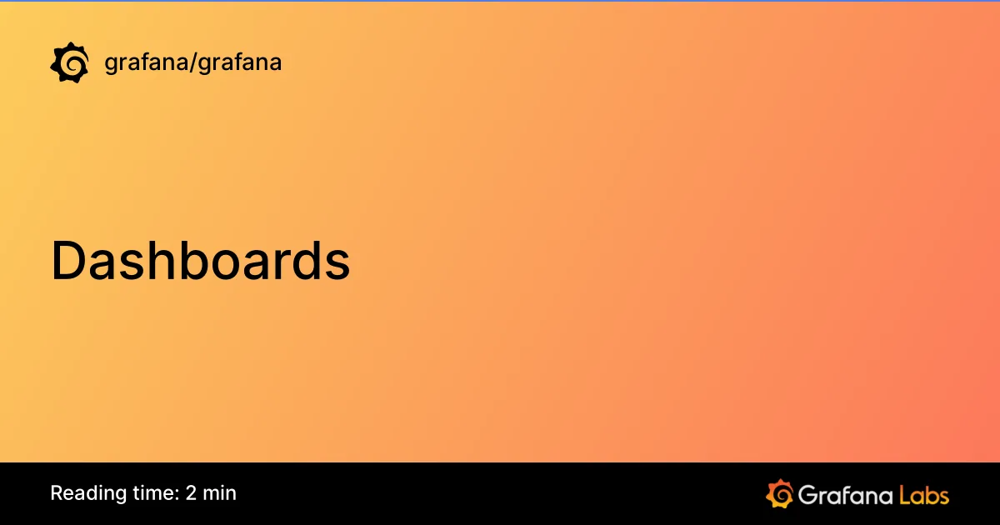</a> | [Grafana Dashboards](references/12-grafana-dashboards/README.md) · [official product](https://grafana.com/docs/grafana/latest/dashboards/) | owner-published media, 1 named gaps | Observability | sidebar-content: Leading navigation or collection list beside a dominant content area. Panels: toolbar/header (top); status/action bar (bottom); navigation/list sidebar (leading); primary canvas/content (center). Density: low; confidence: medium. | Study dashboard variables, repeated panels, time controls, annotations, alert state, and transitions from overview to query detail. |
| 13 | <a href="https://docs.newrelic.com/docs/query-your-data/explore-query-data/dashboards/introduction-dashboards/">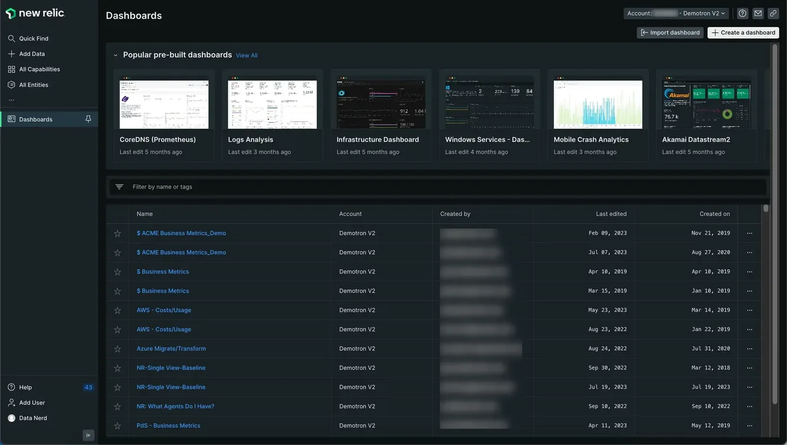</a> | [New Relic Dashboards](references/13-new-relic-dashboards/README.md) · [official product](https://docs.newrelic.com/docs/query-your-data/explore-query-data/dashboards/introduction-dashboards/) | owner-published media, 1 named gaps | Observability | sidebar-content-inspector: Leading navigation, central work area, and trailing detail inspector. Panels: toolbar/header (top); status/action bar (bottom); navigation/list sidebar (leading); detail/inspector (trailing); primary canvas/content (center). Density: low; confidence: medium. | Study cross-entity dashboard composition, faceted filters, linked charts, time comparison, and paths into underlying queries. |
| 14 |  | [Splunk Observability Cloud](references/14-splunk-observability-cloud/README.md) · [official product](https://www.splunk.com/en_us/products/observability.html) | owner-published media, 1 named gaps | Observability | sidebar-content-inspector: Leading navigation, central work area, and trailing detail inspector. Panels: toolbar/header (top); status/action bar (bottom); navigation/list sidebar (leading); detail/inspector (trailing); primary canvas/content (center). Density: low; confidence: medium. | Study service maps, detector status, correlated infrastructure views, time-window controls, and incident-oriented drill-down. |
| 15 | <a href="https://www.elastic.co/guide/en/kibana/current/dashboard.html">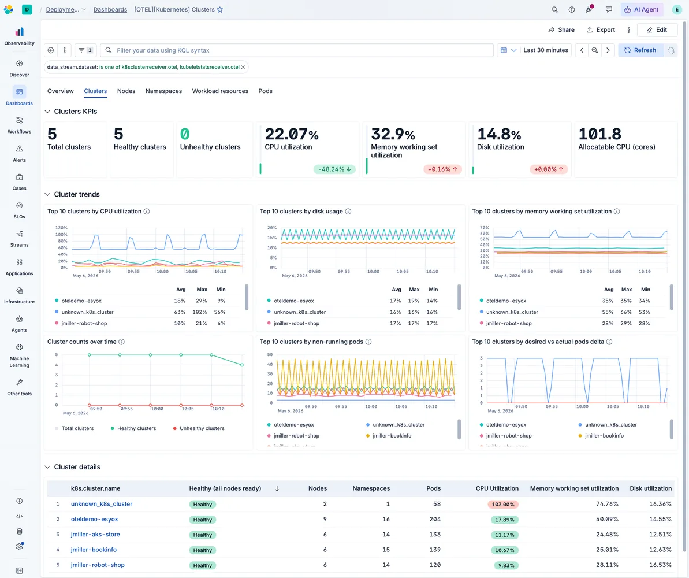</a> | [Kibana Dashboards](references/15-kibana-dashboards/README.md) · [official product](https://www.elastic.co/guide/en/kibana/current/dashboard.html) | owner-published media, 1 named gaps | Observability and analytics | content-inspector: Dominant content area with a trailing detail or property inspector. Panels: toolbar/header (top); status/action bar (bottom); detail/inspector (trailing); data table/list (center). Density: low; confidence: medium. | Study filter pills, query bars, saved views, interactive chart filtering, data-table panels, and dashboard-to-document drill-down. |
| 16 | <a href="https://docs.sentry.io/product/issues/">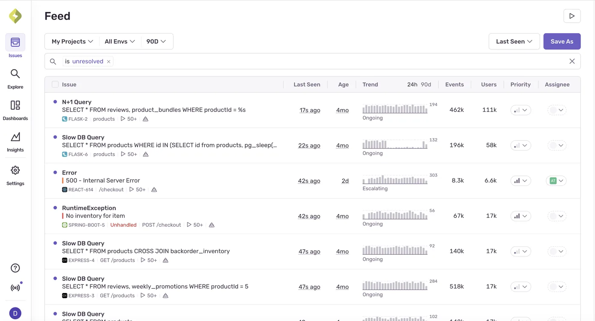</a> | [Sentry Issues](references/16-sentry-issues/README.md) · [official product](https://docs.sentry.io/product/issues/) | owner-published media, 1 named gaps | Application monitoring | table-or-list: Single dominant table or list with controls around its perimeter. Panels: toolbar/header (top); status/action bar (bottom); data table/list (center). Density: low; confidence: medium. | Study issue-stream triage, status and assignment controls, environment filters, event drill-down, and bulk resolution workflows. |
| 17 | <a href="https://docs.honeycomb.io/investigate/">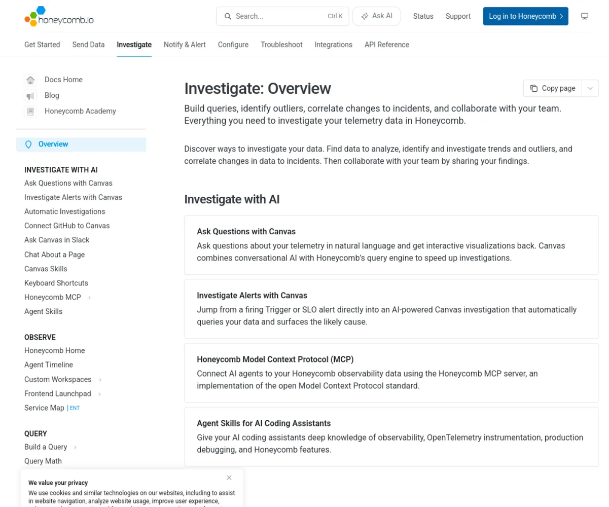</a> | [Honeycomb Query and Investigate](references/17-honeycomb-query-and-investigate/README.md) · [official product](https://docs.honeycomb.io/investigate/) | owner-published media, 1 named gaps | Observability | sidebar-content: Leading navigation or collection list beside a dominant content area. Panels: toolbar/header (top); status/action bar (bottom); navigation/list sidebar (leading); primary canvas/content (center). Density: medium; confidence: medium. | Study iterative query building, high-cardinality breakdowns, heatmap selection, trace drill-down, and shared investigation context. |
| 18 |  | [Dynatrace Dashboards and Notebooks](references/18-dynatrace-dashboards-and-notebooks/README.md) · [official product](https://docs.dynatrace.com/docs/analyze-explore-automate/dashboards-and-notebooks) | owner-published media, 1 named gaps | Observability | content-inspector: Dominant content area with a trailing detail or property inspector. Panels: toolbar/header (top); status/action bar (bottom); detail/inspector (trailing); primary canvas/content (center). Density: low; confidence: medium. | Study mixed dashboard and notebook blocks, contextual filters, entity status, exploratory drill-down, and operational sharing. |
| 19 |  | [PagerDuty Incidents](references/19-pagerduty-incidents/README.md) · [official product](https://support.pagerduty.com/main/docs/incidents) | owner-published media, 1 named gaps | Incident management | sidebar-content: Leading navigation or collection list beside a dominant content area. Panels: toolbar/header (top); status/action bar (bottom); navigation/list sidebar (leading); data table/list (center). Density: low; confidence: medium. | Study incident queues, urgency and status signals, responder assignment, timeline detail, escalation, acknowledge, and resolve actions. |
| 20 | <a href="https://incident.io/">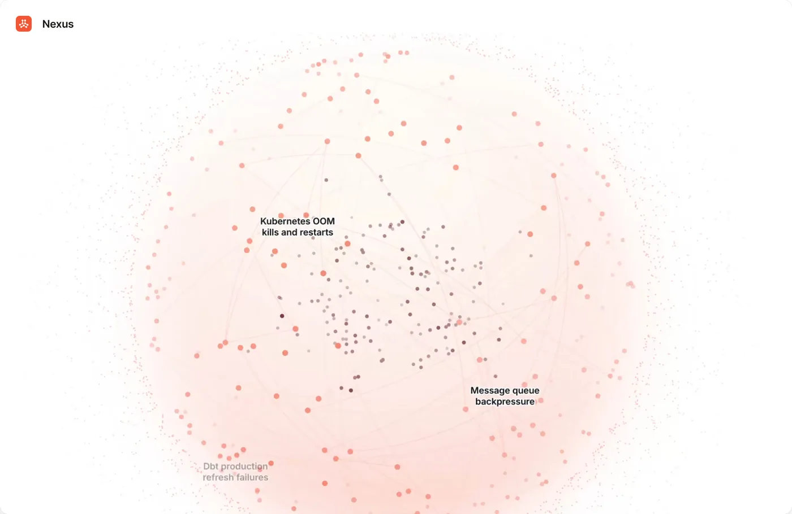</a> | [incident.io Incident Management](references/20-incident-io-incident-management/README.md) · [official product](https://incident.io/) | owner-published media, 1 named gaps | Incident management | sidebar-content-inspector: Leading navigation, central work area, and trailing detail inspector. Panels: toolbar/header (top); status/action bar (bottom); navigation/list sidebar (leading); detail/inspector (trailing); data table/list (center). Density: low; confidence: medium. | Study incident command structure, severity selection, action tracking, timeline updates, role assignment, and resolution workflows. |
| 21 | <a href="https://docs.github.com/en/actions/monitoring-and-troubleshooting-workflows/monitoring-workflows">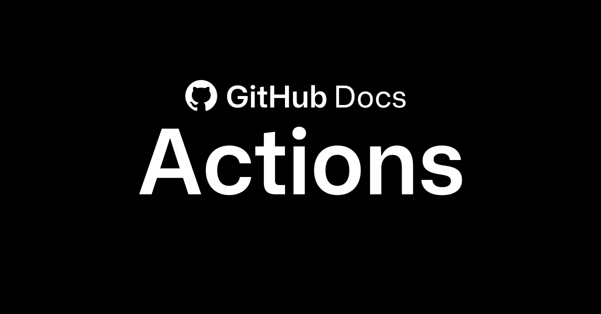</a> | [GitHub Actions Workflow Monitoring](references/21-github-actions-workflow-monitoring/README.md) · [official product](https://docs.github.com/en/actions/monitoring-and-troubleshooting-workflows/monitoring-workflows) | owner-published media, 1 named gaps | CI/CD | sidebar-content-inspector: Leading navigation, central work area, and trailing detail inspector. Panels: toolbar/header (top); navigation/list sidebar (leading); detail/inspector (trailing); data table/list (center). Density: low; confidence: medium. | Study workflow-run tables, branch and event filters, job-step drill-down, annotations, log search, cancellation, and rerun controls. |
| 22 | <a href="https://docs.gitlab.com/ci/pipelines/">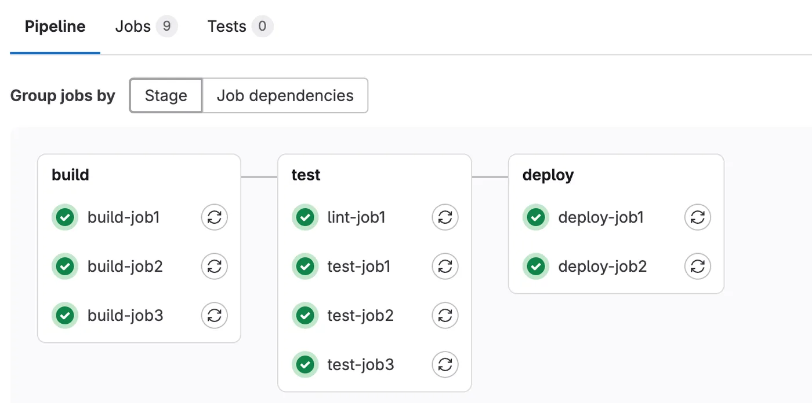</a> | [GitLab CI/CD Pipelines](references/22-gitlab-ci-cd-pipelines/README.md) · [official product](https://docs.gitlab.com/ci/pipelines/) | owner-published media, 1 named gaps | CI/CD | sidebar-content: Leading navigation or collection list beside a dominant content area. Panels: toolbar/header (top); navigation/list sidebar (leading); primary canvas/content (center). Density: low; confidence: medium. | Study pipeline graphs, status propagation, stage and job drill-down, manual gates, retry controls, and permission-sensitive actions. |
| 23 | <a href="https://circleci.com/docs/pipelines/">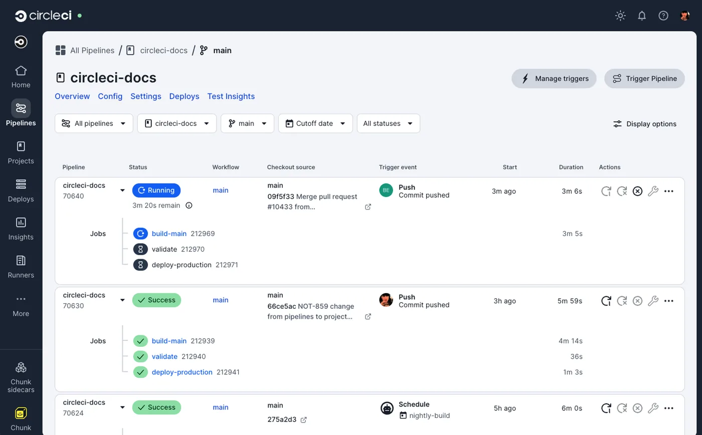</a> | [CircleCI Pipelines](references/23-circleci-pipelines/README.md) · [official product](https://circleci.com/docs/pipelines/) | owner-published media, 1 named gaps | CI/CD | sidebar-content: Leading navigation or collection list beside a dominant content area. Panels: toolbar/header (top); status/action bar (bottom); navigation/list sidebar (leading); data table/list (center). Density: low; confidence: medium. | Study project pipeline lists, workflow dependency graphs, status filters, job output, approval gates, and rerun options. |
| 24 | <a href="https://buildkite.com/docs/pipelines">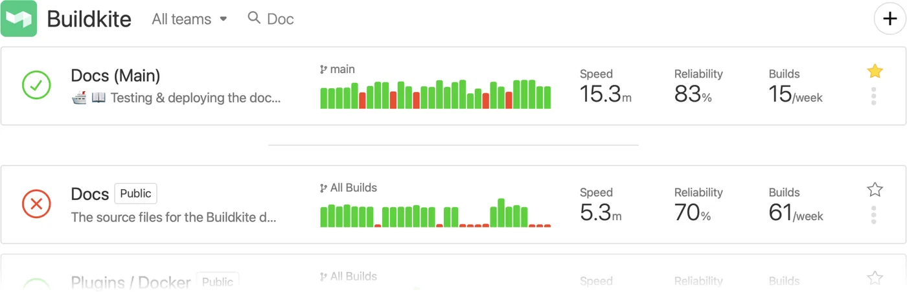</a> | [Buildkite Pipelines](references/24-buildkite-pipelines/README.md) · [official product](https://buildkite.com/docs/pipelines) | owner-published media, 1 named gaps | CI/CD | content-inspector: Dominant content area with a trailing detail or property inspector. Panels: toolbar/header (top); status/action bar (bottom); detail/inspector (trailing); data table/list (center). Density: low; confidence: medium. | Study build queues, step-state density, expandable logs, annotations, agent context, retries, cancellations, and rebuild actions. |
| 25 | <a href="https://www.jenkins.io/doc/book/blueocean/dashboard/">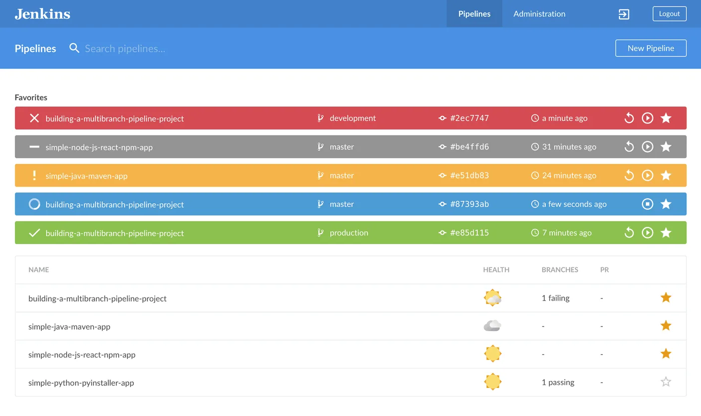</a> | [Jenkins Blue Ocean Dashboard](references/25-jenkins-blue-ocean-dashboard/README.md) · [official product](https://www.jenkins.io/doc/book/blueocean/dashboard/) | owner-published media, 1 named gaps | CI/CD | content-inspector: Dominant content area with a trailing detail or property inspector. Panels: toolbar/header (top); detail/inspector (trailing); data table/list (center). Density: low; confidence: medium. | Study pipeline activity lists, branch and pull-request grouping, stage visualization, failure drill-down, and run controls. |
| 26 | <a href="https://argo-cd.readthedocs.io/en/stable/">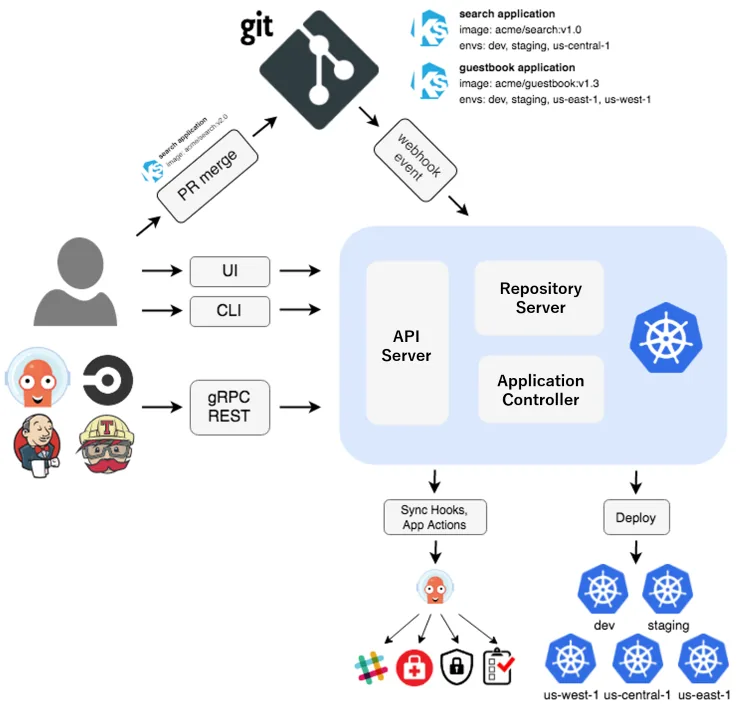</a> | [Argo CD](references/26-argo-cd/README.md) · [official product](https://argo-cd.readthedocs.io/en/stable/) | owner-published media, 1 named gaps | GitOps control plane | sidebar-content-inspector: Leading navigation, central work area, and trailing detail inspector. Panels: toolbar/header (top); navigation/list sidebar (leading); detail/inspector (trailing); primary canvas/content (center). Density: low; confidence: medium. | Study application health versus sync status, resource-tree drill-down, manifest differences, synchronization, rollback, and deletion controls. |
| 27 | <a href="https://developer.harness.io/docs/continuous-delivery/">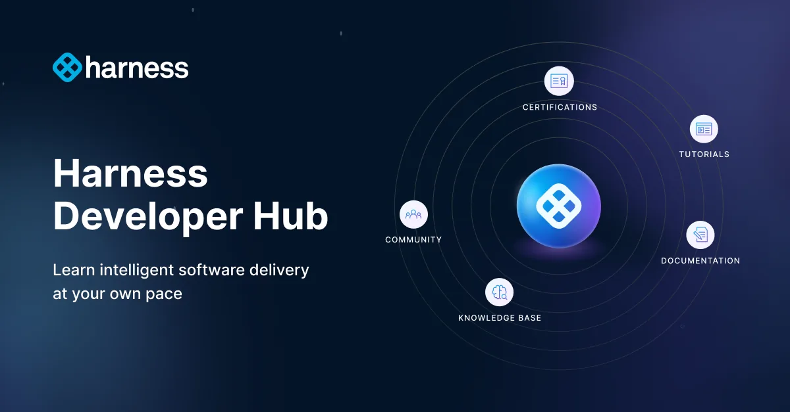</a> | [Harness Continuous Delivery](references/27-harness-continuous-delivery/README.md) · [official product](https://developer.harness.io/docs/continuous-delivery/) | owner-published media, 1 named gaps | CI/CD | sidebar-content: Leading navigation or collection list beside a dominant content area. Panels: toolbar/header (top); navigation/list sidebar (leading); primary canvas/content (center). Density: low; confidence: medium. | Study execution pipelines, service and environment scope, approval stages, failure strategies, deployment status, and rollback controls. |
| 28 | <a href="https://www.jetbrains.com/teamcity/">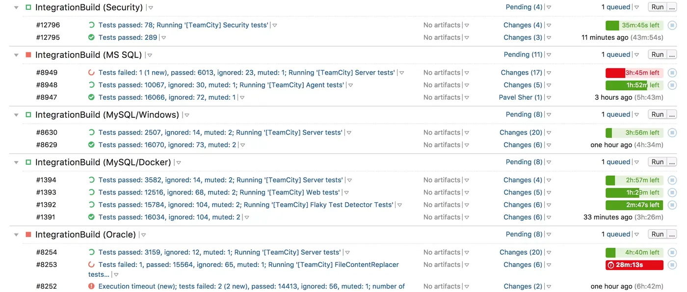</a> | [JetBrains TeamCity](references/28-jetbrains-teamcity/README.md) · [official product](https://www.jetbrains.com/teamcity/) | owner-published media, 1 named gaps | CI/CD | sidebar-content-inspector: Leading navigation, central work area, and trailing detail inspector. Panels: toolbar/header (top); status/action bar (bottom); navigation/list sidebar (leading); detail/inspector (trailing); data table/list (center). Density: medium; confidence: medium. | Study build configuration hierarchies, queued and running jobs, failure details, agent capacity, permissions, and administrative actions. |
| 29 | <a href="https://azure.microsoft.com/en-us/products/devops/pipelines/">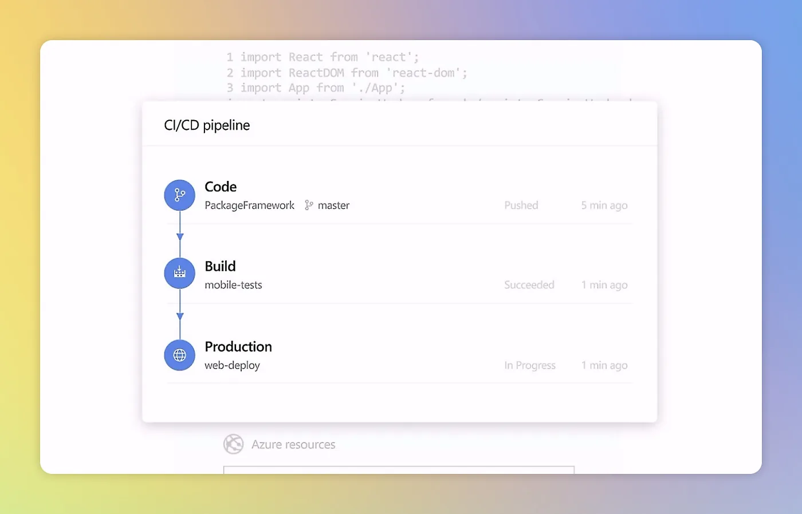</a> | [Azure Pipelines](references/29-azure-pipelines/README.md) · [official product](https://azure.microsoft.com/en-us/products/devops/pipelines/) | owner-published media, 1 named gaps | CI/CD | sidebar-content: Leading navigation or collection list beside a dominant content area. Panels: toolbar/header (top); status/action bar (bottom); navigation/list sidebar (leading); data table/list (center). Density: low; confidence: medium. | Study pipeline run tables, stage status, environment approvals, artifact context, log drill-down, retention, and rerun actions. |
| 30 | <a href="https://support.zendesk.com/hc/en-us/articles/4408821259930-About-the-Zendesk-Agent-Workspace">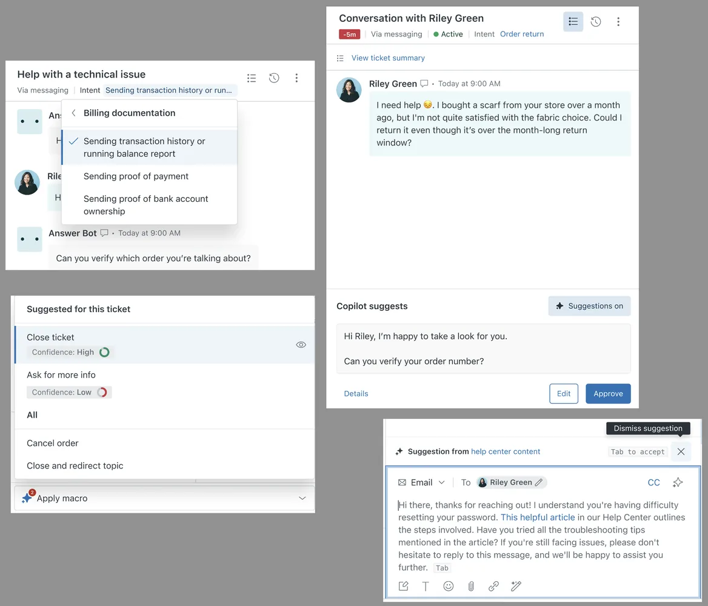</a> | [Zendesk Agent Workspace](references/30-zendesk-agent-workspace/README.md) · [official product](https://support.zendesk.com/hc/en-us/articles/4408821259930-About-the-Zendesk-Agent-Workspace) | owner-published media, 1 named gaps | Customer support operations | sidebar-content: Leading navigation or collection list beside a dominant content area. Panels: toolbar/header (top); status/action bar (bottom); navigation/list sidebar (leading); primary canvas/content (center). Density: low; confidence: high. | Study multi-channel ticket context, status and assignee fields, side-panel customer data, macros, tabs, and submit-state choices. |
| 31 | <a href="https://www.intercom.com/help/en/articles/6258745-the-inbox-explained">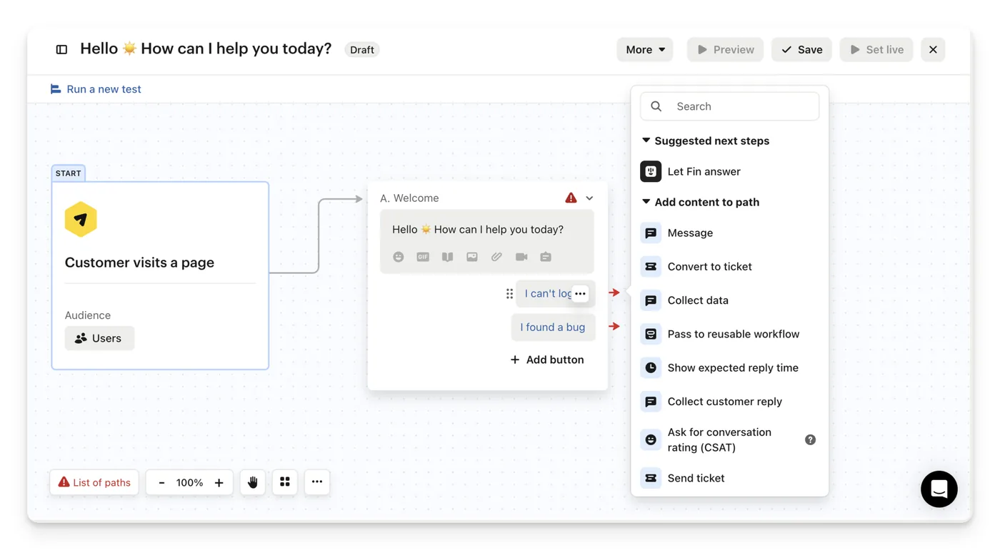</a> | [Intercom Inbox](references/31-intercom-inbox/README.md) · [official product](https://www.intercom.com/help/en/articles/6258745-the-inbox-explained) | owner-published media, 1 named gaps | Customer support operations | sidebar-content-inspector: Leading navigation, central work area, and trailing detail inspector. Panels: toolbar/header (top); status/action bar (bottom); navigation/list sidebar (leading); detail/inspector (trailing); data table/list (center). Density: low; confidence: high. | Study conversation queues, assignment and priority controls, customer context, team inboxes, snoozing, and close-resolution actions. |
| 32 | <a href="https://www.freshworks.com/freshdesk/">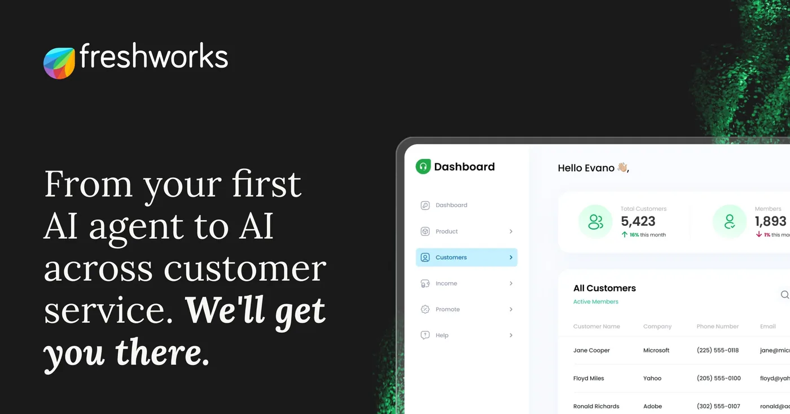</a> | [Freshdesk Omnichannel](references/32-freshdesk-omnichannel/README.md) · [official product](https://www.freshworks.com/freshdesk/) | owner-published media, 1 named gaps | Customer support operations | sidebar-content: Leading navigation or collection list beside a dominant content area. Panels: toolbar/header (top); navigation/list sidebar (leading); data table/list (center). Density: low; confidence: high. | Study cross-channel queue handling, ticket filters, SLA status, ownership, customer history, bulk updates, and escalation paths. |
| 33 | <a href="https://www.salesforce.com/service/cloud/">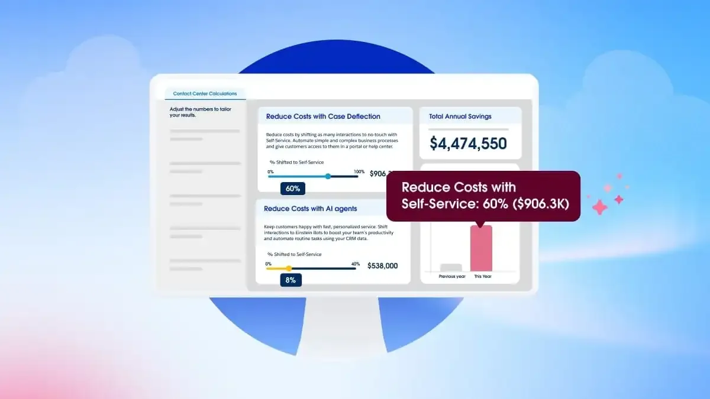</a> | [Salesforce Service Cloud](references/33-salesforce-service-cloud/README.md) · [official product](https://www.salesforce.com/service/cloud/) | owner-published media, 1 named gaps | Customer support operations | content-inspector: Dominant content area with a trailing detail or property inspector. Panels: toolbar/header (top); detail/inspector (trailing); data table/list (center). Density: low; confidence: medium. | Study console tabs, case queues, record context, related information panels, routing status, macros, and permission-aware case actions. |
| 34 | <a href="https://www.atlassian.com/software/jira/service-management">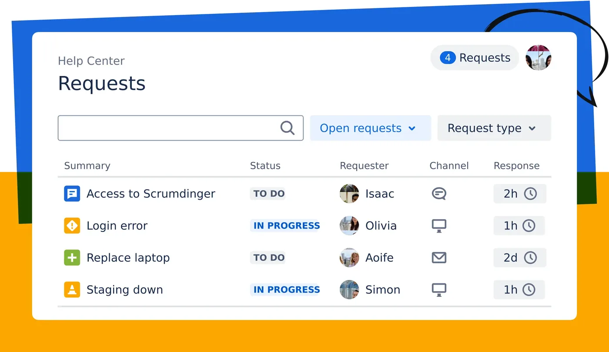</a> | [Jira Service Management Queues](references/34-jira-service-management-queues/README.md) · [official product](https://www.atlassian.com/software/jira/service-management) | owner-published media, 1 named gaps | Service operations | sidebar-content-inspector: Leading navigation, central work area, and trailing detail inspector. Panels: toolbar/header (top); status/action bar (bottom); navigation/list sidebar (leading); detail/inspector (trailing); data table/list (center). Density: low; confidence: medium. | Study configurable work queues, column density, SLA indicators, issue filters, assignment, bulk triage, and record drill-down. |
| 35 | <a href="https://retool.com/">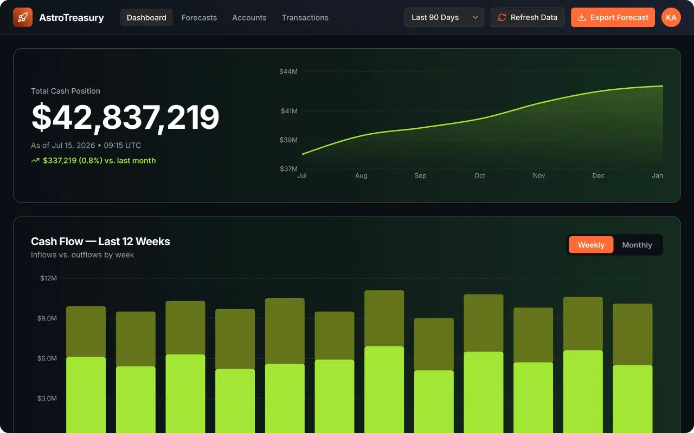</a> | [Retool Apps](references/35-retool-apps/README.md) · [official product](https://retool.com/) | owner-published media, 1 named gaps | Internal tools | sidebar-content-inspector: Leading navigation, central work area, and trailing detail inspector. Panels: toolbar/header (top); navigation/list sidebar (leading); detail/inspector (trailing); data table/list (center). Density: low; confidence: medium. | Study admin-tool composition from editable tables, search and filter controls, record drawers, permission checks, and confirmation modals. |
| 36 | <a href="https://www.appsmith.com/">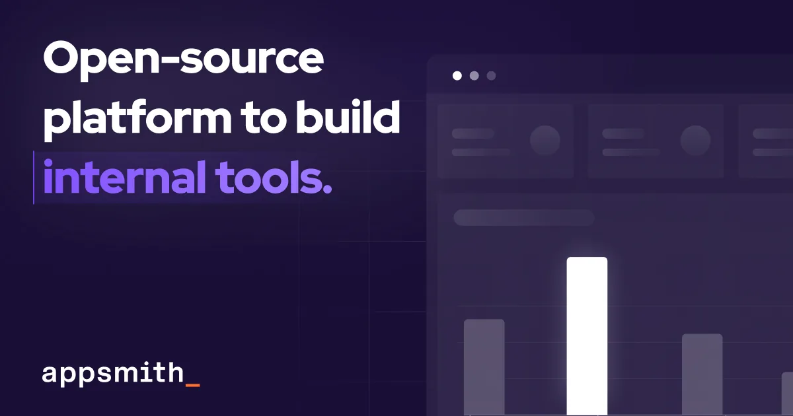</a> | [Appsmith Internal Tools](references/36-appsmith-internal-tools/README.md) · [official product](https://www.appsmith.com/) | owner-published media, 1 named gaps | Internal tools | sidebar-content-inspector: Leading navigation, central work area, and trailing detail inspector. Panels: toolbar/header (top); status/action bar (bottom); navigation/list sidebar (leading); detail/inspector (trailing); data table/list (center). Density: low; confidence: medium. | Study data-bound tables, query-driven filters, form and detail views, role controls, and guarded write or delete operations. |
| 37 | <a href="https://www.tooljet.com/">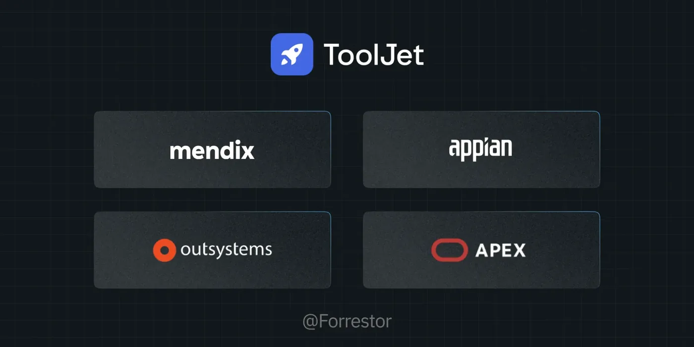</a> | [ToolJet](references/37-tooljet/README.md) · [official product](https://www.tooljet.com/) | owner-published media, 1 named gaps | Internal tools | sidebar-content-inspector: Leading navigation, central work area, and trailing detail inspector. Panels: toolbar/header (top); navigation/list sidebar (leading); detail/inspector (trailing); data table/list (center). Density: low; confidence: medium. | Study low-code assembly of operational tables, query panels, stateful filters, user permissions, and explicit destructive-action prompts. |
| 38 |  | [Budibase](references/38-budibase/README.md) · [official product](https://budibase.com/) | owner-published media, 1 named gaps | Internal tools | sidebar-content: Leading navigation or collection list beside a dominant content area. Panels: toolbar/header (top); navigation/list sidebar (leading); data table/list (center). Density: low; confidence: medium. | Study CRUD interface patterns, generated forms, table filtering, role-specific screens, automation status, and record-deletion safeguards. |
| 39 | <a href="https://www.superblocks.com/">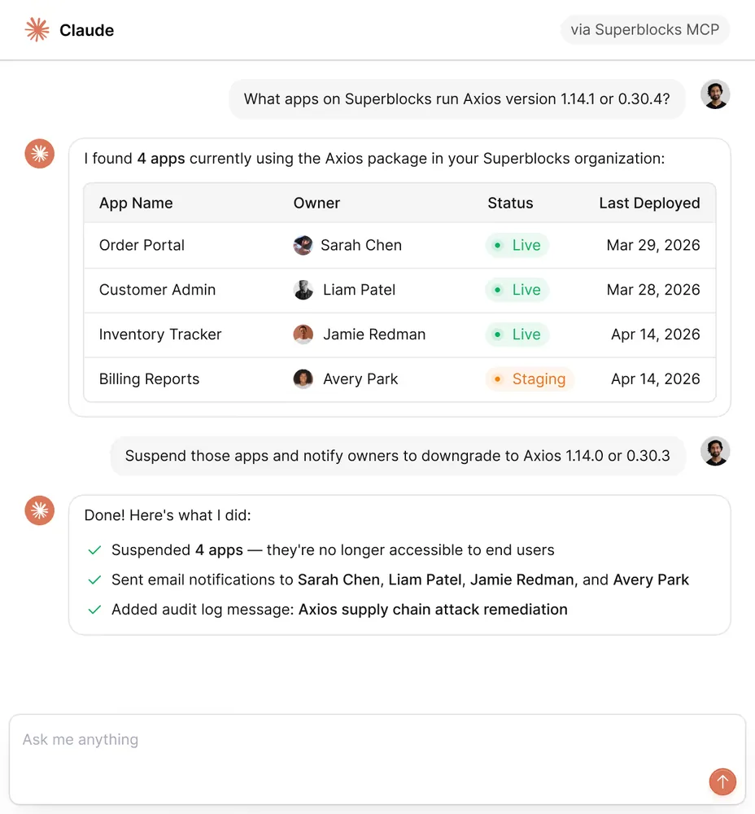</a> | [Superblocks](references/39-superblocks/README.md) · [official product](https://www.superblocks.com/) | owner-published media, 1 named gaps | Internal tools | sidebar-content-inspector: Leading navigation, central work area, and trailing detail inspector. Panels: toolbar/header (top); navigation/list sidebar (leading); detail/inspector (trailing); data table/list (center). Density: low; confidence: medium. | Study enterprise admin interfaces combining dense data grids, workflows, audit context, granular permissions, and write-action confirmations. |
| 40 | <a href="https://docs.stripe.com/dashboard/basics">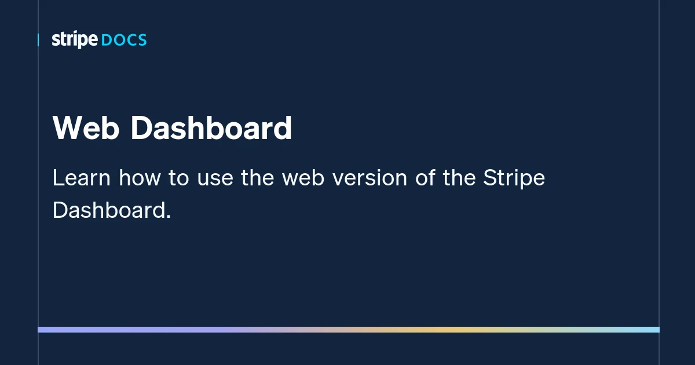</a> | [Stripe Dashboard](references/40-stripe-dashboard/README.md) · [official product](https://docs.stripe.com/dashboard/basics) | owner-published media, 1 named gaps | Finance operations | sidebar-content: Leading navigation or collection list beside a dominant content area. Panels: toolbar/header (top); status/action bar (bottom); navigation/list sidebar (leading); data table/list (center). Density: low; confidence: medium. | Study payment and customer tables, advanced filters, status lifecycles, dispute drill-down, role controls, refunds, and irreversible actions. |
| 41 |  | [Shopify Analytics and Reports](references/41-shopify-analytics-and-reports/README.md) · [official product](https://help.shopify.com/en/manual/reports-and-analytics/shopify-reports) | owner-published media, 1 named gaps | Commerce analytics | content-inspector: Dominant content area with a trailing detail or property inspector. Panels: toolbar/header (top); detail/inspector (trailing); primary canvas/content (center). Density: low; confidence: medium. | Study report catalogs, date and dimension controls, comparison views, tabular summaries, drill-down, exports, and plan-based access. |
| 42 | <a href="https://www.xero.com/accounting-software/dashboard/">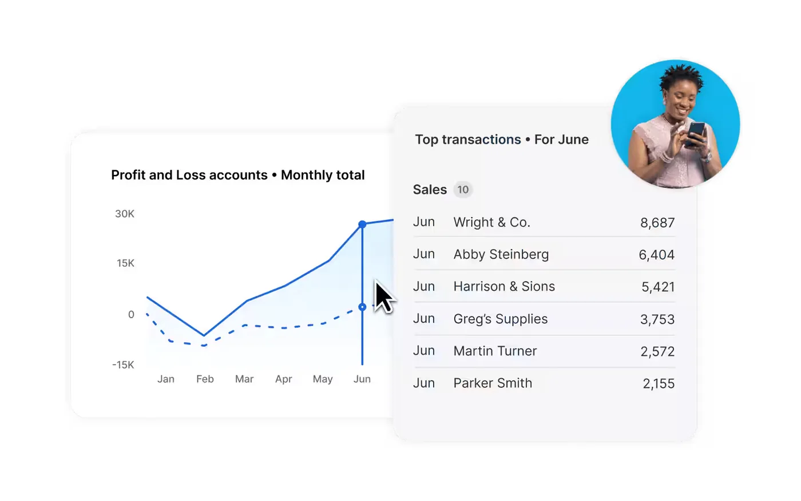</a> | [Xero Accounting Dashboard](references/42-xero-accounting-dashboard/README.md) · [official product](https://www.xero.com/accounting-software/dashboard/) | owner-published media, 2 named gaps | Finance operations | content-inspector: Dominant content area with a trailing detail or property inspector. Panels: toolbar/header (top); detail/inspector (trailing); primary canvas/content (center). Density: low; confidence: medium. | Study bank and cash-flow summaries, account reconciliation status, invoice states, exception visibility, and links into transaction detail. |
| 43 | <a href="https://www.metabase.com/docs/latest/dashboards/introduction">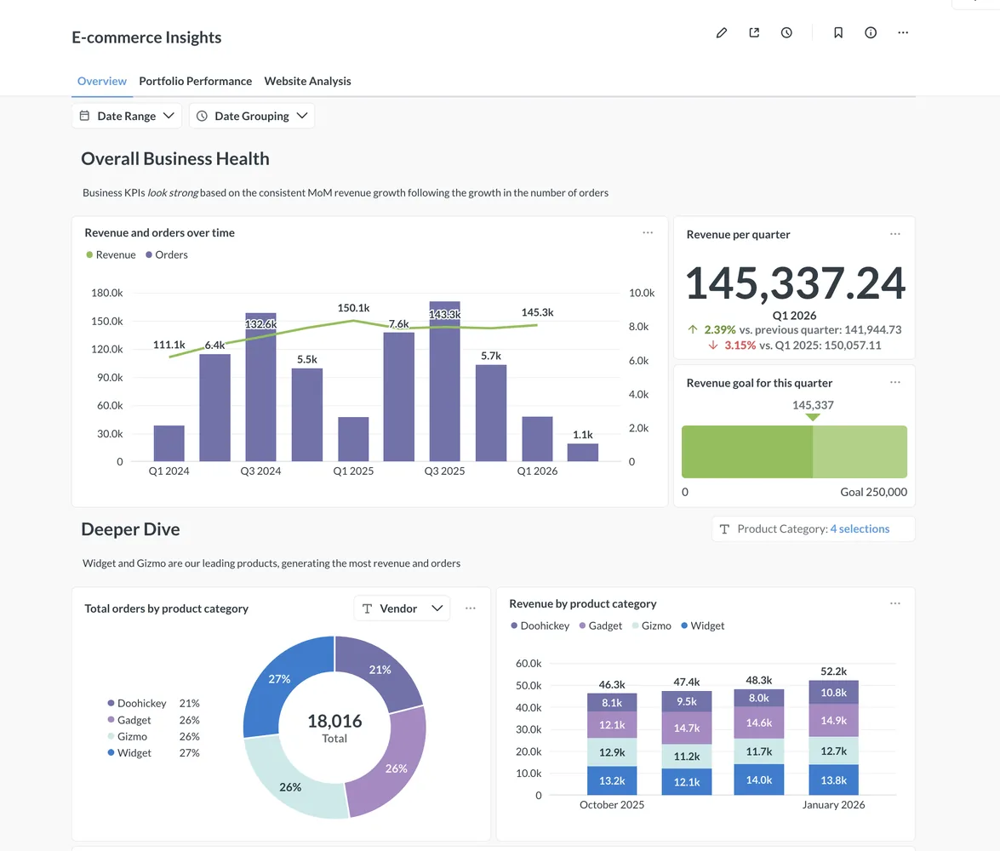</a> | [Metabase Dashboards](references/43-metabase-dashboards/README.md) · [official product](https://www.metabase.com/docs/latest/dashboards/introduction) | owner-published media, 1 named gaps | Business intelligence | sidebar-content: Leading navigation or collection list beside a dominant content area. Panels: toolbar/header (top); navigation/list sidebar (leading); primary canvas/content (center). Density: low; confidence: medium. | Study dashboard filter mapping, linked cards, tabular questions, click behaviors, subscriptions, permissions, and exploratory drill-through. |
| 44 |  | [Looker Dashboards](references/44-looker-dashboards/README.md) · [official product](https://cloud.google.com/looker/docs/dashboards) | owner-published media, 1 named gaps | Business intelligence | sidebar-content-inspector: Leading navigation, central work area, and trailing detail inspector. Panels: toolbar/header (top); status/action bar (bottom); navigation/list sidebar (leading); detail/inspector (trailing); primary canvas/content (center). Density: low; confidence: medium. | Study governed dashboard filters, tile layouts, query status, drill menus, scheduled delivery, edit permissions, and cache controls. |
| 45 |  | [Tableau Dashboards](references/45-tableau-dashboards/README.md) · [official product](https://help.tableau.com/current/pro/desktop/en-us/dashboards.htm) | owner-published media, 1 named gaps | Business intelligence | sidebar-content-inspector: Leading navigation, central work area, and trailing detail inspector. Panels: toolbar/header (top); status/action bar (bottom); navigation/list sidebar (leading); detail/inspector (trailing); data table/list (center). Density: low; confidence: medium. | Study coordinated views, filter and highlight actions, dashboard objects, device layouts, explanatory legends, and visual drill-down. |
| 46 | <a href="https://learn.microsoft.com/en-us/power-bi/create-reports/service-dashboards">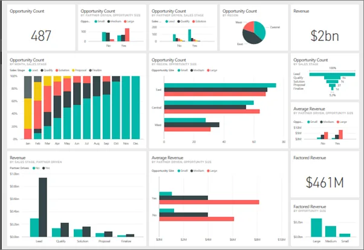</a> | [Microsoft Power BI Dashboards](references/46-microsoft-power-bi-dashboards/README.md) · [official product](https://learn.microsoft.com/en-us/power-bi/create-reports/service-dashboards) | owner-published media, 1 named gaps | Business intelligence | sidebar-content: Leading navigation or collection list beside a dominant content area. Panels: toolbar/header (top); status/action bar (bottom); navigation/list sidebar (leading); data table/list (center). Density: low; confidence: high. | Study pinned tile grids, alertable metrics, focus mode, cross-report navigation, sharing permissions, and paths to source reports. |
| 47 |  | [Amplitude Analytics Charts](references/47-amplitude-analytics-charts/README.md) · [official product](https://amplitude.com/docs/analytics/charts) | owner-published media, 1 named gaps | Product analytics | sidebar-content: Leading navigation or collection list beside a dominant content area. Panels: toolbar/header (top); status/action bar (bottom); navigation/list sidebar (leading); data table/list (center). Density: low; confidence: medium. | Study event segmentation controls, cohort filters, chart-type switching, breakdown tables, annotations, and drill-down into behavioral detail. |
| 48 | <a href="https://docs.mixpanel.com/docs/reports/overview">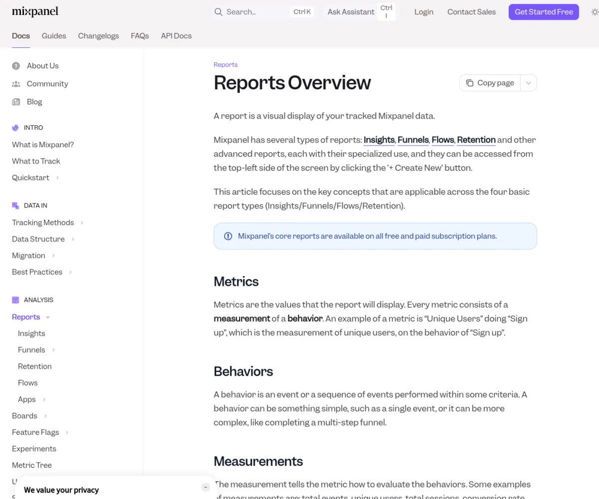</a> | [Mixpanel Reports](references/48-mixpanel-reports/README.md) · [official product](https://docs.mixpanel.com/docs/reports/overview) | owner-published media, 1 named gaps | Product analytics | sidebar-content: Leading navigation or collection list beside a dominant content area. Panels: toolbar/header (top); status/action bar (bottom); navigation/list sidebar (leading); data table/list (center). Density: low; confidence: medium. | Study report builders, event and property filters, cohort comparison, result tables, saved views, and transitions between analyses. |
| 49 | <a href="https://help.okta.com/oie/en-us/content/topics/dashboard/dashboard.htm">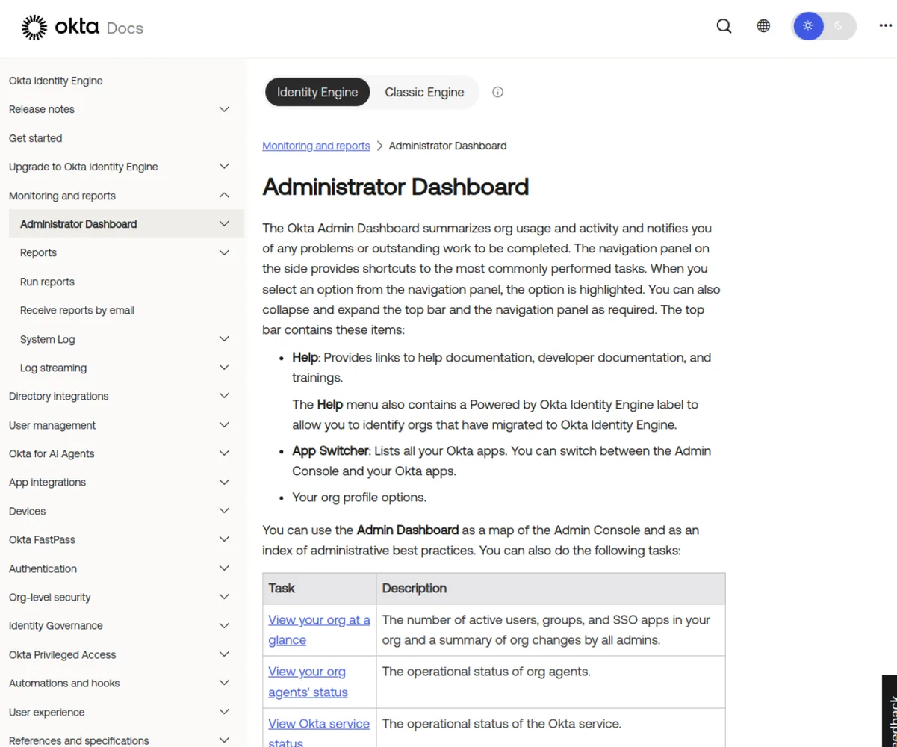</a> | [Okta Admin Console](references/49-okta-admin-console/README.md) · [official product](https://help.okta.com/oie/en-us/content/topics/dashboard/dashboard.htm) | owner-published media, 1 named gaps | Identity administration | sidebar-content: Leading navigation or collection list beside a dominant content area. Panels: toolbar/header (top); navigation/list sidebar (leading); primary canvas/content (center). Density: medium; confidence: high. | Study administrator navigation, user and application status, security-task visibility, scoped roles, audit context, and deactivation workflows. |
| 50 | <a href="https://knowledge.workspace.google.com/admin/getting-started/sign-in-to-your-admin-console">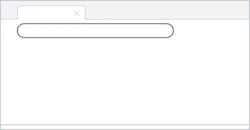</a> | [Google Admin Console](references/50-google-admin-console/README.md) · [official product](https://knowledge.workspace.google.com/admin/getting-started/sign-in-to-your-admin-console) | owner-published media, 1 named gaps | Workspace administration | sidebar-content-inspector: Leading navigation, central work area, and trailing detail inspector. Panels: toolbar/header (top); navigation/list sidebar (leading); detail/inspector (trailing); data table/list (center). Density: low; confidence: medium. | Study organization-wide navigation, user and device tables, alert status, organizational-unit scope, delegated permissions, and account suspension actions. |

Normalized panel bounds, detected separators, image dimensions, source-image URLs, hashes, and analysis confidence are recorded in [`sources.json`](sources.json). Media kinds, measured durations, provenance classes, and per-record gaps are in [`references.json`](references.json).

Attribution and product ownership remain with the linked source.
