# Design system examples

Public design systems and platform human-interface guidance.

Each entry pairs an attributed overview image and a measured panel anatomy with a per-product record: motion evidence, named states, an observed first-success journey, interaction and recovery behavior, accessibility observations, and provenance. Every number below is measured by `verify-reference-evidence.py`, and a record that is missing evidence says so in its own `evidence_gaps`.

**Examples:** 50  
**Images:** 50  
**Structural analyses:** 50  
**Records with no remaining gap:** 0  
**Records with named gaps:** 50 (50 gaps)  
**Motion provenance:** 48 owner-published media, 2 browser driven here  
**Curated:** 2026-08-16  
**Visual source data:** [`sources.json`](sources.json)  
**Record index:** [`references.json`](references.json)  
**Cross-example synthesis:** [`full-reference.md`](full-reference.md)

| # | Reference image | Record | Motion evidence | Category | Interface structure | What to study |
|---:|---|---|---|---|---|---|
| 1 |  | [Material Design 3](references/01-material-design-3/README.md) · [official product](https://m3.material.io/) | owner-published media, 1 named gaps | Platform HIG / consumer products | sidebar-content: Leading navigation or collection list beside a dominant content area. Panels: toolbar/header (top); navigation/list sidebar (leading); primary canvas/content (center). Density: low; confidence: high. | Study the color-role token model and adaptive navigation patterns, including guidance for navigation bars, rails, and drawers across screen sizes. |
| 2 |  | [Apple Human Interface Guidelines](references/02-apple-human-interface-guidelines/README.md) · [official product](https://developer.apple.com/design/human-interface-guidelines/) | owner-published media, 1 named gaps | Platform HIG | sidebar-content-inspector: Leading navigation, central work area, and trailing detail inspector. Panels: toolbar/header (top); navigation/list sidebar (leading); detail/inspector (trailing); primary canvas/content (center). Density: low; confidence: medium. | Study the platform-specific selection and navigation patterns, especially how components adapt across iOS, iPadOS, macOS, watchOS, and visionOS. |
| 3 | <a href="https://fluent2.microsoft.design/">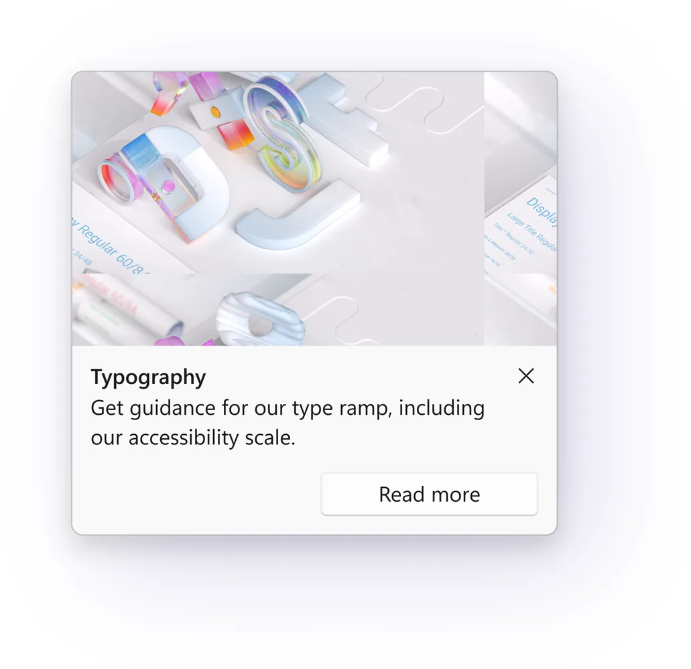</a> | [Fluent 2 Design System](references/03-fluent-2-design-system/README.md) · [official product](https://fluent2.microsoft.design/) | owner-published media, 1 named gaps | Enterprise / platform HIG | sidebar-content-inspector: Leading navigation, central work area, and trailing detail inspector. Panels: toolbar/header (top); status/action bar (bottom); navigation/list sidebar (leading); detail/inspector (trailing); primary canvas/content (center). Density: low; confidence: medium. | Study the design-token hierarchy and component behavior guidance for dense enterprise interfaces, including menus, data entry, and accessibility states. |
| 4 |  | [Carbon Design System](references/04-carbon-design-system/README.md) · [official product](https://carbondesignsystem.com/) | owner-published media, 1 named gaps | Enterprise | sidebar-content-inspector: Leading navigation, central work area, and trailing detail inspector. Panels: toolbar/header (top); status/action bar (bottom); navigation/list sidebar (leading); detail/inspector (trailing); data table/list (center). Density: low; confidence: medium. | Study the structured data-table patterns, token architecture, content guidance, and documented process for proposing and contributing system changes. |
| 5 |  | [Salesforce Lightning Design System](references/05-salesforce-lightning-design-system/README.md) · [official product](https://www.lightningdesignsystem.com/) | owner-published media, 1 named gaps | Enterprise / CRM | content-inspector: Dominant content area with a trailing detail or property inspector. Panels: toolbar/header (top); status/action bar (bottom); detail/inspector (trailing); primary canvas/content (center). Density: low; confidence: medium. | Study the blueprint approach to components and the record-form patterns that coordinate labels, validation, help text, and responsive layouts. |
| 6 |  | [Adobe Spectrum](references/06-adobe-spectrum/README.md) · [official product](https://spectrum.adobe.com/) | owner-published media, 1 named gaps | Enterprise / creative tools | sidebar-content-inspector: Leading navigation, central work area, and trailing detail inspector. Panels: toolbar/header (top); navigation/list sidebar (leading); detail/inspector (trailing); primary canvas/content (center). Density: low; confidence: medium. | Study the semantic color scales and accessibility guidance for interaction states, with particular attention to field validation and keyboard behavior. |
| 7 |  | [Atlassian Design System](references/07-atlassian-design-system/README.md) · [official product](https://atlassian.design/) | owner-published media, 1 named gaps | Enterprise / collaboration | sidebar-content-inspector: Leading navigation, central work area, and trailing detail inspector. Panels: toolbar/header (top); navigation/list sidebar (leading); detail/inspector (trailing); primary canvas/content (center). Density: low; confidence: medium. | Study the content-design guidance for flags, empty states, and error messages alongside tokens and contribution expectations for shared components. |
| 8 |  | [Shopify Polaris](references/08-shopify-polaris/README.md) · [official product](https://polaris.shopify.com/) | owner-published media, 1 named gaps | Commerce | content-inspector: Dominant content area with a trailing detail or property inspector. Panels: toolbar/header (top); status/action bar (bottom); detail/inspector (trailing); data table/list (center). Density: low; confidence: medium. | Study the resource-list and index-table patterns for merchant workflows, including bulk actions, filtering, content guidance, and accessible status communication. |
| 9 | <a href="https://primer.style/">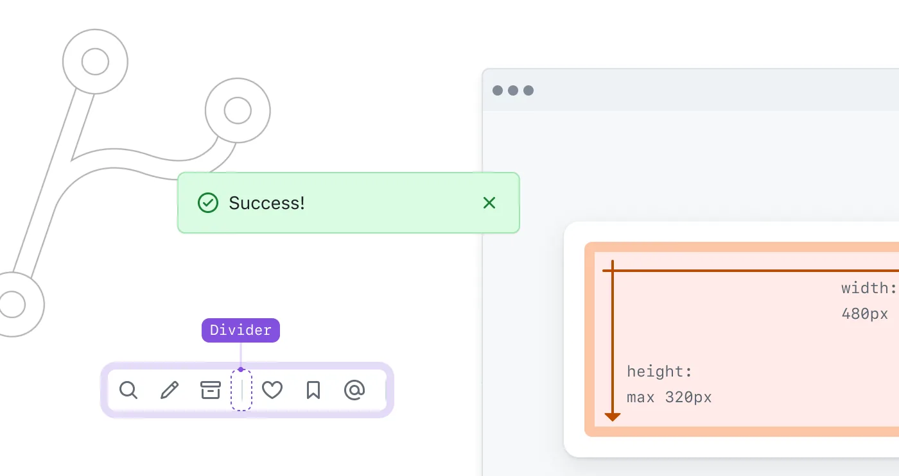</a> | [GitHub Primer](references/09-github-primer/README.md) · [official product](https://primer.style/) | owner-published media, 1 named gaps | Developer tools | sidebar-content-inspector: Leading navigation, central work area, and trailing detail inspector. Panels: toolbar/header (top); status/action bar (bottom); navigation/list sidebar (leading); detail/inspector (trailing); primary canvas/content (center). Density: low; confidence: medium. | Study the interaction-state primitives and contribution model used to align design tokens, Figma assets, CSS utilities, and React components. |
| 10 |  | [GitLab Pajamas](references/10-gitlab-pajamas/README.md) · [official product](https://design.gitlab.com/) | owner-published media, 1 named gaps | Developer tools / enterprise | canvas: Single dominant canvas or editor with peripheral controls. Panels: toolbar/header (top); primary canvas/content (center). Density: low; confidence: medium. | Study the documented contribution workflow and issue-oriented governance, plus patterns for merge-request metadata, filtering, and empty states. |
| 11 | <a href="https://experience.sap.com/fiori-design-web/">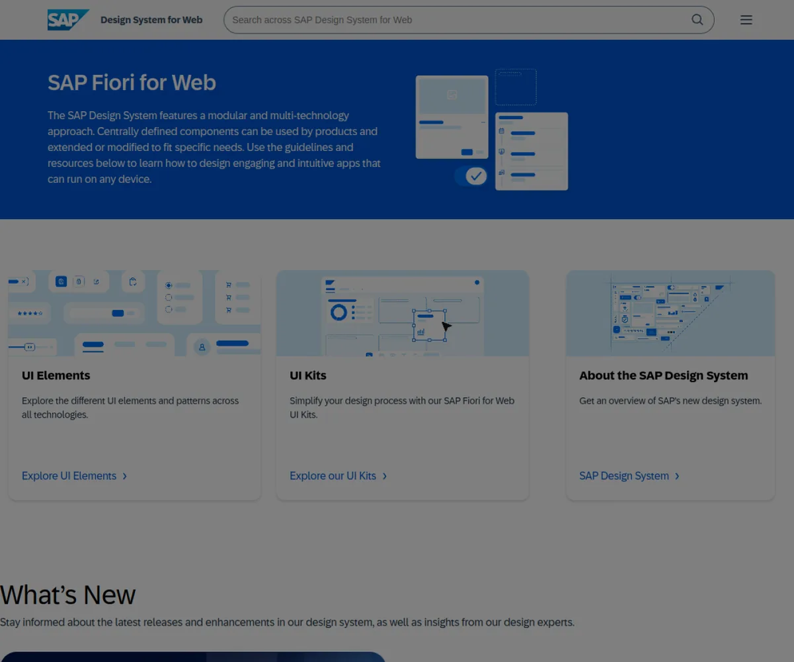</a> | [SAP Fiori Design System](references/11-sap-fiori-design-system/README.md) · [official product](https://experience.sap.com/fiori-design-web/) | owner-published media, 1 named gaps | Enterprise | sidebar-content: Leading navigation or collection list beside a dominant content area. Panels: toolbar/header (top); status/action bar (bottom); navigation/list sidebar (leading); primary canvas/content (center). Density: low; confidence: high. | Study the object-page pattern for complex business records, including section navigation, actions, status information, and responsive behavior. |
| 12 | <a href="https://clarity.design/">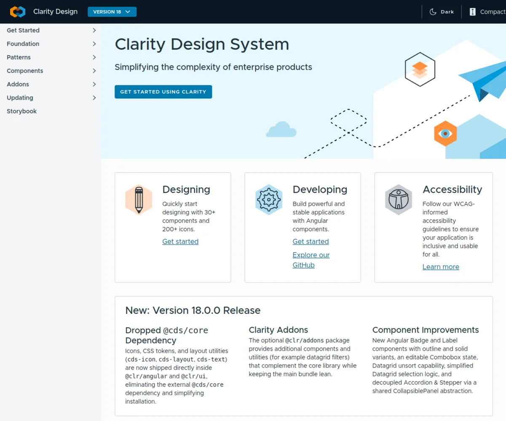</a> | [VMware Clarity Design System](references/12-vmware-clarity-design-system/README.md) · [official product](https://clarity.design/) | owner-published media, 1 named gaps | Enterprise / developer tools | sidebar-content-inspector: Leading navigation, central work area, and trailing detail inspector. Panels: toolbar/header (top); status/action bar (bottom); navigation/list sidebar (leading); detail/inspector (trailing); data table/list (center). Density: low; confidence: medium. | Study the datagrid interaction model, including sorting, filtering, selection, pagination, expandable rows, keyboard access, and loading states. |
| 13 | <a href="https://cloudscape.design/">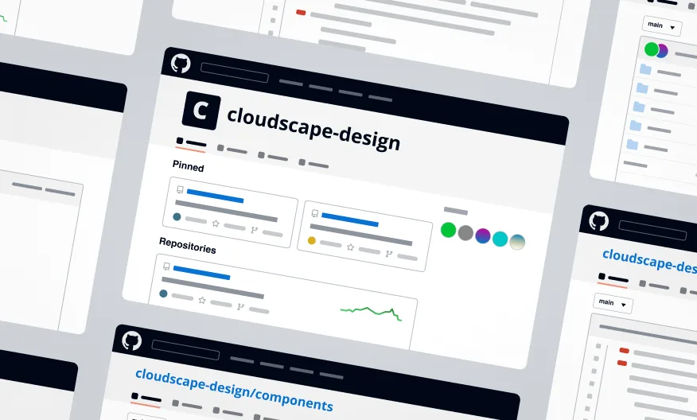</a> | [AWS Cloudscape Design System](references/13-aws-cloudscape-design-system/README.md) · [official product](https://cloudscape.design/) | owner-published media, 1 named gaps | Cloud / developer tools | sidebar-content-inspector: Leading navigation, central work area, and trailing detail inspector. Panels: toolbar/header (top); status/action bar (bottom); navigation/list sidebar (leading); detail/inspector (trailing); primary canvas/content (center). Density: low; confidence: medium. | Study the collection-view and split-panel patterns for cloud administration, along with density, accessibility, content, and contribution guidance. |
| 14 | <a href="https://www.patternfly.org/">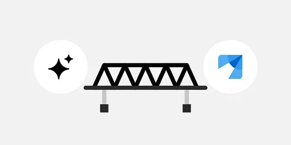</a> | [PatternFly](references/14-patternfly/README.md) · [official product](https://www.patternfly.org/) | owner-published media, 1 named gaps | Enterprise / open source | sidebar-content-inspector: Leading navigation, central work area, and trailing detail inspector. Panels: toolbar/header (top); navigation/list sidebar (leading); detail/inspector (trailing); primary canvas/content (center). Density: low; confidence: medium. | Study the dashboard and data-view patterns for administrative products, including filters, bulk selection, status presentation, and responsive layouts. |
| 15 |  | [Zendesk Garden](references/15-zendesk-garden/README.md) · [official product](https://garden.zendesk.com/) | owner-published media, 1 named gaps | Enterprise / customer support | content-inspector: Dominant content area with a trailing detail or property inspector. Panels: toolbar/header (top); status/action bar (bottom); detail/inspector (trailing); primary canvas/content (center). Density: low; confidence: medium. | Study the field and notification components for support workflows, focusing on semantic tokens, validation messaging, focus treatment, and localization readiness. |
| 16 | <a href="https://paste.twilio.design/">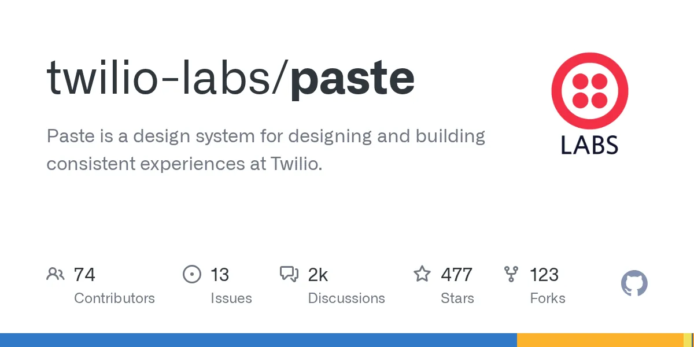</a> | [Twilio Paste](references/16-twilio-paste/README.md) · [official product](https://paste.twilio.design/) | owner-published media, 1 named gaps | Enterprise / communications | sidebar-content-inspector: Leading navigation, central work area, and trailing detail inspector. Panels: toolbar/header (top); status/action bar (bottom); navigation/list sidebar (leading); detail/inspector (trailing); primary canvas/content (center). Density: low; confidence: medium. | Study the token-driven composition model and accessible form patterns, together with the documented process for requesting or contributing components. |
| 17 | <a href="https://baseweb.design/">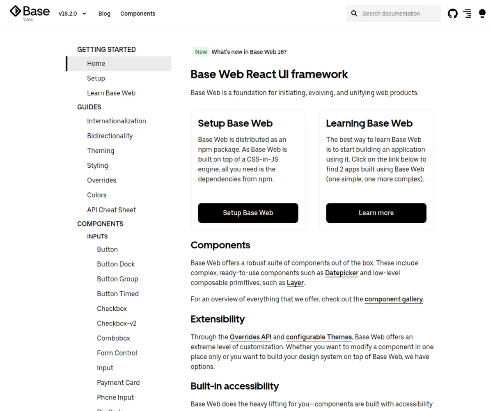</a> | [Base Web](references/17-base-web/README.md) · [official product](https://baseweb.design/) | owner-published media, 1 named gaps | Consumer products / mobility | sidebar-content: Leading navigation or collection list beside a dominant content area. Panels: toolbar/header (top); status/action bar (bottom); navigation/list sidebar (leading); primary canvas/content (center). Density: medium; confidence: medium. | Study the override API and stateful component patterns, particularly payment-card input, date selection, and accessible form feedback. |
| 18 |  | [Gestalt](references/18-gestalt/README.md) · [official product](https://gestalt.pinterest.systems/) | owner-published media, 1 named gaps | Consumer products | sidebar-content: Leading navigation or collection list beside a dominant content area. Panels: toolbar/header (top); navigation/list sidebar (leading); primary canvas/content (center). Density: low; confidence: medium. | Study the masonry-style content presentation and modal-sheet patterns, including responsive composition, internationalized content, and accessibility annotations. |
| 19 | <a href="https://nordhealth.design/">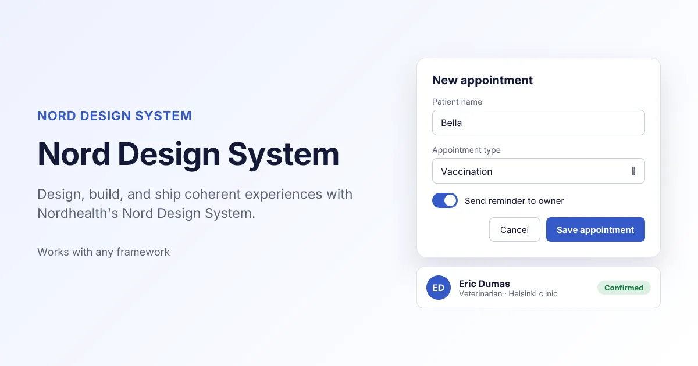</a> | [Nord Design System](references/19-nord-design-system/README.md) · [official product](https://nordhealth.design/) | owner-published media, 1 named gaps | Accessibility-first / healthcare | sidebar-content-inspector: Leading navigation, central work area, and trailing detail inspector. Panels: toolbar/header (top); navigation/list sidebar (leading); detail/inspector (trailing); primary canvas/content (center). Density: low; confidence: medium. | Study the stack and layout primitives plus accessibility-oriented form recipes, with attention to focus order, error summaries, and contribution governance. |
| 20 | <a href="https://eui.elastic.co/">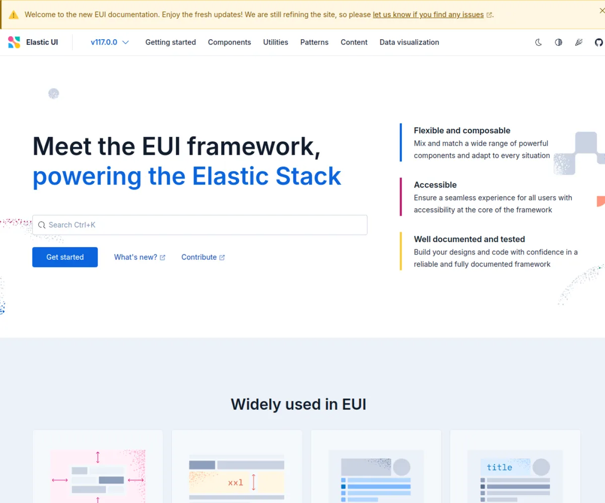</a> | [Elastic UI](references/20-elastic-ui/README.md) · [official product](https://eui.elastic.co/) | owner-published media, 1 named gaps | Developer tools / data products | sidebar-content-inspector: Leading navigation, central work area, and trailing detail inspector. Panels: toolbar/header (top); navigation/list sidebar (leading); detail/inspector (trailing); data table/list (center). Density: low; confidence: medium. | Study the query and data-grid interactions used in analytics interfaces, including compressed density, keyboard navigation, filters, and empty states. |
| 21 | <a href="https://www.mongodb.design/">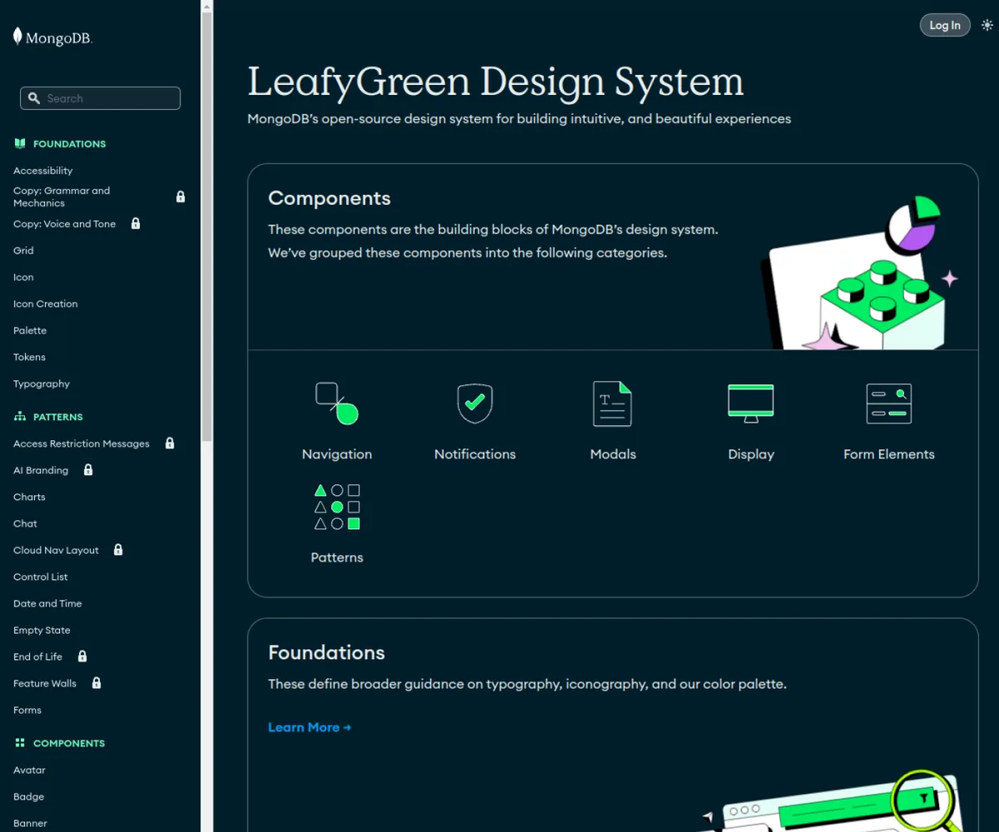</a> | [MongoDB LeafyGreen](references/21-mongodb-leafygreen/README.md) · [official product](https://www.mongodb.design/) | owner-published media, 1 named gaps | Developer tools / databases | sidebar-content: Leading navigation or collection list beside a dominant content area. Panels: toolbar/header (top); status/action bar (bottom); navigation/list sidebar (leading); primary canvas/content (center). Density: low; confidence: high. | Study the code, side-navigation, and data-display components for database tooling, alongside semantic tokens and documented package contribution practices. |
| 22 | <a href="https://helios.hashicorp.design/">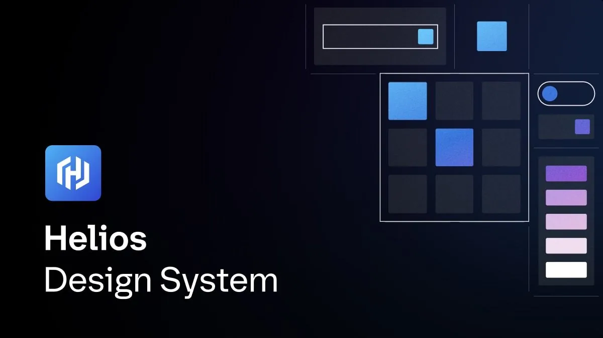</a> | [HashiCorp Helios Design System](references/22-hashicorp-helios-design-system/README.md) · [official product](https://helios.hashicorp.design/) | owner-published media, 1 named gaps | Developer tools / cloud infrastructure | sidebar-content-inspector: Leading navigation, central work area, and trailing detail inspector. Panels: toolbar/header (top); status/action bar (bottom); navigation/list sidebar (leading); detail/inspector (trailing); primary canvas/content (center). Density: low; confidence: medium. | Study the application side-navigation and disclosure patterns for infrastructure workflows, including accessibility specifications and contribution status labels. |
| 23 |  | [Blueprint](references/23-blueprint/README.md) · [official product](https://blueprintjs.com/) | owner-published media, 1 named gaps | Developer tools / data-dense applications | table-or-list: Single dominant table or list with controls around its perimeter. Panels: toolbar/header (top); data table/list (center). Density: low; confidence: medium. | Study the table, tree, and omnibar components for desktop-like web tools, especially keyboard interaction and high-density information presentation. |
| 24 | <a href="https://jetbrains.github.io/ring-ui/">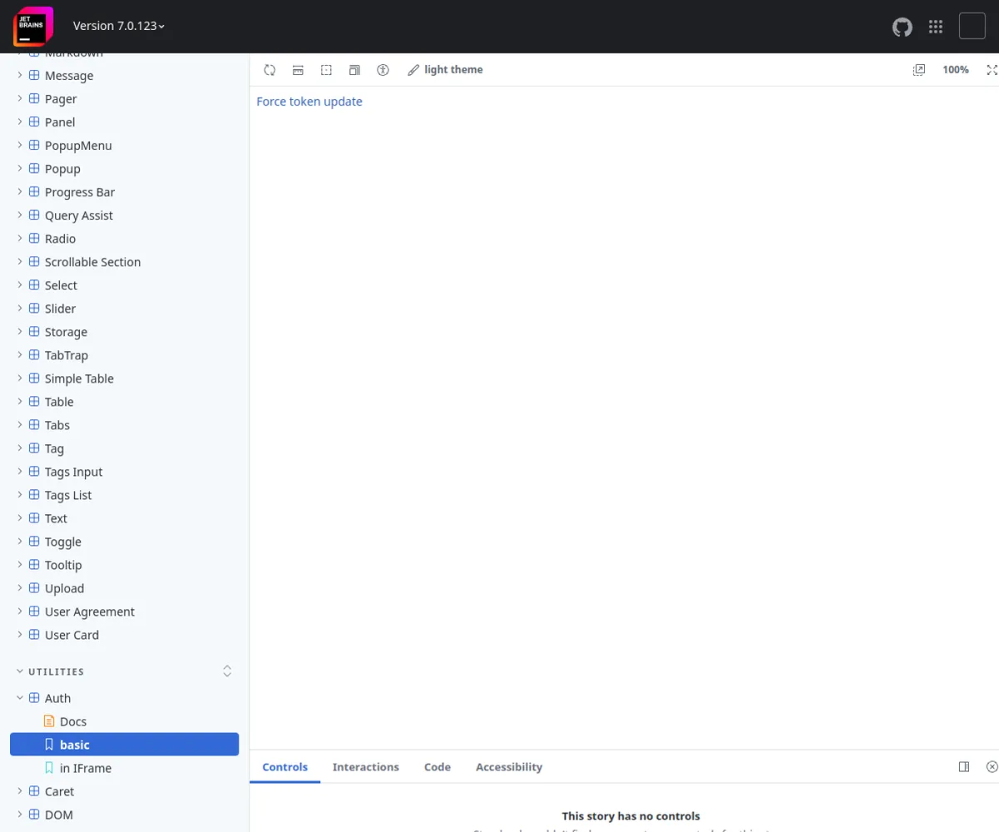</a> | [JetBrains Ring UI](references/24-jetbrains-ring-ui/README.md) · [official product](https://jetbrains.github.io/ring-ui/) | owner-published media, 1 named gaps | Developer tools | sidebar-content: Leading navigation or collection list beside a dominant content area. Panels: toolbar/header (top); status/action bar (bottom); navigation/list sidebar (leading); primary canvas/content (center). Density: low; confidence: high. | Study the repository-backed component documentation and patterns for search, navigation, alerts, and controls in complex development environments. |
| 25 | <a href="https://protocol.mozilla.org/">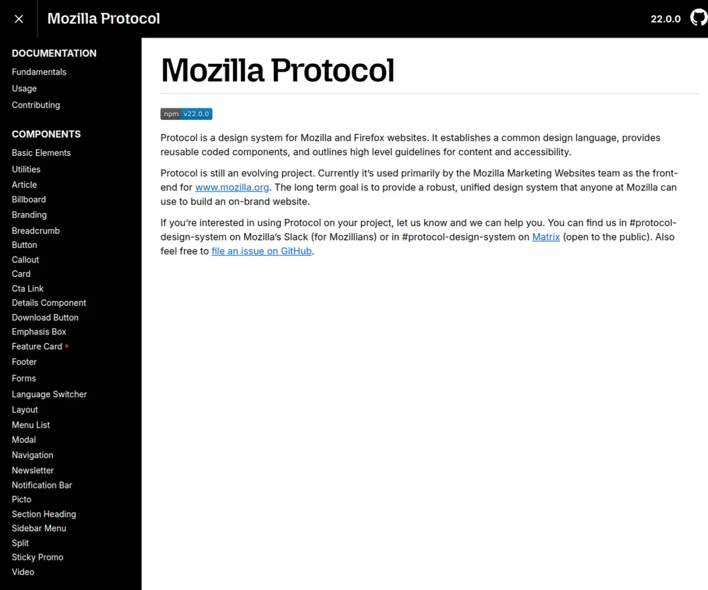</a> | [Mozilla Protocol](references/25-mozilla-protocol/README.md) · [official product](https://protocol.mozilla.org/) | owner-published media, 1 named gaps | Consumer products / web publishing | sidebar-content: Leading navigation or collection list beside a dominant content area. Panels: toolbar/header (top); navigation/list sidebar (leading); primary canvas/content (center). Density: low; confidence: high. | Study the modular page-section and navigation patterns used across localized content sites, including typography tokens and repository contribution instructions. |
| 26 |  | [BBC Global Experience Language](references/26-bbc-global-experience-language/README.md) · [official product](https://www.bbc.co.uk/gel) | owner-published media, 1 named gaps | Media / consumer products | sidebar-content: Leading navigation or collection list beside a dominant content area. Panels: toolbar/header (top); navigation/list sidebar (leading); primary canvas/content (center). Density: low; confidence: medium. | Study the guidance for typography, iconography, and interaction across global media experiences, with emphasis on accessibility and multilingual content. |
| 27 |  | [Skyscanner Backpack](references/27-skyscanner-backpack/README.md) · [official product](https://github.com/Skyscanner/backpack) | owner-published media, 1 named gaps | Commerce / travel | sidebar-content-inspector: Leading navigation, central work area, and trailing detail inspector. Panels: toolbar/header (top); status/action bar (bottom); navigation/list sidebar (leading); detail/inspector (trailing); primary canvas/content (center). Density: low; confidence: medium. | Study the calendar and travel-form component implementations, plus the repository workflow that governs packages across web and native platforms. |
| 28 | <a href="https://vanillaframework.io/">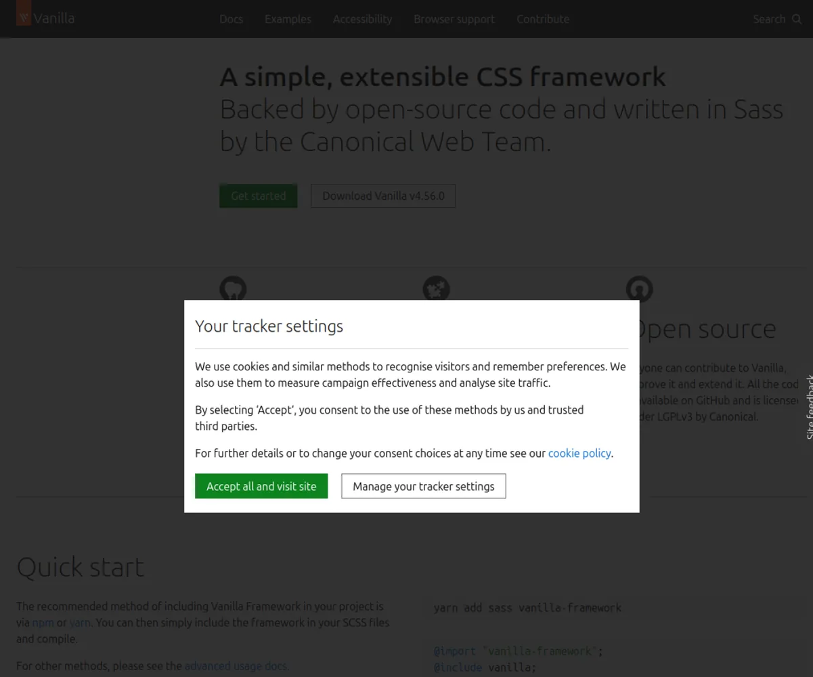</a> | [Vanilla Framework](references/28-vanilla-framework/README.md) · [official product](https://vanillaframework.io/) | owner-published media, 1 named gaps | Developer tools / open source | sidebar-content-inspector: Leading navigation, central work area, and trailing detail inspector. Panels: toolbar/header (top); navigation/list sidebar (leading); detail/inspector (trailing); data table/list (center). Density: low; confidence: medium. | Study the utility-and-pattern approach to responsive documentation and product sites, including grid behavior, typography, accessibility, and contribution rules. |
| 29 |  | [Ant Design](references/29-ant-design/README.md) · [official product](https://ant.design/) | browser driven here, 1 named gaps | Enterprise / commerce | sidebar-content-inspector: Leading navigation, central work area, and trailing detail inspector. Panels: toolbar/header (top); navigation/list sidebar (leading); detail/inspector (trailing); data table/list (center). Density: low; confidence: medium. | Study the table and form patterns for complex management interfaces, including editable cells, validation, filtering, design tokens, and internationalization. |
| 30 | <a href="https://mui.com/material-ui/">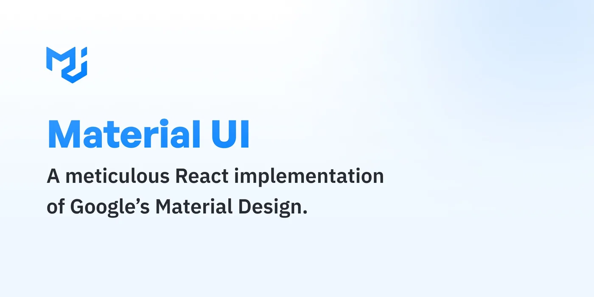</a> | [Material UI](references/30-material-ui/README.md) · [official product](https://mui.com/material-ui/) | owner-published media, 1 named gaps | Component library / developer tools | sidebar-content: Leading navigation or collection list beside a dominant content area. Panels: toolbar/header (top); navigation/list sidebar (leading); primary canvas/content (center). Density: low; confidence: high. | Study the theme-token API and accessible component composition, particularly dialogs, autocomplete, responsive navigation, and controlled interaction states. |
| 31 | <a href="https://chakra-ui.com/">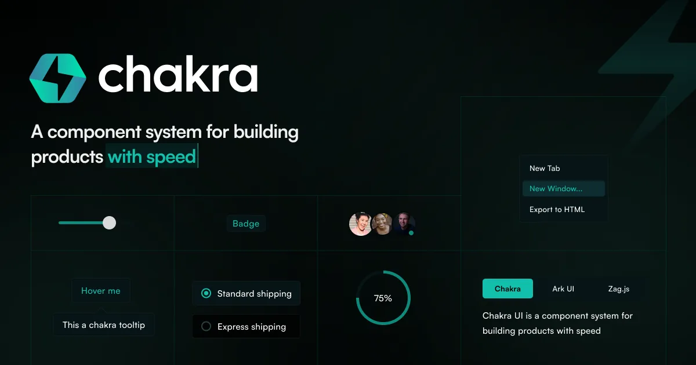</a> | [Chakra UI](references/31-chakra-ui/README.md) · [official product](https://chakra-ui.com/) | owner-published media, 1 named gaps | Accessibility-first / component library | sidebar-content: Leading navigation or collection list beside a dominant content area. Panels: toolbar/header (top); status/action bar (bottom); navigation/list sidebar (leading); primary canvas/content (center). Density: low; confidence: medium. | Study the style-prop and semantic-token model, along with composable field, dialog, and menu patterns that expose keyboard and focus behavior. |
| 32 | <a href="https://www.radix-ui.com/primitives">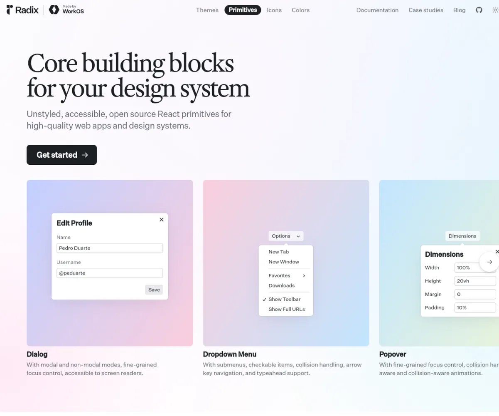</a> | [Radix Primitives](references/32-radix-primitives/README.md) · [official product](https://www.radix-ui.com/primitives) | owner-published media, 1 named gaps | Accessibility-first / headless components | sidebar-content: Leading navigation or collection list beside a dominant content area. Panels: toolbar/header (top); status/action bar (bottom); navigation/list sidebar (leading); primary canvas/content (center). Density: low; confidence: medium. | Study the documented keyboard interactions and focus management for unstyled primitives such as dialogs, popovers, menus, and roving-tabindex controls. |
| 33 | <a href="https://react-spectrum.adobe.com/react-aria/">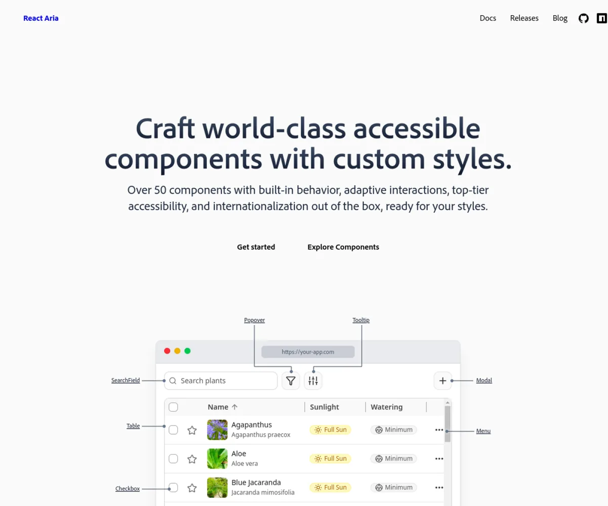</a> | [React Aria](references/33-react-aria/README.md) · [official product](https://react-spectrum.adobe.com/react-aria/) | owner-published media, 1 named gaps | Accessibility-first / developer tools | sidebar-content-inspector: Leading navigation, central work area, and trailing detail inspector. Panels: toolbar/header (top); navigation/list sidebar (leading); primary canvas/content (center). Density: low; confidence: medium. | Study the interaction hooks for collection widgets, including selection, focus management, keyboard navigation, localization, and screen-reader semantics. |
| 34 | <a href="https://headlessui.com/">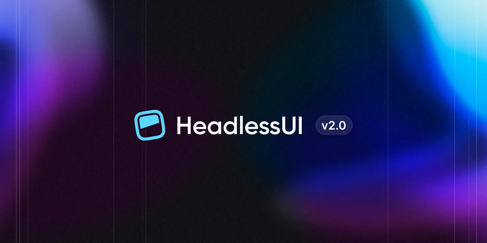</a> | [Headless UI](references/34-headless-ui/README.md) · [official product](https://headlessui.com/) | owner-published media, 1 named gaps | Accessibility-first / headless components | sidebar-content-inspector: Leading navigation, central work area, and trailing detail inspector. Panels: toolbar/header (top); navigation/list sidebar (leading); detail/inspector (trailing); data table/list (center). Density: low; confidence: medium. | Study the state exposure and keyboard contracts for unstyled comboboxes, listboxes, menus, dialogs, tabs, and disclosure components. |
| 35 | <a href="https://www.w3.org/WAI/ARIA/apg/">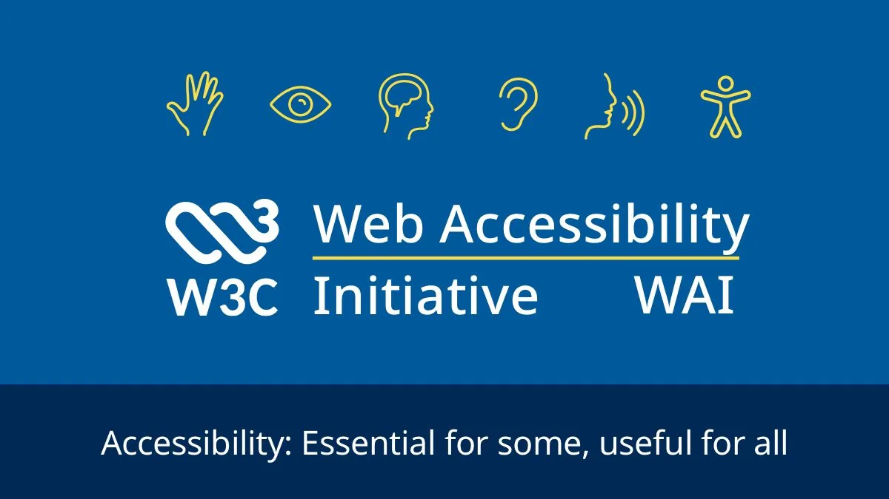</a> | [WAI-ARIA Authoring Practices Guide](references/35-wai-aria-authoring-practices-guide/README.md) · [official product](https://www.w3.org/WAI/ARIA/apg/) | owner-published media, 1 named gaps | Accessibility-first / interaction standards | sidebar-content-inspector: Leading navigation, central work area, and trailing detail inspector. Panels: toolbar/header (top); status/action bar (bottom); navigation/list sidebar (leading); detail/inspector (trailing); data table/list (center). Density: low; confidence: medium. | Study the normative-style keyboard and semantic patterns for composite widgets, including grids, trees, comboboxes, dialogs, tabs, and menus. |
| 36 | <a href="https://designsystem.digital.gov/">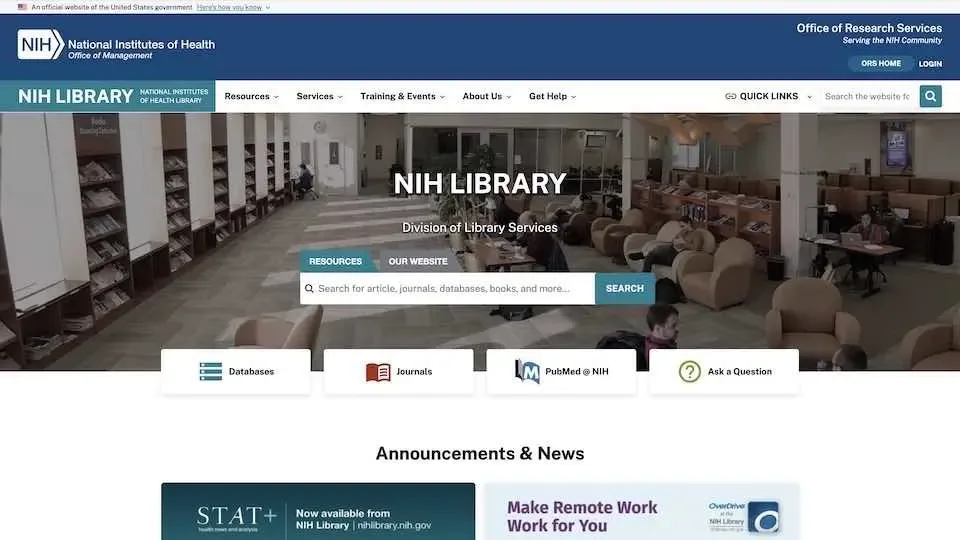</a> | [U.S. Web Design System](references/36-u-s-web-design-system/README.md) · [official product](https://designsystem.digital.gov/) | owner-published media, 1 named gaps | Government | sidebar-content: Leading navigation or collection list beside a dominant content area. Panels: toolbar/header (top); status/action bar (bottom); navigation/list sidebar (leading); primary canvas/content (center). Density: low; confidence: medium. | Study the maturity-status and contribution governance model, plus accessible patterns for forms, language selection, identifiers, and public-service content. |
| 37 |  | [GOV.UK Design System](references/37-gov-uk-design-system/README.md) · [official product](https://design-system.service.gov.uk/) | owner-published media, 1 named gaps | Government | sidebar-content-inspector: Leading navigation, central work area, and trailing detail inspector. Panels: toolbar/header (top); navigation/list sidebar (leading); detail/inspector (trailing); primary canvas/content (center). Density: low; confidence: medium. | Study the error-summary pattern that moves focus and links to invalid fields, together with content rules and community proposal governance. |
| 38 |  | [NHS Digital Service Manual](references/38-nhs-digital-service-manual/README.md) · [official product](https://service-manual.nhs.uk/design-system) | owner-published media, 1 named gaps | Government / healthcare | sidebar-content: Leading navigation or collection list beside a dominant content area. Panels: toolbar/header (top); status/action bar (bottom); navigation/list sidebar (leading); primary canvas/content (center). Density: low; confidence: medium. | Study the patient-facing callout, warning, and form patterns, including plain-language content guidance, accessibility evidence, and contribution criteria. |
| 39 | <a href="https://design.canada.ca/">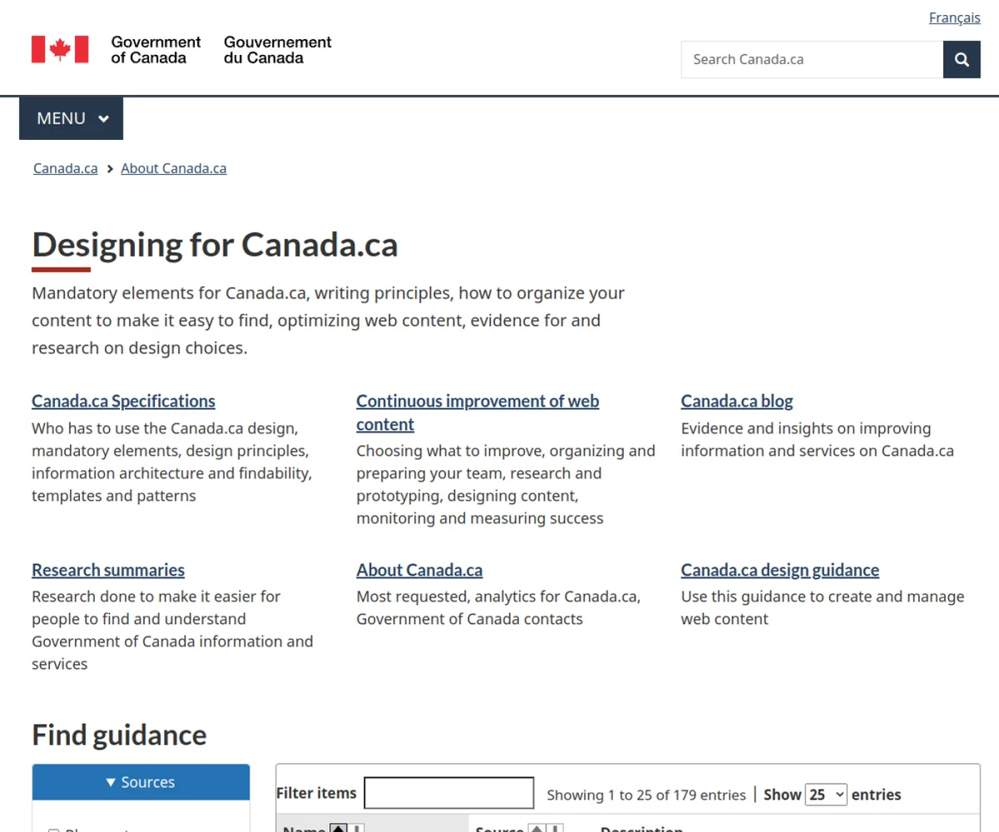</a> | [Government of Canada Design System](references/39-government-of-canada-design-system/README.md) · [official product](https://design.canada.ca/) | owner-published media, 1 named gaps | Government | sidebar-content: Leading navigation or collection list beside a dominant content area. Panels: toolbar/header (top); status/action bar (bottom); navigation/list sidebar (leading); primary canvas/content (center). Density: low; confidence: medium. | Study the bilingual content and layout guidance for federal services, including language switching, alerts, forms, accessibility, and mandatory design conventions. |
| 40 |  | [Singapore Government Design System](references/40-singapore-government-design-system/README.md) · [official product](https://www.designsystem.tech.gov.sg/) | owner-published media, 1 named gaps | Government | sidebar-content-inspector: Leading navigation, central work area, and trailing detail inspector. Panels: toolbar/header (top); status/action bar (bottom); navigation/list sidebar (leading); detail/inspector (trailing); primary canvas/content (center). Density: low; confidence: medium. | Study the official-header and footer patterns that establish service provenance, alongside responsive components, tokens, accessibility, and implementation guidance. |
| 41 | <a href="https://www.systeme-de-design.gouv.fr/">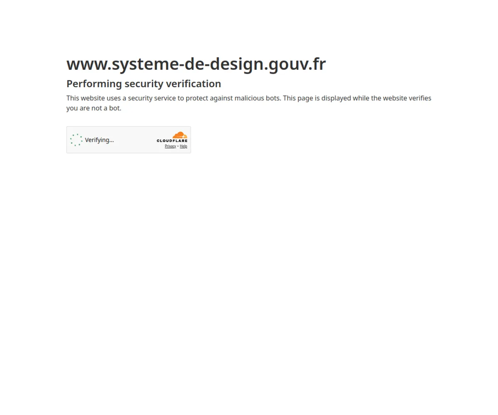</a> | [French State Design System](references/41-french-state-design-system/README.md) · [official product](https://www.systeme-de-design.gouv.fr/) | owner-published media, 1 named gaps | Government | sidebar-content: Leading navigation or collection list beside a dominant content area. Panels: toolbar/header (top); navigation/list sidebar (leading); primary canvas/content (center). Density: low; confidence: medium. | Study the consent-banner and service-header patterns, including French-language content rules, accessibility requirements, tokens, and controlled contribution governance. |
| 42 |  | [Design System of the Country of Italy](references/42-design-system-of-the-country-of-italy/README.md) · [official product](https://designers.italia.it/design-system/) | owner-published media, 1 named gaps | Government | sidebar-content-inspector: Leading navigation, central work area, and trailing detail inspector. Panels: toolbar/header (top); navigation/list sidebar (leading); detail/inspector (trailing); primary canvas/content (center). Density: low; confidence: medium. | Study the service-navigation and form patterns for Italian public services, including typography, accessibility, content structure, and reusable implementation guidance. |
| 43 | <a href="https://ec.europa.eu/component-library/">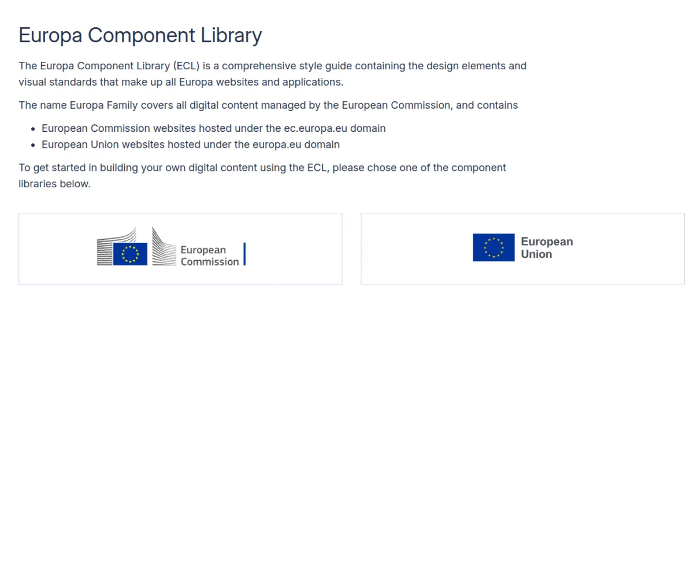</a> | [European Commission Europa Component Library](references/43-european-commission-europa-component-library/README.md) · [official product](https://ec.europa.eu/component-library/) | owner-published media, 1 named gaps | Government / supranational | sidebar-content: Leading navigation or collection list beside a dominant content area. Panels: toolbar/header (top); navigation/list sidebar (leading); primary canvas/content (center). Density: low; confidence: medium. | Study the multilingual site-header and breadcrumb patterns for institutional websites, together with component variants, accessibility, and content structure. |
| 44 | <a href="https://designsystem.suomi.fi/">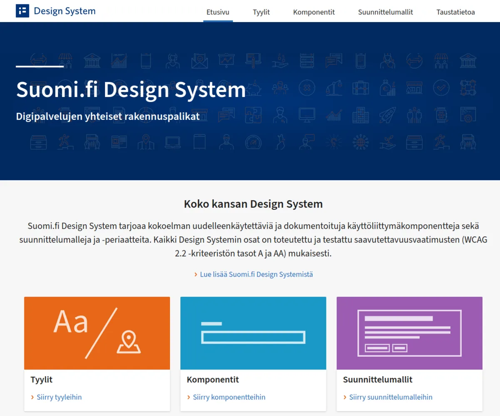</a> | [Suomi.fi Design System](references/44-suomi-fi-design-system/README.md) · [official product](https://designsystem.suomi.fi/) | browser driven here, 1 named gaps | Government | sidebar-content-inspector: Leading navigation, central work area, and trailing detail inspector. Panels: toolbar/header (top); status/action bar (bottom); navigation/list sidebar (leading); detail/inspector (trailing); primary canvas/content (center). Density: low; confidence: medium. | Study the multilingual public-service form and notification patterns, including accessible status messaging, tokens, implementation examples, and release governance. |
| 45 | <a href="https://designsystem.gov.scot/">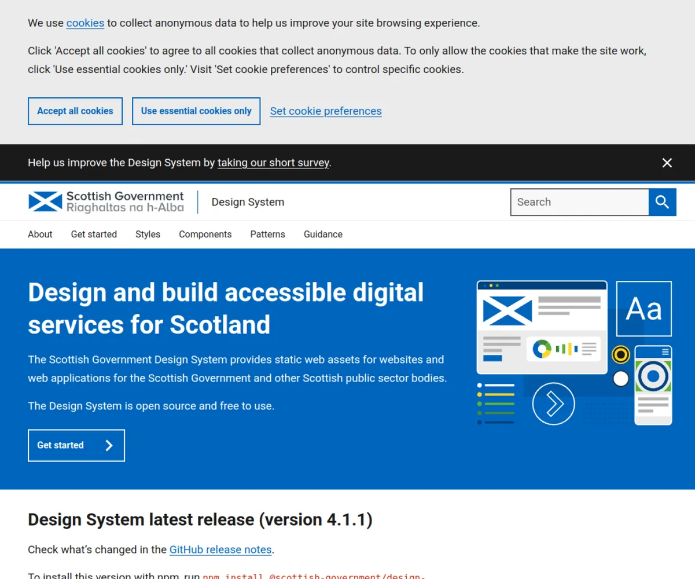</a> | [Scottish Government Design System](references/45-scottish-government-design-system/README.md) · [official product](https://designsystem.gov.scot/) | owner-published media, 1 named gaps | Government | sidebar-content: Leading navigation or collection list beside a dominant content area. Panels: toolbar/header (top); status/action bar (bottom); navigation/list sidebar (leading); primary canvas/content (center). Density: low; confidence: high. | Study the sequential navigation and question-page patterns for public-service journeys, including content guidance, accessibility, and contribution routes. |
| 46 | <a href="https://design.cms.gov/">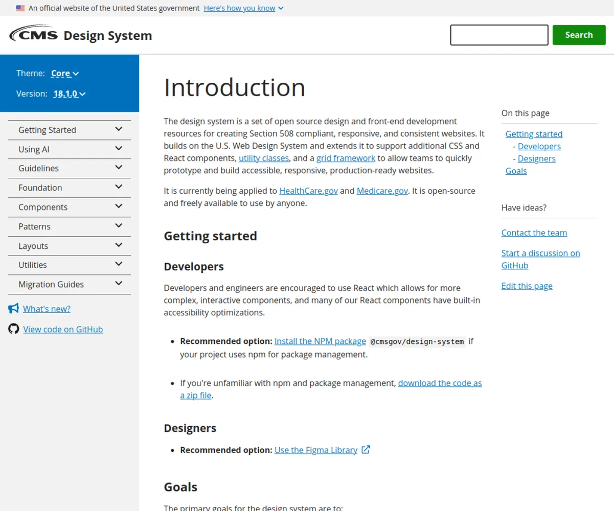</a> | [CMS Design System](references/46-cms-design-system/README.md) · [official product](https://design.cms.gov/) | owner-published media, 1 named gaps | Government / healthcare | sidebar-content: Leading navigation or collection list beside a dominant content area. Panels: toolbar/header (top); navigation/list sidebar (leading); data table/list (center). Density: low; confidence: medium. | Study the healthcare coverage and choice patterns, especially filterable tables, date fields, help text, accessibility, and theme-level token reuse. |
| 47 | <a href="https://design.va.gov/">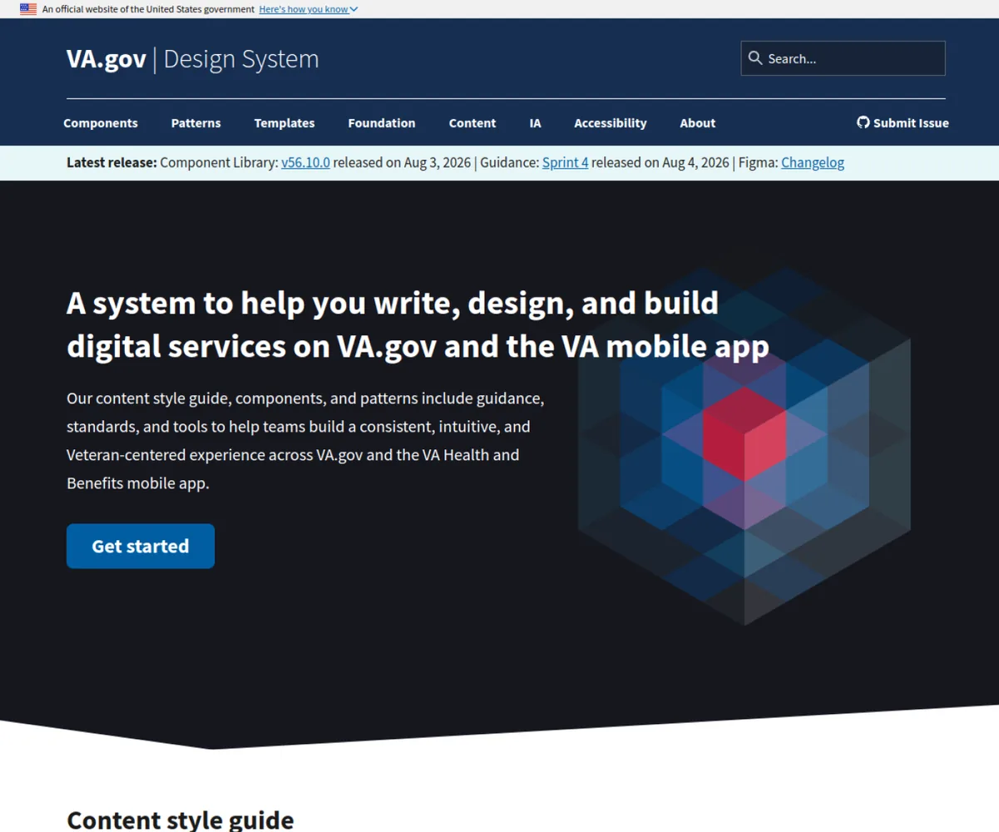</a> | [VA.gov Design System](references/47-va-gov-design-system/README.md) · [official product](https://design.va.gov/) | owner-published media, 1 named gaps | Government / healthcare | sidebar-content: Leading navigation or collection list beside a dominant content area. Panels: toolbar/header (top); navigation/list sidebar (leading); data table/list (center). Density: low; confidence: medium. | Study the process-list and form patterns for benefits applications, including crisis content, error handling, accessibility annotations, and component maturity status. |
| 48 | <a href="https://designsystem.webstandards.ca.gov/">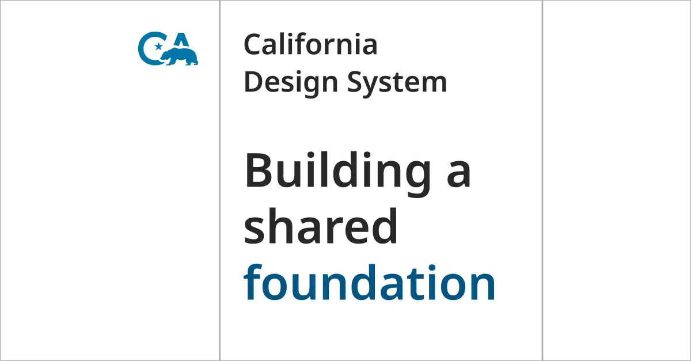</a> | [California Design System](references/48-california-design-system/README.md) · [official product](https://designsystem.webstandards.ca.gov/) | owner-published media, 1 named gaps | Government | sidebar-content-inspector: Leading navigation, central work area, and trailing detail inspector. Panels: toolbar/header (top); status/action bar (bottom); navigation/list sidebar (leading); detail/inspector (trailing); primary canvas/content (center). Density: low; confidence: medium. | Study the statewide header, page-navigation, and content patterns, with attention to responsive behavior, accessibility checks, and repository-based contribution. |
| 49 | <a href="https://developer.gnome.org/hig/">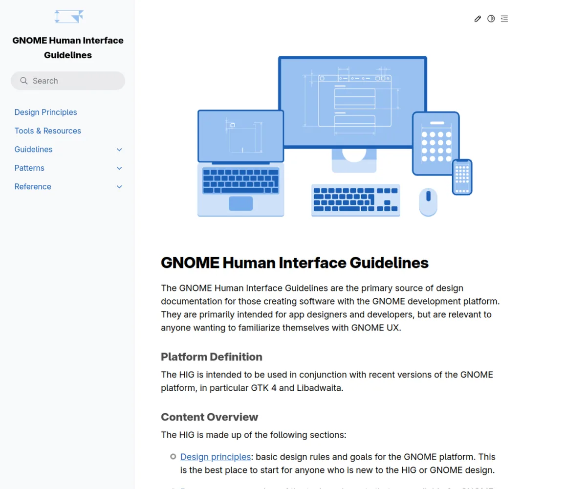</a> | [GNOME Human Interface Guidelines](references/49-gnome-human-interface-guidelines/README.md) · [official product](https://developer.gnome.org/hig/) | owner-published media, 1 named gaps | Platform HIG / open source | sidebar-content-inspector: Leading navigation, central work area, and trailing detail inspector. Panels: toolbar/header (top); status/action bar (bottom); navigation/list sidebar (leading); detail/inspector (trailing); primary canvas/content (center). Density: low; confidence: medium. | Study the adaptive application-window patterns, including header bars, navigation views, dialogs, keyboard access, content structure, and platform conventions. |
| 50 | <a href="https://develop.kde.org/hig/">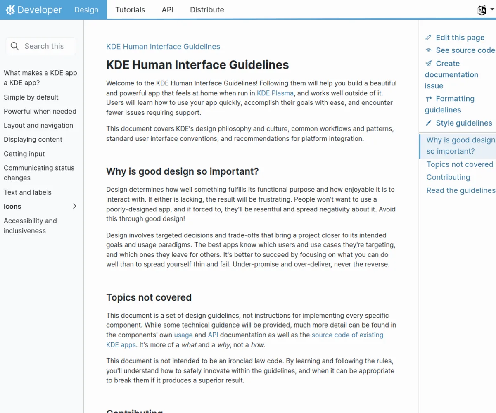</a> | [KDE Human Interface Guidelines](references/50-kde-human-interface-guidelines/README.md) · [official product](https://develop.kde.org/hig/) | owner-published media, 1 named gaps | Platform HIG / open source | sidebar-content-inspector: Leading navigation, central work area, and trailing detail inspector. Panels: toolbar/header (top); navigation/list sidebar (leading); detail/inspector (trailing); primary canvas/content (center). Density: medium; confidence: medium. | Study the desktop command and settings patterns, including toolbar actions, menus, keyboard shortcuts, dialog structure, accessibility, and contribution conventions. |

Normalized panel bounds, detected separators, image dimensions, source-image URLs, hashes, and analysis confidence are recorded in [`sources.json`](sources.json). Media kinds, measured durations, provenance classes, and per-record gaps are in [`references.json`](references.json).

Attribution and product ownership remain with the linked source.
