# Desktop app examples

Cross-platform desktop software across Electron, Qt, GTK, and native toolkits.

Each entry pairs an attributed overview image and a measured panel anatomy with a per-product record: motion evidence, named states, an observed first-success journey, interaction and recovery behavior, accessibility observations, and provenance. Every number below is measured by `verify-reference-evidence.py`, and a record that is missing evidence says so in its own `evidence_gaps`.

**Examples:** 50  
**Images:** 50  
**Structural analyses:** 50  
**Records with no remaining gap:** 0  
**Records with named gaps:** 50 (99 gaps)  
**Motion provenance:** 46 browser driven here, 4 owner-published media  
**Curated:** 2026-08-16  
**Visual source data:** [`sources.json`](sources.json)  
**Record index:** [`references.json`](references.json)  
**Cross-example synthesis:** [`full-reference.md`](full-reference.md)

| # | Reference image | Record | Motion evidence | Category | Interface structure | What to study |
|---:|---|---|---|---|---|---|
| 1 |  | [Visual Studio Code](references/01-visual-studio-code/README.md) · [official product](https://code.visualstudio.com/) | browser driven here, 2 named gaps | Electron — code editor | sidebar-content-inspector: Leading navigation, central work area, and trailing detail inspector. Panels: toolbar/header (top); status/action bar (bottom); navigation/list sidebar (leading); detail/inspector (trailing); primary canvas/content (center). Density: medium; confidence: medium. | Study the command palette, shortcut-driven navigation, split editor groups, dockable panels, and workspace handling for dense project work. |
| 2 |  | [Slack](references/02-slack/README.md) · [official product](https://slack.com/downloads/) | browser driven here, 2 named gaps | Electron — team communication | sidebar-content-inspector: Leading navigation, central work area, and trailing detail inspector. Panels: toolbar/header (top); status/action bar (bottom); navigation/list sidebar (leading); detail/inspector (trailing); primary canvas/content (center). Density: low; confidence: medium. | Study multi-workspace switching, keyboard traversal between channels, threaded side panes, notification state, and pop-out conversation windows. |
| 3 | <a href="https://discord.com/download">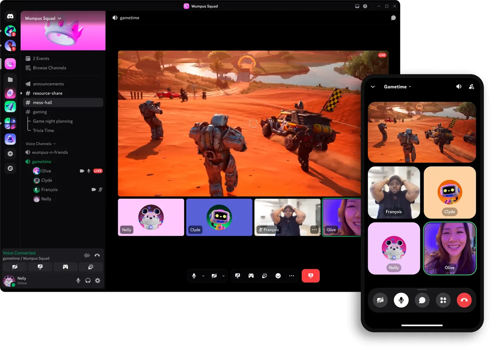</a> | [Discord](references/03-discord/README.md) · [official product](https://discord.com/download) | browser driven here, 2 named gaps | Electron — community communication | sidebar-content-inspector: Leading navigation, central work area, and trailing detail inspector. Panels: toolbar/header (top); status/action bar (bottom); navigation/list sidebar (leading); detail/inspector (trailing); data table/list (center). Density: low; confidence: medium. | Study the persistent server-channel-member column hierarchy, compact unread indicators, global shortcuts, and detachable media or stream views. |
| 4 |  | [Obsidian](references/04-obsidian/README.md) · [official product](https://obsidian.md/) | browser driven here, 2 named gaps | Electron — local knowledge management | sidebar-content-inspector: Leading navigation, central work area, and trailing detail inspector. Panels: toolbar/header (top); navigation/list sidebar (leading); detail/inspector (trailing); primary canvas/content (center). Density: low; confidence: medium. | Study local-folder vaults, linked-note navigation, split panes, tab groups, command-palette operation, and user-configurable sidebars. |
| 5 | <a href="https://signal.org/download/">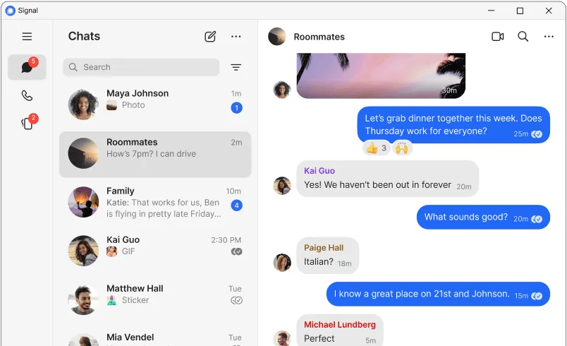</a> | [Signal Desktop](references/05-signal-desktop/README.md) · [official product](https://signal.org/download/) | browser driven here, 2 named gaps | Electron — secure messaging | sidebar-content-inspector: Leading navigation, central work area, and trailing detail inspector. Panels: toolbar/header (top); status/action bar (bottom); navigation/list sidebar (leading); detail/inspector (trailing); data table/list (center). Density: low; confidence: medium. | Study the restrained conversation-list layout, attachment handling from local files, keyboard message navigation, and desktop notification integration. |
| 6 | <a href="https://joplinapp.org/">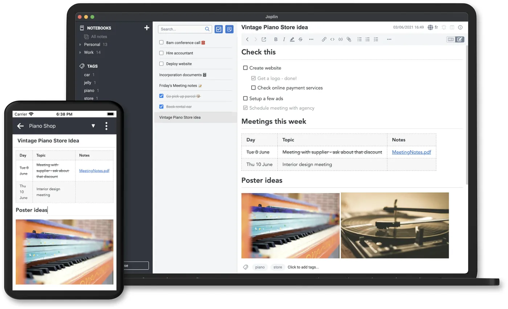</a> | [Joplin](references/06-joplin/README.md) · [official product](https://joplinapp.org/) | browser driven here, 2 named gaps | Electron — notes and local files | sidebar-content-inspector: Leading navigation, central work area, and trailing detail inspector. Panels: toolbar/header (top); status/action bar (bottom); navigation/list sidebar (leading); detail/inspector (trailing); primary canvas/content (center). Density: low; confidence: medium. | Study the notebook-note-editor three-pane model, Markdown source and preview modes, local resource attachments, and shortcut customization. |
| 7 |  | [Bitwarden](references/07-bitwarden/README.md) · [official product](https://bitwarden.com/download/) | browser driven here, 2 named gaps | Electron — credential management | sidebar-content: Leading navigation or collection list beside a dominant content area. Panels: toolbar/header (top); navigation/list sidebar (leading); data table/list (center). Density: low; confidence: high. | Study dense vault-item tables, collection and folder filters, secure reveal and copy actions, keyboard search, and timed state changes. |
| 8 |  | [Element](references/08-element/README.md) · [official product](https://element.io/download) | browser driven here, 2 named gaps | Electron — federated communication | sidebar-content-inspector: Leading navigation, central work area, and trailing detail inspector. Panels: toolbar/header (top); navigation/list sidebar (leading); detail/inspector (trailing); data table/list (center). Density: low; confidence: medium. | Study room-list organization across spaces, threaded conversations, search overlays, composer actions, and multi-account information hierarchy. |
| 9 | <a href="https://zulip.com/apps/">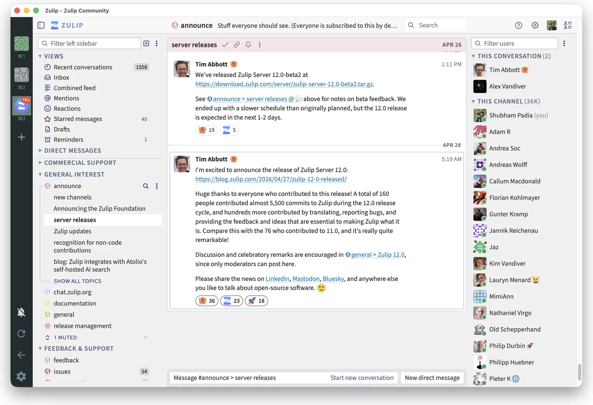</a> | [Zulip](references/09-zulip/README.md) · [official product](https://zulip.com/apps/) | browser driven here, 2 named gaps | Electron — threaded communication | sidebar-content-inspector: Leading navigation, central work area, and trailing detail inspector. Panels: toolbar/header (top); status/action bar (bottom); navigation/list sidebar (leading); detail/inspector (trailing); data table/list (center). Density: medium; confidence: medium. | Study two-dimensional stream-and-topic navigation, narrow unread views, keyboard-first message movement, and multiple independent conversation windows. |
| 10 | <a href="https://mattermost.com/apps/">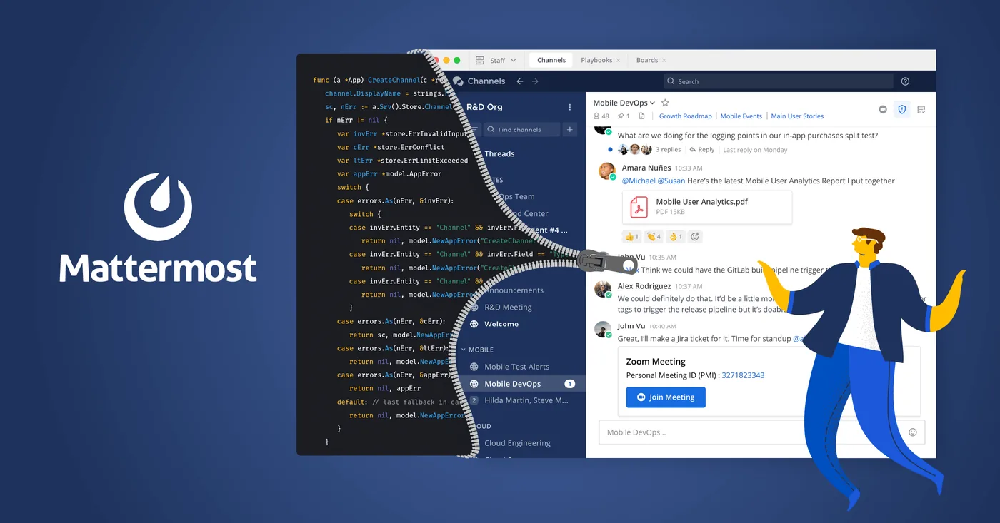</a> | [Mattermost Desktop](references/10-mattermost-desktop/README.md) · [official product](https://mattermost.com/apps/) | browser driven here, 2 named gaps | Electron — team communication | sidebar-content-inspector: Leading navigation, central work area, and trailing detail inspector. Panels: toolbar/header (top); status/action bar (bottom); navigation/list sidebar (leading); detail/inspector (trailing); data table/list (center). Density: low; confidence: medium. | Study team and channel switching, compact message timelines, keyboard shortcuts, unread-state markers, and desktop window or notification controls. |
| 11 | <a href="https://insomnia.rest/download">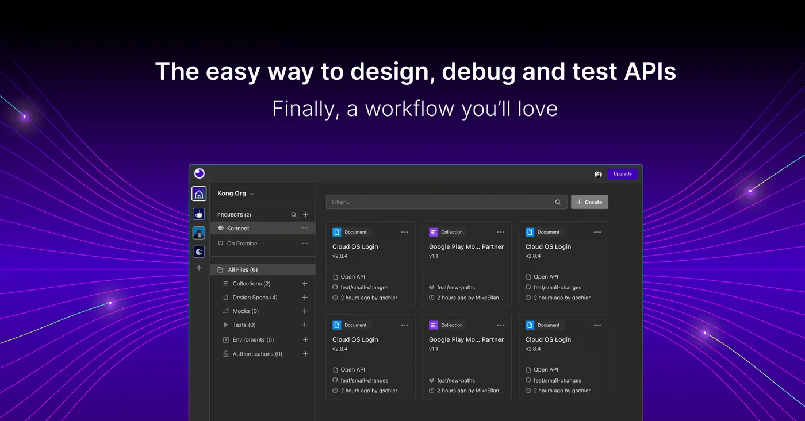</a> | [Insomnia](references/11-insomnia/README.md) · [official product](https://insomnia.rest/download) | browser driven here, 2 named gaps | Electron — API client | sidebar-content-inspector: Leading navigation, central work area, and trailing detail inspector. Panels: toolbar/header (top); status/action bar (bottom); navigation/list sidebar (leading); detail/inspector (trailing); primary canvas/content (center). Density: low; confidence: medium. | Study hierarchical request collections, tabbed request editing, environment-variable controls, resizable response panes, and import or export workflows. |
| 12 | <a href="https://www.postman.com/downloads/">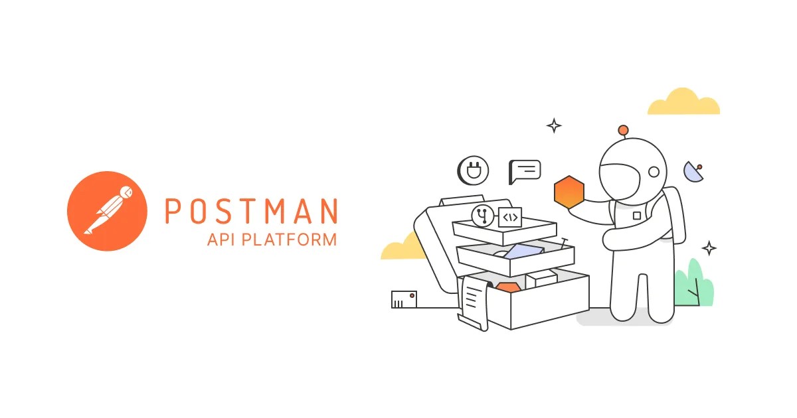</a> | [Postman](references/12-postman/README.md) · [official product](https://www.postman.com/downloads/) | browser driven here, 2 named gaps | Electron — API platform | sidebar-content-inspector: Leading navigation, central work area, and trailing detail inspector. Panels: toolbar/header (top); navigation/list sidebar (leading); detail/inspector (trailing); primary canvas/content (center). Density: low; confidence: medium. | Study collection trees, dense tab strips, request-builder sections, synchronized local workspaces, keyboard search, and detachable runner workflows. |
| 13 | <a href="https://github.com/jgraph/drawio-desktop">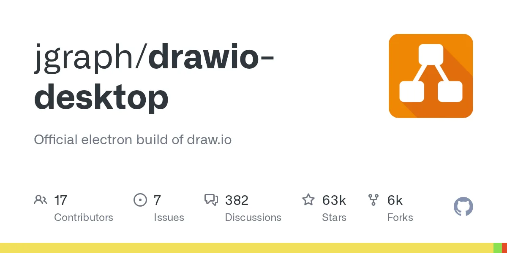</a> | [diagrams.net Desktop](references/13-diagrams-net-desktop/README.md) · [official product](https://github.com/jgraph/drawio-desktop) | browser driven here, 2 named gaps | Electron — diagram editor | sidebar-content-inspector: Leading navigation, central work area, and trailing detail inspector. Panels: toolbar/header (top); status/action bar (bottom); navigation/list sidebar (leading); detail/inspector (trailing); primary canvas/content (center). Density: low; confidence: medium. | Study local-file opening and saving, multi-page documents, inspector panels, zoom controls, canvas shortcuts, and native desktop menu adaptation. |
| 14 | <a href="https://logseq.com/">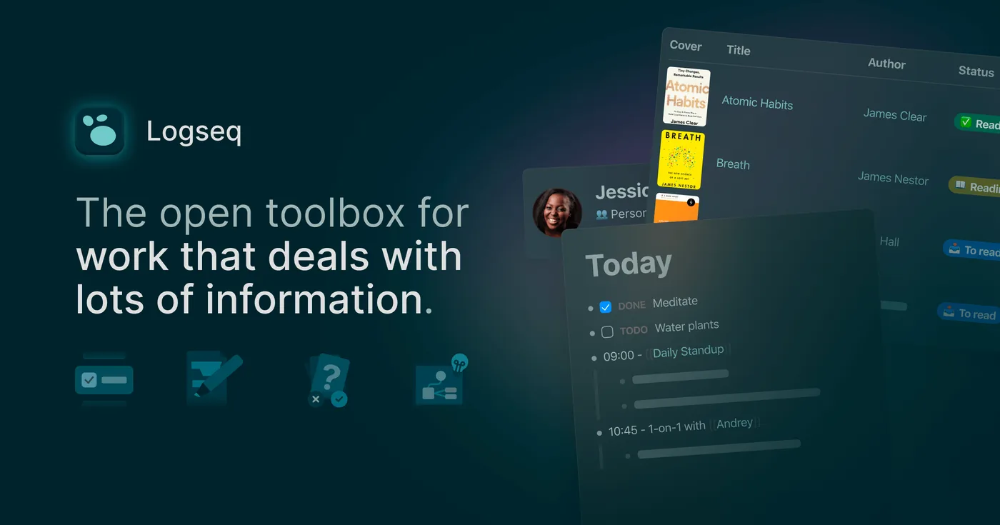</a> | [Logseq](references/14-logseq/README.md) · [official product](https://logseq.com/) | browser driven here, 2 named gaps | Electron — local knowledge management | sidebar-content-inspector: Leading navigation, central work area, and trailing detail inspector. Panels: toolbar/header (top); navigation/list sidebar (leading); detail/inspector (trailing); primary canvas/content (center). Density: low; confidence: medium. | Study block-based keyboard editing, backlinks, page references, local graph folders, right-sidebar pinning, and command-driven content insertion. |
| 15 |  | [Standard Notes](references/15-standard-notes/README.md) · [official product](https://standardnotes.com/download) | browser driven here, 2 named gaps | Electron — secure notes | sidebar-content-inspector: Leading navigation, central work area, and trailing detail inspector. Panels: toolbar/header (top); navigation/list sidebar (leading); detail/inspector (trailing); data table/list (center). Density: low; confidence: medium. | Study compact note lists, tag filtering, focus-oriented editing, offline local state, keyboard shortcuts, and cross-platform window consistency. |
| 16 | <a href="https://www.beekeeperstudio.io/">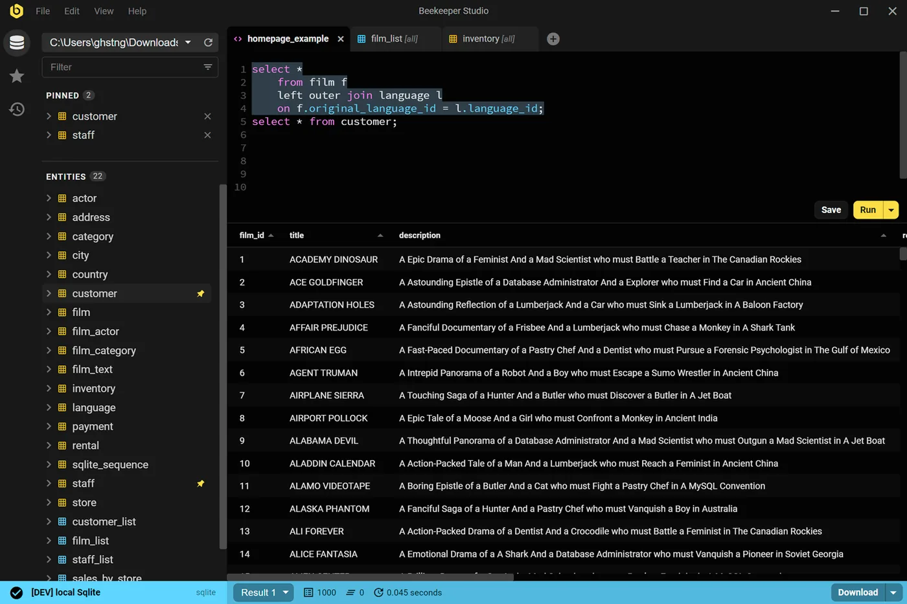</a> | [Beekeeper Studio](references/16-beekeeper-studio/README.md) · [official product](https://www.beekeeperstudio.io/) | owner-published media, 1 named gaps | Electron — database client | sidebar-content: Leading navigation or collection list beside a dominant content area. Panels: toolbar/header (top); status/action bar (bottom); navigation/list sidebar (leading); data table/list (center). Density: medium; confidence: high. | Study connection management, schema trees, query tabs, editable result grids, local SQL files, and shortcut-based execution in a dense workspace. |
| 17 |  | [MongoDB Compass](references/17-mongodb-compass/README.md) · [official product](https://www.mongodb.com/products/tools/compass) | browser driven here, 2 named gaps | Electron — database client | sidebar-content-inspector: Leading navigation, central work area, and trailing detail inspector. Panels: toolbar/header (top); navigation/list sidebar (leading); detail/inspector (trailing); data table/list (center). Density: low; confidence: high. | Study database and collection navigation, query controls, document tables, schema visualizations, nested inspectors, and multi-tab data exploration. |
| 18 | <a href="https://podman-desktop.io/">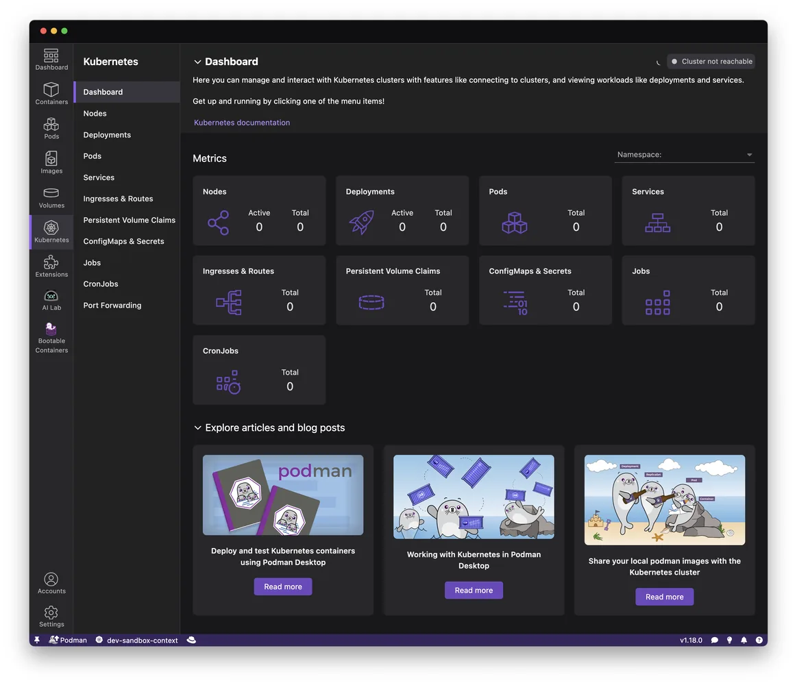</a> | [Podman Desktop](references/18-podman-desktop/README.md) · [official product](https://podman-desktop.io/) | browser driven here, 2 named gaps | Electron — container management | sidebar-content: Leading navigation or collection list beside a dominant content area. Panels: toolbar/header (top); status/action bar (bottom); navigation/list sidebar (leading); data table/list (center). Density: low; confidence: high. | Study dashboard-to-detail navigation, dense container tables, status and log views, contextual actions, and integrated terminal-style operational workflows. |
| 19 | <a href="https://www.spacedrive.com/">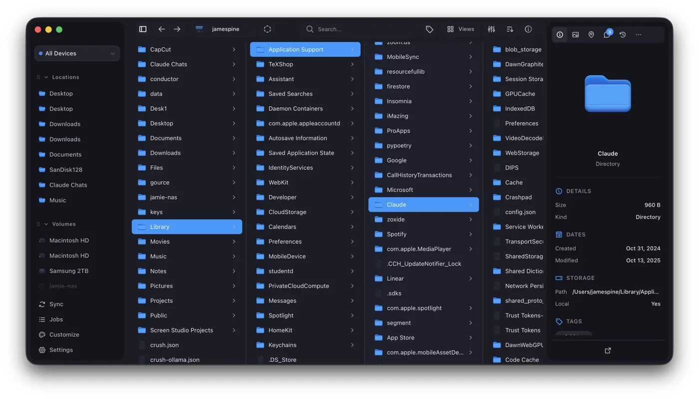</a> | [Spacedrive](references/19-spacedrive/README.md) · [official product](https://www.spacedrive.com/) | browser driven here, 2 named gaps | Tauri — file manager | sidebar-content-inspector: Leading navigation, central work area, and trailing detail inspector. Panels: toolbar/header (top); status/action bar (bottom); navigation/list sidebar (leading); detail/inspector (trailing); data table/list (center). Density: low; confidence: medium. | Study location-based file browsing, thumbnail and list modes, inspector metadata, keyboard selection, and unified handling of multiple local libraries. |
| 20 | <a href="https://yaak.app/">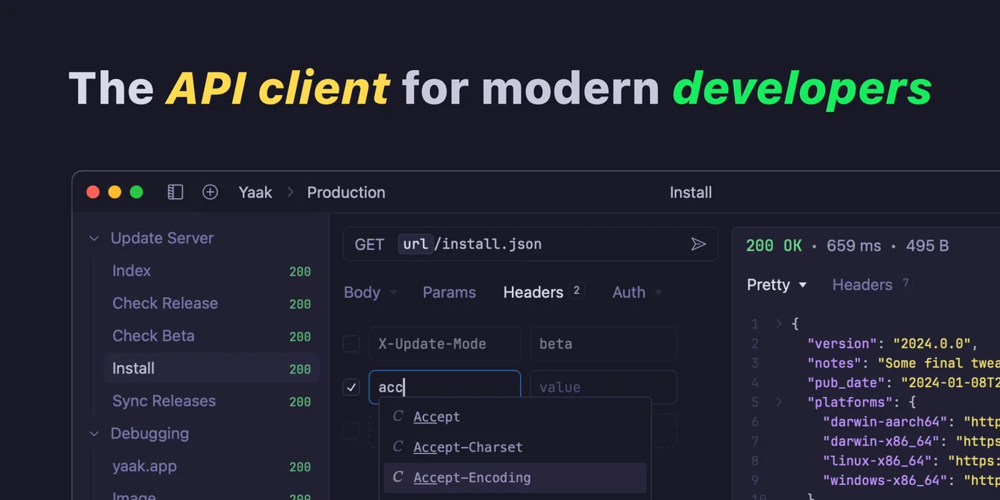</a> | [Yaak](references/20-yaak/README.md) · [official product](https://yaak.app/) | owner-published media, 2 named gaps | Tauri — API client | sidebar-content-inspector: Leading navigation, central work area, and trailing detail inspector. Panels: toolbar/header (top); navigation/list sidebar (leading); detail/inspector (trailing); primary canvas/content (center). Density: low; confidence: medium. | Study a compact request sidebar, tabbed editors, environment switching, keyboard-triggered requests, response inspection, and local workspace organization. |
| 21 |  | [GitButler](references/21-gitbutler/README.md) · [official product](https://gitbutler.com/) | browser driven here, 2 named gaps | Tauri — Git client | sidebar-content-inspector: Leading navigation, central work area, and trailing detail inspector. Panels: toolbar/header (top); navigation/list sidebar (leading); detail/inspector (trailing); primary canvas/content (center). Density: medium; confidence: medium. | Study visual branch lanes, commit and change grouping, drag-oriented branch operations, keyboard navigation, and repository state communicated without a terminal. |
| 22 |  | [AppFlowy](references/22-appflowy/README.md) · [official product](https://github.com/AppFlowy-IO/AppFlowy) | owner-published media, 2 named gaps | Flutter — collaborative workspace | sidebar-content: Leading navigation or collection list beside a dominant content area. Panels: toolbar/header (top); navigation/list sidebar (leading); primary canvas/content (center). Density: low; confidence: high. | Study block editing, nested page navigation, database-style views, keyboard commands, local-first workspace structure, and responsive desktop sidebars. |
| 23 | <a href="https://github.com/rustdesk/rustdesk">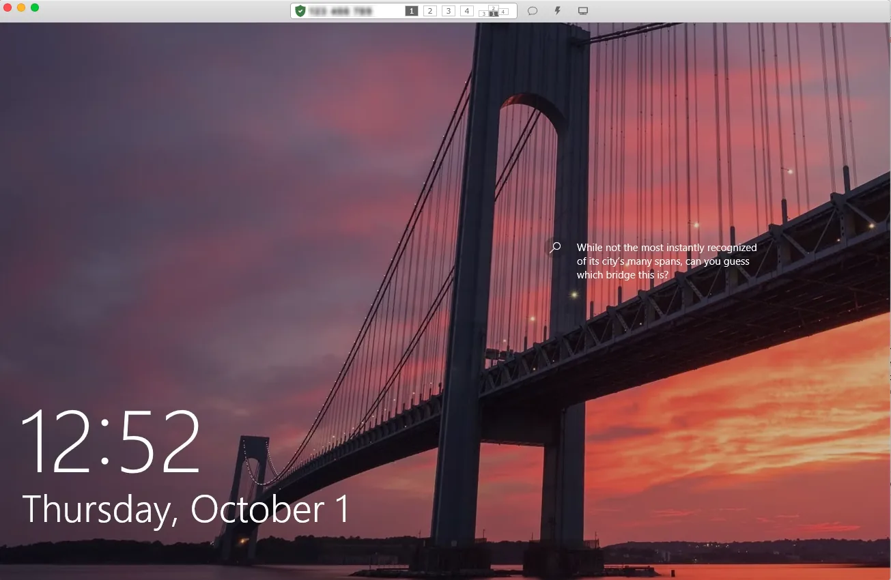</a> | [RustDesk](references/23-rustdesk/README.md) · [official product](https://github.com/rustdesk/rustdesk) | browser driven here, 2 named gaps | Flutter — remote desktop | content-inspector: Dominant content area with a trailing detail or property inspector. Panels: toolbar/header (top); status/action bar (bottom); detail/inspector (trailing); primary canvas/content (center). Density: low; confidence: medium. | Study connection history, remote-session toolbars, clipboard and file-transfer controls, multi-display switching, and adaptation around the remote canvas. |
| 24 | <a href="https://github.com/localsend/localsend">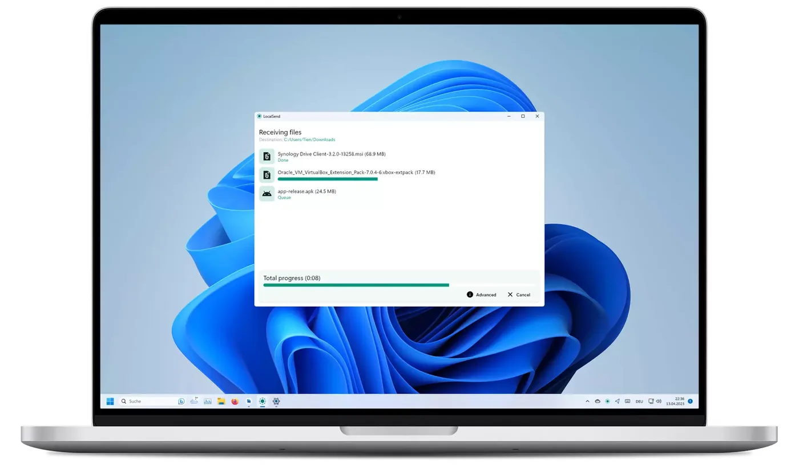</a> | [LocalSend](references/24-localsend/README.md) · [official product](https://github.com/localsend/localsend) | browser driven here, 2 named gaps | Flutter — local file transfer | sidebar-content-inspector: Leading navigation, central work area, and trailing detail inspector. Panels: toolbar/header (top); status/action bar (bottom); navigation/list sidebar (leading); detail/inspector (trailing); primary canvas/content (center). Density: low; confidence: medium. | Study nearby-device discovery, drag-and-drop file selection, transfer progress, acceptance states, and consistent platform-specific sharing permissions. |
| 25 |  | [FluffyChat](references/25-fluffychat/README.md) · [official product](https://github.com/krille-chan/fluffychat) | browser driven here, 2 named gaps | Flutter — federated messaging | sidebar-content-inspector: Leading navigation, central work area, and trailing detail inspector. Panels: toolbar/header (top); status/action bar (bottom); navigation/list sidebar (leading); detail/inspector (trailing); data table/list (center). Density: low; confidence: medium. | Study adaptive room lists, chat-detail panes, attachment picking from local files, account switching, and desktop keyboard interaction. |
| 26 | <a href="https://github.com/saber-notes/saber">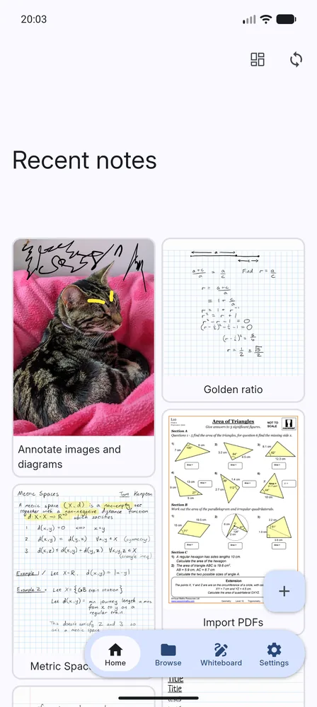</a> | [Saber](references/26-saber/README.md) · [official product](https://github.com/saber-notes/saber) | browser driven here, 2 named gaps | Flutter — handwritten notes | sidebar-content: Leading navigation or collection list beside a dominant content area. Panels: toolbar/header (top); status/action bar (bottom); navigation/list sidebar (leading); primary canvas/content (center). Density: low; confidence: medium. | Study notebook and page organization, pen-toolbar density, canvas zoom and pan, local document handling, and mixed pointer or touch input. |
| 27 | <a href="https://www.videolan.org/vlc/">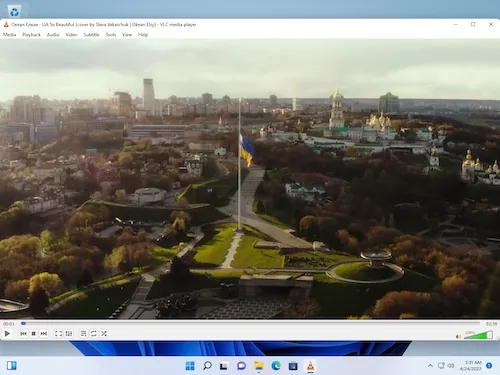</a> | [VLC media player](references/27-vlc-media-player/README.md) · [official product](https://www.videolan.org/vlc/) | browser driven here, 2 named gaps | Qt — media player | sidebar-content-inspector: Leading navigation, central work area, and trailing detail inspector. Panels: toolbar/header (top); status/action bar (bottom); navigation/list sidebar (leading); detail/inspector (trailing); data table/list (center). Density: low; confidence: medium. | Study compact playback controls, playlist and media-library views, advanced dialogs, drag-and-drop local files, and platform-specific menu behavior. |
| 28 | <a href="https://www.wireshark.org/">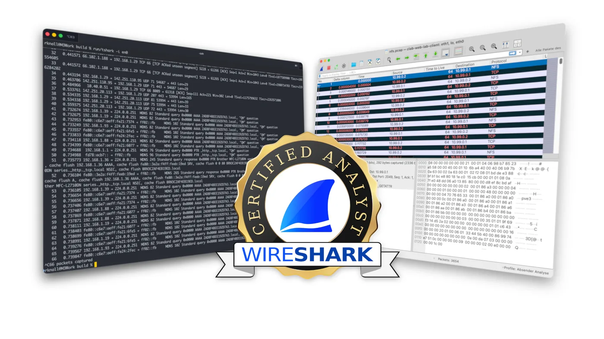</a> | [Wireshark](references/28-wireshark/README.md) · [official product](https://www.wireshark.org/) | browser driven here, 2 named gaps | Qt — network analysis | sidebar-content: Leading navigation or collection list beside a dominant content area. Panels: toolbar/header (top); status/action bar (bottom); navigation/list sidebar (leading); data table/list (center). Density: medium; confidence: medium. | Study the packet-list, protocol-tree, and byte-view triad, display-filter entry, color coding, resizable panes, and keyboard traversal of dense data. |
| 29 | <a href="https://www.qbittorrent.org/">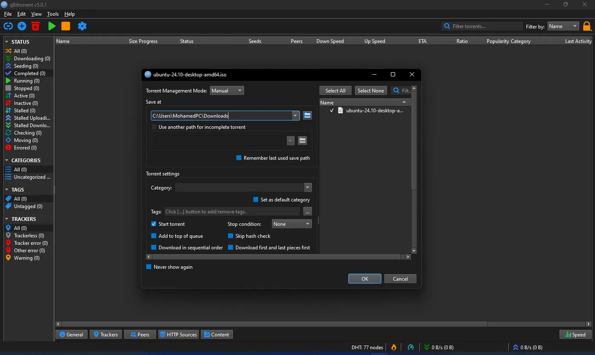</a> | [qBittorrent](references/29-qbittorrent/README.md) · [official product](https://www.qbittorrent.org/) | browser driven here, 2 named gaps | Qt — transfer manager | sidebar-content-inspector: Leading navigation, central work area, and trailing detail inspector. Panels: toolbar/header (top); status/action bar (bottom); navigation/list sidebar (leading); detail/inspector (trailing); data table/list (center). Density: low; confidence: medium. | Study high-density transfer tables, category and tracker filters, sortable columns, detail tabs, global speed controls, and batch selection actions. |
| 30 | <a href="https://krita.org/">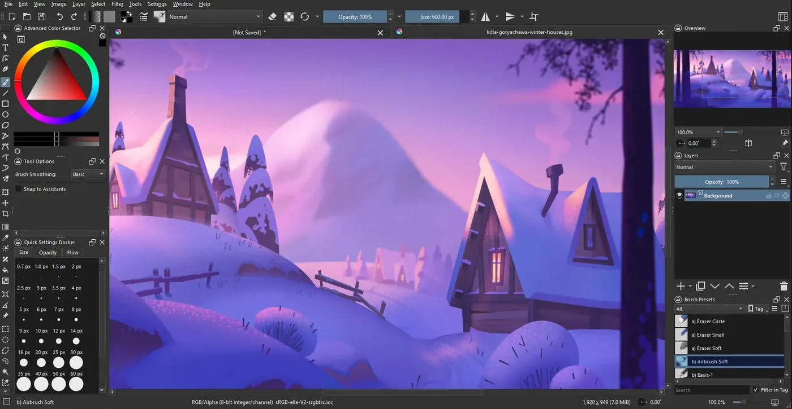</a> | [Krita](references/30-krita/README.md) · [official product](https://krita.org/) | browser driven here, 2 named gaps | Qt — digital painting | sidebar-content-inspector: Leading navigation, central work area, and trailing detail inspector. Panels: toolbar/header (top); status/action bar (bottom); navigation/list sidebar (leading); detail/inspector (trailing); primary canvas/content (center). Density: low; confidence: medium. | Study dockable tools, canvas-only mode, shortcut-heavy brush operation, multi-document tabs, local-file workflows, and workspace presets. |
| 31 | <a href="https://kdenlive.org/">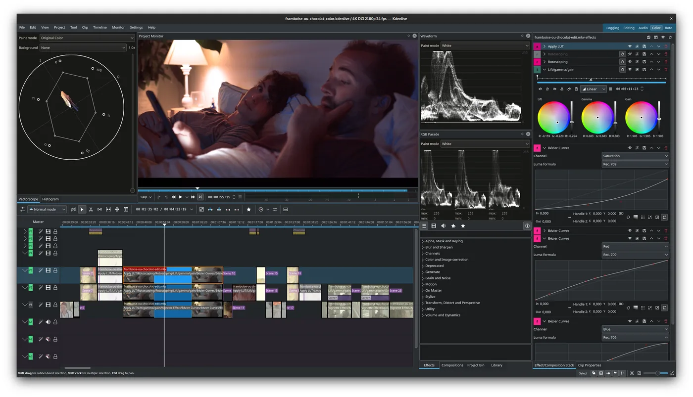</a> | [Kdenlive](references/31-kdenlive/README.md) · [official product](https://kdenlive.org/) | browser driven here, 2 named gaps | Qt — video editor | sidebar-content-inspector: Leading navigation, central work area, and trailing detail inspector. Panels: toolbar/header (top); navigation/list sidebar (leading); detail/inspector (trailing); data table/list (center). Density: low; confidence: medium. | Study multi-track timelines, bin and monitor coordination, dockable effects panels, keyboard trimming, proxy-state indicators, and customizable workspaces. |
| 32 | <a href="https://www.scribus.net/">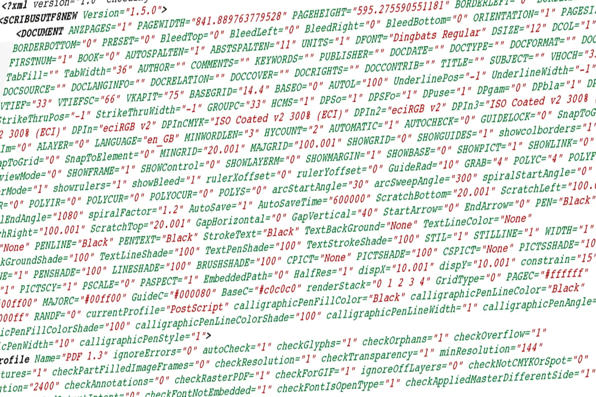</a> | [Scribus](references/32-scribus/README.md) · [official product](https://www.scribus.net/) | browser driven here, 2 named gaps | Qt — desktop publishing | sidebar-content: Leading navigation or collection list beside a dominant content area. Panels: toolbar/header (top); status/action bar (bottom); navigation/list sidebar (leading); primary canvas/content (center). Density: high; confidence: high. | Study multi-page document navigation, floating and docked property palettes, precise numeric controls, local asset linking, and print-oriented dialogs. |
| 33 | <a href="https://musescore.org/">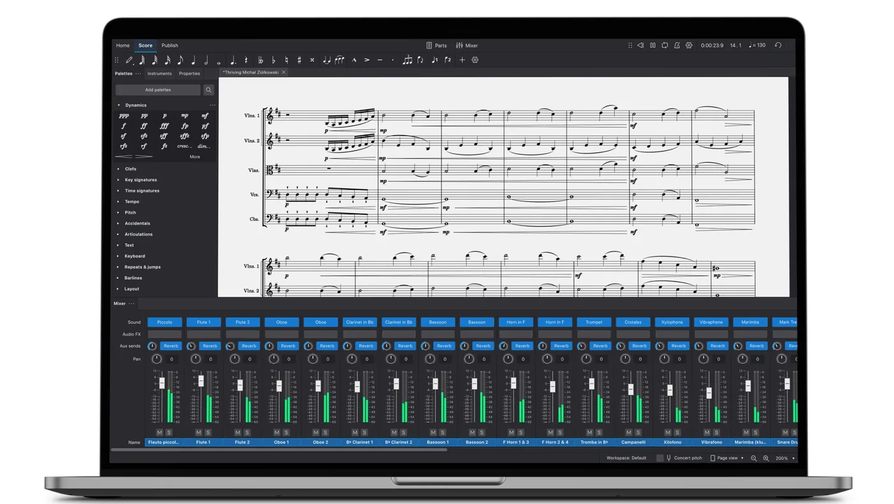</a> | [MuseScore Studio](references/33-musescore-studio/README.md) · [official product](https://musescore.org/) | browser driven here, 2 named gaps | Qt — music notation | sidebar-content-inspector: Leading navigation, central work area, and trailing detail inspector. Panels: toolbar/header (top); navigation/list sidebar (leading); detail/inspector (trailing); primary canvas/content (center). Density: low; confidence: medium. | Study palette-driven symbol entry, keyboard note input, page and continuous views, mixer windows, and dense inspector controls around a score. |
| 34 | <a href="https://www.freecad.org/">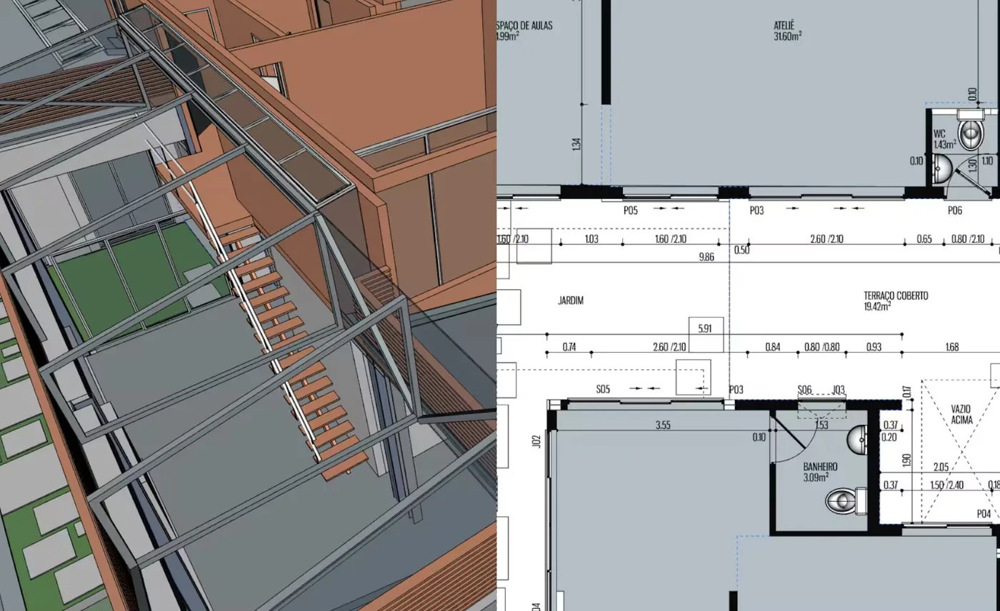</a> | [FreeCAD](references/34-freecad/README.md) · [official product](https://www.freecad.org/) | browser driven here, 2 named gaps | Qt — CAD | sidebar-content-inspector: Leading navigation, central work area, and trailing detail inspector. Panels: toolbar/header (top); navigation/list sidebar (leading); detail/inspector (trailing); data table/list (center). Density: medium; confidence: medium. | Study workbench switching, model trees, property grids, multiple document views, keyboard-accessible commands, and persistent geometric selection state. |
| 35 | <a href="https://qgis.org/">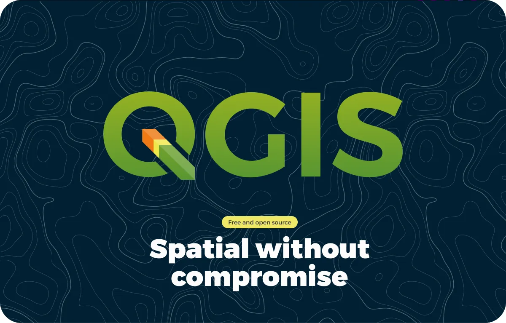</a> | [QGIS](references/35-qgis/README.md) · [official product](https://qgis.org/) | browser driven here, 2 named gaps | Qt — geographic information system | sidebar-content-inspector: Leading navigation, central work area, and trailing detail inspector. Panels: toolbar/header (top); status/action bar (bottom); navigation/list sidebar (leading); detail/inspector (trailing); data table/list (center). Density: low; confidence: medium. | Study layer trees, map canvas interaction, attribute tables, dockable processing tools, multi-map projects, and local geospatial file management. |
| 36 | <a href="https://calibre-ebook.com/">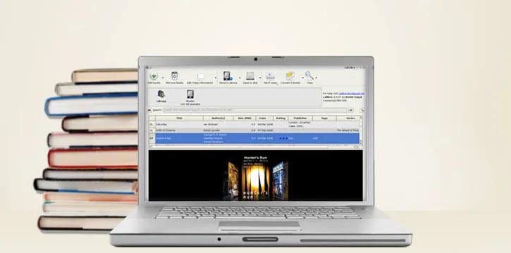</a> | [calibre](references/36-calibre/README.md) · [official product](https://calibre-ebook.com/) | owner-published media, 2 named gaps | Qt — ebook library | sidebar-content-inspector: Leading navigation, central work area, and trailing detail inspector. Panels: toolbar/header (top); status/action bar (bottom); navigation/list sidebar (leading); detail/inspector (trailing); data table/list (center). Density: low; confidence: medium. | Study metadata-rich library tables, cover and detail panes, format conversion dialogs, device views, saved searches, and local collection management. |
| 37 | <a href="https://www.shotcut.org/">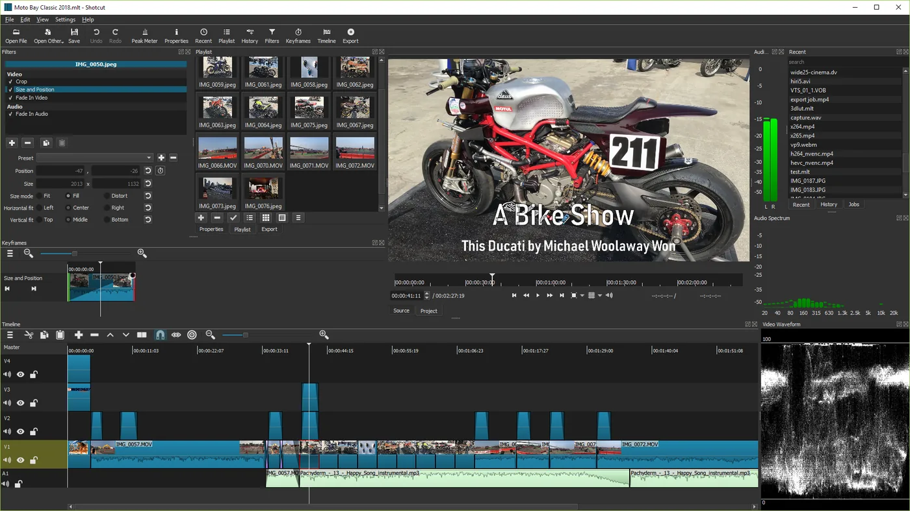</a> | [Shotcut](references/37-shotcut/README.md) · [official product](https://www.shotcut.org/) | browser driven here, 2 named gaps | Qt — video editor | sidebar-content-inspector: Leading navigation, central work area, and trailing detail inspector. Panels: toolbar/header (top); status/action bar (bottom); navigation/list sidebar (leading); detail/inspector (trailing); data table/list (center). Density: medium; confidence: medium. | Study panel-based media editing, source and project monitors, playlist-to-timeline flow, keyboard trimming, local media relinking, and layout presets. |
| 38 | <a href="https://obsproject.com/">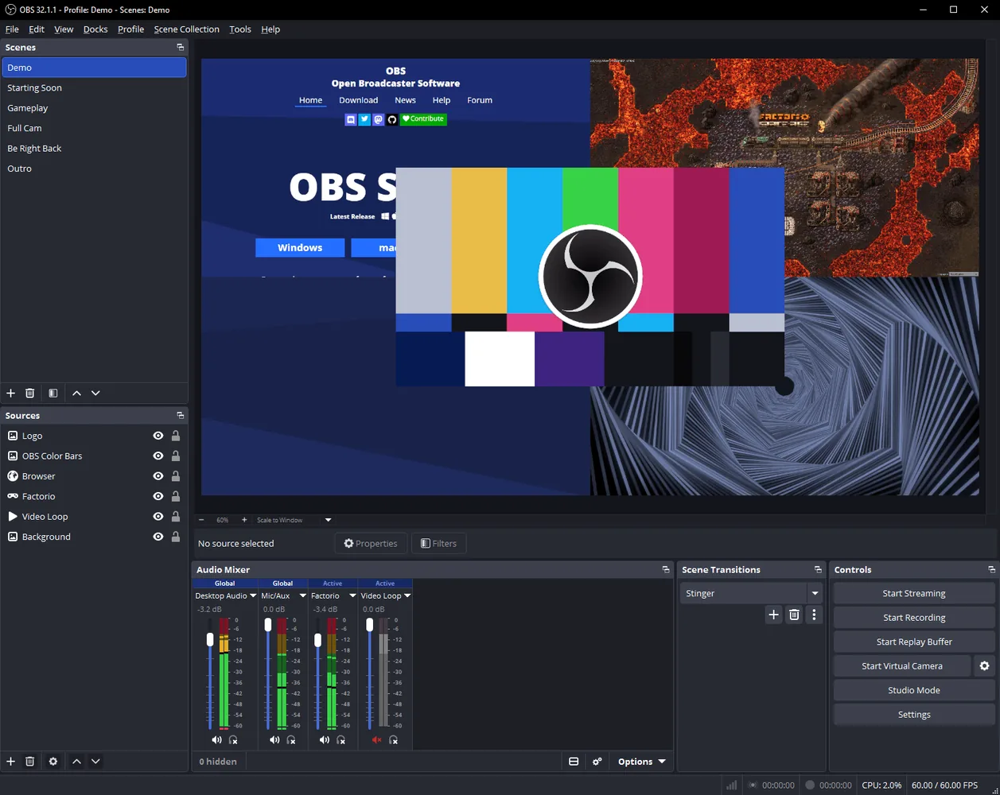</a> | [OBS Studio](references/38-obs-studio/README.md) · [official product](https://obsproject.com/) | browser driven here, 2 named gaps | Qt — recording and streaming | sidebar-content-inspector: Leading navigation, central work area, and trailing detail inspector. Panels: toolbar/header (top); navigation/list sidebar (leading); detail/inspector (trailing); data table/list (center). Density: low; confidence: medium. | Study scene and source lists, audio meters, dockable control panels, studio-mode dual previews, hotkeys, and multi-window monitoring. |
| 39 |  | [KeePassXC](references/39-keepassxc/README.md) · [official product](https://keepassxc.org/) | browser driven here, 2 named gaps | Qt — credential management | content-inspector: Dominant content area with a trailing detail or property inspector. Panels: toolbar/header (top); detail/inspector (trailing); primary canvas/content (center). Density: low; confidence: medium. | Study local encrypted database files, group and entry trees, search, secure copy and reveal actions, auto-type shortcuts, and lock-state feedback. |
| 40 | <a href="https://www.blender.org/">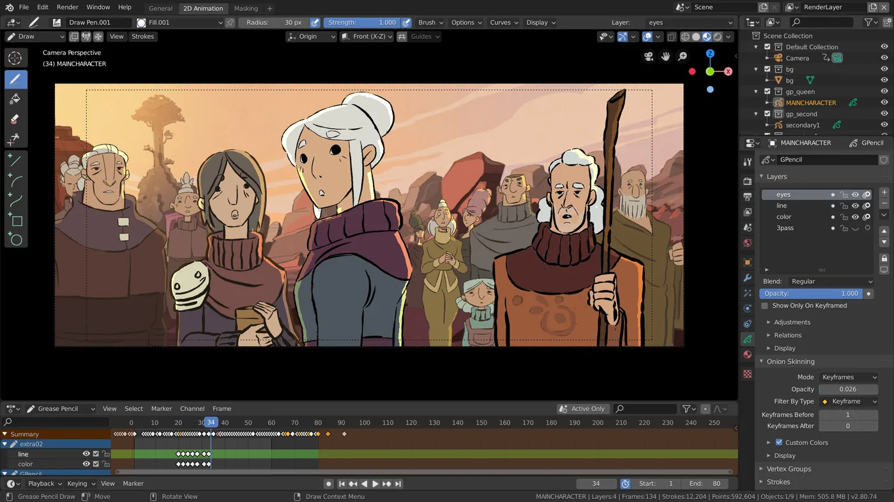</a> | [Blender](references/40-blender/README.md) · [official product](https://www.blender.org/) | browser driven here, 2 named gaps | Native multi-platform — 3D creation | sidebar-content-inspector: Leading navigation, central work area, and trailing detail inspector. Panels: toolbar/header (top); status/action bar (bottom); navigation/list sidebar (leading); detail/inspector (trailing); primary canvas/content (center). Density: medium; confidence: medium. | Study fully reconfigurable editor areas, mode-dependent shortcuts, multiple windows, dense property panels, local project assets, and workspace tabs. |
| 41 | <a href="https://www.audacityteam.org/">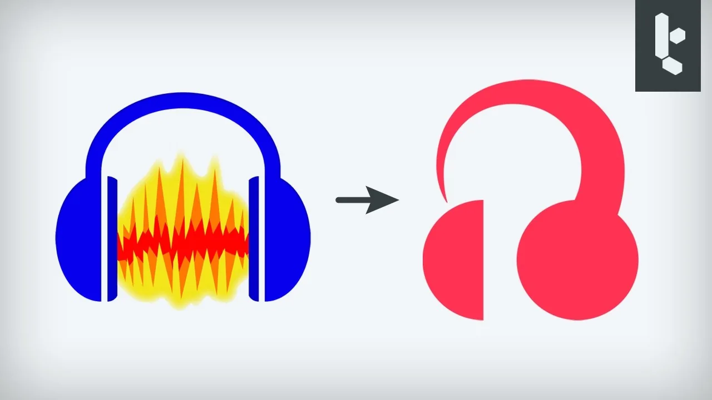</a> | [Audacity](references/41-audacity/README.md) · [official product](https://www.audacityteam.org/) | browser driven here, 2 named gaps | Native multi-platform — audio editor | sidebar-content-inspector: Leading navigation, central work area, and trailing detail inspector. Panels: toolbar/header (top); navigation/list sidebar (leading); detail/inspector (trailing); primary canvas/content (center). Density: low; confidence: medium. | Study multi-track waveform density, selection and transport shortcuts, floating toolbars, local audio import, effect dialogs, and nondestructive history cues. |
| 42 | <a href="https://www.gimp.org/">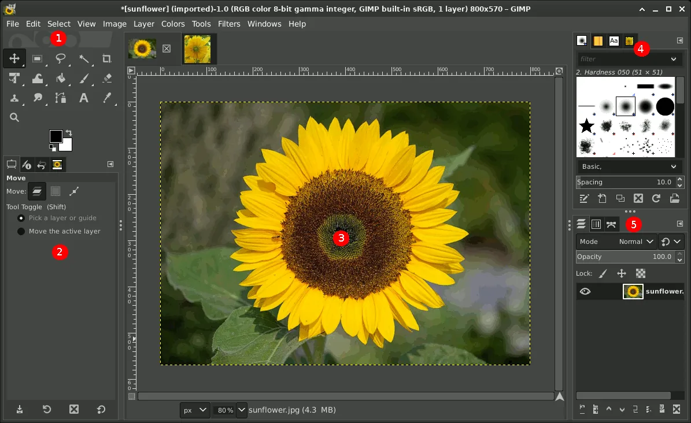</a> | [GIMP](references/42-gimp/README.md) · [official product](https://www.gimp.org/) | browser driven here, 2 named gaps | Native multi-platform — image editor | sidebar-content-inspector: Leading navigation, central work area, and trailing detail inspector. Panels: toolbar/header (top); status/action bar (bottom); navigation/list sidebar (leading); detail/inspector (trailing); primary canvas/content (center). Density: low; confidence: medium. | Study single-window and multi-window modes, dockable tool panels, layer-heavy documents, keyboard accelerators, and local image import or export. |
| 43 |  | [Inkscape](references/43-inkscape/README.md) · [official product](https://inkscape.org/) | browser driven here, 2 named gaps | Native multi-platform — vector editor | sidebar-content-inspector: Leading navigation, central work area, and trailing detail inspector. Panels: toolbar/header (top); status/action bar (bottom); navigation/list sidebar (leading); detail/inspector (trailing); primary canvas/content (center). Density: low; confidence: high. | Study canvas-first vector editing, docked object inspectors, shortcut-based tool switching, multi-page documents, and precise status-bar feedback. |
| 44 | <a href="https://www.libreoffice.org/">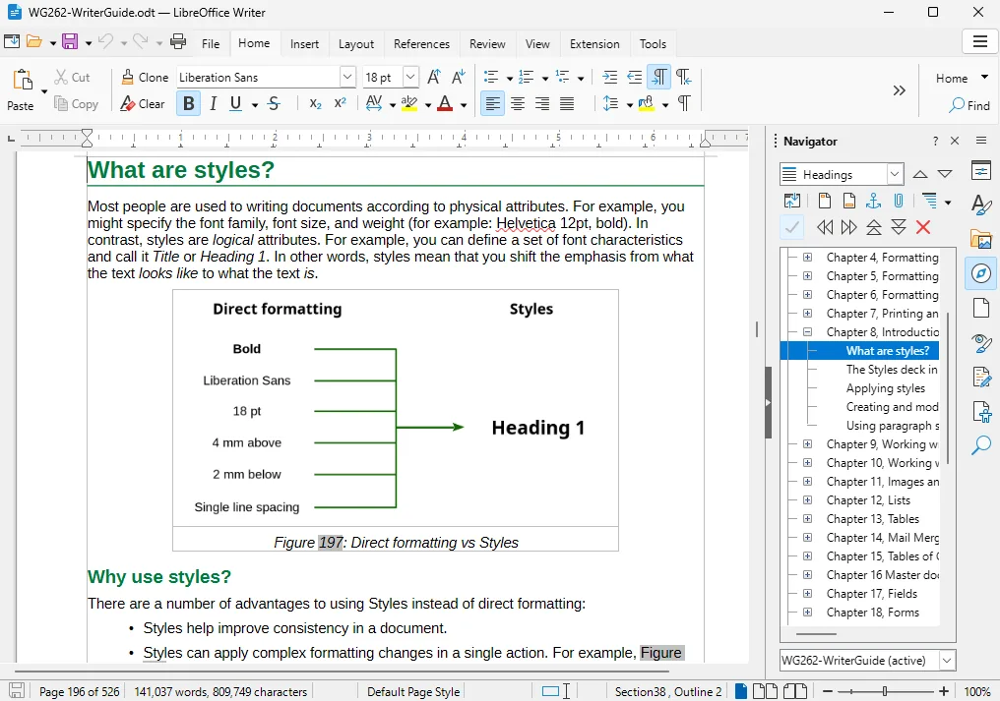</a> | [LibreOffice](references/44-libreoffice/README.md) · [official product](https://www.libreoffice.org/) | browser driven here, 2 named gaps | Native multi-platform — office suite | sidebar-content-inspector: Leading navigation, central work area, and trailing detail inspector. Panels: toolbar/header (top); status/action bar (bottom); navigation/list sidebar (leading); detail/inspector (trailing); primary canvas/content (center). Density: medium; confidence: medium. | Study document-centric menus and toolbars, navigator panels, multiple open windows, keyboard accelerators, local formats, and operating-system print dialogs. |
| 45 | <a href="https://www.thunderbird.net/">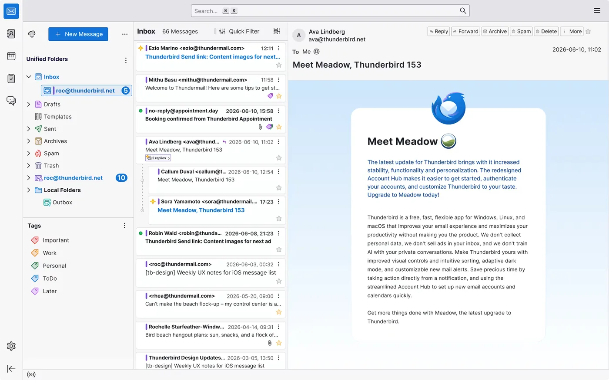</a> | [Thunderbird](references/45-thunderbird/README.md) · [official product](https://www.thunderbird.net/) | browser driven here, 2 named gaps | Native multi-platform — email and calendar | sidebar-content: Leading navigation or collection list beside a dominant content area. Panels: toolbar/header (top); navigation/list sidebar (leading); primary canvas/content (center). Density: medium; confidence: high. | Study folder-message-preview density, tabbed content, advanced search, keyboard mail triage, detachable compose windows, and local archive handling. |
| 46 |  | [Firefox](references/46-firefox/README.md) · [official product](https://www.mozilla.org/firefox/) | browser driven here, 2 named gaps | Native multi-platform — web browser | sidebar-content-inspector: Leading navigation, central work area, and trailing detail inspector. Panels: toolbar/header (top); status/action bar (bottom); navigation/list sidebar (leading); detail/inspector (trailing); primary canvas/content (center). Density: low; confidence: medium. | Study tab and window management, keyboard address-bar operation, sidebar patterns, download handling, picture-in-picture windows, and platform-specific chrome. |
| 47 | <a href="https://www.zotero.org/">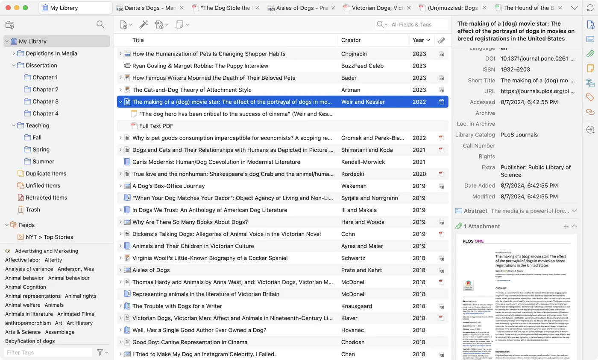</a> | [Zotero](references/47-zotero/README.md) · [official product](https://www.zotero.org/) | browser driven here, 2 named gaps | Native multi-platform — research library | sidebar-content-inspector: Leading navigation, central work area, and trailing detail inspector. Panels: toolbar/header (top); status/action bar (bottom); navigation/list sidebar (leading); detail/inspector (trailing); primary canvas/content (center). Density: medium; confidence: medium. | Study collection-item-metadata panes, attachment files, tag filtering, keyboard item capture, PDF annotation tabs, and independent note or reader windows. |
| 48 | <a href="https://posit.co/download/rstudio-desktop/">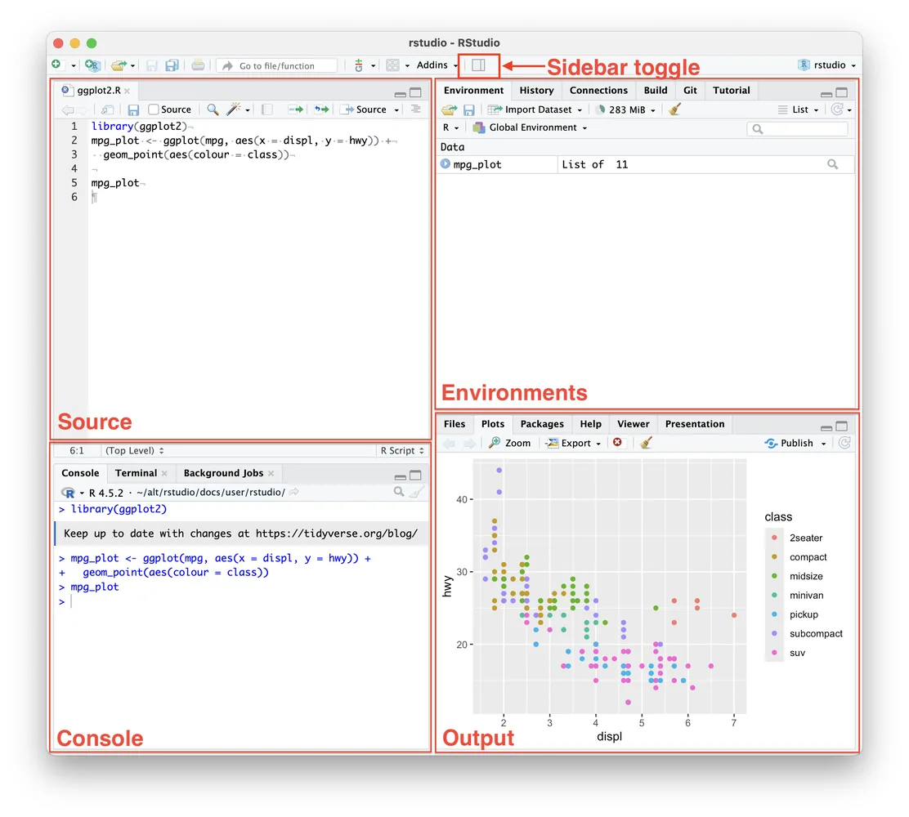</a> | [RStudio Desktop](references/48-rstudio-desktop/README.md) · [official product](https://posit.co/download/rstudio-desktop/) | browser driven here, 2 named gaps | Native multi-platform — development environment | single-surface: One dominant content surface without a stable secondary panel detected. Panels: toolbar/header (top); status/action bar (bottom); primary canvas/content (center). Density: low; confidence: low. | Study source, console, environment, and file panes; keyboard execution; multiple source windows; project files; and configurable pane layouts. |
| 49 | <a href="https://godotengine.org/">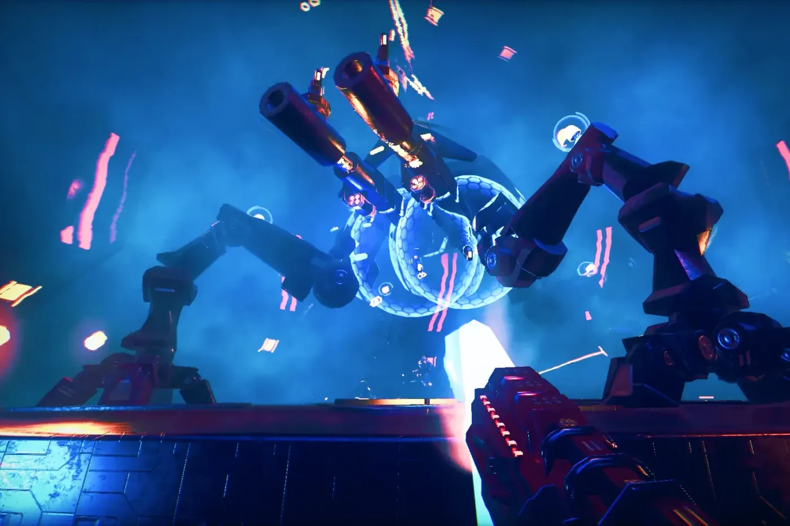</a> | [Godot Engine](references/49-godot-engine/README.md) · [official product](https://godotengine.org/) | browser driven here, 2 named gaps | Native multi-platform — game development | content-inspector: Dominant content area with a trailing detail or property inspector. Panels: toolbar/header (top); status/action bar (bottom); detail/inspector (trailing); primary canvas/content (center). Density: low; confidence: high. | Study scene trees, inspector density, script tabs, integrated file systems, keyboard command search, detachable editor windows, and project switching. |
| 50 | <a href="https://filezilla-project.org/">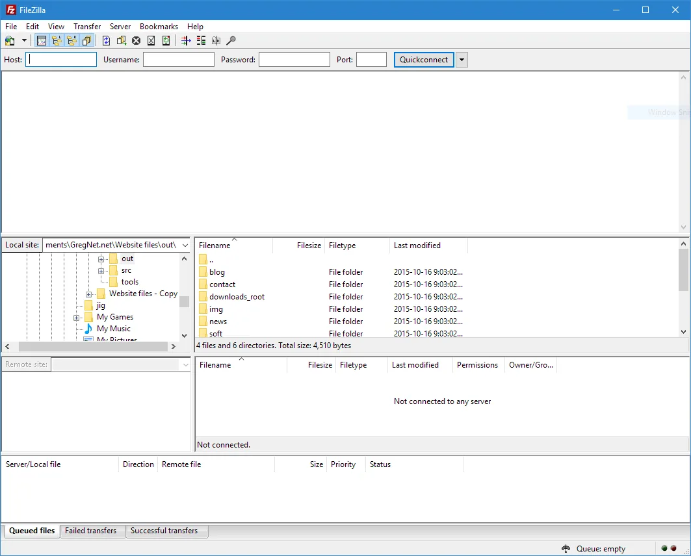</a> | [FileZilla Client](references/50-filezilla-client/README.md) · [official product](https://filezilla-project.org/) | browser driven here, 2 named gaps | Native multi-platform — file transfer | sidebar-content-inspector: Leading navigation, central work area, and trailing detail inspector. Panels: toolbar/header (top); status/action bar (bottom); navigation/list sidebar (leading); detail/inspector (trailing); data table/list (center). Density: low; confidence: medium. | Study paired local and remote directory trees, transfer queues, status logs, keyboard navigation, drag-and-drop movement, and reconnect state handling. |

Normalized panel bounds, detected separators, image dimensions, source-image URLs, hashes, and analysis confidence are recorded in [`sources.json`](sources.json). Media kinds, measured durations, provenance classes, and per-record gaps are in [`references.json`](references.json).

Attribution and product ownership remain with the linked source.
