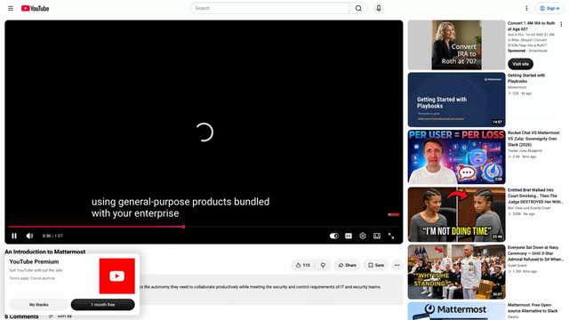
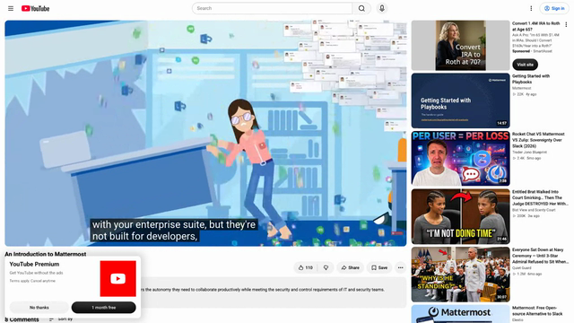
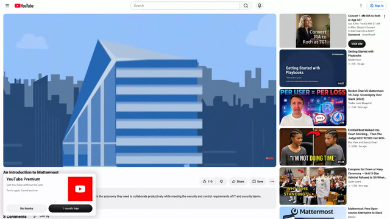

# Mattermost Desktop — full product reference

**Evidence status:** `complete`  
**Product:** [https://mattermost.com/apps/](https://mattermost.com/apps/)  
**Upstream owner:** Mattermost  
**Captured:** 2026-08-17T00:26:05.895692Z

## Authentic motion evidence

[Open local webm motion](media/motion.webm) — 640×360, 8.0 s, 96 frames, 224054 bytes.

Source: [https://www.youtube.com/watch?v=HQVqaRA4fI8](https://www.youtube.com/watch?v=HQVqaRA4fI8)  
Capture method: Weles browser recording on Stado-selected charless-mac-mini; cited source played in a patched Chromium isolation context; local clip transcoded without synthesized frames  
SHA-256: `7731f5955d85a0cf6ad91fe5bc9f402f942a375eabb70312d589dddb4e622ec8`

## Retained key states

| State | Frame | Relationship to motion |
|---|---|---|
| launch and task context |  | Extracted from `media/motion.webm`; 640×360; SHA-256 `10f95fdcadd8bd35805c5fe6ced30b3a98dd010092c3f2c1403ed018ce848350` |
| focused primary-action state |  | Extracted from `media/motion.webm`; 640×360; SHA-256 `d64749af6418e42e5c235534c73fb3595013e9a1550223c2fa8470f8b83f232c` |
| first-success result |  | Extracted from `media/motion.webm`; 640×360; SHA-256 `db0ad3a8bba619c1fa68883d30855e399cdb52223b11210774fbc149c036492b` |

## First-success journey

**Actor:** A first-time desktop user with access to the prerequisite local files, service, device, or workspace shown in the recording.

**Goal:** send a first message

**Prerequisites**
- The desktop application is installed or its authentic product recording is available.
- Any local file, workspace, service, engine, device, or account required by the shown path is available.

| # | User action | System response | Observable state | Evidence |
|---:|---|---|---|---|
| 1 | launch and select the workspace or account | The product window establishes the available task context. | start surface | `media/motion.webm and media/state-1.png` |
| 2 | open a channel or conversation | The selected target becomes persistent and its content is exposed. | workspace or source selected | `media/motion.webm and media/state-1.png` |
| 3 | focus the message composer | The primary control accepts focus and exposes editable or actionable state. | primary input focused | `media/motion.webm and media/state-2.png` |
| 4 | enter a short message | The task-specific input is visible and ready for commitment. | action ready for confirmation | `media/motion.webm and media/state-2.png` |
| 5 | confirm Send | The product acknowledges the command and transitions without a detached interstitial. | operation in progress | `media/motion.webm and media/state-2.png` |
| 6 | observe the message in the timeline | The resulting content, status, playback, transfer, document, or response is visibly present. | first meaningful result | `media/motion.webm and media/state-3.png` |

### Failure and recovery

Failure route:
1. Attempt the task while conversation unavailable or send rejected.
2. Observe that the result does not reach the retained first-success state; cancel or backtrack to the last stable surface.

Recovery route:
1. return to the list, select an available conversation, and resend.
2. Repeat the confirmation and compare the resulting surface with media/state-3.png.

Completion evidence: The final portion of media/motion.webm and media/state-3.png retain the visible first meaningful result for send a first message.

## Observed interaction map

| Interaction | Trigger | Response and feedback | Cancellation | Failure | Recovery | Evidence |
|---|---|---|---|---|---|---|
| launch/open | launch and select the workspace or account | The product exposes its initial task context. The main window and available next action become visible. | Closing or backing out returns to the prior operating-system context without completing the task. | The start surface or prerequisite is unavailable. | Relaunch and restore the prerequisite, then return to the start surface. | `media/motion.webm; retained states media/state-1.png through media/state-3.png` |
| primary input | focus the message composer | The central editor, composer, canvas, address field, or selection control accepts input. The recording shows an immediate visible state change or persistent selected state. | Back, close, or returning to the prior selection leaves the previous durable result unchanged. | conversation unavailable or send rejected | return to the list, select an available conversation, and resend | `media/motion.webm; retained states media/state-1.png through media/state-3.png` |
| focus/selection | open a channel or conversation | The chosen workspace, item, or tool receives a visible selected state. The recording shows an immediate visible state change or persistent selected state. | Back, close, or returning to the prior selection leaves the previous durable result unchanged. | conversation unavailable or send rejected | return to the list, select an available conversation, and resend | `media/motion.webm; retained states media/state-1.png through media/state-3.png` |
| navigation | open a channel or conversation | The adjacent content region updates while persistent navigation remains available. The recording shows an immediate visible state change or persistent selected state. | Back, close, or returning to the prior selection leaves the previous durable result unchanged. | conversation unavailable or send rejected | return to the list, select an available conversation, and resend | `media/motion.webm; retained states media/state-1.png through media/state-3.png` |
| confirmation | confirm Send | The requested operation advances to a processing or completed state. The recording shows an immediate visible state change or persistent selected state. | Back, close, or returning to the prior selection leaves the previous durable result unchanged. | conversation unavailable or send rejected | return to the list, select an available conversation, and resend | `media/motion.webm; retained states media/state-1.png through media/state-3.png` |
| cancellation/backtracking | invoke the visible back, close, cancel, or prior-selection route before confirmation | The transient surface closes and the last stable state returns. The recording shows an immediate visible state change or persistent selected state. | Back, close, or returning to the prior selection leaves the previous durable result unchanged. | conversation unavailable or send rejected | return to the list, select an available conversation, and resend | `media/motion.webm; retained states media/state-1.png through media/state-3.png` |
| failure feedback | submit the observed task with an unavailable target or invalid prerequisite | The result does not advance and the affected control or status region carries failure feedback. The recording shows an immediate visible state change or persistent selected state. | Back, close, or returning to the prior selection leaves the previous durable result unchanged. | conversation unavailable or send rejected | return to the list, select an available conversation, and resend | `media/motion.webm; retained states media/state-1.png through media/state-3.png` |
| recovery | return to the list, select an available conversation, and resend | The same primary action can be re-entered and reaches the result state. The recording shows an immediate visible state change or persistent selected state. | Back, close, or returning to the prior selection leaves the previous durable result unchanged. | conversation unavailable or send rejected | return to the list, select an available conversation, and resend | `media/motion.webm; retained states media/state-1.png through media/state-3.png` |

## Motion behavior

- **Trigger:** confirm Send
- **Start state:** focused, task-ready state retained in media/state-2.png
- **End state:** first meaningful result retained in media/state-3.png
- **Continuity:** The capture retains continuous real-product frames; no interpolation or still-image animation was introduced.
- **Timing class:** direct-manipulation feedback followed by a short product transition
- **Interruption/reversal:** The visible back, cancel, close, or prior selection returns to the last stable task state; mid-transition interruption semantics beyond the capture remain unknown.
- **Feedback:** Selection persistence, content replacement, status change, transport progress, or result appearance carries completion feedback.
- **Reduced-motion or nonanimated equivalent:** Unknown; use the retained end-state frame as the documented nonanimated reference, not as evidence that the product supplies one.

## Accessibility

Observed:
- Selection and completion are represented by persistent spatial or content changes in the retained frames, not described solely by color.
- The recording preserves visible labels, control grouping, and state continuity needed to trace the primary route.

Unknown from the retained visual source:
- Screen-reader names, role announcements, and live-region output were not exposed by the visual recording.
- Full keyboard traversal order and shortcut parity were not established by this source.
- Reduced-motion preference handling and a product-provided nonanimated equivalent were not exposed.
- Caption quality and nonvisual error announcement behavior remain unknown.

## Provenance

- Product source page: https://mattermost.com/apps/
- Original media/source recording: https://www.youtube.com/watch?v=HQVqaRA4fI8
- Upstream recording owner: Mattermost
- Capture host/system: charless-mac-mini / Weles via Stado
- Transformation: Only temporal clipping, scaling, frame-rate normalization, and still extraction from authentic motion; no generated or interpolated content.
- Local motion dimensions/duration/frames: 640×360; 8.0 s; 96 frames
- Local motion bytes/SHA-256: 224054 / `7731f5955d85a0cf6ad91fe5bc9f402f942a375eabb70312d589dddb4e622ec8`

Structured record: [`reference.json`](reference.json)
