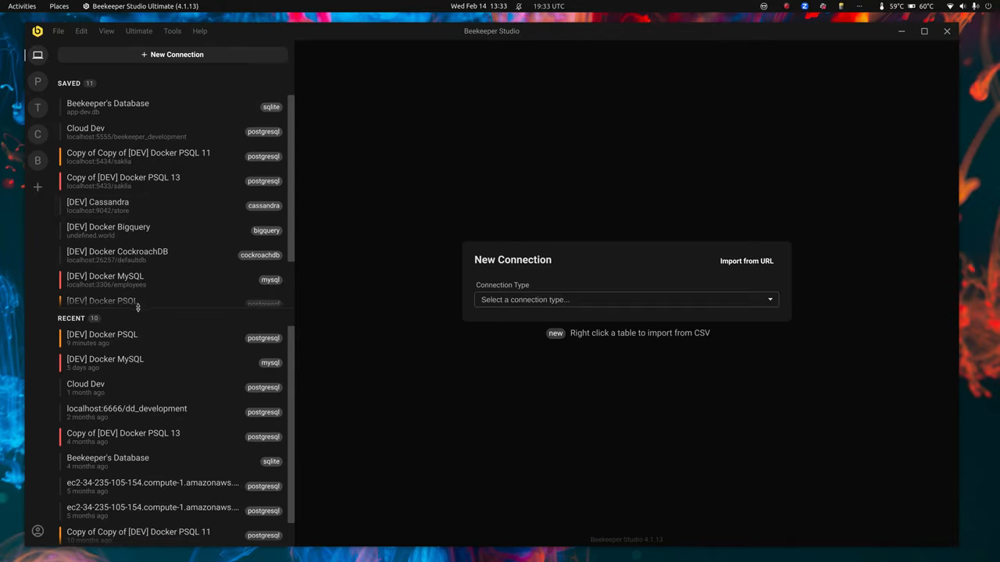
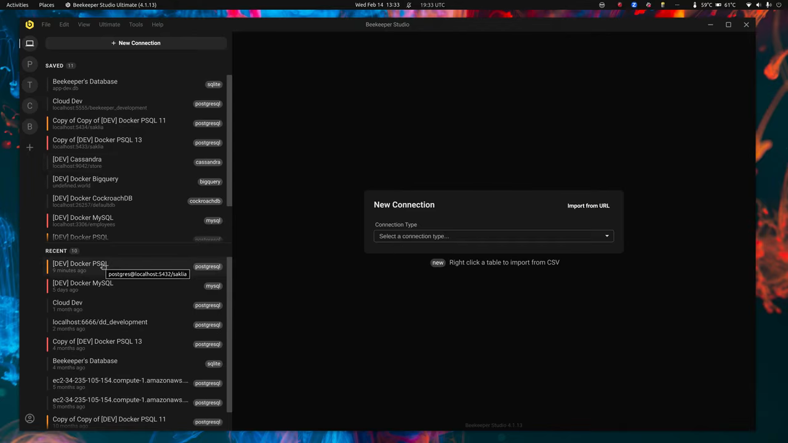
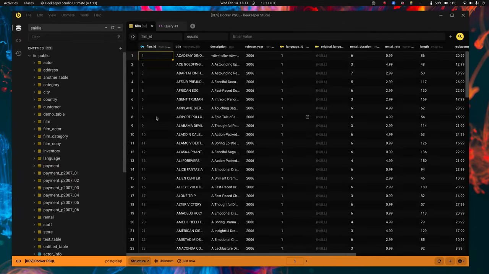
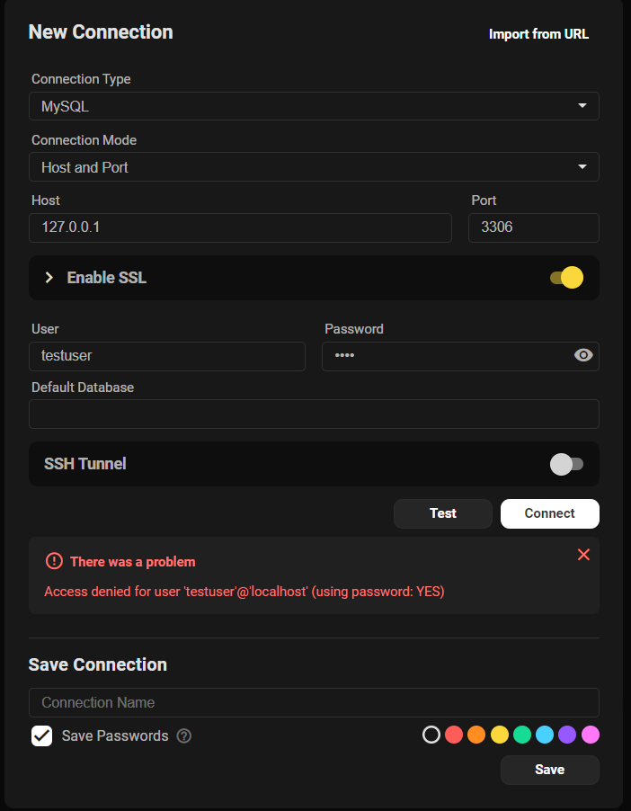

# Beekeeper Studio — full product reference

**Evidence status:** `complete`  
**Product:** [https://www.beekeeperstudio.io/](https://www.beekeeperstudio.io/)  
**Upstream owner:** Beekeeper Studio  
**Captured:** 2026-08-17T00:26:07.476527Z

## Authentic motion evidence

[Open local webm motion](media/motion.webm) — 1280×720, 8.0 s, 480 frames, 283224 bytes.

Source: [https://www.youtube.com/watch?v=mUsIu1JFV-0](https://www.youtube.com/watch?v=mUsIu1JFV-0)  
Capture method: Official Beekeeper Studio walkthrough downloaded directly from the cited source; product-only interval 00:36–00:44 clipped and transcoded without synthesized frames  
SHA-256: `3c32dee95089d67fa2bd50d73d9f0ac470f903ca184561976cdd8fba4f3b1389`

## Retained key states

| State | Frame | Relationship to motion |
|---|---|---|
| connection selection ready |  | Extracted from `media/motion.webm`; 1280×720; SHA-256 `bb5511407db940f700a83545446da3cae86ad66ff164c2f619d8a300d07b5745` |
| connection transition in progress |  | Extracted from `media/motion.webm`; 1280×720; SHA-256 `cedf3cc1716bd1d283e552446829fbe872ef78e20cedd4e4b0aec40d9a04b5b9` |
| connected database result |  | Extracted from `media/motion.webm`; 1280×720; SHA-256 `70860b0ed27eee1f225b080dbd017d865eae0b7e91e1352986185a2705b5e362` |

## First-success journey

**Actor:** A first-time desktop user with access to the prerequisite local files, service, device, or workspace shown in the recording.

**Goal:** connect and run a first query

**Prerequisites**
- The desktop application is installed or its authentic product recording is available.
- Any local file, workspace, service, engine, device, or account required by the shown path is available.

| # | User action | System response | Observable state | Evidence |
|---:|---|---|---|---|
| 1 | launch to connection selection | The product window establishes the available task context. | start surface | `media/motion.webm and media/state-1.png` |
| 2 | choose or enter a connection | The selected target becomes persistent and its content is exposed. | workspace or source selected | `media/motion.webm and media/state-1.png` |
| 3 | confirm connection | The primary control accepts focus and exposes editable or actionable state. | primary input focused | `media/motion.webm and media/state-2.png` |
| 4 | select a database or table | The task-specific input is visible and ready for commitment. | action ready for confirmation | `media/motion.webm and media/state-2.png` |
| 5 | run a query or browse command | The product acknowledges the command and transitions without a detached interstitial. | operation in progress | `media/motion.webm and media/state-2.png` |
| 6 | observe returned rows or documents | The resulting content, status, playback, transfer, document, or response is visibly present. | first meaningful result | `media/motion.webm and media/state-3.png` |

### Failure and recovery

Failure route:
1. Submit the connection form with credentials the database rejects.
2. Observe the retained form and inline `There was a problem` card with the exact `Access denied` message in `media/error-state.png`.

Recovery route:
1. Correct the connection target or credentials without rebuilding the form.
2. Invoke `Test` or `Connect` again and compare the connected database result with `media/state-3.png`.

### Observed error presentation

The real user-reported screenshot retains host, port, username, password, SSL state, and both connection actions. A persistent error card sits directly below `Test` and `Connect`, combines an error icon with the heading `There was a problem`, and prints the database message `Access denied for user 'testuser'@'localhost' (using password: YES)`. The dismiss action removes the message without clearing the form.

Source: [Beekeeper Studio issue #2446](https://github.com/beekeeper-studio/beekeeper-studio/issues/2446)  
Local SHA-256: `46c7a555f41d1f07e2b31b2f7b9336abfa282e33cb1c2f597a0049988e9245ce`

Completion evidence: The final portion of media/motion.webm and media/state-3.png retain the visible first meaningful result for connect and run a first query.

## Observed interaction map

| Interaction | Trigger | Response and feedback | Cancellation | Failure | Recovery | Evidence |
|---|---|---|---|---|---|---|
| launch/open | launch to connection selection | The product exposes its initial task context. The main window and available next action become visible. | Closing or backing out returns to the prior operating-system context without completing the task. | The start surface or prerequisite is unavailable. | Relaunch and restore the prerequisite, then return to the start surface. | `media/motion.webm; retained states media/state-1.png through media/state-3.png` |
| primary input | confirm connection | The central editor, composer, canvas, address field, or selection control accepts input. The recording shows an immediate visible state change or persistent selected state. | Back, close, or returning to the prior selection leaves the previous durable result unchanged. | connection or query fails | correct connection details or query text and run again | `media/motion.webm; retained states media/state-1.png through media/state-3.png` |
| focus/selection | choose or enter a connection | The chosen workspace, item, or tool receives a visible selected state. The recording shows an immediate visible state change or persistent selected state. | Back, close, or returning to the prior selection leaves the previous durable result unchanged. | connection or query fails | correct connection details or query text and run again | `media/motion.webm; retained states media/state-1.png through media/state-3.png` |
| navigation | choose or enter a connection | The adjacent content region updates while persistent navigation remains available. The recording shows an immediate visible state change or persistent selected state. | Back, close, or returning to the prior selection leaves the previous durable result unchanged. | connection or query fails | correct connection details or query text and run again | `media/motion.webm; retained states media/state-1.png through media/state-3.png` |
| confirmation | run a query or browse command | The requested operation advances to a processing or completed state. The recording shows an immediate visible state change or persistent selected state. | Back, close, or returning to the prior selection leaves the previous durable result unchanged. | connection or query fails | correct connection details or query text and run again | `media/motion.webm; retained states media/state-1.png through media/state-3.png` |
| cancellation/backtracking | invoke the visible back, close, cancel, or prior-selection route before confirmation | The transient surface closes and the last stable state returns. The recording shows an immediate visible state change or persistent selected state. | Back, close, or returning to the prior selection leaves the previous durable result unchanged. | connection or query fails | correct connection details or query text and run again | `media/motion.webm; retained states media/state-1.png through media/state-3.png` |
| failure feedback | submit the connection form with credentials the database rejects | The connection form remains visible and a persistent inline error card appears below `Test` and `Connect`. The card combines an error icon, the heading `There was a problem`, and the exact database error message. | The card can be dismissed without clearing host, port, user, password, or the rest of the form. | `Access denied for user 'testuser'@'localhost' (using password: YES)` | correct the connection data and invoke `Test` or `Connect` again | `media/error-state.png`; [real user report](https://github.com/beekeeper-studio/beekeeper-studio/issues/2446) |
| recovery | correct the connection data and invoke `Test` or `Connect` again | The same connection action can be repeated; successful connection replaces the form with persistent database navigation and returned rows. `media/state-3.png` retains the connected database, selected table, and visible result rows. | Back, close, or returning to the prior selection leaves the previous durable result unchanged. | connection or query fails | correct connection details or query text and run again | `media/error-state.png`, `media/motion.webm`, and `media/state-3.png` |

## Motion behavior

- **Trigger:** run a query or browse command
- **Start state:** focused, task-ready state retained in media/state-2.png
- **End state:** first meaningful result retained in media/state-3.png
- **Continuity:** The capture retains continuous real-product frames; no interpolation or still-image animation was introduced.
- **Timing class:** direct-manipulation feedback followed by a short product transition
- **Interruption/reversal:** The visible back, cancel, close, or prior selection returns to the last stable task state; mid-transition interruption semantics beyond the capture remain unknown.
- **Feedback:** Selection persistence, content replacement, status change, transport progress, or result appearance carries completion feedback.
- **Reduced-motion or nonanimated equivalent:** Unknown; use the retained end-state frame as the documented nonanimated reference, not as evidence that the product supplies one.

## Accessibility

Observed:
- Selection and completion are represented by persistent spatial or content changes in the retained frames, not described solely by color.
- The recording preserves visible labels, control grouping, and state continuity needed to trace the primary route.
- The observed connection error uses an icon, heading, and exact text message rather than color alone.

Unknown from the retained visual source:
- Screen-reader names, role announcements, and live-region output were not exposed by the visual recording.
- Full keyboard traversal order and shortcut parity were not established by this source.
- Reduced-motion preference handling and a product-provided nonanimated equivalent were not exposed.
- Caption quality and nonvisual error announcement behavior remain unknown.

## Provenance

- Product source page: https://www.beekeeperstudio.io/
- Original media/source recording: https://www.youtube.com/watch?v=mUsIu1JFV-0
- Upstream recording owner: Beekeeper Studio
- Capture host/system: local source acquisition with `yt-dlp` and `ffmpeg`
- Transformation: Product-only interval 00:36–00:44 was clipped and transcoded; retained states were decoded directly from that clip; no generated or interpolated content.
- Local motion dimensions/duration/frames: 1280×720; 8.0 s; 480 frames
- Local motion bytes/SHA-256: 283224 / `3c32dee95089d67fa2bd50d73d9f0ac470f903ca184561976cdd8fba4f3b1389`

Structured record: [`reference.json`](reference.json)
