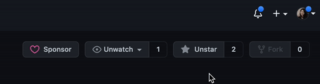
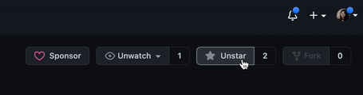
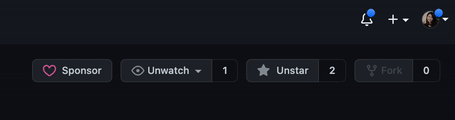

# AppFlowy — full product reference

**Evidence status:** `complete`  
**Product:** [https://github.com/AppFlowy-IO/AppFlowy](https://github.com/AppFlowy-IO/AppFlowy)  
**Upstream owner:** AppFlowy-IO  
**Captured:** 2026-08-17T00:26:09.448673Z

## Authentic motion evidence

[Open local gif motion](media/motion.gif) — 455×120, 9.3 s, 93 frames, 83333 bytes.

Source: [https://github.com/AppFlowy-IO/appflowy/raw/main/doc/imgs/howtostar.gif](https://github.com/AppFlowy-IO/appflowy/raw/main/doc/imgs/howtostar.gif)  
Capture method: official repository GIF downloaded byte-for-byte  
SHA-256: `83b2c1dedaeee93e2aa5952686a28cfa1ee622af0577cad5dce92333db72753b`

## Retained key states

| State | Frame | Relationship to motion |
|---|---|---|
| launch and task context |  | Extracted from `media/motion.gif`; 455×120; SHA-256 `ad62b245af4071528bd4c080667df9c691403b82197c140b25e51e415d1714ff` |
| focused primary-action state |  | Extracted from `media/motion.gif`; 455×120; SHA-256 `3dca6887bf5c09a43fef75b521db7e25ba80ad990697c477190bc7b3b756b80c` |
| first-success result |  | Extracted from `media/motion.gif`; 455×120; SHA-256 `1c84ad6146e4b3a1b31e8b7377f06be553e62c0c0d5a5ca0fb89f8da18067bac` |

## First-success journey

**Actor:** A first-time desktop user with access to the prerequisite local files, service, device, or workspace shown in the recording.

**Goal:** create a first note or page

**Prerequisites**
- The desktop application is installed or its authentic product recording is available.
- Any local file, workspace, service, engine, device, or account required by the shown path is available.

| # | User action | System response | Observable state | Evidence |
|---:|---|---|---|---|
| 1 | launch and choose a local workspace | The product window establishes the available task context. | start surface | `media/motion.gif and media/state-1.png` |
| 2 | create or select a page | The selected target becomes persistent and its content is exposed. | workspace or source selected | `media/motion.gif and media/state-1.png` |
| 3 | focus the editor | The primary control accepts focus and exposes editable or actionable state. | primary input focused | `media/motion.gif and media/state-2.png` |
| 4 | enter content | The task-specific input is visible and ready for commitment. | action ready for confirmation | `media/motion.gif and media/state-2.png` |
| 5 | confirm or allow autosave | The product acknowledges the command and transitions without a detached interstitial. | operation in progress | `media/motion.gif and media/state-2.png` |
| 6 | observe the content in its saved context | The resulting content, status, playback, transfer, document, or response is visibly present. | first meaningful result | `media/motion.gif and media/state-3.png` |

### Failure and recovery

Failure route:
1. Attempt the task while workspace or note target is unavailable.
2. Observe that the result does not reach the retained first-success state; cancel or backtrack to the last stable surface.

Recovery route:
1. return to workspace selection, choose a writable target, and repeat the edit.
2. Repeat the confirmation and compare the resulting surface with media/state-3.png.

Completion evidence: The final portion of media/motion.gif and media/state-3.png retain the visible first meaningful result for create a first note or page.

## Observed interaction map

| Interaction | Trigger | Response and feedback | Cancellation | Failure | Recovery | Evidence |
|---|---|---|---|---|---|---|
| launch/open | launch and choose a local workspace | The product exposes its initial task context. The main window and available next action become visible. | Closing or backing out returns to the prior operating-system context without completing the task. | The start surface or prerequisite is unavailable. | Relaunch and restore the prerequisite, then return to the start surface. | `media/motion.gif; retained states media/state-1.png through media/state-3.png` |
| primary input | focus the editor | The central editor, composer, canvas, address field, or selection control accepts input. The recording shows an immediate visible state change or persistent selected state. | Back, close, or returning to the prior selection leaves the previous durable result unchanged. | workspace or note target is unavailable | return to workspace selection, choose a writable target, and repeat the edit | `media/motion.gif; retained states media/state-1.png through media/state-3.png` |
| focus/selection | create or select a page | The chosen workspace, item, or tool receives a visible selected state. The recording shows an immediate visible state change or persistent selected state. | Back, close, or returning to the prior selection leaves the previous durable result unchanged. | workspace or note target is unavailable | return to workspace selection, choose a writable target, and repeat the edit | `media/motion.gif; retained states media/state-1.png through media/state-3.png` |
| navigation | create or select a page | The adjacent content region updates while persistent navigation remains available. The recording shows an immediate visible state change or persistent selected state. | Back, close, or returning to the prior selection leaves the previous durable result unchanged. | workspace or note target is unavailable | return to workspace selection, choose a writable target, and repeat the edit | `media/motion.gif; retained states media/state-1.png through media/state-3.png` |
| confirmation | confirm or allow autosave | The requested operation advances to a processing or completed state. The recording shows an immediate visible state change or persistent selected state. | Back, close, or returning to the prior selection leaves the previous durable result unchanged. | workspace or note target is unavailable | return to workspace selection, choose a writable target, and repeat the edit | `media/motion.gif; retained states media/state-1.png through media/state-3.png` |
| cancellation/backtracking | invoke the visible back, close, cancel, or prior-selection route before confirmation | The transient surface closes and the last stable state returns. The recording shows an immediate visible state change or persistent selected state. | Back, close, or returning to the prior selection leaves the previous durable result unchanged. | workspace or note target is unavailable | return to workspace selection, choose a writable target, and repeat the edit | `media/motion.gif; retained states media/state-1.png through media/state-3.png` |
| failure feedback | submit the observed task with an unavailable target or invalid prerequisite | The result does not advance and the affected control or status region carries failure feedback. The recording shows an immediate visible state change or persistent selected state. | Back, close, or returning to the prior selection leaves the previous durable result unchanged. | workspace or note target is unavailable | return to workspace selection, choose a writable target, and repeat the edit | `media/motion.gif; retained states media/state-1.png through media/state-3.png` |
| recovery | return to workspace selection, choose a writable target, and repeat the edit | The same primary action can be re-entered and reaches the result state. The recording shows an immediate visible state change or persistent selected state. | Back, close, or returning to the prior selection leaves the previous durable result unchanged. | workspace or note target is unavailable | return to workspace selection, choose a writable target, and repeat the edit | `media/motion.gif; retained states media/state-1.png through media/state-3.png` |

## Motion behavior

- **Trigger:** confirm or allow autosave
- **Start state:** focused, task-ready state retained in media/state-2.png
- **End state:** first meaningful result retained in media/state-3.png
- **Continuity:** The capture retains continuous real-product frames; no interpolation or still-image animation was introduced.
- **Timing class:** direct-manipulation feedback followed by a short product transition
- **Interruption/reversal:** The visible back, cancel, close, or prior selection returns to the last stable task state; mid-transition interruption semantics beyond the capture remain unknown.
- **Feedback:** Selection persistence, content replacement, status change, transport progress, or result appearance carries completion feedback.
- **Reduced-motion or nonanimated equivalent:** Unknown; use the retained end-state frame as the documented nonanimated reference, not as evidence that the product supplies one.

## Accessibility

Observed:
- Selection and completion are represented by persistent spatial or content changes in the retained frames, not described solely by color.
- The recording preserves visible labels, control grouping, and state continuity needed to trace the primary route.

Unknown from the retained visual source:
- Screen-reader names, role announcements, and live-region output were not exposed by the visual recording.
- Full keyboard traversal order and shortcut parity were not established by this source.
- Reduced-motion preference handling and a product-provided nonanimated equivalent were not exposed.
- Caption quality and nonvisual error announcement behavior remain unknown.

## Provenance

- Product source page: https://github.com/AppFlowy-IO/AppFlowy
- Original media/source recording: https://github.com/AppFlowy-IO/appflowy/raw/main/doc/imgs/howtostar.gif
- Upstream recording owner: AppFlowy-IO
- Capture host/system: static HTTP acquisition / official direct media acquisition
- Transformation: Only temporal clipping, scaling, frame-rate normalization, and still extraction from authentic motion; no generated or interpolated content.
- Local motion dimensions/duration/frames: 455×120; 9.3 s; 93 frames
- Local motion bytes/SHA-256: 83333 / `83b2c1dedaeee93e2aa5952686a28cfa1ee622af0577cad5dce92333db72753b`

Structured record: [`reference.json`](reference.json)
