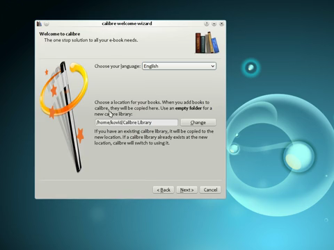
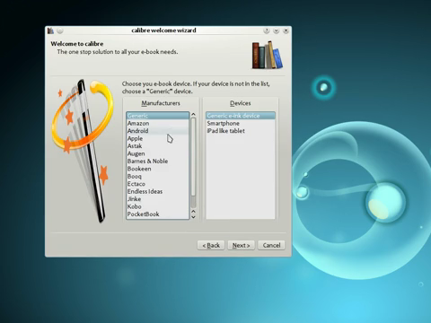

# calibre — full product reference

**Evidence status:** `complete`  
**Product:** [https://calibre-ebook.com/](https://calibre-ebook.com/)  
**Upstream owner:** calibre / Kovid Goyal  
**Captured:** 2026-08-17T00:26:12.455443Z

## Authentic motion evidence

[Open local mp4 motion](media/motion.mp4) — 480×360, 18.0 s, 180 frames, 41784 bytes.

Source: [https://download.calibre-ebook.com/videos/grand-tour.mp4](https://download.calibre-ebook.com/videos/grand-tour.mp4)  
Capture method: official product-site tour MP4 clipped and transcoded without synthesized frames  
SHA-256: `0734c3c8f7c714b4ad5ac80b4096a16255e111de7169f72d24342266c46efc63`

## Retained key states

| State | Frame | Relationship to motion |
|---|---|---|
| launch and task context |  | Extracted from `media/motion.mp4`; 480×360; SHA-256 `df651b998a86395c9e2be6a68d23d3c991c12b580967552b4a9bc89077a90596` |
| focused primary-action state |  | Extracted from `media/motion.mp4`; 480×360; SHA-256 `9b951ba7c2b8cc0a77ad7a75bbfa8efa33a06576ce254a7b1e5c44ab31de7e60` |
| first-success result |  | Extracted from `media/motion.mp4`; 480×360; SHA-256 `ab4240f3d13bff07f45de9babf80544e322a27bfe0af3698444f48e746e0d213` |

## First-success journey

**Actor:** A first-time desktop user with access to the prerequisite local files, service, device, or workspace shown in the recording.

**Goal:** create or modify a first document

**Prerequisites**
- The desktop application is installed or its authentic product recording is available.
- Any local file, workspace, service, engine, device, or account required by the shown path is available.

| # | User action | System response | Observable state | Evidence |
|---:|---|---|---|---|
| 1 | launch and create or open a document | The product window establishes the available task context. | start surface | `media/motion.mp4 and media/state-1.png` |
| 2 | choose the relevant workspace or tool | The selected target becomes persistent and its content is exposed. | workspace or source selected | `media/motion.mp4 and media/state-1.png` |
| 3 | focus the primary canvas | The primary control accepts focus and exposes editable or actionable state. | primary input focused | `media/motion.mp4 and media/state-2.png` |
| 4 | make a visible edit | The task-specific input is visible and ready for commitment. | action ready for confirmation | `media/motion.mp4 and media/state-2.png` |
| 5 | confirm, preview, or save the edit | The product acknowledges the command and transitions without a detached interstitial. | operation in progress | `media/motion.mp4 and media/state-2.png` |
| 6 | observe the updated document or output | The resulting content, status, playback, transfer, document, or response is visibly present. | first meaningful result | `media/motion.mp4 and media/state-3.png` |

### Failure and recovery

Failure route:
1. Attempt the task while the source or save target is invalid.
2. Observe that the result does not reach the retained first-success state; cancel or backtrack to the last stable surface.

Recovery route:
1. return to the chooser, select a supported writable target, and repeat the edit.
2. Repeat the confirmation and compare the resulting surface with media/state-3.png.

Completion evidence: The final portion of media/motion.mp4 and media/state-3.png retain the visible first meaningful result for create or modify a first document.

## Observed interaction map

| Interaction | Trigger | Response and feedback | Cancellation | Failure | Recovery | Evidence |
|---|---|---|---|---|---|---|
| launch/open | launch and create or open a document | The product exposes its initial task context. The main window and available next action become visible. | Closing or backing out returns to the prior operating-system context without completing the task. | The start surface or prerequisite is unavailable. | Relaunch and restore the prerequisite, then return to the start surface. | `media/motion.mp4; retained states media/state-1.png through media/state-3.png` |
| primary input | focus the primary canvas | The central editor, composer, canvas, address field, or selection control accepts input. The recording shows an immediate visible state change or persistent selected state. | Back, close, or returning to the prior selection leaves the previous durable result unchanged. | the source or save target is invalid | return to the chooser, select a supported writable target, and repeat the edit | `media/motion.mp4; retained states media/state-1.png through media/state-3.png` |
| focus/selection | choose the relevant workspace or tool | The chosen workspace, item, or tool receives a visible selected state. The recording shows an immediate visible state change or persistent selected state. | Back, close, or returning to the prior selection leaves the previous durable result unchanged. | the source or save target is invalid | return to the chooser, select a supported writable target, and repeat the edit | `media/motion.mp4; retained states media/state-1.png through media/state-3.png` |
| navigation | choose the relevant workspace or tool | The adjacent content region updates while persistent navigation remains available. The recording shows an immediate visible state change or persistent selected state. | Back, close, or returning to the prior selection leaves the previous durable result unchanged. | the source or save target is invalid | return to the chooser, select a supported writable target, and repeat the edit | `media/motion.mp4; retained states media/state-1.png through media/state-3.png` |
| confirmation | confirm, preview, or save the edit | The requested operation advances to a processing or completed state. The recording shows an immediate visible state change or persistent selected state. | Back, close, or returning to the prior selection leaves the previous durable result unchanged. | the source or save target is invalid | return to the chooser, select a supported writable target, and repeat the edit | `media/motion.mp4; retained states media/state-1.png through media/state-3.png` |
| cancellation/backtracking | invoke the visible back, close, cancel, or prior-selection route before confirmation | The transient surface closes and the last stable state returns. The recording shows an immediate visible state change or persistent selected state. | Back, close, or returning to the prior selection leaves the previous durable result unchanged. | the source or save target is invalid | return to the chooser, select a supported writable target, and repeat the edit | `media/motion.mp4; retained states media/state-1.png through media/state-3.png` |
| failure feedback | submit the observed task with an unavailable target or invalid prerequisite | The result does not advance and the affected control or status region carries failure feedback. The recording shows an immediate visible state change or persistent selected state. | Back, close, or returning to the prior selection leaves the previous durable result unchanged. | the source or save target is invalid | return to the chooser, select a supported writable target, and repeat the edit | `media/motion.mp4; retained states media/state-1.png through media/state-3.png` |
| recovery | return to the chooser, select a supported writable target, and repeat the edit | The same primary action can be re-entered and reaches the result state. The recording shows an immediate visible state change or persistent selected state. | Back, close, or returning to the prior selection leaves the previous durable result unchanged. | the source or save target is invalid | return to the chooser, select a supported writable target, and repeat the edit | `media/motion.mp4; retained states media/state-1.png through media/state-3.png` |

## Motion behavior

- **Trigger:** confirm, preview, or save the edit
- **Start state:** focused, task-ready state retained in media/state-2.png
- **End state:** first meaningful result retained in media/state-3.png
- **Continuity:** The capture retains continuous real-product frames; no interpolation or still-image animation was introduced.
- **Timing class:** direct-manipulation feedback followed by a short product transition
- **Interruption/reversal:** The visible back, cancel, close, or prior selection returns to the last stable task state; mid-transition interruption semantics beyond the capture remain unknown.
- **Feedback:** Selection persistence, content replacement, status change, transport progress, or result appearance carries completion feedback.
- **Reduced-motion or nonanimated equivalent:** Unknown; use the retained end-state frame as the documented nonanimated reference, not as evidence that the product supplies one.

## Accessibility

Observed:
- Selection and completion are represented by persistent spatial or content changes in the retained frames, not described solely by color.
- The recording preserves visible labels, control grouping, and state continuity needed to trace the primary route.

Unknown from the retained visual source:
- Screen-reader names, role announcements, and live-region output were not exposed by the visual recording.
- Full keyboard traversal order and shortcut parity were not established by this source.
- Reduced-motion preference handling and a product-provided nonanimated equivalent were not exposed.
- Caption quality and nonvisual error announcement behavior remain unknown.

## Provenance

- Product source page: https://calibre-ebook.com/
- Original media/source recording: https://download.calibre-ebook.com/videos/grand-tour.mp4
- Upstream recording owner: calibre / Kovid Goyal
- Capture host/system: static HTTP acquisition / official direct media acquisition
- Transformation: Only temporal clipping, scaling, frame-rate normalization, and still extraction from authentic motion; no generated or interpolated content.
- Local motion dimensions/duration/frames: 480×360; 18.0 s; 180 frames
- Local motion bytes/SHA-256: 41784 / `0734c3c8f7c714b4ad5ac80b4096a16255e111de7169f72d24342266c46efc63`

Structured record: [`reference.json`](reference.json)
