# Documentation site examples

Product, API, framework, and platform documentation systems.

Each entry pairs an attributed overview image and a measured panel anatomy with a per-product record: motion evidence, named states, an observed first-success journey, interaction and recovery behavior, accessibility observations, and provenance. Every number below is measured by `verify-reference-evidence.py`, and a record that is missing evidence says so in its own `evidence_gaps`.

**Examples:** 50  
**Images:** 50  
**Structural analyses:** 50  
**Records with no remaining gap:** 0  
**Records with named gaps:** 50 (149 gaps)  
**Motion provenance:** 50 browser driven here  
**Curated:** 2026-08-16  
**Visual source data:** [`sources.json`](sources.json)  
**Record index:** [`references.json`](references.json)  
**Cross-example synthesis:** [`full-reference.md`](full-reference.md)

| # | Reference image | Record | Motion evidence | Category | Interface structure | What to study |
|---:|---|---|---|---|---|---|
| 1 |  | [MDN Web Docs](references/01-mdn-web-docs/README.md) · [official product](https://developer.mozilla.org/en-US/docs/Web) | browser driven here, 2 named gaps | Web platform documentation | sidebar-content-inspector: Leading navigation, central work area, and trailing detail inspector. Panels: toolbar/header (top); navigation/list sidebar (leading); detail/inspector (trailing); data table/list (center). Density: low; confidence: medium. | Study the sidebar topic hierarchy, embedded compatibility tables, and runnable code examples that connect concepts to browser support. |
| 2 | <a href="https://react.dev/">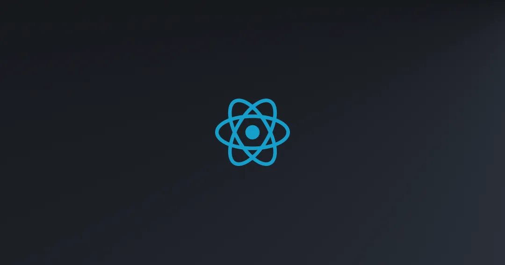</a> | [React Documentation](references/02-react-documentation/README.md) · [official product](https://react.dev/) | browser driven here, 3 named gaps | Frontend framework documentation | canvas: Single dominant canvas or editor with peripheral controls. Panels: toolbar/header (top); primary canvas/content (center). Density: low; confidence: medium. | Study the Learn-to-Reference split and interactive examples that progressively introduce component and hook concepts. |
| 3 | <a href="https://vuejs.org/guide/introduction.html">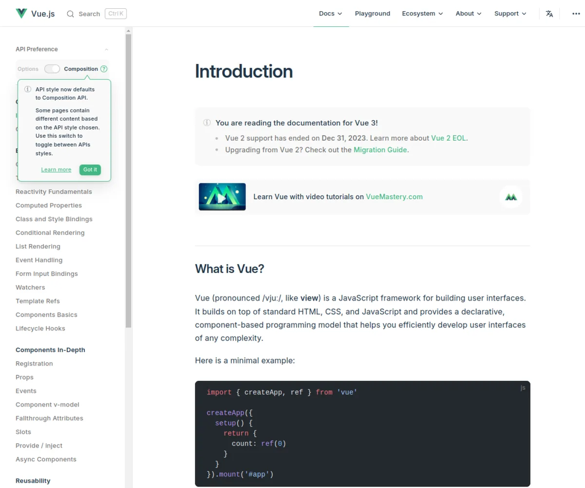</a> | [Vue.js Guide](references/03-vue-js-guide/README.md) · [official product](https://vuejs.org/guide/introduction.html) | browser driven here, 3 named gaps | Frontend framework documentation | sidebar-content: Leading navigation or collection list beside a dominant content area. Panels: toolbar/header (top); status/action bar (bottom); navigation/list sidebar (leading); data table/list (center). Density: low; confidence: high. | Study the API-versus-tutorial navigation, in-page table of contents, and Options API versus Composition API preference switch. |
| 4 | <a href="https://angular.dev/overview">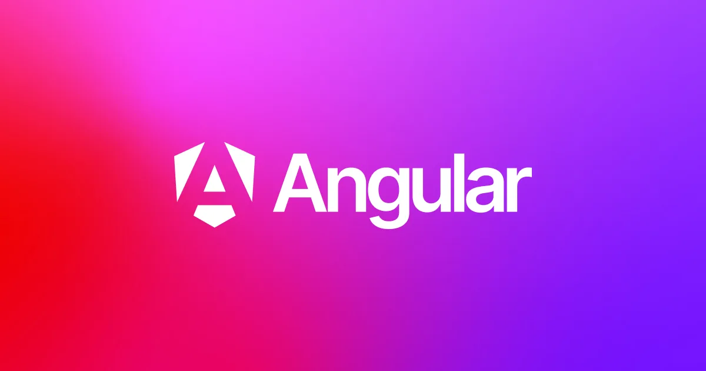</a> | [Angular Documentation](references/04-angular-documentation/README.md) · [official product](https://angular.dev/overview) | browser driven here, 3 named gaps | Frontend framework documentation | sidebar-content-inspector: Leading navigation, central work area, and trailing detail inspector. Panels: toolbar/header (top); navigation/list sidebar (leading); detail/inspector (trailing); primary canvas/content (center). Density: low; confidence: medium. | Study the tutorial, guides, and API reference separation, plus embedded code samples that reveal details within a task sequence. |
| 5 | <a href="https://svelte.dev/docs/svelte/overview">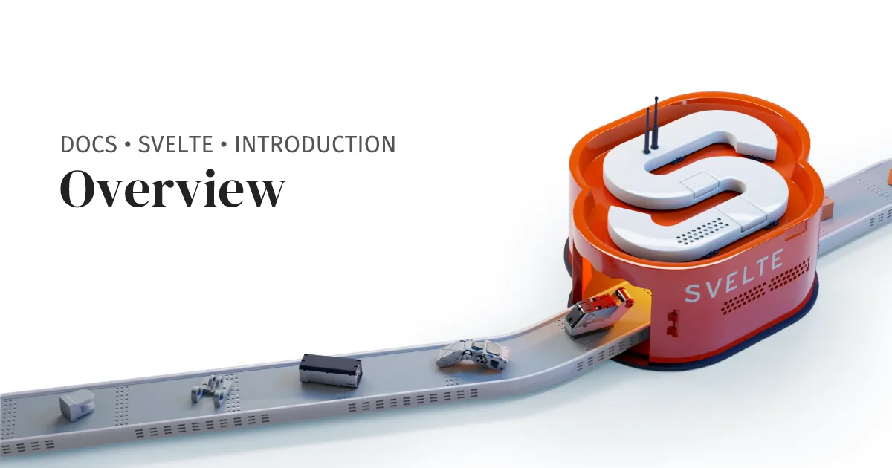</a> | [Svelte Documentation](references/05-svelte-documentation/README.md) · [official product](https://svelte.dev/docs/svelte/overview) | browser driven here, 3 named gaps | Frontend framework documentation | sidebar-content-inspector: Leading navigation, central work area, and trailing detail inspector. Panels: toolbar/header (top); status/action bar (bottom); navigation/list sidebar (leading); detail/inspector (trailing); primary canvas/content (center). Density: low; confidence: medium. | Study the persistent documentation switcher and compact reference pages that pair syntax explanations with focused code examples. |
| 6 | <a href="https://nextjs.org/docs">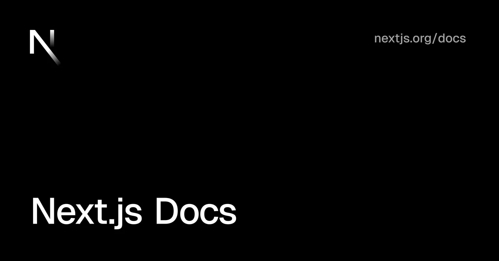</a> | [Next.js Documentation](references/06-next-js-documentation/README.md) · [official product](https://nextjs.org/docs) | browser driven here, 3 named gaps | Web framework documentation | sidebar-content: Leading navigation or collection list beside a dominant content area. Panels: toolbar/header (top); status/action bar (bottom); navigation/list sidebar (leading); primary canvas/content (center). Density: low; confidence: high. | Study the router-specific navigation, version selector, and task-based guides that link directly into configuration and API reference. |
| 7 | <a href="https://nuxt.com/docs/getting-started/introduction">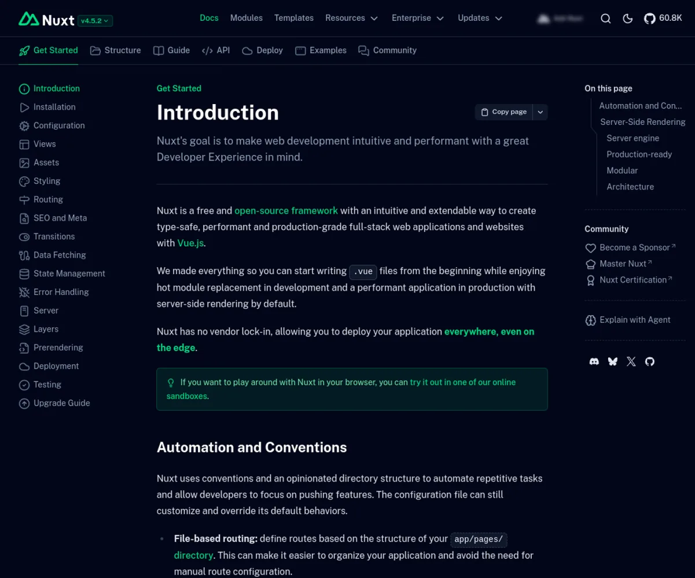</a> | [Nuxt Documentation](references/07-nuxt-documentation/README.md) · [official product](https://nuxt.com/docs/getting-started/introduction) | browser driven here, 3 named gaps | Web framework documentation | sidebar-content: Leading navigation or collection list beside a dominant content area. Panels: toolbar/header (top); status/action bar (bottom); navigation/list sidebar (leading); primary canvas/content (center). Density: medium; confidence: high. | Study the guide-to-API structure, searchable sidebar, and expandable code examples used to explain conventions and configuration. |
| 8 |  | [Django Documentation](references/08-django-documentation/README.md) · [official product](https://docs.djangoproject.com/en/stable/) | browser driven here, 3 named gaps | Backend framework documentation | sidebar-content-inspector: Leading navigation, central work area, and trailing detail inspector. Panels: toolbar/header (top); navigation/list sidebar (leading); detail/inspector (trailing); primary canvas/content (center). Density: low; confidence: medium. | Study the prominent version switcher and clear partition among tutorials, topic guides, reference material, and how-to guides. |
| 9 | <a href="https://guides.rubyonrails.org/">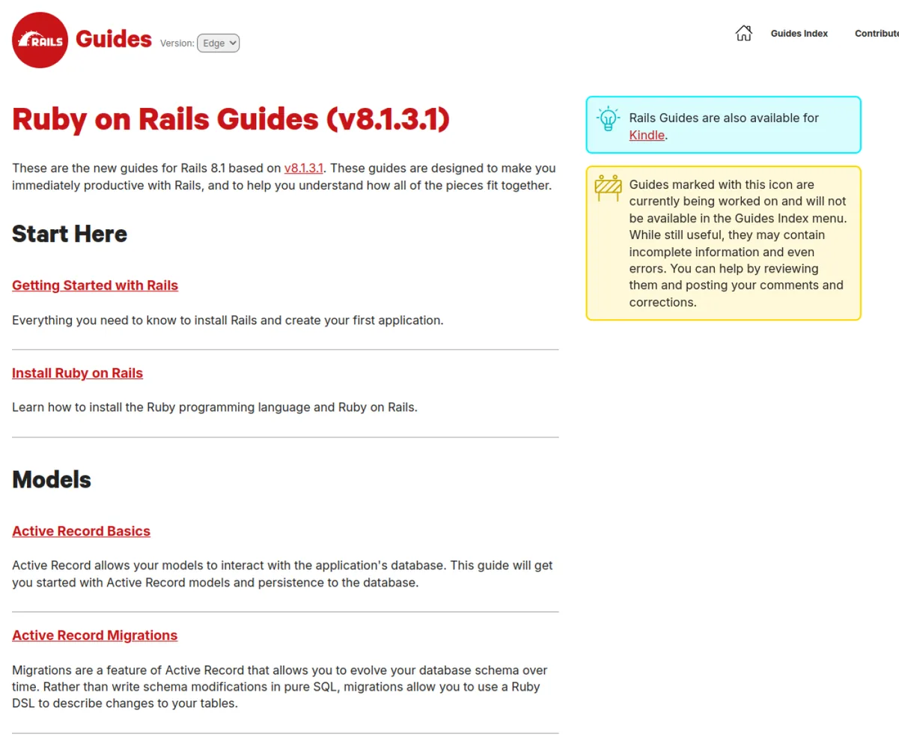</a> | [Ruby on Rails Guides](references/09-ruby-on-rails-guides/README.md) · [official product](https://guides.rubyonrails.org/) | browser driven here, 3 named gaps | Backend framework documentation | sidebar-content: Leading navigation or collection list beside a dominant content area. Panels: toolbar/header (top); status/action bar (bottom); navigation/list sidebar (leading); data table/list (center). Density: low; confidence: medium. | Study the task-oriented guide index, release-version labeling, and long-form pages with anchored tables of contents and code snippets. |
| 10 | <a href="https://laravel.com/docs">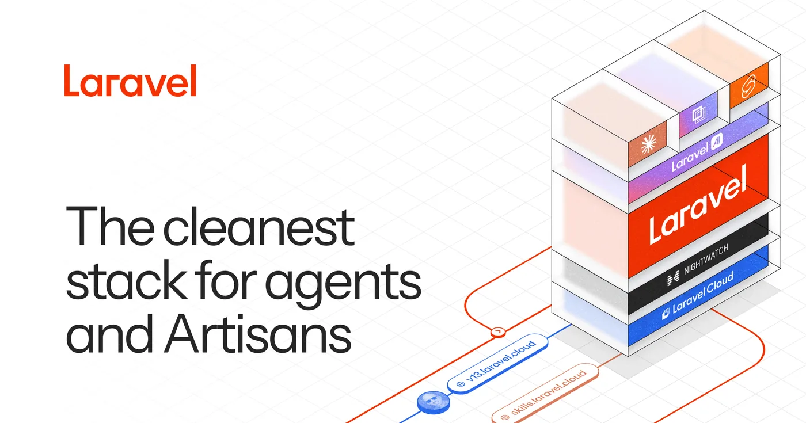</a> | [Laravel Documentation](references/10-laravel-documentation/README.md) · [official product](https://laravel.com/docs) | browser driven here, 3 named gaps | Backend framework documentation | sidebar-content-inspector: Leading navigation, central work area, and trailing detail inspector. Panels: toolbar/header (top); status/action bar (bottom); navigation/list sidebar (leading); detail/inspector (trailing); primary canvas/content (center). Density: low; confidence: medium. | Study the version-aware sidebar, keyboard-accessible search, and progression from installation tasks to feature-specific reference sections. |
| 11 | <a href="https://docs.spring.io/spring-boot/index.html">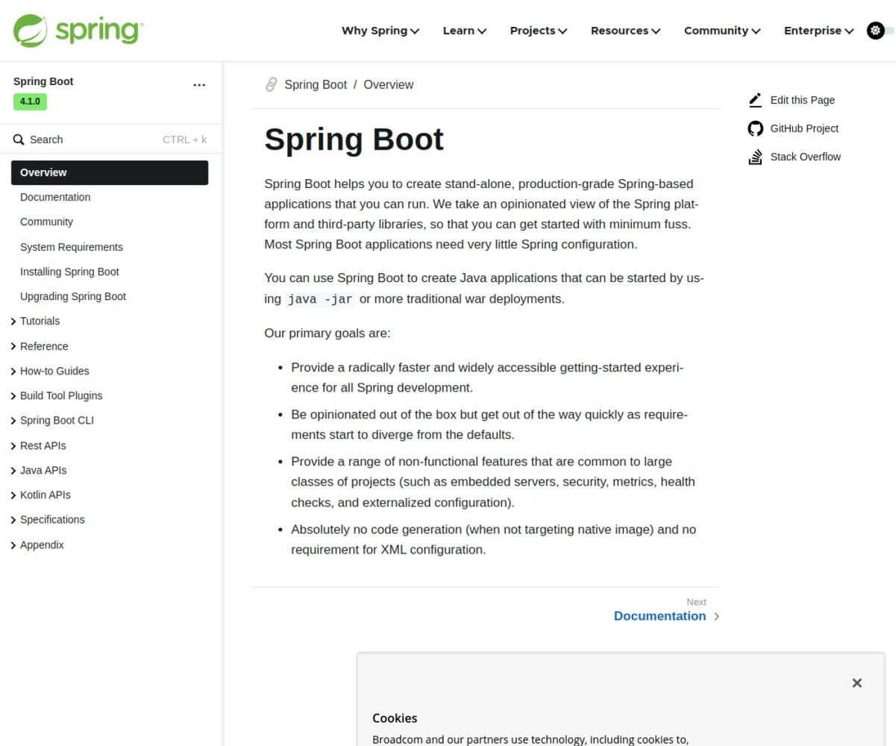</a> | [Spring Boot Reference Documentation](references/11-spring-boot-reference-documentation/README.md) · [official product](https://docs.spring.io/spring-boot/index.html) | browser driven here, 3 named gaps | Backend framework documentation | sidebar-content: Leading navigation or collection list beside a dominant content area. Panels: toolbar/header (top); navigation/list sidebar (leading); primary canvas/content (center). Density: low; confidence: medium. | Study the versioned reference structure, multi-format documentation links, and layered progression from first application to production features. |
| 12 | <a href="https://learn.microsoft.com/en-us/dotnet/">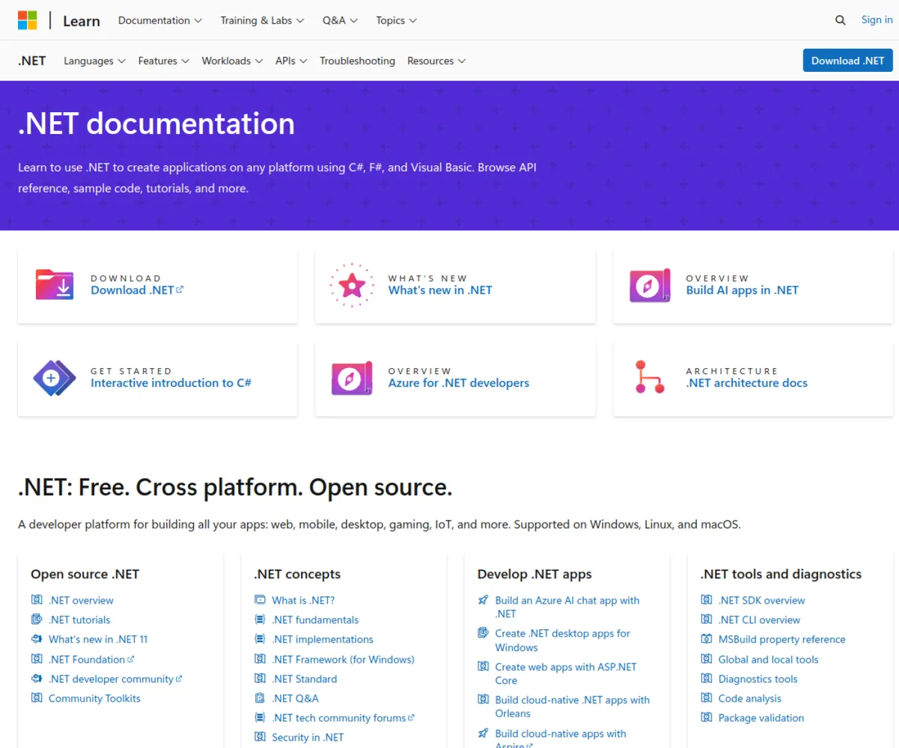</a> | [.NET Documentation](references/12-net-documentation/README.md) · [official product](https://learn.microsoft.com/en-us/dotnet/) | browser driven here, 3 named gaps | Application platform documentation | sidebar-content-inspector: Leading navigation, central work area, and trailing detail inspector. Panels: toolbar/header (top); navigation/list sidebar (leading); detail/inspector (trailing); primary canvas/content (center). Density: low; confidence: medium. | Study the role- and task-based landing pages, scoped search, language selectors, and links connecting tutorials with formal API reference. |
| 13 | <a href="https://doc.rust-lang.org/book/">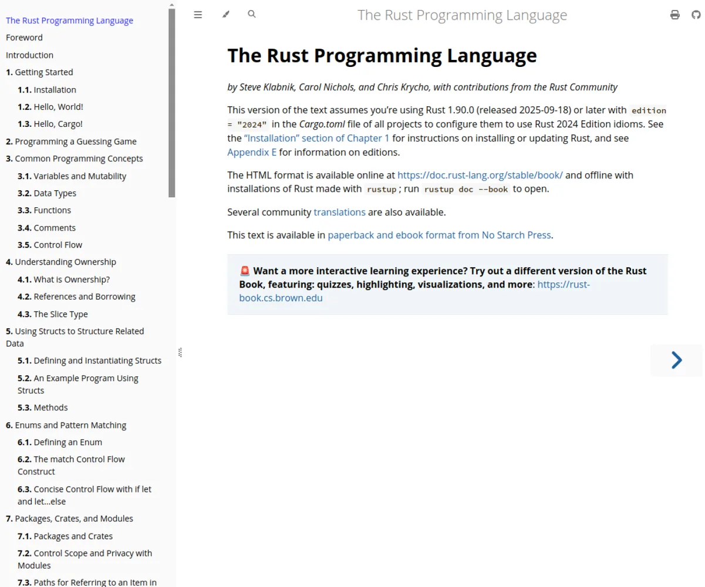</a> | [The Rust Programming Language](references/13-the-rust-programming-language/README.md) · [official product](https://doc.rust-lang.org/book/) | browser driven here, 3 named gaps | Programming language documentation | sidebar-content: Leading navigation or collection list beside a dominant content area. Panels: toolbar/header (top); navigation/list sidebar (leading); data table/list (center). Density: medium; confidence: medium. | Study the book-style chapter progression, concise code listings, and links into standard-library reference for deeper technical detail. |
| 14 | <a href="https://go.dev/doc/">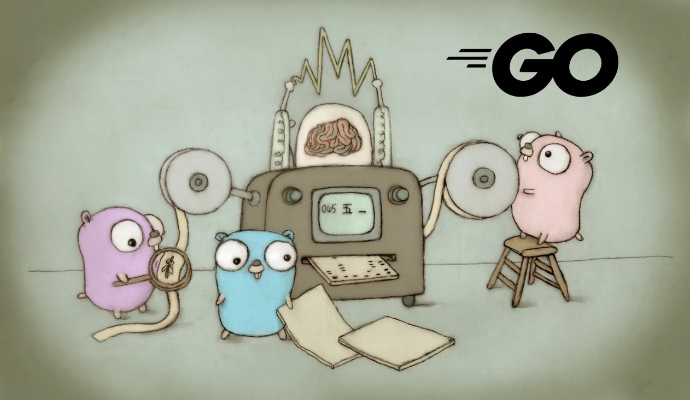</a> | [Go Documentation](references/14-go-documentation/README.md) · [official product](https://go.dev/doc/) | browser driven here, 3 named gaps | Programming language documentation | sidebar-content-inspector: Leading navigation, central work area, and trailing detail inspector. Panels: toolbar/header (top); navigation/list sidebar (leading); detail/inspector (trailing); primary canvas/content (center). Density: low; confidence: medium. | Study the compact task index that separates tutorials, language specification, package reference, diagnostics, and release information. |
| 15 | <a href="https://docs.python.org/3/">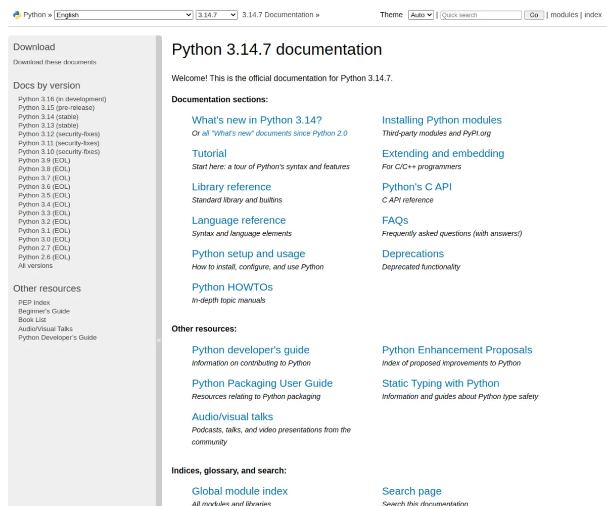</a> | [Python 3 Documentation](references/15-python-3-documentation/README.md) · [official product](https://docs.python.org/3/) | browser driven here, 3 named gaps | Programming language documentation | sidebar-content: Leading navigation or collection list beside a dominant content area. Panels: toolbar/header (top); status/action bar (bottom); navigation/list sidebar (leading); primary canvas/content (center). Density: medium; confidence: medium. | Study the global module index, version and language controls, and separation of tutorials, library reference, and language reference. |
| 16 | <a href="https://kotlinlang.org/docs/home.html">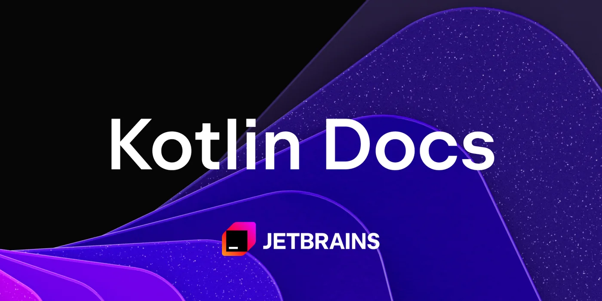</a> | [Kotlin Documentation](references/16-kotlin-documentation/README.md) · [official product](https://kotlinlang.org/docs/home.html) | browser driven here, 3 named gaps | Programming language documentation | sidebar-content: Leading navigation or collection list beside a dominant content area. Panels: toolbar/header (top); status/action bar (bottom); navigation/list sidebar (leading); primary canvas/content (center). Density: low; confidence: medium. | Study the topic cards, platform filters, and concise runnable examples that route readers from learning paths into language reference. |
| 17 | <a href="https://www.swift.org/documentation/">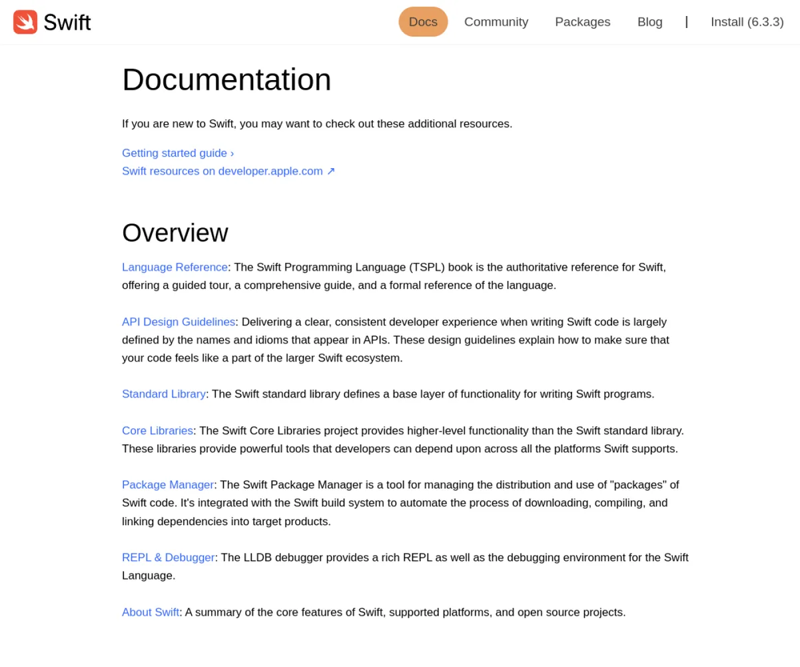</a> | [Swift Documentation](references/17-swift-documentation/README.md) · [official product](https://www.swift.org/documentation/) | browser driven here, 3 named gaps | Programming language documentation | sidebar-content: Leading navigation or collection list beside a dominant content area. Panels: toolbar/header (top); navigation/list sidebar (leading); primary canvas/content (center). Density: medium; confidence: medium. | Study the curated pathways to the language guide, package documentation, API design guidance, and ecosystem-specific learning resources. |
| 18 | <a href="https://developer.android.com/docs">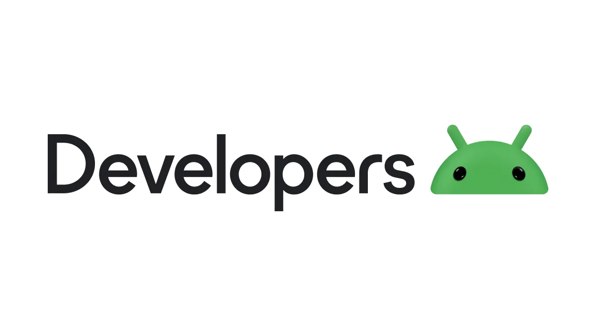</a> | [Android Developers Documentation](references/18-android-developers-documentation/README.md) · [official product](https://developer.android.com/docs) | browser driven here, 3 named gaps | Mobile platform documentation | sidebar-content-inspector: Leading navigation, central work area, and trailing detail inspector. Panels: toolbar/header (top); navigation/list sidebar (leading); detail/inspector (trailing); primary canvas/content (center). Density: low; confidence: medium. | Study the develop-design-distribute task model, platform-version context, sample projects, and cross-links between guides and API reference. |
| 19 | <a href="https://developer.apple.com/documentation/">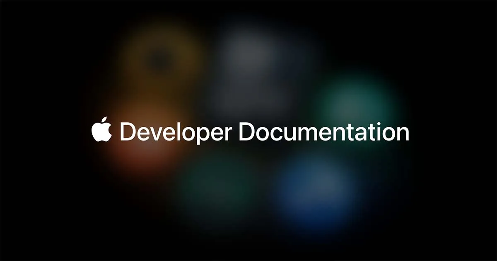</a> | [Apple Developer Documentation](references/19-apple-developer-documentation/README.md) · [official product](https://developer.apple.com/documentation/) | browser driven here, 3 named gaps | Application platform documentation | sidebar-content-inspector: Leading navigation, central work area, and trailing detail inspector. Panels: toolbar/header (top); navigation/list sidebar (leading); detail/inspector (trailing); primary canvas/content (center). Density: low; confidence: medium. | Study the framework browser, inline availability metadata, platform filters, and progressive movement from overview articles to symbol reference. |
| 20 | <a href="https://docs.aws.amazon.com/">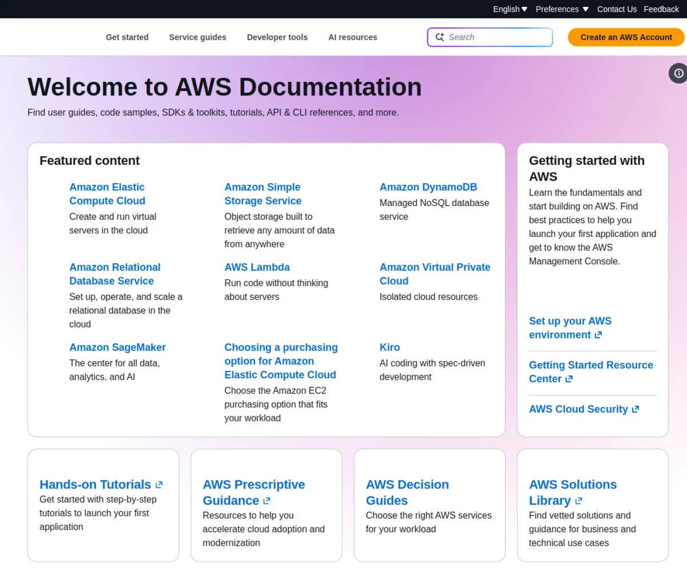</a> | [Amazon Web Services Documentation](references/20-amazon-web-services-documentation/README.md) · [official product](https://docs.aws.amazon.com/) | browser driven here, 3 named gaps | Cloud platform documentation | sidebar-content-inspector: Leading navigation, central work area, and trailing detail inspector. Panels: toolbar/header (top); status/action bar (bottom); navigation/list sidebar (leading); detail/inspector (trailing); primary canvas/content (center). Density: medium; confidence: medium. | Study the service directory, product-scoped search, documentation-type filters, and consistent links among user guides, APIs, and SDKs. |
| 21 | <a href="https://cloud.google.com/docs">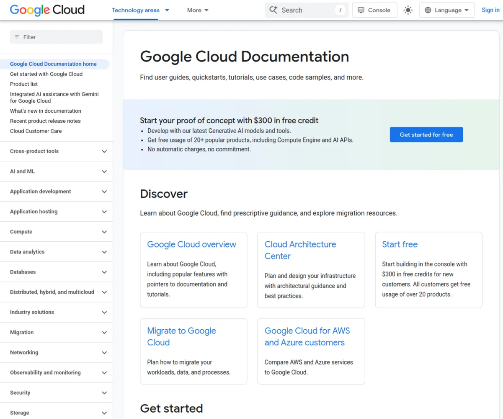</a> | [Google Cloud Documentation](references/21-google-cloud-documentation/README.md) · [official product](https://cloud.google.com/docs) | browser driven here, 3 named gaps | Cloud platform documentation | sidebar-content: Leading navigation or collection list beside a dominant content area. Panels: toolbar/header (top); navigation/list sidebar (leading); primary canvas/content (center). Density: low; confidence: high. | Study the product and solution navigation, task-focused quickstarts, code-language tabs, and links from conceptual guides to API references. |
| 22 |  | [Microsoft Azure Documentation](references/22-microsoft-azure-documentation/README.md) · [official product](https://learn.microsoft.com/en-us/azure/) | browser driven here, 3 named gaps | Cloud platform documentation | sidebar-content-inspector: Leading navigation, central work area, and trailing detail inspector. Panels: toolbar/header (top); navigation/list sidebar (leading); detail/inspector (trailing); primary canvas/content (center). Density: low; confidence: medium. | Study the product index, learning-path integration, scoped filtering, and task pages that combine prerequisites, commands, and next steps. |
| 23 |  | [Cloudflare Developer Documentation](references/23-cloudflare-developer-documentation/README.md) · [official product](https://developers.cloudflare.com/) | browser driven here, 3 named gaps | Edge platform documentation | sidebar-content-inspector: Leading navigation, central work area, and trailing detail inspector. Panels: toolbar/header (top); navigation/list sidebar (leading); detail/inspector (trailing); primary canvas/content (center). Density: low; confidence: medium. | Study the product-wide search, consistent left navigation, copyable configuration examples, and links connecting tutorials with API material. |
| 24 |  | [Vercel Documentation](references/24-vercel-documentation/README.md) · [official product](https://vercel.com/docs) | browser driven here, 3 named gaps | Deployment platform documentation | sidebar-content-inspector: Leading navigation, central work area, and trailing detail inspector. Panels: toolbar/header (top); navigation/list sidebar (leading); detail/inspector (trailing); primary canvas/content (center). Density: low; confidence: medium. | Study the framework-aware getting-started routes, searchable task hierarchy, and progressive links from deployment workflows to configuration reference. |
| 25 |  | [Netlify Docs](references/25-netlify-docs/README.md) · [official product](https://docs.netlify.com/) | browser driven here, 3 named gaps | Deployment platform documentation | sidebar-content-inspector: Leading navigation, central work area, and trailing detail inspector. Panels: toolbar/header (top); navigation/list sidebar (leading); detail/inspector (trailing); primary canvas/content (center). Density: low; confidence: medium. | Study the workflow-based navigation, contextual related resources, and code or configuration snippets organized around deployment tasks. |
| 26 |  | [Kubernetes Documentation](references/26-kubernetes-documentation/README.md) · [official product](https://kubernetes.io/docs/home/) | browser driven here, 3 named gaps | Infrastructure documentation | sidebar-content-inspector: Leading navigation, central work area, and trailing detail inspector. Panels: toolbar/header (top); navigation/list sidebar (leading); detail/inspector (trailing); primary canvas/content (center). Density: low; confidence: medium. | Study the concept-task-reference taxonomy, documentation version selector, glossary integration, and YAML examples tied to operational procedures. |
| 27 | <a href="https://docs.docker.com/">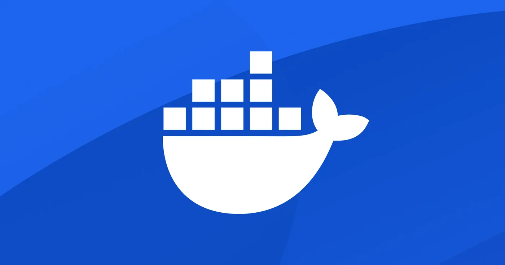</a> | [Docker Docs](references/27-docker-docs/README.md) · [official product](https://docs.docker.com/) | browser driven here, 3 named gaps | Infrastructure documentation | sidebar-content-inspector: Leading navigation, central work area, and trailing detail inspector. Panels: toolbar/header (top); status/action bar (bottom); navigation/list sidebar (leading); detail/inspector (trailing); primary canvas/content (center). Density: low; confidence: medium. | Study the product-oriented navigation, command reference links, multi-stage tutorials, and copyable CLI examples with explicit prerequisites. |
| 28 |  | [Terraform Documentation](references/28-terraform-documentation/README.md) · [official product](https://developer.hashicorp.com/terraform/docs) | browser driven here, 3 named gaps | Infrastructure as code documentation | sidebar-content-inspector: Leading navigation, central work area, and trailing detail inspector. Panels: toolbar/header (top); navigation/list sidebar (leading); detail/inspector (trailing); primary canvas/content (center). Density: low; confidence: medium. | Study the tutorial-to-reference pathways, provider and module discovery, version controls, and configuration examples with copy affordances. |
| 29 |  | [GitHub Docs](references/29-github-docs/README.md) · [official product](https://docs.github.com/en) | browser driven here, 3 named gaps | Developer platform documentation | sidebar-content-inspector: Leading navigation, central work area, and trailing detail inspector. Panels: toolbar/header (top); navigation/list sidebar (leading); detail/inspector (trailing); primary canvas/content (center). Density: low; confidence: medium. | Study the product and task taxonomy, plan and platform qualifiers, versioned Enterprise context, and procedural articles with troubleshooting branches. |
| 30 | <a href="https://docs.gitlab.com/">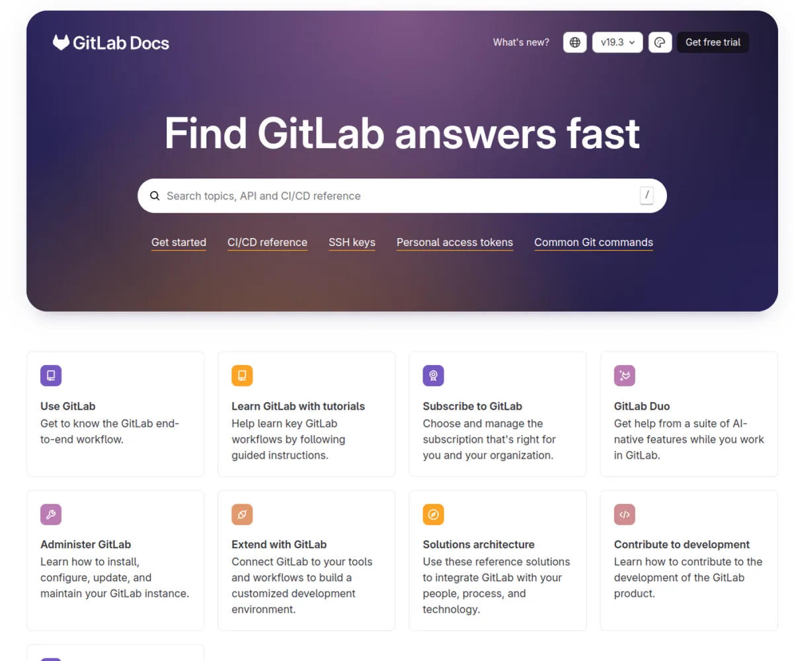</a> | [GitLab Docs](references/30-gitlab-docs/README.md) · [official product](https://docs.gitlab.com/) | browser driven here, 3 named gaps | DevOps platform documentation | sidebar-content-inspector: Leading navigation, central work area, and trailing detail inspector. Panels: toolbar/header (top); status/action bar (bottom); navigation/list sidebar (leading); detail/inspector (trailing); primary canvas/content (center). Density: low; confidence: medium. | Study the role-based topic structure, version-aware archives, searchable reference content, and stepwise procedures linked to related administration tasks. |
| 31 | <a href="https://docs.stripe.com/">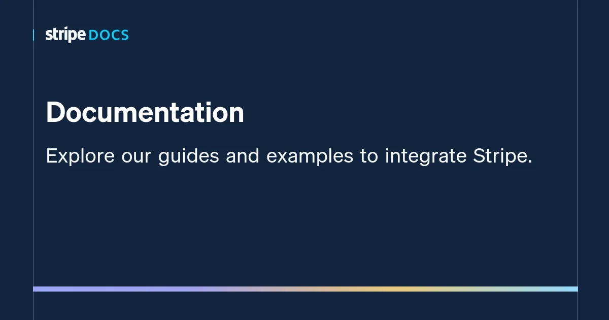</a> | [Stripe Documentation](references/31-stripe-documentation/README.md) · [official product](https://docs.stripe.com/) | browser driven here, 3 named gaps | Payments API documentation | sidebar-content: Leading navigation or collection list beside a dominant content area. Panels: toolbar/header (top); status/action bar (bottom); navigation/list sidebar (leading); primary canvas/content (center). Density: low; confidence: high. | Study the synchronized code-language tabs, test-mode workflows, interactive request examples, and progression from use-case guides to API objects. |
| 32 |  | [Twilio Documentation](references/32-twilio-documentation/README.md) · [official product](https://www.twilio.com/docs) | browser driven here, 3 named gaps | Communications API documentation | sidebar-content-inspector: Leading navigation, central work area, and trailing detail inspector. Panels: toolbar/header (top); status/action bar (bottom); navigation/list sidebar (leading); detail/inspector (trailing); primary canvas/content (center). Density: low; confidence: medium. | Study the product and use-case entry points, language-specific quickstarts, request examples, and direct routes into REST API reference. |
| 33 | <a href="https://shopify.dev/docs">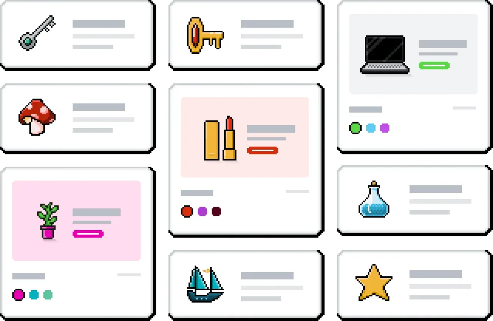</a> | [Shopify Developer Documentation](references/33-shopify-developer-documentation/README.md) · [official product](https://shopify.dev/docs) | browser driven here, 3 named gaps | Commerce platform documentation | sidebar-content-inspector: Leading navigation, central work area, and trailing detail inspector. Panels: toolbar/header (top); navigation/list sidebar (leading); detail/inspector (trailing); primary canvas/content (center). Density: low; confidence: medium. | Study the app-development task flows, API version labels, GraphQL examples, and contextual links among tutorials, tools, and reference schemas. |
| 34 | <a href="https://api.slack.com/docs">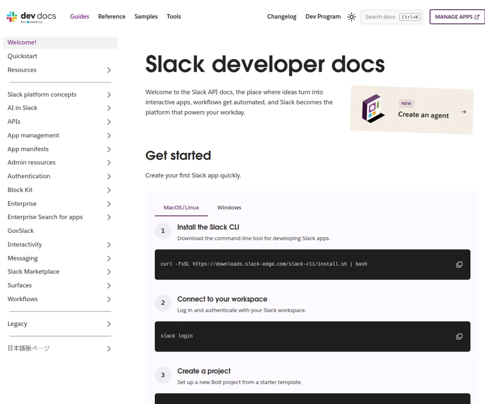</a> | [Slack API Documentation](references/34-slack-api-documentation/README.md) · [official product](https://api.slack.com/docs) | browser driven here, 3 named gaps | Collaboration API documentation | sidebar-content: Leading navigation or collection list beside a dominant content area. Panels: toolbar/header (top); status/action bar (bottom); navigation/list sidebar (leading); primary canvas/content (center). Density: low; confidence: high. | Study the platform-feature navigation, method and event references, token-scope metadata, and end-to-end app workflow guides. |
| 35 | <a href="https://platform.openai.com/docs/overview">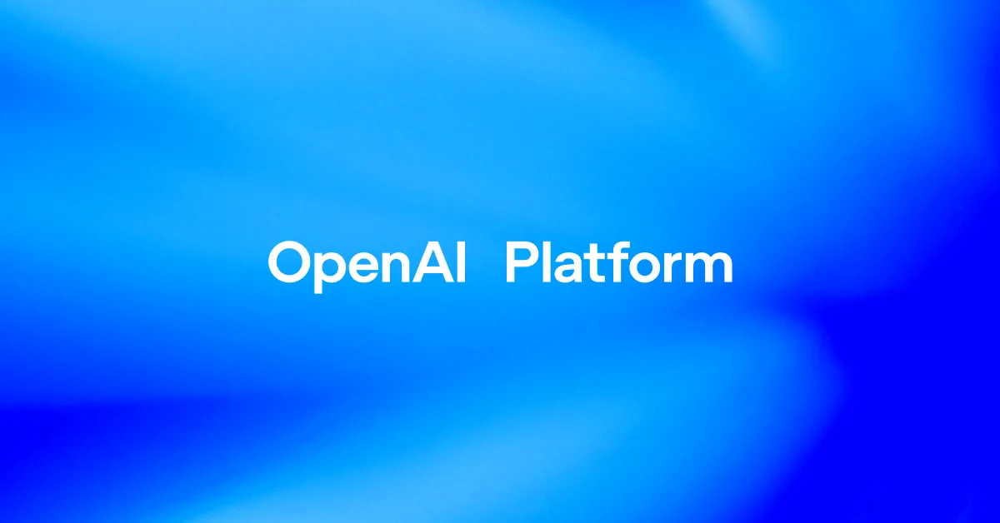</a> | [OpenAI API Documentation](references/35-openai-api-documentation/README.md) · [official product](https://platform.openai.com/docs/overview) | browser driven here, 3 named gaps | AI API documentation | sidebar-content-inspector: Leading navigation, central work area, and trailing detail inspector. Panels: toolbar/header (top); navigation/list sidebar (leading); detail/inspector (trailing); primary canvas/content (center). Density: low; confidence: medium. | Study the conceptual-to-task progression, language-specific code tabs, API reference cross-links, and expandable details for model capabilities. |
| 36 | <a href="https://docs.anthropic.com/en/docs/overview">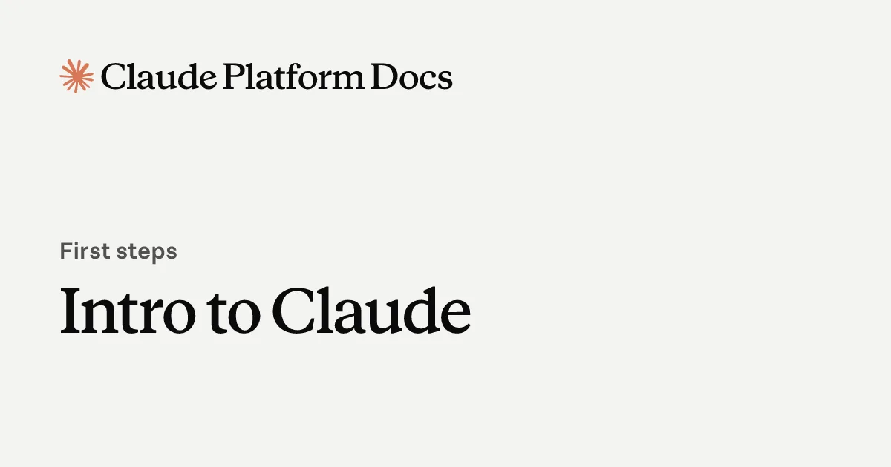</a> | [Anthropic API Documentation](references/36-anthropic-api-documentation/README.md) · [official product](https://docs.anthropic.com/en/docs/overview) | browser driven here, 3 named gaps | AI API documentation | sidebar-content: Leading navigation or collection list beside a dominant content area. Panels: toolbar/header (top); navigation/list sidebar (leading); primary canvas/content (center). Density: low; confidence: medium. | Study the task-oriented prompt and API guides, code-language examples, model context, and links from core concepts into endpoint reference. |
| 37 | <a href="https://huggingface.co/docs">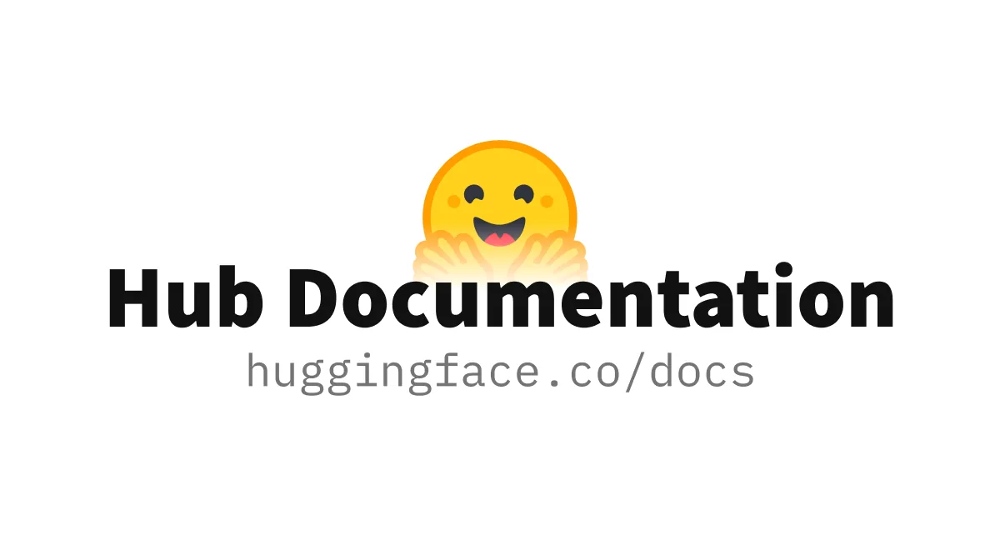</a> | [Hugging Face Documentation](references/37-hugging-face-documentation/README.md) · [official product](https://huggingface.co/docs) | browser driven here, 3 named gaps | Machine learning platform documentation | sidebar-content-inspector: Leading navigation, central work area, and trailing detail inspector. Panels: toolbar/header (top); navigation/list sidebar (leading); detail/inspector (trailing); primary canvas/content (center). Density: low; confidence: medium. | Study the library directory, documentation version selectors, task tutorials, and consistent bridges from conceptual guides to class reference. |
| 38 |  | [PostgreSQL Documentation](references/38-postgresql-documentation/README.md) · [official product](https://www.postgresql.org/docs/) | browser driven here, 3 named gaps | Database documentation | sidebar-content-inspector: Leading navigation, central work area, and trailing detail inspector. Panels: toolbar/header (top); navigation/list sidebar (leading); detail/inspector (trailing); primary canvas/content (center). Density: low; confidence: medium. | Study the release-version matrix, book-like chapter navigation, exhaustive indexes, and SQL examples embedded beside formal language reference. |
| 39 | <a href="https://www.mongodb.com/docs/">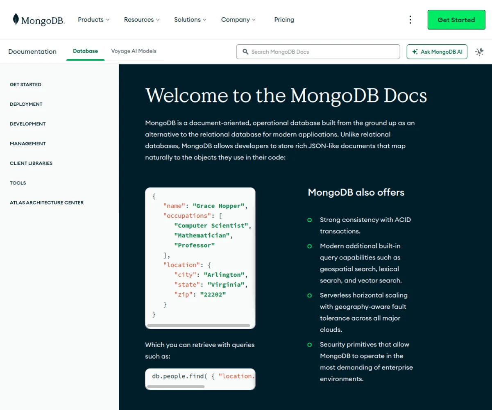</a> | [MongoDB Documentation](references/39-mongodb-documentation/README.md) · [official product](https://www.mongodb.com/docs/) | browser driven here, 3 named gaps | Database documentation | sidebar-content-inspector: Leading navigation, central work area, and trailing detail inspector. Panels: toolbar/header (top); status/action bar (bottom); navigation/list sidebar (leading); detail/inspector (trailing); data table/list (center). Density: low; confidence: medium. | Study the product selector, versioned manuals, deployment task guides, and executable query examples connected to operator and method reference. |
| 40 | <a href="https://redis.io/docs/latest/">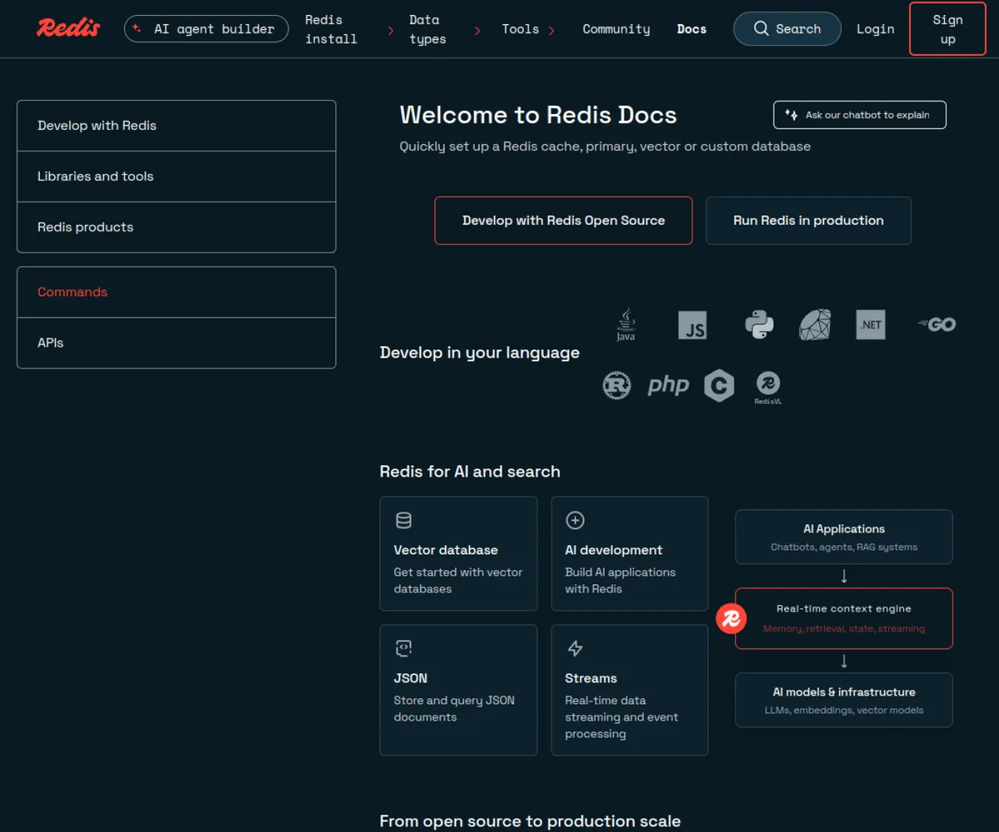</a> | [Redis Documentation](references/40-redis-documentation/README.md) · [official product](https://redis.io/docs/latest/) | browser driven here, 3 named gaps | Database documentation | sidebar-content: Leading navigation or collection list beside a dominant content area. Panels: toolbar/header (top); navigation/list sidebar (leading); primary canvas/content (center). Density: low; confidence: medium. | Study the develop-operate-reference organization, command search, data-type tutorials, and concise examples placed beside command semantics. |
| 41 | <a href="https://supabase.com/docs">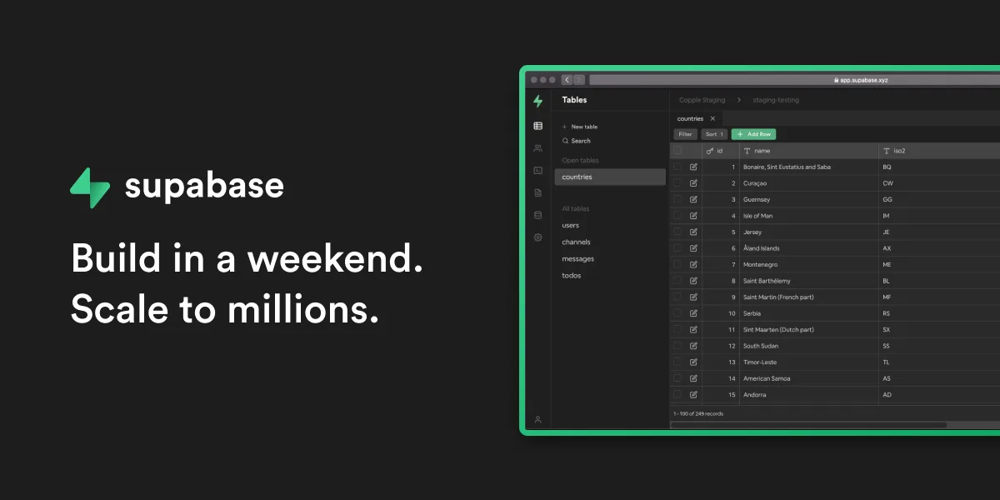</a> | [Supabase Documentation](references/41-supabase-documentation/README.md) · [official product](https://supabase.com/docs) | browser driven here, 3 named gaps | Backend platform documentation | sidebar-content-inspector: Leading navigation, central work area, and trailing detail inspector. Panels: toolbar/header (top); status/action bar (bottom); navigation/list sidebar (leading); detail/inspector (trailing); primary canvas/content (center). Density: low; confidence: medium. | Study the product-based sidebar, framework quickstarts, client-library code tabs, and task guides that link into generated API references. |
| 42 |  | [Firebase Documentation](references/42-firebase-documentation/README.md) · [official product](https://firebase.google.com/docs) | browser driven here, 3 named gaps | Backend platform documentation | sidebar-content-inspector: Leading navigation, central work area, and trailing detail inspector. Panels: toolbar/header (top); navigation/list sidebar (leading); detail/inspector (trailing); primary canvas/content (center). Density: low; confidence: medium. | Study the platform and product filters, guided setup flows, language-specific snippets, and navigation between solution guides and SDK reference. |
| 43 |  | [Elastic Documentation](references/43-elastic-documentation/README.md) · [official product](https://www.elastic.co/docs) | browser driven here, 3 named gaps | Search and observability documentation | sidebar-content-inspector: Leading navigation, central work area, and trailing detail inspector. Panels: toolbar/header (top); navigation/list sidebar (leading); detail/inspector (trailing); primary canvas/content (center). Density: low; confidence: medium. | Study the unified product documentation, version and deployment context, procedural examples, and pathways from operational tasks to API specifications. |
| 44 | <a href="https://grafana.com/docs/">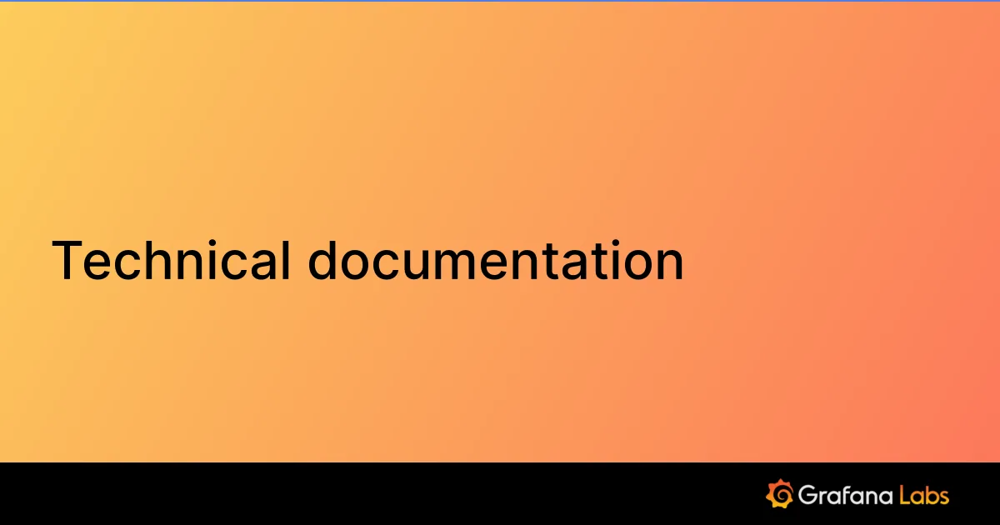</a> | [Grafana Documentation](references/44-grafana-documentation/README.md) · [official product](https://grafana.com/docs/) | browser driven here, 3 named gaps | Observability documentation | sidebar-content-inspector: Leading navigation, central work area, and trailing detail inspector. Panels: toolbar/header (top); status/action bar (bottom); navigation/list sidebar (leading); detail/inspector (trailing); primary canvas/content (center). Density: low; confidence: medium. | Study the product and version selectors, task-oriented administration guides, configuration examples, and links to HTTP API reference. |
| 45 | <a href="https://docs.datadoghq.com/">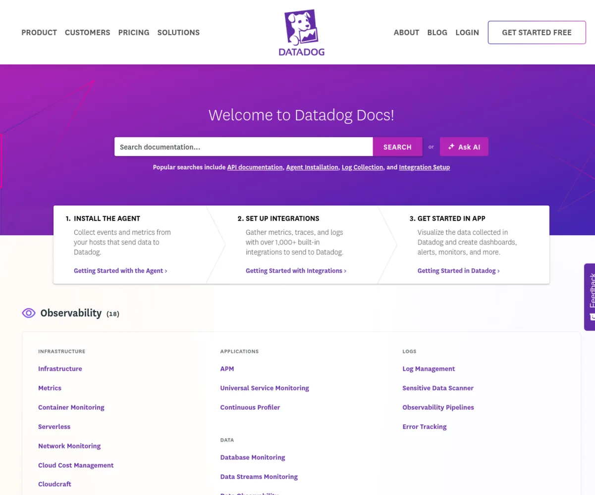</a> | [Datadog Documentation](references/45-datadog-documentation/README.md) · [official product](https://docs.datadoghq.com/) | browser driven here, 3 named gaps | Observability documentation | content-inspector: Dominant content area with a trailing detail or property inspector. Panels: toolbar/header (top); detail/inspector (trailing); primary canvas/content (center). Density: low; confidence: medium. | Study the product taxonomy, site-region context, integration filtering, and procedural pages combining UI steps, code, and API options. |
| 46 |  | [Material Design 3](references/46-material-design-3/README.md) · [official product](https://m3.material.io/) | browser driven here, 3 named gaps | Design system documentation | sidebar-content: Leading navigation or collection list beside a dominant content area. Panels: toolbar/header (top); navigation/list sidebar (leading); primary canvas/content (center). Density: low; confidence: high. | Study the component-versus-foundation navigation, interactive visual specifications, and progressive disclosure of anatomy, behavior, and implementation guidance. |
| 47 |  | [Carbon Design System](references/47-carbon-design-system/README.md) · [official product](https://carbondesignsystem.com/) | browser driven here, 3 named gaps | Design system documentation | sidebar-content-inspector: Leading navigation, central work area, and trailing detail inspector. Panels: toolbar/header (top); status/action bar (bottom); navigation/list sidebar (leading); detail/inspector (trailing); primary canvas/content (center). Density: low; confidence: medium. | Study the component status metadata, usage and style tabs, accessibility guidance, and clear routes from design decisions to implementation packages. |
| 48 |  | [Atlassian Design System](references/48-atlassian-design-system/README.md) · [official product](https://atlassian.design/) | browser driven here, 3 named gaps | Design system documentation | sidebar-content-inspector: Leading navigation, central work area, and trailing detail inspector. Panels: toolbar/header (top); navigation/list sidebar (leading); detail/inspector (trailing); primary canvas/content (center). Density: low; confidence: medium. | Study the foundations-components-content hierarchy, component behavior guidance, token references, and examples that expose usage decisions progressively. |
| 49 |  | [Shopify Polaris](references/49-shopify-polaris/README.md) · [official product](https://polaris.shopify.com/) | browser driven here, 3 named gaps | Design system documentation | content-inspector: Dominant content area with a trailing detail or property inspector. Panels: toolbar/header (top); status/action bar (bottom); detail/inspector (trailing); primary canvas/content (center). Density: low; confidence: medium. | Study the component guidance structure, foundations and content sections, and examples that connect interaction rationale to implementation details. |
| 50 | <a href="https://storybook.js.org/docs">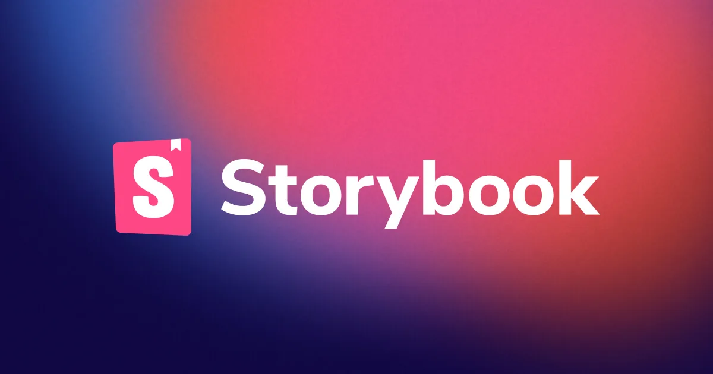</a> | [Storybook Documentation](references/50-storybook-documentation/README.md) · [official product](https://storybook.js.org/docs) | browser driven here, 3 named gaps | UI development tooling documentation | sidebar-content-inspector: Leading navigation, central work area, and trailing detail inspector. Panels: toolbar/header (top); navigation/list sidebar (leading); detail/inspector (trailing); primary canvas/content (center). Density: low; confidence: medium. | Study the framework selector, version-aware setup instructions, task recipes, and embedded examples linking authoring workflows to API configuration. |

Normalized panel bounds, detected separators, image dimensions, source-image URLs, hashes, and analysis confidence are recorded in [`sources.json`](sources.json). Media kinds, measured durations, provenance classes, and per-record gaps are in [`references.json`](references.json).

Attribution and product ownership remain with the linked source.
