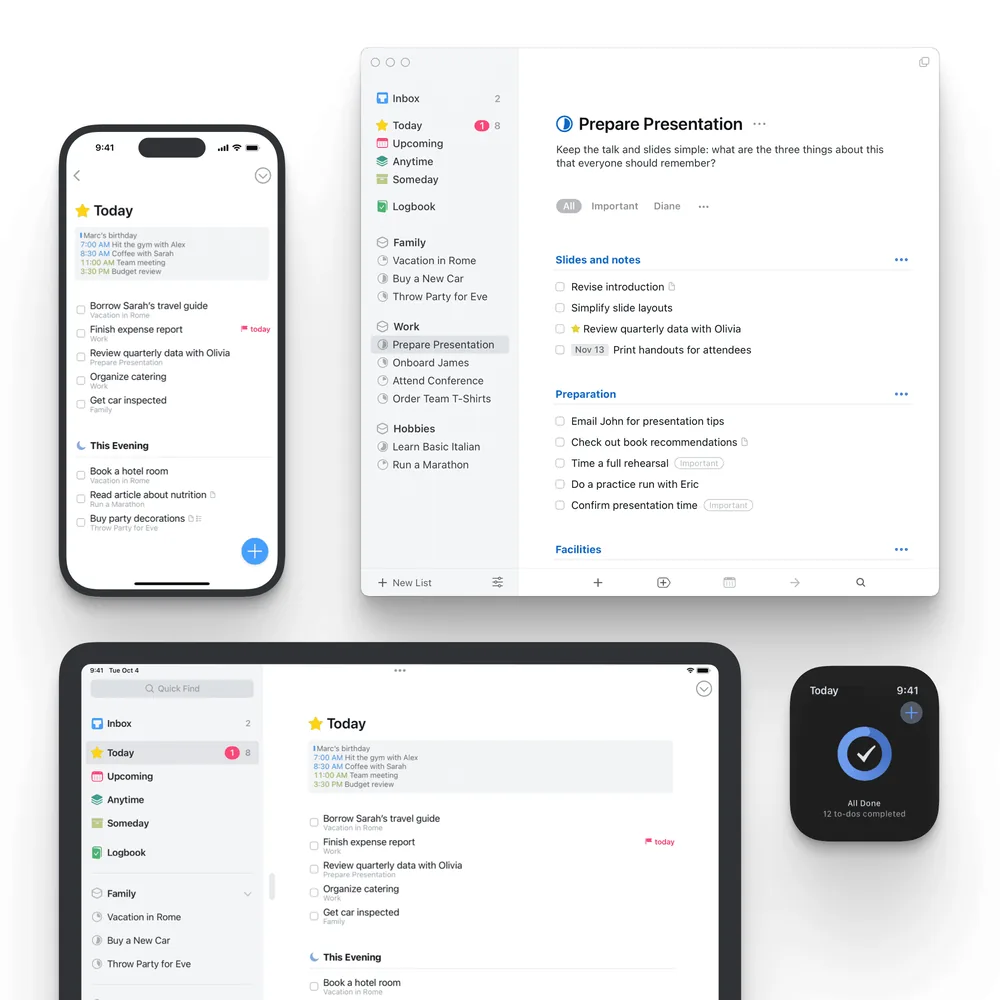
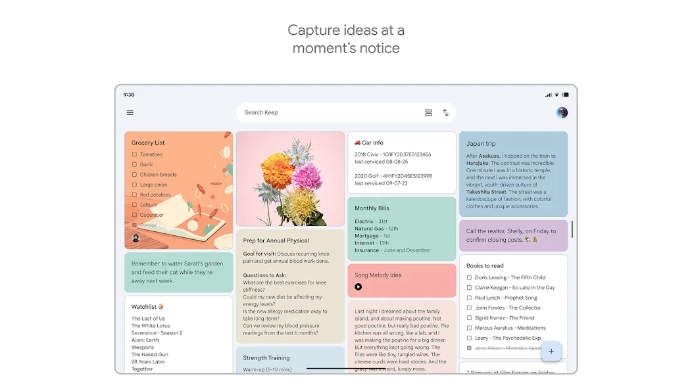
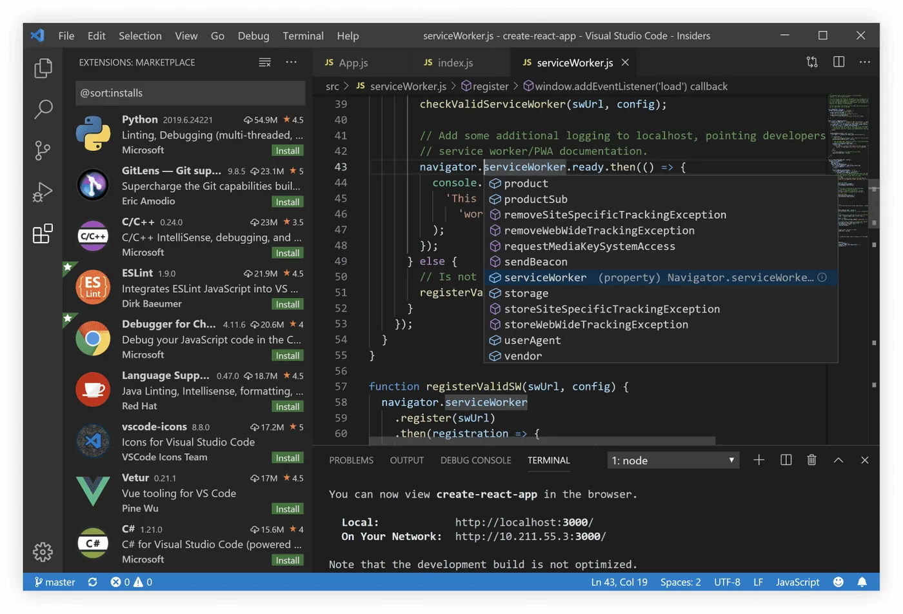
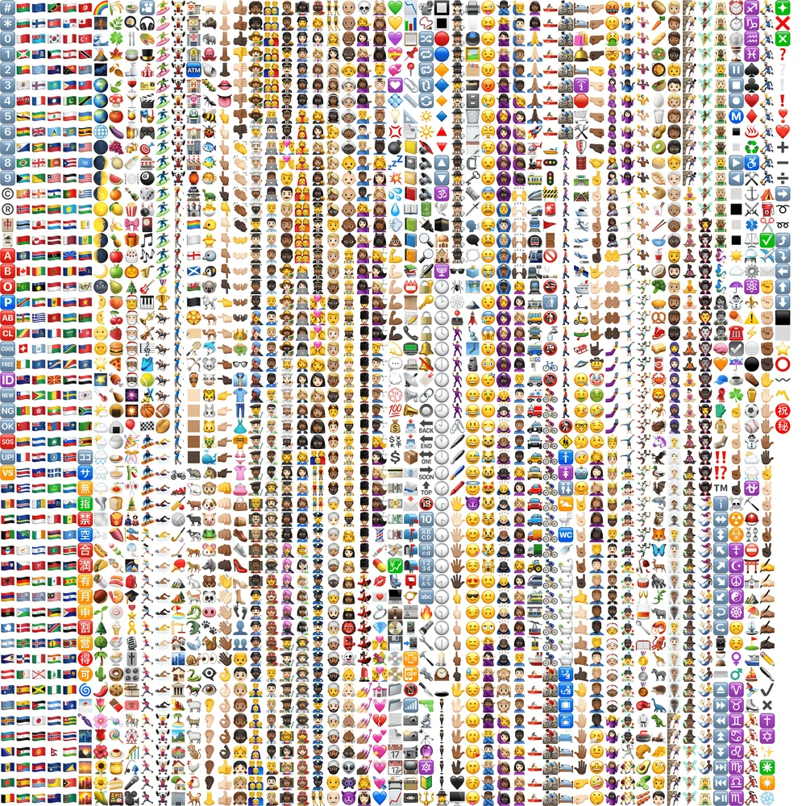
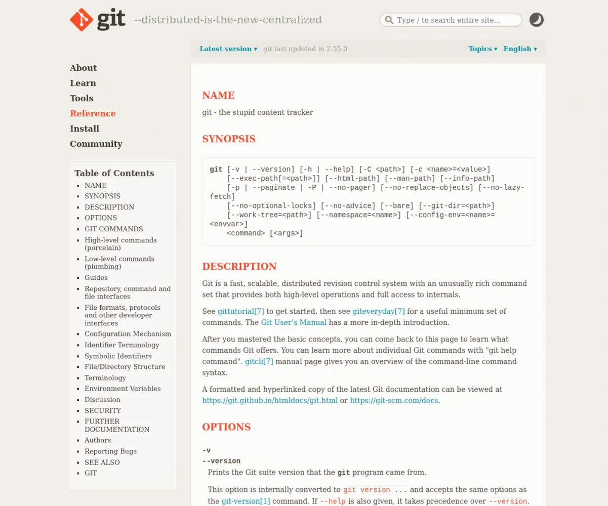
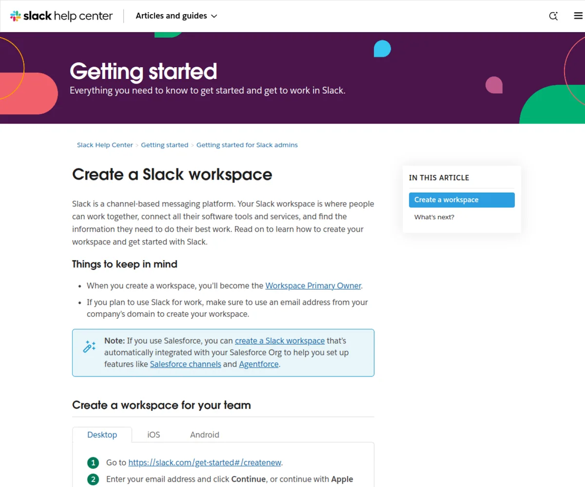
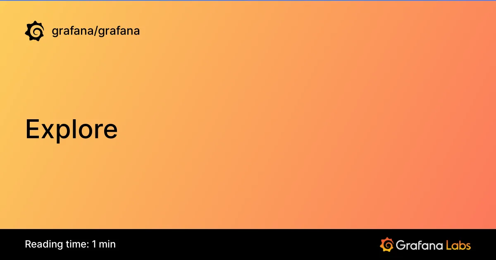
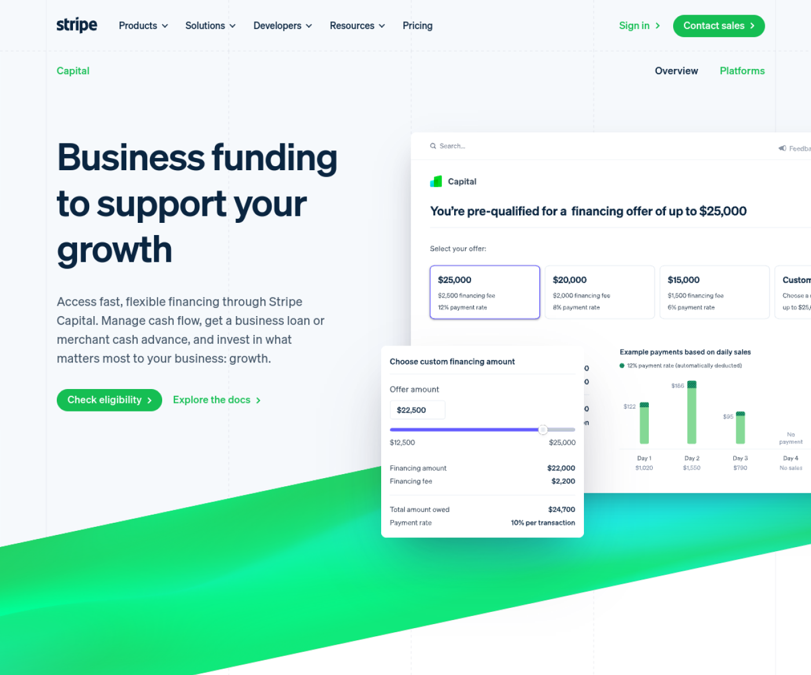

# Product interface example catalogs

A shared evidence library for choosing complete interaction models before product implementation. Each family pairs a curated visual field and measured panel anatomy with per-product records of motion, states, journey, interactions, recovery, accessibility, and provenance.

Motion evidence is labelled by how it was obtained, because the difference matters: 221 of 664 assets are a product driven on our own machines, the rest are recordings the product's owner published. A record still missing evidence is `partial` and carries the missing items in its own `evidence_gaps`; nothing is called complete on the strength of a marketing clip.

**Catalogs:** 15  
**Screenshots:** 655  
**Structural analyses:** 655  
**Records:** 655 (0 with no remaining gap, 655 partial)  
**Motion assets:** 664 (443 owner-published media, 148 browser driven here, 73 product run here)

| Reference family | Representative screen | Scope | Records | Motion provenance |
|---|---|---|---|---|
| [iOS app examples](ios-app-examples/full-reference.md) |  | Native iPhone and iPad product interfaces. | [0 complete / 50 partial](ios-app-examples/references.json) | 50 owner-published media |
| [Android app examples](android-app-examples/full-reference.md) |  | Native Android phone, tablet, foldable, and wearable interfaces. | [0 complete / 50 partial](android-app-examples/references.json) | 50 owner-published media |
| [macOS app examples](macos-app-examples/full-reference.md) |  | Native macOS applications, menu-bar utilities, and productivity tools. | [0 complete / 50 partial](macos-app-examples/references.json) | 50 owner-published media |
| [Desktop app examples](desktop-app-examples/full-reference.md) |  | Cross-platform desktop software across Electron, Qt, GTK, and native toolkits. | [0 complete / 50 partial](desktop-app-examples/references.json) | 46 browser driven here, 4 owner-published media |
| [Web app examples](web-app-examples/full-reference.md) |  | Browser-based products with application-grade workflows. | [0 complete / 50 partial](web-app-examples/references.json) | 50 owner-published media |
| [Dashboard and console examples](dashboard-console-examples/full-reference.md) |  | Operational dashboards, control planes, admin surfaces, and dense data consoles. | [0 complete / 50 partial](dashboard-console-examples/references.json) | 50 owner-published media |
| [TUI examples](tui-examples/full-reference.md) |  | Full-screen terminal interfaces with keyboard-first interaction. | [0 complete / 50 partial](tui-examples/references.json) | 27 owner-published media, 23 product run here |
| [CLI examples](cli-examples/full-reference.md) |  | Command-line interfaces designed for discoverability, composition, and automation. | [0 complete / 50 partial](cli-examples/references.json) | 50 product run here |
| [Onboarding and authentication examples](onboarding-auth-examples/full-reference.md) |  | Account creation, identity, workspace setup, provisioning, and first-success journeys. | [0 complete / 50 partial](onboarding-auth-examples/references.json) | 50 owner-published media |
| [Documentation site examples](documentation-site-examples/full-reference.md) |  | Product, API, framework, and platform documentation systems. | [0 complete / 50 partial](documentation-site-examples/references.json) | 50 browser driven here |
| [App store listing examples](app-store-listing-examples/full-reference.md) |  | Apple App Store and Google Play listings with strong product presentation. | [0 complete / 50 partial](app-store-listing-examples/references.json) | 50 browser driven here, 14 owner-published media |
| [Design system examples](design-system-examples/full-reference.md) |  | Public design systems and platform human-interface guidance. | [0 complete / 50 partial](design-system-examples/references.json) | 48 owner-published media, 2 browser driven here |
| [Report and evidence examples](report-evidence-examples/full-reference.md) |  | Reports, findings, traces, comparisons, and evidence viewers. | [0 complete / 50 partial](report-evidence-examples/references.json) | 50 owner-published media |
| [Landing page examples](landing-page-examples/full-reference.md) | — | Measured landing-page surfaces: captures at three review widths with DOM snapshots, per the family section of the evidence contract (full-reference-contract.md). | [0 complete / 0 partial](landing-page-examples/references.json) | scaffolded, no records yet |
| [Pricing & plans examples](pricing-page-examples/full-reference.md) |  | Product pricing and plan-comparison pages. | [0 complete / 5 partial](pricing-page-examples/references.json) | no measured motion |

Open a numbered per-product record for its motion evidence, named states, observed first-success journey, interactions, recovery, accessibility, and provenance. Read the family synthesis only after the underlying records.

Attribution and product ownership remain with the linked source.
