# iOS app examples

Native iPhone and iPad product interfaces.

Each entry pairs an attributed overview image and a measured panel anatomy with a per-product record: motion evidence, named states, an observed first-success journey, interaction and recovery behavior, accessibility observations, and provenance. Every number below is measured by `verify-reference-evidence.py`, and a record that is missing evidence says so in its own `evidence_gaps`.

**Examples:** 50  
**Images:** 50  
**Structural analyses:** 50  
**Records with no remaining gap:** 0  
**Records with named gaps:** 50 (54 gaps)  
**Motion provenance:** 50 owner-published media  
**Curated:** 2026-08-16  
**Visual source data:** [`sources.json`](sources.json)  
**Record index:** [`references.json`](references.json)  
**Cross-example synthesis:** [`full-reference.md`](full-reference.md)

| # | Reference image | Record | Motion evidence | Category | Interface structure | What to study |
|---:|---|---|---|---|---|---|
| 1 |  | [Things 3](references/01-things-3/README.md) · [official product](https://culturedcode.com/things/) | owner-published media, 2 named gaps | Productivity | mobile-single-column: Single-column mobile hierarchy with top context and a vertically scrolling primary surface. Panels: toolbar/header (top); scrolling content or app screen (center). Density: low; confidence: medium. | Study the Today and Upcoming hierarchy, plus the quick-entry sheet’s progressive disclosure for dates, tags, and projects. |
| 2 | <a href="https://www.todoist.com/">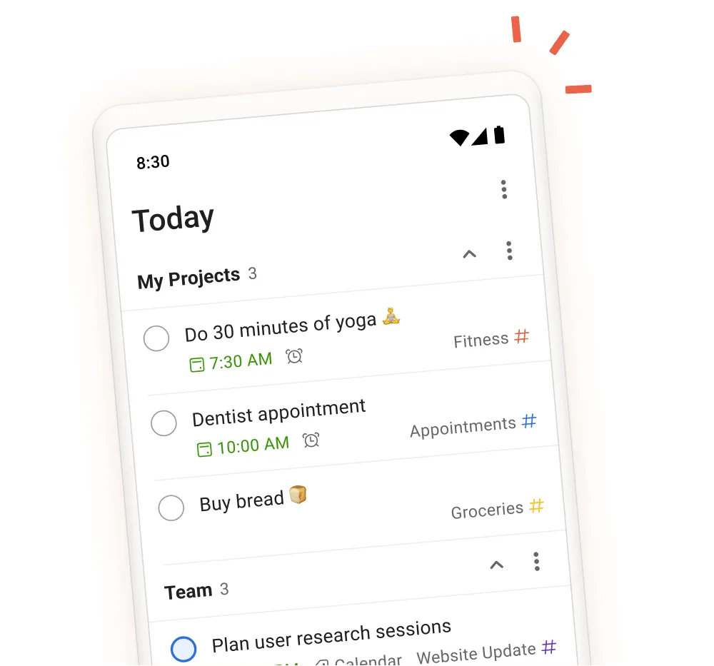</a> | [Todoist](references/02-todoist/README.md) · [official product](https://www.todoist.com/) | owner-published media, 1 named gaps | Productivity | mobile-single-column: Single-column mobile hierarchy with top context and a vertically scrolling primary surface. Panels: toolbar/header (top); bottom navigation/action area (bottom); scrolling content or app screen (center). Density: low; confidence: medium. | Study Quick Add for compact task capture and the navigation between Inbox, projects, labels, filters, and scheduled views. |
| 3 |  | [Notion](references/03-notion/README.md) · [official product](https://www.notion.so/product) | owner-published media, 2 named gaps | Productivity | mobile-single-column: Single-column mobile hierarchy with top context and a vertically scrolling primary surface. Panels: toolbar/header (top); scrolling content or app screen (center). Density: low; confidence: medium. | Study how workspace and page hierarchy compresses onto iPhone, including block insertion, reordering, and slash-command discovery. |
| 4 | <a href="https://bear.app/">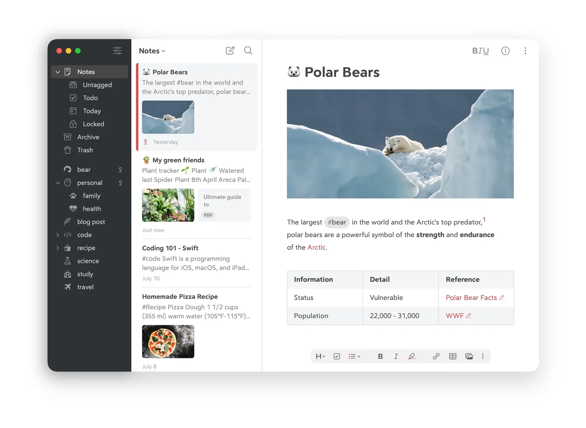</a> | [Bear](references/04-bear/README.md) · [official product](https://bear.app/) | owner-published media, 1 named gaps | Productivity | mobile-single-column: Single-column mobile hierarchy with top context and a vertically scrolling primary surface. Panels: toolbar/header (top); bottom navigation/action area (bottom); scrolling content or app screen (center). Density: low; confidence: medium. | Study nested-tag navigation and the editing keyboard’s formatting shortcuts, which keep Markdown-oriented actions close to the cursor. |
| 5 |  | [Craft](references/05-craft/README.md) · [official product](https://www.craft.do/) | owner-published media, 1 named gaps | Productivity | mobile-single-column: Single-column mobile hierarchy with top context and a vertically scrolling primary surface. Panels: toolbar/header (top); scrolling content or app screen (center). Density: low; confidence: medium. | Study card-to-page navigation and block-level editing, especially insertion, selection, reordering, and contextual formatting on iPhone. |
| 6 | <a href="https://flexibits.com/fantastical">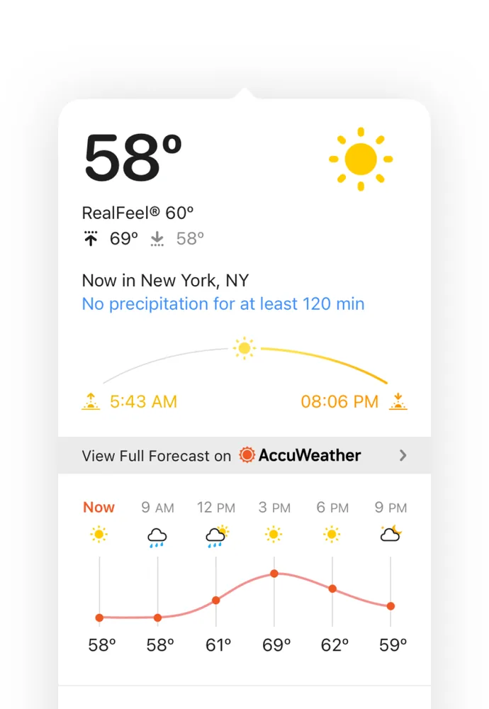</a> | [Fantastical](references/06-fantastical/README.md) · [official product](https://flexibits.com/fantastical) | owner-published media, 1 named gaps | Productivity | mobile-single-column: Single-column mobile hierarchy with top context and a vertically scrolling primary surface. Panels: toolbar/header (top); bottom navigation/action area (bottom); scrolling content or app screen (center). Density: low; confidence: medium. | Study the combined calendar-and-task timeline and the natural-language event composer’s handling of time, location, and invitees. |
| 7 |  | [Microsoft 365 Copilot](references/07-microsoft-365-copilot/README.md) · [official product](https://www.microsoft.com/en-us/microsoft-365-copilot/download-copilot-app) | owner-published media, 1 named gaps | Productivity | mobile-single-column: Single-column mobile hierarchy with top context and a vertically scrolling primary surface. Panels: toolbar/header (top); bottom navigation/action area (bottom); scrolling content or app screen (center). Density: low; confidence: medium. | Study the mobile hub architecture connecting recent documents, search, capture, scanning, and create actions across file types. |
| 8 | <a href="https://www.dropbox.com/mobile">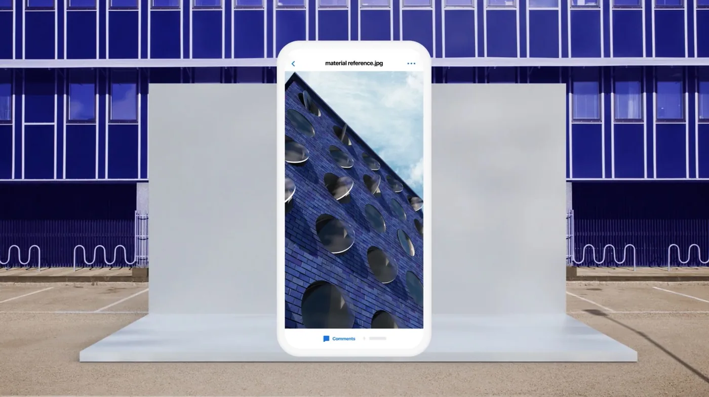</a> | [Dropbox](references/08-dropbox/README.md) · [official product](https://www.dropbox.com/mobile) | owner-published media, 1 named gaps | Productivity | mobile-single-column: Single-column mobile hierarchy with top context and a vertically scrolling primary surface. Panels: toolbar/header (top); bottom navigation/action area (bottom); scrolling content or app screen (center). Density: low; confidence: medium. | Study the separation of Home, Files, and Photos, plus contextual file actions such as sharing, offline access, and scanning. |
| 9 |  | [Slack](references/09-slack/README.md) · [official product](https://slack.com/downloads/ios) | owner-published media, 1 named gaps | Communication | mobile-single-column: Single-column mobile hierarchy with top context and a vertically scrolling primary surface. Panels: toolbar/header (top); scrolling content or app screen (center). Density: low; confidence: medium. | Study workspace and channel hierarchy, unread navigation, threaded replies, and how the composer exposes attachments and mentions. |
| 10 |  | [Discord](references/10-discord/README.md) · [official product](https://discord.com/) | owner-published media, 1 named gaps | Communication | mobile-single-column: Single-column mobile hierarchy with top context and a vertically scrolling primary surface. Panels: toolbar/header (top); scrolling content or app screen (center). Density: low; confidence: medium. | Study the server-to-channel information hierarchy and transitions among text threads, member context, direct messages, and voice rooms. |
| 11 |  | [Signal](references/11-signal/README.md) · [official product](https://signal.org/) | owner-published media, 1 named gaps | Communication | mobile-single-column: Single-column mobile hierarchy with top context and a vertically scrolling primary surface. Panels: toolbar/header (top); bottom navigation/action area (bottom); scrolling content or app screen (center). Density: medium; confidence: medium. | Study the focused conversation-list-to-thread flow, attachment sheet, safety-number access, and disappearing-message timer controls. |
| 12 | <a href="https://telegram.org/">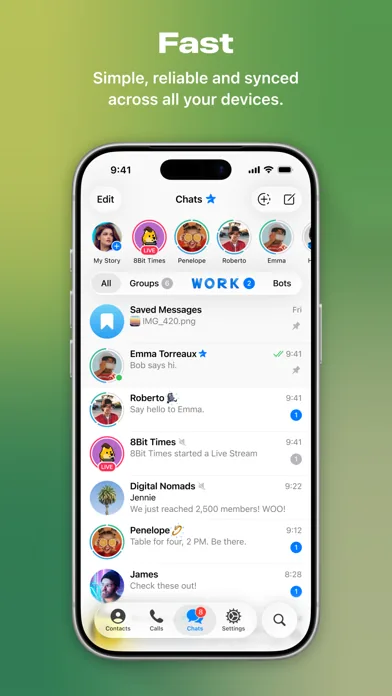</a> | [Telegram Messenger](references/12-telegram-messenger/README.md) · [official product](https://telegram.org/) | owner-published media, 1 named gaps | Communication | mobile-single-column: Single-column mobile hierarchy with top context and a vertically scrolling primary surface. Panels: toolbar/header (top); bottom navigation/action area (bottom); scrolling content or app screen (center). Density: medium; confidence: medium. | Study chat folders, conversation-level search, message action menus, and the attachment sheet’s organization of media and files. |
| 13 |  | [WhatsApp Messenger](references/13-whatsapp-messenger/README.md) · [official product](https://www.whatsapp.com/) | owner-published media, 1 named gaps | Communication | mobile-single-column: Single-column mobile hierarchy with top context and a vertically scrolling primary surface. Panels: toolbar/header (top); scrolling content or app screen (center). Density: low; confidence: medium. | Study the tab-level separation of chats, updates, communities, and calls, plus message reply, reaction, forwarding, and attachment actions. |
| 14 |  | [Zoom Workplace](references/14-zoom-workplace/README.md) · [official product](https://www.zoom.com/en/products/virtual-meetings/) | owner-published media, 1 named gaps | Communication | mobile-single-column: Single-column mobile hierarchy with top context and a vertically scrolling primary surface. Panels: toolbar/header (top); scrolling content or app screen (center). Density: medium; confidence: medium. | Study the join-versus-start meeting entry points and the in-call interface’s revealable controls, participant list, and device-state feedback. |
| 15 |  | [Revolut](references/15-revolut/README.md) · [official product](https://www.revolut.com/) | owner-published media, 1 named gaps | Finance | mobile-single-column: Single-column mobile hierarchy with top context and a vertically scrolling primary surface. Panels: toolbar/header (top); bottom navigation/action area (bottom); scrolling content or app screen (center). Density: low; confidence: medium. | Study account switching, balance and transaction hierarchy, and the staged transfer flow for recipient, currency, amount, and confirmation. |
| 16 |  | [Wise](references/16-wise/README.md) · [official product](https://wise.com/) | owner-published media, 1 named gaps | Finance | mobile-single-column: Single-column mobile hierarchy with top context and a vertically scrolling primary surface. Panels: toolbar/header (top); scrolling content or app screen (center). Density: low; confidence: medium. | Study multi-currency balance cards and the send-money flow, especially amount conversion, fee disclosure, recipient selection, and review. |
| 17 |  | [PayPal](references/17-paypal/README.md) · [official product](https://www.paypal.com/us/digital-wallet) | owner-published media, 1 named gaps | Finance | mobile-single-column: Single-column mobile hierarchy with top context and a vertically scrolling primary surface. Panels: toolbar/header (top); bottom navigation/action area (bottom); scrolling content or app screen (center). Density: low; confidence: medium. | Study the relationship among Home, Wallet, and Activity, plus the mirrored send-and-request flows and their confirmation states. |
| 18 |  | [Coinbase](references/18-coinbase/README.md) · [official product](https://www.coinbase.com/) | owner-published media, 1 named gaps | Finance | mobile-single-column: Single-column mobile hierarchy with top context and a vertically scrolling primary surface. Panels: toolbar/header (top); scrolling content or app screen (center). Density: low; confidence: medium. | Study watchlist-to-asset-detail navigation and the trade sheet’s progression through asset, amount, payment source, preview, and confirmation. |
| 19 | <a href="https://www.ynab.com/">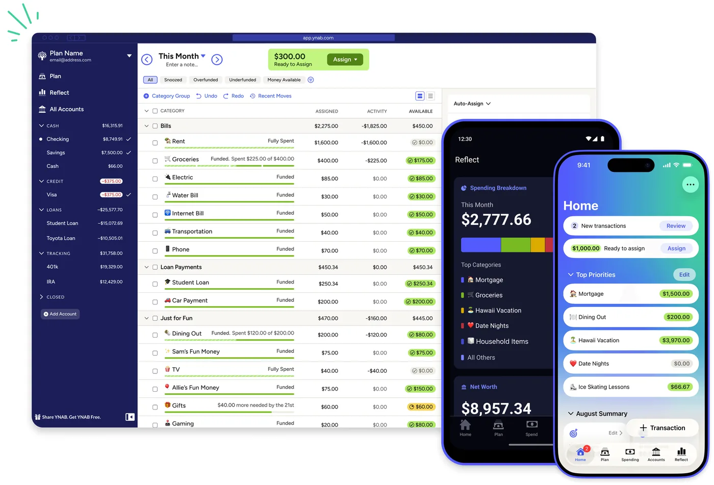</a> | [YNAB](references/19-ynab/README.md) · [official product](https://www.ynab.com/) | owner-published media, 1 named gaps | Finance | mobile-single-column: Single-column mobile hierarchy with top context and a vertically scrolling primary surface. Panels: toolbar/header (top); bottom navigation/action area (bottom); scrolling content or app screen (center). Density: low; confidence: medium. | Study grouped budget categories, status indicators, and the Assign Money interaction for moving limited funds between competing priorities. |
| 20 | <a href="https://www.splitwise.com/">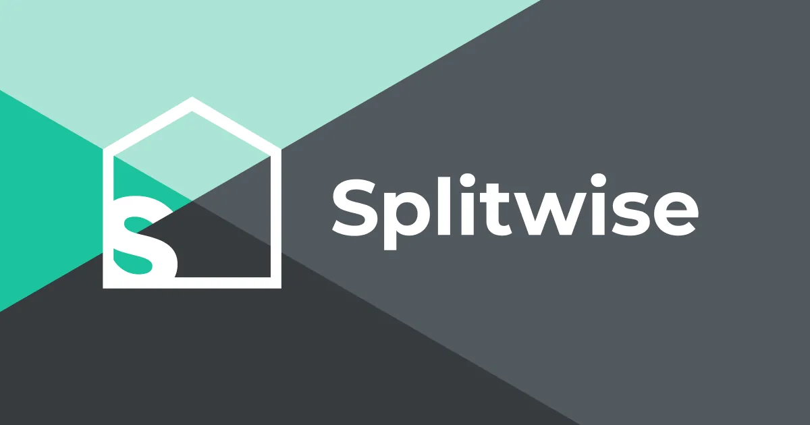</a> | [Splitwise](references/20-splitwise/README.md) · [official product](https://www.splitwise.com/) | owner-published media, 1 named gaps | Finance | mobile-single-column: Single-column mobile hierarchy with top context and a vertically scrolling primary surface. Panels: toolbar/header (top); scrolling content or app screen (center). Density: low; confidence: medium. | Study navigation among groups, friends, and activity, plus expense entry for payer selection, split methods, notes, and settlement. |
| 21 | <a href="https://www.apple.com/ios/health/">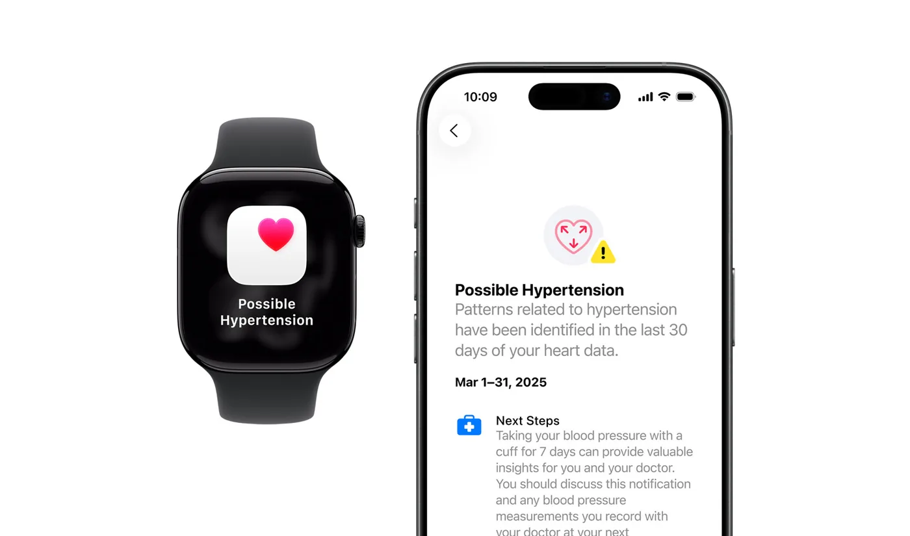</a> | [Apple Health](references/21-apple-health/README.md) · [official product](https://www.apple.com/ios/health/) | owner-published media, 1 named gaps | Health | mobile-single-column: Single-column mobile hierarchy with top context and a vertically scrolling primary surface. Panels: toolbar/header (top); bottom navigation/action area (bottom); scrolling content or app screen (center). Density: low; confidence: medium. | Study the Summary, Sharing, and Browse architecture, including trend cards, pinned metrics, source attribution, and drill-down charts. |
| 22 |  | [Strava](references/22-strava/README.md) · [official product](https://www.strava.com/mobile) | owner-published media, 1 named gaps | Health | mobile-single-column: Single-column mobile hierarchy with top context and a vertically scrolling primary surface. Panels: toolbar/header (top); scrolling content or app screen (center). Density: low; confidence: medium. | Study activity recording with live metrics and the post-activity summary’s organization of route, splits, effort, media, and social feedback. |
| 23 |  | [Headspace](references/23-headspace/README.md) · [official product](https://www.headspace.com/) | owner-published media, 1 named gaps | Health | mobile-single-column: Single-column mobile hierarchy with top context and a vertically scrolling primary surface. Panels: toolbar/header (top); bottom navigation/action area (bottom); scrolling content or app screen (center). Density: low; confidence: medium. | Study the Today plan and browse taxonomy, then examine session setup and the audio player’s progress, pause, and completion states. |
| 24 |  | [Calm](references/24-calm/README.md) · [official product](https://www.calm.com/) | owner-published media, 1 named gaps | Health | mobile-single-column: Single-column mobile hierarchy with top context and a vertically scrolling primary surface. Panels: toolbar/header (top); scrolling content or app screen (center). Density: low; confidence: medium. | Study content discovery by goal and duration, plus the session player’s handling of narration, ambient sound, timing, and downloads. |
| 25 |  | [MyFitnessPal](references/25-myfitnesspal/README.md) · [official product](https://www.myfitnesspal.com/) | owner-published media, 1 named gaps | Health | mobile-single-column: Single-column mobile hierarchy with top context and a vertically scrolling primary surface. Panels: toolbar/header (top); bottom navigation/action area (bottom); scrolling content or app screen (center). Density: medium; confidence: medium. | Study the food diary’s meal-based grouping and quick-add paths for search, barcode scanning, recent foods, quantities, and nutrition review. |
| 26 |  | [Nike Run Club](references/26-nike-run-club/README.md) · [official product](https://www.nike.com/nrc-app) | owner-published media, 2 named gaps | Health | mobile-single-column: Single-column mobile hierarchy with top context and a vertically scrolling primary surface. Panels: toolbar/header (top); scrolling content or app screen (center). Density: low; confidence: medium. | Study guided-run discovery, pre-run configuration, live pace and distance feedback, pause controls, and the post-run recap flow. |
| 27 | <a href="https://procreate.com/pocket">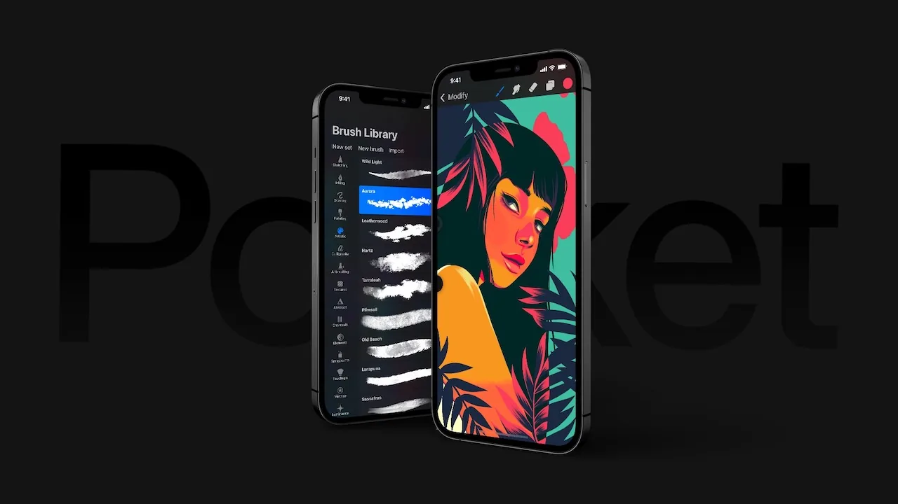</a> | [Procreate Pocket](references/27-procreate-pocket/README.md) · [official product](https://procreate.com/pocket) | owner-published media, 1 named gaps | Creativity | mobile-single-column: Single-column mobile hierarchy with top context and a vertically scrolling primary surface. Panels: toolbar/header (top); scrolling content or app screen (center). Density: low; confidence: medium. | Study the gesture-first canvas and compact access to brushes, colors, layers, transforms, undo, and full-screen drawing on iPhone. |
| 28 |  | [Adobe Lightroom for mobile](references/28-adobe-lightroom-for-mobile/README.md) · [official product](https://www.adobe.com/products/photoshop-lightroom/mobile.html) | owner-published media, 1 named gaps | Creativity | mobile-single-column: Single-column mobile hierarchy with top context and a vertically scrolling primary surface. Panels: toolbar/header (top); bottom navigation/action area (bottom); scrolling content or app screen (center). Density: low; confidence: medium. | Study the flow from library and import into editing, especially the bottom tool strip, nested adjustments, presets, masking, and compare states. |
| 29 |  | [Canva](references/29-canva/README.md) · [official product](https://apps.apple.com/us/app/canva-ai-photo-video-editor/id897446215) | owner-published media, 1 named gaps | Creativity | mobile-single-column: Single-column mobile hierarchy with top context and a vertically scrolling primary surface. Panels: toolbar/header (top); bottom navigation/action area (bottom); scrolling content or app screen (center). Density: low; confidence: medium. | Study template-led creation and the mobile editor’s object selection, contextual bottom toolbar, layer ordering, page management, and export. |
| 30 | <a href="https://www.capcut.com/">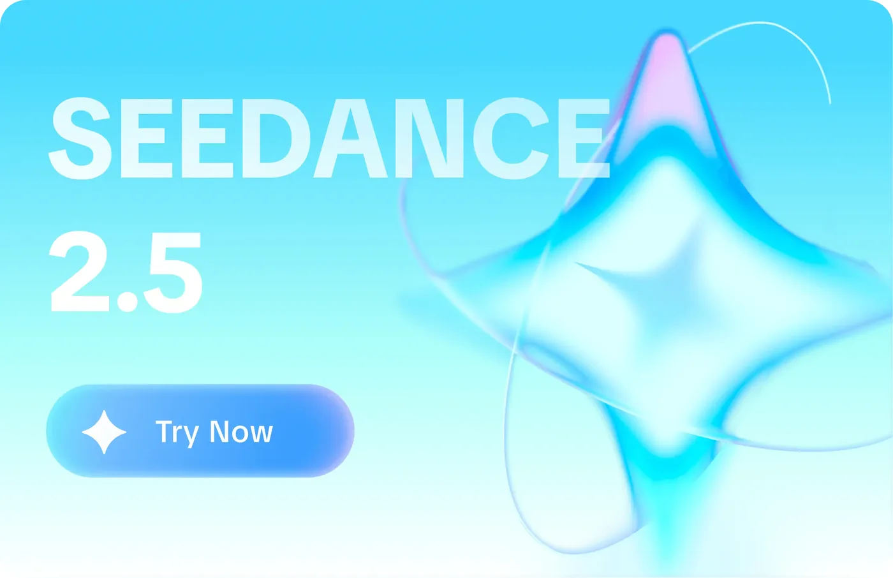</a> | [CapCut](references/30-capcut/README.md) · [official product](https://www.capcut.com/) | owner-published media, 1 named gaps | Creativity | mobile-single-column: Single-column mobile hierarchy with top context and a vertically scrolling primary surface. Panels: toolbar/header (top); bottom navigation/action area (bottom); scrolling content or app screen (center). Density: low; confidence: medium. | Study multitrack timeline manipulation, clip selection, playhead behavior, and the contextual tool tray for cuts, effects, text, and audio. |
| 31 |  | [VSCO](references/31-vsco/README.md) · [official product](https://www.vsco.co/) | owner-published media, 1 named gaps | Creativity | mobile-single-column: Single-column mobile hierarchy with top context and a vertically scrolling primary surface. Panels: toolbar/header (top); scrolling content or app screen (center). Density: low; confidence: medium. | Study the Studio-to-editor flow, preset intensity controls, adjustment history, before-and-after comparison, and publishing handoff. |
| 32 | <a href="https://concepts.app/en/">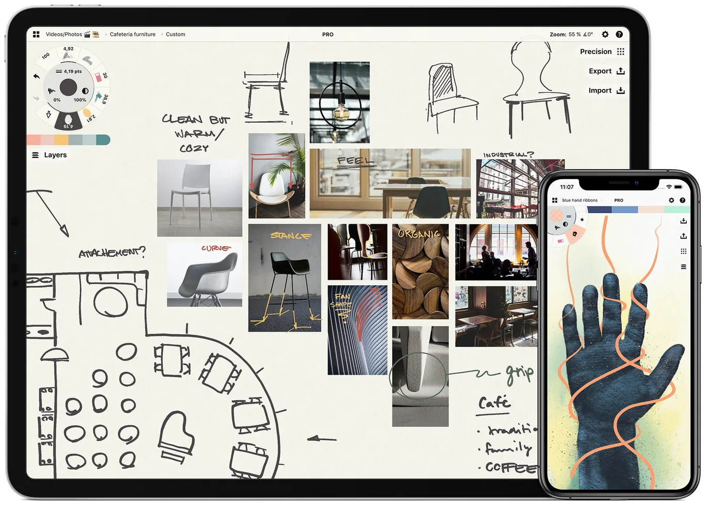</a> | [Concepts](references/32-concepts/README.md) · [official product](https://concepts.app/en/) | owner-published media, 1 named gaps | Creativity | mobile-single-column: Single-column mobile hierarchy with top context and a vertically scrolling primary surface. Panels: toolbar/header (top); scrolling content or app screen (center). Density: medium; confidence: medium. | Study infinite-canvas navigation and the tool wheel, including brush customization, precision guides, object selection, layers, and export. |
| 33 |  | [1Password for iOS](references/33-1password-for-ios/README.md) · [official product](https://1password.com/downloads/ios/) | owner-published media, 1 named gaps | Utilities | mobile-single-column: Single-column mobile hierarchy with top context and a vertically scrolling primary surface. Panels: toolbar/header (top); bottom navigation/action area (bottom); scrolling content or app screen (center). Density: low; confidence: medium. | Study vault and item hierarchy, search, favorite access, secure-field reveal and copy behavior, and the handoff to system AutoFill. |
| 34 | <a href="https://bitwarden.com/download/">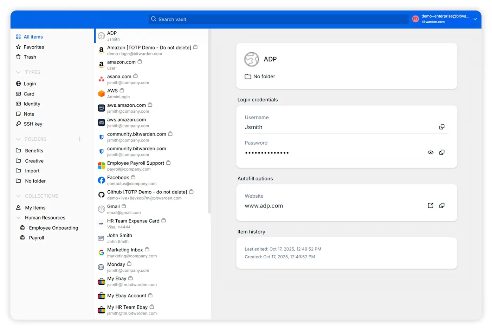</a> | [Bitwarden](references/34-bitwarden/README.md) · [official product](https://bitwarden.com/download/) | owner-published media, 2 named gaps | Utilities | mobile-single-column: Single-column mobile hierarchy with top context and a vertically scrolling primary surface. Panels: toolbar/header (top); scrolling content or app screen (center). Density: low; confidence: medium. | Study navigation among Vault, Send, Generator, and Settings, plus item-detail actions for copying, launching, editing, and autofilling credentials. |
| 35 |  | [Halide](references/35-halide/README.md) · [official product](https://halide.cam/) | owner-published media, 1 named gaps | Utilities | mobile-single-column: Single-column mobile hierarchy with top context and a vertically scrolling primary surface. Panels: toolbar/header (top); bottom navigation/action area (bottom); scrolling content or app screen (center). Density: low; confidence: medium. | Study the direct-manipulation camera interface, particularly focus and exposure gestures, manual controls, capture feedback, and photo review. |
| 36 |  | [Flighty](references/36-flighty/README.md) · [official product](https://www.flightyapp.com/) | owner-published media, 1 named gaps | Utilities | mobile-single-column: Single-column mobile hierarchy with top context and a vertically scrolling primary surface. Panels: toolbar/header (top); bottom navigation/action area (bottom); scrolling content or app screen (center). Density: low; confidence: medium. | Study the itinerary timeline, flight-status card hierarchy, delay and gate-change alerts, and progressive detail around each trip segment. |
| 37 | <a href="https://www.meetcarrot.com/weather/">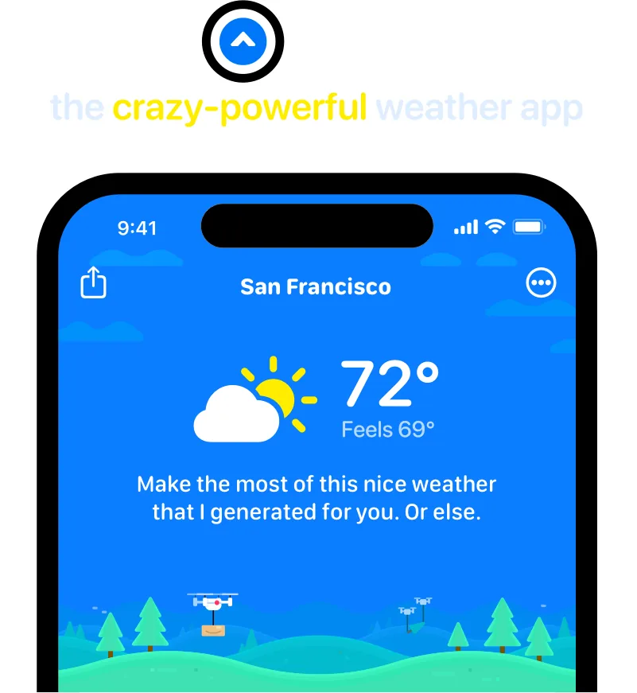</a> | [CARROT Weather](references/37-carrot-weather/README.md) · [official product](https://www.meetcarrot.com/weather/) | owner-published media, 1 named gaps | Utilities | mobile-single-column: Single-column mobile hierarchy with top context and a vertically scrolling primary surface. Panels: toolbar/header (top); scrolling content or app screen (center). Density: low; confidence: medium. | Study the vertically scanned forecast, modular weather cards, location switching, data-source details, and alert presentation on a small screen. |
| 38 |  | [Spotify](references/38-spotify/README.md) · [official product](https://www.spotify.com/us/download/other/) | owner-published media, 1 named gaps | Media | mobile-single-column: Single-column mobile hierarchy with top context and a vertically scrolling primary surface. Panels: toolbar/header (top); scrolling content or app screen (center). Density: low; confidence: medium. | Study the Home, Search, and Library architecture, plus the Now Playing screen’s queue, device picker, scrubber, and expandable context. |
| 39 | <a href="https://help.netflix.com/en/node/23927">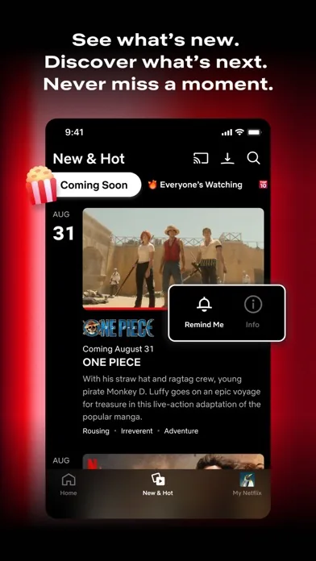</a> | [Netflix](references/39-netflix/README.md) · [official product](https://help.netflix.com/en/node/23927) | owner-published media, 1 named gaps | Media | mobile-single-column: Single-column mobile hierarchy with top context and a vertically scrolling primary surface. Panels: toolbar/header (top); scrolling content or app screen (center). Density: low; confidence: medium. | Study profile selection, shelf-based browsing, title-detail hierarchy, download states, and the video player’s transport and episode controls. |
| 40 |  | [YouTube](references/40-youtube/README.md) · [official product](https://apps.apple.com/us/app/youtube-watch-listen-stream/id544007664) | owner-published media, 1 named gaps | Media | mobile-single-column: Single-column mobile hierarchy with top context and a vertically scrolling primary surface. Panels: toolbar/header (top); scrolling content or app screen (center). Density: low; confidence: medium. | Study bottom-tab navigation, feed-to-player transitions, portrait and landscape playback, and layered access to comments, chapters, and queue. |
| 41 |  | [Pocket Casts](references/41-pocket-casts/README.md) · [official product](https://pocketcasts.com/) | owner-published media, 1 named gaps | Media | mobile-single-column: Single-column mobile hierarchy with top context and a vertically scrolling primary surface. Panels: toolbar/header (top); scrolling content or app screen (center). Density: low; confidence: medium. | Study navigation among Podcasts, Filters, Discover, and Profile, plus the player’s Up Next queue, chapters, speed, and trim controls. |
| 42 | <a href="https://www.overdrive.com/apps/libby">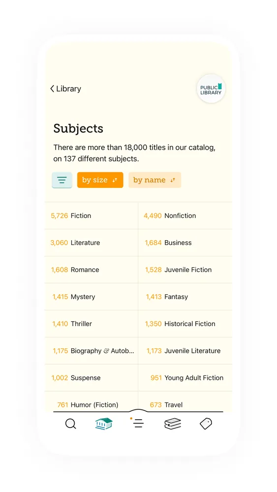</a> | [Libby](references/42-libby/README.md) · [official product](https://www.overdrive.com/apps/libby) | owner-published media, 1 named gaps | Media | mobile-single-column: Single-column mobile hierarchy with top context and a vertically scrolling primary surface. Panels: toolbar/header (top); bottom navigation/action area (bottom); scrolling content or app screen (center). Density: low; confidence: medium. | Study the Library, Shelf, and reading timeline model, including borrowing, placing holds, managing loans, downloading, and opening formats. |
| 43 | <a href="https://www.apple.com/maps/">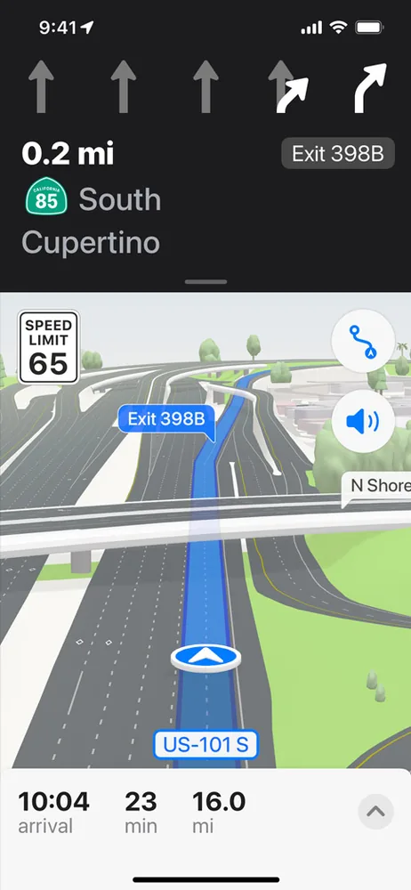</a> | [Apple Maps](references/43-apple-maps/README.md) · [official product](https://www.apple.com/maps/) | owner-published media, 1 named gaps | Navigation | mobile-single-column: Single-column mobile hierarchy with top context and a vertically scrolling primary surface. Panels: toolbar/header (top); bottom navigation/action area (bottom); scrolling content or app screen (center). Density: low; confidence: medium. | Study the map-and-bottom-sheet relationship, place-card hierarchy, route-mode comparison, turn preview, and transition into active navigation. |
| 44 | <a href="https://www.google.com/maps/about/">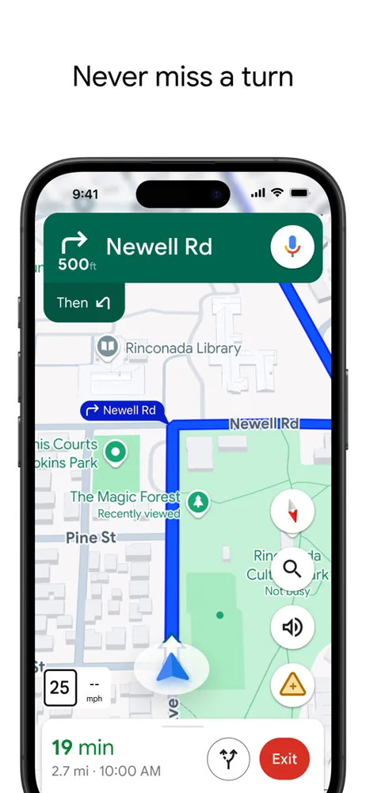</a> | [Google Maps](references/44-google-maps/README.md) · [official product](https://www.google.com/maps/about/) | owner-published media, 1 named gaps | Navigation | mobile-single-column: Single-column mobile hierarchy with top context and a vertically scrolling primary surface. Panels: toolbar/header (top); scrolling content or app screen (center). Density: medium; confidence: medium. | Study map browsing with draggable sheets, place-detail actions, saved lists, multimodal route comparison, and active-navigation controls. |
| 45 | <a href="https://citymapper.com/">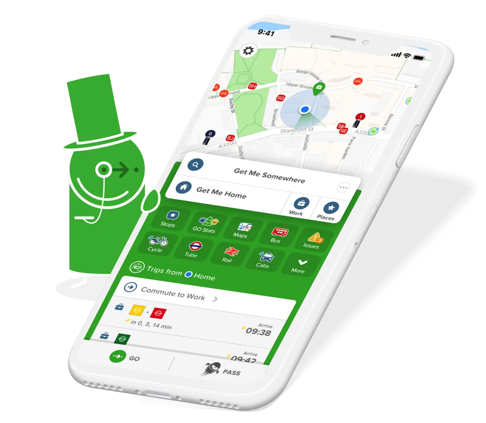</a> | [Citymapper](references/45-citymapper/README.md) · [official product](https://citymapper.com/) | owner-published media, 1 named gaps | Navigation | mobile-single-column: Single-column mobile hierarchy with top context and a vertically scrolling primary surface. Panels: toolbar/header (top); scrolling content or app screen (center). Density: low; confidence: medium. | Study destination search followed by multimodal route comparison, then examine step cards, transfer cues, live progress, and disruption messaging. |
| 46 |  | [AllTrails](references/46-alltrails/README.md) · [official product](https://www.alltrails.com/mobile) | owner-published media, 1 named gaps | Navigation | mobile-single-column: Single-column mobile hierarchy with top context and a vertically scrolling primary surface. Panels: toolbar/header (top); scrolling content or app screen (center). Density: high; confidence: medium. | Study trail discovery filters, result cards, map-and-detail organization, route preview, offline map handling, and on-trail progress feedback. |
| 47 | <a href="https://github.com/mobile">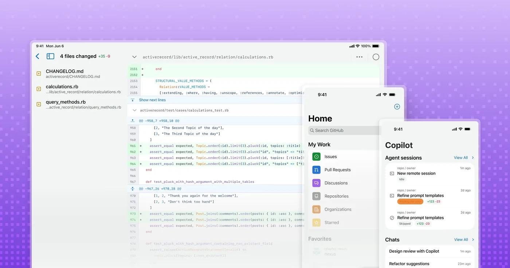</a> | [GitHub Mobile](references/47-github-mobile/README.md) · [official product](https://github.com/mobile) | owner-published media, 1 named gaps | Developer tools | mobile-single-column: Single-column mobile hierarchy with top context and a vertically scrolling primary surface. Panels: toolbar/header (top); scrolling content or app screen (center). Density: low; confidence: medium. | Study notification triage and repository navigation, including issue and pull-request timelines, diff review, reactions, comments, and approvals. |
| 48 |  | [Working Copy](references/48-working-copy/README.md) · [official product](https://workingcopy.app/) | owner-published media, 1 named gaps | Developer tools | mobile-single-column: Single-column mobile hierarchy with top context and a vertically scrolling primary surface. Panels: toolbar/header (top); bottom navigation/action area (bottom); scrolling content or app screen (center). Density: low; confidence: medium. | Study repository and file-tree navigation, staged-versus-unstaged diff presentation, commit composition, branch switching, and remote synchronization. |
| 49 | <a href="https://blink.sh/">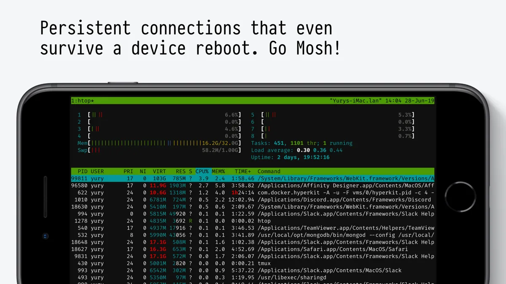</a> | [Blink Shell](references/49-blink-shell/README.md) · [official product](https://blink.sh/) | owner-published media, 1 named gaps | Developer tools | mobile-single-column: Single-column mobile hierarchy with top context and a vertically scrolling primary surface. Panels: toolbar/header (top); scrolling content or app screen (center). Density: medium; confidence: medium. | Study terminal tabs, saved SSH hosts, the keyboard accessory row, modifier-key handling, and session management within iPhone constraints. |
| 50 | <a href="https://apps.apple.com/us/app/testflight/id899247664">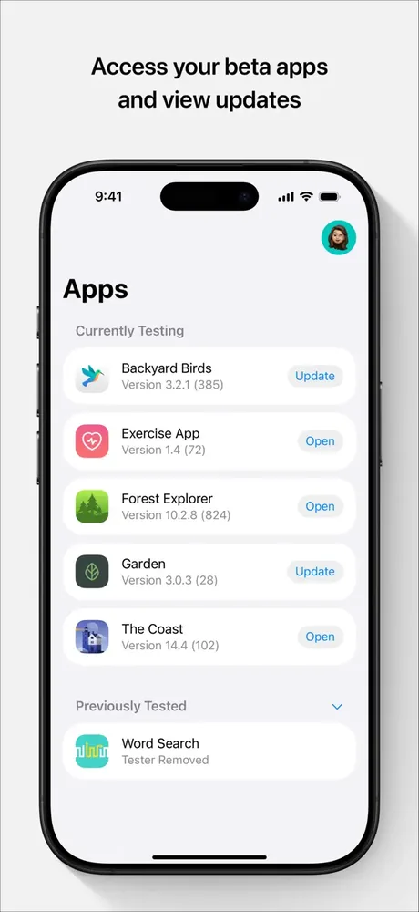</a> | [TestFlight](references/50-testflight/README.md) · [official product](https://apps.apple.com/us/app/testflight/id899247664) | owner-published media, 1 named gaps | Developer tools | mobile-single-column: Single-column mobile hierarchy with top context and a vertically scrolling primary surface. Panels: toolbar/header (top); bottom navigation/action area (bottom); scrolling content or app screen (center). Density: low; confidence: medium. | Study invitation and redemption states, app-to-build hierarchy, update notes, expiration messaging, automatic updates, and beta-feedback submission. |

Normalized panel bounds, detected separators, image dimensions, source-image URLs, hashes, and analysis confidence are recorded in [`sources.json`](sources.json). Media kinds, measured durations, provenance classes, and per-record gaps are in [`references.json`](references.json).

Attribution and product ownership remain with the linked source.
