# macOS app examples

Native macOS applications, menu-bar utilities, and productivity tools.

Each entry pairs an attributed overview image and a measured panel anatomy with a per-product record: motion evidence, named states, an observed first-success journey, interaction and recovery behavior, accessibility observations, and provenance. Every number below is measured by `verify-reference-evidence.py`, and a record that is missing evidence says so in its own `evidence_gaps`.

**Examples:** 50  
**Images:** 50  
**Structural analyses:** 50  
**Records with no remaining gap:** 0  
**Records with named gaps:** 50 (98 gaps)  
**Motion provenance:** 50 owner-published media  
**Curated:** 2026-08-16  
**Visual source data:** [`sources.json`](sources.json)  
**Record index:** [`references.json`](references.json)  
**Cross-example synthesis:** [`full-reference.md`](full-reference.md)

| # | Reference image | Record | Motion evidence | Category | Interface structure | What to study |
|---:|---|---|---|---|---|---|
| 1 | <a href="https://www.macbartender.com/">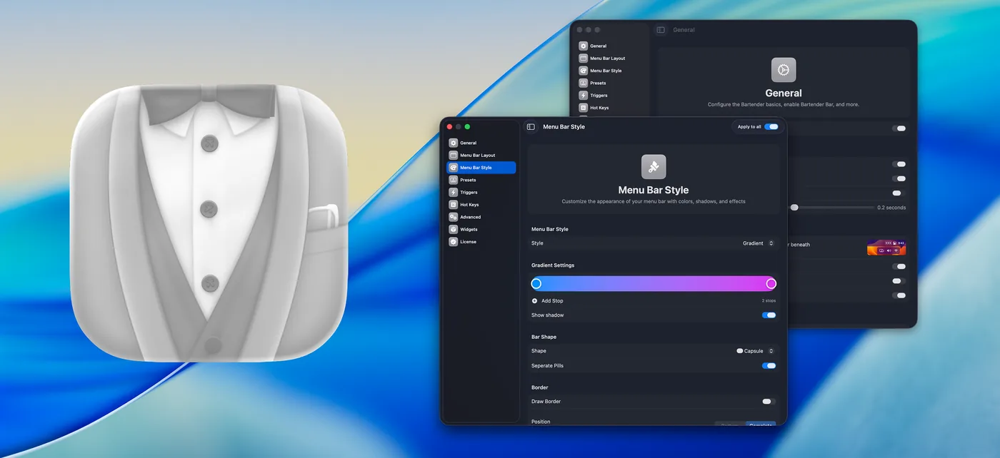</a> | [Bartender](references/01-bartender/README.md) · [official product](https://www.macbartender.com/) | owner-published media, 1 named gaps | Menu-bar utility | single-surface: One dominant content surface without a stable secondary panel detected. Panels: toolbar/header (top); status/action bar (bottom); primary canvas/content (center). Density: low; confidence: low. | Study its menu-bar item shelf, reveal-on-hover behavior, and per-item visibility controls for managing constrained horizontal space. |
| 2 | <a href="https://github.com/jordanbaird/Ice">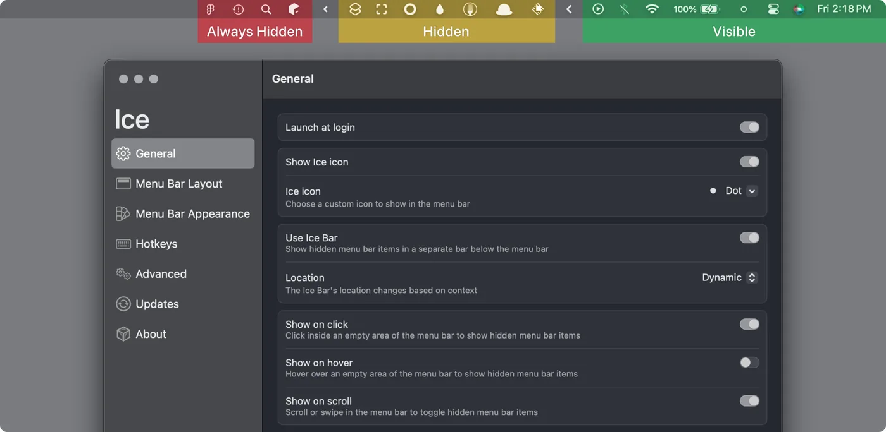</a> | [Ice](references/02-ice/README.md) · [official product](https://github.com/jordanbaird/Ice) | owner-published media, 2 named gaps | Menu-bar utility | sidebar-content: Leading navigation or collection list beside a dominant content area. Panels: toolbar/header (top); status/action bar (bottom); navigation/list sidebar (leading); primary canvas/content (center). Density: low; confidence: medium. | Study the split between always-visible and hidden menu-bar items, including keyboard-triggered disclosure and direct drag reordering. |
| 3 | <a href="https://maccy.app/">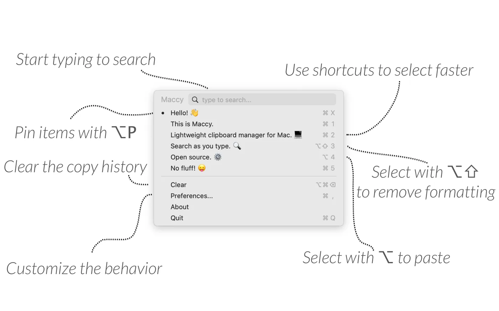</a> | [Maccy](references/03-maccy/README.md) · [official product](https://maccy.app/) | owner-published media, 2 named gaps | Menu-bar utility | sidebar-content-inspector: Leading navigation, central work area, and trailing detail inspector. Panels: toolbar/header (top); navigation/list sidebar (leading); detail/inspector (trailing); data table/list (center). Density: low; confidence: medium. | Study the keyboard-first clipboard history popover, incremental search, numbered results, and paste-without-formatting command flow. |
| 4 | <a href="https://github.com/exelban/stats">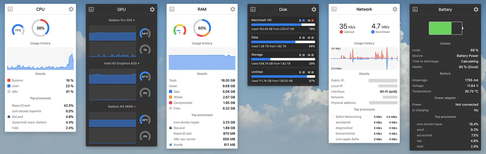</a> | [Stats](references/04-stats/README.md) · [official product](https://github.com/exelban/stats) | owner-published media, 2 named gaps | Menu-bar utility | sidebar-content-inspector: Leading navigation, central work area, and trailing detail inspector. Panels: toolbar/header (top); status/action bar (bottom); navigation/list sidebar (leading); detail/inspector (trailing); primary canvas/content (center). Density: low; confidence: medium. | Study its modular menu-bar meters and the compact popovers that progressively disclose detailed system readings and controls. |
| 5 | <a href="https://rectangleapp.com/">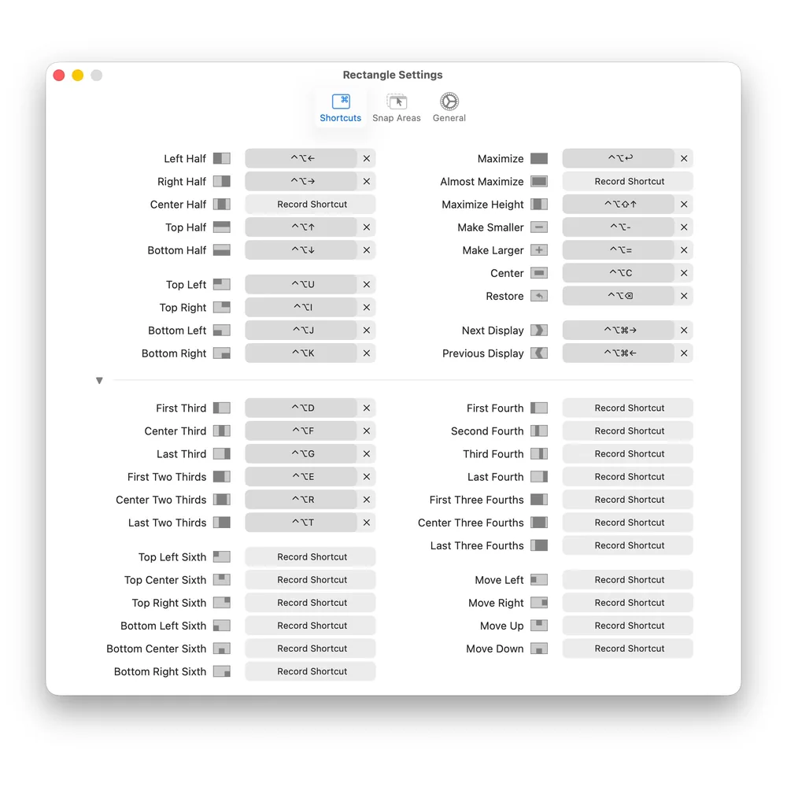</a> | [Rectangle](references/05-rectangle/README.md) · [official product](https://rectangleapp.com/) | owner-published media, 2 named gaps | Window management | sidebar-content-inspector: Leading navigation, central work area, and trailing detail inspector. Panels: toolbar/header (top); status/action bar (bottom); navigation/list sidebar (leading); detail/inspector (trailing); primary canvas/content (center). Density: low; confidence: medium. | Study the mapping between memorable keyboard shortcuts, menu commands, screen regions, and immediate window-position feedback. |
| 6 | <a href="https://www.raycast.com/">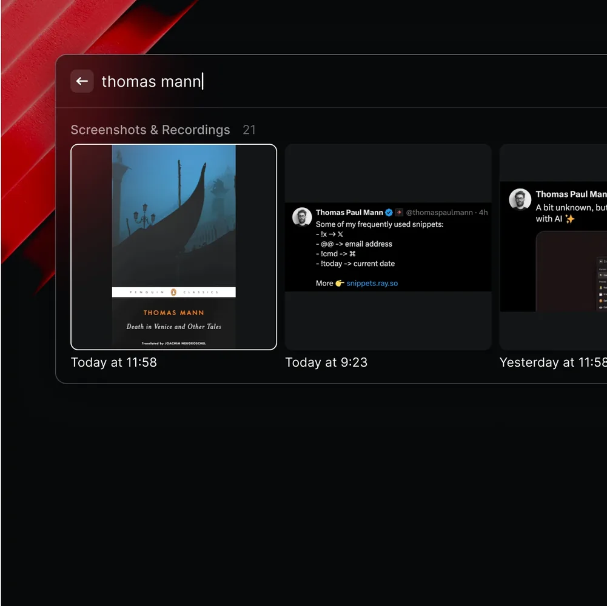</a> | [Raycast](references/06-raycast/README.md) · [official product](https://www.raycast.com/) | owner-published media, 2 named gaps | Launcher and productivity | sidebar-content: Leading navigation or collection list beside a dominant content area. Panels: toolbar/header (top); navigation/list sidebar (leading); primary canvas/content (center). Density: low; confidence: high. | Study its command palette architecture, ranked keyboard navigation, action panels, argument forms, and extension-oriented information hierarchy. |
| 7 | <a href="https://www.alfredapp.com/">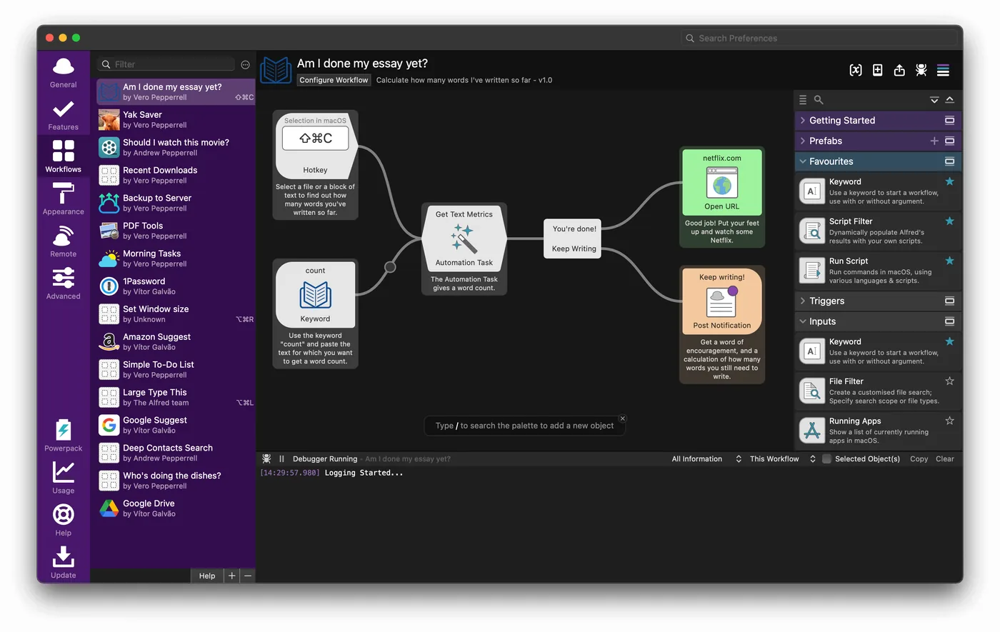</a> | [Alfred](references/07-alfred/README.md) · [official product](https://www.alfredapp.com/) | owner-published media, 2 named gaps | Launcher and productivity | content-inspector: Dominant content area with a trailing detail or property inspector. Panels: toolbar/header (top); status/action bar (bottom); detail/inspector (trailing); data table/list (center). Density: low; confidence: medium. | Study keyword-scoped search, result accessory actions, workflow chaining, and the handoff from a compact launcher to configuration windows. |
| 8 | <a href="https://www.keyboardmaestro.com/">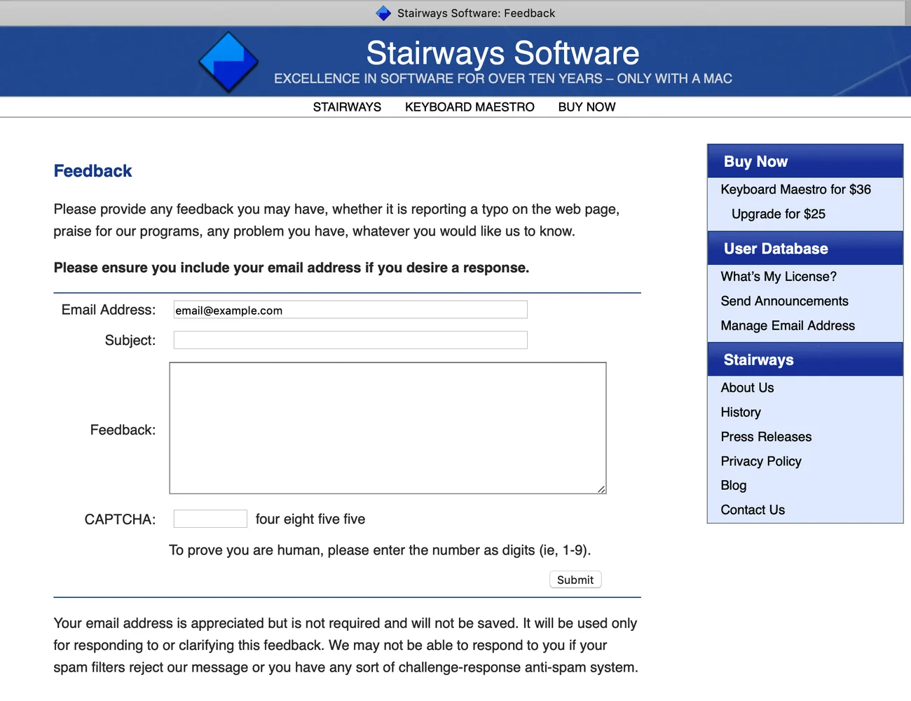</a> | [Keyboard Maestro](references/08-keyboard-maestro/README.md) · [official product](https://www.keyboardmaestro.com/) | owner-published media, 2 named gaps | Automation and productivity | sidebar-content-inspector: Leading navigation, central work area, and trailing detail inspector. Panels: toolbar/header (top); status/action bar (bottom); navigation/list sidebar (leading); detail/inspector (trailing); primary canvas/content (center). Density: low; confidence: medium. | Study the three-column macro editor, trigger configuration, nested action blocks, and menus for building dense automation workflows. |
| 9 |  | [Pages](references/09-pages/README.md) · [official product](https://www.apple.com/pages/) | owner-published media, 2 named gaps | Document app | content-inspector: Dominant content area with a trailing detail or property inspector. Panels: toolbar/header (top); status/action bar (bottom); detail/inspector (trailing); primary canvas/content (center). Density: low; confidence: high. | Study the canvas-centered document window, collapsible formatting inspector, page thumbnails, contextual controls, and system-standard menus. |
| 10 | <a href="https://ulysses.app/">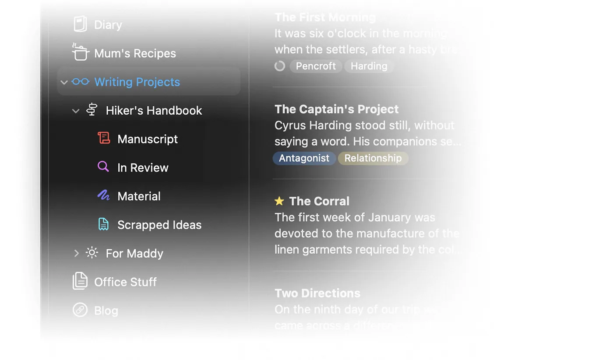</a> | [Ulysses](references/10-ulysses/README.md) · [official product](https://ulysses.app/) | owner-published media, 2 named gaps | Document app | sidebar-content: Leading navigation or collection list beside a dominant content area. Panels: toolbar/header (top); navigation/list sidebar (leading); data table/list (center). Density: low; confidence: medium. | Study its three-pane library, sheet list, and editor layout, plus keyboard-driven focus modes and inline markup presentation. |
| 11 | <a href="https://bear.app/">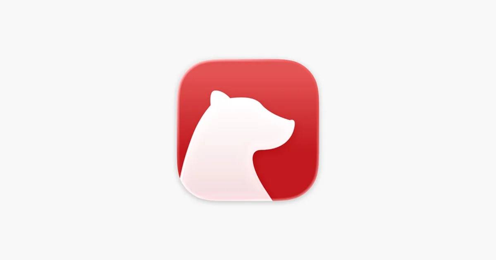</a> | [Bear](references/11-bear/README.md) · [official product](https://bear.app/) | owner-published media, 2 named gaps | Document app | sidebar-content-inspector: Leading navigation, central work area, and trailing detail inspector. Panels: toolbar/header (top); status/action bar (bottom); navigation/list sidebar (leading); detail/inspector (trailing); primary canvas/content (center). Density: low; confidence: medium. | Study the notes sidebar, nested tag navigation, inline formatting controls, backlinks, and fast keyboard movement between writing contexts. |
| 12 |  | [iA Writer](references/12-ia-writer/README.md) · [official product](https://ia.net/writer) | owner-published media, 2 named gaps | Document app | sidebar-content: Leading navigation or collection list beside a dominant content area. Panels: toolbar/header (top); status/action bar (bottom); navigation/list sidebar (leading); primary canvas/content (center). Density: low; confidence: medium. | Study its distraction-reduced editor, syntax and focus highlighting, document library, and restrained use of transient formatting controls. |
| 13 |  | [Craft](references/13-craft/README.md) · [official product](https://www.craft.do/) | owner-published media, 2 named gaps | Document app | sidebar-content-inspector: Leading navigation, central work area, and trailing detail inspector. Panels: toolbar/header (top); navigation/list sidebar (leading); detail/inspector (trailing); primary canvas/content (center). Density: low; confidence: medium. | Study block-level selection, slash-command insertion, card-based document structure, sidebar navigation, and drag-based hierarchy editing. |
| 14 | <a href="https://www.devontechnologies.com/apps/devonthink">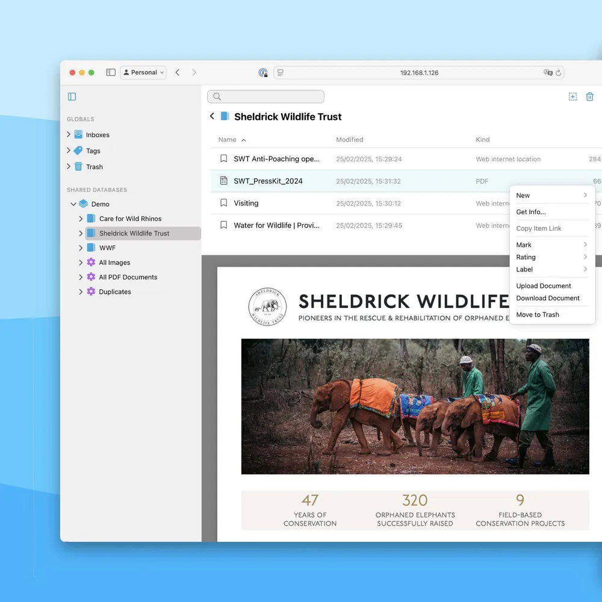</a> | [DEVONthink](references/14-devonthink/README.md) · [official product](https://www.devontechnologies.com/apps/devonthink) | owner-published media, 2 named gaps | Document and knowledge management | sidebar-content-inspector: Leading navigation, central work area, and trailing detail inspector. Panels: toolbar/header (top); status/action bar (bottom); navigation/list sidebar (leading); detail/inspector (trailing); data table/list (center). Density: low; confidence: medium. | Study its database-oriented source list, configurable multi-pane views, metadata inspectors, tabbed windows, and extensive command menus. |
| 15 | <a href="https://www.literatureandlatte.com/scrivener/overview">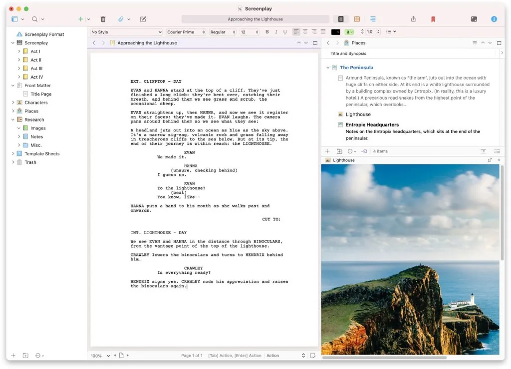</a> | [Scrivener](references/15-scrivener/README.md) · [official product](https://www.literatureandlatte.com/scrivener/overview) | owner-published media, 2 named gaps | Document app | sidebar-content-inspector: Leading navigation, central work area, and trailing detail inspector. Panels: toolbar/header (top); status/action bar (bottom); navigation/list sidebar (leading); detail/inspector (trailing); primary canvas/content (center). Density: low; confidence: high. | Study the Binder sidebar, corkboard and outliner modes, split editors, metadata inspector, and compile workflow for long documents. |
| 16 | <a href="https://obsidian.md/">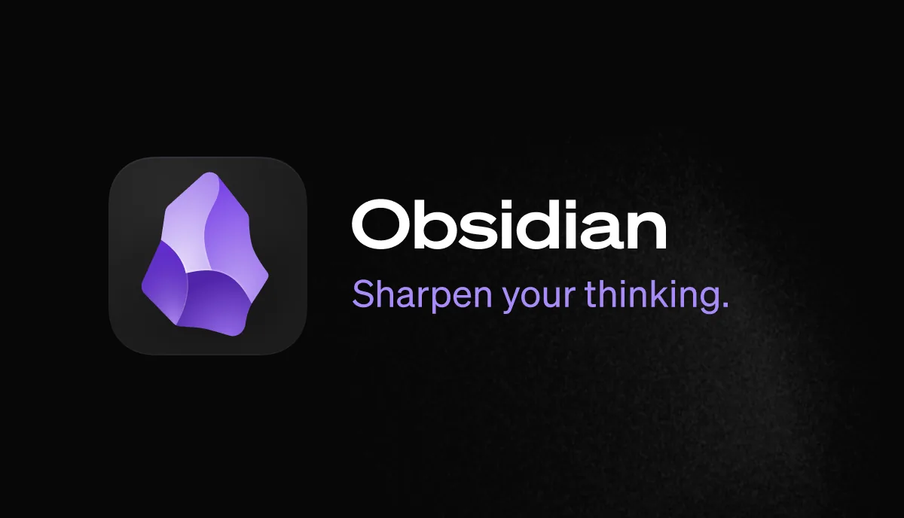</a> | [Obsidian](references/16-obsidian/README.md) · [official product](https://obsidian.md/) | owner-published media, 2 named gaps | Document and knowledge management | sidebar-content-inspector: Leading navigation, central work area, and trailing detail inspector. Panels: toolbar/header (top); navigation/list sidebar (leading); detail/inspector (trailing); primary canvas/content (center). Density: low; confidence: medium. | Study its dockable sidebars, command palette, backlink panels, tab groups, graph view, and keyboard-oriented Markdown editing model. |
| 17 | <a href="https://developer.apple.com/xcode/">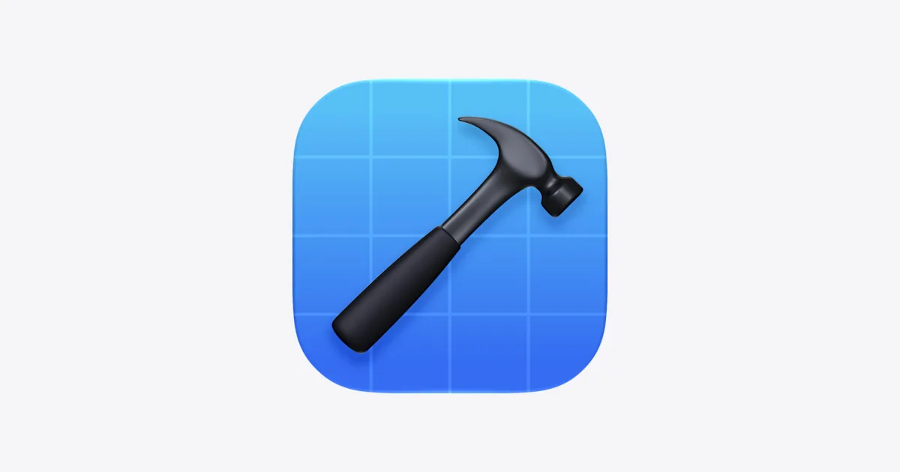</a> | [Xcode](references/17-xcode/README.md) · [official product](https://developer.apple.com/xcode/) | owner-published media, 1 named gaps | Developer tool | sidebar-content-inspector: Leading navigation, central work area, and trailing detail inspector. Panels: toolbar/header (top); status/action bar (bottom); navigation/list sidebar (leading); detail/inspector (trailing); primary canvas/content (center). Density: low; confidence: high. | Study the navigator-editor-inspector structure, assistant layouts, jump bar, debug area, command menus, and shortcut-heavy source navigation. |
| 18 | <a href="https://nova.app/">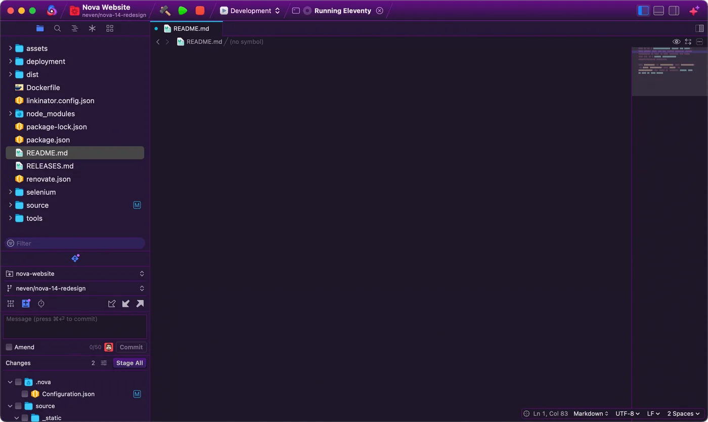</a> | [Nova](references/18-nova/README.md) · [official product](https://nova.app/) | owner-published media, 2 named gaps | Developer tool | sidebar-content-inspector: Leading navigation, central work area, and trailing detail inspector. Panels: toolbar/header (top); navigation/list sidebar (leading); detail/inspector (trailing); primary canvas/content (center). Density: low; confidence: high. | Study its native project sidebar, editor splits, extension commands, task controls, source-control views, and contextual inspector panels. |
| 19 | <a href="https://www.barebones.com/products/bbedit/">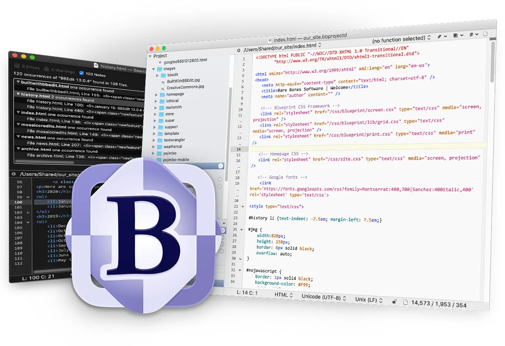</a> | [BBEdit](references/19-bbedit/README.md) · [official product](https://www.barebones.com/products/bbedit/) | owner-published media, 2 named gaps | Developer tool | sidebar-content: Leading navigation or collection list beside a dominant content area. Panels: toolbar/header (top); navigation/list sidebar (leading); primary canvas/content (center). Density: medium; confidence: high. | Study its text-first document windows, function navigation, multi-file search panels, worksheets, and comprehensive keyboard-accessible menus. |
| 20 | <a href="https://www.git-tower.com/mac">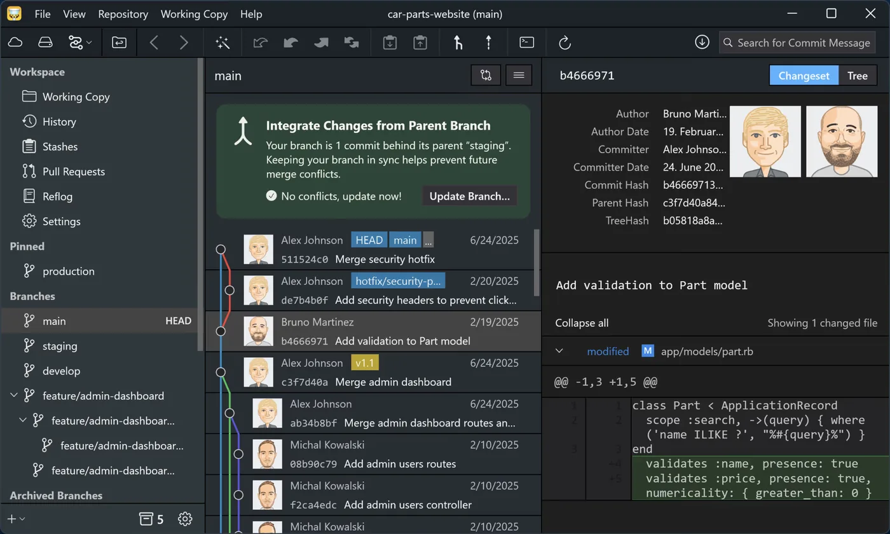</a> | [Tower](references/20-tower/README.md) · [official product](https://www.git-tower.com/mac) | owner-published media, 2 named gaps | Developer tool | sidebar-content-inspector: Leading navigation, central work area, and trailing detail inspector. Panels: toolbar/header (top); status/action bar (bottom); navigation/list sidebar (leading); detail/inspector (trailing); primary canvas/content (center). Density: medium; confidence: high. | Study the repository sidebar, branch and commit hierarchy, diff inspector, drag-based Git operations, and contextual action menus. |
| 21 | <a href="https://git-fork.com/">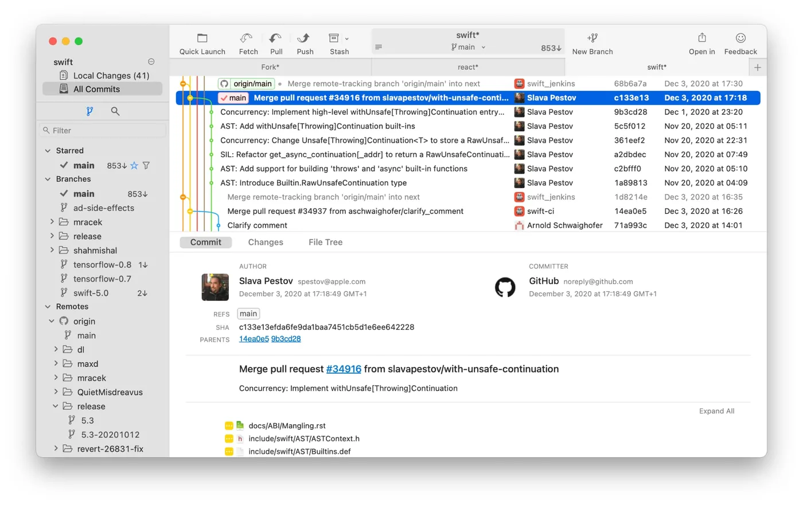</a> | [Fork](references/21-fork/README.md) · [official product](https://git-fork.com/) | owner-published media, 2 named gaps | Developer tool | sidebar-content: Leading navigation or collection list beside a dominant content area. Panels: toolbar/header (top); status/action bar (bottom); navigation/list sidebar (leading); primary canvas/content (center). Density: medium; confidence: high. | Study its dense commit graph, repository tabs, staging split view, interactive rebase interface, and keyboard-accessible Git actions. |
| 22 | <a href="https://kaleidoscope.app/">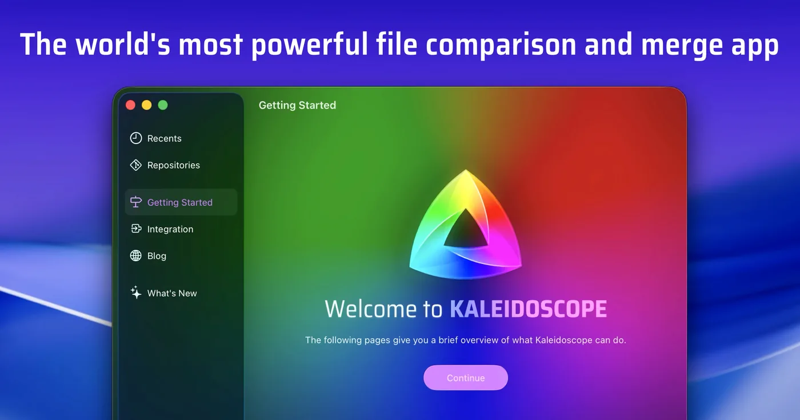</a> | [Kaleidoscope](references/22-kaleidoscope/README.md) · [official product](https://kaleidoscope.app/) | owner-published media, 2 named gaps | Developer tool | sidebar-content-inspector: Leading navigation, central work area, and trailing detail inspector. Panels: toolbar/header (top); status/action bar (bottom); navigation/list sidebar (leading); detail/inspector (trailing); primary canvas/content (center). Density: low; confidence: medium. | Study side-by-side and change-focused comparison layouts, merge controls, source-control handoff, and visual treatment of conflicting edits. |
| 23 | <a href="https://kapeli.com/dash">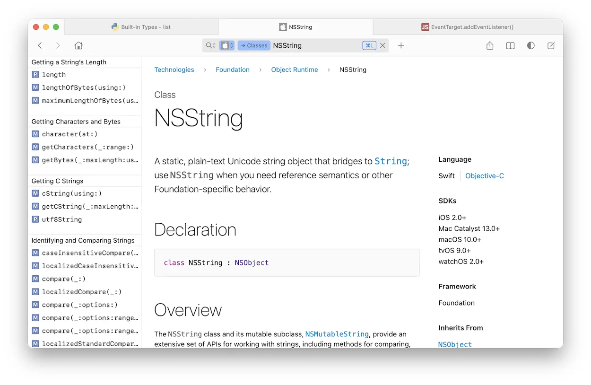</a> | [Dash](references/23-dash/README.md) · [official product](https://kapeli.com/dash) | owner-published media, 2 named gaps | Developer tool | sidebar-content: Leading navigation or collection list beside a dominant content area. Panels: toolbar/header (top); status/action bar (bottom); navigation/list sidebar (leading); data table/list (center). Density: low; confidence: high. | Study unified documentation search, scoped docset navigation, symbol result ranking, keyboard shortcuts, and compact reference presentation. |
| 24 | <a href="https://proxyman.io/">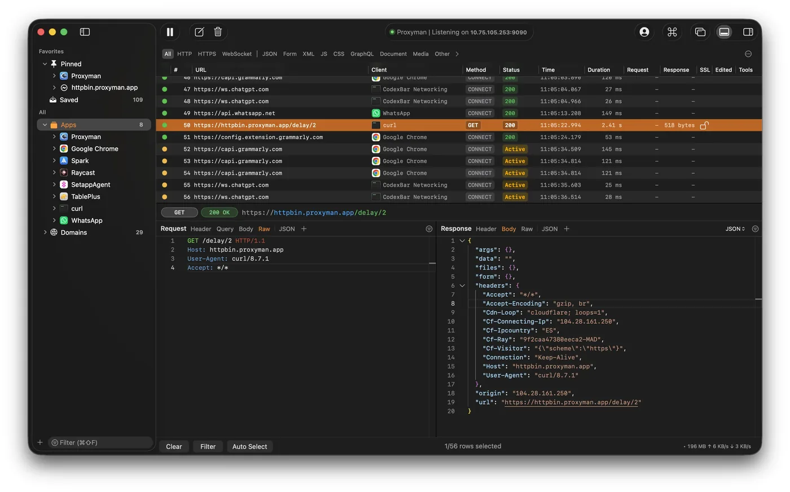</a> | [Proxyman](references/24-proxyman/README.md) · [official product](https://proxyman.io/) | owner-published media, 2 named gaps | Developer tool | sidebar-table-request-response: Traffic-source navigation beside a request table, with paired request and response inspectors below. Panels: toolbar/header (top); status/action bar (bottom); traffic source navigation (leading); traffic request table (upper center); request inspector (lower center); response inspector (lower trailing). Density: low; confidence: high. | Study its traffic source list, request table, request-response inspectors, filtering controls, tabs, and breakpoint editing workflow. |
| 25 | <a href="https://zed.dev/">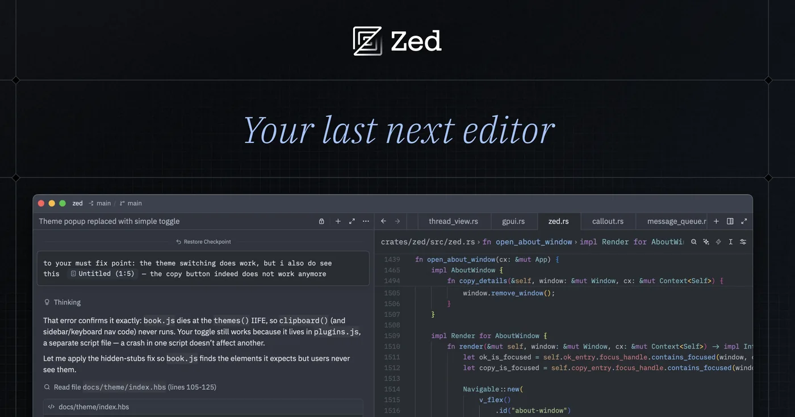</a> | [Zed](references/25-zed/README.md) · [official product](https://zed.dev/) | owner-published media, 2 named gaps | Developer tool | sidebar-content-inspector: Leading navigation, central work area, and trailing detail inspector. Panels: toolbar/header (top); status/action bar (bottom); navigation/list sidebar (leading); detail/inspector (trailing); primary canvas/content (center). Density: low; confidence: medium. | Study its command palette, project panel, editor splits, modal keyboard support, collaborative presence, and low-chrome code workspace. |
| 26 | <a href="https://www.sketch.com/">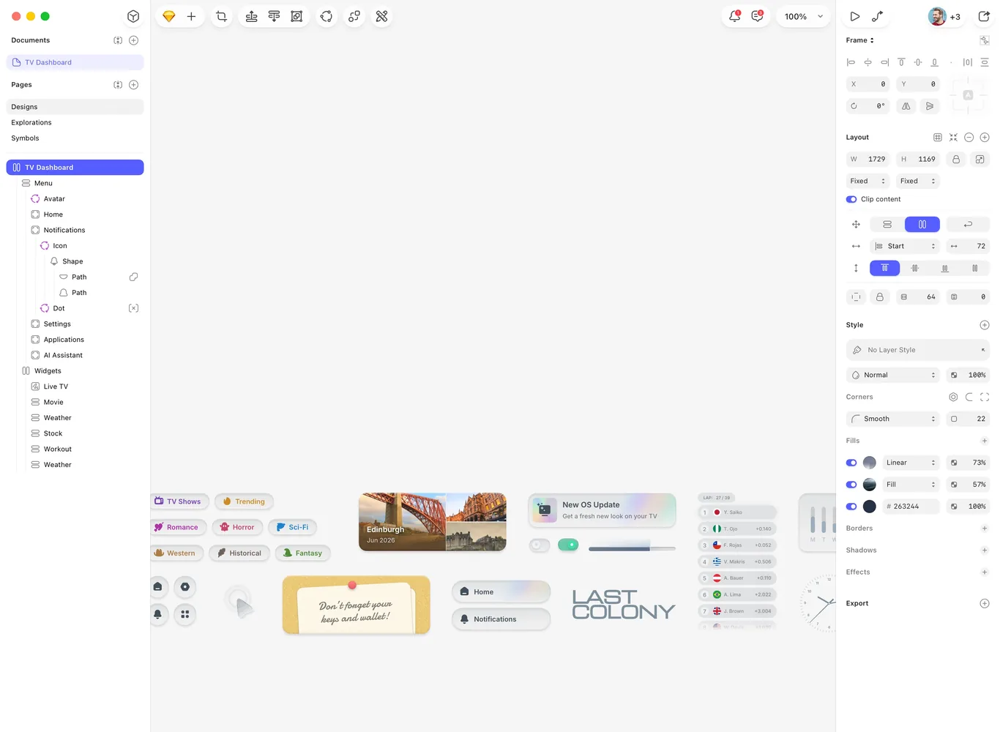</a> | [Sketch](references/26-sketch/README.md) · [official product](https://www.sketch.com/) | owner-published media, 2 named gaps | Creative software | sidebar-content-inspector: Leading navigation, central work area, and trailing detail inspector. Panels: toolbar/header (top); status/action bar (bottom); navigation/list sidebar (leading); detail/inspector (trailing); data table/list (center). Density: low; confidence: high. | Study the layer list, central canvas, property inspector, component navigation, contextual toolbars, and precision keyboard manipulation. |
| 27 | <a href="https://www.pixelmator.com/pro/">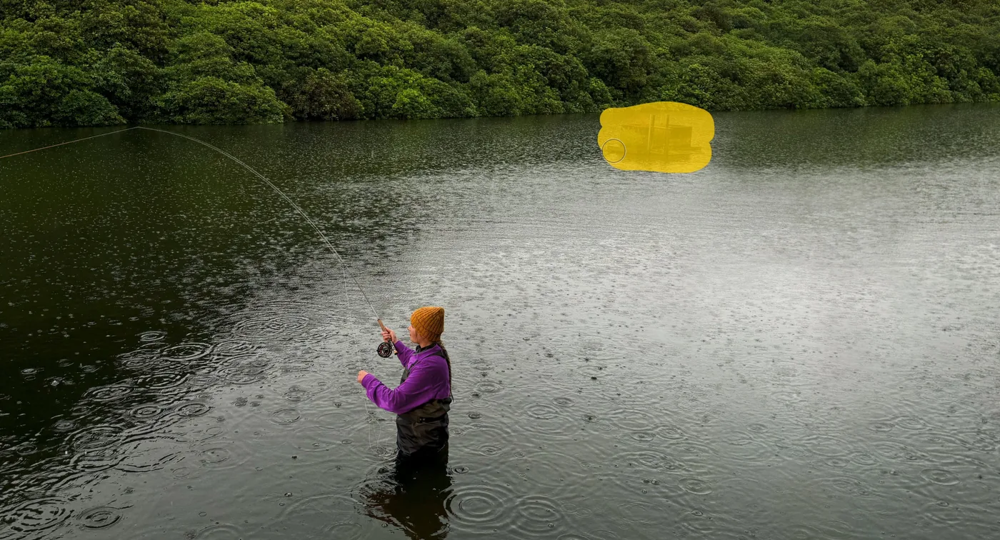</a> | [Pixelmator Pro](references/27-pixelmator-pro/README.md) · [official product](https://www.pixelmator.com/pro/) | owner-published media, 2 named gaps | Creative software | sidebar-content-inspector: Leading navigation, central work area, and trailing detail inspector. Panels: toolbar/header (top); status/action bar (bottom); navigation/list sidebar (leading); detail/inspector (trailing); primary canvas/content (center). Density: low; confidence: high. | Study its single-window editing model, tool sidebar, contextual inspector controls, layer management, and nondestructive adjustment workflow. |
| 28 |  | [Affinity Designer](references/28-affinity-designer/README.md) · [official product](https://www.affinity.studio/graphic-design-software) | owner-published media, 2 named gaps | Creative software | sidebar-content-inspector: Leading navigation, central work area, and trailing detail inspector. Panels: toolbar/header (top); navigation/list sidebar (leading); detail/inspector (trailing); primary canvas/content (center). Density: low; confidence: medium. | Study Persona switching, dockable studios, context toolbars, layer hierarchy, inspector-like panels, and shortcut-dense vector editing. |
| 29 | <a href="https://www.apple.com/final-cut-pro/">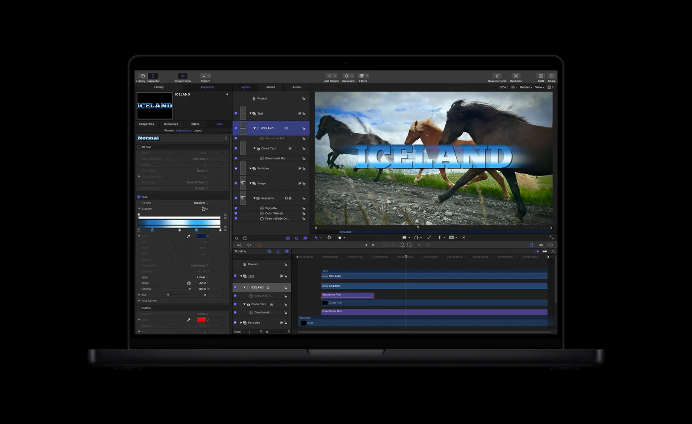</a> | [Final Cut Pro](references/29-final-cut-pro/README.md) · [official product](https://www.apple.com/final-cut-pro/) | owner-published media, 2 named gaps | Creative software | sidebar-content-inspector: Leading navigation, central work area, and trailing detail inspector. Panels: toolbar/header (top); status/action bar (bottom); navigation/list sidebar (leading); detail/inspector (trailing); data table/list (center). Density: low; confidence: medium. | Study its library and browser hierarchy, magnetic timeline, skimming interaction, parameter inspector, and role-based media organization. |
| 30 | <a href="https://www.apple.com/logic-pro/">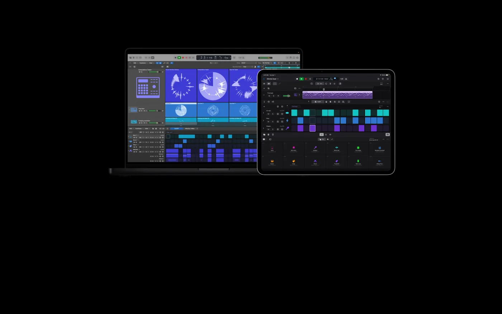</a> | [Logic Pro](references/30-logic-pro/README.md) · [official product](https://www.apple.com/logic-pro/) | owner-published media, 2 named gaps | Creative software | sidebar-content-inspector: Leading navigation, central work area, and trailing detail inspector. Panels: toolbar/header (top); navigation/list sidebar (leading); detail/inspector (trailing); primary canvas/content (center). Density: low; confidence: high. | Study the track-area workspace, channel-strip inspector, mixer, browser panels, transport controls, and configurable keyboard commands. |
| 31 | <a href="https://www.telestream.net/screenflow/overview.htm">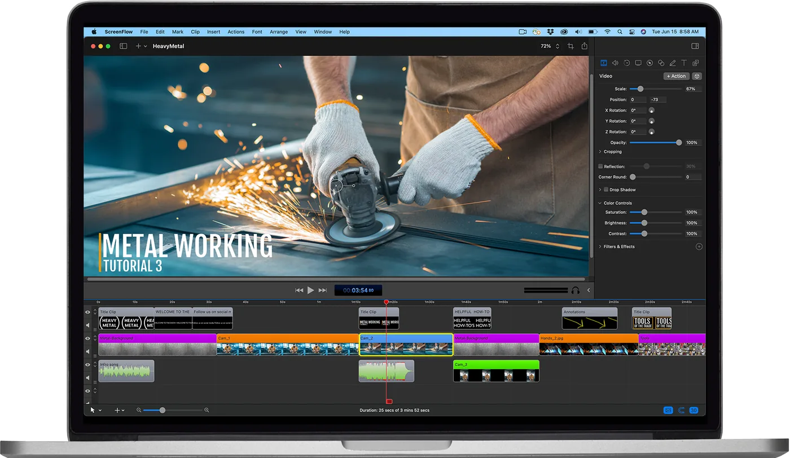</a> | [ScreenFlow](references/31-screenflow/README.md) · [official product](https://www.telestream.net/screenflow/overview.htm) | owner-published media, 2 named gaps | Creative software | content-inspector: Dominant content area with a trailing detail or property inspector. Panels: toolbar/header (top); detail/inspector (trailing); data table/list (center). Density: low; confidence: high. | Study the layered timeline, properties inspector, canvas previews, media library, and action-based animation editing workflow. |
| 32 | <a href="https://flyingmeat.com/acorn/">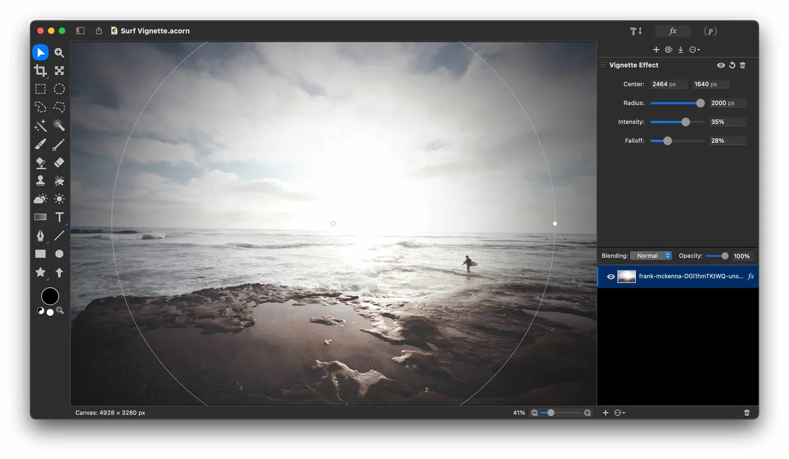</a> | [Acorn](references/32-acorn/README.md) · [official product](https://flyingmeat.com/acorn/) | owner-published media, 2 named gaps | Creative software | content-inspector: Dominant content area with a trailing detail or property inspector. Panels: toolbar/header (top); status/action bar (bottom); detail/inspector (trailing); data table/list (center). Density: low; confidence: high. | Study its compact native image editor window, layer list, inspector palettes, filter controls, and menu-led access to advanced operations. |
| 33 | <a href="https://mimestream.com/">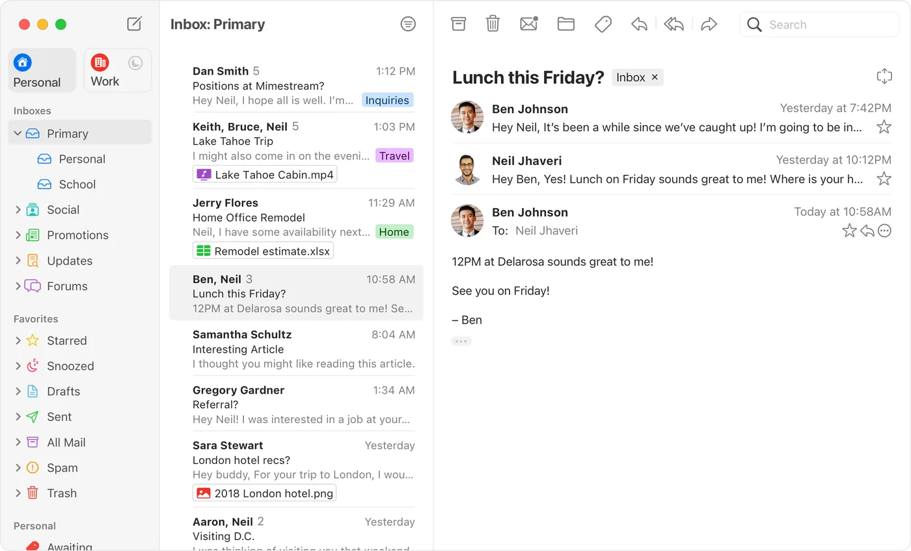</a> | [Mimestream](references/33-mimestream/README.md) · [official product](https://mimestream.com/) | owner-published media, 2 named gaps | Communication | sidebar-content: Leading navigation or collection list beside a dominant content area. Panels: toolbar/header (top); navigation/list sidebar (leading); data table/list (center). Density: low; confidence: medium. | Study the mailbox source list, conversation list, message pane, category tabs, compose windows, and keyboard-first mail triage. |
| 34 | <a href="https://sparkmailapp.com/">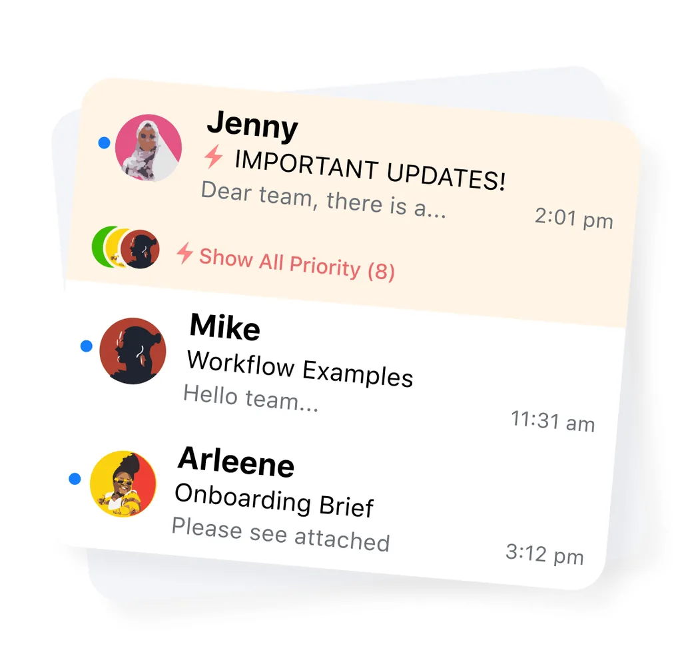</a> | [Spark](references/34-spark/README.md) · [official product](https://sparkmailapp.com/) | owner-published media, 2 named gaps | Communication | sidebar-content: Leading navigation or collection list beside a dominant content area. Panels: toolbar/header (top); navigation/list sidebar (leading); primary canvas/content (center). Density: low; confidence: high. | Study its inbox grouping, message actions, command-style search, compose workflow, and sidebar treatment of accounts and folders. |
| 35 |  | [Slack](references/35-slack/README.md) · [official product](https://slack.com/downloads/mac) | owner-published media, 2 named gaps | Communication | sidebar-content: Leading navigation or collection list beside a dominant content area. Panels: toolbar/header (top); navigation/list sidebar (leading); primary canvas/content (center). Density: low; confidence: high. | Study the workspace switcher, channel sidebar, threaded conversation pane, quick switcher, keyboard shortcuts, and notification-state indicators. |
| 36 |  | [Telegram for macOS](references/36-telegram-for-macos/README.md) · [official product](https://macos.telegram.org/) | owner-published media, 2 named gaps | Communication | sidebar-content-inspector: Leading navigation, central work area, and trailing detail inspector. Panels: toolbar/header (top); status/action bar (bottom); navigation/list sidebar (leading); detail/inspector (trailing); data table/list (center). Density: low; confidence: high. | Study its native conversation list, chat pane, media inspectors, contextual message menus, and keyboard navigation across dialogs. |
| 37 | <a href="https://tableplus.com/download/">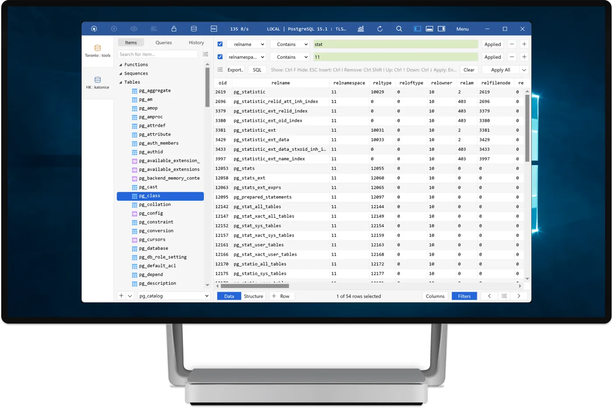</a> | [TablePlus](references/37-tableplus/README.md) · [official product](https://tableplus.com/download/) | owner-published media, 2 named gaps | Database tool | sidebar-content-inspector: Leading navigation, central work area, and trailing detail inspector. Panels: toolbar/header (top); status/action bar (bottom); navigation/list sidebar (leading); detail/inspector (trailing); data table/list (center). Density: low; confidence: high. | Study connection tabs, object sidebar, editable data grid, SQL editor, structure inspector, and keyboard-driven query execution. |
| 38 | <a href="https://eggerapps.at/postico2/">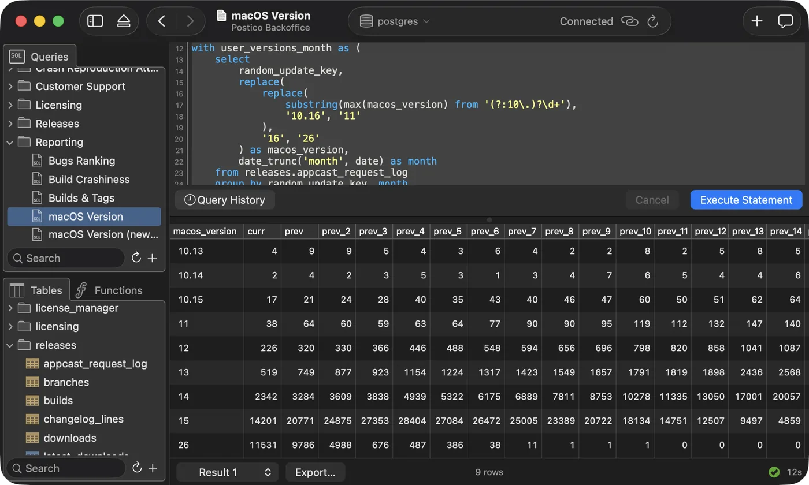</a> | [Postico 2](references/38-postico-2/README.md) · [official product](https://eggerapps.at/postico2/) | owner-published media, 2 named gaps | Database tool | sidebar-content: Leading navigation or collection list beside a dominant content area. Panels: toolbar/header (top); status/action bar (bottom); navigation/list sidebar (leading); data table/list (center). Density: medium; confidence: high. | Study its PostgreSQL object sidebar, table-content grid, filter controls, query tabs, and progressive disclosure of schema details. |
| 39 | <a href="https://github.com/Sequel-Ace/Sequel-Ace">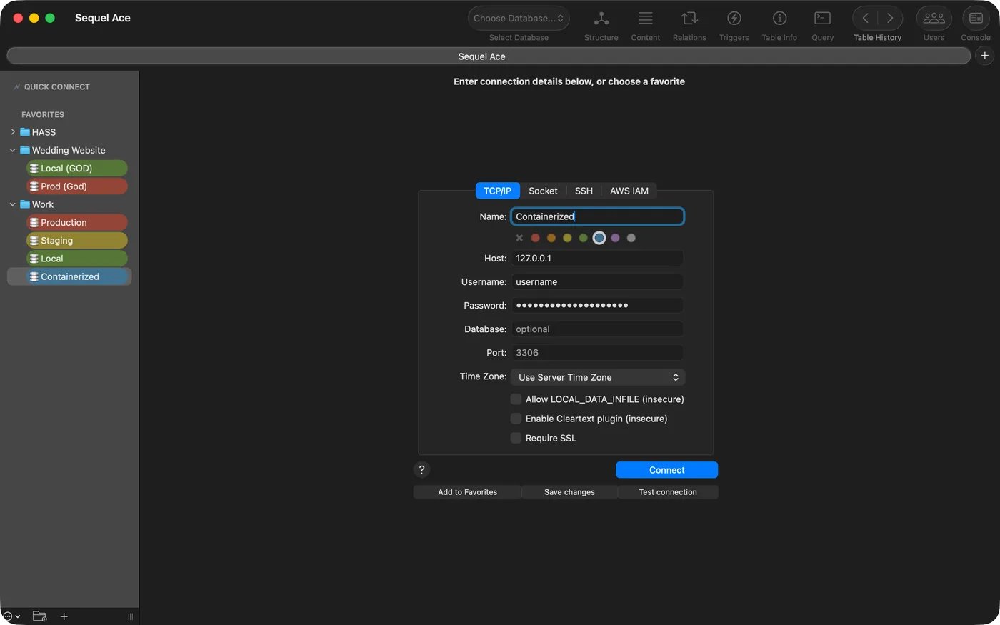</a> | [Sequel Ace](references/39-sequel-ace/README.md) · [official product](https://github.com/Sequel-Ace/Sequel-Ace) | owner-published media, 2 named gaps | Database tool | sidebar-content: Leading navigation or collection list beside a dominant content area. Panels: toolbar/header (top); status/action bar (bottom); navigation/list sidebar (leading); data table/list (center). Density: low; confidence: high. | Study connection management, database and table navigation, content grids, query editing, and tabbed structure and relation views. |
| 40 | <a href="https://www.sqlprostudio.com/">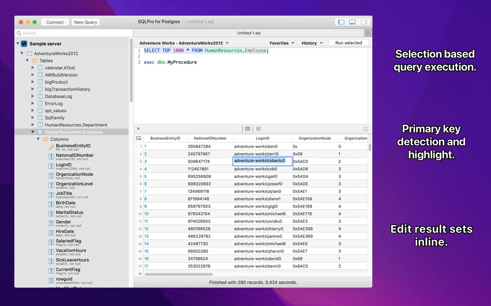</a> | [SQLPro Studio](references/40-sqlpro-studio/README.md) · [official product](https://www.sqlprostudio.com/) | owner-published media, 2 named gaps | Database tool | sidebar-content-inspector: Leading navigation, central work area, and trailing detail inspector. Panels: toolbar/header (top); status/action bar (bottom); navigation/list sidebar (leading); detail/inspector (trailing); data table/list (center). Density: medium; confidence: medium. | Study the multi-database connection sidebar, query tabs, results grids, object browsing, and shortcuts for executing selected SQL. |
| 41 | <a href="https://menial.co.uk/base/">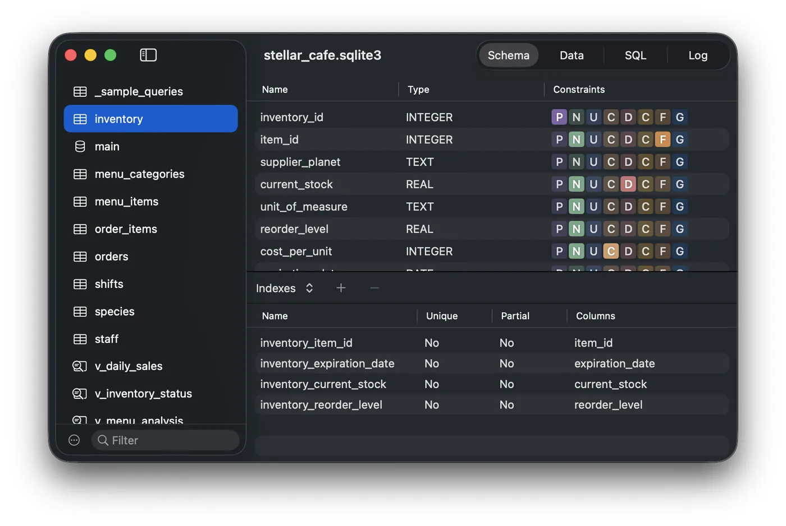</a> | [Base](references/41-base/README.md) · [official product](https://menial.co.uk/base/) | owner-published media, 2 named gaps | Database tool | sidebar-content: Leading navigation or collection list beside a dominant content area. Panels: toolbar/header (top); status/action bar (bottom); navigation/list sidebar (leading); data table/list (center). Density: low; confidence: medium. | Study its focused SQLite table browser, schema views, query editor, data grid, and compact native-window information hierarchy. |
| 42 | <a href="https://panic.com/transmit/">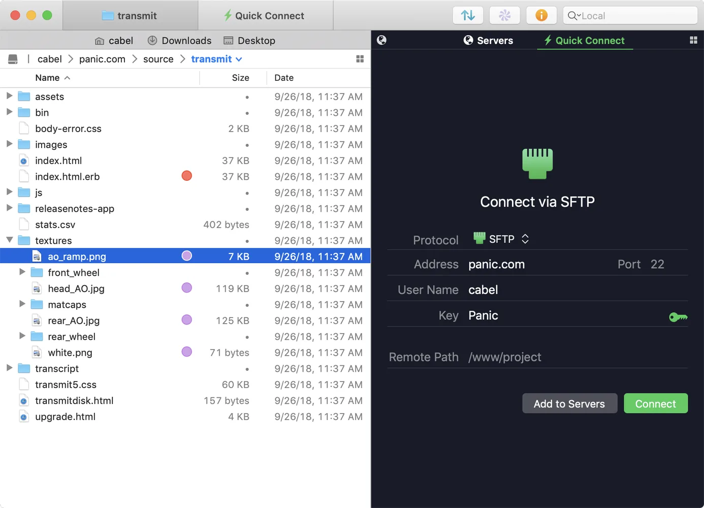</a> | [Transmit](references/42-transmit/README.md) · [official product](https://panic.com/transmit/) | owner-published media, 2 named gaps | Operations | sidebar-content: Leading navigation or collection list beside a dominant content area. Panels: toolbar/header (top); status/action bar (bottom); navigation/list sidebar (leading); primary canvas/content (center). Density: low; confidence: high. | Study its dual-pane file transfer model, server sidebar, synchronization controls, transfer activity window, and drag-and-drop operations. |
| 43 | <a href="https://binarynights.com/">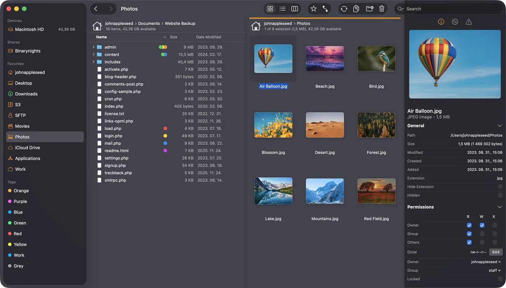</a> | [ForkLift](references/43-forklift/README.md) · [official product](https://binarynights.com/) | owner-published media, 2 named gaps | Operations | sidebar-content-inspector: Leading navigation, central work area, and trailing detail inspector. Panels: toolbar/header (top); navigation/list sidebar (leading); detail/inspector (trailing); primary canvas/content (center). Density: low; confidence: medium. | Study dual-pane local and remote browsing, tabs, sidebar favorites, synchronized navigation, batch operations, and keyboard file commands. |
| 44 | <a href="https://cyberduck.io/">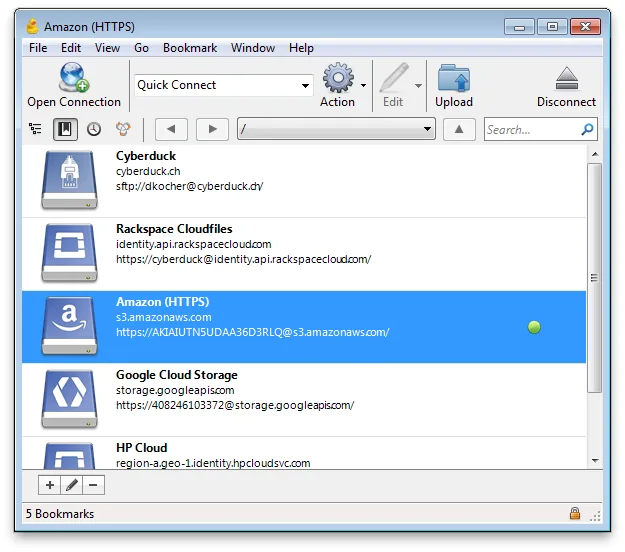</a> | [Cyberduck](references/44-cyberduck/README.md) · [official product](https://cyberduck.io/) | owner-published media, 2 named gaps | Operations | sidebar-content: Leading navigation or collection list beside a dominant content area. Panels: toolbar/header (top); status/action bar (bottom); navigation/list sidebar (leading); data table/list (center). Density: low; confidence: medium. | Study bookmark-based connection management, remote file browser, transfer queue, contextual actions, and protocol-independent command structure. |
| 45 | <a href="https://www.obdev.at/products/littlesnitch/index.html">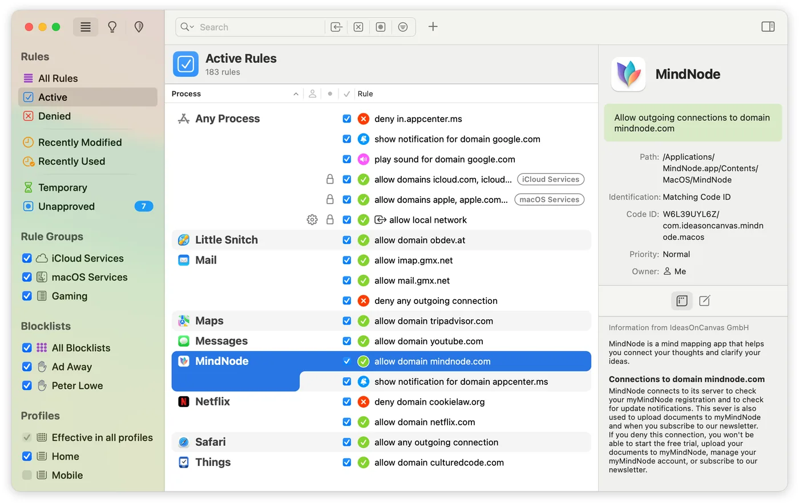</a> | [Little Snitch](references/45-little-snitch/README.md) · [official product](https://www.obdev.at/products/littlesnitch/index.html) | owner-published media, 2 named gaps | Operations | content-inspector: Dominant content area with a trailing detail or property inspector. Panels: toolbar/header (top); status/action bar (bottom); detail/inspector (trailing); data table/list (center). Density: medium; confidence: medium. | Study its real-time connection alerts, rule-building controls, network monitor timeline, process lists, and drill-down traffic inspection. |
| 46 | <a href="https://iterm2.com/">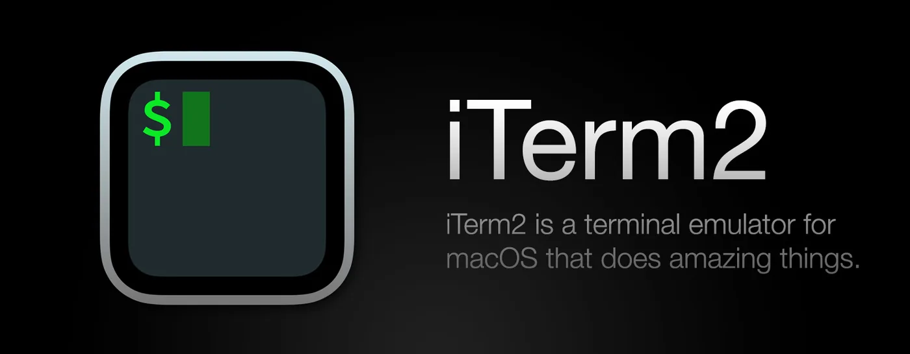</a> | [iTerm2](references/46-iterm2/README.md) · [official product](https://iterm2.com/) | owner-published media, 2 named gaps | Operations | sidebar-content-inspector: Leading navigation, central work area, and trailing detail inspector. Panels: toolbar/header (top); navigation/list sidebar (leading); detail/inspector (trailing); primary canvas/content (center). Density: low; confidence: medium. | Study split terminal panes, profiles, searchable command history, hotkey windows, status components, and extensive keyboard configuration. |
| 47 |  | [Things](references/47-things/README.md) · [official product](https://culturedcode.com/things/) | owner-published media, 2 named gaps | Productivity | sidebar-content-inspector: Leading navigation, central work area, and trailing detail inspector. Panels: toolbar/header (top); navigation/list sidebar (leading); detail/inspector (trailing); data table/list (center). Density: low; confidence: medium. | Study its project and area sidebar, Today list, quick-entry window, inline scheduling, and restrained keyboard-driven task editing. |
| 48 |  | [OmniFocus](references/48-omnifocus/README.md) · [official product](https://www.omnigroup.com/omnifocus/) | owner-published media, 2 named gaps | Productivity | sidebar-content-inspector: Leading navigation, central work area, and trailing detail inspector. Panels: toolbar/header (top); status/action bar (bottom); navigation/list sidebar (leading); detail/inspector (trailing); primary canvas/content (center). Density: low; confidence: high. | Study perspective-based navigation, outline-style task hierarchy, forecast view, inspector editing, quick entry, and customizable shortcuts. |
| 49 |  | [Fantastical](references/49-fantastical/README.md) · [official product](https://flexibits.com/fantastical) | owner-published media, 2 named gaps | Productivity | sidebar-content: Leading navigation or collection list beside a dominant content area. Panels: toolbar/header (top); status/action bar (bottom); navigation/list sidebar (leading); primary canvas/content (center). Density: low; confidence: high. | Study natural-language event entry, calendar-set sidebar, day and week navigation, menu-bar mini window, and detail popovers. |
| 50 |  | [MindNode](references/50-mindnode/README.md) · [official product](https://www.mindnode.com/) | owner-published media, 2 named gaps | Productivity | sidebar-content-inspector: Leading navigation, central work area, and trailing detail inspector. Panels: toolbar/header (top); status/action bar (bottom); navigation/list sidebar (leading); detail/inspector (trailing); primary canvas/content (center). Density: low; confidence: medium. | Study canvas-based node editing, outline synchronization, inspector controls, focus mode, and keyboard creation of hierarchical branches. |

Normalized panel bounds, detected separators, image dimensions, source-image URLs, hashes, and analysis confidence are recorded in [`sources.json`](sources.json). Media kinds, measured durations, provenance classes, and per-record gaps are in [`references.json`](references.json).

Attribution and product ownership remain with the linked source.
