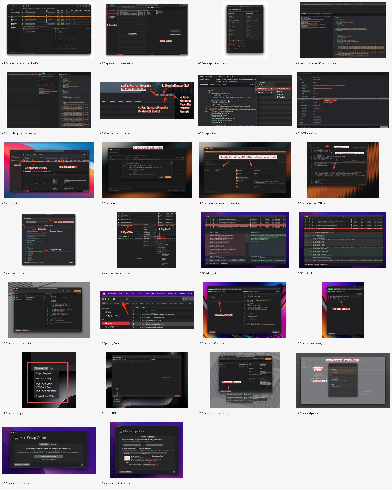

# 24. Proxyman — observed macOS product reference

**Evidence status:** complete  
**Product:** [https://proxyman.io/](https://proxyman.io/)  
**Motion source:** [https://assets.proxyman.com/assets/video/dashboard-demo-2026.mp4](https://assets.proxyman.com/assets/video/dashboard-demo-2026.mp4)  
**Upstream owner / recording owner:** Proxyman  
**Captured:** 2026-08-16T23:27:18Z

<video controls src="media/motion.mp4" width="960"></video>

The local clip is authentic product motion, not animation synthesized from stills. Downloaded from the official product site or official App Store preview and transcoded as a time-preserving H.264 excerpt; no frames were synthesized. Offline identity: `1810783a981e678a2d6203a82da5c4b739fbad134f76b73f9c1dd378dd9fb0e3` (364630 bytes, 960×536, 18.000s, 270 frames).

## First-success journey

**Actor:** A first-time or returning Proxyman user  
**Goal:** Capture and inspect a network request  
**Prerequisites:** Proxyman available on macOS or the official recording environment; The product-specific input, document, account, repository, server, or project shown by the recording when required

| Step | Observed user action | Product response | Evidence |
|---:|---|---|---|
| 1 | Start Proxyman capture | Proxyman advances to the entry state retained in state 1. | `media/state-01.png extracted from media/motion.mp4 at 1.44s` |
| 2 | Choose a traffic source | Proxyman advances to the invocation state retained in state 2. | `media/state-02.png extracted from media/motion.mp4 at 5.04s` |
| 3 | Select a captured request | Proxyman advances to the focused intermediate state retained in state 3. | `media/state-03.png extracted from media/motion.mp4 at 8.64s` |
| 4 | Inspect request and response details | Proxyman advances to the committed transition retained in state 4. | `media/state-04.png extracted from media/motion.mp4 at 12.24s` |
| 5 | Observe the meaningful captured transaction | Proxyman advances to the first-success result retained in state 5. | `media/state-05.png extracted from media/motion.mp4 at 15.84s` |

**Failure route:** Stop at the third retained state before confirmation; the meaningful result is absent. Treat a mismatched selection or incomplete input as non-success rather than inferring an unseen error.  
**Recovery route:** Return to the second retained state and restore the intended focus or selection. Repeat the fourth-state confirmation and verify the fifth-state completion evidence.  
**Completion evidence:** `media/state-05.png extracted from media/motion.mp4 at 15.84s`

## Retained product states

All states are direct frame extractions from `media/motion.mp4`.

| State | Name | Local file | Motion time | SHA-256 |
|---:|---|---|---:|---|
| 1 | Entry state: Start Proxyman capture | `media/state-01.png` | 1.44s | `3cf89f1a3ca059bd661fd488c3509dfeb3f51d09688450c5a1f23f62a631586c` |
| 2 | Invocation state: Choose a traffic source | `media/state-02.png` | 5.04s | `6c19b6e03aeee8619eec3a7ca2bb7eeee27dd2cdf39a0c90f27cf72578b73f9d` |
| 3 | Focused intermediate state: Select a captured request | `media/state-03.png` | 8.64s | `7fe50a782f7c2df2d537eb3f2997cc47e2686ee72f7b6b11fd8df3e71e0447fe` |
| 4 | Committed transition: Inspect request and response details | `media/state-04.png` | 12.24s | `53ee6e05b1991ef62abd58ecd0ef71dad50d4fc7c6ed35ccdff55c8109106701` |
| 5 | First-success result: Observe the meaningful captured transaction | `media/state-05.png` | 15.84s | `3f8010e3fe773c77f4018158a32d5a6f53d532ef7ba6b555932a617d4e6f4af6` |

## Interaction map

| Interaction | Trigger | Response / feedback | Failure | Recovery |
|---|---|---|---|---|
| Primary input | Start Proxyman capture | Proxyman exposes the entry surface visible in the retained motion. | The goal is not yet complete in the entry state. | Choose a traffic source. |
| Focus and selection | Choose a traffic source | A target control, item, document, or workspace becomes the active context. | An unintended target would leave the desired result unavailable. | Move focus to the intended visible target and continue. |
| Navigation | Select a captured request | The recording advances into the product’s intermediate working state. | Stopping at this state produces no completion evidence. | Inspect request and response details. |
| Confirmation | Inspect request and response details | The selected operation crosses from preparation into a committed transition. | Without confirmation, the fifth-state result does not appear. | Repeat the intended selection and confirm it. |
| Completion feedback | Observe the meaningful captured transaction | The recording reaches the first meaningful result for “Capture and inspect a network request”. | Absence of the fifth state means the journey is incomplete. | Replay the recorded sequence from the entry state. |
| Cancellation and backtracking | Leave the path before the committed transition. | The visible intermediate surface remains non-destructive until the confirmation boundary shown by the excerpt. | Exiting early does not produce completion evidence. | Re-enter through state 2 and continue to state 4. |
| Failure boundary | Use an incomplete, unselected, or unconfirmed intermediate state. | The meaningful result is absent; the recording still shows the preparation surface. | The observed boundary is non-completion rather than an invented error dialog. | Restore the intended selection and cross the recorded confirmation boundary. |
| Recovery | Resume from the last valid intermediate state. | The same visible action sequence advances to the retained result. | A replay that never reaches state 5 remains incomplete. | Replay state 4 and verify state 5. |

Cancellation and backtracking are bounded at the pre-confirmation states; no unseen error dialog, undo behavior, or recovery animation is claimed.

## Motion analysis

- **Trigger:** Start Proxyman capture.
- **Start state:** Start Proxyman capture.
- **End state:** Observe the meaningful captured transaction.
- **Continuity:** the MP4 preserves recorded temporal order; the five PNGs are decoded directly from it.
- **Timing class:** short edited product demonstration (18.000s retained).
- **Interruption / reversal:** stopping before state 4 leaves the journey incomplete. No reversal is claimed unless visible.
- **Feedback:** selection, content, layout, or result changes across the retained frames show progress and completion.
- **Reduced-motion equivalent:** `state-01.png` through `state-05.png` preserve the ordered evidence without playback; product-level Reduce Motion behavior is unknown.

## Accessibility

Observed:

- Active focus or selection is conveyed by a visible change between retained states.
- The excerpt preserves the native macOS/product visual hierarchy and pointer/keyboard-driven state changes where shown.
- The five extracted frames provide a nonanimated way to inspect the same sequence.

Unknown:

- VoiceOver announcements and accessible names are not audible in the retained excerpt.
- Full Keyboard Access order is not proven unless explicitly visible in the recording.
- The product’s Reduce Motion behavior and contrast preferences are not demonstrated.

## Provenance

- **Product page:** https://proxyman.io/
- **Original motion:** https://assets.proxyman.com/assets/video/dashboard-demo-2026.mp4
- **Capture method:** Downloaded from the official product site or official App Store preview and transcoded as a time-preserving H.264 excerpt; no frames were synthesized.
- **Captured at:** 2026-08-16T23:27:18Z
- **Media metadata:** 960×536; 18.000s; 270 frames; 364630 bytes
- **SHA-256:** `1810783a981e678a2d6203a82da5c4b739fbad134f76b73f9c1dd378dd9fb0e3`
- **Ownership:** Proxyman. Product and recording rights remain with their respective upstream owners.

## Integrated deep reference

The same record retains 26 attributed official screens beside the motion evidence under [`media/screens/`](media/screens/). There is one source of truth: `reference.json` carries the screen title, surface family, source page and image URLs, local path, dimensions, byte count and SHA-256 for every screen.

| Surface family | What the retained screens cover |
|---|---|
| Capture and inspect | Dashboard, captured traffic, request and response inspection |
| Inspector configuration and layout | Previewer tabs, horizontal and vertical layouts, workspace controls |
| Payload inspection and filtering | Body preview, JSON tree and combined filters |
| Interception and rules | Breakpoints, rule editing, raw mutations and local mapping |
| Comparison | Side-by-side and unified differences |
| Request composition | Main composer, launch, JSON, raw, templates, cURL and history |
| Command navigation | Command palette |
| Onboarding and trust | Automatic and manual certificate setup |
