# Onboarding and authentication examples

Account creation, identity, workspace setup, provisioning, and first-success journeys.

Each entry pairs an attributed overview image and a measured panel anatomy with a per-product record: motion evidence, named states, an observed first-success journey, interaction and recovery behavior, accessibility observations, and provenance. Every number below is measured by `verify-reference-evidence.py`, and a record that is missing evidence says so in its own `evidence_gaps`.

**Examples:** 50  
**Images:** 50  
**Structural analyses:** 50  
**Records with no remaining gap:** 0  
**Records with named gaps:** 50 (100 gaps)  
**Motion provenance:** 50 owner-published media  
**Curated:** 2026-08-16  
**Visual source data:** [`sources.json`](sources.json)  
**Record index:** [`references.json`](references.json)  
**Cross-example synthesis:** [`full-reference.md`](full-reference.md)

| # | Reference image | Record | Motion evidence | Category | Interface structure | What to study |
|---:|---|---|---|---|---|---|
| 1 |  | [Slack — workspace creation](references/01-slack-workspace-creation/README.md) · [official product](https://slack.com/help/articles/206845317-Create-a-Slack-workspace) | owner-published media, 2 named gaps | Collaboration / workspace creation | sidebar-content: Leading navigation or collection list beside a dominant content area. Panels: toolbar/header (top); navigation/list sidebar (leading); primary canvas/content (center). Density: low; confidence: high. | Study the staged workspace-creation sequence that collects team context before inviting additional members. |
| 2 | <a href="https://www.notion.com/help/create-delete-and-switch-workspaces">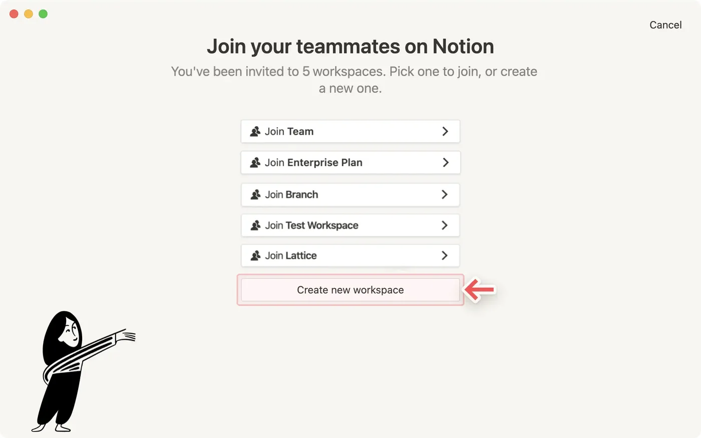</a> | [Notion — create and switch workspaces](references/02-notion-create-and-switch-workspaces/README.md) · [official product](https://www.notion.com/help/create-delete-and-switch-workspaces) | owner-published media, 2 named gaps | Collaboration / workspace creation | sidebar-content-inspector: Leading navigation, central work area, and trailing detail inspector. Panels: toolbar/header (top); navigation/list sidebar (leading); detail/inspector (trailing); primary canvas/content (center). Density: low; confidence: medium. | Study how workspace creation, account context, and switching between personal and team spaces are explained together. |
| 3 |  | [Asana — account setup](references/03-asana-account-setup/README.md) · [official product](https://asana.com/guide/get-started/begin/quick-start) | owner-published media, 2 named gaps | Collaboration / account creation | sidebar-content-inspector: Leading navigation, central work area, and trailing detail inspector. Panels: toolbar/header (top); status/action bar (bottom); navigation/list sidebar (leading); detail/inspector (trailing); primary canvas/content (center). Density: low; confidence: medium. | Study the progressive account setup that connects identity, organization membership, and initial team configuration. |
| 4 | <a href="https://support.atlassian.com/user-management/docs/invite-a-user/">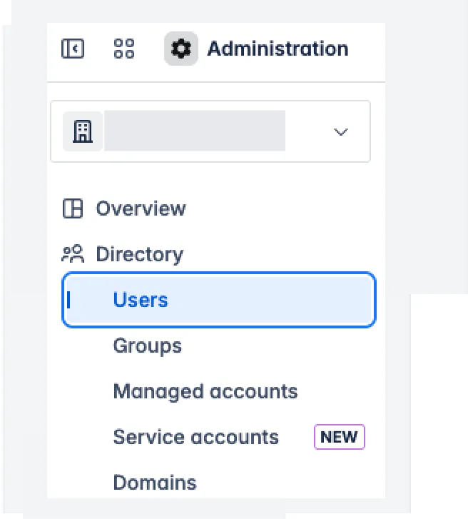</a> | [Atlassian — invite users to a site](references/04-atlassian-invite-users-to-a-site/README.md) · [official product](https://support.atlassian.com/user-management/docs/invite-a-user/) | owner-published media, 2 named gaps | Enterprise collaboration / invitations | sidebar-content: Leading navigation or collection list beside a dominant content area. Panels: toolbar/header (top); status/action bar (bottom); navigation/list sidebar (leading); primary canvas/content (center). Density: low; confidence: medium. | Study the administrator-led invitation flow, including product access selection and pending-invite status. |
| 5 | <a href="https://help.miro.com/hc/en-us/articles/360017730233-Miro-basics">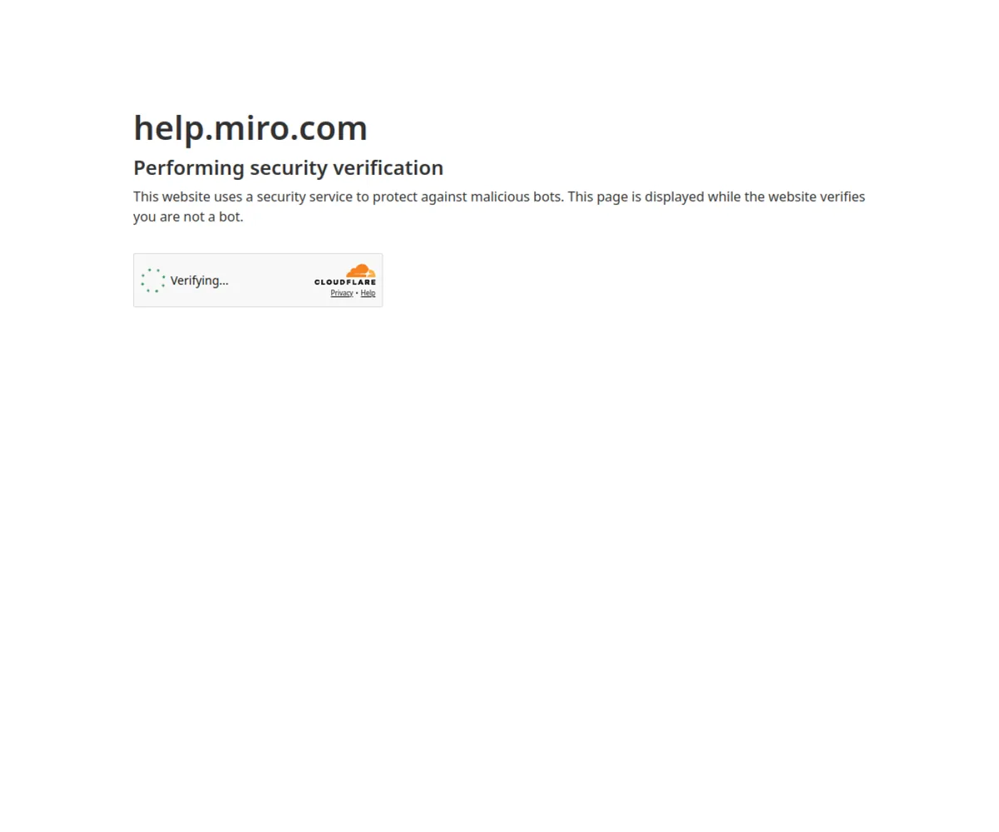</a> | [Miro — getting started](references/05-miro-getting-started/README.md) · [official product](https://help.miro.com/hc/en-us/articles/360017730233-Miro-basics) | owner-published media, 2 named gaps | Collaboration / first-run setup | sidebar-content: Leading navigation or collection list beside a dominant content area. Panels: toolbar/header (top); navigation/list sidebar (leading); primary canvas/content (center). Density: low; confidence: medium. | Study the first-run path from profile setup into team creation, board creation, and collaborator invitation. |
| 6 |  | [Figma — create a team](references/06-figma-create-a-team/README.md) · [official product](https://help.figma.com/hc/en-us/articles/360039484194-Create-a-new-team) | owner-published media, 2 named gaps | Design collaboration / workspace creation | sidebar-content-inspector: Leading navigation, central work area, and trailing detail inspector. Panels: toolbar/header (top); navigation/list sidebar (leading); detail/inspector (trailing); primary canvas/content (center). Density: low; confidence: medium. | Study the team-creation flow that pairs workspace naming with member invitations and plan context. |
| 7 |  | [Airtable — onboarding](references/07-airtable-onboarding/README.md) · [official product](https://support.airtable.com/docs/getting-started-with-airtable) | owner-published media, 2 named gaps | Collaboration / onboarding | content-inspector: Dominant content area with a trailing detail or property inspector. Panels: toolbar/header (top); status/action bar (bottom); detail/inspector (trailing); data table/list (center). Density: low; confidence: medium. | Study the guided onboarding checklist that moves users from account entry to a populated first workflow. |
| 8 | <a href="https://help.clickup.com/hc/en-us/articles/6310834724247-Intro-to-onboarding">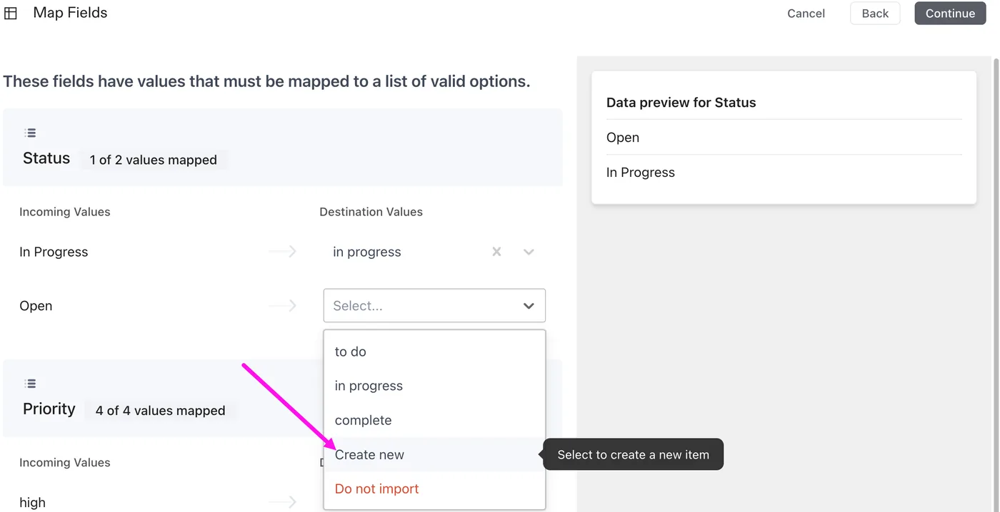</a> | [ClickUp — onboarding](references/08-clickup-onboarding/README.md) · [official product](https://help.clickup.com/hc/en-us/articles/6310834724247-Intro-to-onboarding) | owner-published media, 2 named gaps | Work management / onboarding | sidebar-content: Leading navigation or collection list beside a dominant content area. Panels: toolbar/header (top); status/action bar (bottom); navigation/list sidebar (leading); primary canvas/content (center). Density: low; confidence: high. | Study the role-sensitive onboarding path that introduces hierarchy, workspace concepts, and initial configuration tasks. |
| 9 | <a href="https://support.monday.com/hc/en-us/articles/115005305649-Get-started-with-monday-AI-work-platform">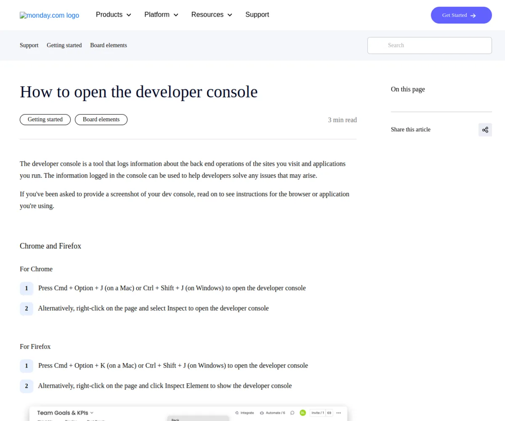</a> | [monday.com — getting started](references/09-monday-com-getting-started/README.md) · [official product](https://support.monday.com/hc/en-us/articles/115005305649-Get-started-with-monday-AI-work-platform) | owner-published media, 2 named gaps | Work management / first-run setup | sidebar-content: Leading navigation or collection list beside a dominant content area. Panels: toolbar/header (top); status/action bar (bottom); navigation/list sidebar (leading); primary canvas/content (center). Density: low; confidence: medium. | Study the first-board setup sequence that combines template choice, data entry, and teammate invitations. |
| 10 | <a href="https://support.atlassian.com/trello/docs/creating-a-new-workspace/">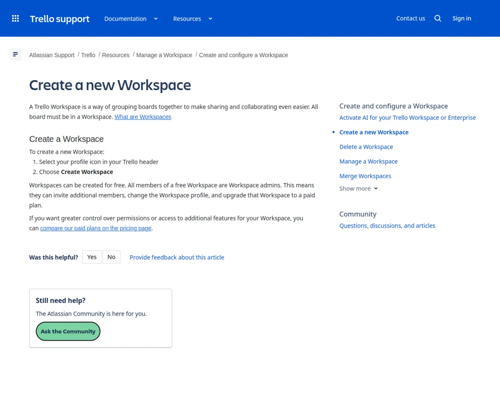</a> | [Trello — create a Workspace](references/10-trello-create-a-workspace/README.md) · [official product](https://support.atlassian.com/trello/docs/creating-a-new-workspace/) | owner-published media, 2 named gaps | Collaboration / workspace creation | sidebar-content: Leading navigation or collection list beside a dominant content area. Panels: toolbar/header (top); navigation/list sidebar (leading); primary canvas/content (center). Density: low; confidence: high. | Study the lightweight workspace-creation form and how it leads directly into member and board organization. |
| 11 |  | [Zoom — sign up and activate an account](references/11-zoom-sign-up-and-activate-an-account/README.md) · [official product](https://support.zoom.com/hc/en/article?id=zm_kb&sysparm_article=KB0063655) | owner-published media, 2 named gaps | Communication / account creation | sidebar-content-inspector: Leading navigation, central work area, and trailing detail inspector. Panels: toolbar/header (top); navigation/list sidebar (leading); detail/inspector (trailing); primary canvas/content (center). Density: low; confidence: medium. | Study the email activation loop, including age confirmation, identity setup, and return from email to product. |
| 12 | <a href="https://help.webex.com/en-us/article/nrbgeodb/Get-started-with-Webex-App">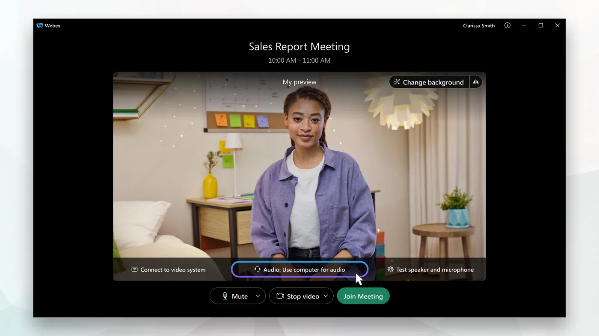</a> | [Cisco Webex — get started](references/12-cisco-webex-get-started/README.md) · [official product](https://help.webex.com/en-us/article/nrbgeodb/Get-started-with-Webex-App) | owner-published media, 2 named gaps | Enterprise communication / onboarding | sidebar-content-inspector: Leading navigation, central work area, and trailing detail inspector. Panels: toolbar/header (top); status/action bar (bottom); navigation/list sidebar (leading); detail/inspector (trailing); primary canvas/content (center). Density: low; confidence: medium. | Study how first sign-in, permissions, profile completion, and initial communication actions are introduced. |
| 13 |  | [Discord — getting started](references/13-discord-getting-started/README.md) · [official product](https://support.discord.com/hc/en-us/articles/360033931551-Getting-Started) | owner-published media, 2 named gaps | Consumer communication / onboarding | sidebar-content-inspector: Leading navigation, central work area, and trailing detail inspector. Panels: toolbar/header (top); navigation/list sidebar (leading); detail/inspector (trailing); primary canvas/content (center). Density: low; confidence: medium. | Study the path from account registration into server discovery or creation and early identity customization. |
| 14 | <a href="https://help.dropbox.com/create-upload/add-files">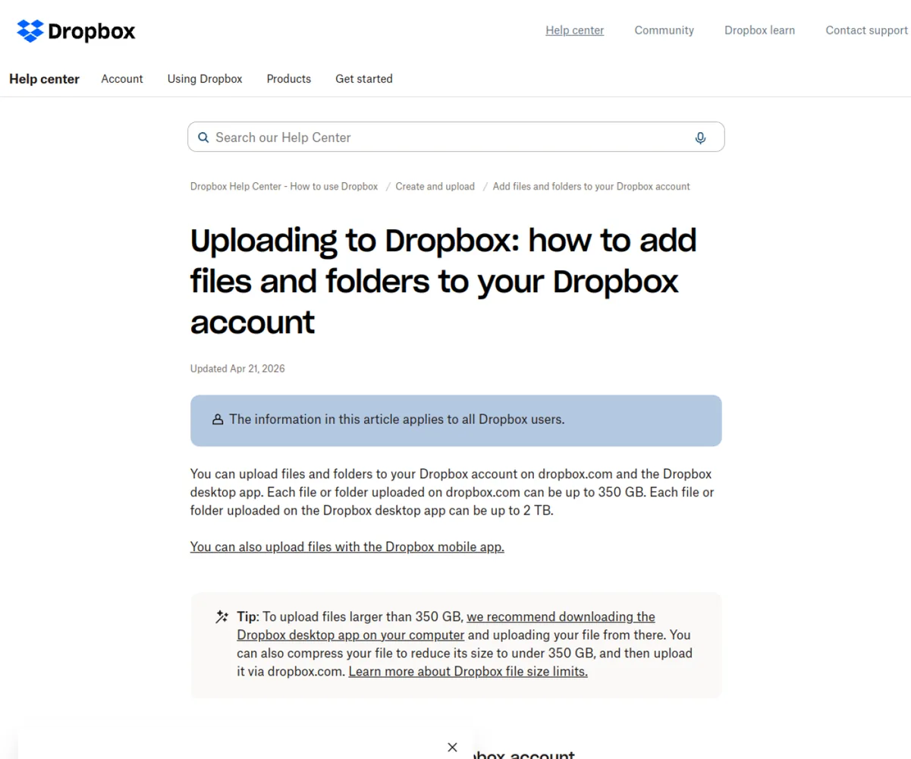</a> | [Dropbox — import files and folders](references/14-dropbox-import-files-and-folders/README.md) · [official product](https://help.dropbox.com/create-upload/add-files) | owner-published media, 2 named gaps | Cloud storage / import | sidebar-content-inspector: Leading navigation, central work area, and trailing detail inspector. Panels: toolbar/header (top); status/action bar (bottom); navigation/list sidebar (leading); detail/inspector (trailing); primary canvas/content (center). Density: low; confidence: medium. | Study the multiple import entry points for file upload, folder upload, drag-and-drop, and desktop synchronization. |
| 15 | <a href="https://knowledge.workspace.google.com/admin/getting-started/set-up-google-workspace-for-your-organization">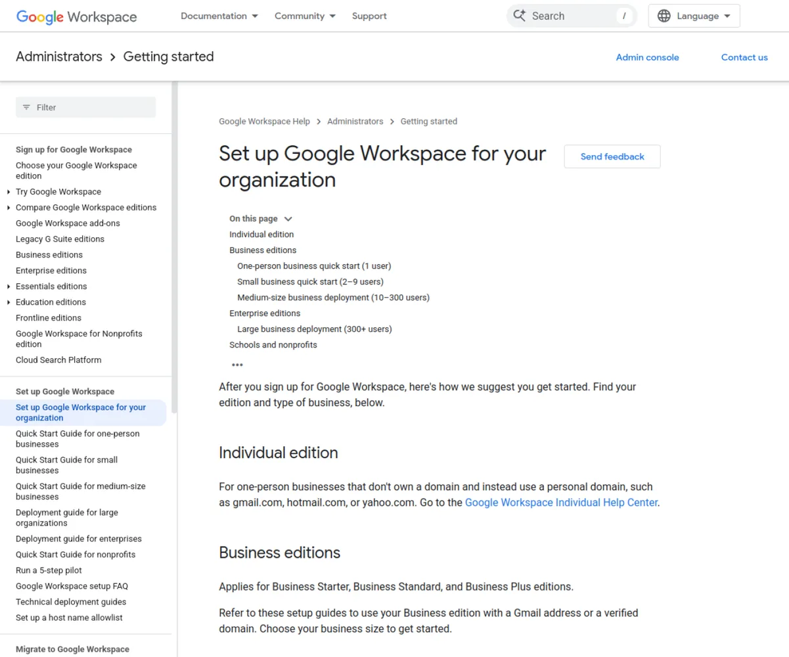</a> | [Google Workspace — setup guide](references/15-google-workspace-setup-guide/README.md) · [official product](https://knowledge.workspace.google.com/admin/getting-started/set-up-google-workspace-for-your-organization) | owner-published media, 2 named gaps | Enterprise productivity / first-run setup | sidebar-content: Leading navigation or collection list beside a dominant content area. Panels: toolbar/header (top); status/action bar (bottom); navigation/list sidebar (leading); data table/list (center). Density: low; confidence: high. | Study the administrator checklist that sequences domain verification, user creation, Gmail activation, and migration. |
| 16 |  | [Microsoft 365 — setup wizard](references/16-microsoft-365-setup-wizard/README.md) · [official product](https://learn.microsoft.com/en-us/microsoft-365/admin/setup/setup-business-basic?view=o365-worldwide) | owner-published media, 2 named gaps | Enterprise productivity / setup wizard | sidebar-content-inspector: Leading navigation, central work area, and trailing detail inspector. Panels: toolbar/header (top); navigation/list sidebar (leading); detail/inspector (trailing); primary canvas/content (center). Density: low; confidence: medium. | Study the guided setup model that adapts recommended configuration tasks to an administrator’s selected services. |
| 17 |  | [Canva — sign up or log in](references/17-canva-sign-up-or-log-in/README.md) · [official product](https://www.canva.com/help/sign-up-log-in/) | owner-published media, 2 named gaps | Design / account creation and sign-in | sidebar-content-inspector: Leading navigation, central work area, and trailing detail inspector. Panels: toolbar/header (top); navigation/list sidebar (leading); detail/inspector (trailing); primary canvas/content (center). Density: low; confidence: medium. | Study how multiple identity providers, email registration, and existing-account recovery are presented in one flow. |
| 18 | <a href="https://learning.postman.com/docs/collaborating-in-postman/using-workspaces/creating-workspaces/">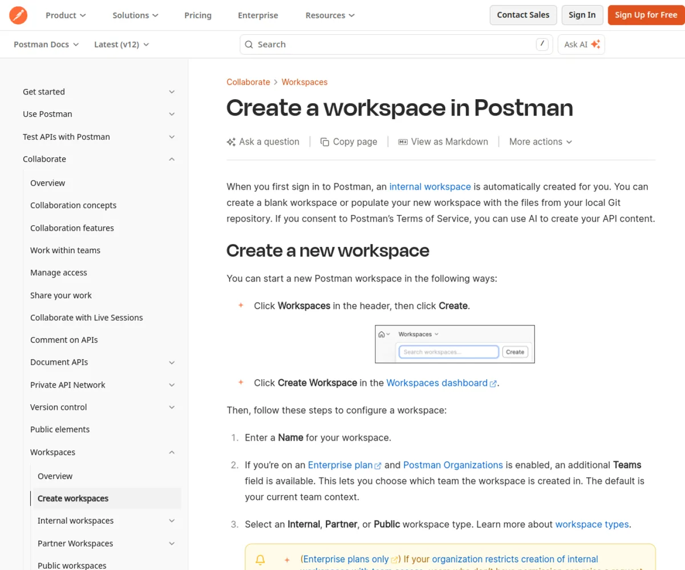</a> | [Postman — create and manage workspaces](references/18-postman-create-and-manage-workspaces/README.md) · [official product](https://learning.postman.com/docs/collaborating-in-postman/using-workspaces/creating-workspaces/) | owner-published media, 2 named gaps | Developer collaboration / workspace creation | sidebar-content: Leading navigation or collection list beside a dominant content area. Panels: toolbar/header (top); status/action bar (bottom); navigation/list sidebar (leading); primary canvas/content (center). Density: low; confidence: high. | Study workspace creation with explicit visibility choices, naming, summaries, and invitation paths for collaborators. |
| 19 |  | [GitHub — creating an account](references/19-github-creating-an-account/README.md) · [official product](https://docs.github.com/en/get-started/start-your-journey/creating-an-account-on-github) | owner-published media, 2 named gaps | Developer platform / account creation | sidebar-content-inspector: Leading navigation, central work area, and trailing detail inspector. Panels: toolbar/header (top); navigation/list sidebar (leading); detail/inspector (trailing); primary canvas/content (center). Density: low; confidence: medium. | Study the registration sequence combining credential creation, email verification, personalization, and optional plan decisions. |
| 20 | <a href="https://docs.gitlab.com/user/profile/account/create_accounts/">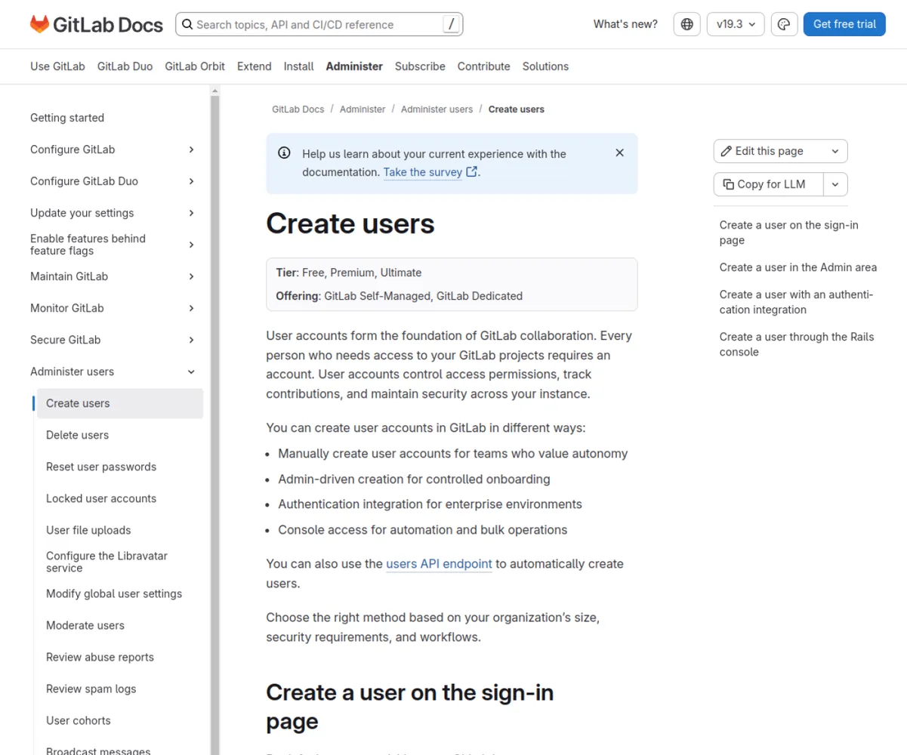</a> | [GitLab — user account](references/20-gitlab-user-account/README.md) · [official product](https://docs.gitlab.com/user/profile/account/create_accounts/) | owner-published media, 2 named gaps | Developer platform / account creation | sidebar-content: Leading navigation or collection list beside a dominant content area. Panels: toolbar/header (top); status/action bar (bottom); navigation/list sidebar (leading); primary canvas/content (center). Density: medium; confidence: medium. | Study how self-registration, administrator-created accounts, invitations, and external authentication are distinguished. |
| 21 | <a href="https://vercel.com/docs/getting-started-with-vercel/import">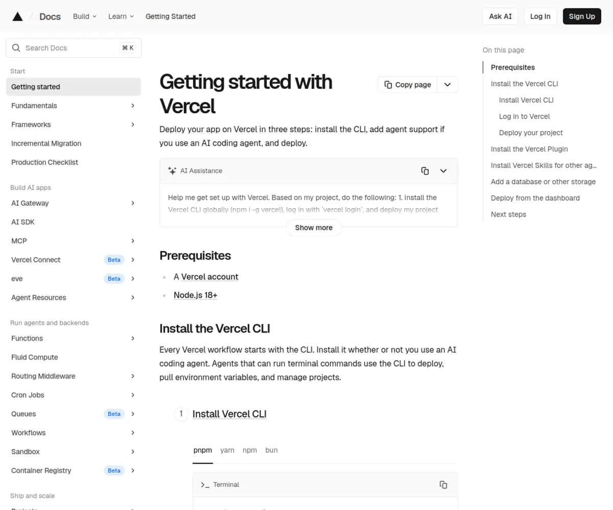</a> | [Vercel — import a Git repository](references/21-vercel-import-a-git-repository/README.md) · [official product](https://vercel.com/docs/getting-started-with-vercel/import) | owner-published media, 2 named gaps | Developer platform / import | sidebar-content: Leading navigation or collection list beside a dominant content area. Panels: toolbar/header (top); navigation/list sidebar (leading); primary canvas/content (center). Density: low; confidence: high. | Study the repository-import flow that progressively requests provider access, project settings, and deployment configuration. |
| 22 |  | [Netlify — import an existing project](references/22-netlify-import-an-existing-project/README.md) · [official product](https://docs.netlify.com/welcome/add-new-site/) | owner-published media, 2 named gaps | Developer platform / import | sidebar-content-inspector: Leading navigation, central work area, and trailing detail inspector. Panels: toolbar/header (top); navigation/list sidebar (leading); detail/inspector (trailing); primary canvas/content (center). Density: low; confidence: medium. | Study the import path from Git provider authorization through repository selection, build settings, and first deployment. |
| 23 | <a href="https://render.com/docs/deploys">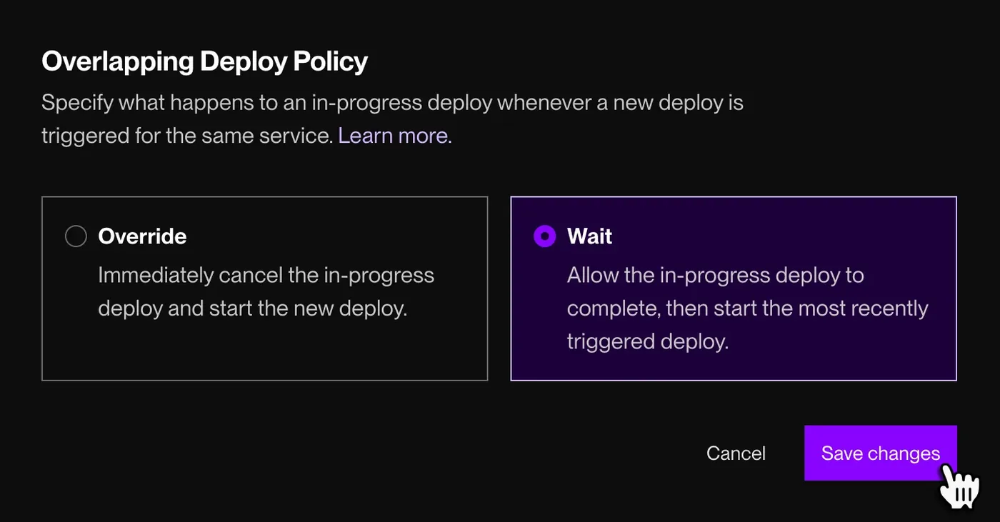</a> | [Render — deploy from a Git repository](references/23-render-deploy-from-a-git-repository/README.md) · [official product](https://render.com/docs/deploys) | owner-published media, 2 named gaps | Developer platform / first-run deployment | sidebar-content-inspector: Leading navigation, central work area, and trailing detail inspector. Panels: toolbar/header (top); navigation/list sidebar (leading); detail/inspector (trailing); primary canvas/content (center). Density: low; confidence: medium. | Study the connected-repository authorization and service setup flow that culminates in a visible initial deploy. |
| 24 |  | [Heroku — deploying with Git](references/24-heroku-deploying-with-git/README.md) · [official product](https://devcenter.heroku.com/articles/git) | owner-published media, 2 named gaps | Developer platform / first-run deployment | sidebar-content-inspector: Leading navigation, central work area, and trailing detail inspector. Panels: toolbar/header (top); status/action bar (bottom); navigation/list sidebar (leading); detail/inspector (trailing); primary canvas/content (center). Density: low; confidence: medium. | Study the command-line onboarding pattern that links authentication, app creation, repository push, and deployment feedback. |
| 25 |  | [Docker Desktop — sign in](references/25-docker-desktop-sign-in/README.md) · [official product](https://docs.docker.com/desktop/setup/sign-in/) | owner-published media, 2 named gaps | Developer tools / sign-in | sidebar-content-inspector: Leading navigation, central work area, and trailing detail inspector. Panels: toolbar/header (top); status/action bar (bottom); navigation/list sidebar (leading); detail/inspector (trailing); primary canvas/content (center). Density: low; confidence: medium. | Study the browser-mediated desktop sign-in handoff and the treatment of organizations, subscriptions, and authentication requirements. |
| 26 | <a href="https://docs.sentry.io/product/sentry-basics/integrate-frontend/onboarding-guides/">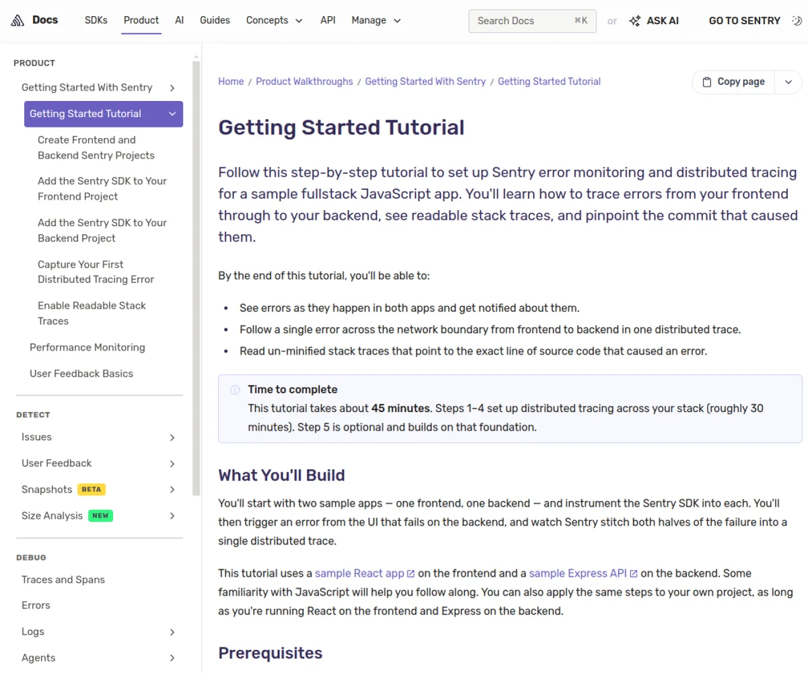</a> | [Sentry — guided onboarding](references/26-sentry-guided-onboarding/README.md) · [official product](https://docs.sentry.io/product/sentry-basics/integrate-frontend/onboarding-guides/) | owner-published media, 2 named gaps | Developer monitoring / onboarding | sidebar-content: Leading navigation or collection list beside a dominant content area. Panels: toolbar/header (top); status/action bar (bottom); navigation/list sidebar (leading); primary canvas/content (center). Density: medium; confidence: medium. | Study the framework-specific onboarding that generates tailored SDK installation steps and validates the first captured error. |
| 27 | <a href="https://docs.datadoghq.com/getting_started/">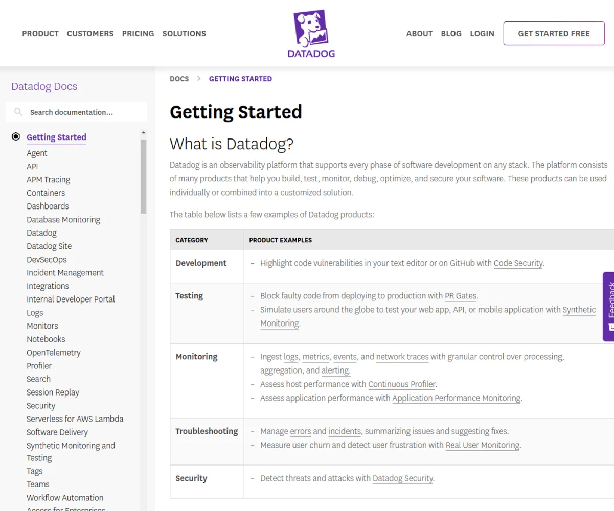</a> | [Datadog — getting started](references/27-datadog-getting-started/README.md) · [official product](https://docs.datadoghq.com/getting_started/) | owner-published media, 2 named gaps | Enterprise monitoring / onboarding | sidebar-content: Leading navigation or collection list beside a dominant content area. Panels: toolbar/header (top); status/action bar (bottom); navigation/list sidebar (leading); primary canvas/content (center). Density: low; confidence: medium. | Study the branching first-run information architecture that routes users by telemetry type, platform, and intended task. |
| 28 |  | [Twilio — account setup](references/28-twilio-account-setup/README.md) · [official product](https://www.twilio.com/docs/usage/tutorials/how-to-use-your-free-trial-account) | owner-published media, 2 named gaps | Developer communications / account setup | sidebar-content-inspector: Leading navigation, central work area, and trailing detail inspector. Panels: toolbar/header (top); status/action bar (bottom); navigation/list sidebar (leading); detail/inspector (trailing); primary canvas/content (center). Density: low; confidence: medium. | Study trial onboarding that introduces identity verification, project credentials, usage restrictions, and the first test action. |
| 29 | <a href="https://auth0.com/docs/authenticate/login/auth0-universal-login">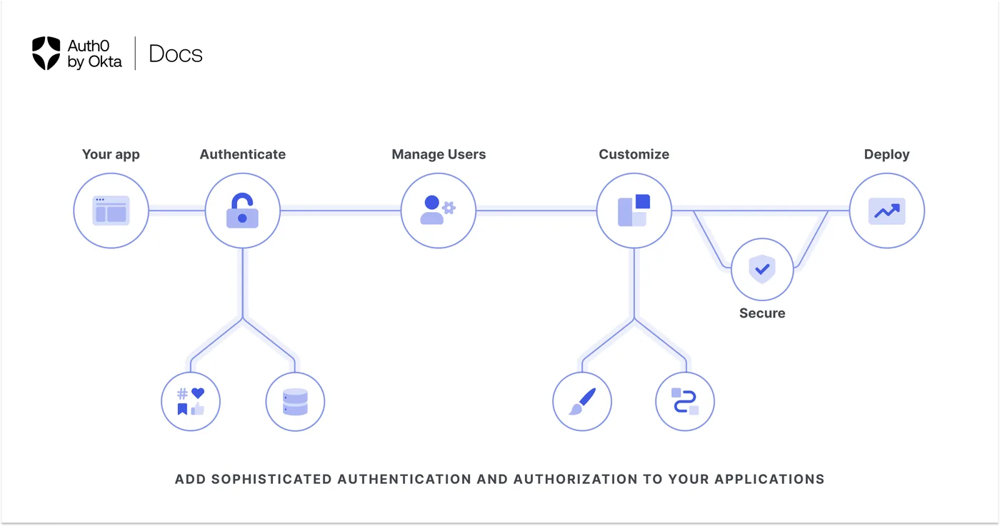</a> | [Auth0 — Universal Login](references/29-auth0-universal-login/README.md) · [official product](https://auth0.com/docs/authenticate/login/auth0-universal-login) | owner-published media, 2 named gaps | Identity platform / sign-in | sidebar-content-inspector: Leading navigation, central work area, and trailing detail inspector. Panels: toolbar/header (top); status/action bar (bottom); navigation/list sidebar (leading); detail/inspector (trailing); primary canvas/content (center). Density: low; confidence: medium. | Study the hosted authentication flow’s organization discovery, social and enterprise connections, and progressive identifier collection. |
| 30 | <a href="https://developer.okta.com/docs/guides/device-authorization-grant/main/">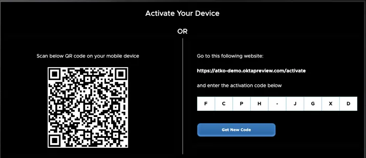</a> | [Okta — device authorization flow](references/30-okta-device-authorization-flow/README.md) · [official product](https://developer.okta.com/docs/guides/device-authorization-grant/main/) | owner-published media, 2 named gaps | Identity platform / device authorization | sidebar-content: Leading navigation or collection list beside a dominant content area. Panels: toolbar/header (top); navigation/list sidebar (leading); primary canvas/content (center). Density: low; confidence: medium. | Study the cross-device authorization pattern using a short user code, verification URL, polling, and explicit consent. |
| 31 |  | [Microsoft identity platform — device authorization grant](references/31-microsoft-identity-platform-device-authorization-grant/README.md) · [official product](https://learn.microsoft.com/en-us/entra/identity-platform/v2-oauth2-device-code) | owner-published media, 2 named gaps | Enterprise identity / device authorization | sidebar-content-inspector: Leading navigation, central work area, and trailing detail inspector. Panels: toolbar/header (top); navigation/list sidebar (leading); detail/inspector (trailing); primary canvas/content (center). Density: low; confidence: medium. | Study the device-code flow’s separation of constrained-device instructions, browser authentication, and token polling states. |
| 32 | <a href="https://docs.aws.amazon.com/singlesignon/latest/OIDCAPIReference/API_StartDeviceAuthorization.html">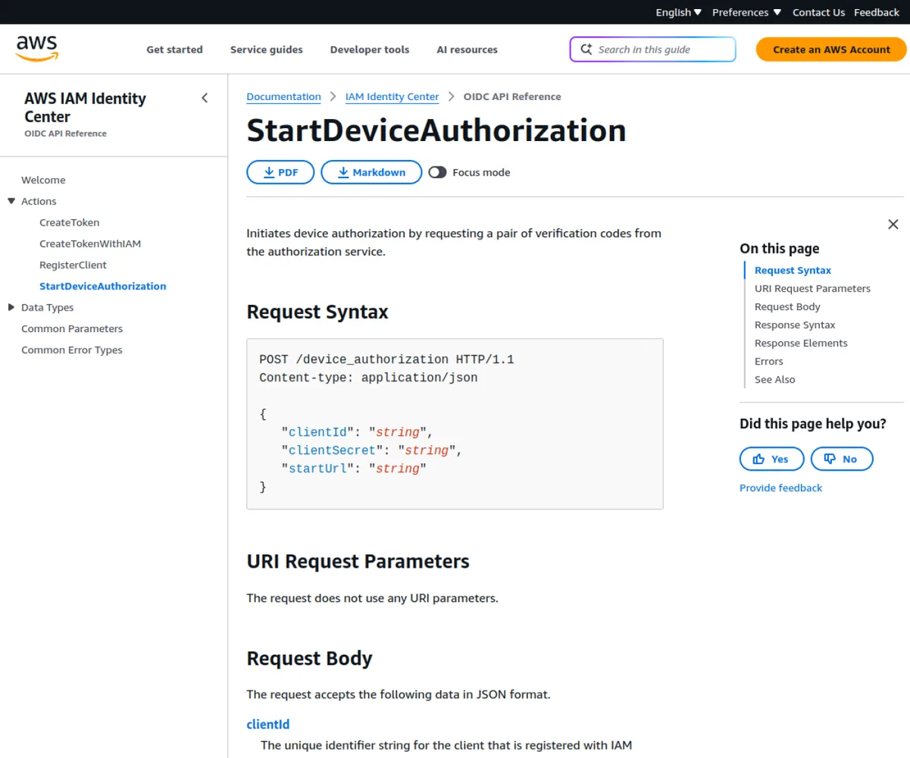</a> | [AWS IAM Identity Center — device authorization](references/32-aws-iam-identity-center-device-authorization/README.md) · [official product](https://docs.aws.amazon.com/singlesignon/latest/OIDCAPIReference/API_StartDeviceAuthorization.html) | owner-published media, 2 named gaps | Cloud security / device authorization | sidebar-content: Leading navigation or collection list beside a dominant content area. Panels: toolbar/header (top); navigation/list sidebar (leading); primary canvas/content (center). Density: low; confidence: medium. | Study the API information model for verification URIs, user codes, expiration windows, and polling intervals. |
| 33 |  | [Cloudflare Zero Trust — setup](references/33-cloudflare-zero-trust-setup/README.md) · [official product](https://developers.cloudflare.com/cloudflare-one/setup/) | owner-published media, 2 named gaps | Enterprise security / first-run setup | sidebar-content-inspector: Leading navigation, central work area, and trailing detail inspector. Panels: toolbar/header (top); navigation/list sidebar (leading); detail/inspector (trailing); primary canvas/content (center). Density: low; confidence: medium. | Study the administrator setup sequence that establishes an organization, identity provider, device client, and access policy. |
| 34 | <a href="https://tailscale.com/kb/1017/install">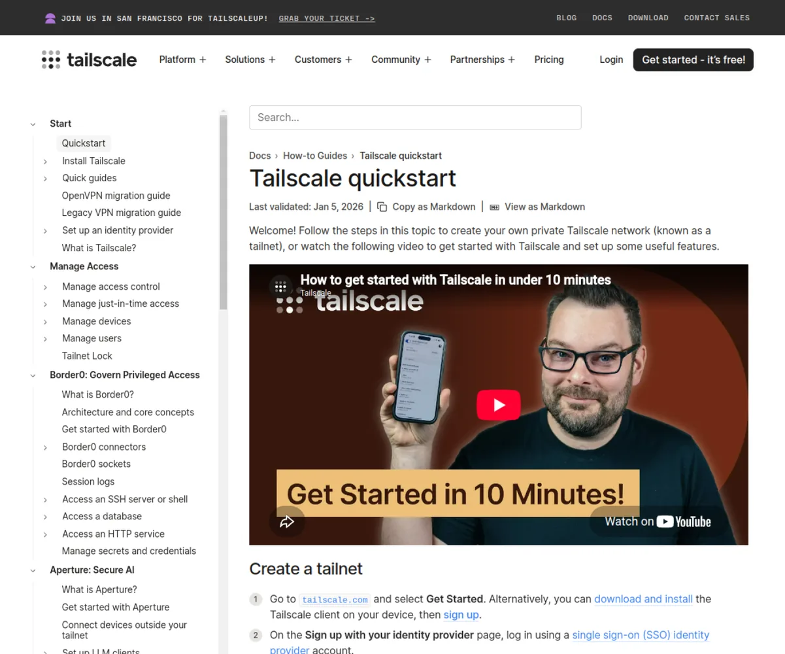</a> | [Tailscale — quickstart](references/34-tailscale-quickstart/README.md) · [official product](https://tailscale.com/kb/1017/install) | owner-published media, 2 named gaps | Network security / device onboarding | sidebar-content: Leading navigation or collection list beside a dominant content area. Panels: toolbar/header (top); status/action bar (bottom); navigation/list sidebar (leading); primary canvas/content (center). Density: medium; confidence: medium. | Study the install-to-authenticate loop that adds each device to a shared network with immediate connection feedback. |
| 35 | <a href="https://support.1password.com/explore/get-started/">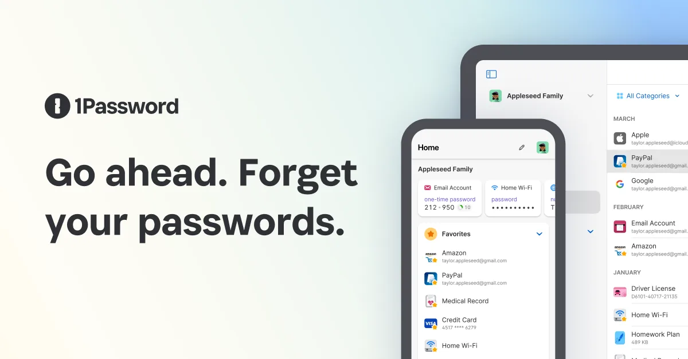</a> | [1Password — get started](references/35-1password-get-started/README.md) · [official product](https://support.1password.com/explore/get-started/) | owner-published media, 2 named gaps | Consumer security / onboarding | content-inspector: Dominant content area with a trailing detail or property inspector. Panels: toolbar/header (top); detail/inspector (trailing); data table/list (center). Density: low; confidence: medium. | Study the onboarding checklist that combines account recovery materials, app installation, import, and family or team invitations. |
| 36 | <a href="https://bitwarden.com/help/getting-started-webvault/">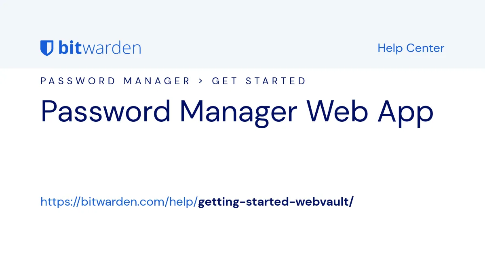</a> | [Bitwarden — get started](references/36-bitwarden-get-started/README.md) · [official product](https://bitwarden.com/help/getting-started-webvault/) | owner-published media, 2 named gaps | Consumer security / onboarding | sidebar-content: Leading navigation or collection list beside a dominant content area. Panels: toolbar/header (top); status/action bar (bottom); navigation/list sidebar (leading); primary canvas/content (center). Density: low; confidence: medium. | Study the first-vault flow covering account creation, email verification, item creation, import, and security configuration. |
| 37 | <a href="https://support.dashlane.com/hc/en-us/categories/360000606579-Get-Started">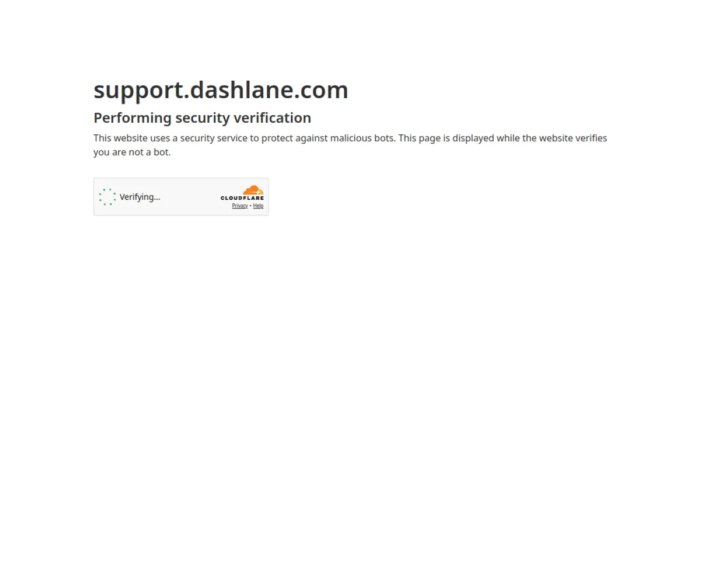</a> | [Dashlane — get started](references/37-dashlane-get-started/README.md) · [official product](https://support.dashlane.com/hc/en-us/categories/360000606579-Get-Started) | owner-published media, 2 named gaps | Consumer security / onboarding | sidebar-content: Leading navigation or collection list beside a dominant content area. Panels: toolbar/header (top); navigation/list sidebar (leading); primary canvas/content (center). Density: low; confidence: medium. | Study the staged setup across account creation, app installation, credential import, autofill, and device access. |
| 38 | <a href="https://www.yubico.com/setup/">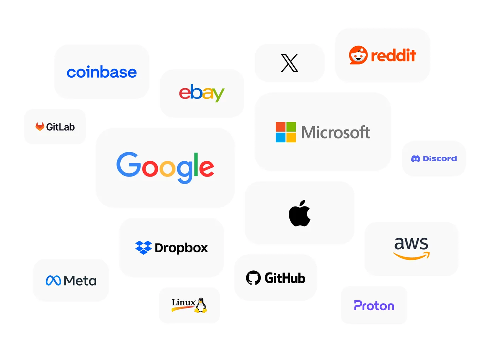</a> | [Yubico — set up a security key](references/38-yubico-set-up-a-security-key/README.md) · [official product](https://www.yubico.com/setup/) | owner-published media, 2 named gaps | Hardware security / device setup | sidebar-content-inspector: Leading navigation, central work area, and trailing detail inspector. Panels: toolbar/header (top); status/action bar (bottom); navigation/list sidebar (leading); detail/inspector (trailing); primary canvas/content (center). Density: low; confidence: medium. | Study the product-selection entry point that routes users into service-specific enrollment instructions for a physical key. |
| 39 | <a href="https://guide.duo.com/enrollment">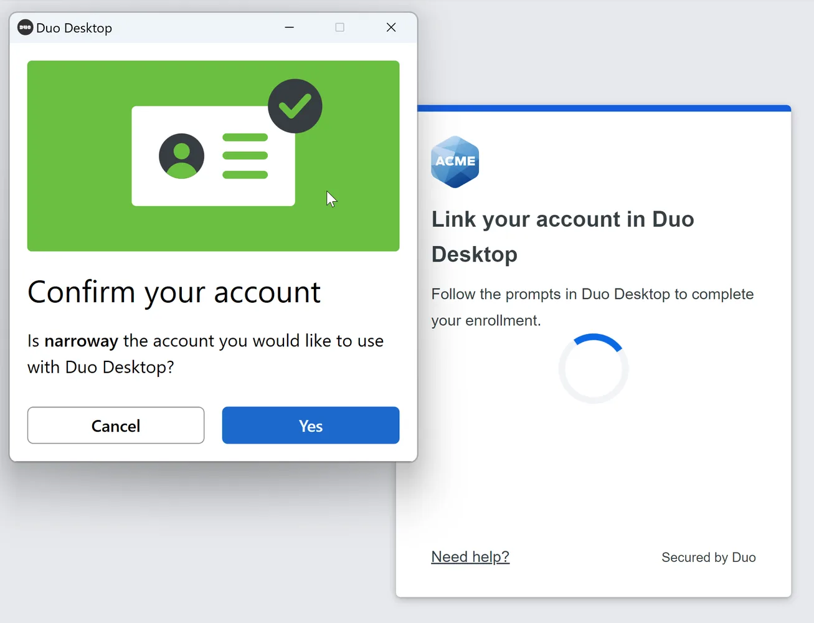</a> | [Duo Security — device enrollment](references/39-duo-security-device-enrollment/README.md) · [official product](https://guide.duo.com/enrollment) | owner-published media, 2 named gaps | Enterprise security / device enrollment | sidebar-content: Leading navigation or collection list beside a dominant content area. Panels: toolbar/header (top); navigation/list sidebar (leading); primary canvas/content (center). Density: low; confidence: medium. | Study the enrollment wizard for choosing an authenticator, verifying ownership, activating the device, and testing access. |
| 40 | <a href="https://proton.me/support/create-a-free-email-account-address">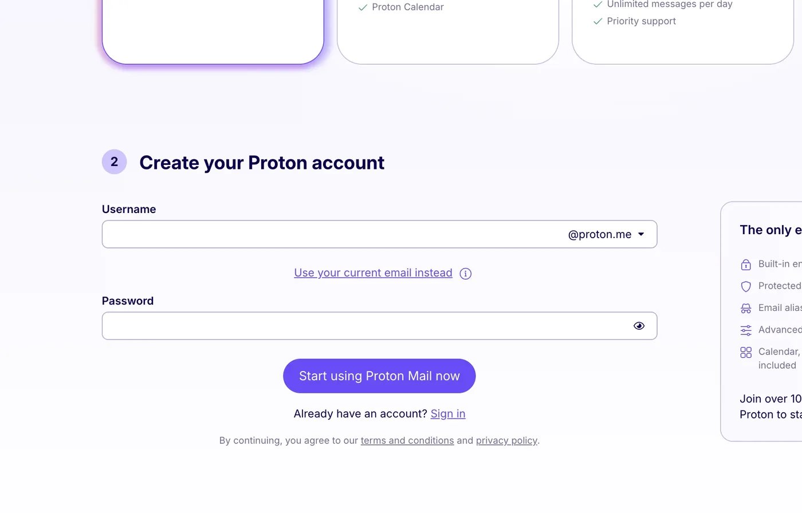</a> | [Proton — create an account](references/40-proton-create-an-account/README.md) · [official product](https://proton.me/support/create-a-free-email-account-address) | owner-published media, 2 named gaps | Consumer privacy / account creation | sidebar-content: Leading navigation or collection list beside a dominant content area. Panels: toolbar/header (top); navigation/list sidebar (leading); primary canvas/content (center). Density: low; confidence: medium. | Study privacy-oriented registration with username selection, password setup, recovery choices, and anti-abuse verification. |
| 41 | <a href="https://support.signal.org/hc/en-us/articles/360007318691-Register-a-phone-number">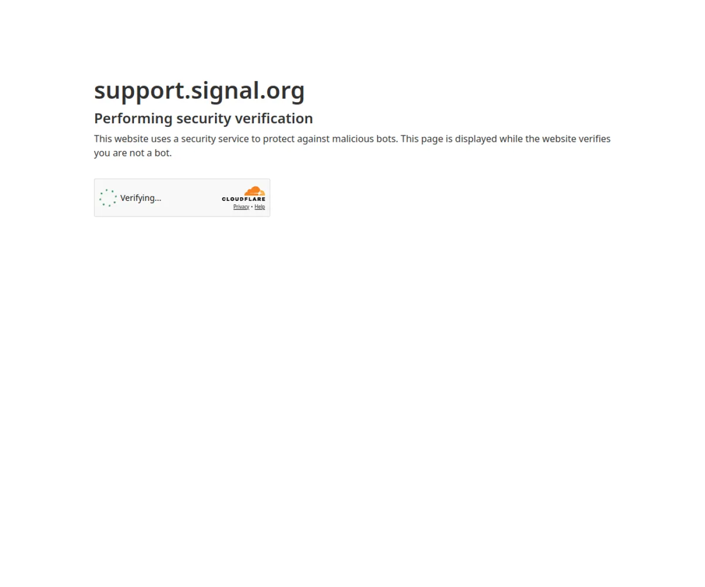</a> | [Signal — register a phone number](references/41-signal-register-a-phone-number/README.md) · [official product](https://support.signal.org/hc/en-us/articles/360007318691-Register-a-phone-number) | owner-published media, 2 named gaps | Consumer communication / account creation | sidebar-content: Leading navigation or collection list beside a dominant content area. Panels: toolbar/header (top); navigation/list sidebar (leading); primary canvas/content (center). Density: low; confidence: medium. | Study phone-number registration with SMS or voice verification, PIN entry, and clear troubleshooting branches. |
| 42 | <a href="https://support.apple.com/en-us/105132">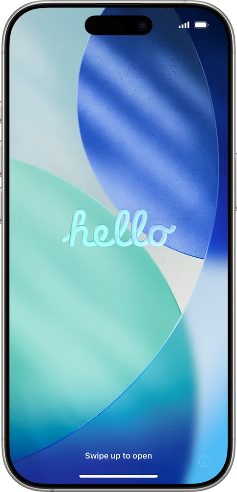</a> | [Apple — set up an iPhone or iPad](references/42-apple-set-up-an-iphone-or-ipad/README.md) · [official product](https://support.apple.com/en-us/105132) | owner-published media, 2 named gaps | Consumer devices / first-run setup | sidebar-content-inspector: Leading navigation, central work area, and trailing detail inspector. Panels: toolbar/header (top); status/action bar (bottom); navigation/list sidebar (leading); detail/inspector (trailing); primary canvas/content (center). Density: low; confidence: medium. | Study Setup Assistant’s sequential handling of accessibility, network access, activation, data transfer, identity, and privacy. |
| 43 | <a href="https://support.google.com/android/answer/6193424">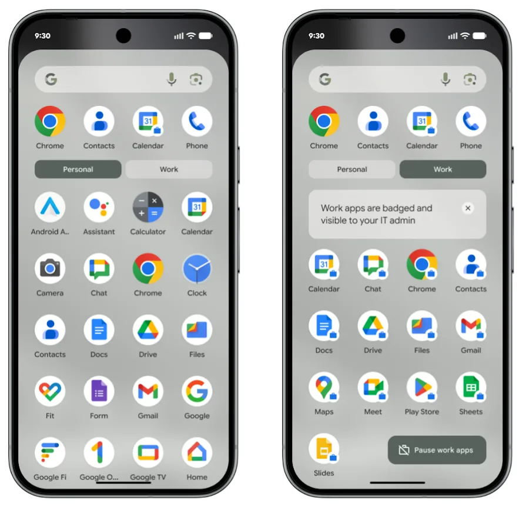</a> | [Android — set up a new device](references/43-android-set-up-a-new-device/README.md) · [official product](https://support.google.com/android/answer/6193424) | owner-published media, 2 named gaps | Consumer devices / first-run setup | single-surface: One dominant content surface without a stable secondary panel detected. Panels: toolbar/header (top); status/action bar (bottom); primary canvas/content (center). Density: low; confidence: low. | Study the device setup sequence for connectivity, Google account sign-in, data transfer, security, and service permissions. |
| 44 | <a href="https://support.spotify.com/article/how-to-sign-up/">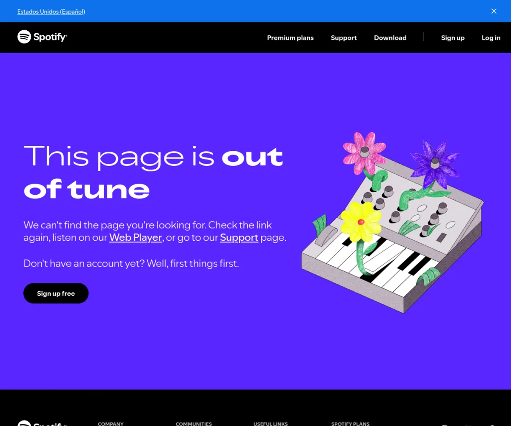</a> | [Spotify — sign up](references/44-spotify-sign-up/README.md) · [official product](https://support.spotify.com/article/how-to-sign-up/) | owner-published media, 2 named gaps | Consumer media / account creation | content-inspector: Dominant content area with a trailing detail or property inspector. Panels: toolbar/header (top); status/action bar (bottom); detail/inspector (trailing); primary canvas/content (center). Density: low; confidence: medium. | Study concise account creation across email and federated identity options, with clear handling of login-method differences. |
| 45 | <a href="https://help.netflix.com/en/node/112419">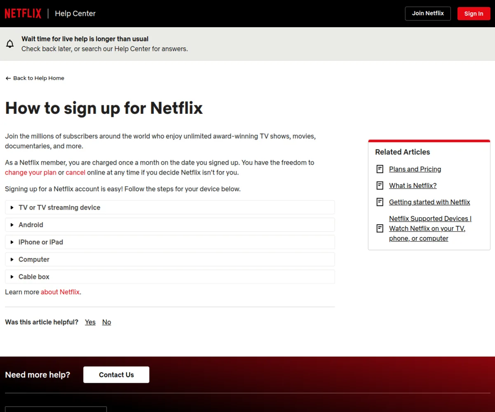</a> | [Netflix — sign up](references/45-netflix-sign-up/README.md) · [official product](https://help.netflix.com/en/node/112419) | owner-published media, 2 named gaps | Consumer media / account creation | sidebar-content: Leading navigation or collection list beside a dominant content area. Panels: toolbar/header (top); status/action bar (bottom); navigation/list sidebar (leading); primary canvas/content (center). Density: low; confidence: medium. | Study the conversion sequence from plan choice through credential setup, payment entry, and device-specific continuation. |
| 46 | <a href="https://docs.stripe.com/connect/embedded-onboarding">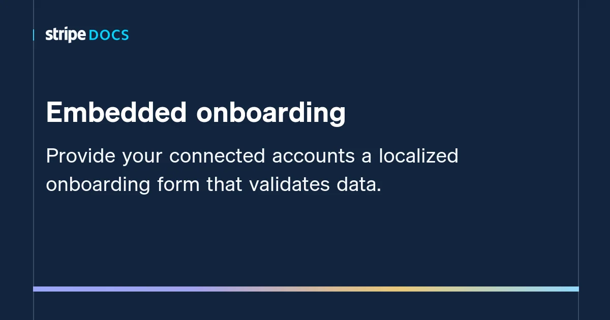</a> | [Stripe Connect — embedded onboarding](references/46-stripe-connect-embedded-onboarding/README.md) · [official product](https://docs.stripe.com/connect/embedded-onboarding) | owner-published media, 2 named gaps | Finance platform / progressive profile | sidebar-content: Leading navigation or collection list beside a dominant content area. Panels: toolbar/header (top); status/action bar (bottom); navigation/list sidebar (leading); primary canvas/content (center). Density: low; confidence: medium. | Study requirements-driven onboarding that progressively collects identity and business information while surfacing unresolved tasks. |
| 47 |  | [Plaid Link — overview](references/47-plaid-link-overview/README.md) · [official product](https://plaid.com/docs/link/) | owner-published media, 2 named gaps | Finance platform / account linking | sidebar-content: Leading navigation or collection list beside a dominant content area. Panels: toolbar/header (top); status/action bar (bottom); navigation/list sidebar (leading); primary canvas/content (center). Density: medium; confidence: medium. | Study institution search, credential handoff, consent, multifactor prompts, account selection, and recoverable error states. |
| 48 |  | [PayPal — create an account](references/48-paypal-create-an-account/README.md) · [official product](https://www.paypal.com/us/cshelp/article/how-do-i-open-a-paypal-account-help315) | owner-published media, 2 named gaps | Consumer finance / account creation | sidebar-content: Leading navigation or collection list beside a dominant content area. Panels: toolbar/header (top); navigation/list sidebar (leading); primary canvas/content (center). Density: low; confidence: medium. | Study the branch between personal and business registration and the progressive collection of contact and payment details. |
| 49 |  | [Shopify — initial setup](references/49-shopify-initial-setup/README.md) · [official product](https://help.shopify.com/en/manual/intro-to-shopify/initial-setup) | owner-published media, 2 named gaps | Commerce / first-run setup | sidebar-content-inspector: Leading navigation, central work area, and trailing detail inspector. Panels: toolbar/header (top); navigation/list sidebar (leading); detail/inspector (trailing); data table/list (center). Density: low; confidence: medium. | Study the merchant checklist that sequences store configuration, products, policies, payments, shipping, and launch readiness. |
| 50 | <a href="https://squareup.com/help/us/en/article/5123-square-get-started-guide">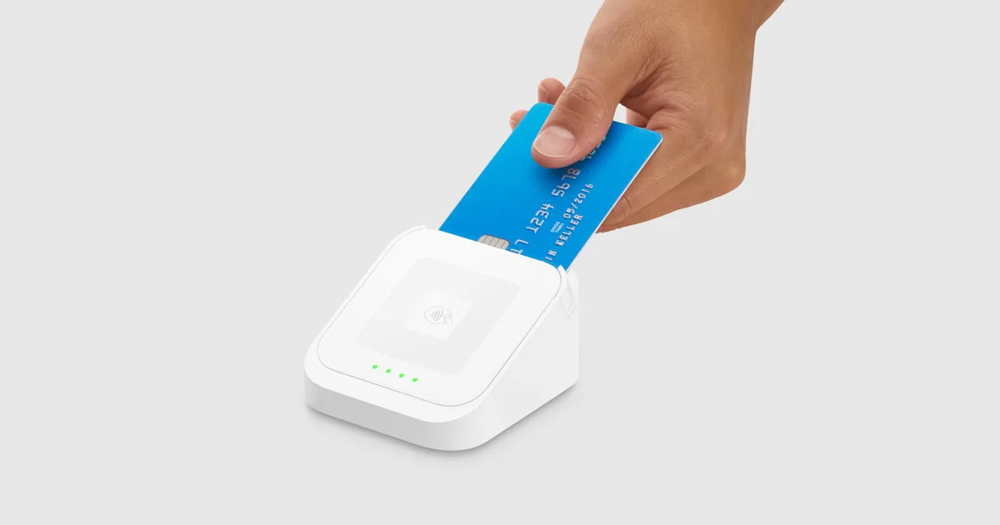</a> | [Square — account setup guide](references/50-square-account-setup-guide/README.md) · [official product](https://squareup.com/help/us/en/article/5123-square-get-started-guide) | owner-published media, 2 named gaps | Commerce finance / account setup | content-inspector: Dominant content area with a trailing detail or property inspector. Panels: toolbar/header (top); detail/inspector (trailing); data table/list (center). Density: low; confidence: medium. | Study the operational onboarding checklist spanning identity, bank linking, catalog setup, hardware, staff, and first payment. |

Normalized panel bounds, detected separators, image dimensions, source-image URLs, hashes, and analysis confidence are recorded in [`sources.json`](sources.json). Media kinds, measured durations, provenance classes, and per-record gaps are in [`references.json`](references.json).

Attribution and product ownership remain with the linked source.
