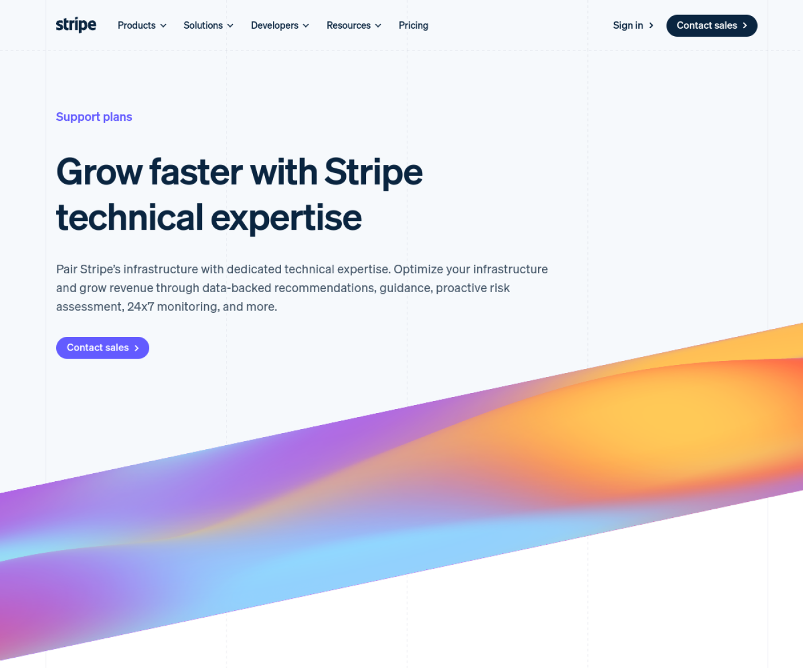

# Pricing & plans examples

Product pricing and plan-comparison pages.

Each entry pairs an attributed overview image and a measured panel anatomy with a per-product record: motion evidence, named states, an observed first-success journey, interaction and recovery behavior, accessibility observations, and provenance. Every number below is measured by `verify-reference-evidence.py`, and a record that is missing evidence says so in its own `evidence_gaps`.

**Examples:** 5  
**Images:** 5  
**Structural analyses:** 5  
**Records with no remaining gap:** 0  
**Records with named gaps:** 5 (35 gaps)  
**Motion provenance:** no measured motion  
**Curated:** 2026-08-22  
**Visual source data:** [`sources.json`](sources.json)  
**Record index:** [`references.json`](references.json)  
**Cross-example synthesis:** [`full-reference.md`](full-reference.md)

| # | Reference image | Record | Motion evidence | Category | Interface structure | What to study |
|---:|---|---|---|---|---|---|
| 1 |  | [Docs — capital](references/01-docs-capital/README.md) · [official product](https://stripe.com/capital) | , 7 named gaps | docs | unanalyzed-scaffold: Scaffold region covering the full overview image; run analyze-structures to replace it. Panels: full frame (center). Density: unknown; confidence: low. | auto-discovered from https://stripe.com/pricing; family docs |
| 2 |  | [Product — connect](references/02-product-connect/README.md) · [official product](https://stripe.com/connect) | , 7 named gaps | product | unanalyzed-scaffold: Scaffold region covering the full overview image; run analyze-structures to replace it. Panels: full frame (center). Density: unknown; confidence: low. | auto-discovered from https://stripe.com/pricing; family product |
| 3 |  | [Signup — atlas](references/03-signup-atlas/README.md) · [official product](https://stripe.com/atlas) | , 7 named gaps | signup | unanalyzed-scaffold: Scaffold region covering the full overview image; run analyze-structures to replace it. Panels: full frame (center). Density: unknown; confidence: low. | auto-discovered from https://stripe.com/pricing; family signup |
| 4 |  | [About — customers](references/04-about-customers/README.md) · [official product](https://stripe.com/customers) | , 7 named gaps | about | unanalyzed-scaffold: Scaffold region covering the full overview image; run analyze-structures to replace it. Panels: full frame (center). Density: unknown; confidence: low. | auto-discovered from https://stripe.com/pricing; family about |
| 5 |  | [Pricing — support-plans](references/05-pricing-support-plans/README.md) · [official product](https://stripe.com/support-plans) | , 7 named gaps | pricing | unanalyzed-scaffold: Scaffold region covering the full overview image; run analyze-structures to replace it. Panels: full frame (center). Density: unknown; confidence: low. | auto-discovered from https://stripe.com/pricing; family pricing |

Normalized panel bounds, detected separators, image dimensions, source-image URLs, hashes, and analysis confidence are recorded in [`sources.json`](sources.json). Media kinds, measured durations, provenance classes, and per-record gaps are in [`references.json`](references.json).

Attribution and product ownership remain with the linked source.
