# Report and evidence examples

Reports, findings, traces, comparisons, and evidence viewers.

Each entry pairs an attributed overview image and a measured panel anatomy with a per-product record: motion evidence, named states, an observed first-success journey, interaction and recovery behavior, accessibility observations, and provenance. Every number below is measured by `verify-reference-evidence.py`, and a record that is missing evidence says so in its own `evidence_gaps`.

**Examples:** 50  
**Images:** 50  
**Structural analyses:** 50  
**Records with no remaining gap:** 0  
**Records with named gaps:** 50 (144 gaps)  
**Motion provenance:** 50 owner-published media  
**Curated:** 2026-08-16  
**Visual source data:** [`sources.json`](sources.json)  
**Record index:** [`references.json`](references.json)  
**Cross-example synthesis:** [`full-reference.md`](full-reference.md)

| # | Reference image | Record | Motion evidence | Category | Interface structure | What to study |
|---:|---|---|---|---|---|---|
| 1 |  | [Grafana Explore](references/01-grafana-explore/README.md) · [official product](https://grafana.com/docs/grafana/latest/explore/) | owner-published media, 1 named gaps | Observability | sidebar-content: Leading navigation or collection list beside a dominant content area. Panels: toolbar/header (top); status/action bar (bottom); navigation/list sidebar (leading); data table/list (center). Density: low; confidence: medium. | Study the split-view query workflow, where synchronized time ranges and raw query results support side-by-side evidence comparison. |
| 2 | <a href="https://docs.datadoghq.com/logs/explorer/">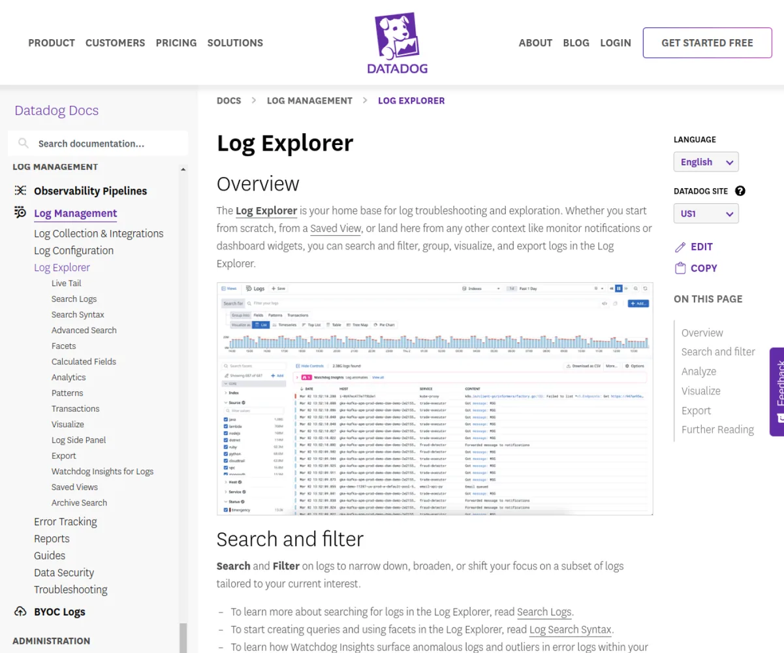</a> | [Datadog Log Explorer](references/02-datadog-log-explorer/README.md) · [official product](https://docs.datadoghq.com/logs/explorer/) | owner-published media, 1 named gaps | Observability | sidebar-content-inspector: Leading navigation, central work area, and trailing detail inspector. Panels: toolbar/header (top); status/action bar (bottom); navigation/list sidebar (leading); detail/inspector (trailing); primary canvas/content (center). Density: low; confidence: medium. | Study facet-driven filtering and the event side panel, which preserves raw log context while supporting rapid drill-down. |
| 3 | <a href="https://docs.newrelic.com/docs/errors-inbox/errors-inbox/">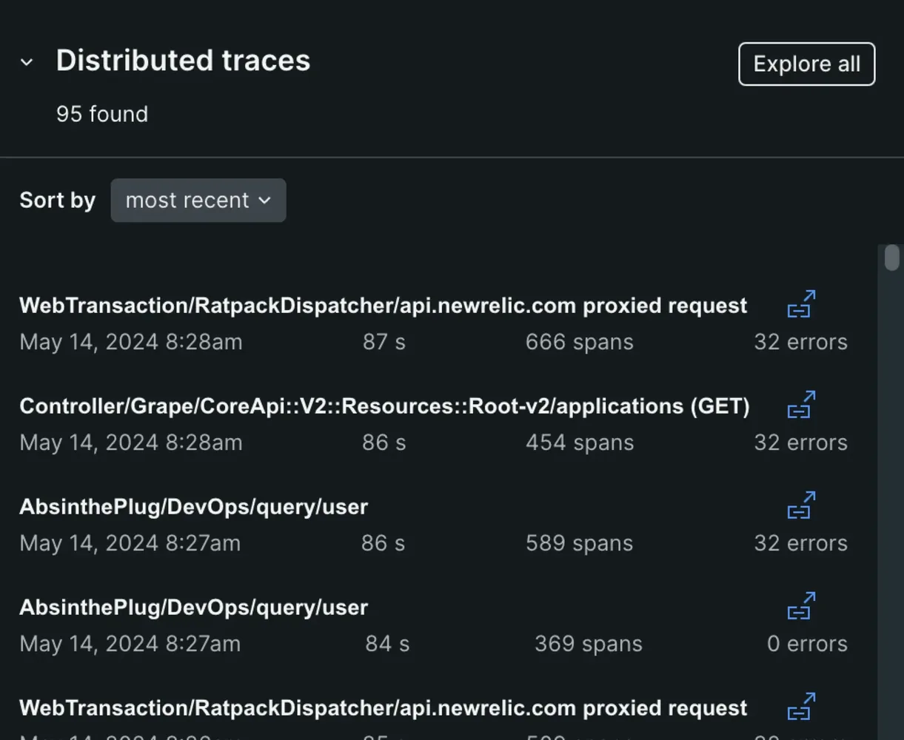</a> | [New Relic Errors Inbox](references/03-new-relic-errors-inbox/README.md) · [official product](https://docs.newrelic.com/docs/errors-inbox/errors-inbox/) | owner-published media, 3 named gaps | Observability | sidebar-content: Leading navigation or collection list beside a dominant content area. Panels: toolbar/header (top); status/action bar (bottom); navigation/list sidebar (leading); primary canvas/content (center). Density: low; confidence: high. | Study error grouping, occurrence evidence, and status assignment as a pattern for turning repeated signals into actionable work. |
| 4 | <a href="https://docs.splunk.com/Documentation/Splunk/latest/Search/GetstartedwithSearch">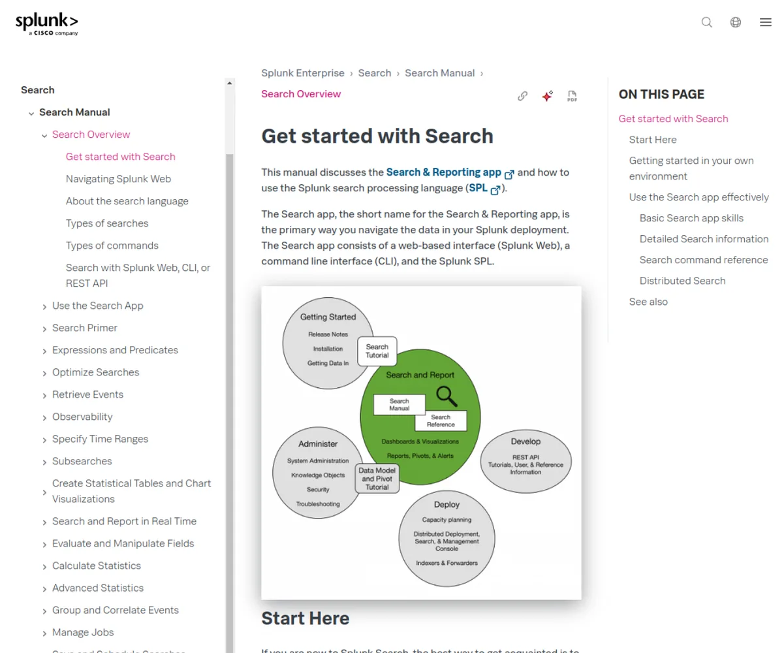</a> | [Splunk Search and Reporting](references/04-splunk-search-and-reporting/README.md) · [official product](https://docs.splunk.com/Documentation/Splunk/latest/Search/GetstartedwithSearch) | owner-published media, 3 named gaps | Observability | sidebar-content: Leading navigation or collection list beside a dominant content area. Panels: toolbar/header (top); navigation/list sidebar (leading); data table/list (center). Density: low; confidence: high. | Study the timeline, field sidebar, and event table combination for moving between aggregate patterns and underlying machine evidence. |
| 5 | <a href="https://www.elastic.co/guide/en/kibana/current/discover.html">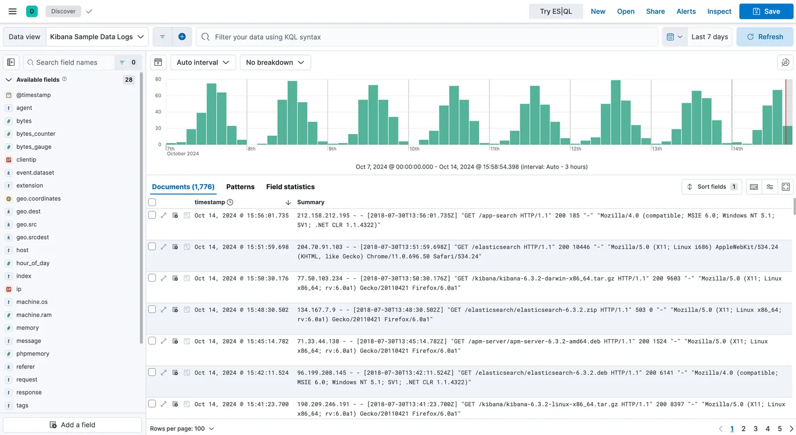</a> | [Elastic Discover](references/05-elastic-discover/README.md) · [official product](https://www.elastic.co/guide/en/kibana/current/discover.html) | owner-published media, 3 named gaps | Observability | sidebar-content: Leading navigation or collection list beside a dominant content area. Panels: toolbar/header (top); status/action bar (bottom); navigation/list sidebar (leading); data table/list (center). Density: medium; confidence: medium. | Study the document table and field statistics panels, which expose source records and distributions behind filtered results. |
| 6 | <a href="https://docs.honeycomb.io/investigate/query/">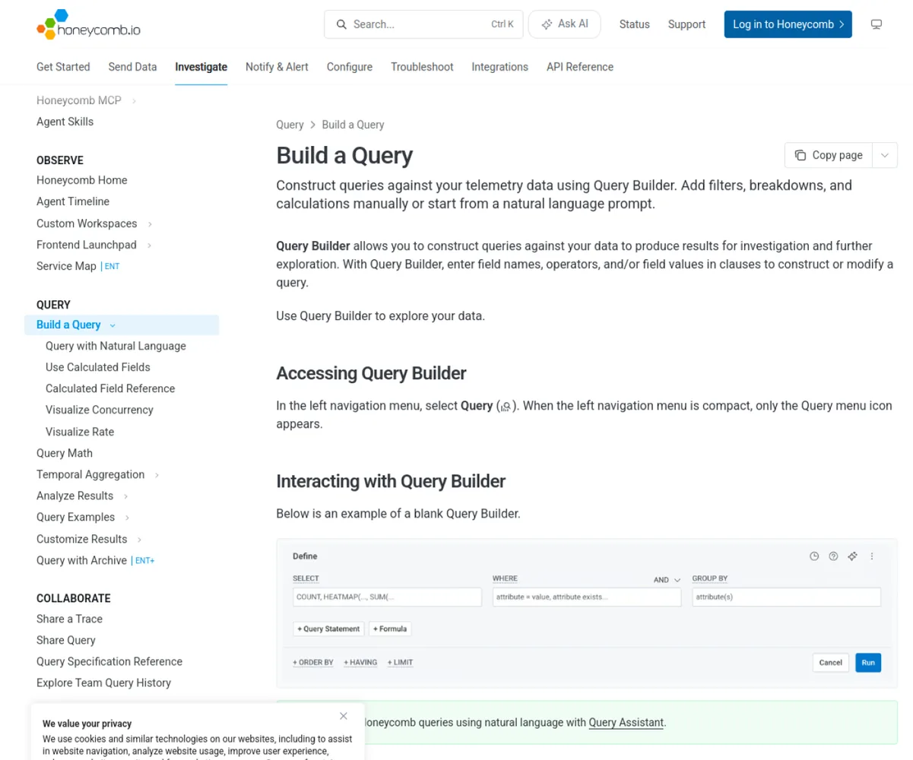</a> | [Honeycomb Query Builder](references/06-honeycomb-query-builder/README.md) · [official product](https://docs.honeycomb.io/investigate/query/) | owner-published media, 3 named gaps | Observability | sidebar-content: Leading navigation or collection list beside a dominant content area. Panels: toolbar/header (top); navigation/list sidebar (leading); data table/list (center). Density: low; confidence: medium. | Study the visual query composition and result breakdown workflow for comparing dimensions without hiding the underlying query definition. |
| 7 | <a href="https://docs.sentry.io/product/issues/issue-details/">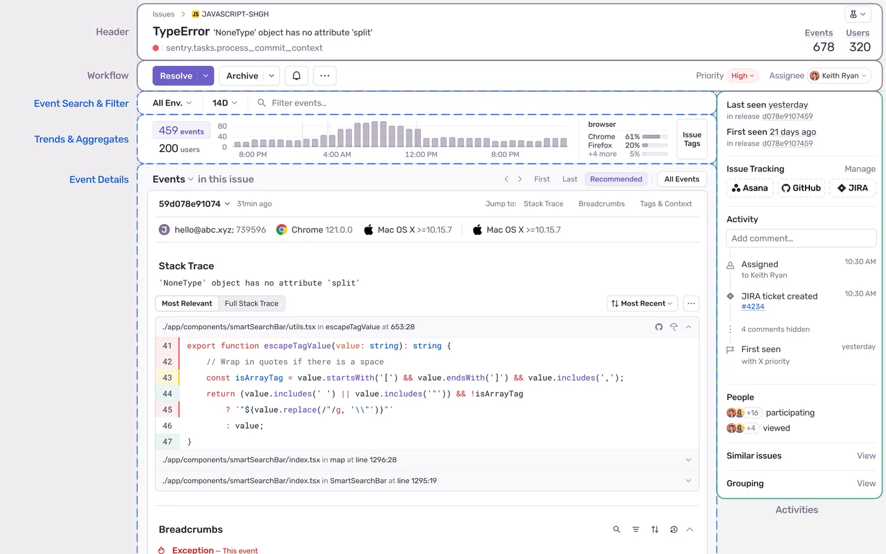</a> | [Sentry Issue Details](references/07-sentry-issue-details/README.md) · [official product](https://docs.sentry.io/product/issues/issue-details/) | owner-published media, 3 named gaps | Observability | sidebar-content-inspector: Leading navigation, central work area, and trailing detail inspector. Panels: toolbar/header (top); status/action bar (bottom); navigation/list sidebar (leading); detail/inspector (trailing); primary canvas/content (center). Density: low; confidence: medium. | Study the issue detail layout that connects stack trace evidence, breadcrumbs, tags, frequency, ownership, and resolution actions. |
| 8 | <a href="https://docs.dynatrace.com/docs/dynatrace-intelligence/problems-app">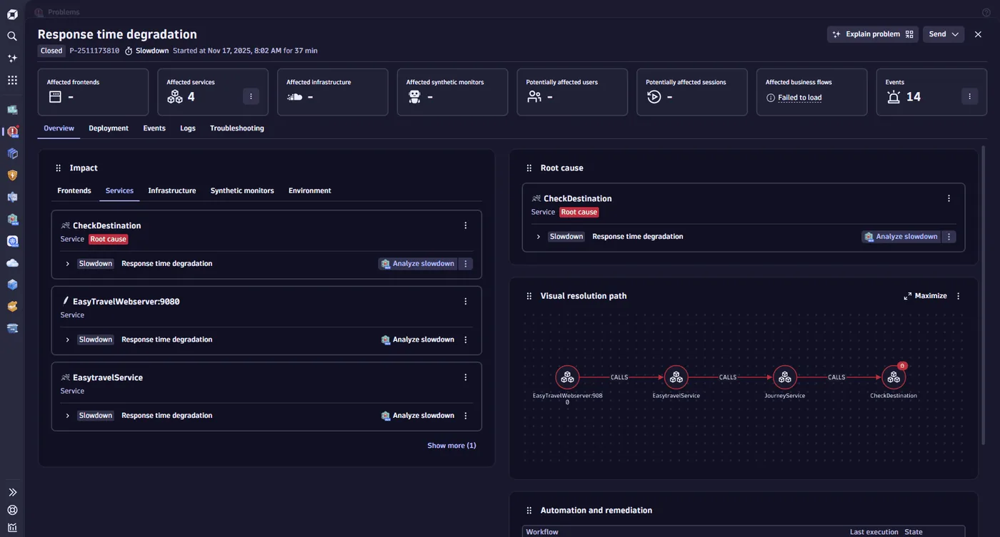</a> | [Dynatrace Problems](references/08-dynatrace-problems/README.md) · [official product](https://docs.dynatrace.com/docs/dynatrace-intelligence/problems-app) | owner-published media, 3 named gaps | Observability | sidebar-content: Leading navigation or collection list beside a dominant content area. Panels: toolbar/header (top); navigation/list sidebar (leading); primary canvas/content (center). Density: low; confidence: medium. | Study causal problem grouping and impact summaries that link detected symptoms to affected entities and recommended investigation paths. |
| 9 | <a href="https://learn.microsoft.com/en-us/azure/azure-monitor/visualize/workbooks-overview">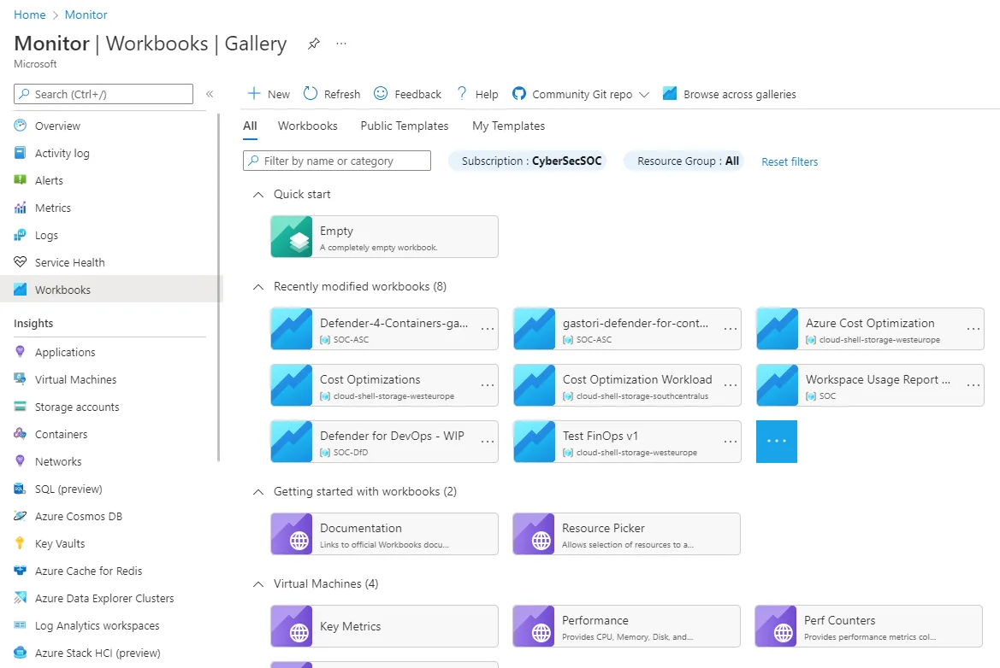</a> | [Azure Monitor Workbooks](references/09-azure-monitor-workbooks/README.md) · [official product](https://learn.microsoft.com/en-us/azure/azure-monitor/visualize/workbooks-overview) | owner-published media, 3 named gaps | Observability | sidebar-content: Leading navigation or collection list beside a dominant content area. Panels: toolbar/header (top); navigation/list sidebar (leading); primary canvas/content (center). Density: low; confidence: medium. | Study parameterized report controls and linked visualizations for creating reusable investigations with explicit scope and drill-through. |
| 10 | <a href="https://docs.aws.amazon.com/AmazonCloudWatch/latest/monitoring/CloudWatch_Dashboards.html">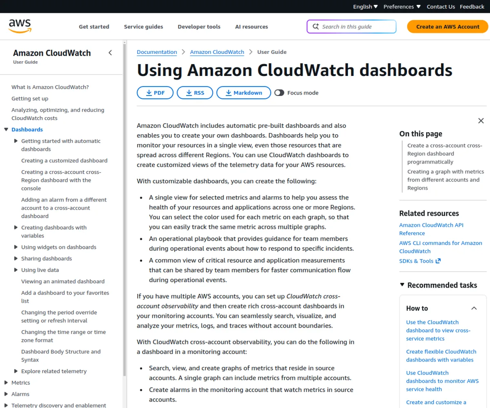</a> | [Amazon CloudWatch Dashboards](references/10-amazon-cloudwatch-dashboards/README.md) · [official product](https://docs.aws.amazon.com/AmazonCloudWatch/latest/monitoring/CloudWatch_Dashboards.html) | owner-published media, 3 named gaps | Observability | sidebar-content-inspector: Leading navigation, central work area, and trailing detail inspector. Panels: toolbar/header (top); navigation/list sidebar (leading); detail/inspector (trailing); primary canvas/content (center). Density: medium; confidence: medium. | Study dashboard widgets that combine metrics, logs, alarms, and annotations while retaining links to deeper operational evidence. |
| 11 | <a href="https://amplitude.com/docs/analytics/charts">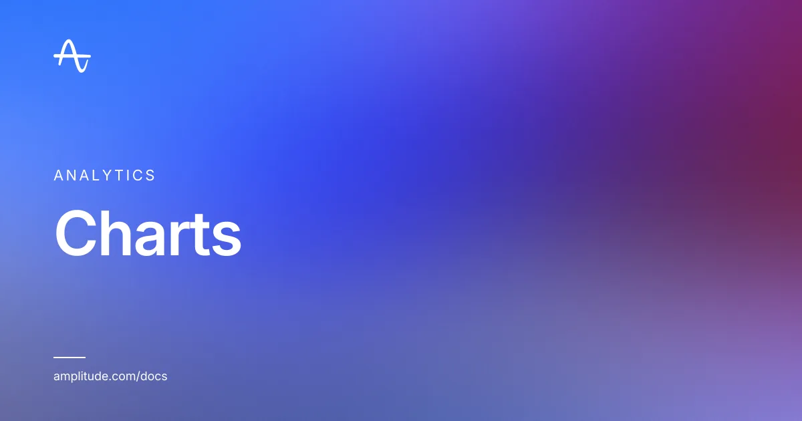</a> | [Amplitude Charts](references/11-amplitude-charts/README.md) · [official product](https://amplitude.com/docs/analytics/charts) | owner-published media, 3 named gaps | Product analytics | sidebar-content: Leading navigation or collection list beside a dominant content area. Panels: toolbar/header (top); status/action bar (bottom); navigation/list sidebar (leading); data table/list (center). Density: low; confidence: medium. | Study chart-specific controls for segmentation, cohorts, and conversion windows, with definitions kept visible beside behavioral results. |
| 12 | <a href="https://docs.mixpanel.com/docs/reports/insights">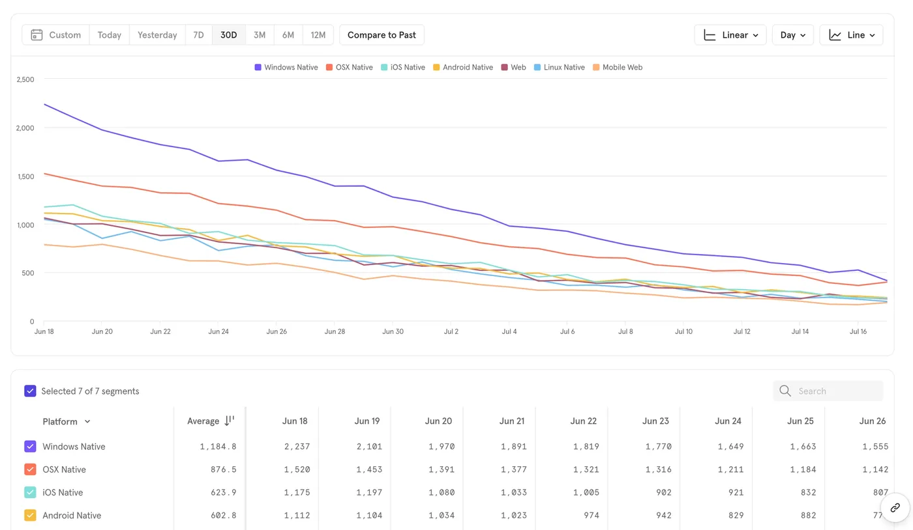</a> | [Mixpanel Insights](references/12-mixpanel-insights/README.md) · [official product](https://docs.mixpanel.com/docs/reports/insights) | owner-published media, 2 named gaps | Product analytics | sidebar-content-inspector: Leading navigation, central work area, and trailing detail inspector. Panels: toolbar/header (top); status/action bar (bottom); navigation/list sidebar (leading); detail/inspector (trailing); primary canvas/content (center). Density: low; confidence: medium. | Study event segmentation and breakdown controls that let readers move from a trend to the contributing users and properties. |
| 13 |  | [Matomo Reports](references/13-matomo-reports/README.md) · [official product](https://matomo.org/guide/reports/) | owner-published media, 3 named gaps | Web analytics | sidebar-content-inspector: Leading navigation, central work area, and trailing detail inspector. Panels: toolbar/header (top); navigation/list sidebar (leading); detail/inspector (trailing); primary canvas/content (center). Density: low; confidence: medium. | Study report navigation and row-level segmentation patterns that connect summary metrics with visitor, acquisition, and behavior evidence. |
| 14 | <a href="https://support.google.com/analytics/answer/7579450">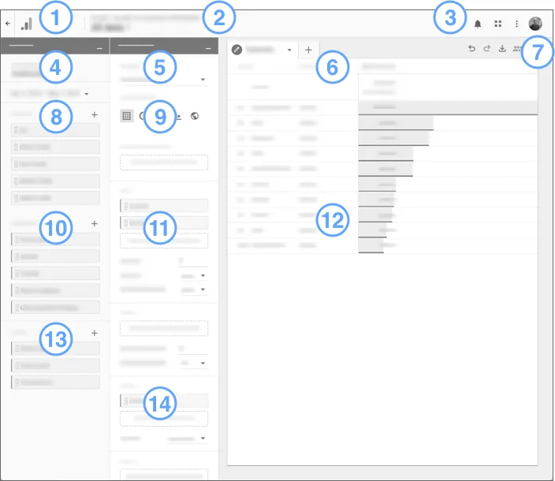</a> | [Google Analytics Explorations](references/14-google-analytics-explorations/README.md) · [official product](https://support.google.com/analytics/answer/7579450) | owner-published media, 3 named gaps | Web analytics | sidebar-content: Leading navigation or collection list beside a dominant content area. Panels: toolbar/header (top); navigation/list sidebar (leading); primary canvas/content (center). Density: low; confidence: high. | Study the variables-and-settings workspace for making dimensions, metrics, segments, and tab techniques explicit in an analysis. |
| 15 | <a href="https://posthog.com/docs/product-analytics/insights">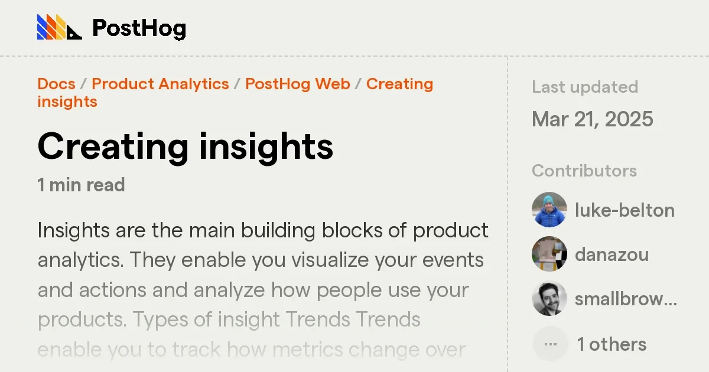</a> | [PostHog Insights](references/15-posthog-insights/README.md) · [official product](https://posthog.com/docs/product-analytics/insights) | owner-published media, 3 named gaps | Product analytics | sidebar-content: Leading navigation or collection list beside a dominant content area. Panels: toolbar/header (top); status/action bar (bottom); navigation/list sidebar (leading); primary canvas/content (center). Density: low; confidence: medium. | Study the shared insight model for trends, funnels, retention, and paths, including filters and links back to behavioral evidence. |
| 16 | <a href="https://docs.github.com/en/actions/monitoring-and-troubleshooting-workflows/monitoring-workflows/viewing-workflow-run-history">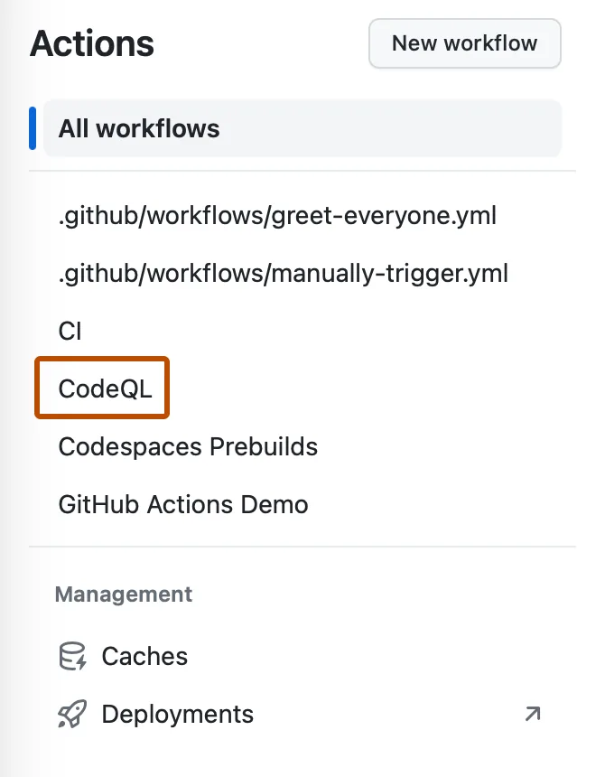</a> | [GitHub Actions workflow run details](references/16-github-actions-workflow-run-details/README.md) · [official product](https://docs.github.com/en/actions/monitoring-and-troubleshooting-workflows/monitoring-workflows/viewing-workflow-run-history) | owner-published media, 3 named gaps | CI/CD | sidebar-content: Leading navigation or collection list beside a dominant content area. Panels: toolbar/header (top); status/action bar (bottom); navigation/list sidebar (leading); primary canvas/content (center). Density: low; confidence: medium. | Study the job-and-step hierarchy, searchable logs, timestamps, artifacts, and rerun controls for diagnosing a specific workflow execution. |
| 17 |  | [GitLab pipeline details](references/17-gitlab-pipeline-details/README.md) · [official product](https://docs.gitlab.com/ci/pipelines/) | owner-published media, 3 named gaps | CI/CD | sidebar-content: Leading navigation or collection list beside a dominant content area. Panels: toolbar/header (top); navigation/list sidebar (leading); primary canvas/content (center). Density: low; confidence: medium. | Study the pipeline graph and job detail transition, which preserves dependency context while exposing logs, artifacts, and retry actions. |
| 18 | <a href="https://circleci.com/docs/insights/">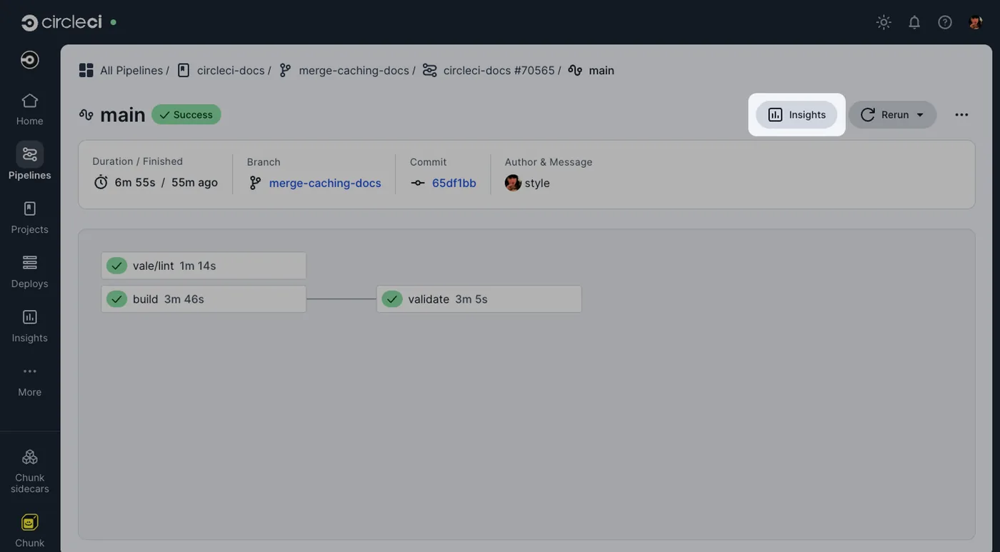</a> | [CircleCI Insights](references/18-circleci-insights/README.md) · [official product](https://circleci.com/docs/insights/) | owner-published media, 3 named gaps | CI/CD analytics | sidebar-content: Leading navigation or collection list beside a dominant content area. Panels: toolbar/header (top); navigation/list sidebar (leading); primary canvas/content (center). Density: low; confidence: medium. | Study workflow duration, success-rate, and credit trends with branch filtering for comparing delivery performance over time. |
| 19 |  | [Jenkins Blue Ocean](references/19-jenkins-blue-ocean/README.md) · [official product](https://www.jenkins.io/doc/book/blueocean/) | owner-published media, 3 named gaps | CI/CD | single-surface: One dominant content surface without a stable secondary panel detected. Panels: toolbar/header (top); primary canvas/content (center). Density: low; confidence: low. | Study the visual pipeline and stage-level log drill-down pattern for locating failures without losing the overall execution structure. |
| 20 | <a href="https://playwright.dev/docs/test-reporters#html-reporter">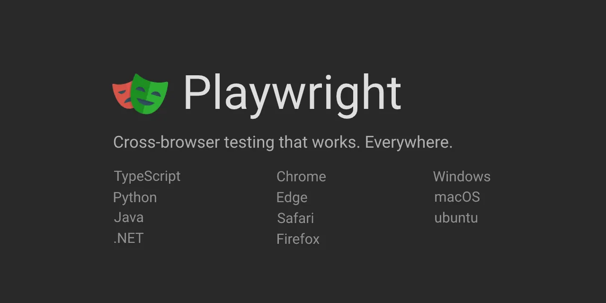</a> | [Playwright HTML Reporter](references/20-playwright-html-reporter/README.md) · [official product](https://playwright.dev/docs/test-reporters#html-reporter) | owner-published media, 3 named gaps | Testing | sidebar-content-inspector: Leading navigation, central work area, and trailing detail inspector. Panels: toolbar/header (top); navigation/list sidebar (leading); detail/inspector (trailing); data table/list (center). Density: low; confidence: medium. | Study the filterable test list and per-test attachments, traces, retries, errors, and timing evidence in a portable HTML report. |
| 21 | <a href="https://docs.cypress.io/cloud/features/test-replay">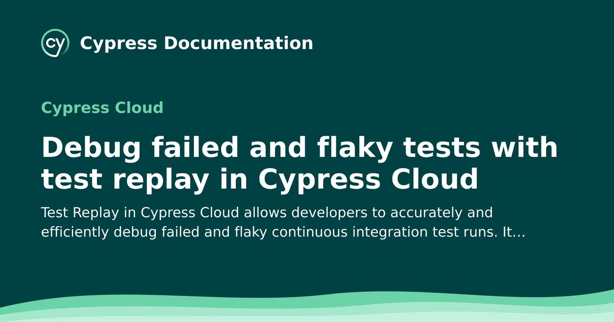</a> | [Cypress Cloud Test Replay](references/21-cypress-cloud-test-replay/README.md) · [official product](https://docs.cypress.io/cloud/features/test-replay) | owner-published media, 3 named gaps | Testing | sidebar-content: Leading navigation or collection list beside a dominant content area. Panels: toolbar/header (top); navigation/list sidebar (leading); primary canvas/content (center). Density: low; confidence: medium. | Study synchronized command, DOM, console, and network evidence for replaying a failed test and identifying the causal interaction. |
| 22 | <a href="https://allurereport.org/docs/">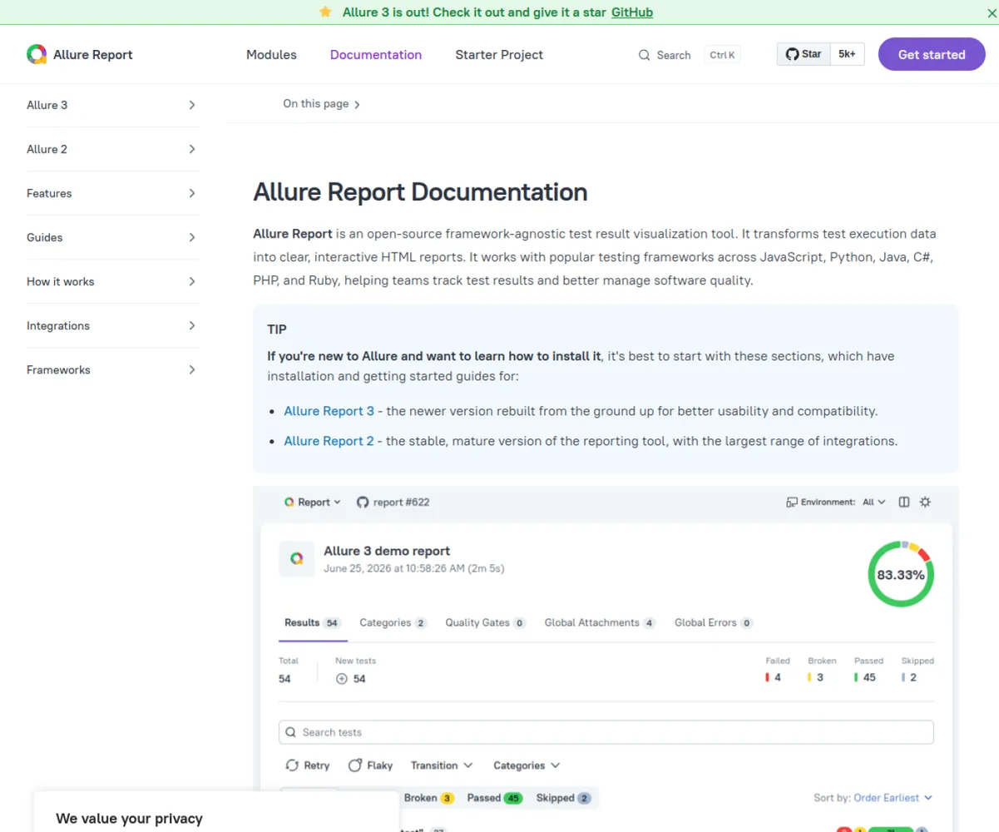</a> | [Allure Report](references/22-allure-report/README.md) · [official product](https://allurereport.org/docs/) | owner-published media, 3 named gaps | Testing | sidebar-content: Leading navigation or collection list beside a dominant content area. Panels: toolbar/header (top); navigation/list sidebar (leading); primary canvas/content (center). Density: low; confidence: medium. | Study severity labels, history, retries, steps, attachments, and environment metadata as a provenance-rich test reporting structure. |
| 23 |  | [BrowserStack Test Observability](references/23-browserstack-test-observability/README.md) · [official product](https://www.browserstack.com/docs/test-observability) | owner-published media, 3 named gaps | Testing | sidebar-content-inspector: Leading navigation, central work area, and trailing detail inspector. Panels: toolbar/header (top); navigation/list sidebar (leading); detail/inspector (trailing); primary canvas/content (center). Density: low; confidence: medium. | Study failure analysis dashboards that connect test status trends with logs, screenshots, ownership, and individual execution evidence. |
| 24 |  | [Snyk Reports](references/24-snyk-reports/README.md) · [official product](https://docs.snyk.io/manage-risk/reporting) | owner-published media, 3 named gaps | Security | sidebar-content-inspector: Leading navigation, central work area, and trailing detail inspector. Panels: toolbar/header (top); status/action bar (bottom); navigation/list sidebar (leading); detail/inspector (trailing); primary canvas/content (center). Density: low; confidence: medium. | Study issue reporting by project, severity, and status, with export-oriented views for communicating remediation progress and exposure. |
| 25 |  | [SonarQube Server issues](references/25-sonarqube-server-issues/README.md) · [official product](https://docs.sonarsource.com/sonarqube-server/user-guide/issues/) | owner-published media, 3 named gaps | Security and code quality | sidebar-content-inspector: Leading navigation, central work area, and trailing detail inspector. Panels: toolbar/header (top); navigation/list sidebar (leading); detail/inspector (trailing); primary canvas/content (center). Density: low; confidence: medium. | Study issue severity, location, rule provenance, assignment, status, and code-context drill-down in a remediation-centered interface. |
| 26 | <a href="https://docs.semgrep.dev/semgrep-code/findings">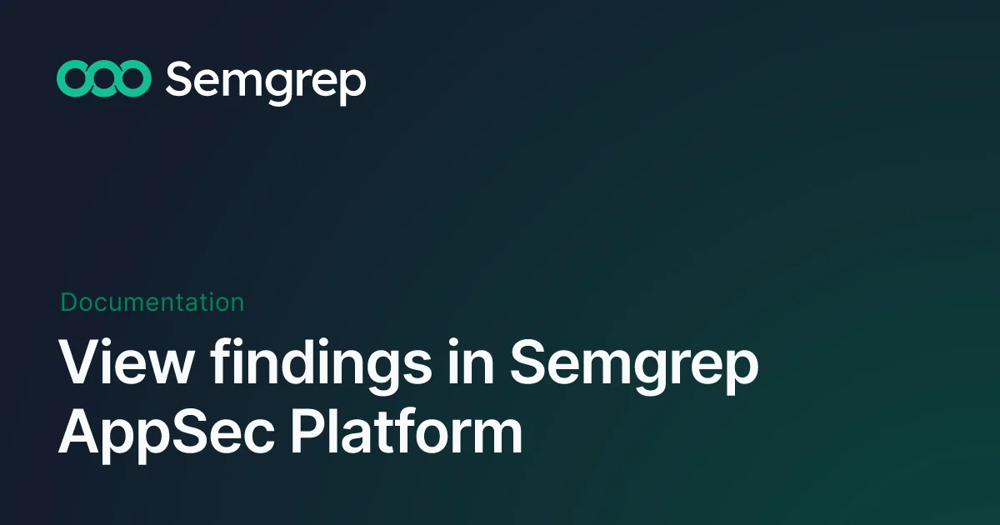</a> | [Semgrep AppSec Platform findings](references/26-semgrep-appsec-platform-findings/README.md) · [official product](https://docs.semgrep.dev/semgrep-code/findings) | owner-published media, 3 named gaps | Security | sidebar-content: Leading navigation or collection list beside a dominant content area. Panels: toolbar/header (top); status/action bar (bottom); navigation/list sidebar (leading); primary canvas/content (center). Density: low; confidence: medium. | Study finding triage that combines rule identity, source location, severity, status, and code evidence with remediation workflow controls. |
| 27 | <a href="https://www.zaproxy.org/docs/desktop/addons/report-generation/">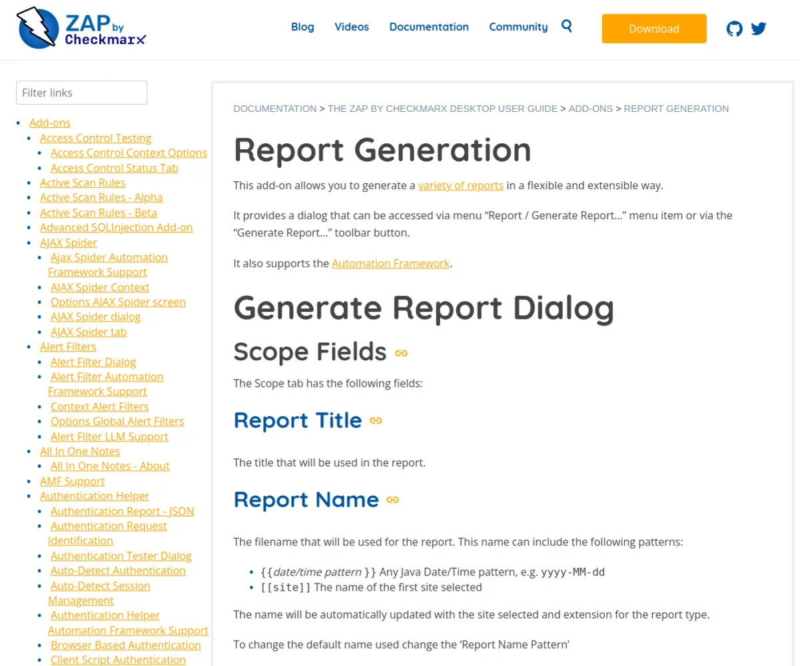</a> | [OWASP ZAP reports](references/27-owasp-zap-reports/README.md) · [official product](https://www.zaproxy.org/docs/desktop/addons/report-generation/) | owner-published media, 3 named gaps | Security testing | sidebar-content: Leading navigation or collection list beside a dominant content area. Panels: toolbar/header (top); status/action bar (bottom); navigation/list sidebar (leading); primary canvas/content (center). Density: medium; confidence: medium. | Study configurable report generation that preserves alert risk, confidence, affected URLs, evidence, and remediation guidance for export. |
| 28 | <a href="https://learn.microsoft.com/en-us/azure/defender-for-cloud/review-security-recommendations">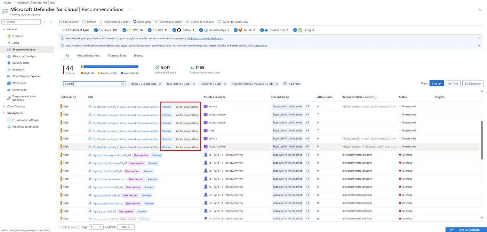</a> | [Microsoft Defender for Cloud recommendations](references/28-microsoft-defender-for-cloud-recommendations/README.md) · [official product](https://learn.microsoft.com/en-us/azure/defender-for-cloud/review-security-recommendations) | owner-published media, 3 named gaps | Cloud security | sidebar-content: Leading navigation or collection list beside a dominant content area. Panels: toolbar/header (top); status/action bar (bottom); navigation/list sidebar (leading); primary canvas/content (center). Density: low; confidence: medium. | Study recommendation detail pages that connect severity, affected resources, policy rationale, remediation steps, and exemption actions. |
| 29 | <a href="https://docs.aws.amazon.com/securityhub/latest/userguide/securityhub-findings.html">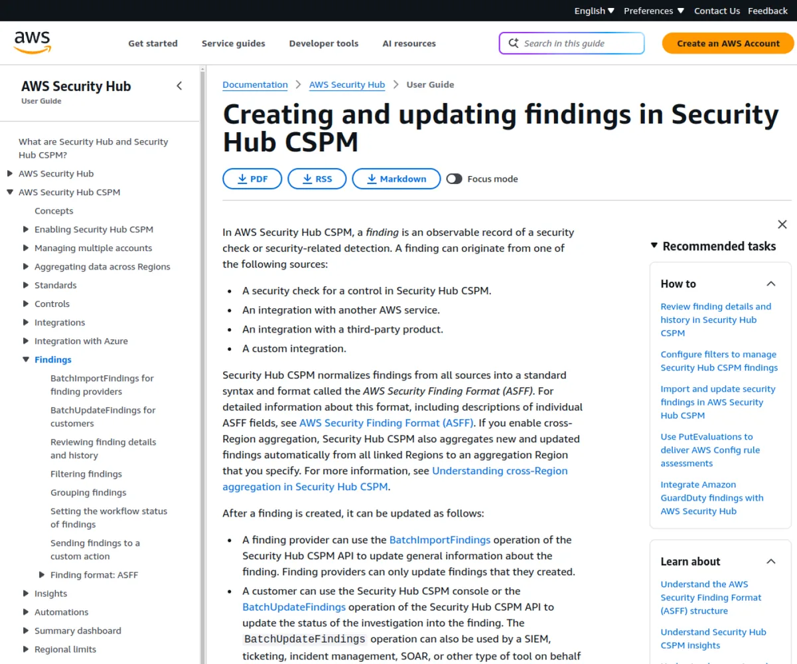</a> | [AWS Security Hub findings](references/29-aws-security-hub-findings/README.md) · [official product](https://docs.aws.amazon.com/securityhub/latest/userguide/securityhub-findings.html) | owner-published media, 3 named gaps | Cloud security | sidebar-content: Leading navigation or collection list beside a dominant content area. Panels: toolbar/header (top); navigation/list sidebar (leading); primary canvas/content (center). Density: medium; confidence: medium. | Study normalized finding records with provider provenance, severity, resource context, workflow status, and links to remediation actions. |
| 30 |  | [Google Security Command Center findings](references/30-google-security-command-center-findings/README.md) · [official product](https://docs.cloud.google.com/security-command-center/docs/review-manage-findings) | owner-published media, 3 named gaps | Cloud security | sidebar-content-inspector: Leading navigation, central work area, and trailing detail inspector. Panels: toolbar/header (top); status/action bar (bottom); navigation/list sidebar (leading); detail/inspector (trailing); data table/list (center). Density: low; confidence: medium. | Study the findings table and detail panel for filtering severity, inspecting source and resource evidence, and updating investigation state. |
| 31 | <a href="https://docs.tenable.com/vulnerability-management/Content/Dashboards/Dashboards.htm">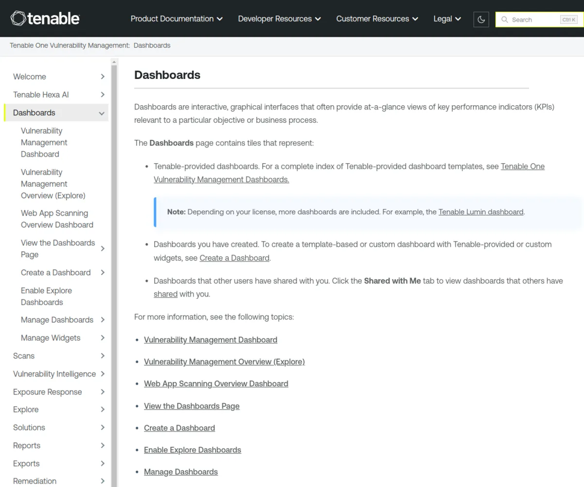</a> | [Tenable Vulnerability Management dashboards](references/31-tenable-vulnerability-management-dashboards/README.md) · [official product](https://docs.tenable.com/vulnerability-management/Content/Dashboards/Dashboards.htm) | owner-published media, 3 named gaps | Vulnerability management | sidebar-content: Leading navigation or collection list beside a dominant content area. Panels: toolbar/header (top); navigation/list sidebar (leading); data table/list (center). Density: low; confidence: medium. | Study workbench drill-down from aggregate vulnerability counts to plugins, assets, severity context, and exportable supporting records. |
| 32 | <a href="https://developer.chrome.com/docs/lighthouse/accessibility/">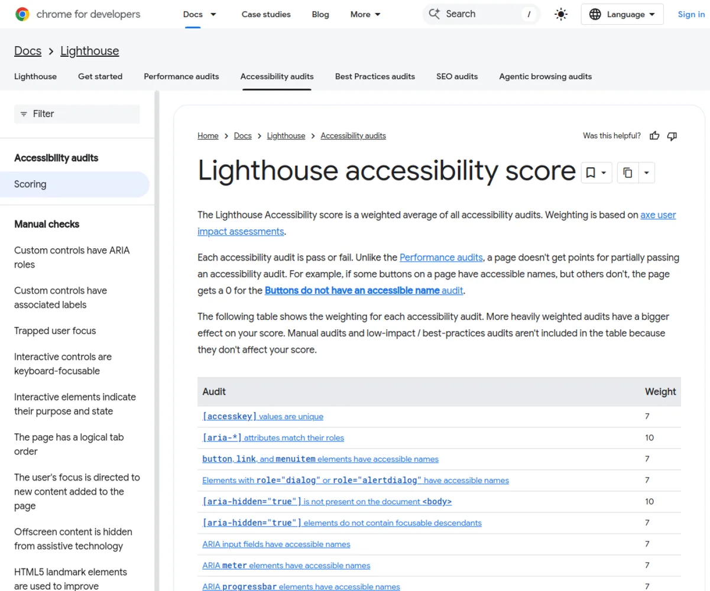</a> | [Lighthouse accessibility audits](references/32-lighthouse-accessibility-audits/README.md) · [official product](https://developer.chrome.com/docs/lighthouse/accessibility/) | owner-published media, 3 named gaps | Accessibility | sidebar-content: Leading navigation or collection list beside a dominant content area. Panels: toolbar/header (top); navigation/list sidebar (leading); primary canvas/content (center). Density: medium; confidence: medium. | Study audit grouping with pass or fail status, affected elements, scoring context, and links to remediation explanations and standards. |
| 33 | <a href="https://docs.deque.com/devtools-for-web/4/en/overview">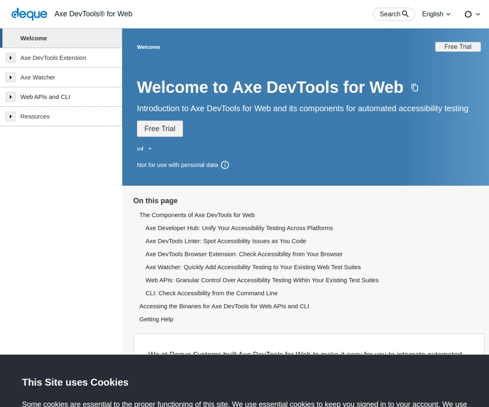</a> | [axe DevTools browser extension](references/33-axe-devtools-browser-extension/README.md) · [official product](https://docs.deque.com/devtools-for-web/4/en/overview) | owner-published media, 3 named gaps | Accessibility | sidebar-content: Leading navigation or collection list beside a dominant content area. Panels: toolbar/header (top); status/action bar (bottom); navigation/list sidebar (leading); data table/list (center). Density: low; confidence: medium. | Study issue lists that pair impact severity and rule rationale with highlighted page elements, source evidence, and repair guidance. |
| 34 | <a href="https://wave.webaim.org/">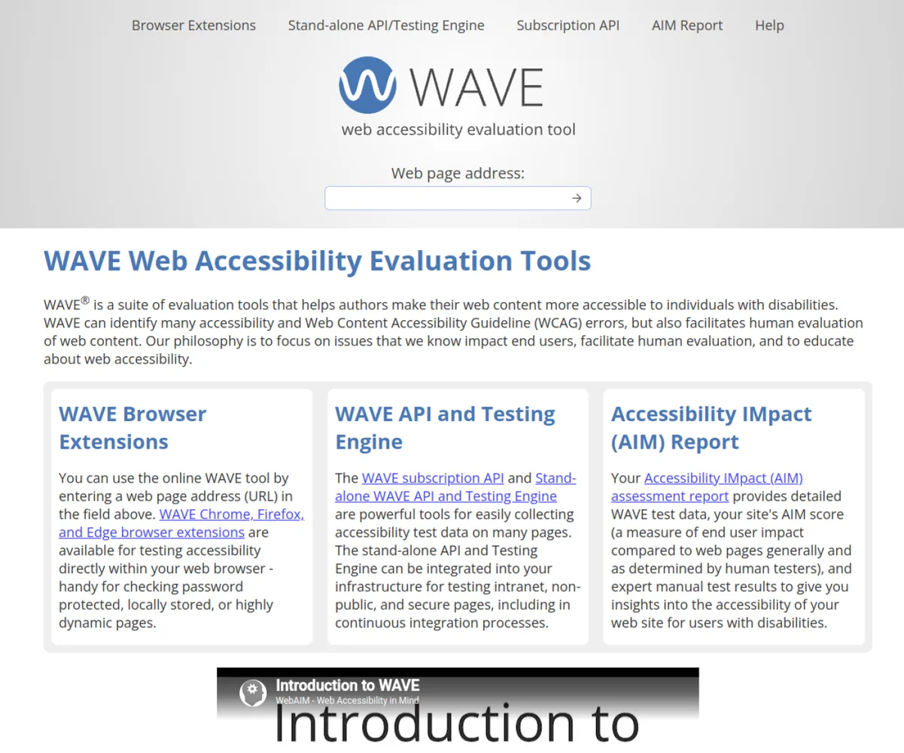</a> | [WAVE web accessibility evaluation tool](references/34-wave-web-accessibility-evaluation-tool/README.md) · [official product](https://wave.webaim.org/) | owner-published media, 3 named gaps | Accessibility | sidebar-content: Leading navigation or collection list beside a dominant content area. Panels: toolbar/header (top); status/action bar (bottom); navigation/list sidebar (leading); primary canvas/content (center). Density: medium; confidence: high. | Study in-page annotation icons and the details sidebar for connecting accessibility findings directly to their rendered-page locations. |
| 35 |  | [Accessibility Insights for Web](references/35-accessibility-insights-for-web/README.md) · [official product](https://accessibilityinsights.io/docs/web/overview/) | owner-published media, 3 named gaps | Accessibility | content-inspector: Dominant content area with a trailing detail or property inspector. Panels: toolbar/header (top); detail/inspector (trailing); data table/list (center). Density: low; confidence: medium. | Study the progression from automated checks to guided assessment, with requirement-level instructions, evidence capture, and result export. |
| 36 | <a href="https://github.com/pa11y/pa11y-dashboard">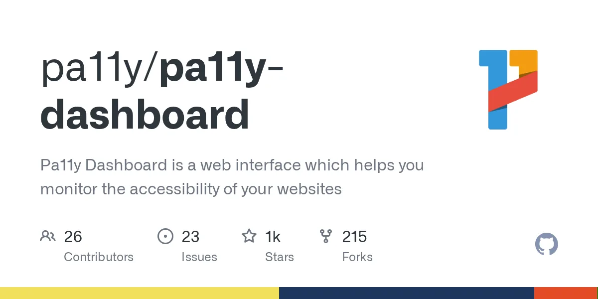</a> | [Pa11y Dashboard](references/36-pa11y-dashboard/README.md) · [official product](https://github.com/pa11y/pa11y-dashboard) | owner-published media, 3 named gaps | Accessibility | sidebar-content: Leading navigation or collection list beside a dominant content area. Panels: toolbar/header (top); status/action bar (bottom); navigation/list sidebar (leading); data table/list (center). Density: low; confidence: medium. | Study longitudinal accessibility results that expose issue counts and individual findings across repeated scans of monitored web pages. |
| 37 |  | [WebPageTest result pages](references/37-webpagetest-result-pages/README.md) · [official product](https://www.webpagetest.org/) | owner-published media, 3 named gaps | Performance | sidebar-content-inspector: Leading navigation, central work area, and trailing detail inspector. Panels: toolbar/header (top); navigation/list sidebar (leading); detail/inspector (trailing); data table/list (center). Density: low; confidence: medium. | Study the test summary, filmstrip, waterfall, metrics, and repeat-view comparison for tying performance claims to captured run evidence. |
| 38 | <a href="https://developers.google.com/speed/docs/insights/v5/about">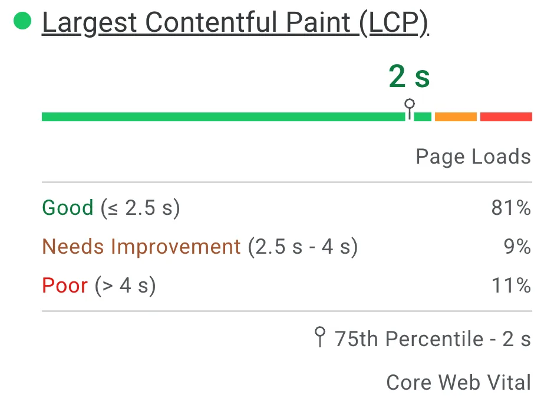</a> | [PageSpeed Insights](references/38-pagespeed-insights/README.md) · [official product](https://developers.google.com/speed/docs/insights/v5/about) | owner-published media, 3 named gaps | Performance | content-inspector: Dominant content area with a trailing detail or property inspector. Panels: toolbar/header (top); detail/inspector (trailing); primary canvas/content (center). Density: low; confidence: medium. | Study the separation of field and lab data, including population provenance, metric thresholds, diagnostics, and actionable opportunities. |
| 39 | <a href="https://developer.chrome.com/docs/devtools/performance/overview">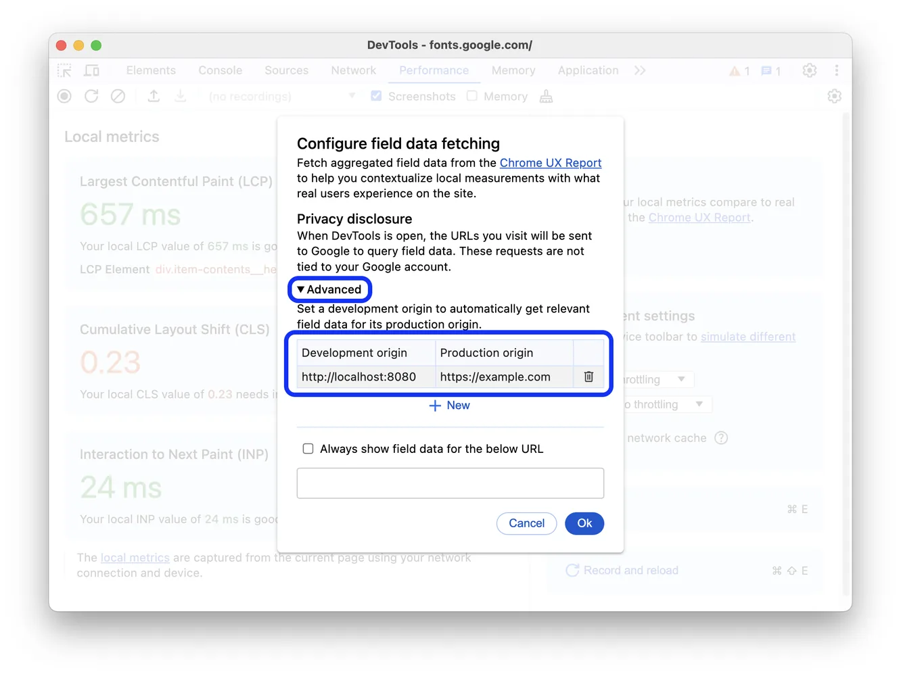</a> | [Chrome DevTools Performance panel](references/39-chrome-devtools-performance-panel/README.md) · [official product](https://developer.chrome.com/docs/devtools/performance/overview) | owner-published media, 3 named gaps | Performance profiling | sidebar-content: Leading navigation or collection list beside a dominant content area. Panels: toolbar/header (top); status/action bar (bottom); navigation/list sidebar (leading); data table/list (center). Density: low; confidence: medium. | Study the synchronized timeline, flame chart, screenshots, and detail panes for tracing a visible slowdown to specific main-thread work. |
| 40 | <a href="https://support.speedcurve.com/docs/dashboards">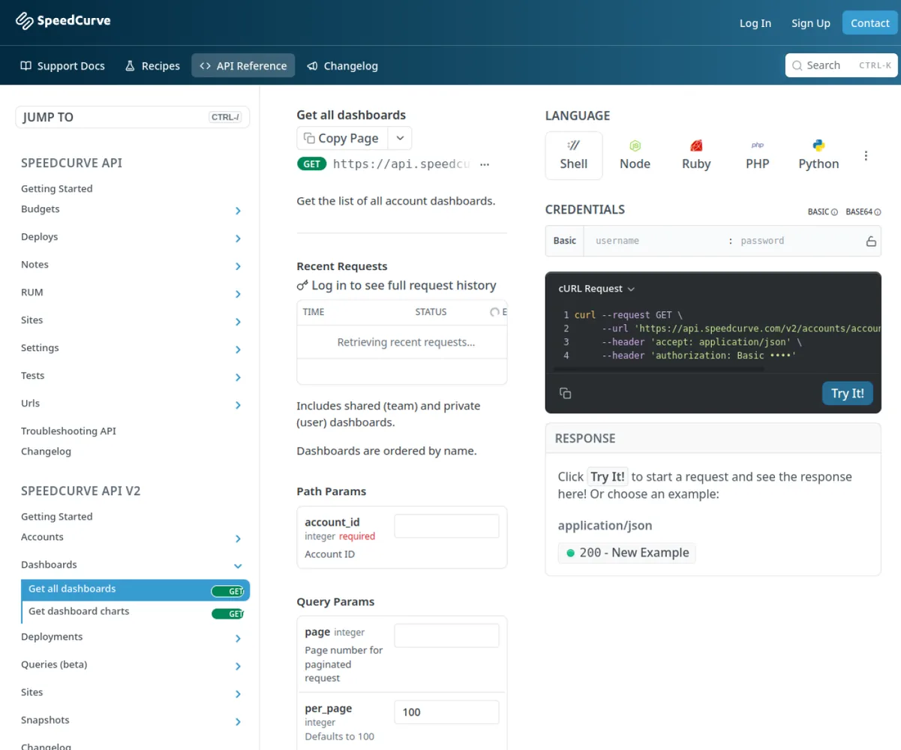</a> | [SpeedCurve dashboards](references/40-speedcurve-dashboards/README.md) · [official product](https://support.speedcurve.com/docs/dashboards) | owner-published media, 3 named gaps | Performance monitoring | sidebar-content-inspector: Leading navigation, central work area, and trailing detail inspector. Panels: toolbar/header (top); navigation/list sidebar (leading); detail/inspector (trailing); data table/list (center). Density: low; confidence: medium. | Study comparative performance dashboards with budgets, deployment annotations, percentile trends, and drill-down to individual test results. |
| 41 | <a href="https://www.jaegertracing.io/docs/latest/frontend-ui/">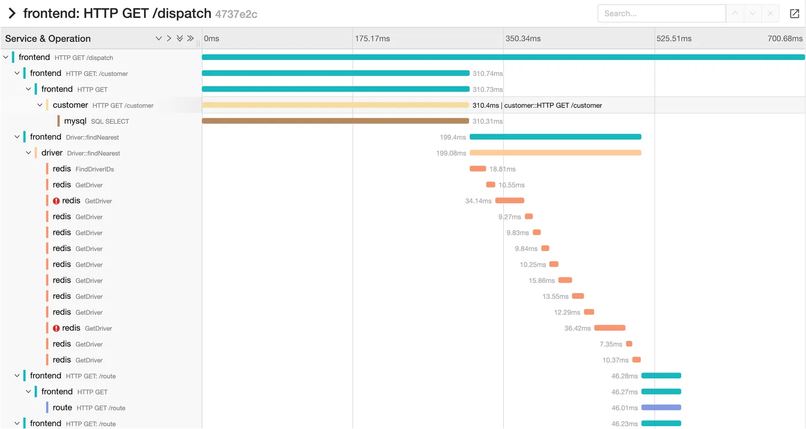</a> | [Jaeger UI](references/41-jaeger-ui/README.md) · [official product](https://www.jaegertracing.io/docs/latest/frontend-ui/) | owner-published media, 3 named gaps | Distributed tracing | sidebar-content-inspector: Leading navigation, central work area, and trailing detail inspector. Panels: toolbar/header (top); navigation/list sidebar (leading); detail/inspector (trailing); primary canvas/content (center). Density: low; confidence: medium. | Study trace search followed by span waterfall drill-down, with service, operation, tags, logs, and timing retained as causal evidence. |
| 42 |  | [Zipkin trace UI](references/42-zipkin-trace-ui/README.md) · [official product](https://zipkin.io/pages/quickstart.html) | owner-published media, 3 named gaps | Distributed tracing | sidebar-content-inspector: Leading navigation, central work area, and trailing detail inspector. Panels: toolbar/header (top); status/action bar (bottom); navigation/list sidebar (leading); detail/inspector (trailing); primary canvas/content (center). Density: low; confidence: medium. | Study dependency-aware trace lookup and waterfall inspection for comparing service latency while retaining span annotations and identifiers. |
| 43 | <a href="https://grafana.com/docs/pyroscope/latest/view-and-analyze-profile-data/flamegraphs/">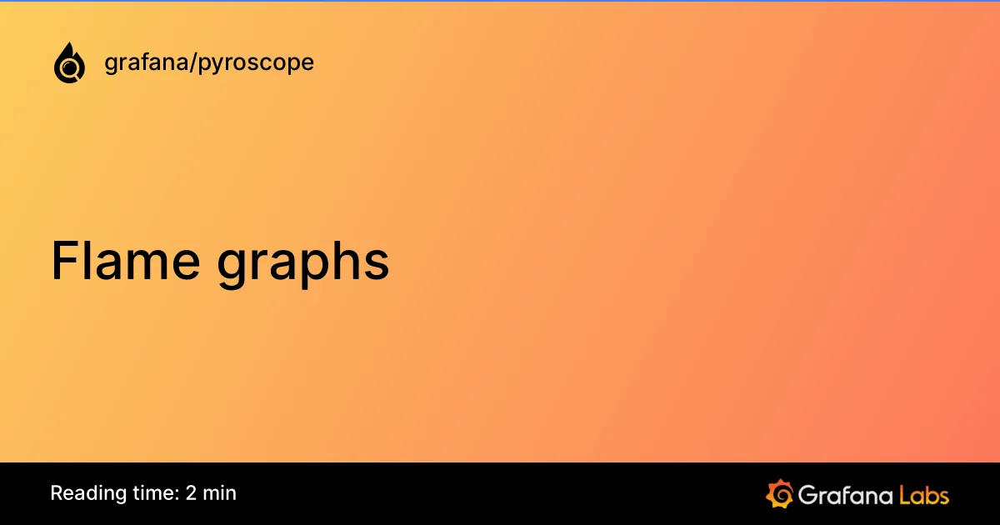</a> | [Grafana Pyroscope flame graphs](references/43-grafana-pyroscope-flame-graphs/README.md) · [official product](https://grafana.com/docs/pyroscope/latest/view-and-analyze-profile-data/flamegraphs/) | owner-published media, 3 named gaps | Continuous profiling | sidebar-content: Leading navigation or collection list beside a dominant content area. Panels: toolbar/header (top); status/action bar (bottom); navigation/list sidebar (leading); primary canvas/content (center). Density: low; confidence: high. | Study flame-graph navigation and profile comparison for identifying expensive call paths and quantifying changes between selected periods. |
| 44 | <a href="https://www.parca.dev/docs/overview">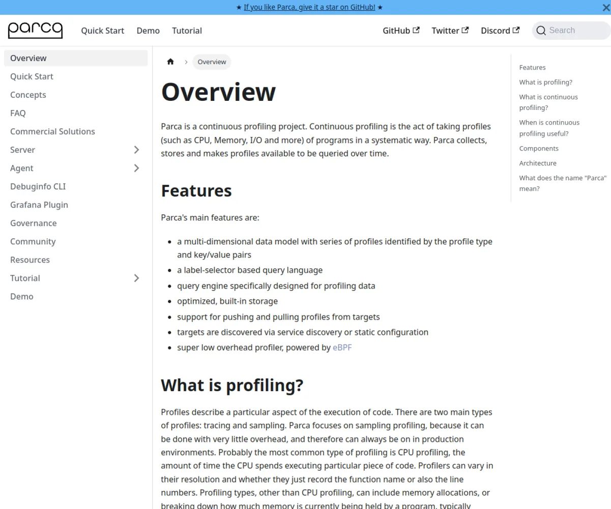</a> | [Parca](references/44-parca/README.md) · [official product](https://www.parca.dev/docs/overview) | owner-published media, 3 named gaps | Continuous profiling | sidebar-content: Leading navigation or collection list beside a dominant content area. Panels: toolbar/header (top); status/action bar (bottom); navigation/list sidebar (leading); primary canvas/content (center). Density: medium; confidence: medium. | Study label-based profile selection and interactive flame graphs that preserve query scope while drilling into stack-frame evidence. |
| 45 | <a href="https://github.com/jlfwong/speedscope">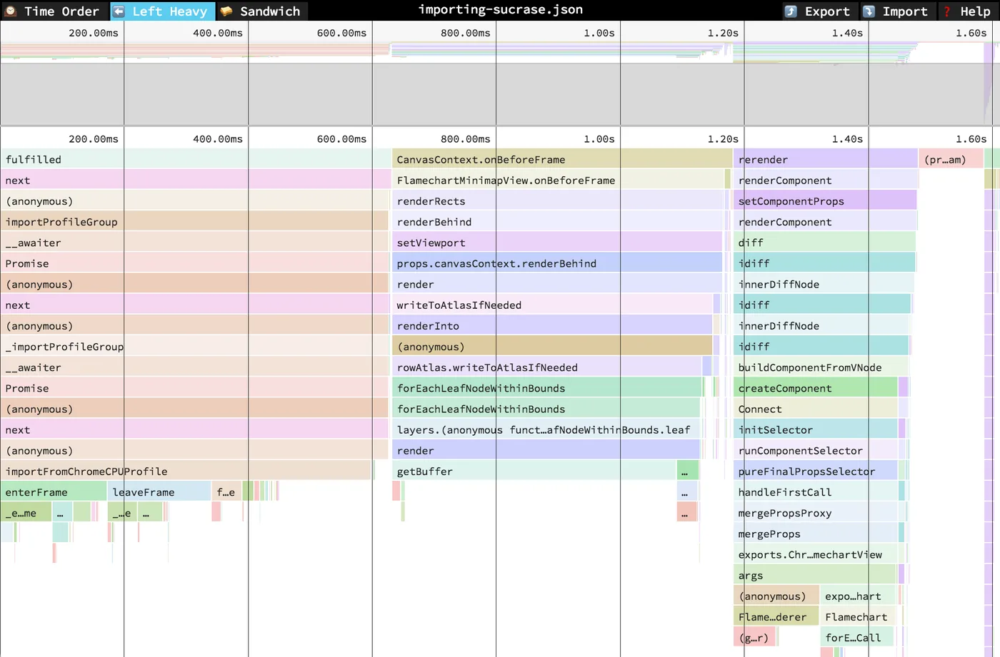</a> | [speedscope](references/45-speedscope/README.md) · [official product](https://github.com/jlfwong/speedscope) | owner-published media, 3 named gaps | Profiling | content-inspector: Dominant content area with a trailing detail or property inspector. Panels: toolbar/header (top); detail/inspector (trailing); primary canvas/content (center). Density: low; confidence: medium. | Study the interchangeable time-order, left-heavy, and sandwich views for examining the same imported profile from different perspectives. |
| 46 | <a href="https://support.pagerduty.com/main/docs/incidents">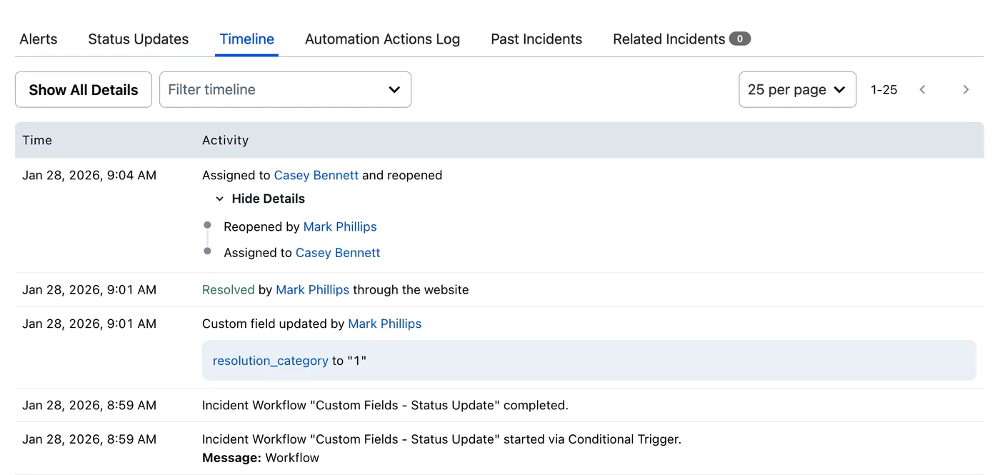</a> | [PagerDuty incident details](references/46-pagerduty-incident-details/README.md) · [official product](https://support.pagerduty.com/main/docs/incidents) | owner-published media, 3 named gaps | Incident management | sidebar-content: Leading navigation or collection list beside a dominant content area. Panels: toolbar/header (top); status/action bar (bottom); navigation/list sidebar (leading); data table/list (center). Density: low; confidence: medium. | Study incident detail pages that combine urgency, assignment, timeline, responder activity, related alerts, and explicit resolution actions. |
| 47 | <a href="https://docs.incident.io/post-incident/timeline">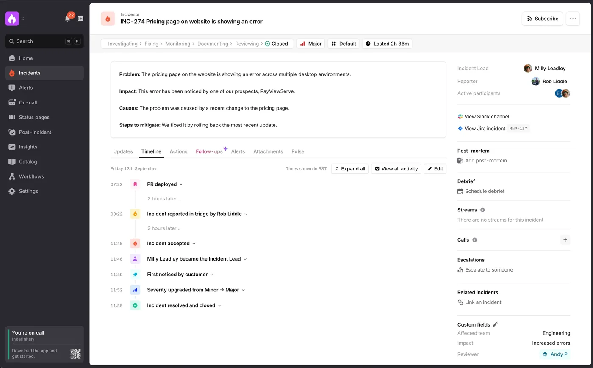</a> | [incident.io incident timeline](references/47-incident-io-incident-timeline/README.md) · [official product](https://docs.incident.io/post-incident/timeline) | owner-published media, 2 named gaps | Incident management | sidebar-content-inspector: Leading navigation, central work area, and trailing detail inspector. Panels: toolbar/header (top); navigation/list sidebar (leading); detail/inspector (trailing); data table/list (center). Density: low; confidence: medium. | Study the automatically assembled incident timeline, where actions, updates, role changes, and key decisions form auditable response evidence. |
| 48 |  | [Power BI drillthrough](references/48-power-bi-drillthrough/README.md) · [official product](https://learn.microsoft.com/en-us/power-bi/create-reports/desktop-drillthrough) | owner-published media, 3 named gaps | Business intelligence | sidebar-content-inspector: Leading navigation, central work area, and trailing detail inspector. Panels: toolbar/header (top); navigation/list sidebar (leading); detail/inspector (trailing); primary canvas/content (center). Density: low; confidence: medium. | Study context-preserving drillthrough from a summary visual to a detail page, including carried filters and an explicit return path. |
| 49 |  | [Tableau Explain Data](references/49-tableau-explain-data/README.md) · [official product](https://help.tableau.com/current/pro/desktop/en-us/explain_data.htm) | owner-published media, 3 named gaps | Business intelligence | sidebar-content-inspector: Leading navigation, central work area, and trailing detail inspector. Panels: toolbar/header (top); status/action bar (bottom); navigation/list sidebar (leading); detail/inspector (trailing); data table/list (center). Density: low; confidence: medium. | Study explanation panels that present candidate contributing factors, visual summaries, and underlying marks without replacing analyst judgment. |
| 50 | <a href="https://superset.apache.org/docs/using-superset/exploring-data/">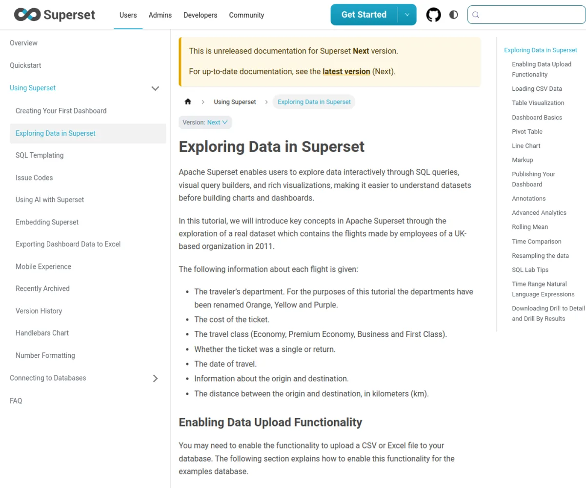</a> | [Apache Superset Explore](references/50-apache-superset-explore/README.md) · [official product](https://superset.apache.org/docs/using-superset/exploring-data/) | owner-published media, 3 named gaps | Business intelligence | sidebar-content: Leading navigation or collection list beside a dominant content area. Panels: toolbar/header (top); navigation/list sidebar (leading); data table/list (center). Density: medium; confidence: medium. | Study the no-code Explore workflow, where dataset, metric, filter, visualization, and query controls remain inspectable and reproducible. |

Normalized panel bounds, detected separators, image dimensions, source-image URLs, hashes, and analysis confidence are recorded in [`sources.json`](sources.json). Media kinds, measured durations, provenance classes, and per-record gaps are in [`references.json`](references.json).

Attribution and product ownership remain with the linked source.
