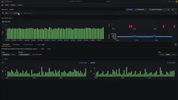
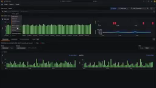
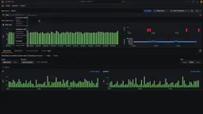
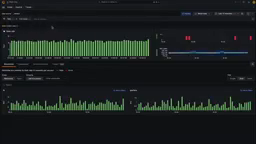
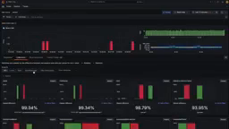

# Grafana Explore — full product reference

**Evidence status:** partial — measured 2026-08-19; every remaining gap is named in [`reference.json`](reference.json)  
**Product:** [Grafana Explore](https://grafana.com/docs/grafana/latest/explore/)  
**Upstream owner:** Grafana  
**Captured:** 2026-08-16T23:30:33Z

## Authentic motion

<video controls muted preload="metadata" src="media/journey.mp4" width="640"></video>

The local motion is an authentic upstream product demonstration retained through Downloaded the upstream-published YouTube video through the Cobalt media gateway, then transcoded a continuous 12-second excerpt beginning at source timestamp 32s; no frames were synthesized. It is not an animation synthesized from the state images.

| Property | Value |
|---|---|
| Source | [https://www.youtube.com/watch?v=a3uB1C2oHA4&t=32s](https://www.youtube.com/watch?v=a3uB1C2oHA4&t=32s) |
| Local file | [`media/journey.mp4`](media/journey.mp4) |
| Kind | `video/mp4` |
| Dimensions | 256 × 144 |
| Duration / frames | 11.97 seconds / 287 frames |
| Bytes | 19394 |
| SHA-256 | `aa09f46ad9869b96c6e3db8ddf3b620c0ec18a993d5c2055039e33e161f247ae` |
| Capture method | Downloaded the upstream-published YouTube video through the Cobalt media gateway, then transcoded a continuous 12-second excerpt beginning at source timestamp 32s; no frames were synthesized |

## Retained product states

All five states are frames of the authentic motion source. Each was located in `media/journey.mp4` by a 16×16 grayscale mean-absolute-difference frame search; the timestamp and the measured difference are below.

| State | Source in `media/journey.mp4` | Local visual | SHA-256 |
|---|---|---|---|
| results loaded, wide green count histogram, first results tab active | 0.5 s, mean abs diff 1.6719/255 |  | `4f55e864b025963027b9682440af1a25d2950c19fa57f9113251bc0e5c98cf09` |
| value dropdown open over the histogram, one row highlighted | 3.5 s, mean abs diff 1.668/255 |  | `d934b8ee22dc002061d5f215086110c19f39fc1d8ddcf80099e13ecb87855b76` |
| dropdown scrolled to its lower group, pointer over the chart | 5 s, mean abs diff 1.6445/255 |  | `2e144353b40671bb02c837d68570cf89694dcbe4ec44926c427e0655026f7479` |
| dropdown dismissed, base panel layout restored | 7 s, mean abs diff 1.6758/255 |  | `328309cba7786895c81f2e25c413e33ceb2465a8624f51f97ca1b14245f277ac` |
| second results tab active, spike chart widened, percentage cards below | 11 s, mean abs diff 1.8164/255 |  | `c6302fa328908af3c0d5931141138f32c1d3ec159b5d8a4126a5b41990cf04ff` |

## First-success investigation journey

**Actor:** A reviewer validating a summary claim against product-native evidence  
**Goal:** Study the split-view query workflow, where synchronized time ranges and raw query results support side-by-side evidence comparison.

| Step | User action | System response | Evidence |
|---:|---|---|---|
| 1 | Open the local evidence recording. | The authentic upstream demonstration is ready at the chosen investigation segment. | [results loaded, wide green count histogram, first results tab active](media/state-01.png) |
| 2 | Start playback and orient to the report or evidence surface. | The product moves from its summary context toward an inspectable evidence view. | [value dropdown open over the histogram, one row highlighted](media/state-02.png) |
| 3 | Pause when the selected detail becomes visible. | The viewer freezes the product-native state for inspection. | [dropdown scrolled to its lower group, pointer over the chart](media/state-03.png) |
| 4 | Resume and navigate farther into the recorded investigation. | A later product state reveals deeper or differently scoped evidence. | [dropdown dismissed, base panel layout restored](media/state-04.png) |
| 5 | Continue to the retained completion point. | The source journey leaves a final visible state that supports the investigation outcome. | [second results tab active, spike chart widened, percentage cards below](media/state-05.png) |

**Failure route:** Playback is paused or a seek skips the intended evidence transition. The reviewer does not treat the interrupted or skipped state as completed evidence.  
**Recovery route:** Resume from the paused position or seek backward. Use the retained state images to re-establish context, then continue to media/state-05.png.  
**Completion evidence:** `media/journey.mp4 together with media/state-05.png`

## Interaction map

| Interaction | Trigger | Response and feedback | Failure | Recovery |
|---|---|---|---|---|
| open evidence | Open the local motion asset at its beginning. | The evidence viewer presents the upstream product demonstration at the selected investigation segment. | A missing or unreadable asset prevents the product state from appearing. | Reopen the hash-verified local asset. |
| start playback | Activate play. | The playhead advances through authentic upstream product motion. | Playback can remain on the ready frame when interrupted. | Activate play again. |
| focus or select | Follow the source recording as its pointer or focus changes the visible evidence surface. | The product binds a selected summary, row, finding, span, report item, or visual mark to more specific evidence. | A transient frame can make the selected target ambiguous. | Step backward and replay the transition. |
| pause for inspection | Pause at the retained detail state. | Motion stops while the selected product evidence remains visible. | The evidence flow is intentionally interrupted at the paused state. | Resume playback from the same playhead position. |
| resume after interruption | Activate play after the pause. | The source journey continues from the retained detail. | Resumption may not advance when the player remains paused. | Activate play and confirm the next visible frame. |
| navigate forward | Seek forward within the local recording. | The viewer reveals a later product state without changing evidence provenance. | An over-large seek can skip the intended intermediate state. | Use the retained state images or seek backward. |
| backtrack | Seek backward or return to an earlier retained state. | The prior evidence context is restored. | A viewer without precise seeking can land between documented states. | Open the corresponding local state image directly. |
| confirm completion | Continue to the retained completion point. | A later, more specific product evidence state is visible. | Stopping early leaves the summary claim unsupported by the final retained state. | Resume or seek to the completion frame. |

Cancellation and backtracking are preserved by pause and reverse seeking; these operations do not alter the source evidence or its hash.

## Motion behavior

- **Trigger:** pointer interaction inside the recording — the value control in the query row is opened at about 3 s, and at about 8.2 s the active results tab changes from the first to the second.
- **Start state:** `media/state-01.png` at 0.5 s, a wide green count histogram across the left with red spike and blue line panels stacked at the right and the first results tab underlined.
- **End state:** `media/state-05.png` at 11 s, the second results tab underlined, the red spike chart widened across the left, the green histogram compacted into the top right, and a grid of cards below each carrying one red and one green bar with a printed percentage.
- **Continuity:** continuous inside one page. The top bar, query row and tab strip stay in place while the dropdown overlays the chart and while the panels below are replaced; sampled at 12 fps, the panel replacement completes between the 8.167 s and 8.250 s frames with no intermediate blend, and the cards underneath fill in over roughly the next 0.3 s.
- **Timing class:** `sub-second`.
- **Interruption and reversal:** the dropdown open at 4 s and 5 s is gone by 7 s and the view underneath matches `media/state-01.png`, so dismissing the list restores the previous state.
- **Feedback:** the active results tab carries an orange underline, the run control in the query row stays a filled blue button, and while the list is open one of its rows is lighter than its neighbours.
- **Reduced motion:** the result of the transition survives without motion — `media/state-05.png` alone carries the moved tab underline, the new panel arrangement and the printed percentages.

## Accessibility

**Observed**

- The active results tab is marked by an orange underline present in every retained still: the first tab in `media/state-01.png` through `media/state-04.png`, the second in `media/state-05.png`. The change of tab is legible without seeing the transition.
- Contrast measured from `media/state-01.png`: dominant page colour `#131619` against histogram fill `#699667` is 5.33:1 by the WCAG relative-luminance formula over the frame's eight-colour histogram.
- Each card in `media/state-05.png` pairs a red and a green bar with a printed percentage (99.34%, 99.34%, 98.79%, 93.95%), so the value is carried by text and not by bar colour alone.
- Five discrete local states cover the whole recorded sequence, giving a nonanimated inspection path through it.

**Unknown from this visual recording**

- The source recording does not expose the product accessibility tree, screen-reader announcements, or exact focus order.
- Reduced-motion behavior inside the recorded product is not established by this visual evidence.
- Audio narration and caption quality were not used as evidence in this reference.
- Whether the icon-only controls at the right end of the query row carry text labels cannot be read from a 256 × 144 frame.

## Provenance boundary

The cited recording proves only the visible states and transitions retained here. Product semantics not visible in the motion or state images remain unknown; marketing claims and inference are not promoted to observation.
