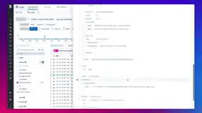
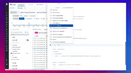
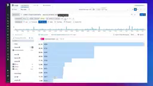
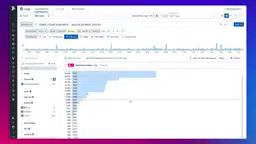
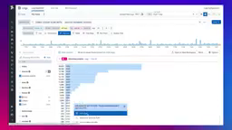

# Datadog Log Explorer — full product reference

**Evidence status:** partial — measured 2026-08-19; every remaining gap is named in [`reference.json`](reference.json)  
**Product:** [Datadog Log Explorer](https://docs.datadoghq.com/logs/explorer/)  
**Upstream owner:** Datadog  
**Captured:** 2026-08-16T23:30:33Z

## Authentic motion

<video controls muted preload="metadata" src="media/journey.mp4" width="640"></video>

The local motion is an authentic upstream product demonstration retained through Downloaded the upstream-published YouTube video through the Cobalt media gateway, then transcoded a continuous 12-second excerpt beginning at source timestamp 31s; no frames were synthesized. It is not an animation synthesized from the state images.

| Property | Value |
|---|---|
| Source | [https://www.youtube.com/watch?v=FJhzNoZgO0s&t=31s](https://www.youtube.com/watch?v=FJhzNoZgO0s&t=31s) |
| Local file | [`media/journey.mp4`](media/journey.mp4) |
| Kind | `video/mp4` |
| Dimensions | 256 × 144 |
| Duration / frames | 12.0 seconds / 360 frames |
| Bytes | 34078 |
| SHA-256 | `0ef57ce5645726cc7a31ea9c763352ab4e566a828519ccc572df13b73cac712a` |
| Capture method | Downloaded the upstream-published YouTube video through the Cobalt media gateway, then transcoded a continuous 12-second excerpt beginning at source timestamp 31s; no frames were synthesized |

## Retained product states

All five states are frames of the authentic motion source. Each was located in `media/journey.mp4` by a 16×16 grayscale mean-absolute-difference frame search; the timestamp and the measured difference are below.

| State | Source in `media/journey.mp4` | Local visual | SHA-256 |
|---|---|---|---|
| log list with the event detail panel open across the right side | 0.5 s, mean abs diff 1.9297/255 |  | `0aa81efe8721dbc7504ca9612eff7c45d495d7261e0268660e1905e99956e3aa` |
| context menu open over the event detail panel, one item filled blue | 2.5 s, mean abs diff 1.9492/255 |  | `a7c8aa1ed53380b6999a498f66cdabfcc22cfb10eec00201ef076d270dc10ff6` |
| detail panel closed, full-width timeline above a blue staircase top list | 5 s, mean abs diff 2.1133/255 |  | `48ddb87d9afdad8b85f03e1b49fb50c9db42d615ae5486d07a5ed1b838700c2a` |
| top list expanded to many more rows with narrower blue bars | 8.5 s, mean abs diff 2.0195/255 |  | `f830686a408c0fb7c1994d77c69e5bf1ea07a636892c621a32418e0747a4db66` |
| small popover over the dense top list, one option filled blue | 10.5 s, mean abs diff 2.0508/255 |  | `34af626b1cd82596dc2dad501cdf1f49fedfa7fd5fd0c60c663c28c069d371bc` |

## First-success investigation journey

**Actor:** A reviewer validating a summary claim against product-native evidence  
**Goal:** Study facet-driven filtering and the event side panel, which preserves raw log context while supporting rapid drill-down.

| Step | User action | System response | Evidence |
|---:|---|---|---|
| 1 | Open the local evidence recording. | The authentic upstream demonstration is ready at the chosen investigation segment. | [log list with the event detail panel open across the right side](media/state-01.png) |
| 2 | Start playback and orient to the report or evidence surface. | The product moves from its summary context toward an inspectable evidence view. | [context menu open over the event detail panel, one item filled blue](media/state-02.png) |
| 3 | Pause when the selected detail becomes visible. | The viewer freezes the product-native state for inspection. | [detail panel closed, full-width timeline above a blue staircase top list](media/state-03.png) |
| 4 | Resume and navigate farther into the recorded investigation. | A later product state reveals deeper or differently scoped evidence. | [top list expanded to many more rows with narrower blue bars](media/state-04.png) |
| 5 | Continue to the retained completion point. | The source journey leaves a final visible state that supports the investigation outcome. | [small popover over the dense top list, one option filled blue](media/state-05.png) |

**Failure route:** Playback is paused or a seek skips the intended evidence transition. The reviewer does not treat the interrupted or skipped state as completed evidence.  
**Recovery route:** Resume from the paused position or seek backward. Use the retained state images to re-establish context, then continue to media/state-05.png.  
**Completion evidence:** `media/journey.mp4 together with media/state-05.png`

## Interaction map

| Interaction | Trigger | Response and feedback | Failure | Recovery |
|---|---|---|---|---|
| open evidence | Open the local motion asset at its beginning. | The evidence viewer presents the upstream product demonstration at the selected investigation segment. | A missing or unreadable asset prevents the product state from appearing. | Reopen the hash-verified local asset. |
| start playback | Activate play. | The playhead advances through authentic upstream product motion. | Playback can remain on the ready frame when interrupted. | Activate play again. |
| focus or select | Follow the source recording as its pointer or focus changes the visible evidence surface. | The product binds a selected summary, row, finding, span, report item, or visual mark to more specific evidence. | A transient frame can make the selected target ambiguous. | Step backward and replay the transition. |
| pause for inspection | Pause at the retained detail state. | Motion stops while the selected product evidence remains visible. | The evidence flow is intentionally interrupted at the paused state. | Resume playback from the same playhead position. |
| resume after interruption | Activate play after the pause. | The source journey continues from the retained detail. | Resumption may not advance when the player remains paused. | Activate play and confirm the next visible frame. |
| navigate forward | Seek forward within the local recording. | The viewer reveals a later product state without changing evidence provenance. | An over-large seek can skip the intended intermediate state. | Use the retained state images or seek backward. |
| backtrack | Seek backward or return to an earlier retained state. | The prior evidence context is restored. | A viewer without precise seeking can land between documented states. | Open the corresponding local state image directly. |
| confirm completion | Continue to the retained completion point. | A later, more specific product evidence state is visible. | Stopping early leaves the summary claim unsupported by the final retained state. | Resume or seek to the completion frame. |

Cancellation and backtracking are preserved by pause and reverse seeking; these operations do not alter the source evidence or its hash.

## Motion behavior

- **Trigger:** pointer interaction inside the recording — a context menu sits over the event detail panel at 2.5 s and is gone one frame after 3.400 s, the detail panel itself is removed between the 4.450 s and 4.483 s frames, and a small popover open at 6.900 s is replaced by a much longer result list by 6.967 s.
- **Start state:** `media/state-01.png` at 0.5 s — the dark left navigation rail, a facet sidebar with grouped rows, a narrow log list, and a white event detail panel open across the right side of the page showing stacked attribute rows.
- **End state:** `media/state-05.png` at 10.5 s — no detail panel, a full-width teal timeline across the top of the result area, a dense blue staircase list beneath it with a percentage column and a count column, and a small popover over the list whose current option is a solid blue band.
- **Continuity:** continuous inside one page. The dark left rail, the top query bar with its filled blue run control and the facet sidebar all stay in place while the right-hand detail panel is removed and the result area is replaced; sampled at 30 fps the detail panel fills the right side in the 4.450 s frame and is completely absent in the 4.483 s frame, with no intermediate blend, fade or slide, and the menu dismissal at 3.400 s and the list replacement at 6.900 s behave the same way.
- **Timing class:** `instant`.
- **Interruption and reversal:** dismissal is shown — the context menu that covers the detail panel at 2.5 s and at 3.400 s is absent from the 3.467 s frame onward while the detail panel underneath is still open, so closing the overlay leaves the surface beneath it intact.
- **Feedback:** the current item is drawn as a solid filled blue band with reversed light text, both in the 2.5 s context menu and in the 10.5 s popover; the run control at the right end of the query row stays a filled blue button in the three later stills; and every row of the result list keeps a printed percentage and a printed count to the left of its blue bar.
- **Reduced motion:** the outcome survives without motion — `media/state-05.png` alone carries the closed detail panel, the full-width timeline and the dense result list with its printed percentages and counts.

## Accessibility

**Observed**

- Every row of the result list in `media/state-03.png`, `media/state-04.png` and `media/state-05.png` prints a percentage and a count in two left-hand columns beside its blue bar, so magnitude is carried by text and not by bar length alone.
- Contrast measured from `media/state-01.png`: the frame's best pair is `#FAFAFB` against `#2C2243` at 14.21:1 by the WCAG relative-luminance formula over the frame's eight-colour histogram; the dominant `#FAFAFB` is the white page background and the darkest `#2C2243` is the dark navigation rail down the left edge of every retained still.
- The current item in the context menu of `media/state-02.png` and in the popover of `media/state-05.png` is a solid filled band spanning the whole menu width with reversed light text, so the current item is marked by a change of shape and not by hue alone.
- In `media/state-03.png`, `media/state-04.png` and `media/state-05.png` each sidebar row carries a small square marker followed by a text label, with a right-aligned value at the end of the row, so the filter rows are labelled rather than icon-only.
- Five discrete local states cover the whole recorded sequence, giving a nonanimated inspection path through it.

**Unknown from this visual recording**

- The source recording does not expose the product accessibility tree, screen-reader announcements, or exact focus order.
- Reduced-motion behavior inside the recorded product is not established by this visual evidence.
- Audio narration and caption quality were not used as evidence in this reference.
- Whether the icon-only buttons in the dark left navigation rail carry text labels cannot be read from a 256 × 144 frame.

## Provenance boundary

The cited recording proves only the visible states and transitions retained here. Product semantics not visible in the motion or state images remain unknown; marketing claims and inference are not promoted to observation.
