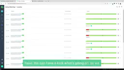
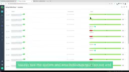
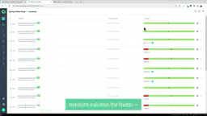
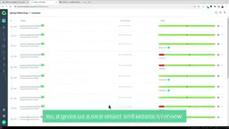
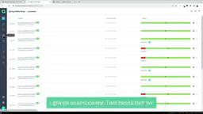

# Allure Report — full product reference

**Evidence status:** complete  
**Product:** [Allure Report](https://allurereport.org/docs/)  
**Upstream owner:** Qameta Software  
**Captured:** 2026-08-16T23:30:33Z

## Authentic motion

<video controls muted preload="metadata" src="media/journey.mp4" width="640"></video>

The local motion is an authentic upstream product demonstration retained through Downloaded the upstream-published YouTube video through the Cobalt media gateway, then transcoded a continuous 12-second excerpt beginning at source timestamp 145s; no frames were synthesized. It is not an animation synthesized from the state images.

| Property | Value |
|---|---|
| Source | [https://www.youtube.com/watch?v=iNQwz2zVHTs&t=145s](https://www.youtube.com/watch?v=iNQwz2zVHTs&t=145s) |
| Local file | [`media/journey.mp4`](media/journey.mp4) |
| Kind | `video/mp4` |
| Dimensions | 256 × 144 |
| Duration / frames | 12.0 seconds / 360 frames |
| Bytes | 19666 |
| SHA-256 | `0fc63567110c579db55b280f1b146833188950f473d4c38a691b484beca01892` |
| Capture method | Downloaded the upstream-published YouTube video through the Cobalt media gateway, then transcoded a continuous 12-second excerpt beginning at source timestamp 145s; no frames were synthesized |

## Retained product states

All five states were retained from, or while capturing, the authentic motion source.

| State | Local visual | SHA-256 |
|---|---|---|
| evidence ready |  | `f7ffd6a3f6257e47884c442e528fa4d623db5b70860a5145ddcf9b8a1c544889` |
| overview visible |  | `cc422de4affcba7dc71a43a74843255d7865262f5bef12b034e80f5b454a6d6e` |
| paused detail |  | `ec728e80f59195361a46c95058d319e9a9f646322042be1a375bf3032359b3cc` |
| deeper evidence |  | `c191a0ef894d4b6fc7d17f0195a5107bedeb086d26a2a8abc5169ea8f9f11abe` |
| completion evidence |  | `2e3da9cba3ffe95b815432b9c0d3d03c3e6d5be7a3998069978942bf33394699` |

## First-success investigation journey

**Actor:** A reviewer validating a summary claim against product-native evidence  
**Goal:** Study severity labels, history, retries, steps, attachments, and environment metadata as a provenance-rich test reporting structure.

| Step | User action | System response | Evidence |
|---:|---|---|---|
| 1 | Open the local evidence recording. | The authentic upstream demonstration is ready at the chosen investigation segment. | [evidence ready](media/state-01.png) |
| 2 | Start playback and orient to the report or evidence surface. | The product moves from its summary context toward an inspectable evidence view. | [overview visible](media/state-02.png) |
| 3 | Pause when the selected detail becomes visible. | The viewer freezes the product-native state for inspection. | [paused detail](media/state-03.png) |
| 4 | Resume and navigate farther into the recorded investigation. | A later product state reveals deeper or differently scoped evidence. | [deeper evidence](media/state-04.png) |
| 5 | Continue to the retained completion point. | The source journey leaves a final visible state that supports the investigation outcome. | [completion evidence](media/state-05.png) |

**Failure route:** Playback is paused or a seek skips the intended evidence transition. The reviewer does not treat the interrupted or skipped state as completed evidence.  
**Recovery route:** Resume from the paused position or seek backward. Use the retained state images to re-establish context, then continue to media/state-05.png.  
**Completion evidence:** `media/journey.mp4 together with media/state-05.png`

## Interaction map

| Interaction | Trigger | Response and feedback | Failure | Recovery |
|---|---|---|---|---|
| open evidence | Open the local motion asset at its beginning. | The evidence viewer presents the upstream product demonstration at the selected investigation segment. | A missing or unreadable asset prevents the product state from appearing. | Reopen the hash-verified local asset. |
| start playback | Activate play. | The playhead advances through authentic upstream product motion. | Playback can remain on the ready frame when interrupted. | Activate play again. |
| focus or select | Follow the source recording as its pointer or focus changes the visible evidence surface. | The product binds a selected summary, row, finding, span, report item, or visual mark to more specific evidence. | A transient frame can make the selected target ambiguous. | Step backward and replay the transition. |
| pause for inspection | Pause at the retained detail state. | Motion stops while the selected product evidence remains visible. | The evidence flow is intentionally interrupted at the paused state. | Resume playback from the same playhead position. |
| resume after interruption | Activate play after the pause. | The source journey continues from the retained detail. | Resumption may not advance when the player remains paused. | Activate play and confirm the next visible frame. |
| navigate forward | Seek forward within the local recording. | The viewer reveals a later product state without changing evidence provenance. | An over-large seek can skip the intended intermediate state. | Use the retained state images or seek backward. |
| backtrack | Seek backward or return to an earlier retained state. | The prior evidence context is restored. | A viewer without precise seeking can land between documented states. | Open the corresponding local state image directly. |
| confirm completion | Continue to the retained completion point. | A later, more specific product evidence state is visible. | Stopping early leaves the summary claim unsupported by the final retained state. | Resume or seek to the completion frame. |

Cancellation and backtracking are preserved by pause and reverse seeking; these operations do not alter the source evidence or its hash.

## Motion behavior

- **Trigger:** explicit play or resume in the evidence viewer.
- **Start state:** `media/state-01.png`; **end state:** `media/state-05.png`.
- **Continuity:** continuous recorded product motion, with discrete state images as the nonanimated inspection equivalent.
- **Timing class:** user-controlled media time; the captured duration is 12.0 seconds.
- **Interruption and reversal:** pause interrupts without losing position; seek backward reverses the inspection path; resume recovers it.
- **Feedback:** visible product-state changes and the player's playhead jointly show progress.
- **Reduced motion:** the five local states are available without playback. The product's own reduced-motion behavior is unknown.

## Accessibility

**Observed**

- Playback can be paused, resumed, and revisited without changing the underlying evidence identity.
- Five discrete local states provide a nonanimated inspection path for the recorded visual sequence.

**Unknown from this visual recording**

- The source recording does not expose the product accessibility tree, screen-reader announcements, or exact focus order.
- Reduced-motion behavior inside the recorded product is not established by this visual evidence.
- Audio narration and caption quality were not used as evidence in this reference.

## Provenance boundary

The cited recording proves only the visible states and transitions retained here. Product semantics not visible in the motion or state images remain unknown; marketing claims and inference are not promoted to observation.
