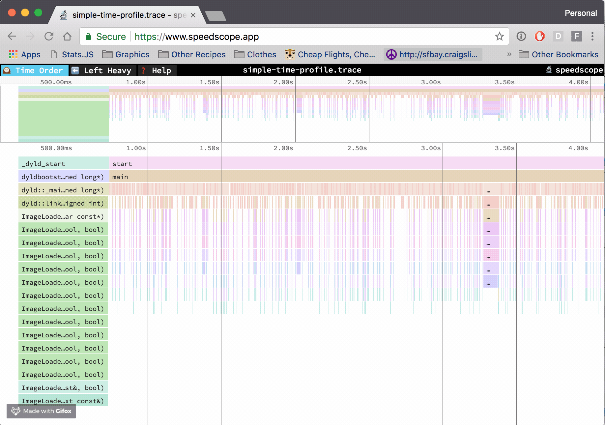
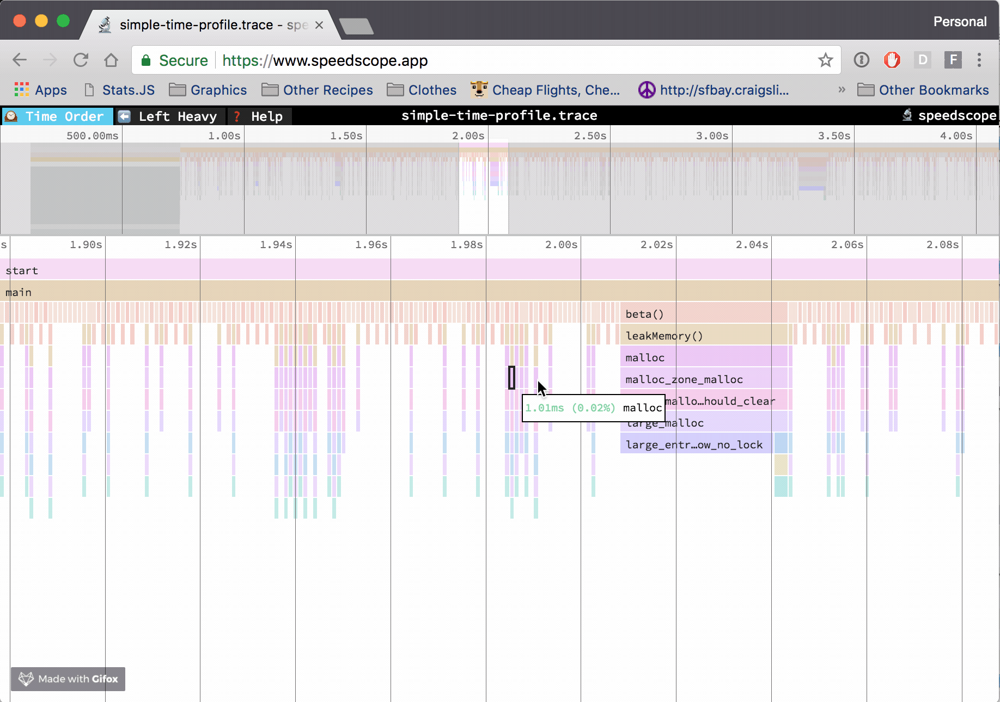
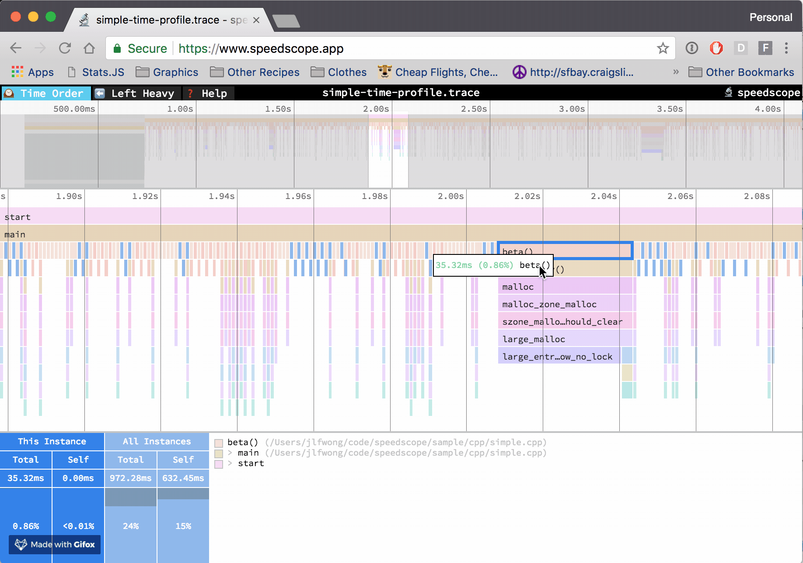
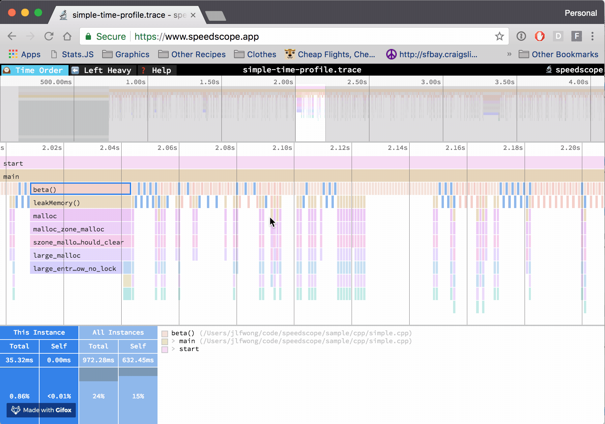
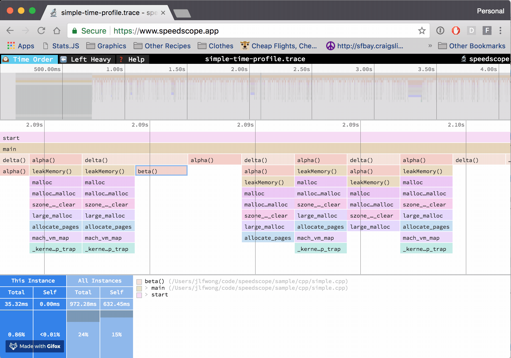

# speedscope — full product reference

**Evidence status:** complete  
**Product:** [speedscope](https://github.com/jlfwong/speedscope)  
**Upstream owner:** jlfwong/speedscope  
**Captured:** 2026-08-16T00:00:00Z

## Authentic motion

The local motion is an authentic upstream product demonstration retained through Downloaded unchanged from the upstream-owned speedscope repository README. It is not an animation synthesized from the state images.

| Property | Value |
|---|---|
| Source | [https://user-images.githubusercontent.com/150329/40900669-86eced80-6781-11e8-92c1-dc667b651e72.gif](https://user-images.githubusercontent.com/150329/40900669-86eced80-6781-11e8-92c1-dc667b651e72.gif) |
| Local file | [`media/journey.gif`](media/journey.gif) |
| Kind | `image/gif` |
| Dimensions | 1836 × 1290 |
| Duration / frames | 6.35 seconds / 92 frames |
| Bytes | 3328237 |
| SHA-256 | `2379bf1c0fe96db9a392793eb2b4a3a6aa8693e9ffc4c3e9fac9d287a9d993fa` |
| Capture method | Downloaded unchanged from the upstream-owned speedscope repository README |

## Retained product states

All five states were retained from, or while capturing, the authentic motion source.

| State | Local visual | SHA-256 |
|---|---|---|
| evidence ready |  | `824a07959451a565306afd9680d2a21b508dbd9e40f57d6f7cbcfd915f4ead62` |
| overview visible |  | `38bc9410531d096da4621b41c0251334d06f1afc0fc30e88c9f13c45484fc878` |
| paused detail |  | `1a70dbef3cf96751c771de3d7c461d603d7568cbbf5221711a179bcd0125e8be` |
| deeper evidence |  | `a22160a780a63b42650ee3a526adb1a0694ea62c2aaabbdd00ec9983a36ebc59` |
| completion evidence |  | `139d9a825e4ec9f75b209a72bc7568ab9cdaa7dd62b9bd7dbe3834088e7991ba` |

## First-success investigation journey

**Actor:** A reviewer validating a summary claim against product-native evidence  
**Goal:** Study the interchangeable time-order, left-heavy, and sandwich views for examining the same imported profile from different perspectives.

| Step | User action | System response | Evidence |
|---:|---|---|---|
| 1 | Open the local evidence recording. | The authentic upstream demonstration is ready at the chosen investigation segment. | [evidence ready](media/state-01.png) |
| 2 | Start playback and orient to the report or evidence surface. | The product moves from its summary context toward an inspectable evidence view. | [overview visible](media/state-02.png) |
| 3 | Pause when the selected detail becomes visible. | The viewer freezes the product-native state for inspection. | [paused detail](media/state-03.png) |
| 4 | Resume and navigate farther into the recorded investigation. | A later product state reveals deeper or differently scoped evidence. | [deeper evidence](media/state-04.png) |
| 5 | Continue to the retained completion point. | The source journey leaves a final visible state that supports the investigation outcome. | [completion evidence](media/state-05.png) |

**Failure route:** Playback is paused or a seek skips the intended evidence transition. The reviewer does not treat the interrupted or skipped state as completed evidence.  
**Recovery route:** Resume from the paused position or seek backward. Use the retained state images to re-establish context, then continue to media/state-05.png.  
**Completion evidence:** `media/journey.gif together with media/state-05.png`

## Interaction map

| Interaction | Trigger | Response and feedback | Failure | Recovery |
|---|---|---|---|---|
| open evidence | Open the local motion asset at its beginning. | The evidence viewer presents the upstream product demonstration at the selected investigation segment. | A missing or unreadable asset prevents the product state from appearing. | Reopen the hash-verified local asset. |
| start playback | Activate play. | The playhead advances through authentic upstream product motion. | Playback can remain on the ready frame when interrupted. | Activate play again. |
| focus or select | Follow the source recording as its pointer or focus changes the visible evidence surface. | The product binds a selected summary, row, finding, span, report item, or visual mark to more specific evidence. | A transient frame can make the selected target ambiguous. | Step backward and replay the transition. |
| pause for inspection | Pause at the retained detail state. | Motion stops while the selected product evidence remains visible. | The evidence flow is intentionally interrupted at the paused state. | Resume playback from the same playhead position. |
| resume after interruption | Activate play after the pause. | The source journey continues from the retained detail. | Resumption may not advance when the player remains paused. | Activate play and confirm the next visible frame. |
| navigate forward | Seek forward within the local recording. | The viewer reveals a later product state without changing evidence provenance. | An over-large seek can skip the intended intermediate state. | Use the retained state images or seek backward. |
| backtrack | Seek backward or return to an earlier retained state. | The prior evidence context is restored. | A viewer without precise seeking can land between documented states. | Open the corresponding local state image directly. |
| confirm completion | Continue to the retained completion point. | A later, more specific product evidence state is visible. | Stopping early leaves the summary claim unsupported by the final retained state. | Resume or seek to the completion frame. |

Cancellation and backtracking are preserved by pause and reverse seeking; these operations do not alter the source evidence or its hash.

## Motion behavior

- **Trigger:** explicit play or resume in the evidence viewer.
- **Start state:** `media/state-01.png`; **end state:** `media/state-05.png`.
- **Continuity:** continuous recorded product motion, with discrete state images as the nonanimated inspection equivalent.
- **Timing class:** user-controlled media time; the captured duration is 6.35 seconds.
- **Interruption and reversal:** pause interrupts without losing position; seek backward reverses the inspection path; resume recovers it.
- **Feedback:** visible product-state changes and the player's playhead jointly show progress.
- **Reduced motion:** the five local states are available without playback. The product's own reduced-motion behavior is unknown.

## Accessibility

**Observed**

- Playback can be paused, resumed, and revisited without changing the underlying evidence identity.
- Five discrete local states provide a nonanimated inspection path for the recorded visual sequence.

**Unknown from this visual recording**

- The source recording does not expose the product accessibility tree, screen-reader announcements, or exact focus order.
- Reduced-motion behavior inside the recorded product is not established by this visual evidence.
- Audio narration and caption quality were not used as evidence in this reference.

## Provenance boundary

The cited recording proves only the visible states and transitions retained here. Product semantics not visible in the motion or state images remain unknown; marketing claims and inference are not promoted to observation.
