# TUI examples

Full-screen terminal interfaces with keyboard-first interaction.

Each entry pairs an attributed overview image and a measured panel anatomy with a per-product record: motion evidence, named states, an observed first-success journey, interaction and recovery behavior, accessibility observations, and provenance. Every number below is measured by `verify-reference-evidence.py`, and a record that is missing evidence says so in its own `evidence_gaps`.

**Examples:** 50  
**Images:** 50  
**Structural analyses:** 50  
**Records with no remaining gap:** 0  
**Records with named gaps:** 50 (99 gaps)  
**Motion provenance:** 27 owner-published media, 23 product run here  
**Curated:** 2026-08-16  
**Visual source data:** [`sources.json`](sources.json)  
**Record index:** [`references.json`](references.json)  
**Cross-example synthesis:** [`full-reference.md`](full-reference.md)

| # | Reference image | Record | Motion evidence | Category | Interface structure | What to study |
|---:|---|---|---|---|---|---|
| 1 |  | [lazygit](references/01-lazygit/README.md) · [official product](https://github.com/jesseduffield/lazygit) | owner-published media, 2 named gaps | Git and developer workflows | split-terminal: Two side-by-side terminal work areas with shared command context. Panels: status/action bar (bottom); primary terminal pane (leading); secondary terminal pane (trailing). Density: low; confidence: medium. | Study the tabbed repository panels, context-sensitive key hints, staged-file selection, and persistent operation status. |
| 2 | <a href="https://github.com/jonas/tig">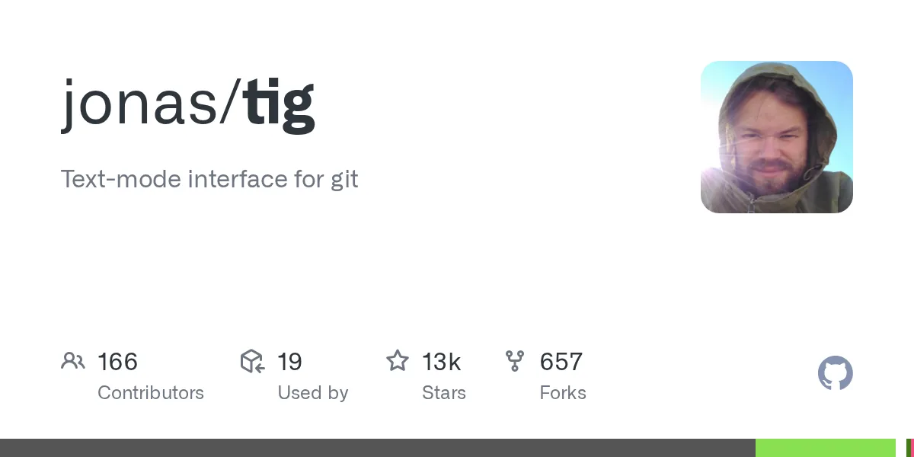</a> | [Tig](references/02-tig/README.md) · [official product](https://github.com/jonas/tig) | product run here, 2 named gaps | Git and developer workflows | split-terminal: Two side-by-side terminal work areas with shared command context. Panels: toolbar/header (top); status/action bar (bottom); primary terminal pane (leading); secondary terminal pane (trailing). Density: low; confidence: medium. | Study its commit graph, split diff view, incremental search, and configurable keyboard bindings within terminal dimensions. |
| 3 | <a href="https://github.com/gitui-org/gitui">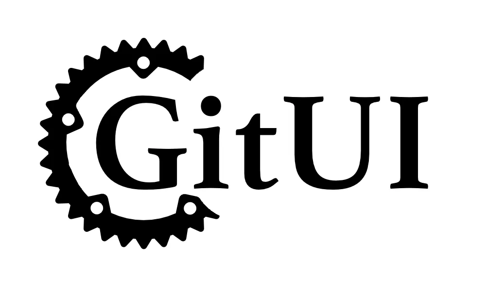</a> | [GitUI](references/03-gitui/README.md) · [official product](https://github.com/gitui-org/gitui) | owner-published media, 2 named gaps | Git and developer workflows | split-terminal: Two side-by-side terminal work areas with shared command context. Panels: primary terminal pane (leading); secondary terminal pane (trailing). Density: low; confidence: medium. | Study focus movement across status, log, and diff panels, plus modal shortcuts for staging selected hunks. |
| 4 | <a href="https://github.com/altsem/gitu">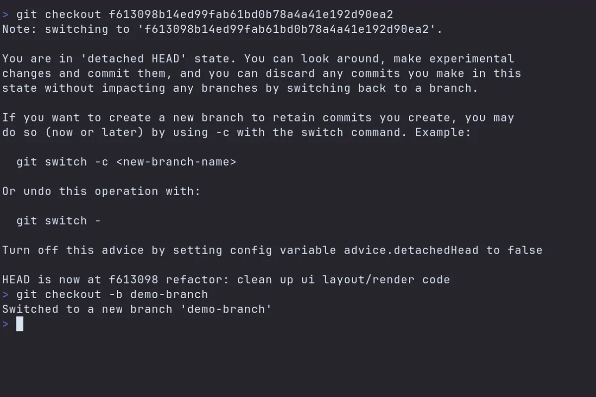</a> | [Gitu](references/04-gitu/README.md) · [official product](https://github.com/altsem/gitu) | owner-published media, 2 named gaps | Git and developer workflows | split-terminal: Two side-by-side terminal work areas with shared command context. Panels: toolbar/header (top); primary terminal pane (leading); secondary terminal pane (trailing). Density: low; confidence: medium. | Study the keyboard-led status interface, selectable change lists, contextual actions, and compact branch information. |
| 5 | <a href="https://github.com/dlvhdr/gh-dash">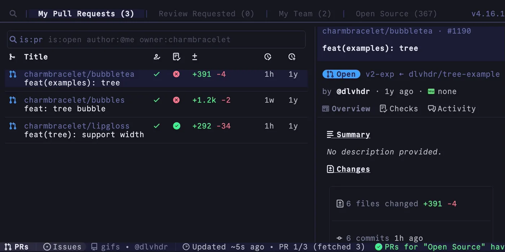</a> | [GitHub CLI Dashboard](references/05-github-cli-dashboard/README.md) · [official product](https://github.com/dlvhdr/gh-dash) | owner-published media, 2 named gaps | Git and developer workflows | split-terminal: Two side-by-side terminal work areas with shared command context. Panels: toolbar/header (top); primary terminal pane (leading); secondary terminal pane (trailing). Density: low; confidence: medium. | Study configurable pull-request panels, query-backed filtering, preview panes, and shortcut discovery in a dense dashboard. |
| 6 | <a href="https://github.com/jesseduffield/lazydocker">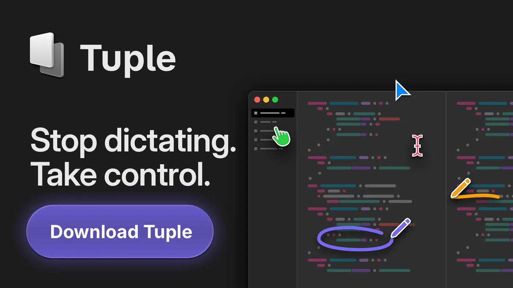</a> | [lazydocker](references/06-lazydocker/README.md) · [official product](https://github.com/jesseduffield/lazydocker) | owner-published media, 2 named gaps | Containers | split-terminal: Two side-by-side terminal work areas with shared command context. Panels: status/action bar (bottom); primary terminal pane (leading); secondary terminal pane (trailing). Density: low; confidence: medium. | Study navigation among container, image, volume, and log panels with contextual commands and live status updates. |
| 7 | <a href="https://github.com/bcicen/ctop">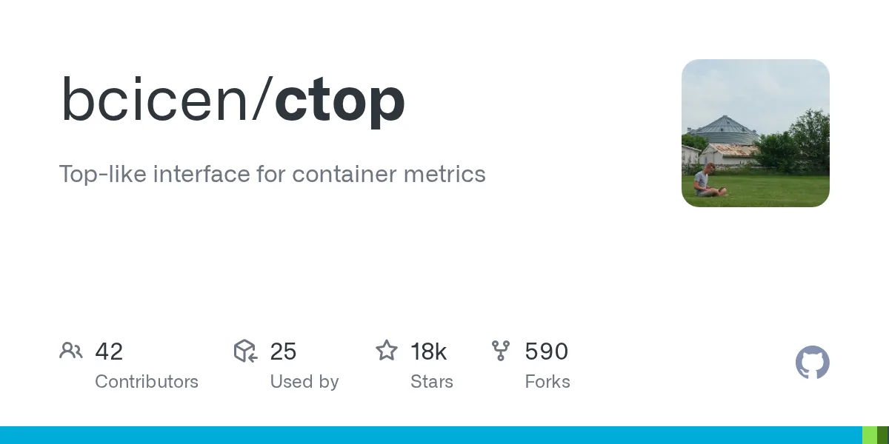</a> | [ctop](references/07-ctop/README.md) · [official product](https://github.com/bcicen/ctop) | owner-published media, 2 named gaps | Containers | split-terminal: Two side-by-side terminal work areas with shared command context. Panels: status/action bar (bottom); primary terminal pane (leading); secondary terminal pane (trailing). Density: low; confidence: medium. | Study the sortable container table, resource sparklines, selection behavior, and drill-down controls under narrow widths. |
| 8 | <a href="https://github.com/moncho/dry">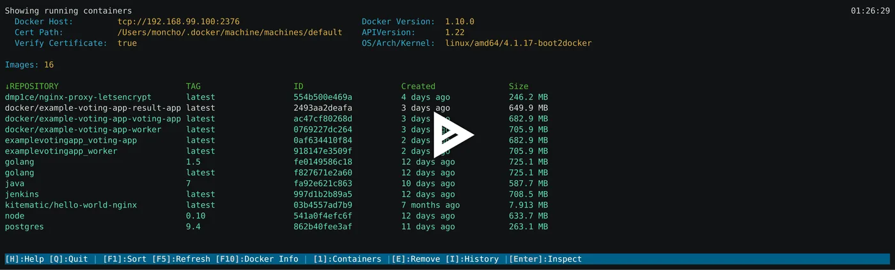</a> | [Dry](references/08-dry/README.md) · [official product](https://github.com/moncho/dry) | owner-published media, 2 named gaps | Containers | split-terminal: Two side-by-side terminal work areas with shared command context. Panels: status/action bar (bottom); primary terminal pane (leading); secondary terminal pane (trailing). Density: medium; confidence: medium. | Study its Docker object lists, screen-specific keyboard maps, selectable rows, and command feedback in a full-screen shell. |
| 9 | <a href="https://github.com/wagoodman/dive">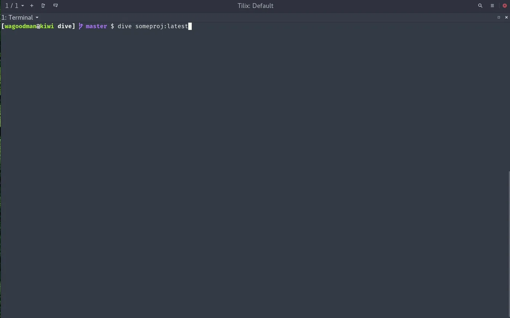</a> | [Dive](references/09-dive/README.md) · [official product](https://github.com/wagoodman/dive) | owner-published media, 2 named gaps | Containers | split-terminal: Two side-by-side terminal work areas with shared command context. Panels: toolbar/header (top); primary terminal pane (leading); secondary terminal pane (trailing). Density: low; confidence: medium. | Study synchronized image-layer and filesystem panels, efficiency summaries, filtering, and selection-driven detail updates. |
| 10 | <a href="https://github.com/mrjackwills/oxker">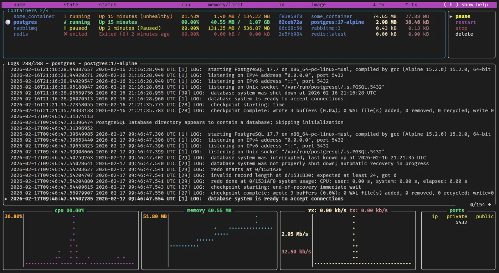</a> | [Oxker](references/10-oxker/README.md) · [official product](https://github.com/mrjackwills/oxker) | owner-published media, 2 named gaps | Containers | split-terminal: Two side-by-side terminal work areas with shared command context. Panels: primary terminal pane (leading); secondary terminal pane (trailing). Density: high; confidence: medium. | Study live container status, log and statistics panels, multi-select actions, and adaptable layouts for terminal constraints. |
| 11 | <a href="https://github.com/derailed/k9s">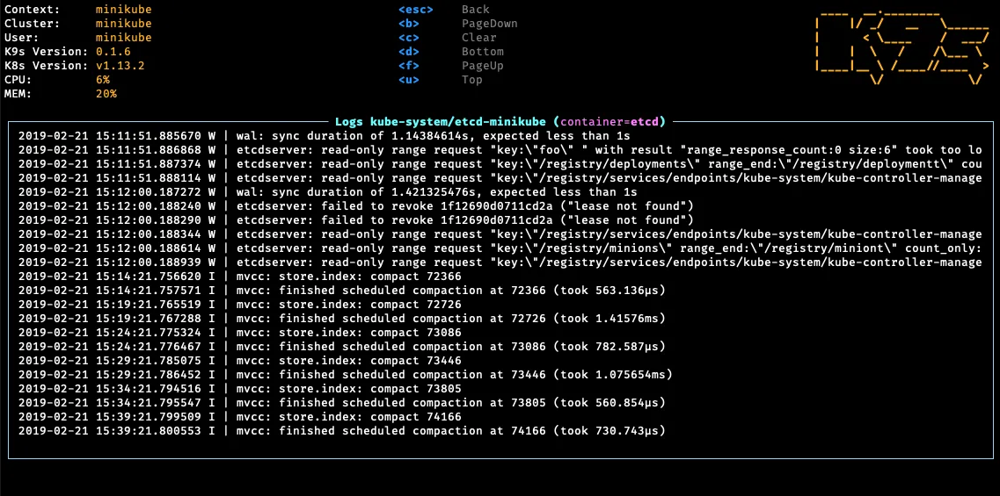</a> | [K9s](references/11-k9s/README.md) · [official product](https://github.com/derailed/k9s) | owner-published media, 2 named gaps | Kubernetes | split-terminal: Two side-by-side terminal work areas with shared command context. Panels: status/action bar (bottom); primary terminal pane (leading); secondary terminal pane (trailing). Density: high; confidence: medium. | Study resource-table navigation, command mode, namespace and label filtering, live status indicators, and contextual shortcuts. |
| 12 |  | [KDash](references/12-kdash/README.md) · [official product](https://github.com/kdash-rs/kdash) | owner-published media, 2 named gaps | Kubernetes | command-output: Single command-and-output flow without a stable secondary panel. Panels: toolbar/header (top); command and output flow (center). Density: low; confidence: medium. | Study the cluster overview cards, resource tabs, searchable tables, and detail panes arranged within a terminal dashboard. |
| 13 | <a href="https://github.com/astefanutti/kubebox">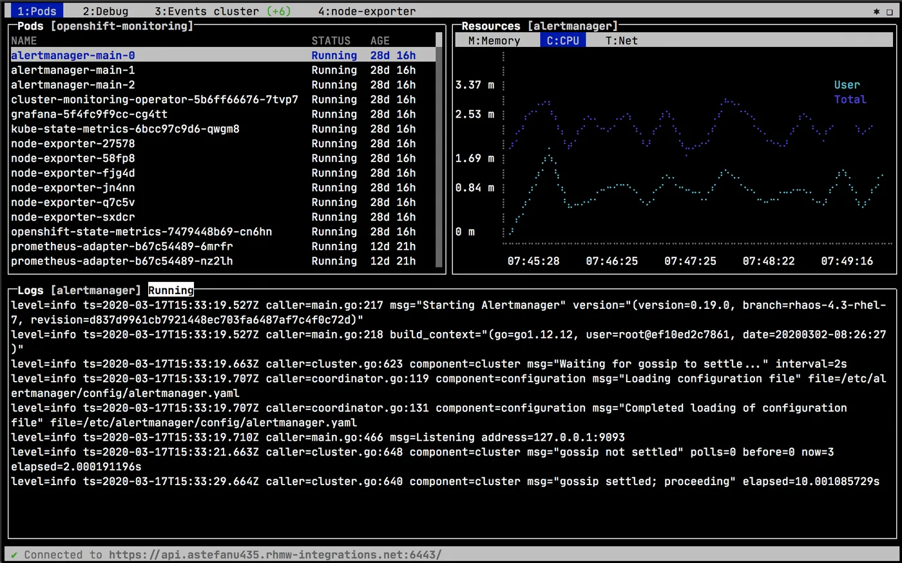</a> | [Kubebox](references/13-kubebox/README.md) · [official product](https://github.com/astefanutti/kubebox) | product run here, 2 named gaps | Kubernetes | split-terminal: Two side-by-side terminal work areas with shared command context. Panels: toolbar/header (top); status/action bar (bottom); primary terminal pane (leading); secondary terminal pane (trailing). Density: high; confidence: medium. | Study cluster-context switching, pod selection, container logs, and resource monitoring presented through nested terminal views. |
| 14 | <a href="https://github.com/htop-dev/htop">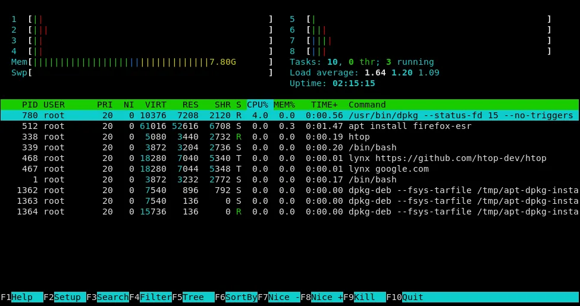</a> | [htop](references/14-htop/README.md) · [official product](https://github.com/htop-dev/htop) | product run here, 2 named gaps | System monitoring | split-terminal: Two side-by-side terminal work areas with shared command context. Panels: primary terminal pane (leading); secondary terminal pane (trailing). Density: medium; confidence: medium. | Study the configurable meter header, sortable process table, tree mode, incremental filtering, and function-key action map. |
| 15 | <a href="https://github.com/aristocratos/btop">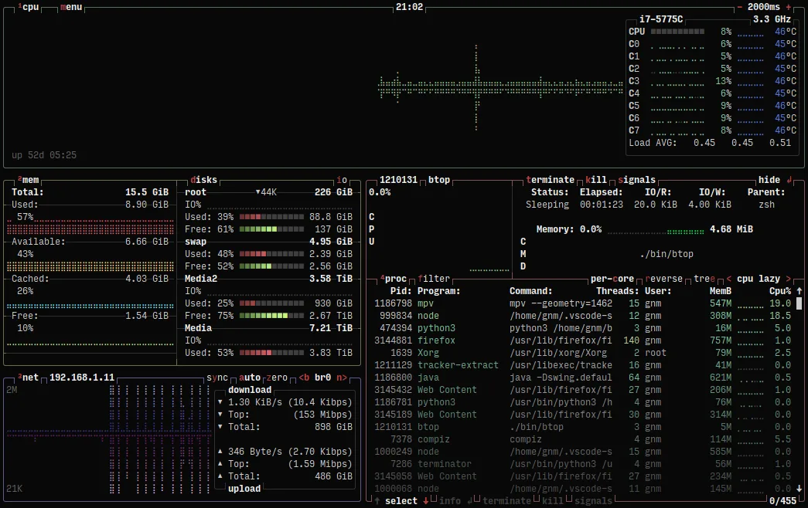</a> | [btop](references/15-btop/README.md) · [official product](https://github.com/aristocratos/btop) | product run here, 2 named gaps | System monitoring | split-terminal: Two side-by-side terminal work areas with shared command context. Panels: primary terminal pane (leading); secondary terminal pane (trailing). Density: medium; confidence: medium. | Study responsive CPU, memory, disk, network, and process panels with mouse support and persistent selection state. |
| 16 | <a href="https://github.com/ClementTsang/bottom">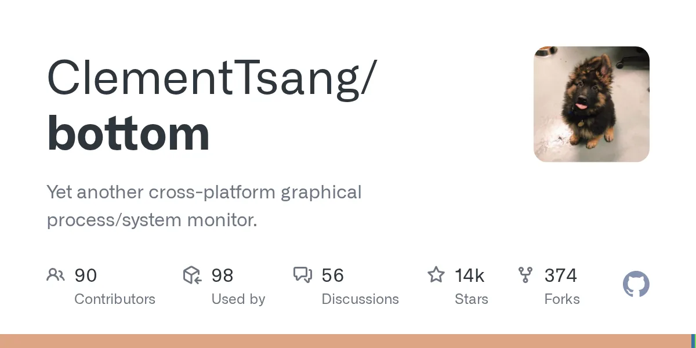</a> | [bottom](references/16-bottom/README.md) · [official product](https://github.com/ClementTsang/bottom) | owner-published media, 2 named gaps | System monitoring | split-terminal: Two side-by-side terminal work areas with shared command context. Panels: toolbar/header (top); status/action bar (bottom); primary terminal pane (leading); secondary terminal pane (trailing). Density: low; confidence: medium. | Study zoomable monitoring widgets, keyboard focus across panels, process search, sorting, and layout behavior at small sizes. |
| 17 | <a href="https://github.com/nicolargo/glances">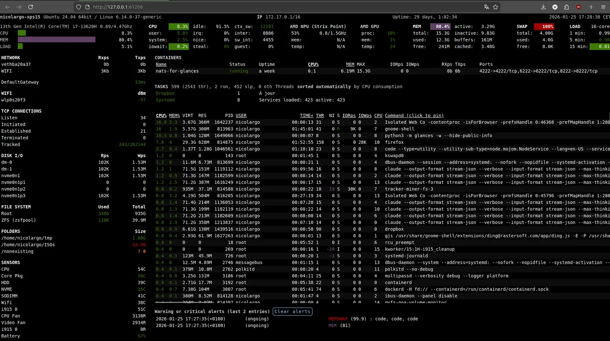</a> | [Glances](references/17-glances/README.md) · [official product](https://github.com/nicolargo/glances) | product run here, 2 named gaps | System monitoring | split-terminal: Two side-by-side terminal work areas with shared command context. Panels: primary terminal pane (leading); secondary terminal pane (trailing). Density: medium; confidence: medium. | Study threshold-colored status, adaptive information sections, process filtering, and dense cross-platform metrics presentation. |
| 18 | <a href="https://github.com/bvaisvil/zenith">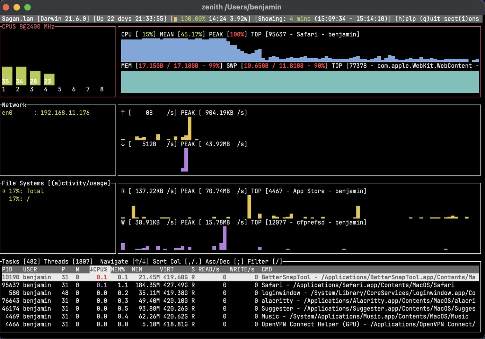</a> | [Zenith](references/18-zenith/README.md) · [official product](https://github.com/bvaisvil/zenith) | product run here, 2 named gaps | System monitoring | split-terminal: Two side-by-side terminal work areas with shared command context. Panels: status/action bar (bottom); primary terminal pane (leading); secondary terminal pane (trailing). Density: medium; confidence: medium. | Study chart time windows, process-table selection, resource summaries, and keyboard control of a continuously updating display. |
| 19 | <a href="https://github.com/XuehaiPan/nvitop">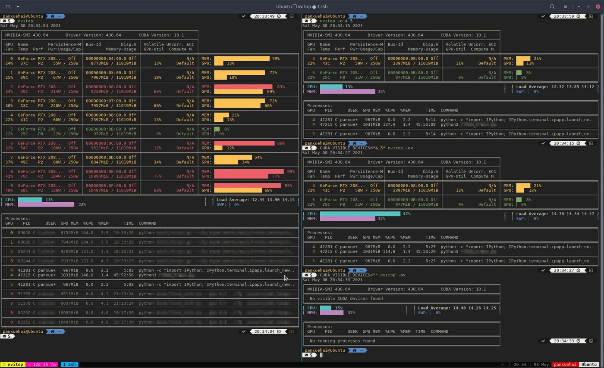</a> | [nvitop](references/19-nvitop/README.md) · [official product](https://github.com/XuehaiPan/nvitop) | owner-published media, 2 named gaps | System monitoring | split-terminal: Two side-by-side terminal work areas with shared command context. Panels: toolbar/header (top); primary terminal pane (leading); secondary terminal pane (trailing). Density: medium; confidence: medium. | Study GPU and process panels, tree and environment drill-downs, row selection, and live status under rapid refresh. |
| 20 | <a href="https://github.com/Syllo/nvtop">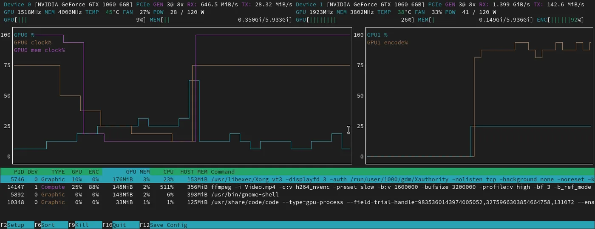</a> | [NVTOP](references/20-nvtop/README.md) · [official product](https://github.com/Syllo/nvtop) | product run here, 2 named gaps | System monitoring | split-terminal: Two side-by-side terminal work areas with shared command context. Panels: toolbar/header (top); status/action bar (bottom); primary terminal pane (leading); secondary terminal pane (trailing). Density: low; confidence: medium. | Study multi-device utilization graphs, process tables, configurable fields, and color-coded status in limited terminal space. |
| 21 | <a href="https://github.com/ranger/ranger">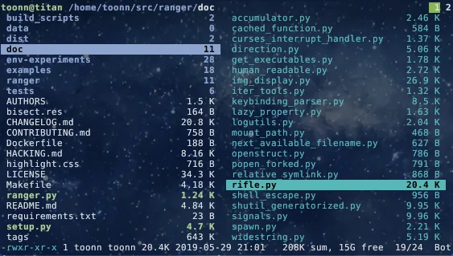</a> | [Ranger](references/21-ranger/README.md) · [official product](https://github.com/ranger/ranger) | product run here, 2 named gaps | File management | split-terminal: Two side-by-side terminal work areas with shared command context. Panels: toolbar/header (top); status/action bar (bottom); primary terminal pane (leading); secondary terminal pane (trailing). Density: medium; confidence: medium. | Study Miller-column navigation, preview generation, marks, command mode, and Vim-style keyboard maps for filesystem traversal. |
| 22 | <a href="https://github.com/gokcehan/lf">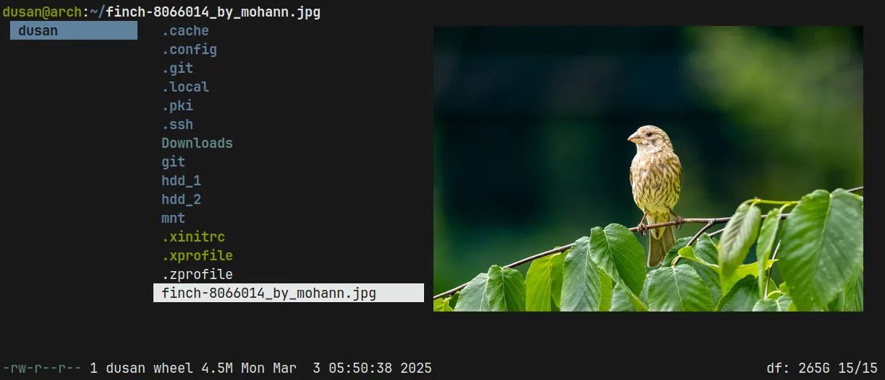</a> | [lf](references/22-lf/README.md) · [official product](https://github.com/gokcehan/lf) | product run here, 2 named gaps | File management | split-terminal: Two side-by-side terminal work areas with shared command context. Panels: status/action bar (bottom); primary terminal pane (leading); secondary terminal pane (trailing). Density: low; confidence: medium. | Study its three-pane browser, selection and tagging model, command-line prompt, previews, and user-defined key mappings. |
| 23 | <a href="https://github.com/jarun/nnn">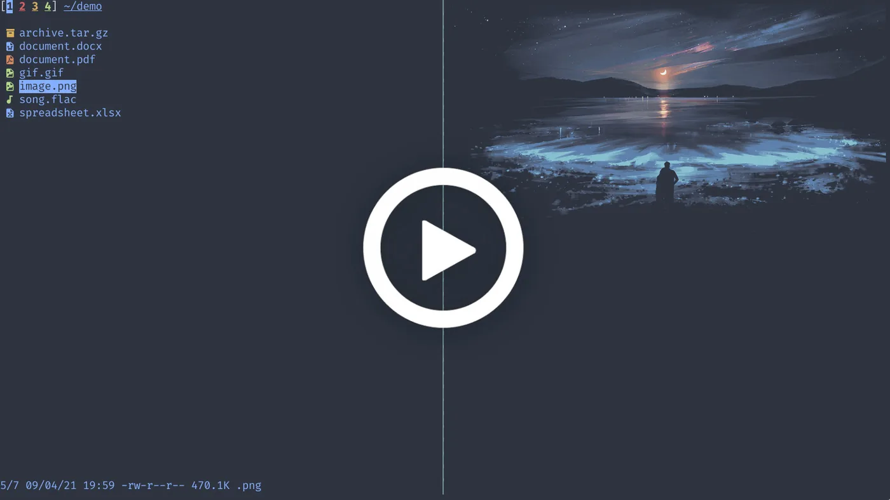</a> | [nnn](references/23-nnn/README.md) · [official product](https://github.com/jarun/nnn) | owner-published media, 2 named gaps | File management | split-terminal: Two side-by-side terminal work areas with shared command context. Panels: toolbar/header (top); primary terminal pane (leading); secondary terminal pane (trailing). Density: low; confidence: medium. | Study context tabs, filter-as-you-type navigation, selection queues, plugin invocation, and minimal status presentation. |
| 24 | <a href="https://github.com/sxyazi/yazi">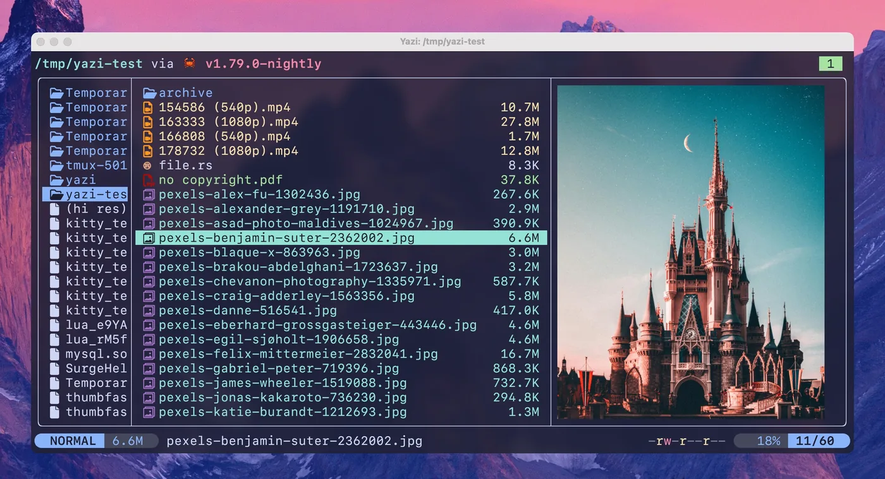</a> | [Yazi](references/24-yazi/README.md) · [official product](https://github.com/sxyazi/yazi) | product run here, 2 named gaps | File management | split-terminal: Two side-by-side terminal work areas with shared command context. Panels: toolbar/header (top); status/action bar (bottom); primary terminal pane (leading); secondary terminal pane (trailing). Density: medium; confidence: medium. | Study asynchronous previews, multi-column navigation, visual selection, searchable lists, and key-hint feedback during operations. |
| 25 | <a href="https://github.com/Canop/broot">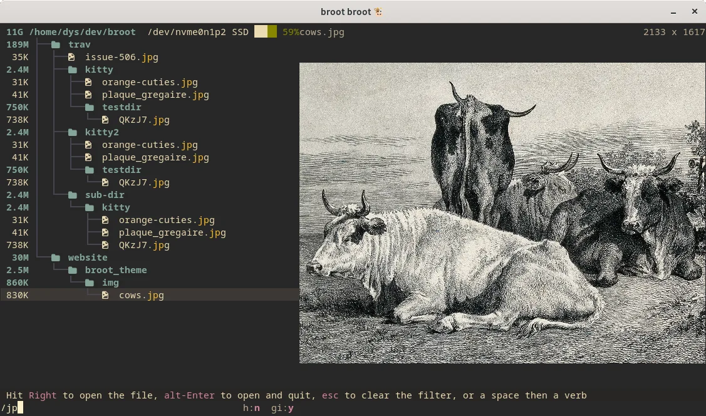</a> | [Broot](references/25-broot/README.md) · [official product](https://github.com/Canop/broot) | product run here, 2 named gaps | File management | split-terminal: Two side-by-side terminal work areas with shared command context. Panels: toolbar/header (top); status/action bar (bottom); primary terminal pane (leading); secondary terminal pane (trailing). Density: high; confidence: medium. | Study fuzzy path filtering, tree pruning, selected-file previews, verb shortcuts, and terminal-aware handling of huge directories. |
| 26 | <a href="https://github.com/vifm/vifm">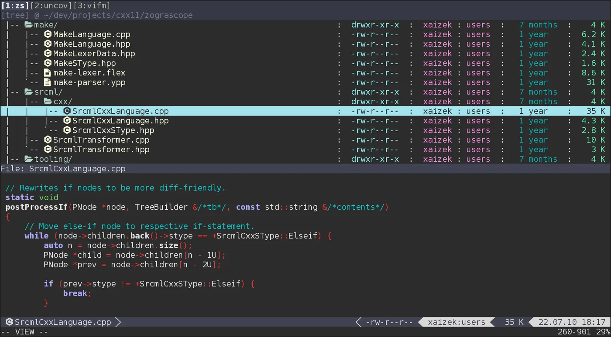</a> | [Vifm](references/26-vifm/README.md) · [official product](https://github.com/vifm/vifm) | product run here, 2 named gaps | File management | split-terminal: Two side-by-side terminal work areas with shared command context. Panels: status/action bar (bottom); primary terminal pane (leading); secondary terminal pane (trailing). Density: medium; confidence: medium. | Study dual-pane file operations, visual selection, command-line mode, configurable mappings, and persistent directory state. |
| 27 | <a href="https://github.com/MidnightCommander/mc">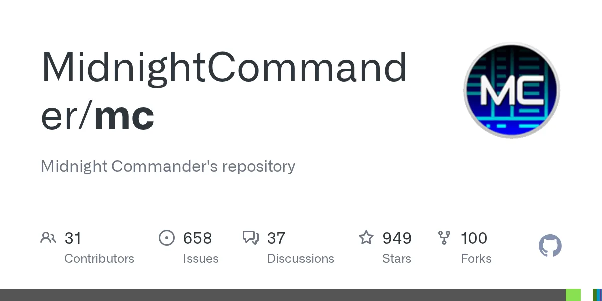</a> | [Midnight Commander](references/27-midnight-commander/README.md) · [official product](https://github.com/MidnightCommander/mc) | product run here, 1 named gaps | File management | split-terminal: Two side-by-side terminal work areas with shared command context. Panels: status/action bar (bottom); primary terminal pane (leading); secondary terminal pane (trailing). Density: low; confidence: medium. | Study dual-pane navigation, function-key affordances, menus, dialogs, and progress feedback designed for varied terminal capabilities. |
| 28 | <a href="https://github.com/sayanarijit/xplr">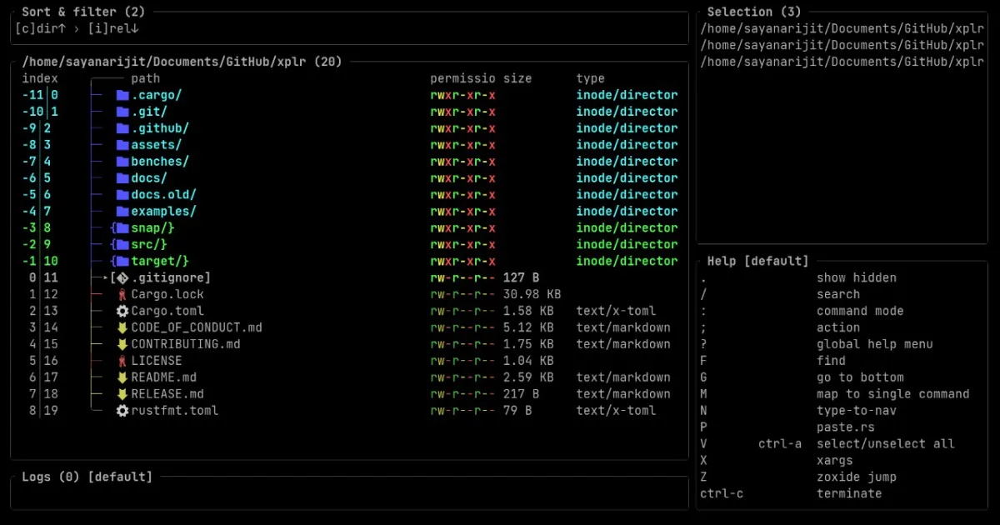</a> | [xplr](references/28-xplr/README.md) · [official product](https://github.com/sayanarijit/xplr) | owner-published media, 2 named gaps | File management | split-terminal: Two side-by-side terminal work areas with shared command context. Panels: toolbar/header (top); status/action bar (bottom); primary terminal pane (leading); secondary terminal pane (trailing). Density: medium; confidence: medium. | Study its programmable mode system, keyboard routing, selection state, dynamic tables, and customizable help and status bars. |
| 29 | <a href="https://github.com/yorukot/superfile">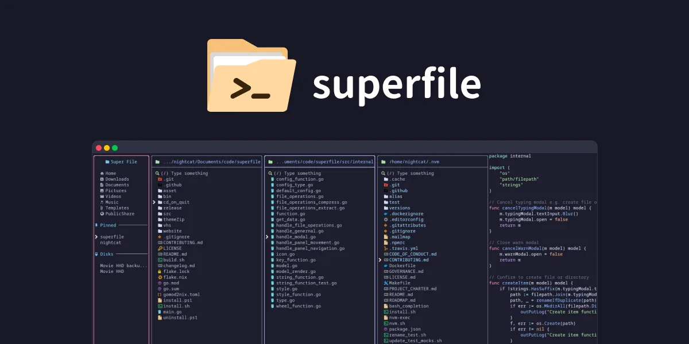</a> | [Superfile](references/29-superfile/README.md) · [official product](https://github.com/yorukot/superfile) | owner-published media, 2 named gaps | File management | split-terminal: Two side-by-side terminal work areas with shared command context. Panels: primary terminal pane (leading); secondary terminal pane (trailing). Density: low; confidence: medium. | Study multi-panel directory browsing, clipboard and selection indicators, searchable navigation, and responsive terminal layout. |
| 30 |  | [Rainfrog](references/30-rainfrog/README.md) · [official product](https://github.com/achristmascarl/rainfrog) | owner-published media, 2 named gaps | Databases | command-output: Single command-and-output flow without a stable secondary panel. Panels: toolbar/header (top); command and output flow (center). Density: low; confidence: medium. | Study connection and schema navigation, query-editor focus, tabular result selection, and query status within a terminal workspace. |
| 31 |  | [Harlequin](references/31-harlequin/README.md) · [official product](https://github.com/tconbeer/harlequin) | product run here, 2 named gaps | Databases | split-terminal: Two side-by-side terminal work areas with shared command context. Panels: primary terminal pane (leading); secondary terminal pane (trailing). Density: low; confidence: medium. | Study the SQL editor, data catalog, results pane, keyboard focus model, and layout adaptation for different terminal widths. |
| 32 | <a href="https://github.com/mathaou/termdbms">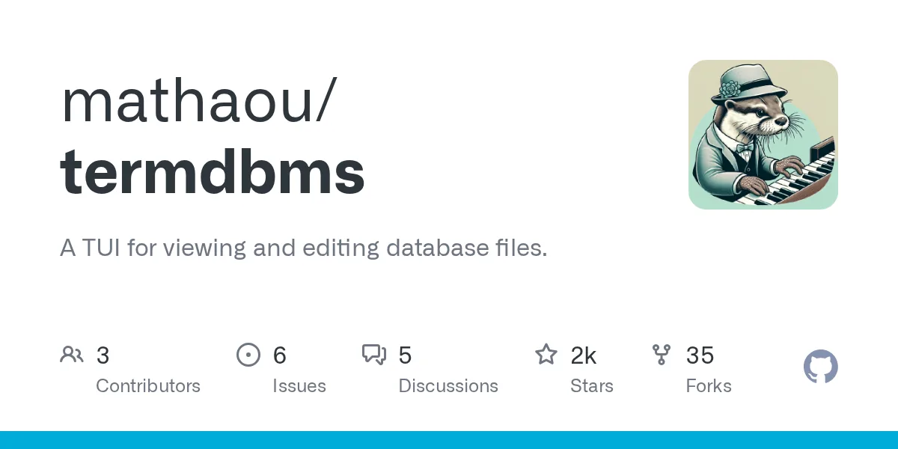</a> | [Termdbms](references/32-termdbms/README.md) · [official product](https://github.com/mathaou/termdbms) | owner-published media, 2 named gaps | Databases | split-terminal: Two side-by-side terminal work areas with shared command context. Panels: status/action bar (bottom); primary terminal pane (leading); secondary terminal pane (trailing). Density: low; confidence: medium. | Study database-object browsing, editable query areas, tabular results, and shortcut-driven panel switching in a full-screen interface. |
| 33 | <a href="https://github.com/laixintao/iredis">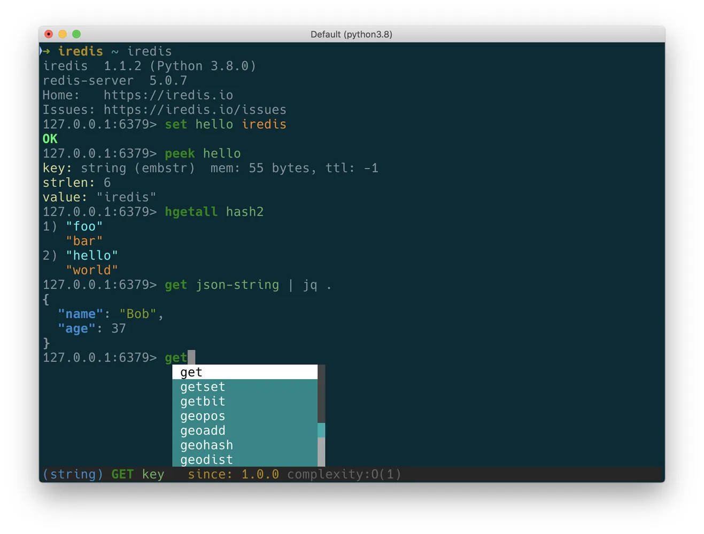</a> | [iredis](references/33-iredis/README.md) · [official product](https://github.com/laixintao/iredis) | owner-published media, 2 named gaps | Databases | split-terminal: Two side-by-side terminal work areas with shared command context. Panels: toolbar/header (top); status/action bar (bottom); primary terminal pane (leading); secondary terminal pane (trailing). Density: low; confidence: medium. | Study interactive completion, syntax-aware command entry, bottom status information, paging, and searchable Redis command history. |
| 34 | <a href="https://github.com/neomutt/neomutt">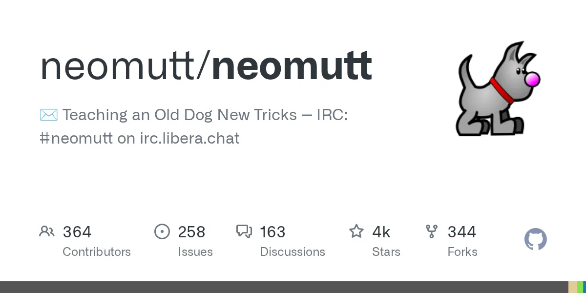</a> | [NeoMutt](references/34-neomutt/README.md) · [official product](https://github.com/neomutt/neomutt) | product run here, 2 named gaps | Mail | split-terminal: Two side-by-side terminal work areas with shared command context. Panels: toolbar/header (top); status/action bar (bottom); primary terminal pane (leading); secondary terminal pane (trailing). Density: low; confidence: medium. | Study mailbox and message indexes, threaded selection, search patterns, status lines, and extensive keyboard-map customization. |
| 35 | <a href="https://github.com/rjarry/aerc">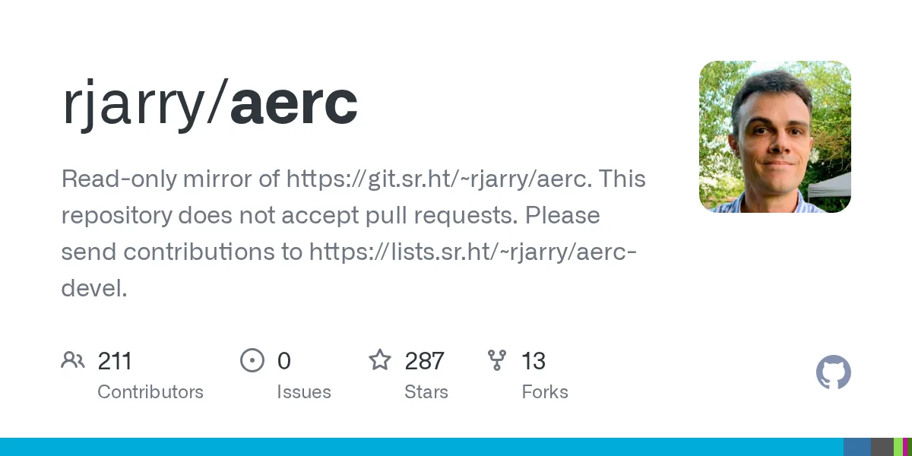</a> | [aerc](references/35-aerc/README.md) · [official product](https://github.com/rjarry/aerc) | product run here, 2 named gaps | Mail | split-terminal: Two side-by-side terminal work areas with shared command context. Panels: toolbar/header (top); primary terminal pane (leading); secondary terminal pane (trailing). Density: low; confidence: medium. | Study account, folder, message-list, viewer, and composer tabs with modal key bindings and asynchronous status feedback. |
| 36 | <a href="https://github.com/pazz/alot">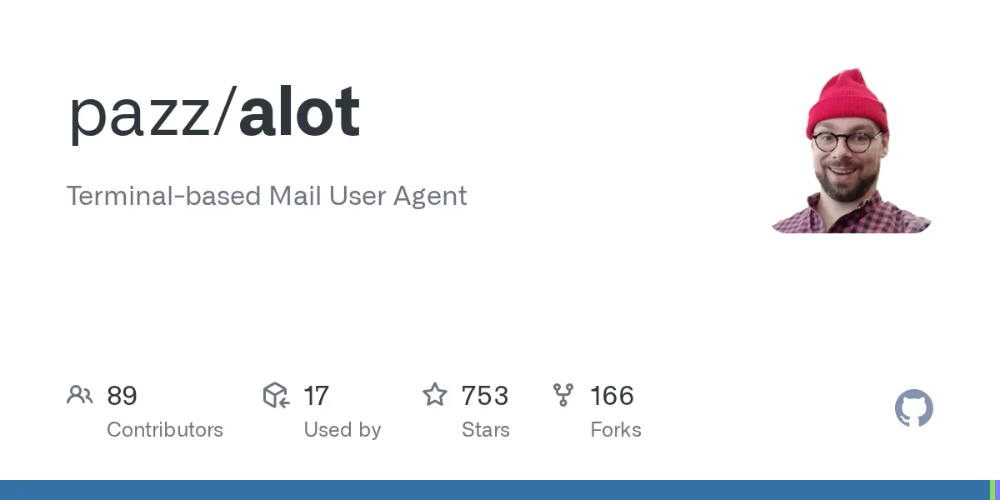</a> | [alot](references/36-alot/README.md) · [official product](https://github.com/pazz/alot) | product run here, 2 named gaps | Mail | split-terminal: Two side-by-side terminal work areas with shared command context. Panels: status/action bar (bottom); primary terminal pane (leading); secondary terminal pane (trailing). Density: low; confidence: medium. | Study tagged-message workflows, thread buffers, command prompts, searchable mail views, and keyboard-driven buffer management. |
| 37 | <a href="https://github.com/meli/meli">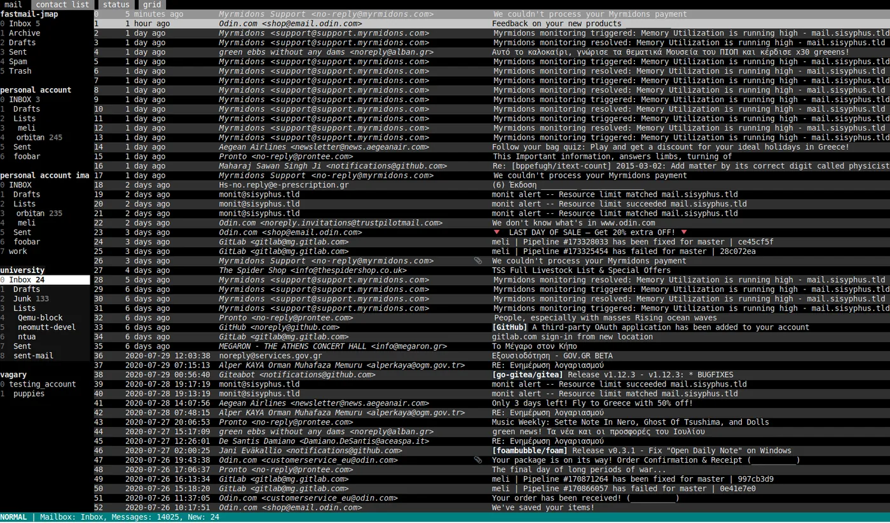</a> | [meli](references/37-meli/README.md) · [official product](https://github.com/meli/meli) | product run here, 2 named gaps | Mail | split-terminal: Two side-by-side terminal work areas with shared command context. Panels: toolbar/header (top); primary terminal pane (leading); secondary terminal pane (trailing). Density: high; confidence: medium. | Study multi-pane mailbox views, conversation threading, account status, search, and configurable shortcuts across terminal sizes. |
| 38 | <a href="https://github.com/pimalaya/himalaya">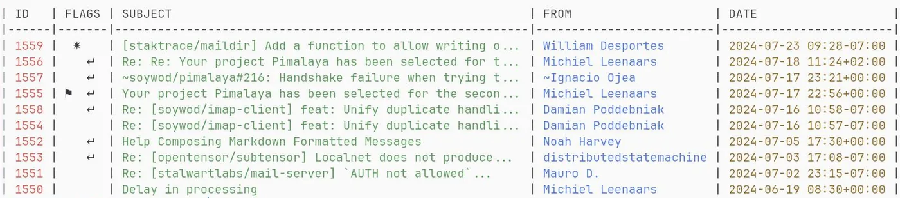</a> | [Himalaya](references/38-himalaya/README.md) · [official product](https://github.com/pimalaya/himalaya) | product run here, 2 named gaps | Mail | split-terminal: Two side-by-side terminal work areas with shared command context. Panels: toolbar/header (top); status/action bar (bottom); primary terminal pane (leading); secondary terminal pane (trailing). Density: high; confidence: medium. | Study its terminal mail interface, account and folder state, message selection, search, and keyboard-oriented composition flow. |
| 39 | <a href="https://github.com/clangen/musikcube">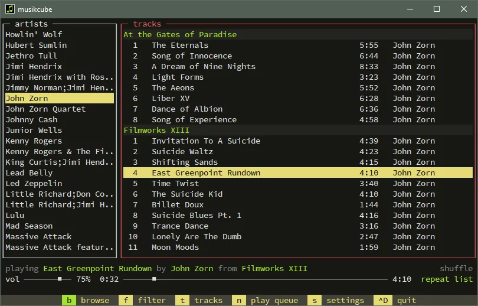</a> | [musikcube](references/39-musikcube/README.md) · [official product](https://github.com/clangen/musikcube) | owner-published media, 2 named gaps | Music | split-terminal: Two side-by-side terminal work areas with shared command context. Panels: toolbar/header (top); status/action bar (bottom); primary terminal pane (leading); secondary terminal pane (trailing). Density: medium; confidence: medium. | Study library and queue navigation, persistent playback status, search, and shortcut-led control across compact terminal panels. |
| 40 | <a href="https://github.com/mierak/rmpc">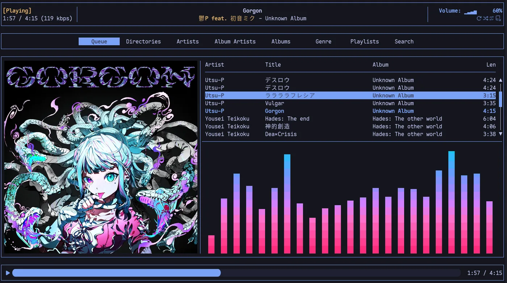</a> | [rmpc](references/40-rmpc/README.md) · [official product](https://github.com/mierak/rmpc) | product run here, 2 named gaps | Music | split-terminal: Two side-by-side terminal work areas with shared command context. Panels: toolbar/header (top); status/action bar (bottom); primary terminal pane (leading); secondary terminal pane (trailing). Density: medium; confidence: medium. | Study configurable MPD panes, queue selection, filter and search interactions, progress status, and user-defined key bindings. |
| 41 | <a href="https://github.com/ncmpcpp/ncmpcpp">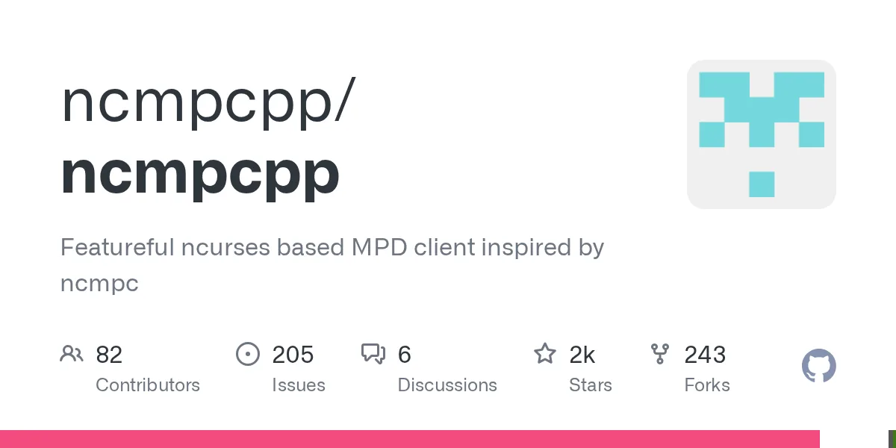</a> | [ncmpcpp](references/41-ncmpcpp/README.md) · [official product](https://github.com/ncmpcpp/ncmpcpp) | product run here, 2 named gaps | Music | split-terminal: Two side-by-side terminal work areas with shared command context. Panels: status/action bar (bottom); primary terminal pane (leading); secondary terminal pane (trailing). Density: low; confidence: medium. | Study switchable library, playlist, search, lyrics, and visualizer screens with selection state and configurable keyboard maps. |
| 42 | <a href="https://github.com/aome510/spotify-player">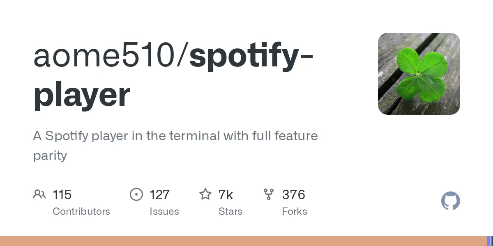</a> | [spotify-player](references/42-spotify-player/README.md) · [official product](https://github.com/aome510/spotify-player) | owner-published media, 2 named gaps | Music | split-terminal: Two side-by-side terminal work areas with shared command context. Panels: toolbar/header (top); status/action bar (bottom); primary terminal pane (leading); secondary terminal pane (trailing). Density: low; confidence: medium. | Study searchable Spotify lists, device and playback controls, queue state, and key-driven navigation among terminal views. |
| 43 | <a href="https://github.com/tramhao/termusic">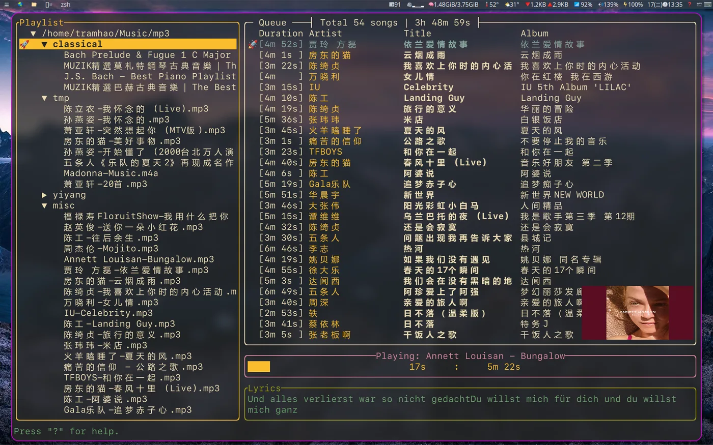</a> | [Termusic](references/43-termusic/README.md) · [official product](https://github.com/tramhao/termusic) | product run here, 2 named gaps | Music | split-terminal: Two side-by-side terminal work areas with shared command context. Panels: toolbar/header (top); status/action bar (bottom); primary terminal pane (leading); secondary terminal pane (trailing). Density: high; confidence: medium. | Study library, playlist, podcast, and playback panels with focus switching, search, selection, and persistent progress information. |
| 44 | <a href="https://github.com/imsnif/bandwhich">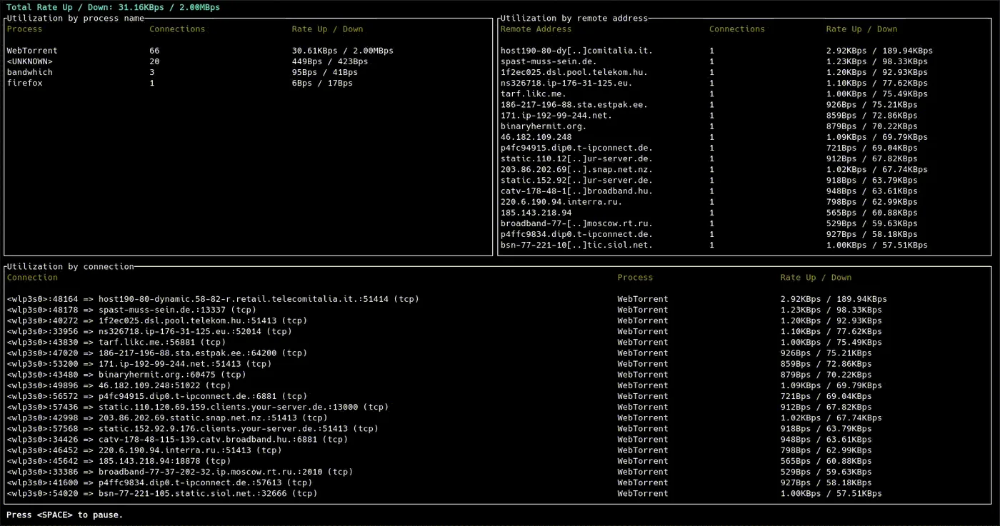</a> | [bandwhich](references/44-bandwhich/README.md) · [official product](https://github.com/imsnif/bandwhich) | owner-published media, 2 named gaps | Networking | split-terminal: Two side-by-side terminal work areas with shared command context. Panels: status/action bar (bottom); primary terminal pane (leading); secondary terminal pane (trailing). Density: medium; confidence: medium. | Study continuously refreshed connection tables, grouping by process and address, sorting, and bandwidth status at constrained widths. |
| 45 | <a href="https://github.com/gcla/termshark">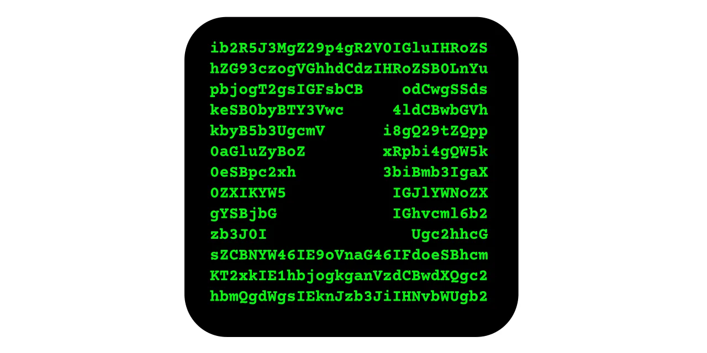</a> | [Termshark](references/45-termshark/README.md) · [official product](https://github.com/gcla/termshark) | owner-published media, 2 named gaps | Networking | split-terminal: Two side-by-side terminal work areas with shared command context. Panels: toolbar/header (top); status/action bar (bottom); primary terminal pane (leading); secondary terminal pane (trailing). Density: low; confidence: medium. | Study synchronized packet list, protocol tree, and byte panes plus capture filters, search, selection, and stream reassembly. |
| 46 |  | [Trippy](references/46-trippy/README.md) · [official product](https://github.com/fujiapple852/trippy) | owner-published media, 2 named gaps | Networking | split-terminal: Two side-by-side terminal work areas with shared command context. Panels: primary terminal pane (leading); secondary terminal pane (trailing). Density: low; confidence: medium. | Study live hop tables, charts, adjustable tracing parameters, row selection, and keyboard-controlled views for unstable networks. |
| 47 | <a href="https://github.com/orf/gping">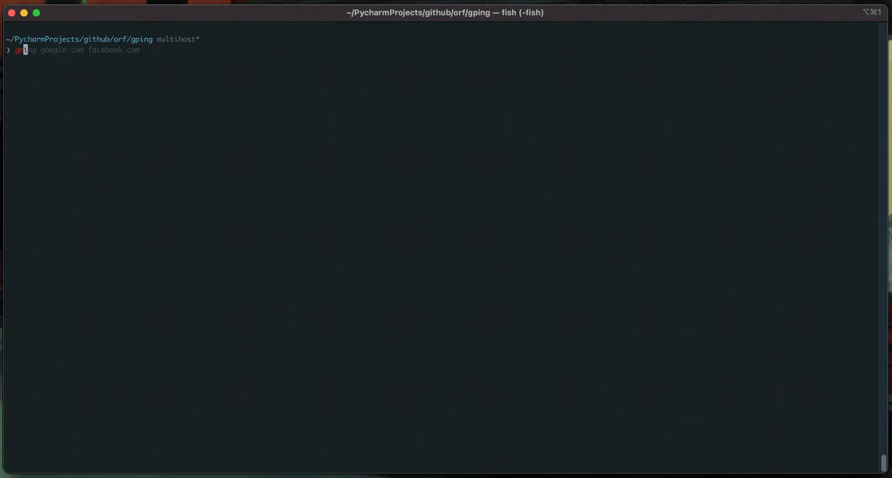</a> | [gping](references/47-gping/README.md) · [official product](https://github.com/orf/gping) | owner-published media, 2 named gaps | Networking | split-terminal: Two side-by-side terminal work areas with shared command context. Panels: toolbar/header (top); status/action bar (bottom); primary terminal pane (leading); secondary terminal pane (trailing). Density: low; confidence: medium. | Study scrolling latency graphs, multiple-host status, color and symbol encoding, and graceful presentation in narrow terminals. |
| 48 | <a href="https://github.com/pythops/impala">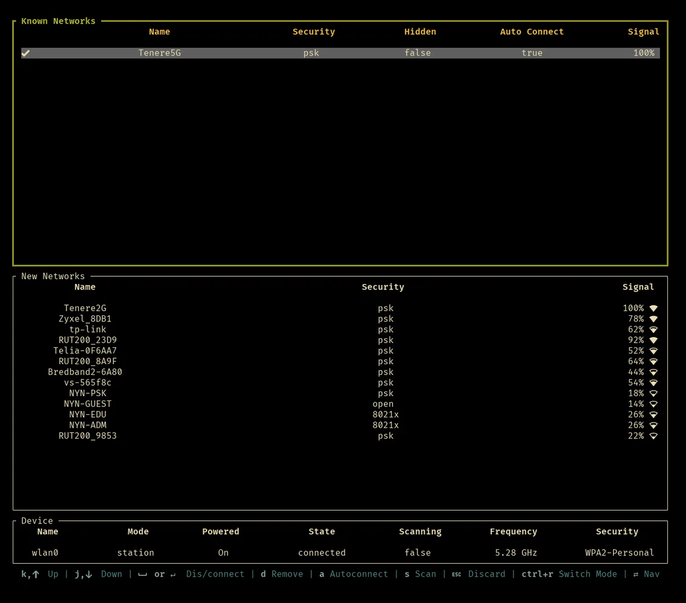</a> | [Impala](references/48-impala/README.md) · [official product](https://github.com/pythops/impala) | owner-published media, 2 named gaps | Networking | split-terminal: Two side-by-side terminal work areas with shared command context. Panels: toolbar/header (top); status/action bar (bottom); primary terminal pane (leading); secondary terminal pane (trailing). Density: low; confidence: medium. | Study Wi-Fi network scanning, sortable selection lists, connection dialogs, status feedback, and keyboard-only device management. |
| 49 | <a href="https://github.com/kdheepak/taskwarrior-tui">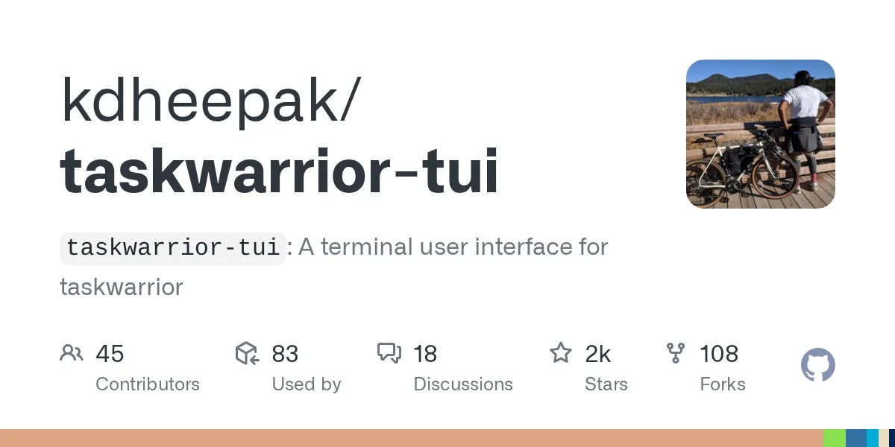</a> | [taskwarrior-tui](references/49-taskwarrior-tui/README.md) · [official product](https://github.com/kdheepak/taskwarrior-tui) | owner-published media, 2 named gaps | Tasks | split-terminal: Two side-by-side terminal work areas with shared command context. Panels: status/action bar (bottom); primary terminal pane (leading); secondary terminal pane (trailing). Density: low; confidence: medium. | Study task-table filtering, detail panes, selection and modification shortcuts, context changes, and persistent synchronization status. |
| 50 | <a href="https://github.com/kraanzu/dooit">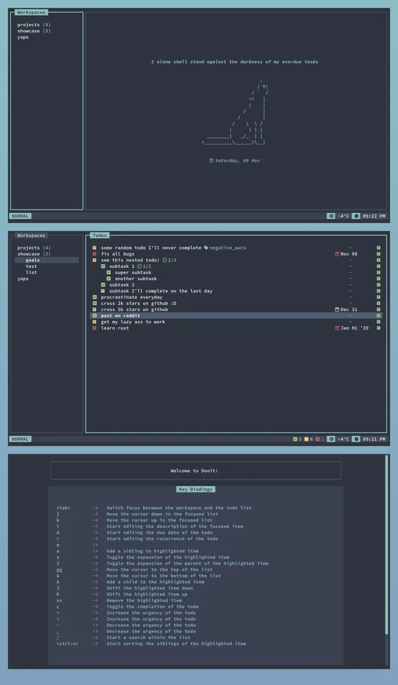</a> | [Dooit](references/50-dooit/README.md) · [official product](https://github.com/kraanzu/dooit) | product run here, 2 named gaps | Tasks | split-terminal: Two side-by-side terminal work areas with shared command context. Panels: toolbar/header (top); primary terminal pane (leading); secondary terminal pane (trailing). Density: low; confidence: medium. | Study nested task lists, workspace panels, keyboard-based editing and reordering, search, and visible completion state. |

Normalized panel bounds, detected separators, image dimensions, source-image URLs, hashes, and analysis confidence are recorded in [`sources.json`](sources.json). Media kinds, measured durations, provenance classes, and per-record gaps are in [`references.json`](references.json).

Attribution and product ownership remain with the linked source.
