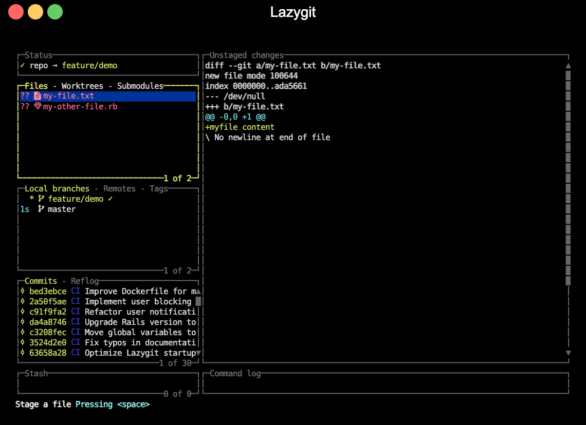
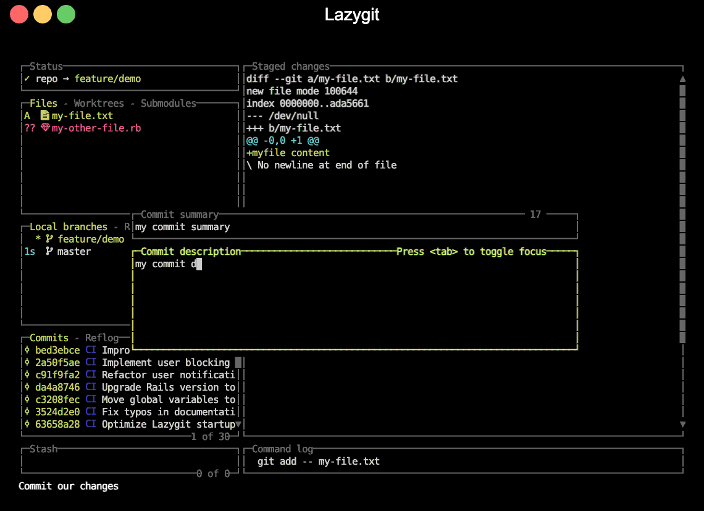
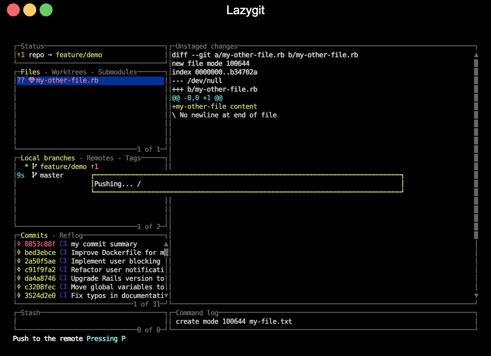

# 01 — lazygit

**Product:** [https://github.com/jesseduffield/lazygit](https://github.com/jesseduffield/lazygit)  
**Evidence:** partial — official upstream motion, measured 2026-08-19; the one remaining gap is that accessibility was never measured against the running product  
**Captured:** 2026-08-16  
**Category:** Git and developer workflows

## Play the authentic motion

Open [`media/product-motion.gif`](media/product-motion.gif) in a local player.

This is authentic product motion, not an animation synthesized from the catalog still. Source: [https://raw.githubusercontent.com/jesseduffield/lazygit/assets/demo/commit_and_push-compressed.gif](https://raw.githubusercontent.com/jesseduffield/lazygit/assets/demo/commit_and_push-compressed.gif). Local SHA-256: `59b44d2dc9327f674603f53f5eda892b6f82defa070807a45dfa2c41a85a13c6`. Duration: 14.150s; frames/output events: 67; bytes: 472611; dimensions: 1140 × 828.

## Key states

### Files panel focused, `?? my-file.txt` selected, footer reads "Stage a file"

Frame of `media/product-motion.gif` at 0.5s (mean abs diff 0.0391/255); 1140×828, 40193 bytes, SHA-256 `ec6eb2ed1d669c4685c65b024a7023aef49af9834e3de7d625ecfc7cb3c640c4`. The blue selection bar sits on `?? my-file.txt`, the right pane is titled "Unstaged changes" and shows that file's diff, and Commits reads "1 of 30".

### Commit editor open, summary filled, description being typed

Frame of `media/product-motion.gif` at 6.5s (mean abs diff 0.043/255); 1140×828, 42008 bytes, SHA-256 `5ea40de9630b441648eb9796c0f879d1c91a35b087ccb354ea9bad67e3d0231c`. The file is now staged (`A my-file.txt`, right pane titled "Staged changes"), the "Commit summary" box holds `my commit summary`, the "Commit description" box is mid-typing, and the Command log already shows `git add -- my-file.txt`.

### "Pushing… /" progress panel, ↑1 ahead marker, new commit on top

Frame of `media/product-motion.gif` at 9s (mean abs diff 0.0078/255); 1140×828, 39677 bytes, SHA-256 `33b83423ef88abc4330ea5756181649188ca89748790166b357d1feb604ab7a6`. A bordered panel reads `Pushing... /`, Status shows `↑1`, Local branches shows `feature/demo ↑1`, and Commits now reads "1 of 31" with `0853c88f my commit summary` on top.

## First-success journey

**Actor:** Keyboard user evaluating the real terminal application  
**Goal:** Reach the first inspectable git and developer workflows result in lazygit, discover controls, and recover from a blocked or transient state  

| State | User action | System response | Evidence |
|---:|---|---|---|
| 1 | Launch lazygit with the recorded prerequisite/fixture | The application claims the terminal and begins its first render | official upstream motion at the opening segment |
| 2 | Wait for the first stable product surface | Primary content, an onboarding gate, or an explicit prerequisite state becomes readable | official upstream motion at the first retained key state |
| 3 | Move the active selection within the primary list or table | The highlight/cursor moves and selection-coupled content repaints | official upstream motion in the early-to-middle segment |
| 4 | Change panel/context or inspect the selected item | A secondary region, detail, child view, or contextual status becomes active | official upstream motion around the midpoint key state |
| 5 | Read the persistent key map or invoke the recorded help/discovery control | The visible footer, function-key map, prompt, or help layer exposes the next supported controls | official upstream motion in the middle-to-late segment |
| 6 | Cancel/backtrack from the transient or nested state | The prior stable context returns with selection continuity where supported | official upstream motion before the final key state |
| 7 | Finish the first inspection and leave or settle on the meaningful result | The result remains inspectable or terminal control is cleanly restored | official upstream motion at the final retained state |

### Failure and recovery

- Launch without a required product-specific prerequisite or reach an unavailable/empty selection.
- Observe the explicit terminal error, empty state, disabled action, or unchanged boundary selection.
- Do not substitute a marketing claim for that recorded failure state.
- Recovery: Use the recorded help/footer/discovery affordance to identify the supported action.
- Recovery: Restore the named account, daemon, cluster, device, file, database, or selection prerequisite.
- Recovery: Relaunch or backtrack and repeat the successful navigation shown in the motion evidence.

## Interaction map

| Interaction | Trigger | Response / feedback | Cancellation | Failure → recovery |
|---|---|---|---|---|
| launch | Invoke the product in the isolated fixture | The terminal enters the product surface or its first-run gate; Full-screen redraw or explicit startup status | Quit key or terminal interrupt | Missing service, account, device, or configuration is surfaced in-terminal → Open help, supply the prerequisite, and relaunch |
| move selection | j or Down | Selection advances by one visible item; Highlight/cursor relocates without leaving the view | k or Up reverses the move | At a boundary the selection remains in place → Reverse direction or change region |
| change focus | Tab or the product panel key | Keyboard focus moves to another region; Active border, title, cursor, or highlight changes | Shift-Tab, Tab cycle, or Escape | Unavailable regions do not accept focus → Return to the populated primary region |
| confirm or inspect | Enter | The selected item opens, expands, or becomes the active detail; A detail, child view, dialog, or status repaint appears | Escape, h, or the parent-navigation key | An empty or unavailable selection produces no destructive action → Choose an available item and confirm again |
| open help | ? or the product help key | Shortcut discovery appears or help is requested; Help overlay, footer expansion, or help text | Escape or the same help key | Context may not bind ? → Use the persistent footer/function-key map |
| cancel/backtrack | Escape, h, or Back | The transient layer closes or parent context returns; Previous selection and primary surface reappear | Not applicable; this is the cancellation path | Root view cannot backtrack further → Resume navigation from the retained selection |
| recover from prerequisite failure | Read the visible error/empty/loading state and invoke help or relaunch after supplying the prerequisite | The product exposes its supported next action rather than silently proceeding; Explicit status text followed by a stable interactive surface | Quit leaves the external system unchanged | Account, daemon, cluster, device, or data remains unavailable → Restore that named prerequisite and repeat launch |
| quit | q, F10, or the product quit command | The full-screen surface closes; Terminal control and cursor are restored | Remain in the surface by not confirming a quit dialog | A modal may consume the first quit key → Dismiss the modal, then use the documented quit command |

## Motion analysis

- **Trigger:** a keyboard sequence over the running surface, readable from the footer's key echo — space to stage the selected file, `c` to open the commit editor, `<tab>` to move from summary to description, Enter to commit, then `P` to push.
- **Start state:** at 0.5s the Files panel is focused with `?? my-file.txt` selected and its diff in the "Unstaged changes" pane; Commits reads "1 of 30" and Status carries no ahead marker.
- **End state:** at 11s the file is committed and pushed — Commits reads "1 of 31" with `0853c88f my commit summary` on top, the Command log's last line is `bed3ebc..0853c88  feature/demo -> feature/demo`, and by 12s the surface has been quit and the terminal is empty.
- **Continuity:** panels never move or resize; each step repaints in place. Staging flips the file marker `??` → `A` and retitles the right pane "Unstaged changes" → "Staged changes" with its diff text unchanged, and the commit editor opens as two bordered boxes over the middle of the layout.
- **Timing class:** sub-second.
- **Interruption/reversal:** not shown — the recording contains no cancel, undo or reverse step, so this stays an open gap rather than a claim.
- **Feedback:** blue selection bar, yellow-green active border on the focused panel and the commit editor, the footer's action name plus echoed key, the `↑1` ahead marker, the `Pushing... -` / `Pushing... /` spinner panel, and one appended Command log line per git command.
- **Reduced motion / nonanimated equivalent:** the only animation is the one-character push spinner; every other change is an instant text repaint that persists, and the push is also reported statically by `↑1` and the Command log line. No product-level reduced-motion preference appears in the recording.

## Accessibility

**Observed**
- Every region carries its name as text in its border — "Status", "Files - Worktrees - Submodules", "Local branches - Remotes - Tags", "Commits - Reflog", "Stash", "Unstaged changes"/"Staged changes", "Command log" — so a region is identifiable without colour.
- The footer names the action of the focused context in words and echoes the key pressed: "Stage a file" at 0.5s, "Commit our changes  Pressing <tab>" at 4s, "Push to the remote  Pressing P" at 9s.
- File state is a letter code beside the filename (`A` added, `??` untracked) and list position is printed in the panel border ("1 of 2", "1 of 30", "1 of 31"), so neither depends on colour alone.
- Measured on `state-1.png`: selected-row text `rgb(255,153,153)` on the blue selection bar `rgb(0,51,153)` is 5.3:1, the footer's white on black is 21:1, and the diff pane's cyan `rgb(153,255,255)` on black is 18.1:1.
- Long-running work is reported as text plus a spinning character in a bordered panel, and the Command log retains the git command behind each change.

**Unknown**
- Screen-reader behavior was not exposed by the upstream recording.
- The colours measured above belong to the recording's terminal theme, not to an arbitrary user terminal.
- No product-level reduced-motion setting appears anywhere in the recording.
- Mouse parity, switch-control mappings, and nonvisual ordering are not visible in the GIF.

## Provenance

- Upstream owner: `jesseduffield`
- Source/capture URL: https://raw.githubusercontent.com/jesseduffield/lazygit/assets/demo/commit_and_push-compressed.gif
- Capture method: Official upstream product/documentation recording downloaded locally without visual alteration
- Structured record: [`reference.json`](reference.json)
