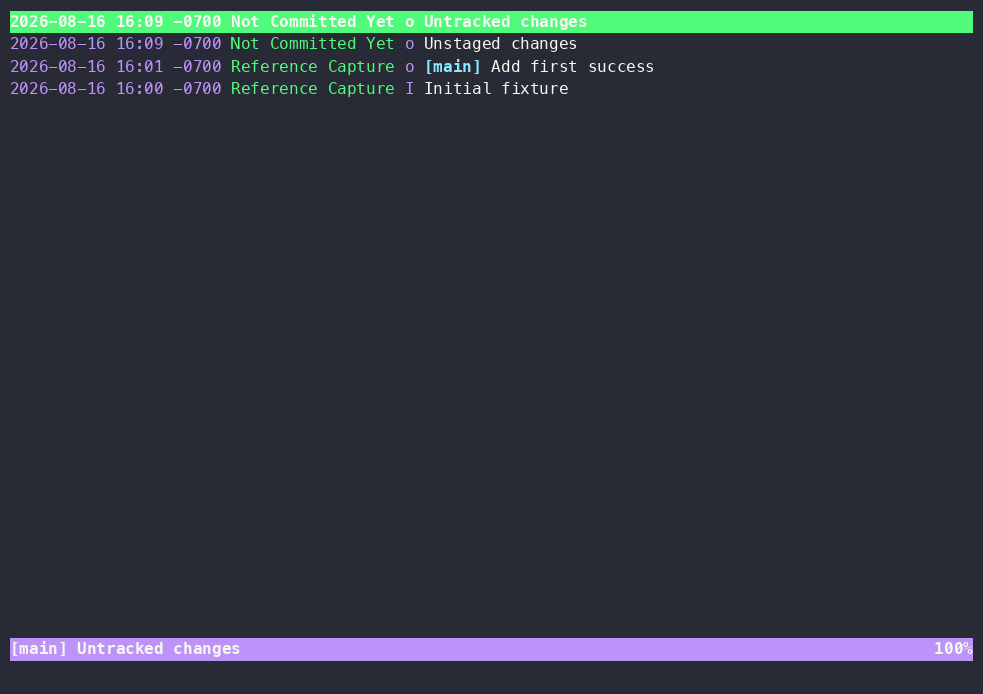
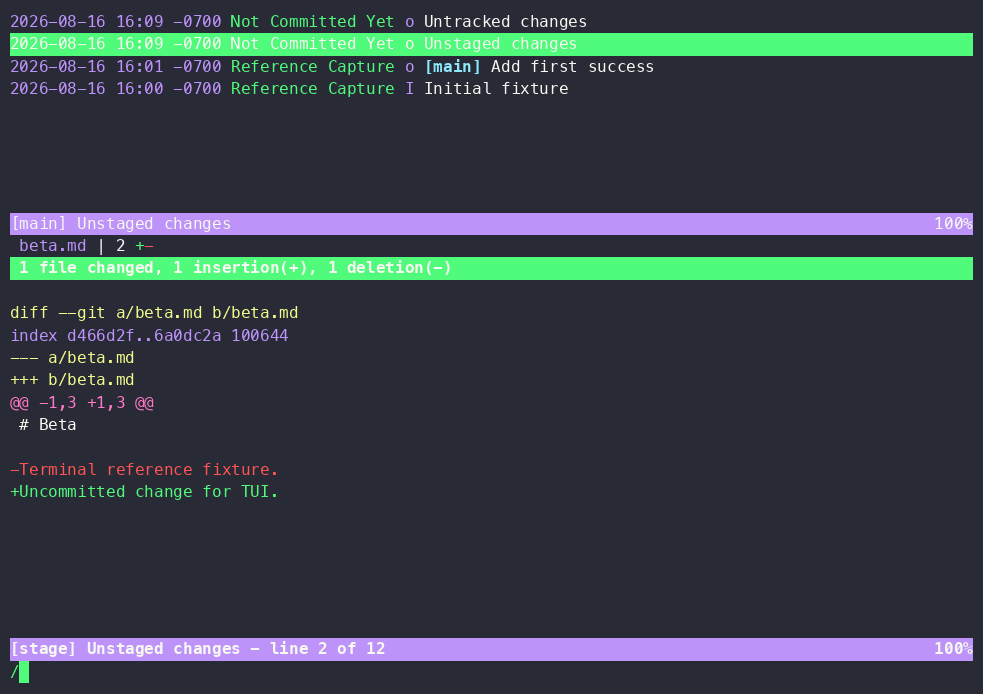
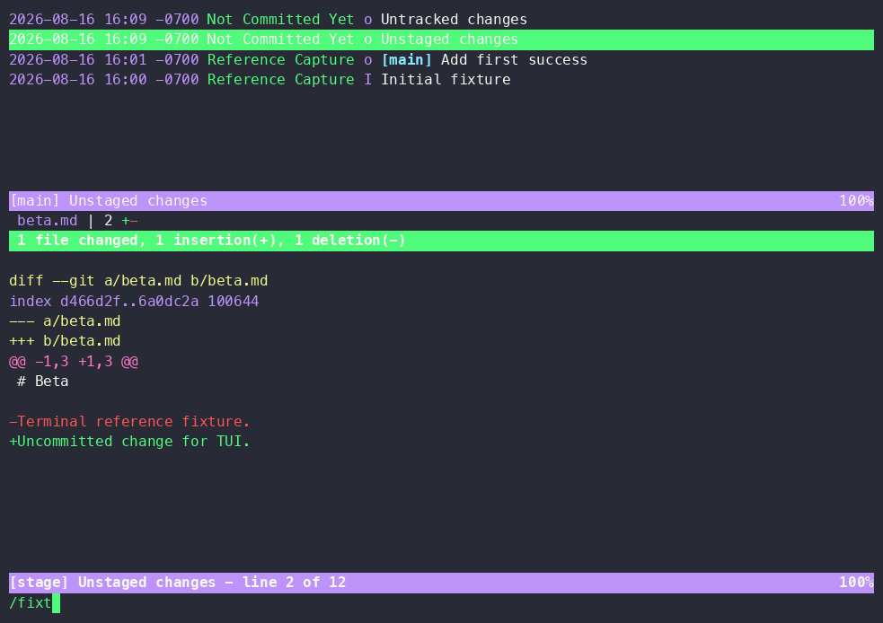

# 02 — Tig

**Product:** [https://github.com/jonas/tig](https://github.com/jonas/tig)  
**Evidence:** partial — real isolated product recording, measured 2026-08-19; the remaining gaps are that accessibility was never measured against the running product and that the cast shows no interruption or reversal  
**Captured:** 2026-08-16  
**Category:** Git and developer workflows

## Play the authentic motion

`agg media/product-motion.cast ~/.stado/work/tui-examples/02-tig/render.gif` then play that GIF.

This is authentic product motion, not an animation synthesized from the catalog still. Source: [https://github.com/jonas/tig](https://github.com/jonas/tig). Local SHA-256: `708622ba9ace3a9b0555c1fa6e428b6e11b93583ec8b1a3b5d2de1c463b77cfb`. Duration: 7.493s; recorded events: 29; bytes: 3621; terminal: 100 × 30 (cast header). Command recorded in the header: `tig --all`.

## Key states

### Main log view, top row "Untracked changes" selected

Rendering of `media/product-motion.cast` at 0.1s: the cast was re-rendered with `agg` (default theme, font size 16) to a 983×694 GIF and this PNG matched the 0.1s frame with mean abs diff 0.003/255 over a 64×64 grayscale comparison. 983×694, 27850 bytes, SHA-256 `80e97b7434c875324d2fa1e34511755aa7fd6edbdd76a13f86822f6ea4357bec`. Four log rows are listed; the status bar reads `[main] Untracked changes` with `100%` at the right edge.

### Split view: "Unstaged changes" selected, beta.md diff below, search prompt open

Rendering of `media/product-motion.cast` at 3.6s (same `agg` re-render, mean abs diff 0.006/255). 983×694, 46543 bytes, SHA-256 `cc3ffb43b93751de17895bb382b953e97594381971a494e7ef4fd5caf9022055`. The stage pane shows `beta.md | 2 +-`, `1 file changed, 1 insertion(+), 1 deletion(-)` and the diff of `beta.md`; the status bar reads `[stage] Unstaged changes - line 2 of 12`, and `/` sits on the last line.

### Search prompt filled with "/fixt"

Rendering of `media/product-motion.cast` at 6.7s (same `agg` re-render, mean abs diff 0.008/255). 983×694, 46792 bytes, SHA-256 `58026c9d7edf8e898e29e581437f3f587bd288d57004fb67220278e4e384eb8a`. The typed query `/fixt` is echoed on the last line beside a block cursor while the diff and the `line 2 of 12` status bar stay visible behind it.

## First-success journey

**Actor:** Keyboard user evaluating the real terminal application  
**Goal:** Reach the first inspectable git and developer workflows result in Tig, discover controls, and recover from a blocked or transient state  

| State | User action | System response | Evidence |
|---:|---|---|---|
| 1 | Launch Tig with the recorded prerequisite/fixture | The application claims the terminal and begins its first render | isolated real-program terminal cast at the opening segment |
| 2 | Wait for the first stable product surface | Primary content, an onboarding gate, or an explicit prerequisite state becomes readable | isolated real-program terminal cast at the first retained key state |
| 3 | Move the active selection within the primary list or table | The highlight/cursor moves and selection-coupled content repaints | isolated real-program terminal cast in the early-to-middle segment |
| 4 | Change panel/context or inspect the selected item | A secondary region, detail, child view, or contextual status becomes active | isolated real-program terminal cast around the midpoint key state |
| 5 | Read the persistent key map or invoke the recorded help/discovery control | The visible footer, function-key map, prompt, or help layer exposes the next supported controls | isolated real-program terminal cast in the middle-to-late segment |
| 6 | Cancel/backtrack from the transient or nested state | The prior stable context returns with selection continuity where supported | isolated real-program terminal cast before the final key state |
| 7 | Finish the first inspection and leave or settle on the meaningful result | The result remains inspectable or terminal control is cleanly restored | isolated real-program terminal cast at the final retained state |

### Failure and recovery

- Launch without a required product-specific prerequisite or reach an unavailable/empty selection.
- Observe the explicit terminal error, empty state, disabled action, or unchanged boundary selection.
- Do not substitute a marketing claim for that recorded failure state.
- Recovery: Use the recorded help/footer/discovery affordance to identify the supported action.
- Recovery: Restore the named account, daemon, cluster, device, file, database, or selection prerequisite.
- Recovery: Relaunch or backtrack and repeat the successful navigation shown in the motion evidence.

## Interaction map

| Interaction | Trigger | Response / feedback | Cancellation | Failure → recovery |
|---|---|---|---|---|
| launch | Invoke the product in the isolated fixture | The terminal enters the product surface or its first-run gate; Full-screen redraw or explicit startup status | Quit key or terminal interrupt | Missing service, account, device, or configuration is surfaced in-terminal → Open help, supply the prerequisite, and relaunch |
| move selection | j or Down | Selection advances by one visible item; Highlight/cursor relocates without leaving the view | k or Up reverses the move | At a boundary the selection remains in place → Reverse direction or change region |
| change focus | Tab or the product panel key | Keyboard focus moves to another region; Active border, title, cursor, or highlight changes | Shift-Tab, Tab cycle, or Escape | Unavailable regions do not accept focus → Return to the populated primary region |
| confirm or inspect | Enter | The selected item opens, expands, or becomes the active detail; A detail, child view, dialog, or status repaint appears | Escape, h, or the parent-navigation key | An empty or unavailable selection produces no destructive action → Choose an available item and confirm again |
| open help | ? or the product help key | Shortcut discovery appears or help is requested; Help overlay, footer expansion, or help text | Escape or the same help key | Context may not bind ? → Use the persistent footer/function-key map |
| cancel/backtrack | Escape, h, or Back | The transient layer closes or parent context returns; Previous selection and primary surface reappear | Not applicable; this is the cancellation path | Root view cannot backtrack further → Resume navigation from the retained selection |
| recover from prerequisite failure | Read the visible error/empty/loading state and invoke help or relaunch after supplying the prerequisite | The product exposes its supported next action rather than silently proceeding; Explicit status text followed by a stable interactive surface | Quit leaves the external system unchanged | Account, daemon, cluster, device, or data remains unavailable → Restore that named prerequisite and repeat launch |
| quit | q, F10, or the product quit command | The full-screen surface closes; Terminal control and cursor are restored | Remain in the surface by not confirming a quit dialog | A modal may consume the first quit key → Dismiss the modal, then use the documented quit command |

## Motion analysis

- **Trigger:** the cast header records the command `tig --all`; the recorded keystrokes are `j` at 1.211s, Enter at 2.019s, `j` at 2.778s, then `/`, `f`, `i`, `x`, `t`, `u` typed between 3.585s and 7.493s.
- **Start state:** at 0.096s the screen is painted in one pass with the four-row all-refs log and the top "Untracked changes" row selected.
- **End state:** at 7.493s the search prompt on the last line holds `/fixtu` over the split log-and-diff view; the cast ends before the search is submitted.
- **Continuity:** each keystroke is answered inside the same event batch by a partial repaint — the green selection bar moves one row and the status line is rewritten. Panes appear in place: Enter opens the stage pane with the `beta.md` diff below the log, which keeps its rows and its selection.
- **Timing class:** instant — every output event carries the same timestamp as the input that caused it, to within 2 ms.
- **Interruption/reversal:** not shown — the cast contains no Escape, undo or back keystroke, so this stays an open gap rather than a claim.
- **Feedback:** full-width green bar on the selected row, purple status bar naming the view and position (`[main] Untracked changes 100%`, `[stage] Unstaged changes - line 2 of 12`), and echoed characters with a block cursor on the search line.
- **Reduced motion / nonanimated equivalent:** no animation is used — every change is an instant text repaint that persists, so the three retained PNGs carry the same information as replaying the cast. No product-level reduced-motion setting appears in the recording.

## Accessibility

**Observed**
- Every log row prints its date, author and subject as text, and the selected row is marked both by a full-width green bar and by the status bar repeating that row's title (`[main] Untracked changes`), so the selection is not carried by colour alone.
- Position is written out rather than shown: the status bar in `state-3.png` reads `[stage] Unstaged changes - line 2 of 12` with `100%` at the right edge.
- The search prompt echoes the typed characters on the last line (`/fixt`) beside a visible block cursor, so the input mode and its content are both readable in one still frame.
- Measured on the retained frames: dark row text `rgb(40,42,54)` on the green selection bar `rgb(80,250,123)` is 10.4:1, and on the purple status bar `rgb(189,147,249)` it is 5.9:1 — both above 4.5:1, though this palette is the `agg` renderer's default rather than the operator's terminal.

**Unknown**
- Screen-reader behavior was not exposed by the terminal capture.
- The colours measured above are the renderer's defaults; the product's own contrast depends on the user's terminal theme, which the cast does not record.
- Behavior under user-defined reduced-motion settings is not documented in the observed evidence.
- Mouse parity, switch-control mappings, and nonvisual ordering are not visible in the cast.

## Provenance

- Upstream owner: `jonas`
- Source/capture URL: https://github.com/jonas/tig
- Capture method: Real installed product recorded through a pseudo-terminal on macOS 25.4.0 arm64 in an isolated temporary HOME/XDG environment with deterministic Git, filesystem, SQLite, Maildir, notmuch, or MPD fixtures as applicable; no still-image animation or generated product frames
- Structured record: [`reference.json`](reference.json)
