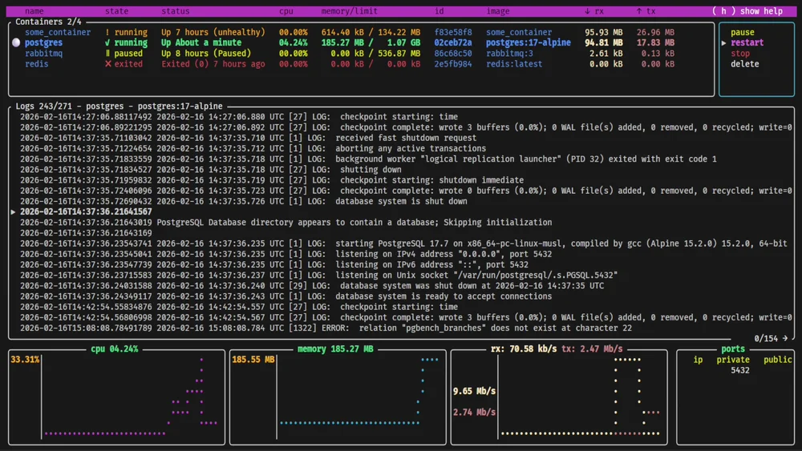
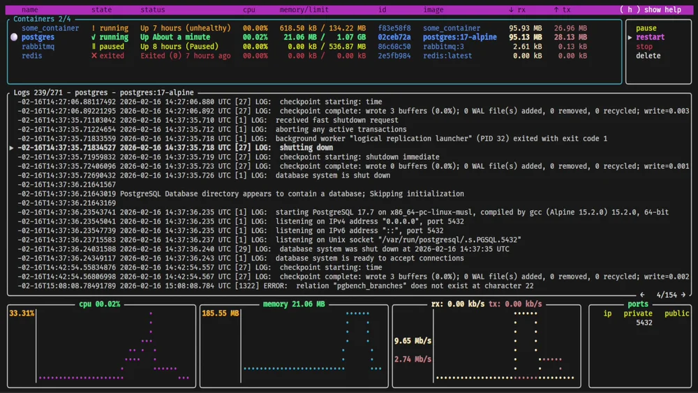
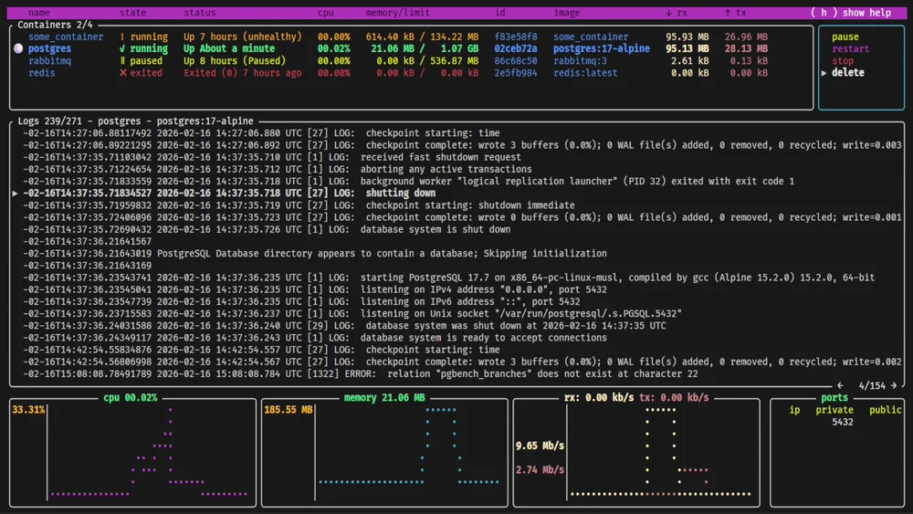

# 10 — Oxker

**Product:** [https://github.com/mrjackwills/oxker](https://github.com/mrjackwills/oxker)  
**Evidence:** complete — official upstream motion  
**Captured:** 2026-08-16  
**Category:** Containers

## Play the authentic motion

Open [`media/product-motion.webp`](media/product-motion.webp) in a local player.

This is authentic product motion, not an animation synthesized from the catalog still. Source: [https://raw.githubusercontent.com/mrjackwills/oxker/main/.github/demo_01.webp](https://raw.githubusercontent.com/mrjackwills/oxker/main/.github/demo_01.webp). Local SHA-256: `57e10ee5a7d92b3db6e80c09a70079ec29cb4a09b88ad753f0bf34e9a4b335cc`. Duration: 4.600s; frames/output events: 46; bytes: 4303990; dimensions: 1000 × 563.

## Key states

### first stable surface

Derived directly from `media/product-motion.webp`; 1000×563, 600073 bytes, SHA-256 `4f8bbd80a900f7c1e7689123de1f884b7c7c46a20cd9f8ef08f5fc378ef8c160`.

### selection or detail transition

Derived directly from `media/product-motion.webp`; 1000×563, 586094 bytes, SHA-256 `0f40d3c91cbe7d3a25f57d42f0f9bd5acf6463949be9bb17d98a6a6096f71e5c`.

### help, recovery, or completion

Derived directly from `media/product-motion.webp`; 1000×563, 585637 bytes, SHA-256 `7caba0c5e049e0f47b7ca593c4a70bfa5426e68c84c5d576c43f55c3ec96812b`.

## First-success journey

**Actor:** Keyboard user evaluating the real terminal application  
**Goal:** Reach the first inspectable containers result in Oxker, discover controls, and recover from a blocked or transient state  

| State | User action | System response | Evidence |
|---:|---|---|---|
| 1 | Launch Oxker with the recorded prerequisite/fixture | The application claims the terminal and begins its first render | official upstream motion at the opening segment |
| 2 | Wait for the first stable product surface | Primary content, an onboarding gate, or an explicit prerequisite state becomes readable | official upstream motion at the first retained key state |
| 3 | Move the active selection within the primary list or table | The highlight/cursor moves and selection-coupled content repaints | official upstream motion in the early-to-middle segment |
| 4 | Change panel/context or inspect the selected item | A secondary region, detail, child view, or contextual status becomes active | official upstream motion around the midpoint key state |
| 5 | Read the persistent key map or invoke the recorded help/discovery control | The visible footer, function-key map, prompt, or help layer exposes the next supported controls | official upstream motion in the middle-to-late segment |
| 6 | Cancel/backtrack from the transient or nested state | The prior stable context returns with selection continuity where supported | official upstream motion before the final key state |
| 7 | Finish the first inspection and leave or settle on the meaningful result | The result remains inspectable or terminal control is cleanly restored | official upstream motion at the final retained state |

### Failure and recovery

- Launch without a required product-specific prerequisite or reach an unavailable/empty selection.
- Observe the explicit terminal error, empty state, disabled action, or unchanged boundary selection.
- Do not substitute a marketing claim for that recorded failure state.
- Recovery: Use the recorded help/footer/discovery affordance to identify the supported action.
- Recovery: Restore the named account, daemon, cluster, device, file, database, or selection prerequisite.
- Recovery: Relaunch or backtrack and repeat the successful navigation shown in the motion evidence.

## Interaction map

| Interaction | Trigger | Response / feedback | Cancellation | Failure → recovery |
|---|---|---|---|---|
| launch | Invoke the product in the isolated fixture | The terminal enters the product surface or its first-run gate; Full-screen redraw or explicit startup status | Quit key or terminal interrupt | Missing service, account, device, or configuration is surfaced in-terminal → Open help, supply the prerequisite, and relaunch |
| move selection | j or Down | Selection advances by one visible item; Highlight/cursor relocates without leaving the view | k or Up reverses the move | At a boundary the selection remains in place → Reverse direction or change region |
| change focus | Tab or the product panel key | Keyboard focus moves to another region; Active border, title, cursor, or highlight changes | Shift-Tab, Tab cycle, or Escape | Unavailable regions do not accept focus → Return to the populated primary region |
| confirm or inspect | Enter | The selected item opens, expands, or becomes the active detail; A detail, child view, dialog, or status repaint appears | Escape, h, or the parent-navigation key | An empty or unavailable selection produces no destructive action → Choose an available item and confirm again |
| open help | ? or the product help key | Shortcut discovery appears or help is requested; Help overlay, footer expansion, or help text | Escape or the same help key | Context may not bind ? → Use the persistent footer/function-key map |
| cancel/backtrack | Escape, h, or Back | The transient layer closes or parent context returns; Previous selection and primary surface reappear | Not applicable; this is the cancellation path | Root view cannot backtrack further → Resume navigation from the retained selection |
| recover from prerequisite failure | Read the visible error/empty/loading state and invoke help or relaunch after supplying the prerequisite | The product exposes its supported next action rather than silently proceeding; Explicit status text followed by a stable interactive surface | Quit leaves the external system unchanged | Account, daemon, cluster, device, or data remains unavailable → Restore that named prerequisite and repeat launch |
| quit | q, F10, or the product quit command | The full-screen surface closes; Terminal control and cursor are restored | Remain in the surface by not confirming a quit dialog | A modal may consume the first quit key → Dismiss the modal, then use the documented quit command |

## Motion analysis

- **Trigger:** launch followed by the recorded keyboard/control sequence.
- **Start/end:** terminal acquisition or upstream launch → first inspectable result and cleanly settled/returned terminal.
- **Continuity:** state changes are direct terminal repaints; selection continuity is spatial rather than animated easing.
- **Timing class:** immediate input feedback plus asynchronous refresh/service latency where the product owns live data.
- **Interruption/reversal:** Escape/back/parent navigation interrupts transient states; reverse navigation restores an earlier selection where supported.
- **Feedback:** cursor, highlight, active border, status line, table/detail repaint, and explicit errors.
- **Reduced motion/nonanimated equivalent:** terminal text and retained state PNGs provide pausable equivalents; a product-level reduced-motion preference was not observed.

## Accessibility

**Observed**
- The observed flow is operable from the keyboard.
- Selection/focus is communicated by a cursor, highlight, active border, title, or position change in the retained states.
- Status and errors are rendered as terminal text rather than motion alone.
- The terminal cast/recording can be paused and replayed independently of the live product.

**Unknown**
- Screen-reader behavior was not exposed by the upstream recording or terminal capture.
- Contrast ratios and color-only distinctions were not instrumentally measured.
- Behavior under user-defined reduced-motion settings is not documented in the observed evidence.
- Mouse parity, switch-control mappings, and nonvisual ordering remain unverified unless visible in the source recording.

## Provenance

- Upstream owner: `mrjackwills`
- Source/capture URL: https://raw.githubusercontent.com/mrjackwills/oxker/main/.github/demo_01.webp
- Capture method: Official upstream product/documentation recording downloaded locally without visual alteration
- Structured record: [`reference.json`](reference.json)
