# Web app examples

Browser-based products with application-grade workflows.

Each entry pairs an attributed overview image and a measured panel anatomy with a per-product record: motion evidence, named states, an observed first-success journey, interaction and recovery behavior, accessibility observations, and provenance. Every number below is measured by `verify-reference-evidence.py`, and a record that is missing evidence says so in its own `evidence_gaps`.

**Examples:** 50  
**Images:** 50  
**Structural analyses:** 50  
**Records with no remaining gap:** 0  
**Records with named gaps:** 50 (100 gaps)  
**Motion provenance:** 50 owner-published media  
**Curated:** 2026-08-16  
**Visual source data:** [`sources.json`](sources.json)  
**Record index:** [`references.json`](references.json)  
**Cross-example synthesis:** [`full-reference.md`](full-reference.md)

| # | Reference image | Record | Motion evidence | Category | Interface structure | What to study |
|---:|---|---|---|---|---|---|
| 1 |  | [Slack](references/01-slack/README.md) · [official product](https://app.slack.com/client) | owner-published media, 2 named gaps | Communication and collaboration | sidebar-content-inspector: Leading navigation, central work area, and trailing detail inspector. Panels: toolbar/header (top); status/action bar (bottom); navigation/list sidebar (leading); detail/inspector (trailing); primary canvas/content (center). Density: high; confidence: medium. | Study the three-pane workspace, channel switching, unread markers, threaded replies, composer states, and responsive collapse behavior. |
| 2 |  | [Microsoft Teams](references/02-microsoft-teams/README.md) · [official product](https://teams.microsoft.com/) | owner-published media, 2 named gaps | Communication and collaboration | sidebar-content: Leading navigation or collection list beside a dominant content area. Panels: toolbar/header (top); navigation/list sidebar (leading); primary canvas/content (center). Density: low; confidence: high. | Study the app rail, team and channel hierarchy, meeting workflows, activity badges, and dense workspace navigation. |
| 3 |  | [Discord](references/03-discord/README.md) · [official product](https://discord.com/app) | owner-published media, 2 named gaps | Communication and collaboration | sidebar-content-inspector: Leading navigation, central work area, and trailing detail inspector. Panels: toolbar/header (top); status/action bar (bottom); navigation/list sidebar (leading); detail/inspector (trailing); data table/list (center). Density: low; confidence: medium. | Study the server rail, channel tree, presence indicators, voice-session state, and compact member-list information architecture. |
| 4 | <a href="https://miro.com/app/dashboard/">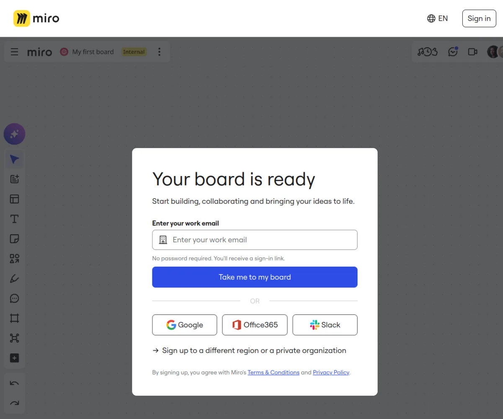</a> | [Miro](references/04-miro/README.md) · [official product](https://miro.com/app/dashboard/) | owner-published media, 2 named gaps | Visual collaboration | sidebar-content-inspector: Leading navigation, central work area, and trailing detail inspector. Panels: toolbar/header (top); status/action bar (bottom); navigation/list sidebar (leading); detail/inspector (trailing); primary canvas/content (center). Density: low; confidence: medium. | Study the dashboard-to-canvas transition, infinite-board controls, collaborator cursors, zoom states, and contextual creation toolbar. |
| 5 |  | [Notion](references/05-notion/README.md) · [official product](https://www.notion.so/) | owner-published media, 2 named gaps | Knowledge and productivity | sidebar-content-inspector: Leading navigation, central work area, and trailing detail inspector. Panels: toolbar/header (top); navigation/list sidebar (leading); detail/inspector (trailing); primary canvas/content (center). Density: low; confidence: medium. | Study the nested page sidebar, block insertion mechanics, slash-command workflow, breadcrumbs, and database view switching. |
| 6 | <a href="https://app.asana.com/">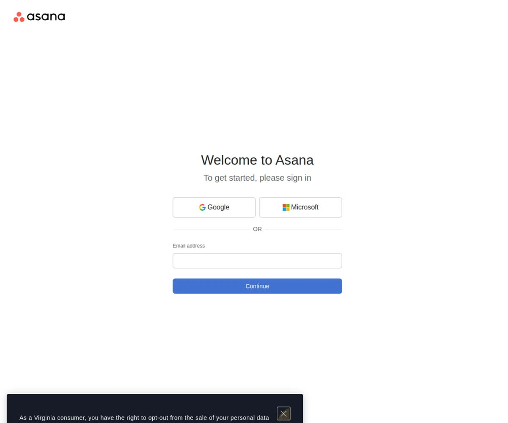</a> | [Asana](references/06-asana/README.md) · [official product](https://app.asana.com/) | owner-published media, 2 named gaps | Work management | sidebar-content-inspector: Leading navigation, central work area, and trailing detail inspector. Panels: toolbar/header (top); status/action bar (bottom); navigation/list sidebar (leading); detail/inspector (trailing); data table/list (center). Density: low; confidence: medium. | Study project list, board, and timeline views, task-detail drawers, assignee state, filters, and empty-project guidance. |
| 7 | <a href="https://trello.com/">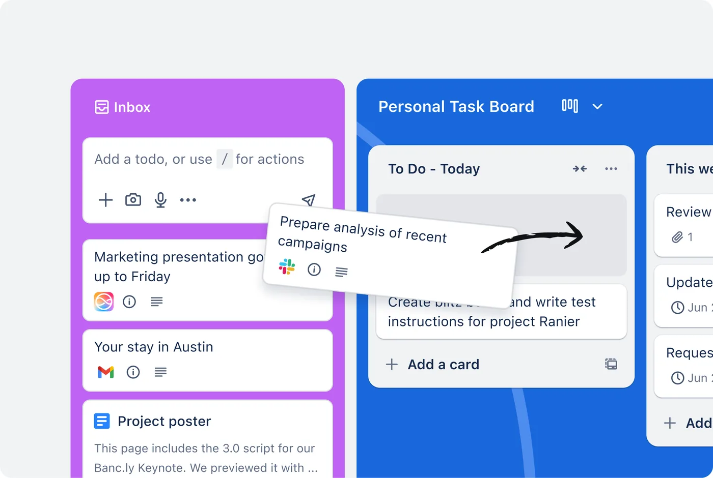</a> | [Trello](references/07-trello/README.md) · [official product](https://trello.com/) | owner-published media, 2 named gaps | Work management | sidebar-content: Leading navigation or collection list beside a dominant content area. Panels: toolbar/header (top); status/action bar (bottom); navigation/list sidebar (leading); data table/list (center). Density: low; confidence: high. | Study horizontal board navigation, drag-and-drop cards, inline card creation, list overflow, labels, and activity state. |
| 8 | <a href="https://linear.app/">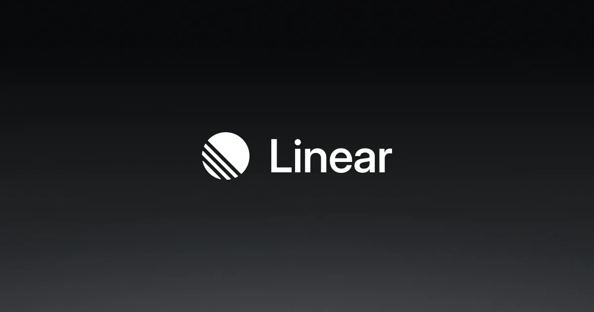</a> | [Linear](references/08-linear/README.md) · [official product](https://linear.app/) | owner-published media, 2 named gaps | Product development | sidebar-content-inspector: Leading navigation, central work area, and trailing detail inspector. Panels: toolbar/header (top); navigation/list sidebar (leading); detail/inspector (trailing); data table/list (center). Density: low; confidence: medium. | Study keyboard-first issue creation, command menus, list-to-detail transitions, status grouping, and optimistic interaction feedback. |
| 9 |  | [ClickUp](references/09-clickup/README.md) · [official product](https://app.clickup.com/) | owner-published media, 2 named gaps | Work management | sidebar-content: Leading navigation or collection list beside a dominant content area. Panels: toolbar/header (top); navigation/list sidebar (leading); primary canvas/content (center). Density: low; confidence: high. | Study hierarchical workspace navigation, configurable task views, custom fields, loading placeholders, and detail-panel workflows. |
| 10 | <a href="https://www.figma.com/files/">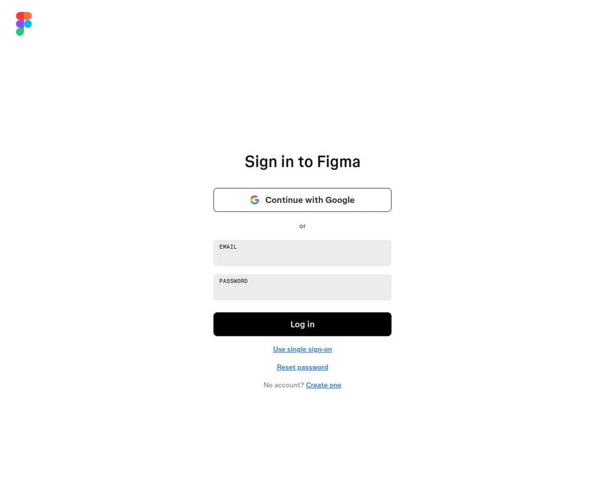</a> | [Figma](references/10-figma/README.md) · [official product](https://www.figma.com/files/) | owner-published media, 2 named gaps | Design and creation | sidebar-content-inspector: Leading navigation, central work area, and trailing detail inspector. Panels: toolbar/header (top); navigation/list sidebar (leading); detail/inspector (trailing); primary canvas/content (center). Density: low; confidence: high. | Study the file browser and editor shell, multiplayer presence, layer navigation, contextual properties, and canvas loading states. |
| 11 |  | [Canva](references/11-canva/README.md) · [official product](https://www.canva.com/) | owner-published media, 2 named gaps | Design and creation | sidebar-content-inspector: Leading navigation, central work area, and trailing detail inspector. Panels: toolbar/header (top); navigation/list sidebar (leading); detail/inspector (trailing); primary canvas/content (center). Density: low; confidence: medium. | Study template discovery, recent-design organization, editor-side panels, drag-and-drop creation, and export progress feedback. |
| 12 | <a href="https://webflow.com/dashboard">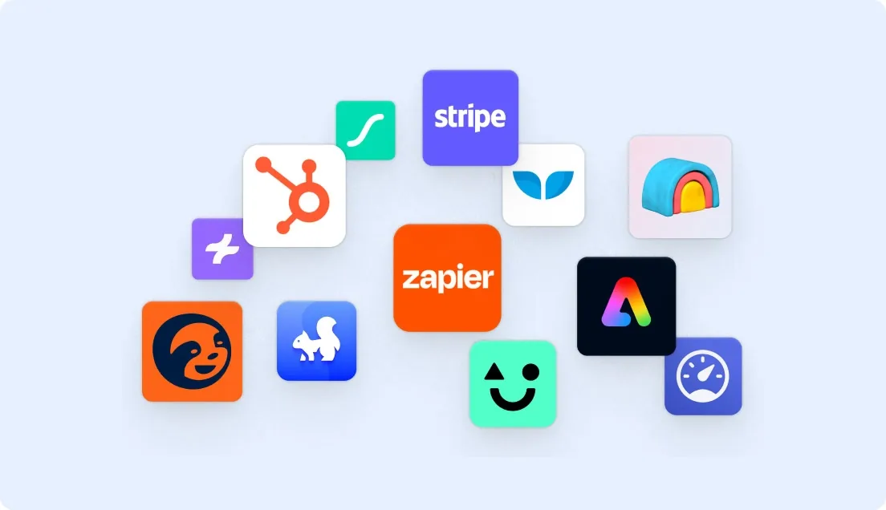</a> | [Webflow](references/12-webflow/README.md) · [official product](https://webflow.com/dashboard) | owner-published media, 2 named gaps | Web creation | sidebar-content-inspector: Leading navigation, central work area, and trailing detail inspector. Panels: toolbar/header (top); status/action bar (bottom); navigation/list sidebar (leading); detail/inspector (trailing); primary canvas/content (center). Density: low; confidence: medium. | Study site dashboard organization, visual editor panels, breakpoint controls, publishing workflow, and configuration error handling. |
| 13 | <a href="https://framer.com/projects/">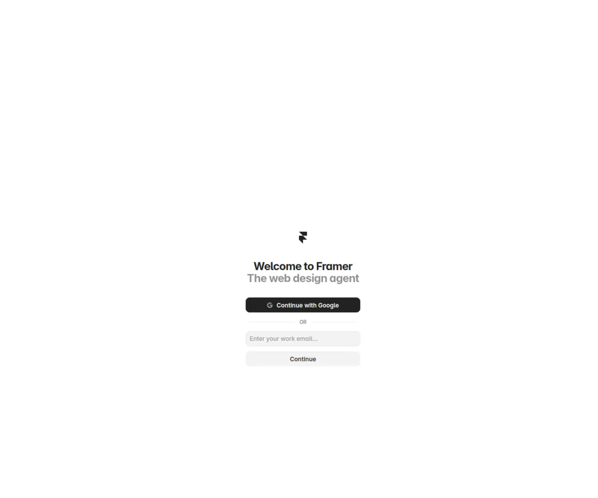</a> | [Framer](references/13-framer/README.md) · [official product](https://framer.com/projects/) | owner-published media, 2 named gaps | Web creation | content-inspector: Dominant content area with a trailing detail or property inspector. Panels: toolbar/header (top); detail/inspector (trailing); primary canvas/content (center). Density: low; confidence: high. | Study project browsing, canvas-to-properties workflow, responsive breakpoint editing, preview state, and publish-status communication. |
| 14 | <a href="https://express.adobe.com/">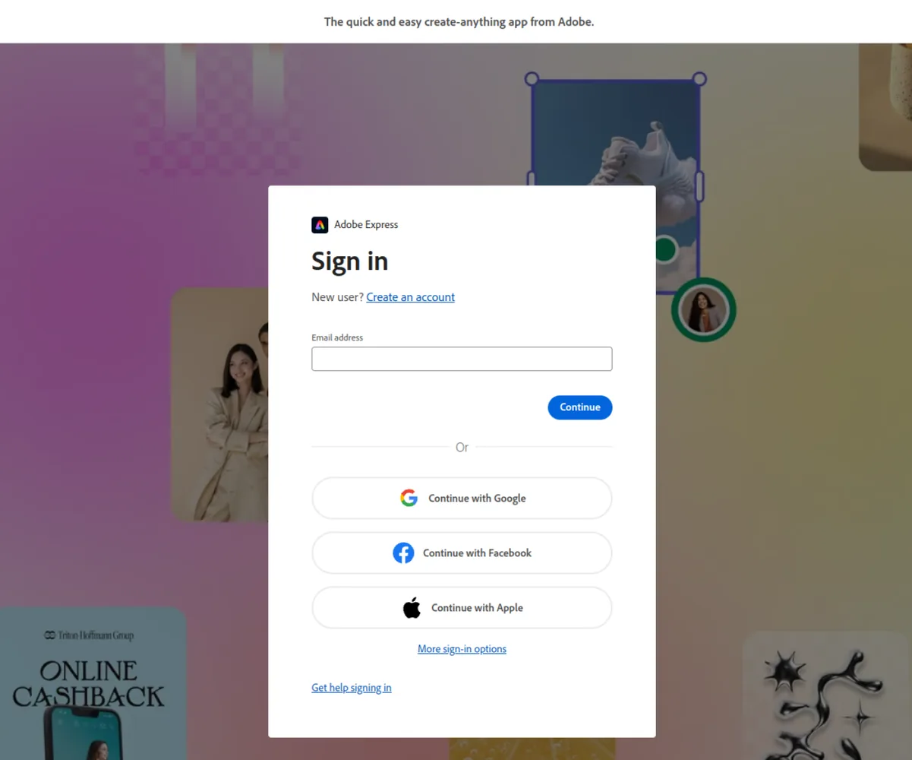</a> | [Adobe Express](references/14-adobe-express/README.md) · [official product](https://express.adobe.com/) | owner-published media, 2 named gaps | Content creation | sidebar-content-inspector: Leading navigation, central work area, and trailing detail inspector. Panels: toolbar/header (top); status/action bar (bottom); navigation/list sidebar (leading); detail/inspector (trailing); primary canvas/content (center). Density: low; confidence: medium. | Study task-oriented creation entry points, template filtering, editor tool grouping, asset upload states, and export workflow. |
| 15 | <a href="https://web.descript.com/">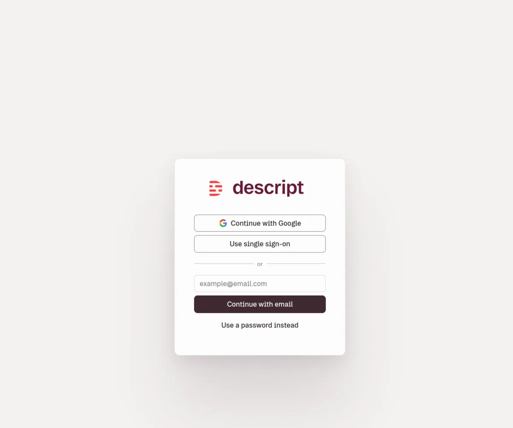</a> | [Descript](references/15-descript/README.md) · [official product](https://web.descript.com/) | owner-published media, 2 named gaps | Audio and video creation | sidebar-content-inspector: Leading navigation, central work area, and trailing detail inspector. Panels: toolbar/header (top); navigation/list sidebar (leading); detail/inspector (trailing); primary canvas/content (center). Density: low; confidence: medium. | Study project navigation, transcript-based editing, synchronized media state, processing feedback, and publishing or export controls. |
| 16 | <a href="https://github.com/">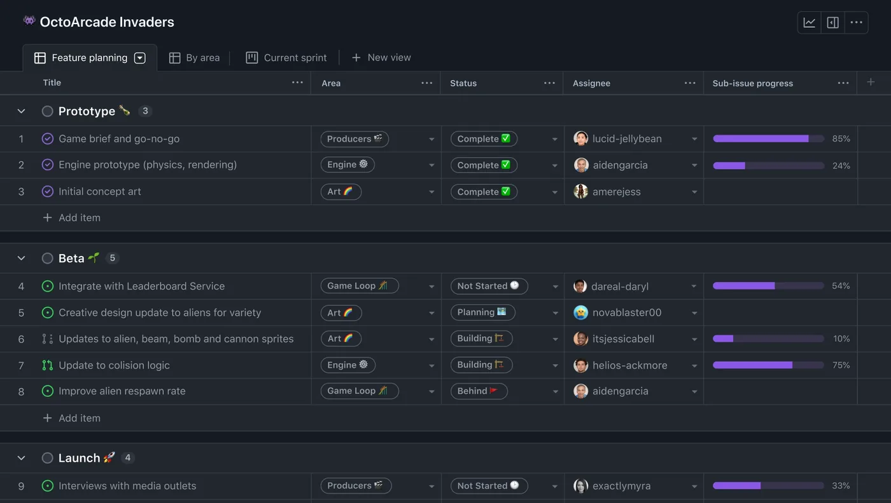</a> | [GitHub](references/16-github/README.md) · [official product](https://github.com/) | owner-published media, 2 named gaps | Developer tools | sidebar-content-inspector: Leading navigation, central work area, and trailing detail inspector. Panels: toolbar/header (top); navigation/list sidebar (leading); detail/inspector (trailing); primary canvas/content (center). Density: low; confidence: medium. | Study repository navigation, pull-request review threads, diff states, action-run status, permissions, and empty repository onboarding. |
| 17 | <a href="https://gitlab.com/dashboard/projects">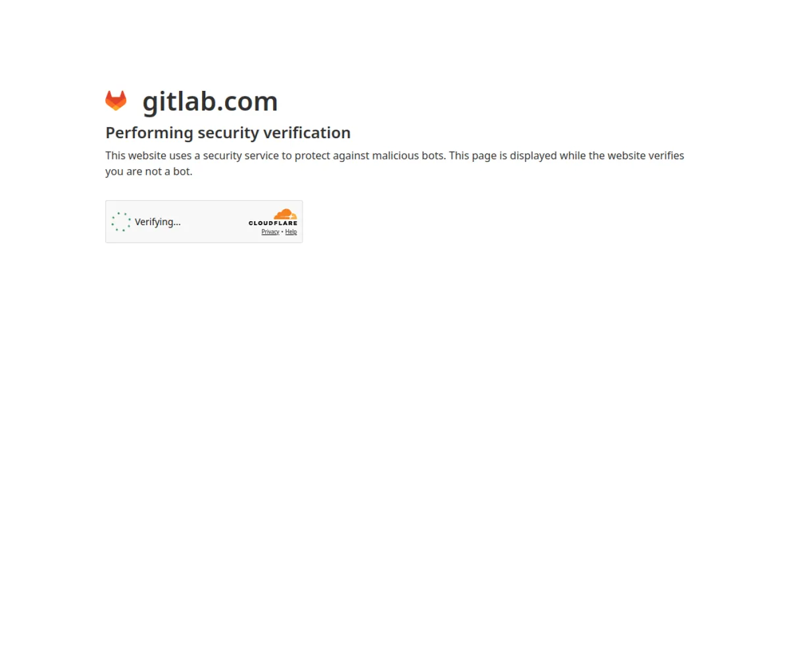</a> | [GitLab](references/17-gitlab/README.md) · [official product](https://gitlab.com/dashboard/projects) | owner-published media, 2 named gaps | Developer tools | sidebar-content: Leading navigation or collection list beside a dominant content area. Panels: toolbar/header (top); navigation/list sidebar (leading); primary canvas/content (center). Density: low; confidence: high. | Study project hierarchy, merge-request workflows, pipeline status visualization, issue boards, and role-aware navigation patterns. |
| 18 |  | [Vercel](references/18-vercel/README.md) · [official product](https://vercel.com/dashboard) | owner-published media, 2 named gaps | Developer infrastructure | sidebar-content: Leading navigation or collection list beside a dominant content area. Panels: toolbar/header (top); status/action bar (bottom); navigation/list sidebar (leading); data table/list (center). Density: low; confidence: medium. | Study project dashboards, deployment timelines, build-log states, environment configuration, domain status, and failure recovery paths. |
| 19 |  | [Netlify](references/19-netlify/README.md) · [official product](https://app.netlify.com/) | owner-published media, 2 named gaps | Developer infrastructure | single-surface: One dominant content surface without a stable secondary panel detected. Panels: toolbar/header (top); primary canvas/content (center). Density: low; confidence: low. | Study team and site switching, deploy history, build progress, configuration forms, and actionable failed-deployment states. |
| 20 | <a href="https://sentry.io/">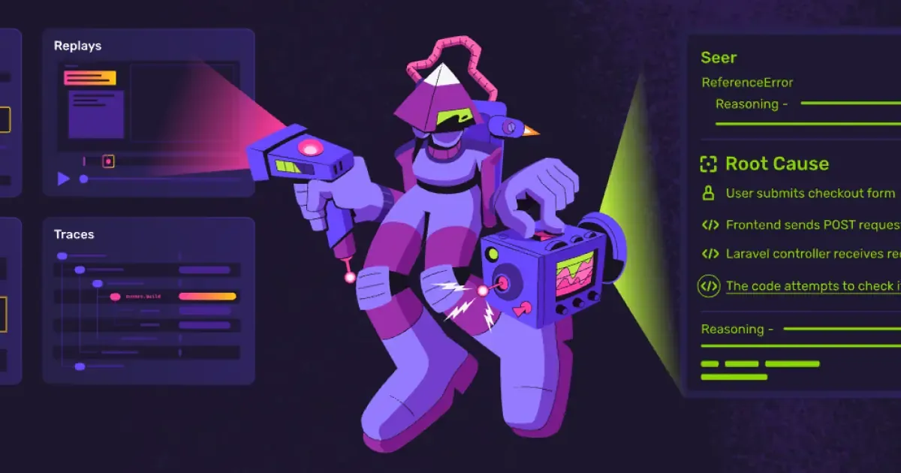</a> | [Sentry](references/20-sentry/README.md) · [official product](https://sentry.io/) | owner-published media, 2 named gaps | Developer observability | content-inspector: Dominant content area with a trailing detail or property inspector. Panels: toolbar/header (top); detail/inspector (trailing); primary canvas/content (center). Density: low; confidence: medium. | Study issue triage, stack-trace disclosure, event filtering, severity state, loading charts, and resolution workflow design. |
| 21 | <a href="https://web.postman.co/">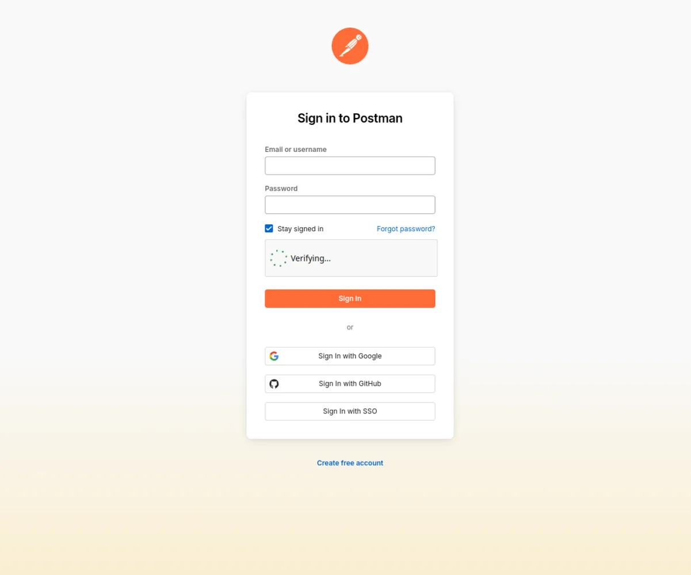</a> | [Postman](references/21-postman/README.md) · [official product](https://web.postman.co/) | owner-published media, 2 named gaps | API development | sidebar-content-inspector: Leading navigation, central work area, and trailing detail inspector. Panels: toolbar/header (top); navigation/list sidebar (leading); detail/inspector (trailing); primary canvas/content (center). Density: low; confidence: medium. | Study workspace and collection navigation, request composition, tab persistence, response states, and environment-variable controls. |
| 22 | <a href="https://replit.com/">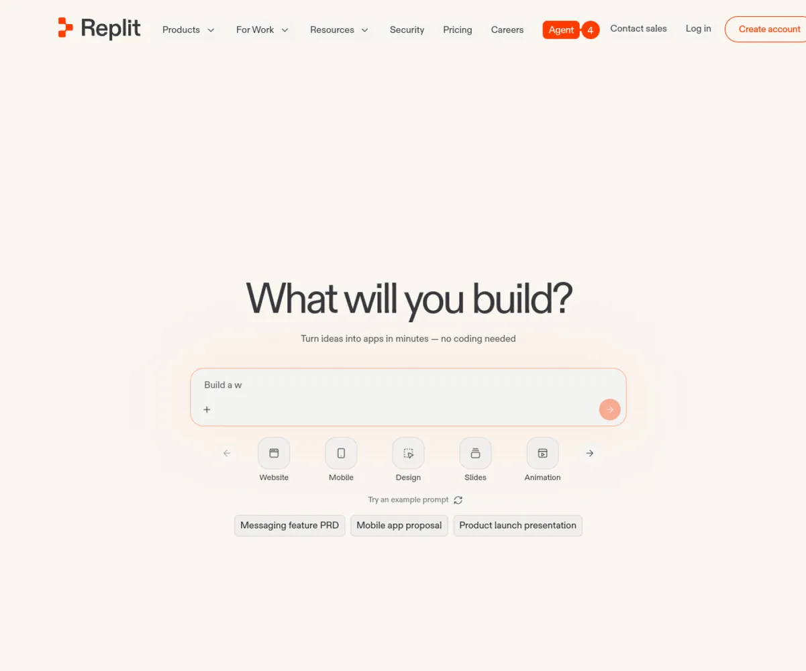</a> | [Replit](references/22-replit/README.md) · [official product](https://replit.com/) | owner-published media, 2 named gaps | Cloud development | sidebar-content-inspector: Leading navigation, central work area, and trailing detail inspector. Panels: toolbar/header (top); status/action bar (bottom); navigation/list sidebar (leading); primary canvas/content (center). Density: low; confidence: medium. | Study project creation, browser IDE layout, run and console feedback, multiplayer presence, and constrained responsive panels. |
| 23 | <a href="https://supabase.com/dashboard">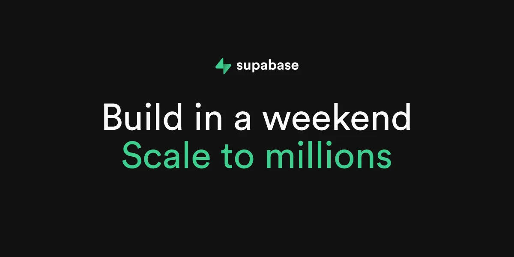</a> | [Supabase](references/23-supabase/README.md) · [official product](https://supabase.com/dashboard) | owner-published media, 2 named gaps | Backend development | sidebar-content-inspector: Leading navigation, central work area, and trailing detail inspector. Panels: toolbar/header (top); navigation/list sidebar (leading); detail/inspector (trailing); data table/list (center). Density: low; confidence: medium. | Study organization-to-project navigation, table editing, SQL execution, authentication management, logs, and destructive-action confirmation. |
| 24 | <a href="https://dash.cloudflare.com/">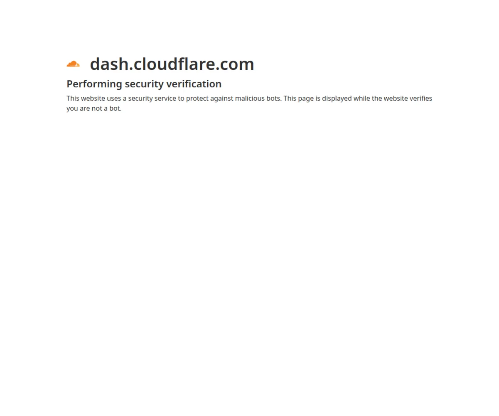</a> | [Cloudflare Dashboard](references/24-cloudflare-dashboard/README.md) · [official product](https://dash.cloudflare.com/) | owner-published media, 2 named gaps | Web infrastructure and operations | sidebar-content: Leading navigation or collection list beside a dominant content area. Panels: toolbar/header (top); navigation/list sidebar (leading); primary canvas/content (center). Density: low; confidence: high. | Study account and domain switching, service navigation, analytics loading states, DNS editing, and configuration validation feedback. |
| 25 | <a href="https://dashboard.stripe.com/">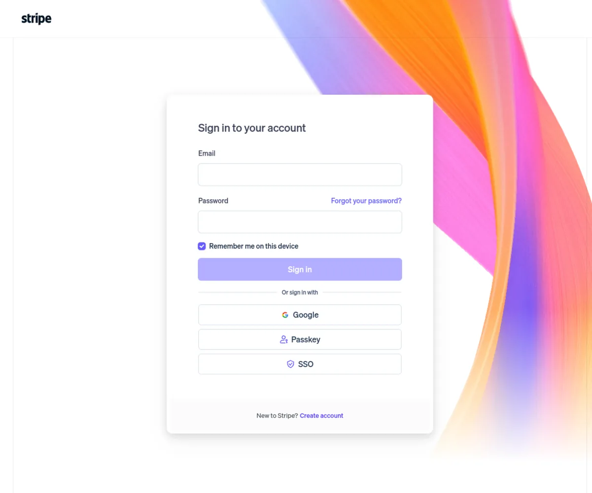</a> | [Stripe Dashboard](references/25-stripe-dashboard/README.md) · [official product](https://dashboard.stripe.com/) | owner-published media, 2 named gaps | Finance and payments | sidebar-content-inspector: Leading navigation, central work area, and trailing detail inspector. Panels: toolbar/header (top); status/action bar (bottom); navigation/list sidebar (leading); detail/inspector (trailing); data table/list (center). Density: low; confidence: medium. | Study global test-mode state, transaction tables, payment detail timelines, filtering, dispute workflows, and empty analytics panels. |
| 26 |  | [QuickBooks Online](references/26-quickbooks-online/README.md) · [official product](https://qbo.intuit.com/) | owner-published media, 2 named gaps | Finance and accounting | sidebar-content-inspector: Leading navigation, central work area, and trailing detail inspector. Panels: toolbar/header (top); navigation/list sidebar (leading); detail/inspector (trailing); primary canvas/content (center). Density: low; confidence: medium. | Study accounting navigation, transaction categorization, reconciliation workflows, dashboard summaries, and form-level validation states. |
| 27 | <a href="https://go.xero.com/">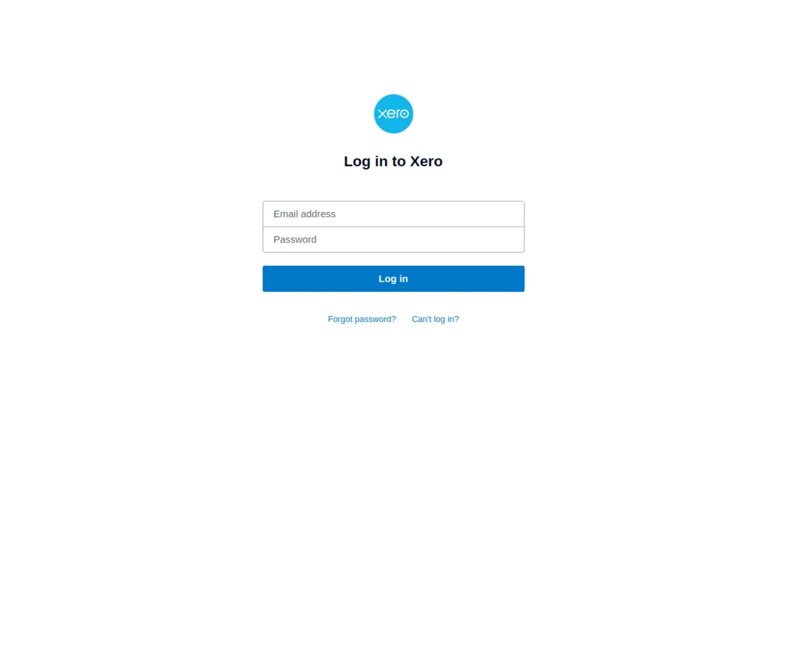</a> | [Xero](references/27-xero/README.md) · [official product](https://go.xero.com/) | owner-published media, 2 named gaps | Finance and accounting | sidebar-content-inspector: Leading navigation, central work area, and trailing detail inspector. Panels: toolbar/header (top); navigation/list sidebar (leading); detail/inspector (trailing); primary canvas/content (center). Density: low; confidence: medium. | Study organization switching, bank reconciliation, invoice status, financial summaries, and exception handling in transaction workflows. |
| 28 |  | [Wise](references/28-wise/README.md) · [official product](https://wise.com/) | owner-published media, 2 named gaps | Finance and international payments | sidebar-content: Leading navigation or collection list beside a dominant content area. Panels: toolbar/header (top); navigation/list sidebar (leading); primary canvas/content (center). Density: low; confidence: medium. | Study multi-currency account presentation, recipient setup, transfer progress, fee disclosure, verification, and error-prevention patterns. |
| 29 | <a href="https://app.ramp.com/">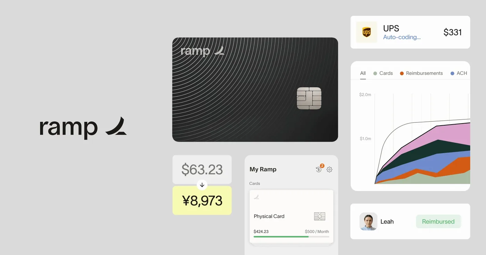</a> | [Ramp](references/29-ramp/README.md) · [official product](https://app.ramp.com/) | owner-published media, 2 named gaps | Finance and spend operations | sidebar-content-inspector: Leading navigation, central work area, and trailing detail inspector. Panels: toolbar/header (top); navigation/list sidebar (leading); detail/inspector (trailing); data table/list (center). Density: low; confidence: medium. | Study spend-control navigation, card and reimbursement workflows, approval queues, receipt-missing states, and policy exception messaging. |
| 30 | <a href="https://app.mercury.com/">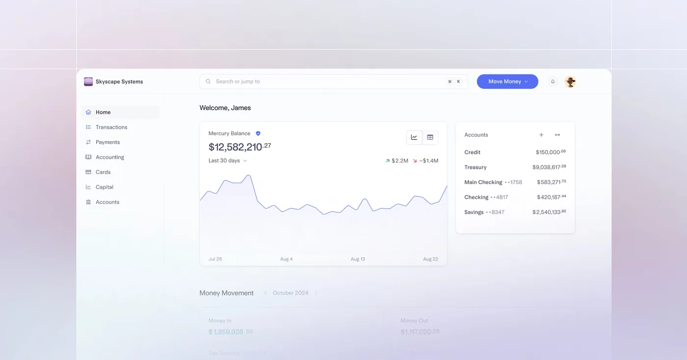</a> | [Mercury](references/30-mercury/README.md) · [official product](https://app.mercury.com/) | owner-published media, 2 named gaps | Business banking | sidebar-content-inspector: Leading navigation, central work area, and trailing detail inspector. Panels: toolbar/header (top); navigation/list sidebar (leading); detail/inspector (trailing); primary canvas/content (center). Density: low; confidence: medium. | Study account balances, transaction detail, payment creation, approval state, recipient management, and sensitive-action confirmation. |
| 31 | <a href="https://www.zendesk.com/login/">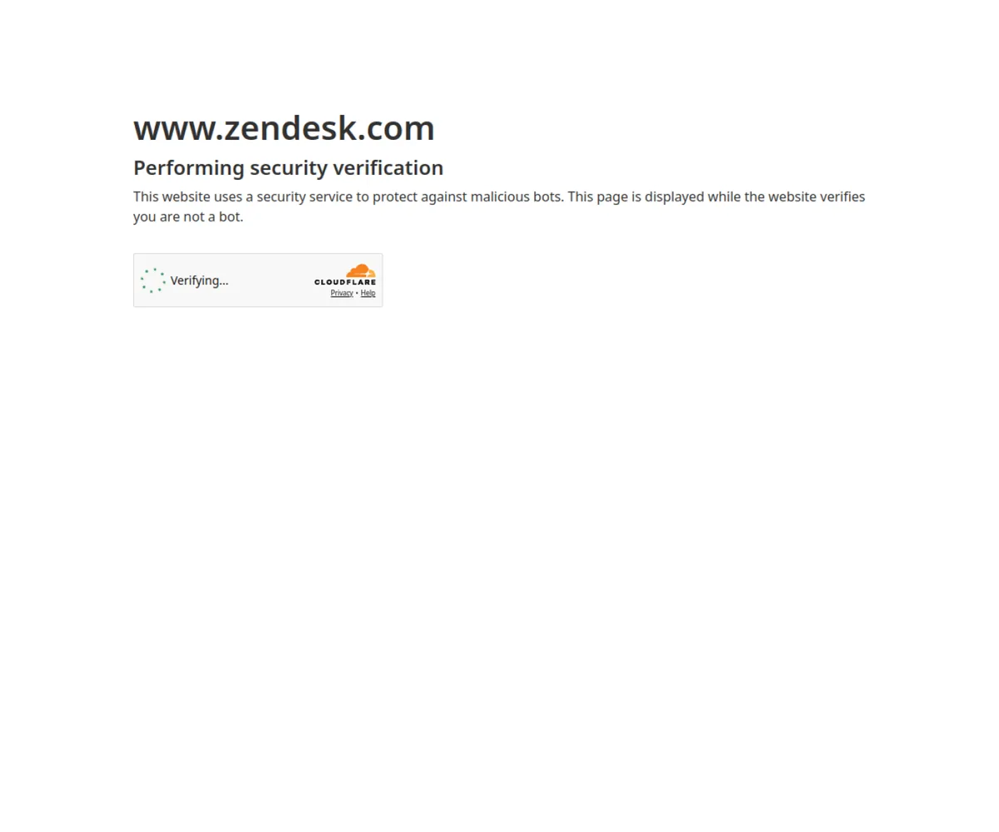</a> | [Zendesk](references/31-zendesk/README.md) · [official product](https://www.zendesk.com/login/) | owner-published media, 2 named gaps | Customer support operations | sidebar-content: Leading navigation or collection list beside a dominant content area. Panels: toolbar/header (top); navigation/list sidebar (leading); data table/list (center). Density: low; confidence: high. | Study agent workspace routing, ticket status and assignment, conversation chronology, macros, and queue-oriented information density. |
| 32 | <a href="https://app.intercom.com/">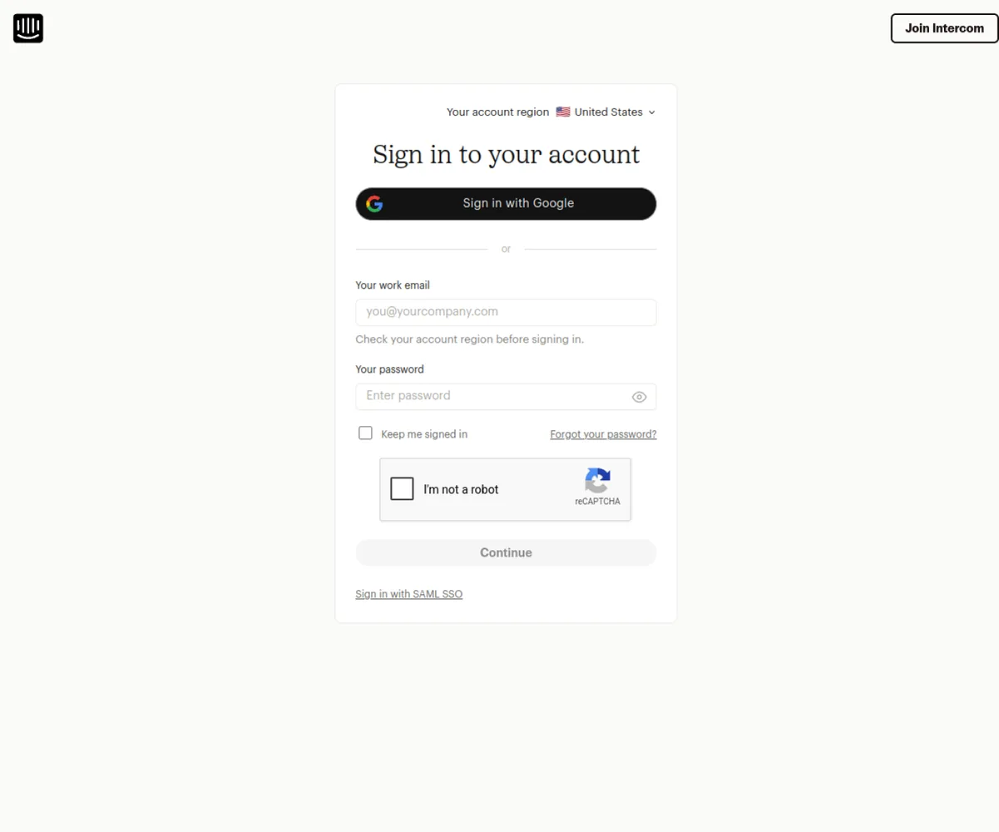</a> | [Intercom](references/32-intercom/README.md) · [official product](https://app.intercom.com/) | owner-published media, 2 named gaps | Customer communication operations | sidebar-content: Leading navigation or collection list beside a dominant content area. Panels: toolbar/header (top); navigation/list sidebar (leading); data table/list (center). Density: low; confidence: high. | Study shared inbox navigation, assignment state, conversation context, automation handoffs, and empty queue or search states. |
| 33 |  | [Freshdesk](references/33-freshdesk/README.md) · [official product](https://freshdesk.com/login) | owner-published media, 2 named gaps | Customer support operations | table-or-list: Single dominant table or list with controls around its perimeter. Panels: toolbar/header (top); data table/list (center). Density: low; confidence: medium. | Study ticket list filtering, priority and SLA indicators, agent assignment, response composition, and status-transition workflows. |
| 34 |  | [Jira](references/34-jira/README.md) · [official product](https://start.atlassian.com/) | owner-published media, 2 named gaps | Product and engineering operations | single-surface: One dominant content surface without a stable secondary panel detected. Panels: toolbar/header (top); primary canvas/content (center). Density: low; confidence: low. | Study project switching, issue creation, backlog-to-board movement, workflow status, filters, and permission-aware screen states. |
| 35 |  | [Airtable](references/35-airtable/README.md) · [official product](https://airtable.com/) | owner-published media, 2 named gaps | Data work and operations | sidebar-content-inspector: Leading navigation, central work area, and trailing detail inspector. Panels: toolbar/header (top); navigation/list sidebar (leading); detail/inspector (trailing); data table/list (center). Density: low; confidence: medium. | Study base and workspace navigation, spreadsheet-database interaction, field configuration, view switching, and collaborative record detail. |
| 36 | <a href="https://admin.shopify.com/">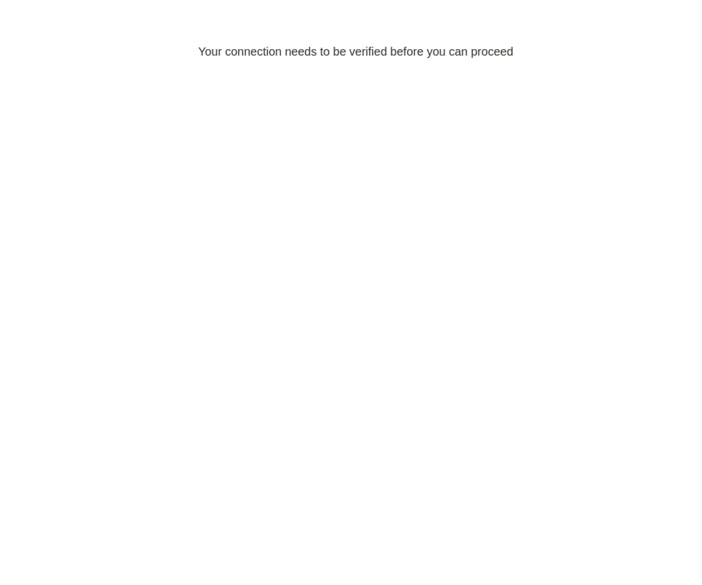</a> | [Shopify Admin](references/36-shopify-admin/README.md) · [official product](https://admin.shopify.com/) | owner-published media, 2 named gaps | Commerce operations | sidebar-content-inspector: Leading navigation, central work area, and trailing detail inspector. Panels: toolbar/header (top); navigation/list sidebar (leading); detail/inspector (trailing); data table/list (center). Density: low; confidence: medium. | Study admin navigation, product editing, order lifecycle status, bulk actions, analytics summaries, and responsive operational tables. |
| 37 | <a href="https://squareup.com/dashboard">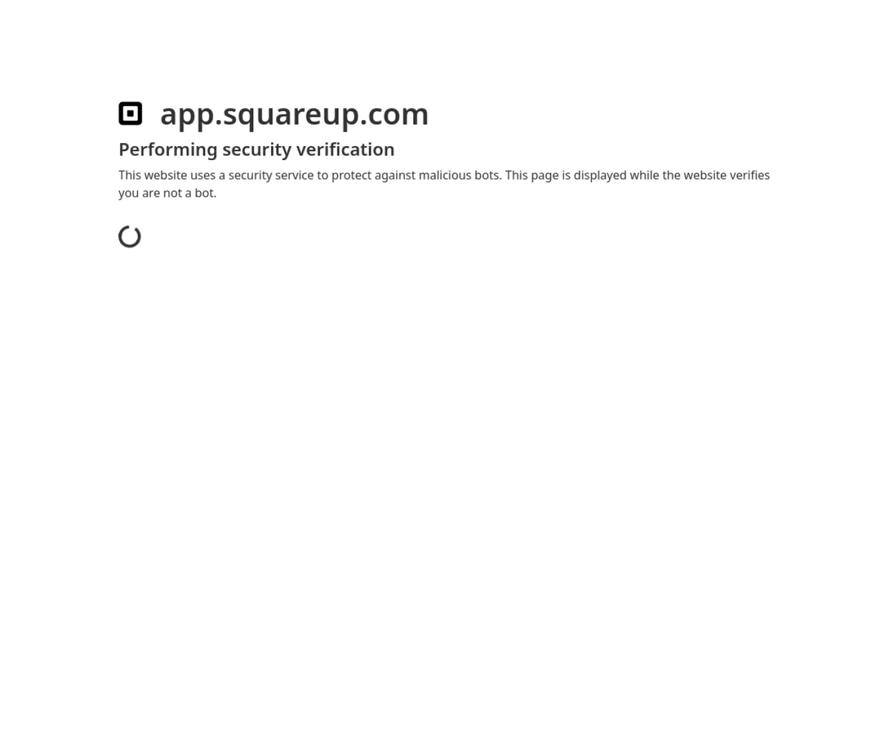</a> | [Square Dashboard](references/37-square-dashboard/README.md) · [official product](https://squareup.com/dashboard) | owner-published media, 2 named gaps | Commerce and payments | sidebar-content: Leading navigation or collection list beside a dominant content area. Panels: toolbar/header (top); navigation/list sidebar (leading); data table/list (center). Density: low; confidence: medium. | Study location switching, sales summaries, item and inventory management, transaction detail, and onboarding checklist states. |
| 38 | <a href="https://login.bigcommerce.com/">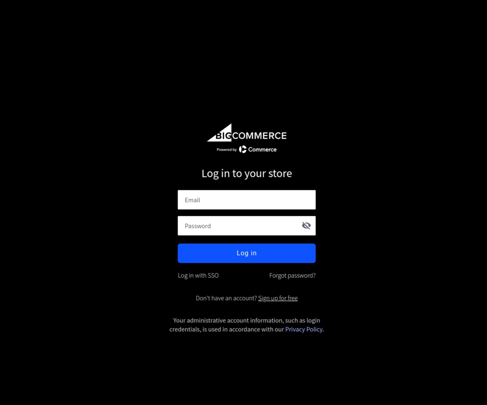</a> | [BigCommerce](references/38-bigcommerce/README.md) · [official product](https://login.bigcommerce.com/) | owner-published media, 2 named gaps | Commerce operations | sidebar-content-inspector: Leading navigation, central work area, and trailing detail inspector. Panels: toolbar/header (top); status/action bar (bottom); navigation/list sidebar (leading); detail/inspector (trailing); primary canvas/content (center). Density: low; confidence: medium. | Study store switching, catalog management, order states, channel configuration, and validation across complex product forms. |
| 39 | <a href="https://www.klaviyo.com/login">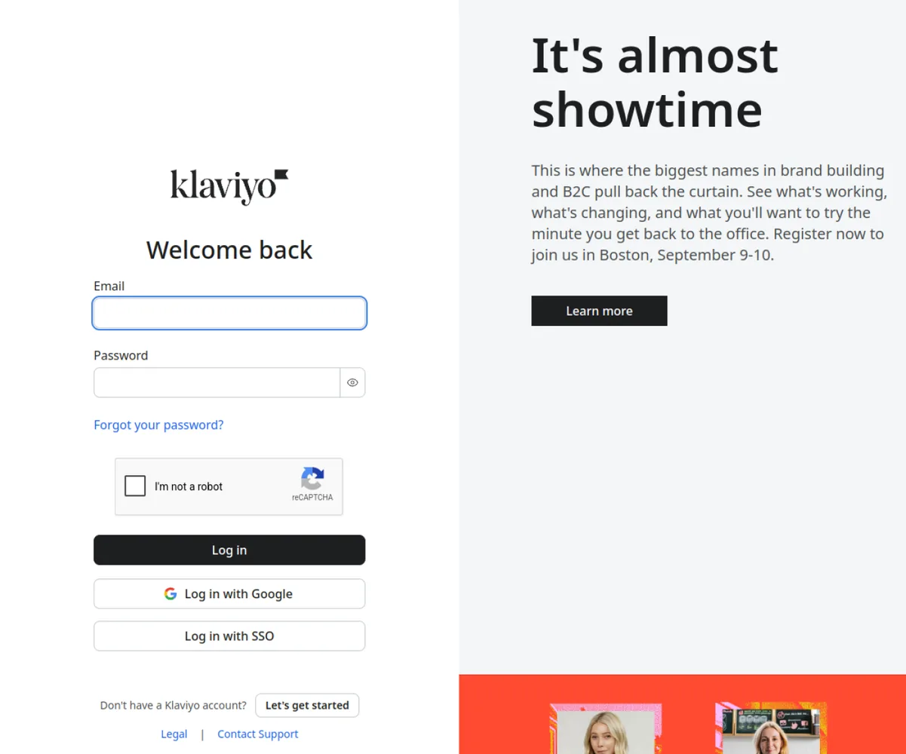</a> | [Klaviyo](references/39-klaviyo/README.md) · [official product](https://www.klaviyo.com/login) | owner-published media, 2 named gaps | Commerce marketing operations | sidebar-content-inspector: Leading navigation, central work area, and trailing detail inspector. Panels: toolbar/header (top); status/action bar (bottom); navigation/list sidebar (leading); detail/inspector (trailing); primary canvas/content (center). Density: low; confidence: medium. | Study campaign and flow navigation, audience segmentation, message-building steps, performance reporting, and send-readiness checks. |
| 40 | <a href="https://drive.google.com/">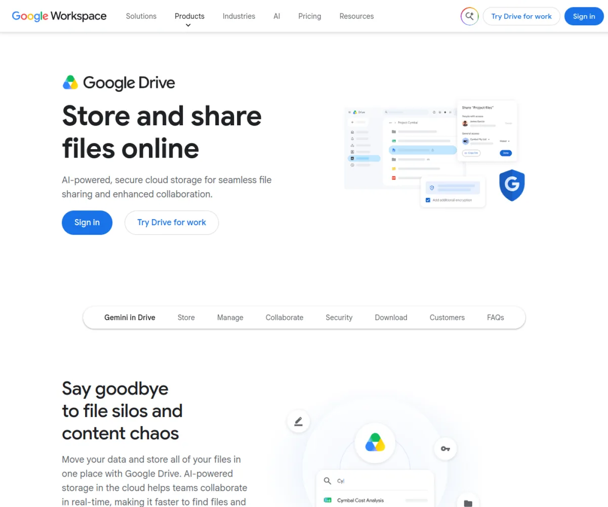</a> | [Google Drive](references/40-google-drive/README.md) · [official product](https://drive.google.com/) | owner-published media, 2 named gaps | Productivity and file management | sidebar-content: Leading navigation or collection list beside a dominant content area. Panels: toolbar/header (top); status/action bar (bottom); navigation/list sidebar (leading); data table/list (center). Density: low; confidence: high. | Study file hierarchy, list and grid views, selection actions, upload progress, sharing permissions, and empty-folder states. |
| 41 |  | [Dropbox](references/41-dropbox/README.md) · [official product](https://www.dropbox.com/home) | owner-published media, 2 named gaps | Productivity and file management | sidebar-content: Leading navigation or collection list beside a dominant content area. Panels: toolbar/header (top); navigation/list sidebar (leading); data table/list (center). Density: low; confidence: high. | Study file browsing, breadcrumb navigation, sync and sharing status, preview workflows, bulk actions, and responsive table behavior. |
| 42 |  | [Todoist](references/42-todoist/README.md) · [official product](https://app.todoist.com/) | owner-published media, 2 named gaps | Personal productivity | sidebar-content-inspector: Leading navigation, central work area, and trailing detail inspector. Panels: toolbar/header (top); navigation/list sidebar (leading); detail/inspector (trailing); data table/list (center). Density: low; confidence: medium. | Study quick task capture, project navigation, natural-language scheduling, completion feedback, filters, and empty-list encouragement. |
| 43 | <a href="https://calendly.com/">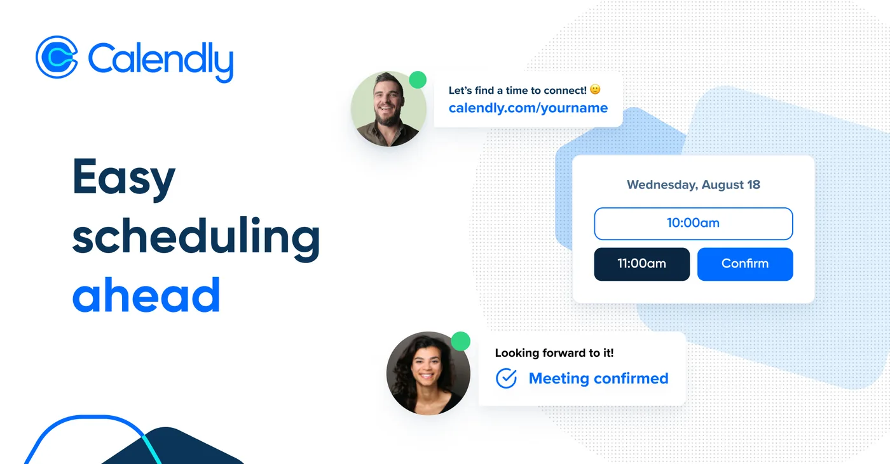</a> | [Calendly](references/43-calendly/README.md) · [official product](https://calendly.com/) | owner-published media, 2 named gaps | Scheduling productivity | content-inspector: Dominant content area with a trailing detail or property inspector. Panels: toolbar/header (top); detail/inspector (trailing); primary canvas/content (center). Density: low; confidence: medium. | Study event-type management, availability configuration, booking flow preview, integration status, and no-appointment empty states. |
| 44 | <a href="https://app.frontapp.com/">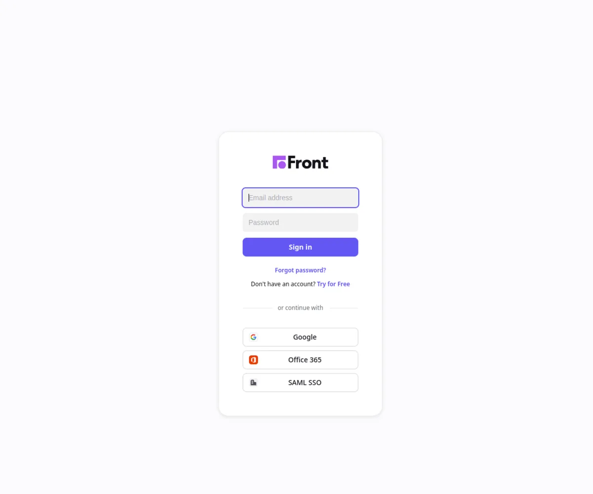</a> | [Front](references/44-front/README.md) · [official product](https://app.frontapp.com/) | owner-published media, 2 named gaps | Team communication operations | sidebar-content-inspector: Leading navigation, central work area, and trailing detail inspector. Panels: toolbar/header (top); status/action bar (bottom); navigation/list sidebar (leading); detail/inspector (trailing); data table/list (center). Density: low; confidence: medium. | Study shared-inbox structure, conversation assignment, internal comments, collision awareness, snoozing, and queue state transitions. |
| 45 | <a href="https://app.snowflake.com/">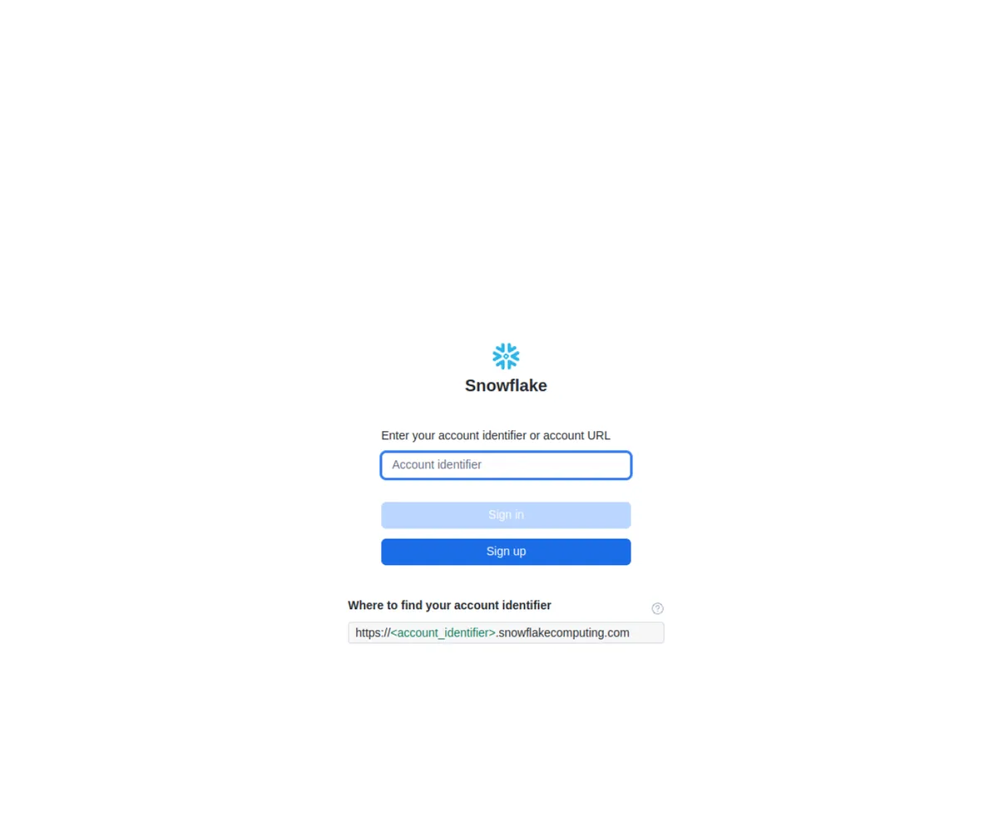</a> | [Snowflake Snowsight](references/45-snowflake-snowsight/README.md) · [official product](https://app.snowflake.com/) | owner-published media, 2 named gaps | Data platform | sidebar-content-inspector: Leading navigation, central work area, and trailing detail inspector. Panels: toolbar/header (top); navigation/list sidebar (leading); detail/inspector (trailing); data table/list (center). Density: low; confidence: medium. | Study account and role context, worksheet tabs, query execution states, results exploration, warehouse status, and error messaging. |
| 46 | <a href="https://online.tableau.com/">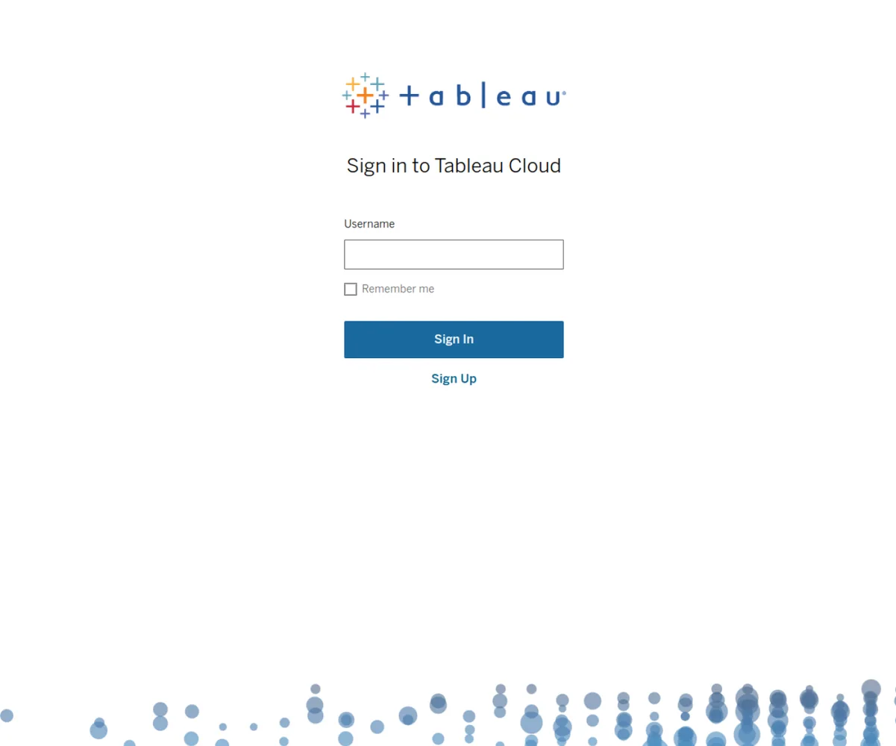</a> | [Tableau Cloud](references/46-tableau-cloud/README.md) · [official product](https://online.tableau.com/) | owner-published media, 2 named gaps | Business intelligence | sidebar-content-inspector: Leading navigation, central work area, and trailing detail inspector. Panels: toolbar/header (top); navigation/list sidebar (leading); detail/inspector (trailing); data table/list (center). Density: low; confidence: medium. | Study content hierarchy, workbook navigation, dashboard filters, loading visualizations, sharing permissions, and responsive report layouts. |
| 47 | <a href="https://app.powerbi.com/">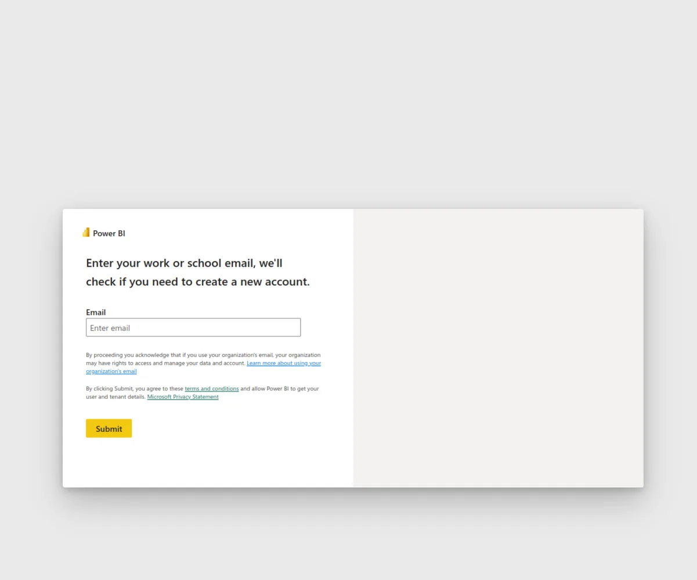</a> | [Microsoft Power BI](references/47-microsoft-power-bi/README.md) · [official product](https://app.powerbi.com/) | owner-published media, 2 named gaps | Business intelligence | sidebar-content: Leading navigation or collection list beside a dominant content area. Panels: toolbar/header (top); status/action bar (bottom); navigation/list sidebar (leading); primary canvas/content (center). Density: low; confidence: high. | Study workspace navigation, report and dataset relationships, filter panes, refresh status, permissions, and visualization loading states. |
| 48 | <a href="https://lookerstudio.google.com/">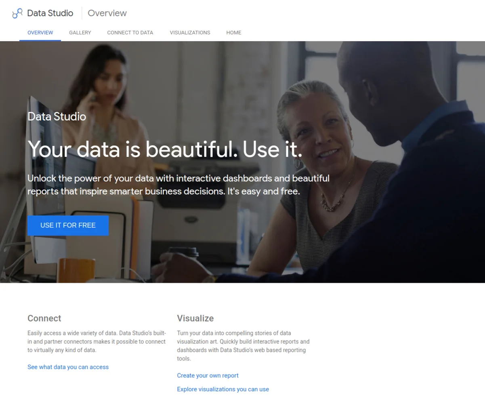</a> | [Looker Studio](references/48-looker-studio/README.md) · [official product](https://lookerstudio.google.com/) | owner-published media, 2 named gaps | Data visualization | sidebar-content: Leading navigation or collection list beside a dominant content area. Panels: toolbar/header (top); navigation/list sidebar (leading); primary canvas/content (center). Density: low; confidence: medium. | Study report browsing, edit-versus-view modes, chart configuration, data-source connection states, and responsive canvas controls. |
| 49 | <a href="https://cloud.getdbt.com/">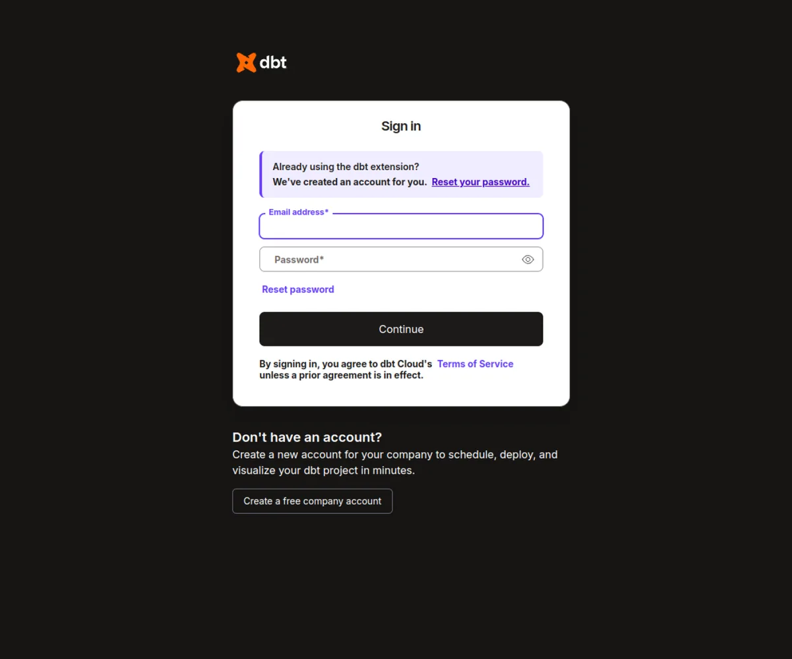</a> | [dbt Cloud](references/49-dbt-cloud/README.md) · [official product](https://cloud.getdbt.com/) | owner-published media, 2 named gaps | Analytics engineering | sidebar-content-inspector: Leading navigation, central work area, and trailing detail inspector. Panels: toolbar/header (top); navigation/list sidebar (leading); detail/inspector (trailing); data table/list (center). Density: low; confidence: medium. | Study project and environment navigation, job-run timelines, model lineage, IDE feedback, documentation, and failed-build diagnostics. |
| 50 | <a href="https://app.hex.tech/">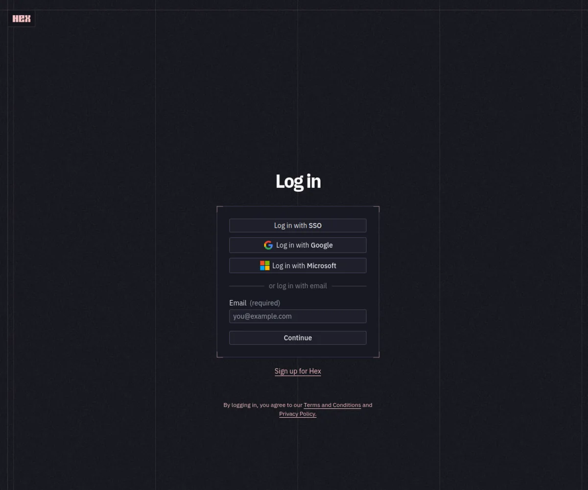</a> | [Hex](references/50-hex/README.md) · [official product](https://app.hex.tech/) | owner-published media, 2 named gaps | Collaborative data work | sidebar-content-inspector: Leading navigation, central work area, and trailing detail inspector. Panels: toolbar/header (top); status/action bar (bottom); navigation/list sidebar (leading); detail/inspector (trailing); data table/list (center). Density: low; confidence: medium. | Study project browsing, notebook cell execution, parameterized apps, collaborative comments, compute state, and published-result transitions. |

Normalized panel bounds, detected separators, image dimensions, source-image URLs, hashes, and analysis confidence are recorded in [`sources.json`](sources.json). Media kinds, measured durations, provenance classes, and per-record gaps are in [`references.json`](references.json).

Attribution and product ownership remain with the linked source.
