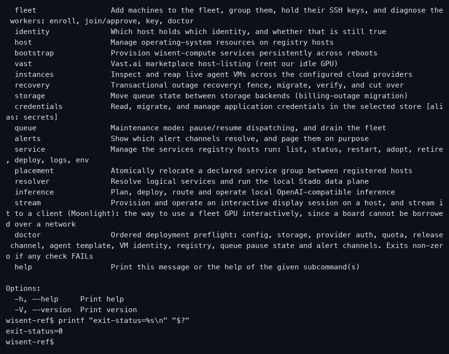
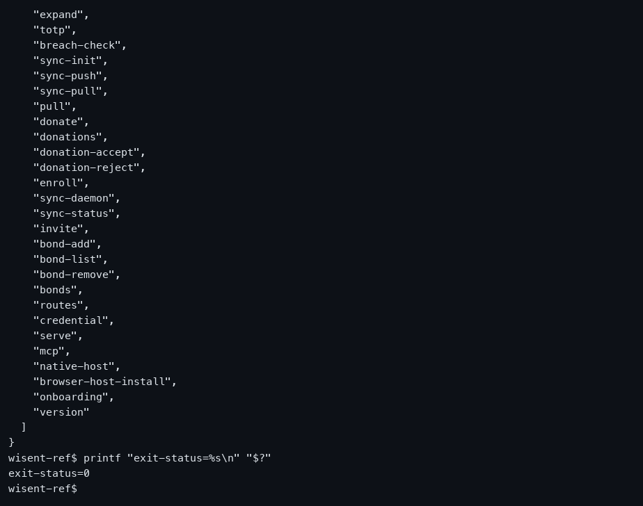
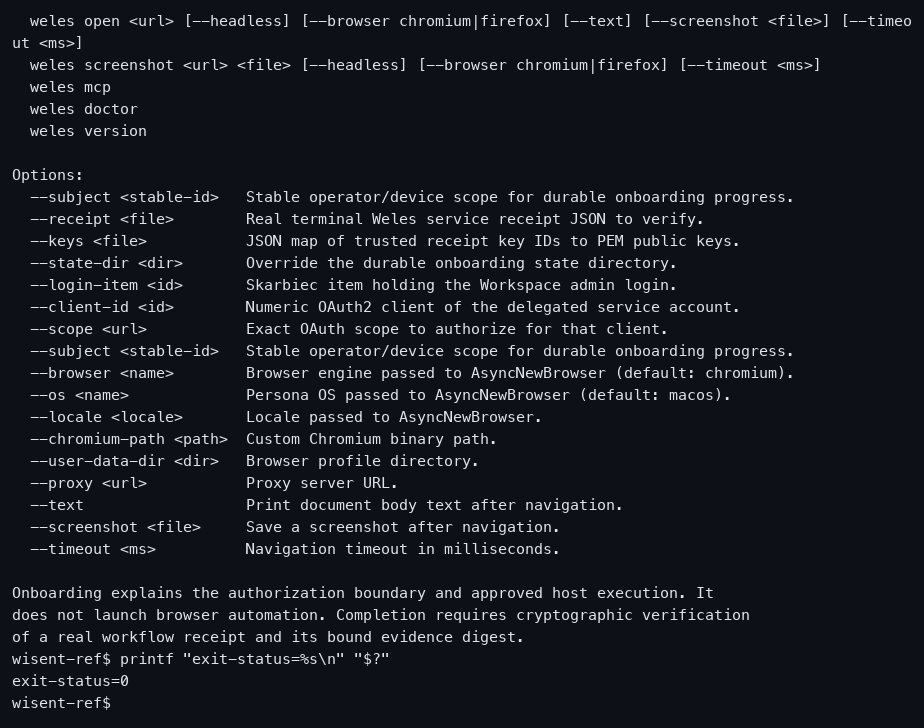
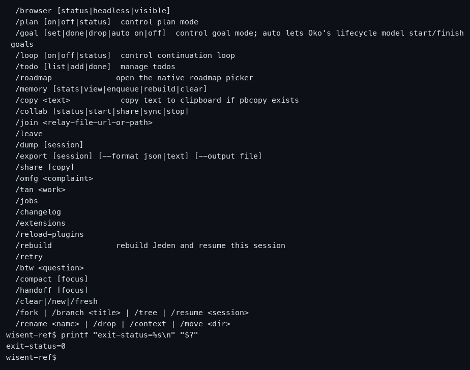
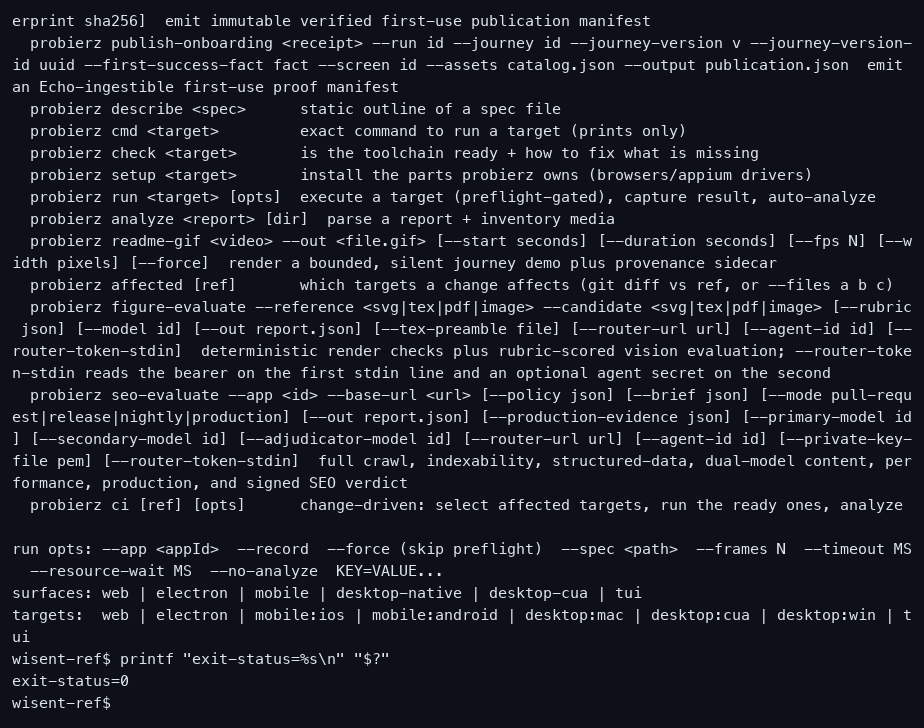
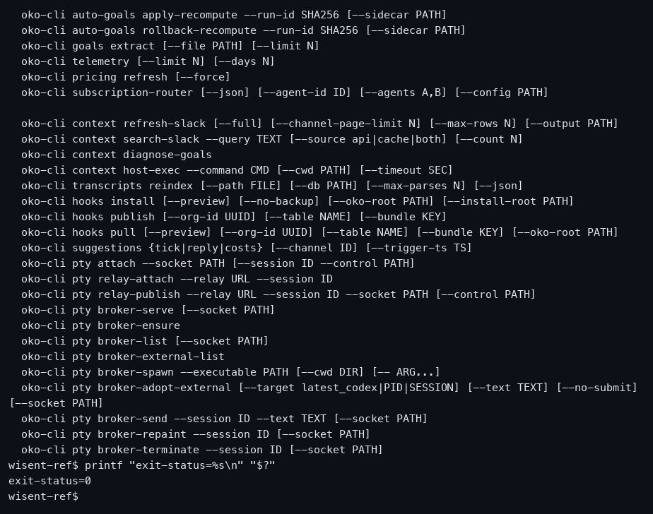
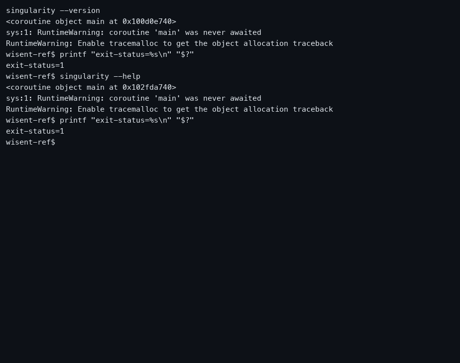
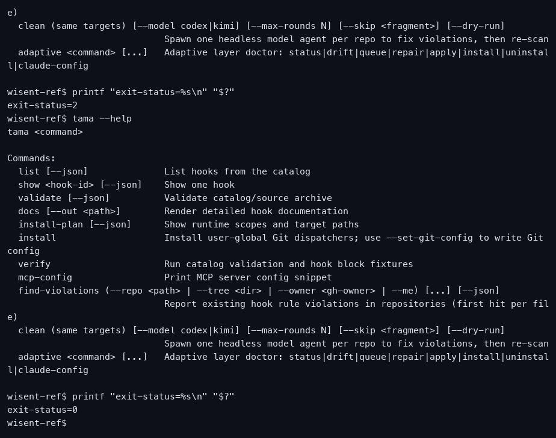
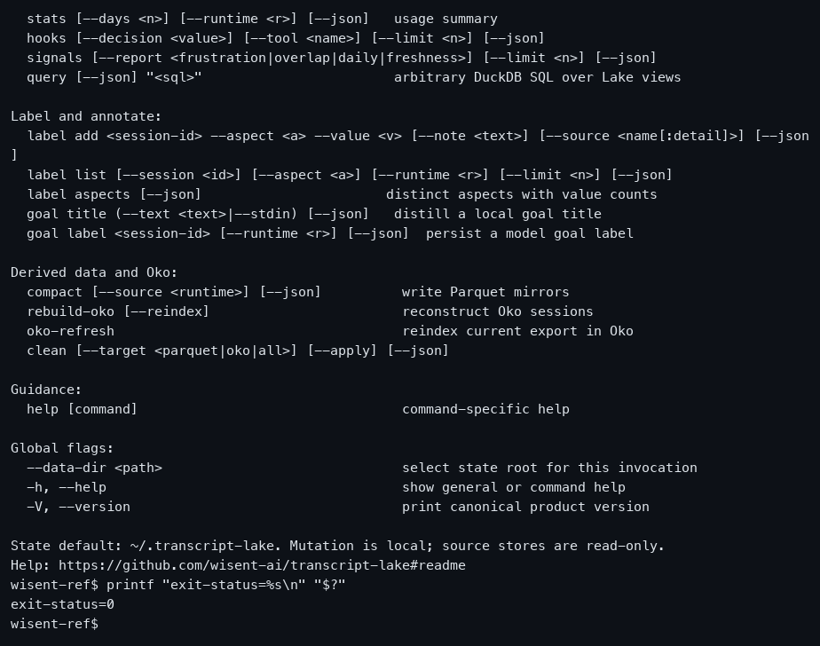
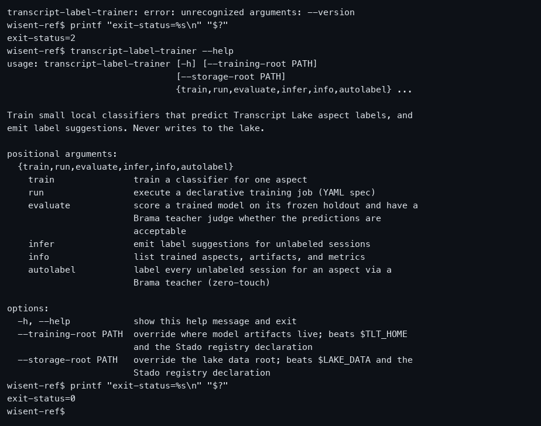

# Wisent product examples

The Wisent products with a runnable CLI on the capture host, each measured by running it: version form, top-level help, one subcommand help surface, one invalid flag, a Ctrl-C on an unsubmitted line, the recovering help, and the same help with NO_COLOR=1.

Each entry pairs an attributed overview image and a measured panel anatomy with a per-product record: motion evidence, named states, an observed first-success journey, interaction and recovery behavior, accessibility observations, and provenance. Every number below is measured by `verify-reference-evidence.py`, and a record that is missing evidence says so in its own `evidence_gaps`.

**Examples:** 10  
**Images:** 10  
**Structural analyses:** 10  
**Records with no remaining gap:** 10  
**Records with named gaps:** 0 (0 gaps)  
**Motion provenance:** 10 product run here  
**Curated:** 2026-08-19  
**Visual source data:** [`sources.json`](sources.json)  
**Record index:** [`references.json`](references.json)  
**Cross-example synthesis:** [`full-reference.md`](full-reference.md)

| # | Reference image | Record | Motion evidence | Category | Interface structure | What to study |
|---:|---|---|---|---|---|---|
| 1 |  | [Stado](references/01-stado/README.md) · [official product](https://github.com/wisent-ai/stado) | product run here, no remaining gap | Infrastructure / compute and queue control plane | single-terminal-surface: One 100-column pseudo-terminal surface retaining the product help as selectable text. Panels: terminal transcript (full canvas). Density: medium; confidence: 1.0. | The widest command surface we ship: a Clap-style noun tree over jobs, hosts, quota and credits. Study how a large control-plane CLI keeps its top-level help to one screen of verbs and pushes detail into per-command help. |
| 2 |  | [Skarbiec](references/02-skarbiec/README.md) · [official product](https://github.com/wisent-ai/skarbiec) | product run here, no remaining gap | Security / credential and authentication management | single-terminal-surface: One 100-column pseudo-terminal surface retaining the product help as selectable text. Panels: terminal transcript (full canvas). Density: medium; confidence: 1.0. | The only product here whose help is machine-readable JSON rather than prose, and the only one whose first refusal is a state gate rather than a parse error. Study what a credential CLI is willing to say before a vault exists. |
| 3 |  | [Weles](references/03-weles/README.md) · [official product](https://github.com/wisent-ai/weles) | product run here, no remaining gap | Automation / authorized browser execution | single-terminal-surface: One 100-column pseudo-terminal surface retaining the product help as selectable text. Panels: terminal transcript (full canvas). Density: medium; confidence: 1.0. | A CLI whose real work is gated on an authorization boundary, so its safe surface is help and identity only. Study how a product that refuses unauthorized work advertises that boundary in its own usage text. |
| 4 |  | [Jeden](references/04-jeden/README.md) · [official product](https://github.com/wisent-ai/jeden) | product run here, no remaining gap | Agents / autonomous coding and company building | single-terminal-surface: One 100-column pseudo-terminal surface retaining the product help as selectable text. Panels: terminal transcript (full canvas). Density: medium; confidence: 1.0. | A single-block usage synopsis for an agent runtime whose flags are permission grants (`--allow-write`, `--allow-command`, `--yolo`). Study how a dangerous capability set is presented in first-run help. |
| 5 |  | [Probierz](references/05-probierz/README.md) · [official product](https://github.com/wisent-ai/probierz) | product run here, no remaining gap | Quality / test execution and evidence boundary | single-terminal-surface: One 100-column pseudo-terminal surface retaining the product help as selectable text. Panels: terminal transcript (full canvas). Density: medium; confidence: 1.0. | The one product whose refusal is a structured machine-readable failure envelope rather than a usage dump. Study a CLI that answers an unknown surface with a parseable `probierz-failure` line plus one plain sentence. |
| 6 |  | [Oko (oko-cli)](references/06-oko-cli/README.md) · [official product](https://github.com/wisent-ai/oko) | product run here, no remaining gap | Observability / agent session inspection | single-terminal-surface: One 100-column pseudo-terminal surface retaining the product help as selectable text. Panels: terminal transcript (full canvas). Density: medium; confidence: 1.0. | A headless companion CLI with one flat usage block and no version form at all. Study the cost of that: the same text answers help, an unknown flag, and a subcommand help request, and only the exit status distinguishes them. |
| 7 |  | [Singularity](references/07-singularity/README.md) · [official product](https://github.com/wisent-ai/singularity) | product run here, no remaining gap | Agents / autonomous agent runtime | single-terminal-surface: One 100-column pseudo-terminal surface retaining the product help as selectable text. Panels: terminal transcript (full canvas). Density: medium; confidence: 1.0. | The narrowest installed surface in the catalog: one subcommand, `onboarding`. Study a product whose CLI deliberately exposes only the first-use journey. |
| 8 |  | [Tama (tama-cli)](references/08-tama/README.md) · [official product](https://github.com/wisent-ai/hooks-rotator) | product run here, no remaining gap | Policy / agent and Git hook catalog | single-terminal-surface: One 100-column pseudo-terminal surface retaining the product help as selectable text. Panels: terminal transcript (full canvas). Density: medium; confidence: 1.0. | A policy catalog CLI that answers `--help` after a subcommand by ignoring the flag and running the read-only command. Study how a hook installer separates a plan from an install. |
| 9 |  | [Transcript Lake](references/09-transcript-lake/README.md) · [official product](https://github.com/wisent-ai/transcript-lake) | product run here, no remaining gap | Data / local privacy-masked transcript archive | single-terminal-surface: One 100-column pseudo-terminal surface retaining the product help as selectable text. Panels: terminal transcript (full canvas). Density: medium; confidence: 1.0. | The only help here that opens with a `Start safely:` section and names the read-only commands first. Study help text that is ordered by risk rather than alphabetically. |
| 10 |  | [Transcript Label Trainer](references/10-transcript-label-trainer/README.md) · [official product](https://github.com/wisent-ai/transcript-label-trainer) | product run here, no remaining gap | Models / local classifiers over transcript labels | single-terminal-surface: One 100-column pseudo-terminal surface retaining the product help as selectable text. Panels: terminal transcript (full canvas). Density: medium; confidence: 1.0. | An argparse CLI that states its own boundary in the help body — 'Never writes to the lake.' Study a product that publishes what it will not touch above its command list. |

Normalized panel bounds, detected separators, image dimensions, source-image URLs, hashes, and analysis confidence are recorded in [`sources.json`](sources.json). Media kinds, measured durations, provenance classes, and per-record gaps are in [`references.json`](references.json).

Attribution and product ownership remain with the linked source.
